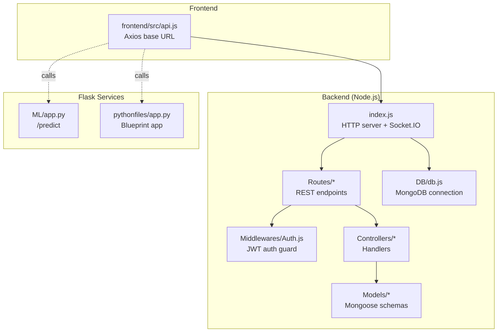
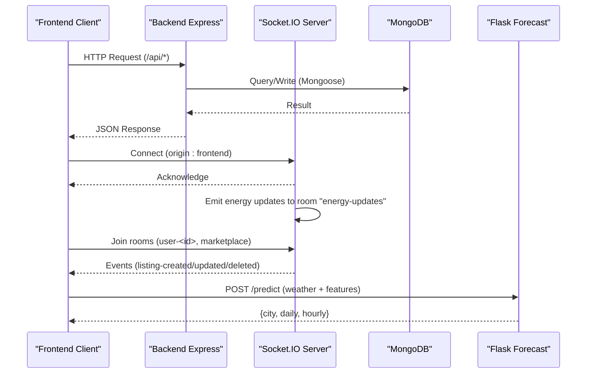
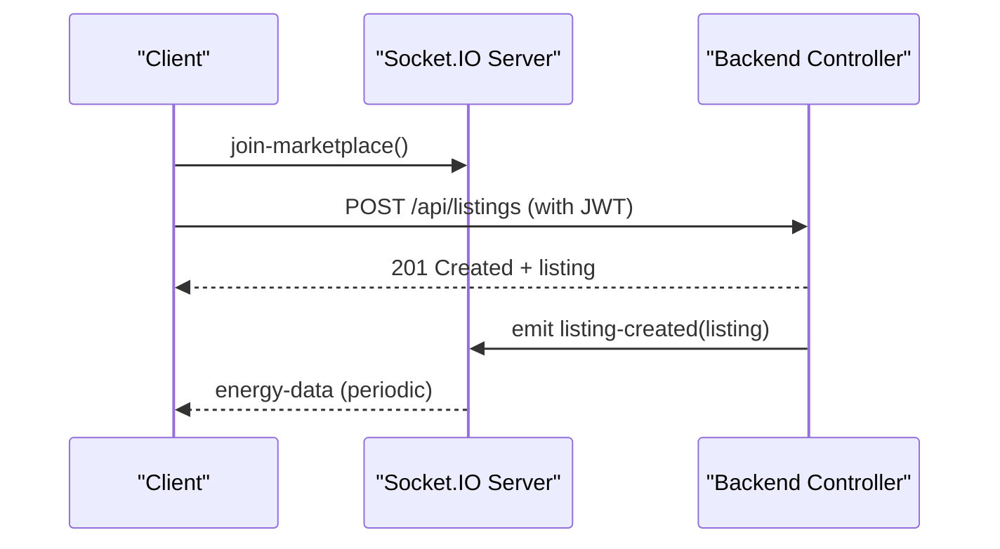
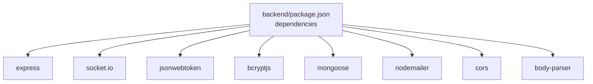

# API Reference

<cite>
**Referenced Files in This Document**
- [backend/index.js](file://backend/index.js)
- [backend/package.json](file://backend/package.json)
- [backend/Routes/AuthRouter.js](file://backend/Routes/AuthRouter.js)
- [backend/Routes/DashboardRouter.js](file://backend/Routes/DashboardRouter.js)
- [backend/Routes/CommunityRouter.js](file://backend/Routes/CommunityRouter.js)
- [backend/Routes/ListingRouter.js](file://backend/Routes/ListingRouter.js)
- [backend/Routes/TransactionRouter.js](file://backend/Routes/TransactionRouter.js)
- [backend/Middlewares/Auth.js](file://backend/Middlewares/Auth.js)
- [backend/Controllers/AuthController.js](file://backend/Controllers/AuthController.js)
- [backend/Controllers/DashboardController.js](file://backend/Controllers/DashboardController.js)
- [backend/Controllers/CommunityController.js](file://backend/Controllers/CommunityController.js)
- [backend/Controllers/ListingController.js](file://backend/Controllers/ListingController.js)
- [backend/Controllers/TransactionController.js](file://backend/Controllers/TransactionController.js)
- [backend/DB/db.js](file://backend/DB/db.js)
- [backend/Models/Users.js](file://backend/Models/Users.js)
- [backend/Models/UserProfile.js](file://backend/Models/UserProfile.js)
- [backend/Models/ResetCode.js](file://backend/Models/ResetCode.js)
- [backend/Models/googleuser.js](file://backend/Models/googleuser.js)
- [backend/Models/BlogPost.js](file://backend/Models/BlogPost.js)
- [backend/Models/EnergyListing.js](file://backend/Models/EnergyListing.js)
- [backend/Models/Transaction.js](file://backend/Models/Transaction.js)
- [backend/Models/EnergyData.js](file://backend/Models/EnergyData.js)
- [frontend/src/api.js](file://frontend/src/api.js)
- [ML/app.py](file://ML/app.py)
- [pythonfiles/app.py](file://pythonfiles/app.py)
</cite>

## Table of Contents
1. [Introduction](#introduction)
2. [Project Structure](#project-structure)
3. [Core Components](#core-components)
4. [Architecture Overview](#architecture-overview)
5. [Detailed Component Analysis](#detailed-component-analysis)
6. [Dependency Analysis](#dependency-analysis)
7. [Performance Considerations](#performance-considerations)
8. [Troubleshooting Guide](#troubleshooting-guide)
9. [Conclusion](#conclusion)
10. [Appendices](#appendices)

## Introduction
This document provides a comprehensive API reference for the EcoGrid platform. It covers:
- RESTful HTTP endpoints for Authentication, Dashboard Analytics, Marketplace (Listings), Transactions, and Community features
- WebSocket real-time APIs for live updates
- Flask-based energy forecasting endpoints
- Authentication methods (JWT and session-like cookies via credentials)
- Error response codes, rate limiting considerations, and API versioning strategies
- Parameter validation rules, input sanitization, and security headers
- Practical curl examples and SDK integration guidelines
- Testing strategies and mock data generation for development

## Project Structure
The API surface spans three primary areas:
- Node.js/Express backend with Socket.IO for real-time features
- Flask microservices for energy forecasting
- Frontend client integrating with the backend

**Diagram sources**
- [backend/index.js](file://backend/index.js#L14-L46)
- [backend/Routes/AuthRouter.js](file://backend/Routes/AuthRouter.js#L1-L15)
- [backend/Routes/DashboardRouter.js](file://backend/Routes/DashboardRouter.js#L1-L10)
- [backend/Routes/CommunityRouter.js](file://backend/Routes/CommunityRouter.js#L1-L14)
- [backend/Routes/ListingRouter.js](file://backend/Routes/ListingRouter.js#L1-L24)
- [backend/Routes/TransactionRouter.js](file://backend/Routes/TransactionRouter.js#L1-L11)
- [backend/Middlewares/Auth.js](file://backend/Middlewares/Auth.js)
- [backend/Controllers/AuthController.js](file://backend/Controllers/AuthController.js#L105-L155)
- [backend/Controllers/DashboardController.js](file://backend/Controllers/DashboardController.js#L4-L15)
- [backend/Controllers/CommunityController.js](file://backend/Controllers/CommunityController.js#L3-L27)
- [backend/Controllers/ListingController.js](file://backend/Controllers/ListingController.js#L5-L35)
- [backend/Controllers/TransactionController.js](file://backend/Controllers/TransactionController.js#L4-L16)
- [backend/DB/db.js](file://backend/DB/db.js)
- [ML/app.py](file://ML/app.py#L195-L248)
- [pythonfiles/app.py](file://pythonfiles/app.py#L1-L15)
- [frontend/src/api.js](file://frontend/src/api.js#L1-L10)

**Section sources**
- [backend/index.js](file://backend/index.js#L14-L46)
- [frontend/src/api.js](file://frontend/src/api.js#L1-L10)

## Core Components
- REST API base path: /api
- Dashboard base path: /api/dashboard
- Community base path: /api/community
- Socket.IO server for real-time events
- Flask forecasting service at port 5000
- Flask companion service at port 5001

Key runtime behaviors:
- CORS enabled for frontend origin
- Body parsing for JSON
- MongoDB connection initialized at startup
- Socket.IO emits periodic energy data and supports rooms for user and marketplace

**Section sources**
- [backend/index.js](file://backend/index.js#L26-L38)
- [backend/package.json](file://backend/package.json#L13-L27)
- [ML/app.py](file://ML/app.py#L1-L251)
- [pythonfiles/app.py](file://pythonfiles/app.py#L1-L15)

## Architecture Overview
High-level API architecture and data flow:

**Diagram sources**
- [backend/index.js](file://backend/index.js#L18-L73)
- [backend/Controllers/ListingController.js](file://backend/Controllers/ListingController.js#L81-L85)
- [ML/app.py](file://ML/app.py#L195-L248)

## Detailed Component Analysis

### Authentication API
Endpoints:
- POST /api/register
- POST /api/login
- POST /api/auth/google
- GET /api/user/profile
- POST /api/user/profile
- PUT /api/user/profile
- POST /api/user/reset-password
- POST /api/user/verify-reset-code

Authentication methods:
- JWT tokens issued on login and Google OAuth
- Session-like behavior via credentials-enabled CORS
- Middleware enforces protected routes

Request/response schemas:
- Registration: requires name, email, password, userType, recaptchaToken; returns success flag and user
- Login: requires email, password, recaptchaToken; returns token, user name, isNewUser flag
- Google OAuth: requires credential and userType; returns token and user info
- Profile: GET returns profile and onboarding status; POST/PUT updates profile and optionally user fields
- Password reset: POST initiates reset code email; POST verifies code and sets new password

Security headers and validation:
- reCAPTCHA verification performed server-side
- JWT signed with expiration
- Protected routes guarded by middleware

Rate limiting and errors:
- No explicit rate limiter present; consider adding per-endpoint limits
- Standard HTTP codes returned (200, 201, 400, 403, 404, 409, 500)

curl examples:
- Login:
  curl -X POST http://localhost:8080/api/login -H "Content-Type: application/json" -d '{"email":"user@example.com","password":"pass","recaptchaToken":"TOKEN"}'
- Google OAuth:
  curl -X POST http://localhost:8080/api/auth/google -H "Content-Type: application/json" -d '{"credential":"GOOGLE_ID_TOKEN","userType":"consumer"}'

SDK integration:
- Use Axios configured with baseURL set to /api
- Store JWT in secure HTTP-only cookies or local storage after login
- Attach Authorization header with Bearer token for protected routes

**Section sources**
- [backend/Routes/AuthRouter.js](file://backend/Routes/AuthRouter.js#L7-L14)
- [backend/Controllers/AuthController.js](file://backend/Controllers/AuthController.js#L49-L101)
- [backend/Controllers/AuthController.js](file://backend/Controllers/AuthController.js#L105-L155)
- [backend/Controllers/AuthController.js](file://backend/Controllers/AuthController.js#L384-L482)
- [backend/Controllers/AuthController.js](file://backend/Controllers/AuthController.js#L271-L335)
- [backend/Controllers/AuthController.js](file://backend/Controllers/AuthController.js#L337-L381)
- [backend/Middlewares/Auth.js](file://backend/Middlewares/Auth.js)
- [frontend/src/api.js](file://frontend/src/api.js#L1-L10)

### Dashboard Analytics API
Endpoints:
- GET /api/dashboard/energy
- GET /api/dashboard/transactions

Behavior:
- Returns recent energy data and transactions
- Sorting by timestamp desc with limits applied

curl examples:
- curl http://localhost:8080/api/dashboard/energy
- curl http://localhost:8080/api/dashboard/transactions

**Section sources**
- [backend/Routes/DashboardRouter.js](file://backend/Routes/DashboardRouter.js#L6-L7)
- [backend/Controllers/DashboardController.js](file://backend/Controllers/DashboardController.js#L4-L15)
- [backend/Controllers/DashboardController.js](file://backend/Controllers/DashboardController.js#L17-L24)

### Marketplace (Listings) API
Endpoints:
- GET /api/listings
- GET /api/user/listings
- GET /api/user/listings/analytics
- POST /api/listings
- PUT /api/listings/:id
- DELETE /api/listings/:id

Behavior:
- Public listings retrieval
- Protected CRUD operations with ownership checks
- Real-time notifications via Socket.IO when listings change
- Analytics aggregation for prosumer statistics

curl examples:
- List listings:
  curl http://localhost:8080/api/listings
- Create listing (requires JWT):
  curl -X POST http://localhost:8080/api/listings -H "Authorization: Bearer YOUR_JWT" -H "Content-Type: application/json" -d '{"title":"Solar Panels","location":"City","capacity":100,"price":50,"category":"Solar"}'

**Section sources**
- [backend/Routes/ListingRouter.js](file://backend/Routes/ListingRouter.js#L14-L22)
- [backend/Controllers/ListingController.js](file://backend/Controllers/ListingController.js#L5-L35)
- [backend/Controllers/ListingController.js](file://backend/Controllers/ListingController.js#L37-L56)
- [backend/Controllers/ListingController.js](file://backend/Controllers/ListingController.js#L58-L99)
- [backend/Controllers/ListingController.js](file://backend/Controllers/ListingController.js#L101-L157)
- [backend/Controllers/ListingController.js](file://backend/Controllers/ListingController.js#L159-L202)
- [backend/Controllers/ListingController.js](file://backend/Controllers/ListingController.js#L204-L253)

### Transactions API
Endpoints:
- GET /api/user/transactions
- POST /api/transactions

Behavior:
- Retrieves user’s transaction history
- Creates a new transaction and auto-creates a matching “sold” record for the producer when a purchase occurs

curl examples:
- curl http://localhost:8080/api/user/transactions -H "Authorization: Bearer YOUR_JWT"
- curl -X POST http://localhost:8080/api/transactions -H "Authorization: Bearer YOUR_JWT" -H "Content-Type: application/json" -d '{"type":"bought","energyKwh":50,"amount":25,"listingId":"LISTING_ID","txHash":"0x..."}'

**Section sources**
- [backend/Routes/TransactionRouter.js](file://backend/Routes/TransactionRouter.js#L7-L8)
- [backend/Controllers/TransactionController.js](file://backend/Controllers/TransactionController.js#L4-L16)
- [backend/Controllers/TransactionController.js](file://backend/Controllers/TransactionController.js#L18-L67)

### Community API
Endpoints:
- GET /api/community/posts
- POST /api/community/posts
- PUT /api/community/posts/:id/vote
- POST /api/community/posts/:id/comments
- PUT /api/community/posts/:id/comments/:commentId/vote

Behavior:
- Fetch posts with sorting options
- Create posts and comments
- Upvote/downvote posts and comments

curl examples:
- curl http://localhost:8080/api/community/posts?sort=newest
- curl -X POST http://localhost:8080/api/community/posts -H "Authorization: Bearer YOUR_JWT" -H "Content-Type: application/json" -d '{"title":"My Post","content":"Body","authorName":"User"}'

**Section sources**
- [backend/Routes/CommunityRouter.js](file://backend/Routes/CommunityRouter.js#L7-L11)
- [backend/Controllers/CommunityController.js](file://backend/Controllers/CommunityController.js#L3-L27)
- [backend/Controllers/CommunityController.js](file://backend/Controllers/CommunityController.js#L29-L43)
- [backend/Controllers/CommunityController.js](file://backend/Controllers/CommunityController.js#L45-L59)
- [backend/Controllers/CommunityController.js](file://backend/Controllers/CommunityController.js#L61-L82)
- [backend/Controllers/CommunityController.js](file://backend/Controllers/CommunityController.js#L84-L106)

### WebSocket API
Connection protocol:
- Origin: frontend at http://localhost:5173
- Methods: GET, POST
- Credentials: enabled

Rooms and events:
- join-user-room(userId): joins a private room per user
- join-marketplace(): joins the shared marketplace room
- subscribe-energy-data(): subscribes to energy updates
- Server emits:
  - energy-data: periodic energy metrics
  - listing-created/updated/deleted: real-time listing lifecycle events

Message formats:
- energy-data: includes timestamp, produced, consumed, gridPrice, solarOutput, windOutput
- listing-*: emitted listing object with producer populated

Sequence diagram for listing lifecycle:

**Diagram sources**
- [backend/index.js](file://backend/index.js#L48-L86)
- [backend/Controllers/ListingController.js](file://backend/Controllers/ListingController.js#L81-L85)

**Section sources**
- [backend/index.js](file://backend/index.js#L18-L24)
- [backend/index.js](file://backend/index.js#L48-L86)

### Flask Energy Forecasting API
Endpoint:
- POST /predict

Request body:
- city: string (optional)
- lat/lon: numeric (optional, must provide either city or both coordinates)

Response:
- city: name, country, lat, lon
- daily: aggregated hourly predictions (date, demand, produced, surplus, price, temp, humidity)
- hourly: per-hour predictions (date, hour, demand, produced, surplus, price, temp, humidity)

curl example:
- curl -X POST http://localhost:5000/predict -H "Content-Type: application/json" -d '{"city":"London"}'

Notes:
- Uses OpenWeatherMap API for forecasts
- Dynamically loads Keras models (.h5) if available; otherwise returns plausible mock data
- Applies dynamic pricing logic based on supply/demand

**Section sources**
- [ML/app.py](file://ML/app.py#L195-L248)
- [ML/app.py](file://ML/app.py#L27-L41)
- [ML/app.py](file://ML/app.py#L117-L129)
- [ML/app.py](file://ML/app.py#L131-L184)

### Additional Flask Service
A second Flask app registers a blueprint and runs on port 5001. Intended for future expansion or separate routes.

**Section sources**
- [pythonfiles/app.py](file://pythonfiles/app.py#L1-L15)

## Dependency Analysis
Component relationships and external dependencies:

**Diagram sources**
- [backend/package.json](file://backend/package.json#L13-L27)

**Section sources**
- [backend/package.json](file://backend/package.json#L13-L27)

## Performance Considerations
- Socket.IO periodic emissions: adjust interval to balance freshness and bandwidth
- MongoDB queries: ensure indexes on frequently queried fields (timestamps, user IDs)
- JWT token size: keep claims minimal to reduce payload overhead
- CORS and credentials: ensure only trusted origins are allowed
- Rate limiting: implement per-endpoint quotas to prevent abuse
- Caching: cache static or infrequently changing resources at CDN level

[No sources needed since this section provides general guidance]

## Troubleshooting Guide
Common issues and resolutions:
- Authentication failures:
  - Verify JWT presence and expiration
  - Confirm credentials-enabled CORS configuration
- Socket.IO disconnections:
  - Check origin and credentials settings
  - Ensure rooms are joined before emitting
- MongoDB errors:
  - Confirm connection string and database availability
  - Validate model schemas and indexes
- Flask forecasting:
  - Ensure OpenWeatherMap API key is valid
  - Confirm model files (.h5) are present or accept mock data behavior

**Section sources**
- [backend/index.js](file://backend/index.js#L29-L34)
- [backend/Controllers/AuthController.js](file://backend/Controllers/AuthController.js#L135-L139)
- [ML/app.py](file://ML/app.py#L205-L215)

## Conclusion
This API reference documents the REST endpoints, WebSocket channels, and Flask forecasting service that power EcoGrid. By following the provided schemas, headers, and examples, third-party developers can integrate authentication, marketplace operations, community features, real-time updates, and energy forecasting capabilities seamlessly.

[No sources needed since this section summarizes without analyzing specific files]

## Appendices

### API Versioning Strategy
- Current base path: /api
- Suggestion: Use Accept-Version header or path-based versioning (/api/v1) for future-proofing

[No sources needed since this section provides general guidance]

### Security Headers and Recommendations
- HTTPS enforced in production
- CSRF protection for state-changing operations
- Strict Content-Security-Policy
- Secure, HttpOnly cookies for session tokens
- Input validation and sanitization at route boundaries

[No sources needed since this section provides general guidance]

### Testing Strategies and Mock Data
- Unit tests for controllers and models
- Integration tests for Socket.IO rooms and events
- End-to-end tests for flows: register → login → create listing → buy/sell
- Mock weather service for forecasting tests
- Seed database with representative fixtures for analytics

[No sources needed since this section provides general guidance]