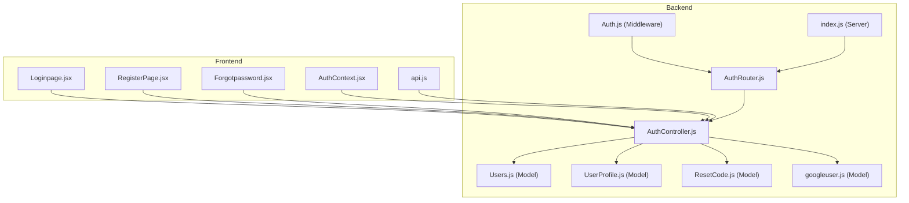
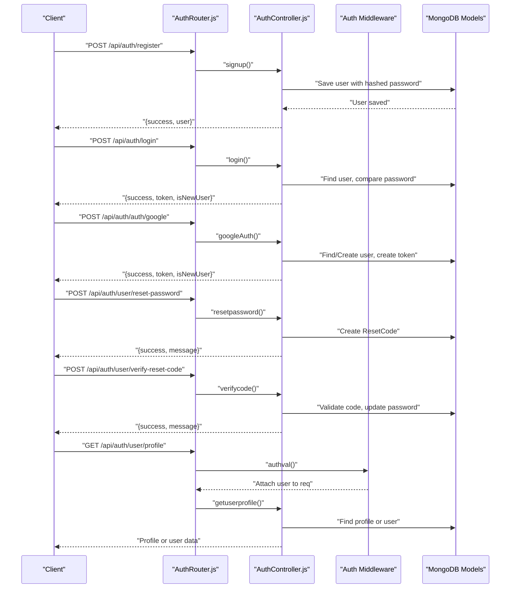
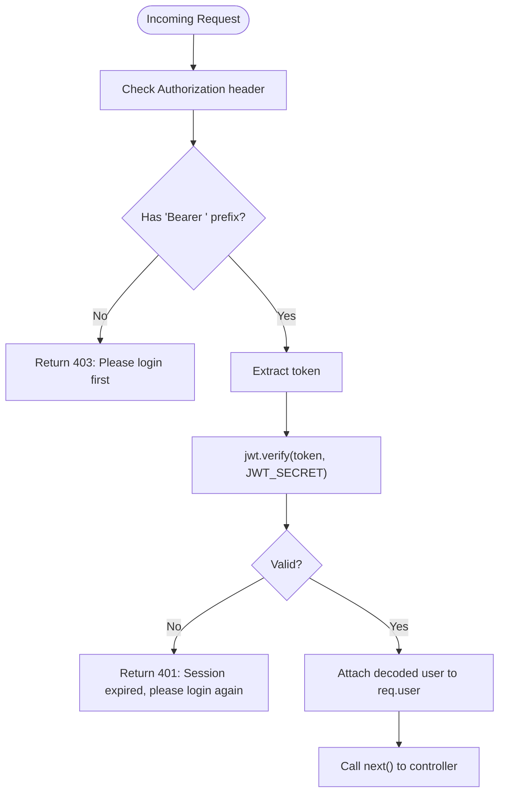
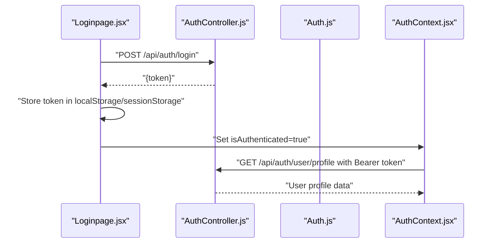
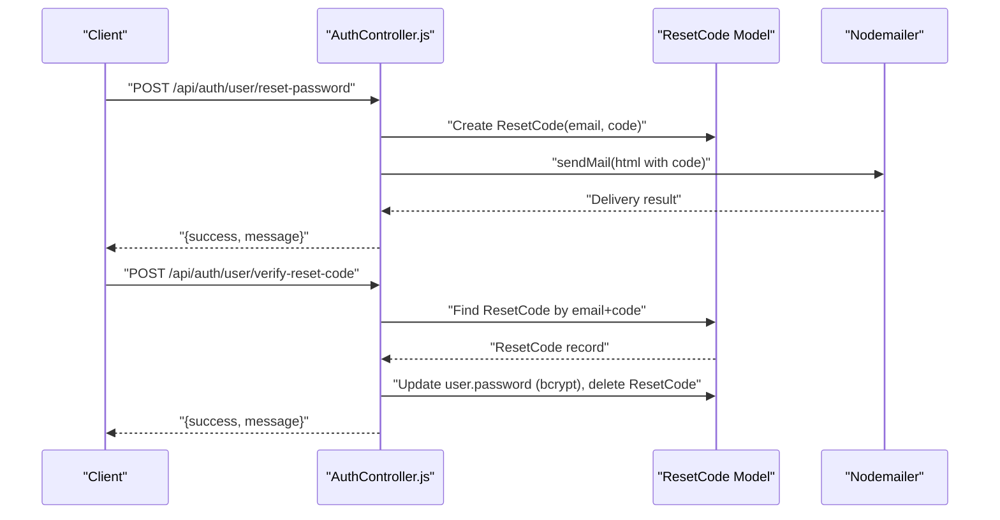
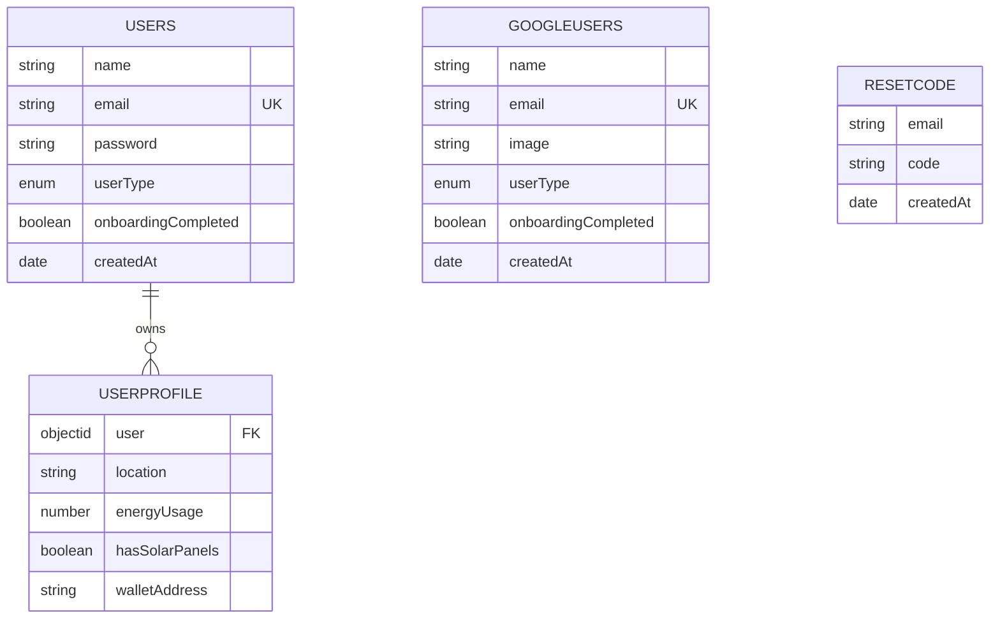
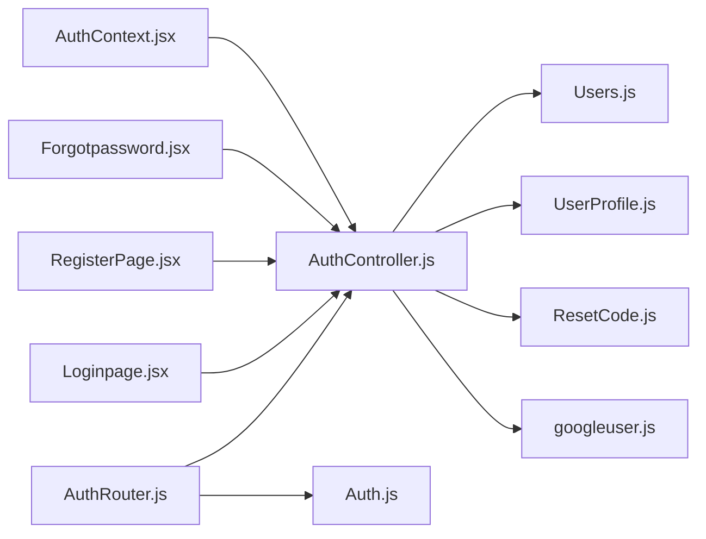

# Authentication API

<cite>
**Referenced Files in This Document**
- [AuthController.js](file://backend/Controllers/AuthController.js)
- [Auth.js](file://backend/Middlewares/Auth.js)
- [AuthRouter.js](file://backend/Routes/AuthRouter.js)
- [Users.js](file://backend/Models/Users.js)
- [UserProfile.js](file://backend/Models/UserProfile.js)
- [ResetCode.js](file://backend/Models/ResetCode.js)
- [googleuser.js](file://backend/Models/googleuser.js)
- [index.js](file://backend/index.js)
- [Loginpage.jsx](file://frontend/src/frontend/Loginpage.jsx)
- [RegisterPage.jsx](file://frontend/src/frontend/RegisterPage.jsx)
- [Forgotpassword.jsx](file://frontend/src/frontend/Forgotpassword.jsx)
- [AuthContext.jsx](file://frontend/src/Context/AuthContext.jsx)
- [api.js](file://frontend/src/api.js)
</cite>

## Table of Contents
1. [Introduction](#introduction)
2. [Project Structure](#project-structure)
3. [Core Components](#core-components)
4. [Architecture Overview](#architecture-overview)
5. [Detailed Component Analysis](#detailed-component-analysis)
6. [Dependency Analysis](#dependency-analysis)
7. [Performance Considerations](#performance-considerations)
8. [Troubleshooting Guide](#troubleshooting-guide)
9. [Conclusion](#conclusion)
10. [Appendices](#appendices)

## Introduction
This document provides comprehensive API documentation for the authentication system. It covers user registration, login, Google OAuth, password reset, and profile management endpoints. It also documents JWT token usage, authentication middleware, session management, role-based access control, password hashing, email verification, security headers, practical examples with curl commands, SDK integration guidelines, error responses, validation rules, rate limiting considerations, token refresh mechanisms, and account security features.

## Project Structure
The authentication system spans backend controllers, middleware, routes, and models, and integrates with the frontend login, registration, and password reset flows.

**Diagram sources**
- [AuthController.js](file://backend/Controllers/AuthController.js#L1-L482)
- [Auth.js](file://backend/Middlewares/Auth.js#L1-L19)
- [AuthRouter.js](file://backend/Routes/AuthRouter.js#L1-L15)
- [Users.js](file://backend/Models/Users.js#L1-L32)
- [UserProfile.js](file://backend/Models/UserProfile.js#L1-L31)
- [ResetCode.js](file://backend/Models/ResetCode.js#L1-L23)
- [googleuser.js](file://backend/Models/googleuser.js#L1-L33)
- [index.js](file://backend/index.js#L1-L97)
- [Loginpage.jsx](file://frontend/src/frontend/Loginpage.jsx#L1-L353)
- [RegisterPage.jsx](file://frontend/src/frontend/RegisterPage.jsx#L1-L434)
- [Forgotpassword.jsx](file://frontend/src/frontend/Forgotpassword.jsx#L1-L277)
- [AuthContext.jsx](file://frontend/src/Context/AuthContext.jsx#L1-L70)
- [api.js](file://frontend/src/api.js#L1-L10)

**Section sources**
- [AuthRouter.js](file://backend/Routes/AuthRouter.js#L1-L15)
- [index.js](file://backend/index.js#L1-L97)

## Core Components
- Authentication controller: Implements registration, login, Google OAuth, password reset, profile retrieval, saving, and editing.
- Authentication middleware: Validates JWT tokens from Authorization headers.
- Routes: Exposes endpoints under /api/auth and protected profile endpoints.
- Models: Define Users, UserProfile, ResetCode, and GoogleUser collections.
- Frontend integration: Handles login, registration, password reset, and token storage.

**Section sources**
- [AuthController.js](file://backend/Controllers/AuthController.js#L1-L482)
- [Auth.js](file://backend/Middlewares/Auth.js#L1-L19)
- [AuthRouter.js](file://backend/Routes/AuthRouter.js#L1-L15)
- [Users.js](file://backend/Models/Users.js#L1-L32)
- [UserProfile.js](file://backend/Models/UserProfile.js#L1-L31)
- [ResetCode.js](file://backend/Models/ResetCode.js#L1-L23)
- [googleuser.js](file://backend/Models/googleuser.js#L1-L33)

## Architecture Overview
The authentication flow follows a RESTful pattern with JWT bearer tokens. Requests to protected endpoints must include an Authorization header with the Bearer scheme. The middleware validates the token and attaches user data to the request. Password reset uses email delivery and temporary codes with expiration.

**Diagram sources**
- [AuthRouter.js](file://backend/Routes/AuthRouter.js#L1-L15)
- [AuthController.js](file://backend/Controllers/AuthController.js#L1-L482)
- [Auth.js](file://backend/Middlewares/Auth.js#L1-L19)
- [Users.js](file://backend/Models/Users.js#L1-L32)
- [UserProfile.js](file://backend/Models/UserProfile.js#L1-L31)
- [ResetCode.js](file://backend/Models/ResetCode.js#L1-L23)

## Detailed Component Analysis

### Authentication Endpoints

#### Registration
- Method: POST
- URL: /api/auth/register
- Request body:
  - name: string, required
  - email: string, required
  - password: string, required (min length 8)
  - userType: enum ["prosumer","consumer","utility"], required
  - recaptchaToken: string, required
- Response:
  - success: boolean
  - message: string
  - user: object (created user)
- Security:
  - reCAPTCHA v3 verification performed server-side
  - Password hashed with bcrypt
  - Duplicate email prevented by unique index
- Example curl:
  - curl -X POST "$BASE_URL/api/auth/register" -H "Content-Type: application/json" -d '{"name":"John","email":"john@example.com","password":"securePass123","userType":"consumer","recaptchaToken":"TOKEN"}'

**Section sources**
- [AuthController.js](file://backend/Controllers/AuthController.js#L49-L101)
- [Users.js](file://backend/Models/Users.js#L1-L32)

#### Login
- Method: POST
- URL: /api/auth/login
- Request body:
  - email: string, required
  - password: string, required
  - recaptchaToken: string, required
- Response:
  - success: boolean
  - message: string
  - token: string (JWT, expires in 24h)
  - name: string
  - isNewUser: boolean (indicates onboarding completion)
- Security:
  - reCAPTCHA verification
  - Password comparison with bcrypt
  - JWT issued with expiration
- Example curl:
  - curl -X POST "$BASE_URL/api/auth/login" -H "Content-Type: application/json" -d '{"email":"john@example.com","password":"securePass123","recaptchaToken":"TOKEN"}'

**Section sources**
- [AuthController.js](file://backend/Controllers/AuthController.js#L105-L155)
- [Auth.js](file://backend/Middlewares/Auth.js#L1-L19)

#### Google OAuth Login/Signup
- Method: POST
- URL: /api/auth/auth/google
- Request body:
  - credential: string, required (Google ID token)
  - userType: enum ["prosumer","consumer","utility"], optional
- Response:
  - success: boolean
  - message: string
  - token: string (JWT)
  - isNewUser: boolean
  - user: object (id, name, email, userType, onboardingCompleted)
- Security:
  - Google ID token verified against client ID
  - Synchronizes user records between Users and googleusers collections
- Example curl:
  - curl -X POST "$BASE_URL/api/auth/auth/google" -H "Content-Type: application/json" -d '{"credential":"GOOGLE_ID_TOKEN","userType":"consumer"}'

**Section sources**
- [AuthController.js](file://backend/Controllers/AuthController.js#L383-L482)
- [googleuser.js](file://backend/Models/googleuser.js#L1-L33)

#### Password Reset Request
- Method: POST
- URL: /api/auth/user/reset-password
- Request body:
  - email: string, required
- Response:
  - success: boolean
  - message: string (safe messaging)
- Behavior:
  - Generates a 6-digit code stored with TTL of 1 hour
  - Sends HTML email with the code
- Example curl:
  - curl -X POST "$BASE_URL/api/auth/user/reset-password" -H "Content-Type: application/json" -d '{"email":"john@example.com"}'

**Section sources**
- [AuthController.js](file://backend/Controllers/AuthController.js#L271-L335)
- [ResetCode.js](file://backend/Models/ResetCode.js#L1-L23)

#### Verify Reset Code and Set New Password
- Method: POST
- URL: /api/auth/user/verify-reset-code
- Request body:
  - email: string, required
  - code: string, required (6 digits)
  - newPassword: string, required (min length 8)
- Response:
  - success: boolean
  - message: string
- Behavior:
  - Validates code existence and freshness
  - Updates user password with bcrypt hash
  - Deletes the reset code
- Example curl:
  - curl -X POST "$BASE_URL/api/auth/user/verify-reset-code" -H "Content-Type: application/json" -d '{"email":"john@example.com","code":"123456","newPassword":"NewPass456"}'

**Section sources**
- [AuthController.js](file://backend/Controllers/AuthController.js#L337-L381)
- [ResetCode.js](file://backend/Models/ResetCode.js#L1-L23)

#### Get User Profile
- Method: GET
- URL: /api/auth/user/profile
- Headers:
  - Authorization: Bearer <token>
- Response:
  - Populated profile with user details and onboarding status
  - If profile missing, returns user with needsOnboarding flag
- Example curl:
  - curl -H "Authorization: Bearer $TOKEN" "$BASE_URL/api/auth/user/profile"

**Section sources**
- [AuthRouter.js](file://backend/Routes/AuthRouter.js#L10-L10)
- [AuthController.js](file://backend/Controllers/AuthController.js#L196-L219)
- [Auth.js](file://backend/Middlewares/Auth.js#L1-L19)

#### Save User Profile (Onboarding)
- Method: POST
- URL: /api/auth/user/profile
- Headers:
  - Authorization: Bearer <token>
- Request body:
  - location: string, required
  - energyUsage: number, required
  - hasSolarPanels: boolean, required
- Response:
  - success: boolean
  - message: string
- Behavior:
  - Creates or updates UserProfile
  - Marks onboardingCompleted on Users
- Example curl:
  - curl -X POST "$BASE_URL/api/auth/user/profile" -H "Authorization: Bearer $TOKEN" -H "Content-Type: application/json" -d '{"location":"City, Country","energyUsage":500,"hasSolarPanels":true}'

**Section sources**
- [AuthRouter.js](file://backend/Routes/AuthRouter.js#L11-L11)
- [AuthController.js](file://backend/Controllers/AuthController.js#L158-L194)

#### Edit Profile
- Method: PUT
- URL: /api/auth/user/profile
- Headers:
  - Authorization: Bearer <token>
- Request body:
  - location: string, optional
  - energyUsage: number, optional
  - hasSolarPanels: boolean, optional
  - email: string, optional
  - userType: enum ["prosumer","consumer","utility"], optional
  - walletAddress: string, optional
- Response:
  - Populated profile with user details
- Behavior:
  - Updates UserProfile and optionally Users (email, userType)
- Example curl:
  - curl -X PUT "$BASE_URL/api/auth/user/profile" -H "Authorization: Bearer $TOKEN" -H "Content-Type: application/json" -d '{"energyUsage":600,"walletAddress":"0x..."}'

**Section sources**
- [AuthRouter.js](file://backend/Routes/AuthRouter.js#L12-L12)
- [AuthController.js](file://backend/Controllers/AuthController.js#L221-L261)

### Authentication Middleware Implementation
- Purpose: Enforce JWT validation for protected routes
- Behavior:
  - Extracts token from Authorization header (Bearer <token>)
  - Verifies JWT with shared secret
  - Attaches decoded user payload to req.user
  - Returns 403 if missing or malformed, 401 if invalid/expired
- Integration: Applied to profile endpoints

**Diagram sources**
- [Auth.js](file://backend/Middlewares/Auth.js#L1-L19)

**Section sources**
- [Auth.js](file://backend/Middlewares/Auth.js#L1-L19)

### Session Management and Token Usage
- Token format: JWT with expiration of 24 hours
- Storage (frontend):
  - Login page supports "Remember me" storing token in localStorage or sessionStorage
  - Auth context fetches user profile on startup using stored token
- Logout (frontend): Clear token from storage and redirect to dashboard
- Token refresh: No dedicated refresh endpoint; use login to obtain a new JWT

**Diagram sources**
- [Loginpage.jsx](file://frontend/src/frontend/Loginpage.jsx#L48-L77)
- [AuthContext.jsx](file://frontend/src/Context/AuthContext.jsx#L17-L46)
- [AuthController.js](file://backend/Controllers/AuthController.js#L105-L155)
- [Auth.js](file://backend/Middlewares/Auth.js#L1-L19)

**Section sources**
- [Loginpage.jsx](file://frontend/src/frontend/Loginpage.jsx#L48-L77)
- [AuthContext.jsx](file://frontend/src/Context/AuthContext.jsx#L17-L46)
- [AuthController.js](file://backend/Controllers/AuthController.js#L105-L155)

### Role-Based Access Control
- userType field defines roles: prosumer, consumer, utility
- Controlled by application logic; middleware does not enforce role-specific authorization
- Use userType in downstream controllers to gate actions

**Section sources**
- [Users.js](file://backend/Models/Users.js#L19-L23)
- [googleuser.js](file://backend/Models/googleuser.js#L18-L23)

### Password Hashing and Security
- Password hashing: bcrypt with salt rounds
- Password reset: 6-digit code with 1-hour TTL; email sent via nodemailer
- reCAPTCHA: v3 verification performed server-side before login/signup
- JWT secret: loaded from environment variable

**Section sources**
- [AuthController.js](file://backend/Controllers/AuthController.js#L79-L82)
- [AuthController.js](file://backend/Controllers/AuthController.js#L126-L126)
- [AuthController.js](file://backend/Controllers/AuthController.js#L284-L291)
- [AuthController.js](file://backend/Controllers/AuthController.js#L12-L47)

### Email Verification and Password Reset Flow

**Diagram sources**
- [AuthController.js](file://backend/Controllers/AuthController.js#L271-L381)
- [ResetCode.js](file://backend/Models/ResetCode.js#L1-L23)

**Section sources**
- [AuthController.js](file://backend/Controllers/AuthController.js#L271-L381)
- [ResetCode.js](file://backend/Models/ResetCode.js#L1-L23)

### Data Models

**Diagram sources**
- [Users.js](file://backend/Models/Users.js#L1-L32)
- [googleuser.js](file://backend/Models/googleuser.js#L1-L33)
- [UserProfile.js](file://backend/Models/UserProfile.js#L1-L31)
- [ResetCode.js](file://backend/Models/ResetCode.js#L1-L23)

**Section sources**
- [Users.js](file://backend/Models/Users.js#L1-L32)
- [googleuser.js](file://backend/Models/googleuser.js#L1-L33)
- [UserProfile.js](file://backend/Models/UserProfile.js#L1-L31)
- [ResetCode.js](file://backend/Models/ResetCode.js#L1-L23)

## Dependency Analysis
- Routes depend on controller functions and middleware
- Controllers depend on models and external services (Google, nodemailer, axios)
- Frontend depends on backend endpoints and stores JWT tokens

**Diagram sources**
- [AuthRouter.js](file://backend/Routes/AuthRouter.js#L1-L15)
- [AuthController.js](file://backend/Controllers/AuthController.js#L1-L482)
- [Auth.js](file://backend/Middlewares/Auth.js#L1-L19)
- [Users.js](file://backend/Models/Users.js#L1-L32)
- [UserProfile.js](file://backend/Models/UserProfile.js#L1-L31)
- [ResetCode.js](file://backend/Models/ResetCode.js#L1-L23)
- [googleuser.js](file://backend/Models/googleuser.js#L1-L33)
- [Loginpage.jsx](file://frontend/src/frontend/Loginpage.jsx#L1-L353)
- [RegisterPage.jsx](file://frontend/src/frontend/RegisterPage.jsx#L1-L434)
- [Forgotpassword.jsx](file://frontend/src/frontend/Forgotpassword.jsx#L1-L277)
- [AuthContext.jsx](file://frontend/src/Context/AuthContext.jsx#L1-L70)

**Section sources**
- [AuthRouter.js](file://backend/Routes/AuthRouter.js#L1-L15)
- [AuthController.js](file://backend/Controllers/AuthController.js#L1-L482)
- [Auth.js](file://backend/Middlewares/Auth.js#L1-L19)

## Performance Considerations
- JWT verification is lightweight; ensure minimal middleware overhead
- bcrypt hashing is CPU-intensive; avoid excessive re-hashing
- Email sending is asynchronous; consider queueing for high volume
- Rate limiting: Not implemented in code; consider adding per-endpoint limits (e.g., 5 requests/minute) to mitigate abuse

[No sources needed since this section provides general guidance]

## Troubleshooting Guide
Common issues and resolutions:
- Missing or invalid Authorization header:
  - Symptom: 403 "Please login first"
  - Resolution: Include Bearer <token> header
- Expired or invalid JWT:
  - Symptom: 401 "Session expired, please login again"
  - Resolution: Re-authenticate to obtain a new token
- reCAPTCHA failure:
  - Symptom: 400 with "recaptcha-failed"
  - Resolution: Complete reCAPTCHA challenge again
- User not found or wrong credentials:
  - Symptom: 403 with authentication failure message
  - Resolution: Verify email/password; ensure account exists
- Password reset code invalid/expired:
  - Symptom: 400 with invalid/expired code message
  - Resolution: Request a new reset code
- Email delivery failures:
  - Symptom: 500 during reset-password
  - Resolution: Check SMTP configuration and network connectivity

**Section sources**
- [Auth.js](file://backend/Middlewares/Auth.js#L6-L17)
- [AuthController.js](file://backend/Controllers/AuthController.js#L56-L61)
- [AuthController.js](file://backend/Controllers/AuthController.js#L119-L133)
- [AuthController.js](file://backend/Controllers/AuthController.js#L350-L355)
- [AuthController.js](file://backend/Controllers/AuthController.js#L317-L322)

## Conclusion
The authentication system provides secure registration, login, Google OAuth, password reset, and profile management with JWT-based session tokens. It leverages bcrypt for passwords, reCAPTCHA for bot protection, and email-based reset codes with expiration. The frontend integrates seamlessly with these endpoints, storing tokens and managing onboarding flows. Additional enhancements such as rate limiting and explicit role-based authorization checks would further strengthen the system.

## Appendices

### Practical Examples

- Register:
  - curl -X POST "$BASE_URL/api/auth/register" -H "Content-Type: application/json" -d '{"name":"John","email":"john@example.com","password":"securePass123","userType":"consumer","recaptchaToken":"TOKEN"}'

- Login:
  - curl -X POST "$BASE_URL/api/auth/login" -H "Content-Type: application/json" -d '{"email":"john@example.com","password":"securePass123","recaptchaToken":"TOKEN"}'

- Google OAuth:
  - curl -X POST "$BASE_URL/api/auth/auth/google" -H "Content-Type: application/json" -d '{"credential":"GOOGLE_ID_TOKEN","userType":"consumer"}'

- Request password reset:
  - curl -X POST "$BASE_URL/api/auth/user/reset-password" -H "Content-Type: application/json" -d '{"email":"john@example.com"}'

- Verify reset code and set new password:
  - curl -X POST "$BASE_URL/api/auth/user/verify-reset-code" -H "Content-Type: application/json" -d '{"email":"john@example.com","code":"123456","newPassword":"NewPass456"}'

- Get profile:
  - curl -H "Authorization: Bearer $TOKEN" "$BASE_URL/api/auth/user/profile"

- Save profile:
  - curl -X POST "$BASE_URL/api/auth/user/profile" -H "Authorization: Bearer $TOKEN" -H "Content-Type: application/json" -d '{"location":"City, Country","energyUsage":500,"hasSolarPanels":true}'

- Edit profile:
  - curl -X PUT "$BASE_URL/api/auth/user/profile" -H "Authorization: Bearer $TOKEN" -H "Content-Type: application/json" -d '{"energyUsage":600,"walletAddress":"0x..."}'

### SDK Integration Guidelines
- Frontend (React):
  - Use axios with baseURL set to /api
  - Store JWT in localStorage or sessionStorage when "Remember me" is selected
  - Include Authorization: Bearer <token> header for protected endpoints
  - Fetch user profile on app initialization to hydrate AuthContext

**Section sources**
- [AuthContext.jsx](file://frontend/src/Context/AuthContext.jsx#L12-L26)
- [Loginpage.jsx](file://frontend/src/frontend/Loginpage.jsx#L33-L36)
- [RegisterPage.jsx](file://frontend/src/frontend/RegisterPage.jsx#L16-L19)
- [Forgotpassword.jsx](file://frontend/src/frontend/Forgotpassword.jsx#L190-L193)

### Validation Rules
- Registration:
  - name: required
  - email: required, unique
  - password: required, min length 8
  - userType: required, enum ["prosumer","consumer","utility"]
  - recaptchaToken: required
- Login:
  - email: required
  - password: required
  - recaptchaToken: required
- Password reset:
  - email: required
- Profile edit:
  - energyUsage: numeric
  - hasSolarPanels: boolean
  - walletAddress: optional string

**Section sources**
- [AuthController.js](file://backend/Controllers/AuthController.js#L50-L68)
- [AuthController.js](file://backend/Controllers/AuthController.js#L107-L108)
- [AuthController.js](file://backend/Controllers/AuthController.js#L224-L224)
- [Users.js](file://backend/Models/Users.js#L19-L23)

### Rate Limiting
- Not implemented in current code
- Recommended: Apply per-endpoint rate limits (e.g., 5 requests/minute) to reduce abuse risk

[No sources needed since this section provides general guidance]

### Token Refresh Mechanisms
- Not implemented
- Recommended: Add a refresh endpoint that accepts a valid refresh token and issues a new JWT

[No sources needed since this section provides general guidance]

### Account Security Features
- JWT with 24h expiration
- bcrypt password hashing
- reCAPTCHA v3
- Email-based password reset with 1-hour expiry
- Secure Google ID token verification

**Section sources**
- [AuthController.js](file://backend/Controllers/AuthController.js#L135-L139)
- [AuthController.js](file://backend/Controllers/AuthController.js#L12-L47)
- [AuthController.js](file://backend/Controllers/AuthController.js#L284-L291)
- [AuthController.js](file://backend/Controllers/AuthController.js#L396-L399)