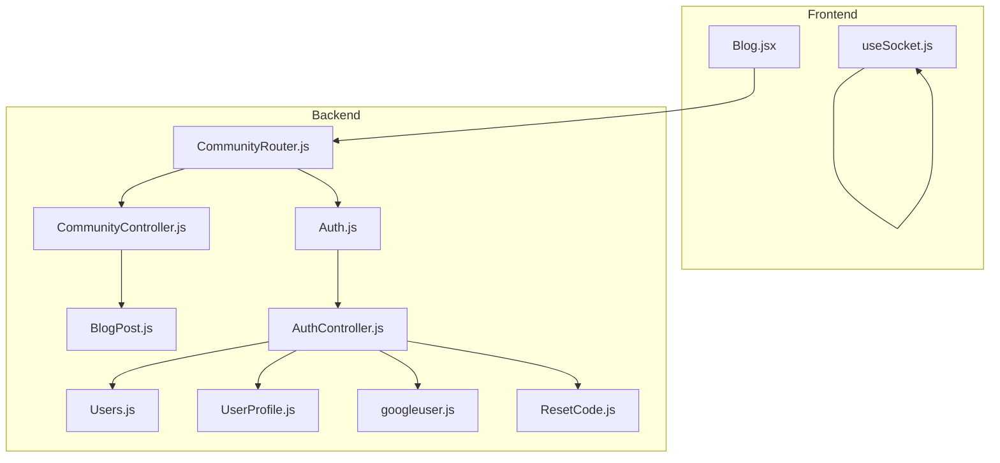
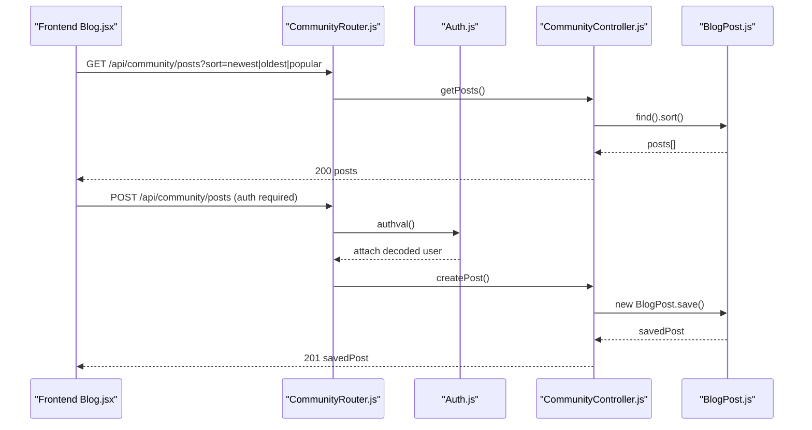
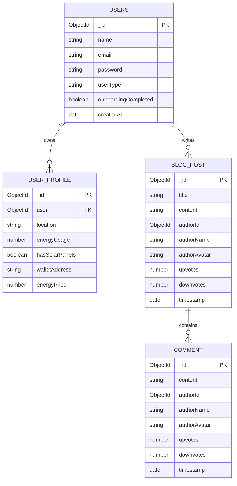
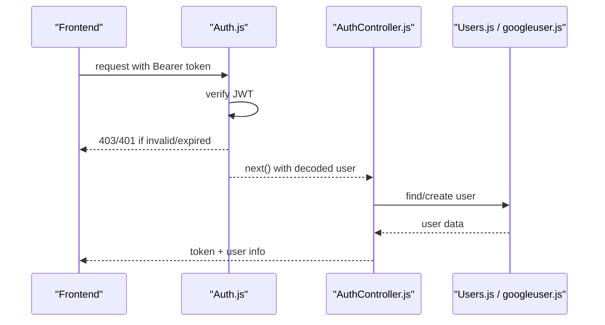
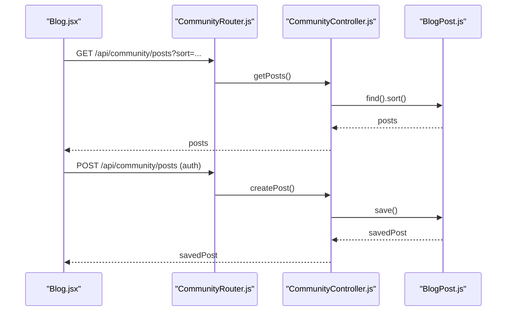
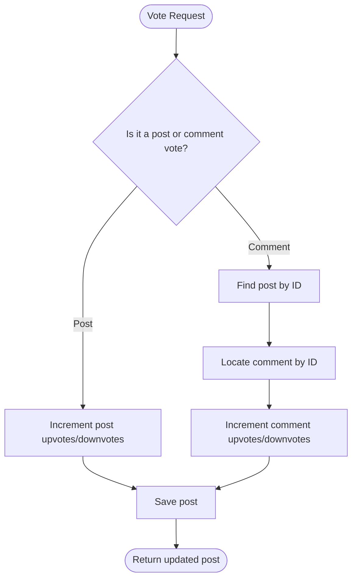
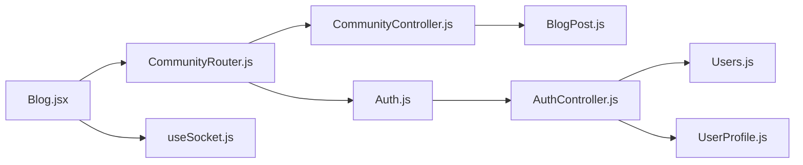

# Community API

<cite>
**Referenced Files in This Document**
- [CommunityController.js](file://backend/Controllers/CommunityController.js)
- [CommunityRouter.js](file://backend/Routes/CommunityRouter.js)
- [BlogPost.js](file://backend/Models/BlogPost.js)
- [Auth.js](file://backend/Middlewares/Auth.js)
- [AuthController.js](file://backend/Controllers/AuthController.js)
- [Users.js](file://backend/Models/Users.js)
- [UserProfile.js](file://backend/Models/UserProfile.js)
- [Blog.jsx](file://frontend/src/frontend/Blog.jsx)
- [useSocket.js](file://frontend/src/hooks/useSocket.js)
- [googleuser.js](file://backend/Models/googleuser.js)
- [ResetCode.js](file://backend/Models/ResetCode.js)
</cite>

## Table of Contents
1. [Introduction](#introduction)
2. [Project Structure](#project-structure)
3. [Core Components](#core-components)
4. [Architecture Overview](#architecture-overview)
5. [Detailed Component Analysis](#detailed-component-analysis)
6. [Dependency Analysis](#dependency-analysis)
7. [Performance Considerations](#performance-considerations)
8. [Troubleshooting Guide](#troubleshooting-guide)
9. [Conclusion](#conclusion)
10. [Appendices](#appendices)

## Introduction
This document provides comprehensive API documentation for the community features of the platform, focusing on blog management, user interactions, and social functionality. It covers endpoints for creating, editing, and managing blog posts, content validation and moderation workflows, user comment systems, voting mechanisms, content categorization, user profile integration, activity feeds, and notification systems. It also outlines content moderation, spam prevention, and community guidelines enforcement, along with licensing and user-generated content policy considerations.

## Project Structure
The community feature spans backend controllers, routes, models, middleware, and frontend components:
- Backend: Express routes define endpoints; controllers implement business logic; Mongoose models define schemas; middleware enforces authentication.
- Frontend: React components consume the API to render posts, comments, and voting UI.

**Diagram sources**
- [CommunityRouter.js](file://backend/Routes/CommunityRouter.js#L1-L14)
- [CommunityController.js](file://backend/Controllers/CommunityController.js#L1-L107)
- [BlogPost.js](file://backend/Models/BlogPost.js#L1-L73)
- [Auth.js](file://backend/Middlewares/Auth.js#L1-L19)
- [AuthController.js](file://backend/Controllers/AuthController.js#L1-L482)
- [Users.js](file://backend/Models/Users.js#L1-L32)
- [UserProfile.js](file://backend/Models/UserProfile.js#L1-L37)
- [googleuser.js](file://backend/Models/googleuser.js#L1-L33)
- [ResetCode.js](file://backend/Models/ResetCode.js#L1-L23)
- [Blog.jsx](file://frontend/src/frontend/Blog.jsx#L1-L618)
- [useSocket.js](file://frontend/src/hooks/useSocket.js#L1-L141)

**Section sources**
- [CommunityRouter.js](file://backend/Routes/CommunityRouter.js#L1-L14)
- [CommunityController.js](file://backend/Controllers/CommunityController.js#L1-L107)
- [BlogPost.js](file://backend/Models/BlogPost.js#L1-L73)
- [Auth.js](file://backend/Middlewares/Auth.js#L1-L19)
- [AuthController.js](file://backend/Controllers/AuthController.js#L1-L482)
- [Users.js](file://backend/Models/Users.js#L1-L32)
- [UserProfile.js](file://backend/Models/UserProfile.js#L1-L37)
- [googleuser.js](file://backend/Models/googleuser.js#L1-L33)
- [ResetCode.js](file://backend/Models/ResetCode.js#L1-L23)
- [Blog.jsx](file://frontend/src/frontend/Blog.jsx#L1-L618)
- [useSocket.js](file://frontend/src/hooks/useSocket.js#L1-L141)

## Core Components
- Community API endpoints: GET /community/posts, POST /community/posts, PUT /community/posts/:id/vote, POST /community/posts/:id/comments, PUT /community/posts/:id/comments/:commentId/vote.
- Authentication middleware validates JWT tokens for protected endpoints.
- BlogPost model defines post and comment schemas with author metadata, voting counters, and timestamps.
- Frontend Blog component integrates with the Community API to display posts, comments, and voting.

**Section sources**
- [CommunityRouter.js](file://backend/Routes/CommunityRouter.js#L7-L11)
- [CommunityController.js](file://backend/Controllers/CommunityController.js#L3-L106)
- [BlogPost.js](file://backend/Models/BlogPost.js#L35-L70)
- [Auth.js](file://backend/Middlewares/Auth.js#L3-L18)
- [Blog.jsx](file://frontend/src/frontend/Blog.jsx#L26-L108)

## Architecture Overview
The Community API follows a layered architecture:
- Routes define endpoint contracts.
- Middleware enforces authentication.
- Controllers implement CRUD operations and voting/comment logic.
- Models encapsulate data schemas and relationships.
- Frontend components call endpoints and render real-time updates via sockets.

**Diagram sources**
- [CommunityRouter.js](file://backend/Routes/CommunityRouter.js#L7-L11)
- [Auth.js](file://backend/Middlewares/Auth.js#L3-L18)
- [CommunityController.js](file://backend/Controllers/CommunityController.js#L3-L43)
- [BlogPost.js](file://backend/Models/BlogPost.js#L35-L70)

## Detailed Component Analysis

### Community Endpoints
- GET /api/community/posts
  - Query parameters: sort (newest|oldest|popular)
  - Sorting behavior:
    - newest: sort by timestamp descending
    - oldest: sort by timestamp ascending
    - popular: sort by upvotes descending (in-memory computation)
  - Response: array of blog posts

- POST /api/community/posts
  - Authentication: required (Bearer token)
  - Request body: title*, content*, authorName (optional fallback), authorAvatar (optional fallback)
  - Response: newly created post

- PUT /api/community/posts/:id/vote
  - Authentication: required
  - Request body: isUpvote (boolean)
  - Behavior: increments upvotes or downvotes by 1
  - Response: updated post

- POST /api/community/posts/:id/comments
  - Authentication: required
  - Request body: content*, authorName (optional fallback), authorAvatar (optional fallback)
  - Behavior: appends a comment to the post
  - Response: updated post with new comment

- PUT /api/community/posts/:id/comments/:commentId/vote
  - Authentication: required
  - Request body: isUpvote (boolean)
  - Behavior: increments comment upvotes or downvotes by 1
  - Response: updated post

Validation and error handling:
- Missing or invalid token returns 403/401.
- Not found errors return 404 for missing posts or comments.
- Internal server errors return 500 with error messages.

**Section sources**
- [CommunityRouter.js](file://backend/Routes/CommunityRouter.js#L7-L11)
- [CommunityController.js](file://backend/Controllers/CommunityController.js#L3-L106)
- [Auth.js](file://backend/Middlewares/Auth.js#L3-L18)

### Data Models
BlogPost schema includes:
- Post-level fields: title, content, authorId (optional), authorName, authorAvatar, upvotes, downvotes, timestamp
- Comments: embedded array with content, authorId, authorName, authorAvatar, upvotes, downvotes, timestamp

User schema includes:
- name, email, password, userType (enum), onboardingCompleted, createdAt

UserProfile schema includes:
- user (ref), location, energyUsage, hasSolarPanels, walletAddress, energyPrice bounds

**Diagram sources**
- [BlogPost.js](file://backend/Models/BlogPost.js#L35-L70)
- [Users.js](file://backend/Models/Users.js#L3-L29)
- [UserProfile.js](file://backend/Models/UserProfile.js#L5-L33)

**Section sources**
- [BlogPost.js](file://backend/Models/BlogPost.js#L3-L73)
- [Users.js](file://backend/Models/Users.js#L3-L32)
- [UserProfile.js](file://backend/Models/UserProfile.js#L5-L37)

### Authentication and Authorization
- JWT-based authentication middleware verifies Authorization header and attaches user to request.
- Protected endpoints require a valid Bearer token.
- Additional sign-up and login endpoints implement reCAPTCHA verification and secure password handling.

**Diagram sources**
- [Auth.js](file://backend/Middlewares/Auth.js#L3-L18)
- [AuthController.js](file://backend/Controllers/AuthController.js#L49-L154)
- [Users.js](file://backend/Models/Users.js#L3-L32)
- [googleuser.js](file://backend/Models/googleuser.js#L3-L33)

**Section sources**
- [Auth.js](file://backend/Middlewares/Auth.js#L3-L18)
- [AuthController.js](file://backend/Controllers/AuthController.js#L49-L154)
- [Users.js](file://backend/Models/Users.js#L3-L32)
- [googleuser.js](file://backend/Models/googleuser.js#L3-L33)

### Frontend Integration
- Blog page fetches posts with sorting, composes posts with author metadata, adds comments, and handles voting.
- Uses Authorization headers derived from stored tokens.

**Diagram sources**
- [Blog.jsx](file://frontend/src/frontend/Blog.jsx#L26-L108)
- [CommunityRouter.js](file://backend/Routes/CommunityRouter.js#L7-L11)
- [CommunityController.js](file://backend/Controllers/CommunityController.js#L3-L43)
- [BlogPost.js](file://backend/Models/BlogPost.js#L35-L70)

**Section sources**
- [Blog.jsx](file://frontend/src/frontend/Blog.jsx#L26-L108)
- [CommunityRouter.js](file://backend/Routes/CommunityRouter.js#L7-L11)
- [CommunityController.js](file://backend/Controllers/CommunityController.js#L3-L43)
- [BlogPost.js](file://backend/Models/BlogPost.js#L35-L70)

### Voting and Comment Systems
- Post voting: PUT /community/posts/:id/vote increments upvotes/downvotes.
- Comment voting: PUT /community/posts/:id/comments/:commentId/vote increments comment upvotes/downvotes.
- Comments: POST /community/posts/:id/comments appends a comment with author metadata.

**Diagram sources**
- [CommunityController.js](file://backend/Controllers/CommunityController.js#L45-L106)

**Section sources**
- [CommunityController.js](file://backend/Controllers/CommunityController.js#L45-L106)

### Content Moderation and Spam Prevention
Recommended practices for moderation and spam prevention:
- Rate limiting per IP/user for POST /community/posts and POST /community/posts/:id/comments.
- Content filtering for profanity and explicit material using external services or keyword lists.
- ReCAPTCHA integration for registration and sensitive actions.
- User reputation scoring and privileged roles for trusted users.
- Manual review queue for flagged content with admin dashboard controls.

[No sources needed since this section provides general guidance]

### Community Guidelines Enforcement
- Enforce community guidelines by flagging content violating terms of service.
- Allow users to report posts/comments; maintain a moderation queue.
- Apply warnings or temporary bans for repeated violations.

[No sources needed since this section provides general guidance]

### Licensing and User-Generated Content Policies
- Require users to agree to licensing terms upon registration.
- Define acceptable licenses for shared content (e.g., Creative Commons).
- Implement takedown procedures for copyright claims with DMCA-compliant workflows.

[No sources needed since this section provides general guidance]

## Dependency Analysis
- Routes depend on controllers and middleware.
- Controllers depend on models for persistence.
- Frontend depends on backend endpoints and sockets for real-time updates.

**Diagram sources**
- [Blog.jsx](file://frontend/src/frontend/Blog.jsx#L1-L618)
- [CommunityRouter.js](file://backend/Routes/CommunityRouter.js#L1-L14)
- [CommunityController.js](file://backend/Controllers/CommunityController.js#L1-L107)
- [BlogPost.js](file://backend/Models/BlogPost.js#L1-L73)
- [Auth.js](file://backend/Middlewares/Auth.js#L1-L19)
- [AuthController.js](file://backend/Controllers/AuthController.js#L1-L482)
- [Users.js](file://backend/Models/Users.js#L1-L32)
- [UserProfile.js](file://backend/Models/UserProfile.js#L1-L37)
- [useSocket.js](file://frontend/src/hooks/useSocket.js#L1-L141)

**Section sources**
- [CommunityRouter.js](file://backend/Routes/CommunityRouter.js#L1-L14)
- [CommunityController.js](file://backend/Controllers/CommunityController.js#L1-L107)
- [BlogPost.js](file://backend/Models/BlogPost.js#L1-L73)
- [Auth.js](file://backend/Middlewares/Auth.js#L1-L19)
- [AuthController.js](file://backend/Controllers/AuthController.js#L1-L482)
- [Users.js](file://backend/Models/Users.js#L1-L32)
- [UserProfile.js](file://backend/Models/UserProfile.js#L1-L37)
- [Blog.jsx](file://frontend/src/frontend/Blog.jsx#L1-L618)
- [useSocket.js](file://frontend/src/hooks/useSocket.js#L1-L141)

## Performance Considerations
- Sorting by popularity triggers in-memory sorting; consider database aggregation for large datasets.
- Comments are embedded; for very large comment counts, consider separate collections to avoid document size limits.
- Use pagination for GET /community/posts to limit response sizes.

[No sources needed since this section provides general guidance]

## Troubleshooting Guide
Common issues and resolutions:
- 403 Unauthorized: Ensure Authorization header includes a valid Bearer token.
- 401 Session Expired: Prompt user to log in again; refresh token lifecycle.
- 404 Not Found: Verify post/comment IDs exist before voting or commenting.
- 500 Internal Server Error: Check server logs for controller/model errors.

**Section sources**
- [Auth.js](file://backend/Middlewares/Auth.js#L6-L17)
- [CommunityController.js](file://backend/Controllers/CommunityController.js#L53-L58)
- [CommunityController.js](file://backend/Controllers/CommunityController.js#L89-L105)

## Conclusion
The Community API provides a robust foundation for blog management, user interactions, and social engagement. By implementing recommended moderation, spam prevention, and licensing practices, the platform can foster a healthy, compliant community ecosystem.

[No sources needed since this section summarizes without analyzing specific files]

## Appendices

### Endpoint Reference

- GET /api/community/posts
  - Query: sort=newest|oldest|popular
  - Response: 200 posts[]

- POST /api/community/posts
  - Headers: Authorization: Bearer <token>
  - Body: { title*, content*, authorName?, authorAvatar? }
  - Response: 201 post

- PUT /api/community/posts/:id/vote
  - Headers: Authorization: Bearer <token>
  - Body: { isUpvote: boolean }
  - Response: 200 post

- POST /api/community/posts/:id/comments
  - Headers: Authorization: Bearer <token>
  - Body: { content*, authorName?, authorAvatar? }
  - Response: 201 post

- PUT /api/community/posts/:id/comments/:commentId/vote
  - Headers: Authorization: Bearer <token>
  - Body: { isUpvote: boolean }
  - Response: 200 post

**Section sources**
- [CommunityRouter.js](file://backend/Routes/CommunityRouter.js#L7-L11)
- [CommunityController.js](file://backend/Controllers/CommunityController.js#L3-L106)

### Request Schemas

- Create Post
  - title: string (required)
  - content: string (required)
  - authorName: string (optional, default "Guest User")
  - authorAvatar: string (optional, default "👤")

- Vote Post
  - isUpvote: boolean

- Add Comment
  - content: string (required)
  - authorName: string (optional, default "Guest User")
  - authorAvatar: string (optional, default "👤")

- Vote Comment
  - isUpvote: boolean

**Section sources**
- [CommunityController.js](file://backend/Controllers/CommunityController.js#L29-L106)
- [BlogPost.js](file://backend/Models/BlogPost.js#L3-L73)

### Notification and Activity Feeds
- Real-time notifications are handled via WebSocket connections in the frontend hook; events include energy data, listings, trades, and price updates. These demonstrate the pattern for extending notifications to community activities (e.g., new posts, votes, comments).

**Section sources**
- [useSocket.js](file://frontend/src/hooks/useSocket.js#L12-L88)