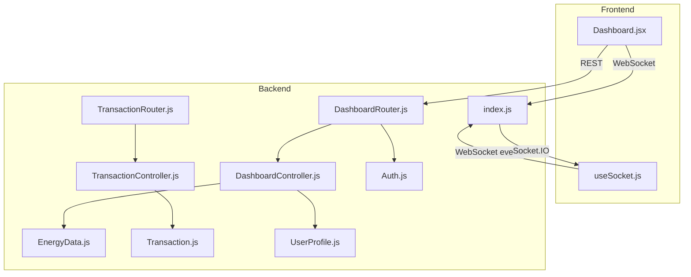
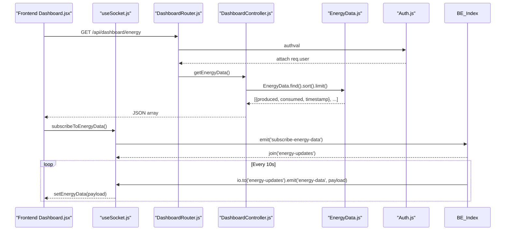
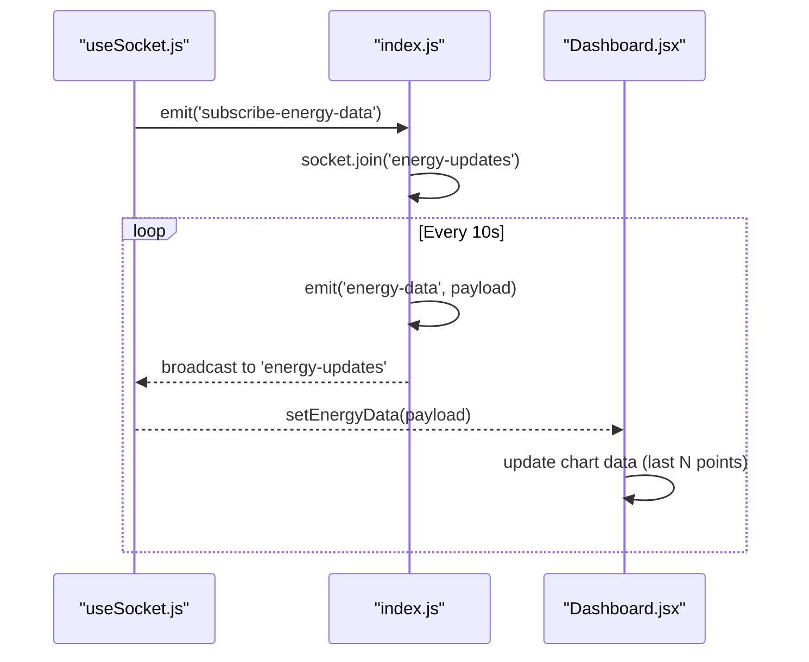
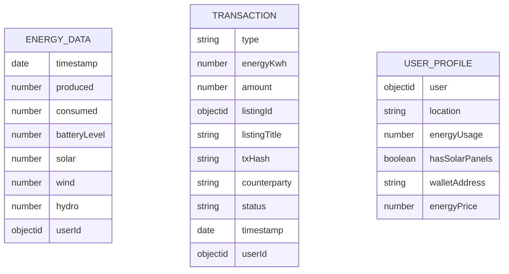
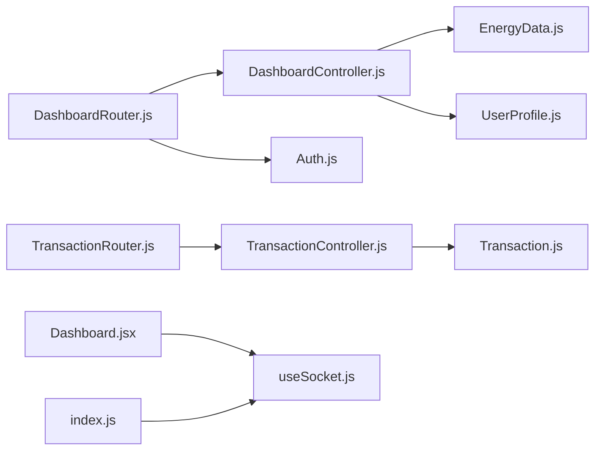

# Dashboard API

<cite>
**Referenced Files in This Document**
- [backend/index.js](file://backend/index.js)
- [backend/Routes/DashboardRouter.js](file://backend/Routes/DashboardRouter.js)
- [backend/Controllers/DashboardController.js](file://backend/Controllers/DashboardController.js)
- [backend/Middlewares/Auth.js](file://backend/Middlewares/Auth.js)
- [backend/Models/EnergyData.js](file://backend/Models/EnergyData.js)
- [backend/Models/Transaction.js](file://backend/Models/Transaction.js)
- [backend/Models/UserProfile.js](file://backend/Models/UserProfile.js)
- [backend/Routes/TransactionRouter.js](file://backend/Routes/TransactionRouter.js)
- [backend/Controllers/TransactionController.js](file://backend/Controllers/TransactionController.js)
- [frontend/src/frontend/Dashboard.jsx](file://frontend/src/frontend/Dashboard.jsx)
- [frontend/src/hooks/useSocket.js](file://frontend/src/hooks/useSocket.js)
</cite>

## Table of Contents
1. [Introduction](#introduction)
2. [Project Structure](#project-structure)
3. [Core Components](#core-components)
4. [Architecture Overview](#architecture-overview)
5. [Detailed Component Analysis](#detailed-component-analysis)
6. [Dependency Analysis](#dependency-analysis)
7. [Performance Considerations](#performance-considerations)
8. [Troubleshooting Guide](#troubleshooting-guide)
9. [Conclusion](#conclusion)

## Introduction
This document provides comprehensive API documentation for the dashboard system focused on energy monitoring, analytics, and reporting. It covers:
- Real-time energy data streaming via WebSocket
- Historical energy data retrieval
- User energy pricing endpoints
- Transaction analytics for production/consumption insights
- Request parameters, response schemas, and integration examples
- Permission controls, data aggregation, and performance optimization strategies

## Project Structure
The dashboard API spans backend routes/controllers/models and frontend components that consume REST endpoints and WebSocket streams.

**Diagram sources**
- [backend/index.js](file://backend/index.js#L1-L97)
- [backend/Routes/DashboardRouter.js](file://backend/Routes/DashboardRouter.js#L1-L13)
- [backend/Controllers/DashboardController.js](file://backend/Controllers/DashboardController.js#L1-L73)
- [backend/Models/EnergyData.js](file://backend/Models/EnergyData.js#L1-L43)
- [backend/Models/Transaction.js](file://backend/Models/Transaction.js#L1-L51)
- [backend/Models/UserProfile.js](file://backend/Models/UserProfile.js#L1-L37)
- [backend/Routes/TransactionRouter.js](file://backend/Routes/TransactionRouter.js#L1-L11)
- [backend/Controllers/TransactionController.js](file://backend/Controllers/TransactionController.js#L1-L68)
- [backend/Middlewares/Auth.js](file://backend/Middlewares/Auth.js#L1-L19)
- [frontend/src/frontend/Dashboard.jsx](file://frontend/src/frontend/Dashboard.jsx#L1-L604)
- [frontend/src/hooks/useSocket.js](file://frontend/src/hooks/useSocket.js#L1-L142)

**Section sources**
- [backend/index.js](file://backend/index.js#L1-L97)
- [backend/Routes/DashboardRouter.js](file://backend/Routes/DashboardRouter.js#L1-L13)
- [backend/Controllers/DashboardController.js](file://backend/Controllers/DashboardController.js#L1-L73)
- [backend/Models/EnergyData.js](file://backend/Models/EnergyData.js#L1-L43)
- [backend/Models/Transaction.js](file://backend/Models/Transaction.js#L1-L51)
- [backend/Models/UserProfile.js](file://backend/Models/UserProfile.js#L1-L37)
- [backend/Routes/TransactionRouter.js](file://backend/Routes/TransactionRouter.js#L1-L11)
- [backend/Controllers/TransactionController.js](file://backend/Controllers/TransactionController.js#L1-L68)
- [backend/Middlewares/Auth.js](file://backend/Middlewares/Auth.js#L1-L19)
- [frontend/src/frontend/Dashboard.jsx](file://frontend/src/frontend/Dashboard.jsx#L1-L604)
- [frontend/src/hooks/useSocket.js](file://frontend/src/hooks/useSocket.js#L1-L142)

## Core Components
- REST endpoints for dashboard data and user energy pricing
- WebSocket server for real-time energy updates
- Authentication middleware for protected endpoints
- Data models for energy readings, transactions, and user profiles

Key responsibilities:
- Dashboard endpoints: retrieve recent energy data, recent transactions, and manage user energy price
- WebSocket: emit periodic energy updates and allow clients to subscribe
- Frontend: render charts, display live updates, and manage user preferences

**Section sources**
- [backend/Routes/DashboardRouter.js](file://backend/Routes/DashboardRouter.js#L1-L13)
- [backend/Controllers/DashboardController.js](file://backend/Controllers/DashboardController.js#L1-L73)
- [backend/index.js](file://backend/index.js#L47-L97)
- [frontend/src/frontend/Dashboard.jsx](file://frontend/src/frontend/Dashboard.jsx#L105-L150)

## Architecture Overview
The system integrates REST APIs and WebSocket streams:
- REST: GET /api/dashboard/energy, GET /api/dashboard/transactions, GET/PUT /api/dashboard/energy-price
- WebSocket: Server emits energy-data periodically; clients subscribe via subscribe-energy-data

**Diagram sources**
- [backend/Routes/DashboardRouter.js](file://backend/Routes/DashboardRouter.js#L7-L10)
- [backend/Controllers/DashboardController.js](file://backend/Controllers/DashboardController.js#L5-L16)
- [backend/Models/EnergyData.js](file://backend/Models/EnergyData.js#L3-L40)
- [backend/Middlewares/Auth.js](file://backend/Middlewares/Auth.js#L3-L18)
- [frontend/src/frontend/Dashboard.jsx](file://frontend/src/frontend/Dashboard.jsx#L105-L150)
- [frontend/src/hooks/useSocket.js](file://frontend/src/hooks/useSocket.js#L104-L109)
- [backend/index.js](file://backend/index.js#L75-L89)

## Detailed Component Analysis

### REST Endpoints

#### GET /api/dashboard/energy
- Purpose: Retrieve recent energy data for charts
- Authentication: Not protected
- Query parameters: None
- Response: Array of records with fields:
  - timestamp: ISO date string
  - produced: number (kWh)
  - consumed: number (kWh)
  - batteryLevel: number (optional)
  - solar/wind/hydro: numbers (optional)
- Example request: GET /api/dashboard/energy
- Example response: See [Response schema](#response-schema)

**Section sources**
- [backend/Routes/DashboardRouter.js](file://backend/Routes/DashboardRouter.js#L7-L7)
- [backend/Controllers/DashboardController.js](file://backend/Controllers/DashboardController.js#L5-L16)
- [backend/Models/EnergyData.js](file://backend/Models/EnergyData.js#L3-L40)

#### GET /api/dashboard/transactions
- Purpose: Retrieve recent transactions for analytics
- Authentication: Not protected
- Query parameters: None
- Response: Array of records with fields:
  - type: "sold" | "bought"
  - energyKwh: number
  - amount: number
  - listingId: ObjectId
  - listingTitle: string
  - txHash: string
  - counterparty: string
  - status: "completed" | "pending" | "failed"
  - timestamp: ISO date string
- Example request: GET /api/dashboard/transactions
- Example response: See [Response schema](#response-schema)

**Section sources**
- [backend/Routes/DashboardRouter.js](file://backend/Routes/DashboardRouter.js#L8-L8)
- [backend/Controllers/DashboardController.js](file://backend/Controllers/DashboardController.js#L18-L25)
- [backend/Models/Transaction.js](file://backend/Models/Transaction.js#L3-L48)

#### GET /api/dashboard/energy-price
- Purpose: Fetch user’s stored energy price
- Authentication: Required (Bearer token)
- Query parameters: None
- Request headers: Authorization: Bearer <token>
- Response: Object with fields:
  - success: boolean
  - energyPrice: number
- Example request: GET /api/dashboard/energy-price with Authorization header
- Example response: See [Response schema](#response-schema)

**Section sources**
- [backend/Routes/DashboardRouter.js](file://backend/Routes/DashboardRouter.js#L9-L9)
- [backend/Controllers/DashboardController.js](file://backend/Controllers/DashboardController.js#L27-L44)
- [backend/Middlewares/Auth.js](file://backend/Middlewares/Auth.js#L3-L18)

#### PUT /api/dashboard/energy-price
- Purpose: Update user’s energy price
- Authentication: Required (Bearer token)
- Request body: { energyPrice: number }
- Validation: Must be between 0.1 and 10.0
- Response: Object with fields:
  - success: boolean
  - message: string
  - energyPrice: number
- Example request: PUT /api/dashboard/energy-price with Authorization header and JSON body
- Example response: See [Response schema](#response-schema)

**Section sources**
- [backend/Routes/DashboardRouter.js](file://backend/Routes/DashboardRouter.js#L10-L10)
- [backend/Controllers/DashboardController.js](file://backend/Controllers/DashboardController.js#L46-L72)
- [backend/Middlewares/Auth.js](file://backend/Middlewares/Auth.js#L3-L18)
- [backend/Models/UserProfile.js](file://backend/Models/UserProfile.js#L27-L32)

### WebSocket Streaming

#### Events
- Client emits: subscribe-energy-data
- Server emits: energy-data (payload includes timestamp, produced, consumed, gridPrice, solarOutput, windOutput)
- Rooms: energy-updates

**Diagram sources**
- [frontend/src/hooks/useSocket.js](file://frontend/src/hooks/useSocket.js#L104-L109)
- [backend/index.js](file://backend/index.js#L63-L89)
- [frontend/src/frontend/Dashboard.jsx](file://frontend/src/frontend/Dashboard.jsx#L131-L150)

**Section sources**
- [backend/index.js](file://backend/index.js#L47-L97)
- [frontend/src/hooks/useSocket.js](file://frontend/src/hooks/useSocket.js#L1-L142)
- [frontend/src/frontend/Dashboard.jsx](file://frontend/src/frontend/Dashboard.jsx#L105-L150)

### Response Schemas

- GET /api/dashboard/energy
  - Array of objects with keys: timestamp, produced, consumed, batteryLevel?, solar?, wind?, hydro?
  - Example shape: see [Model schema](#model-schemas)

- GET /api/dashboard/transactions
  - Array of objects with keys: type, energyKwh, amount, listingId, listingTitle, txHash, counterparty, status, timestamp

- GET/PUT /api/dashboard/energy-price
  - GET: { success: boolean, energyPrice: number }
  - PUT: { success: boolean, message: string, energyPrice: number }

**Section sources**
- [backend/Models/EnergyData.js](file://backend/Models/EnergyData.js#L3-L40)
- [backend/Models/Transaction.js](file://backend/Models/Transaction.js#L3-L48)
- [backend/Controllers/DashboardController.js](file://backend/Controllers/DashboardController.js#L27-L72)

### Model Schemas

**Diagram sources**
- [backend/Models/EnergyData.js](file://backend/Models/EnergyData.js#L3-L40)
- [backend/Models/Transaction.js](file://backend/Models/Transaction.js#L3-L48)
- [backend/Models/UserProfile.js](file://backend/Models/UserProfile.js#L5-L33)

**Section sources**
- [backend/Models/EnergyData.js](file://backend/Models/EnergyData.js#L1-L43)
- [backend/Models/Transaction.js](file://backend/Models/Transaction.js#L1-L51)
- [backend/Models/UserProfile.js](file://backend/Models/UserProfile.js#L1-L37)

### Data Aggregation and Analytics

- Dashboard tile computations (frontend):
  - Sold and purchased kWh totals from transactions
  - Unique buyer/seller counts
  - Monthly usage and wallet address summary
- Energy price management:
  - Stored per user profile with validation bounds
  - Real-time updates via WebSocket price-update event (if emitted elsewhere)

Integration examples:
- Use transaction data to compute totals and counts for tiles
- Render line charts with produced/consumed series

**Section sources**
- [frontend/src/frontend/Dashboard.jsx](file://frontend/src/frontend/Dashboard.jsx#L37-L79)
- [frontend/src/frontend/Dashboard.jsx](file://frontend/src/frontend/Dashboard.jsx#L322-L356)
- [backend/Models/UserProfile.js](file://backend/Models/UserProfile.js#L27-L32)

### Request Parameters and Filtering
- No explicit query parameters supported on the dashboard endpoints in the current implementation
- Filtering and pagination limits are handled server-side with sort and limit
- For future enhancements, consider adding:
  - dateFrom/dateTo for historical data
  - energyType filters (solar/wind/hydro)
  - userId for multi-user environments

**Section sources**
- [backend/Controllers/DashboardController.js](file://backend/Controllers/DashboardController.js#L5-L25)
- [backend/Models/EnergyData.js](file://backend/Models/EnergyData.js#L3-L40)

### Export Capabilities
- Frontend dashboard renders charts but does not expose built-in export endpoints
- To enable export, consider adding:
  - CSV/XLSX endpoints for energy and transactions
  - Range-based filtering parameters for export endpoints

[No sources needed since this section provides general guidance]

## Dependency Analysis

**Diagram sources**
- [backend/Routes/DashboardRouter.js](file://backend/Routes/DashboardRouter.js#L1-L13)
- [backend/Controllers/DashboardController.js](file://backend/Controllers/DashboardController.js#L1-L73)
- [backend/Models/EnergyData.js](file://backend/Models/EnergyData.js#L1-L43)
- [backend/Models/UserProfile.js](file://backend/Models/UserProfile.js#L1-L37)
- [backend/Routes/TransactionRouter.js](file://backend/Routes/TransactionRouter.js#L1-L11)
- [backend/Controllers/TransactionController.js](file://backend/Controllers/TransactionController.js#L1-L68)
- [backend/Models/Transaction.js](file://backend/Models/Transaction.js#L1-L51)
- [backend/Middlewares/Auth.js](file://backend/Middlewares/Auth.js#L1-L19)
- [frontend/src/frontend/Dashboard.jsx](file://frontend/src/frontend/Dashboard.jsx#L1-L604)
- [frontend/src/hooks/useSocket.js](file://frontend/src/hooks/useSocket.js#L1-L142)
- [backend/index.js](file://backend/index.js#L1-L97)

**Section sources**
- [backend/Routes/DashboardRouter.js](file://backend/Routes/DashboardRouter.js#L1-L13)
- [backend/Controllers/DashboardController.js](file://backend/Controllers/DashboardController.js#L1-L73)
- [backend/Routes/TransactionRouter.js](file://backend/Routes/TransactionRouter.js#L1-L11)
- [backend/Controllers/TransactionController.js](file://backend/Controllers/TransactionController.js#L1-L68)
- [backend/Middlewares/Auth.js](file://backend/Middlewares/Auth.js#L1-L19)
- [frontend/src/frontend/Dashboard.jsx](file://frontend/src/frontend/Dashboard.jsx#L1-L604)
- [frontend/src/hooks/useSocket.js](file://frontend/src/hooks/useSocket.js#L1-L142)
- [backend/index.js](file://backend/index.js#L1-L97)

## Performance Considerations
- Real-time streaming
  - Current interval: 10 seconds; adjust based on device capability and network
  - Room-based broadcasting minimizes unnecessary traffic
- Historical data
  - Limits applied in controllers; consider adding range-based queries for large datasets
- Pagination and sorting
  - Use skip/limit with indexed timestamps for scalable historical queries
- Caching
  - Frontend caches last N chart points; consider server-side caching for frequent reads
- WebSocket scalability
  - Monitor room sizes; consider sharding or clustering for many concurrent users

[No sources needed since this section provides general guidance]

## Troubleshooting Guide
- Authentication errors
  - Ensure Authorization: Bearer <token> header for protected endpoints
  - Verify JWT_SECRET and token validity
- WebSocket connectivity
  - Confirm frontend connects to the same origin/port as backend
  - Check server logs for connection/disconnect events
- Data not appearing
  - Verify client emitted subscribe-energy-data
  - Confirm server emits to room "energy-updates"
- Transaction analytics mismatch
  - Validate buyer/seller counts and totals computed in frontend against returned transaction arrays

**Section sources**
- [backend/Middlewares/Auth.js](file://backend/Middlewares/Auth.js#L3-L18)
- [frontend/src/hooks/useSocket.js](file://frontend/src/hooks/useSocket.js#L12-L88)
- [backend/index.js](file://backend/index.js#L47-L97)
- [frontend/src/frontend/Dashboard.jsx](file://frontend/src/frontend/Dashboard.jsx#L37-L79)

## Conclusion
The dashboard API provides a solid foundation for real-time energy monitoring and basic analytics. Enhancements such as range-based queries, export endpoints, and server-side caching would improve scalability and usability for larger deployments.