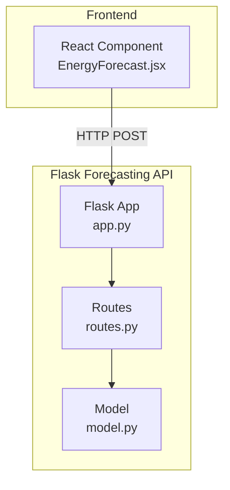
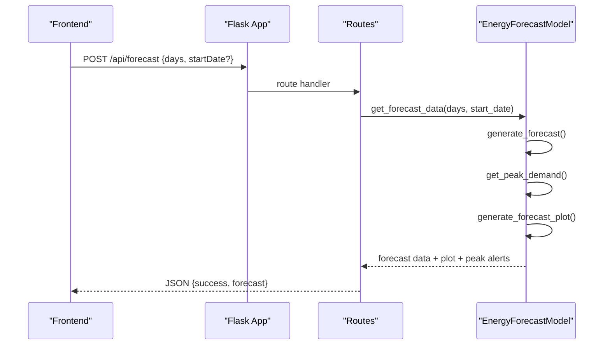
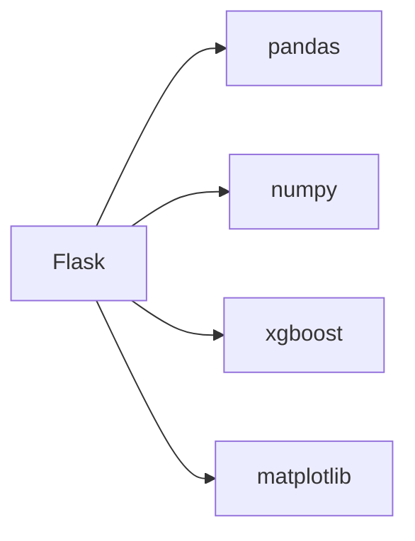

# Forecasting API

<cite>
**Referenced Files in This Document**
- [app.py](file://pythonfiles/app.py)
- [routes.py](file://pythonfiles/routes.py)
- [model.py](file://pythonfiles/model.py)
- [requirements.txt](file://pythonfiles/requirements.txt)
- [README.md](file://README.md)
- [EnergyForecast.jsx](file://frontend/src/frontend/EnergyForecast.jsx)
- [api.js](file://frontend/src/api.js)
- [model_shapes.txt](file://ML/model_shapes.txt)
- [energy_demand.h5](file://ML/energy_demand.h5)
- [energy_price.h5](file://ML/energy_price.h5)
- [energy_produced.h5](file://ML/energy_produced.h5)
</cite>

## Table of Contents
1. [Introduction](#introduction)
2. [Project Structure](#project-structure)
3. [Core Components](#core-components)
4. [Architecture Overview](#architecture-overview)
5. [Detailed Component Analysis](#detailed-component-analysis)
6. [Dependency Analysis](#dependency-analysis)
7. [Performance Considerations](#performance-considerations)
8. [Troubleshooting Guide](#troubleshooting-guide)
9. [Conclusion](#conclusion)
10. [Appendices](#appendices)

## Introduction
This document provides comprehensive API documentation for the energy forecasting system built with Flask and XGBoost. It covers:
- Prediction request endpoints for energy demand forecasting
- Input schemas for forecast period and optional start date
- Output formats for point forecasts, peak demand alerts, and visualization plots
- Model information endpoints and feature engineering details
- Integration examples with the main application
- Performance optimization and fallback mechanisms

## Project Structure
The forecasting system consists of:
- A Flask service exposing prediction endpoints
- An XGBoost model for energy demand forecasting
- A frontend React component that integrates with the Flask service

**Diagram sources**
- [app.py](file://pythonfiles/app.py#L1-L15)
- [routes.py](file://pythonfiles/routes.py#L1-L49)
- [model.py](file://pythonfiles/model.py#L1-L128)

**Section sources**
- [README.md](file://README.md#L1-L267)
- [app.py](file://pythonfiles/app.py#L1-L15)
- [routes.py](file://pythonfiles/routes.py#L1-L49)
- [model.py](file://pythonfiles/model.py#L1-L128)

## Core Components
- Flask application entry point initializes CORS and registers the forecasting blueprint.
- Routes define:
  - POST /api/forecast: generates hourly forecasts for a given period and optional start date
  - GET /api/model-info: returns model metadata and feature list
- Model encapsulates:
  - Feature engineering from timestamps
  - Forecast generation using XGBoost
  - Peak demand detection and plotting

Key runtime configuration:
- Upload folder and max content length are configured for safe handling
- CORS is enabled globally for cross-origin requests

**Section sources**
- [app.py](file://pythonfiles/app.py#L1-L15)
- [routes.py](file://pythonfiles/routes.py#L1-L49)
- [model.py](file://pythonfiles/model.py#L12-L128)

## Architecture Overview
The forecasting pipeline:
1. Frontend sends a POST request to /api/forecast with days and optional startDate
2. Flask route validates inputs and delegates to the model
3. Model generates hourly forecasts for the requested period
4. Model computes peak demand per day and produces a PNG plot
5. Flask returns structured JSON containing forecast data, peak alerts, and plot

**Diagram sources**
- [routes.py](file://pythonfiles/routes.py#L13-L41)
- [model.py](file://pythonfiles/model.py#L100-L120)

## Detailed Component Analysis

### Endpoint: POST /api/forecast
Purpose:
- Generate hourly energy demand forecasts for a configurable number of days starting from a given date or today.

Request
- Method: POST
- Content-Type: application/json
- Body fields:
  - days: integer, required. Must be between 1 and 30.
  - startDate: string, optional. Format: YYYY-MM-DD. If omitted, the current date is used.

Validation
- Returns 400 if days is outside the allowed range.
- Returns 400 if startDate is provided but not in the expected format.

Response
- Success: 200 OK with JSON object:
  - success: boolean true
  - forecast: object containing:
    - forecast: array of hourly records with:
      - datetime: string in ISO-like format
      - prediction: numeric MW value
    - peak_demand: array of daily peak records with:
      - datetime: string representing the date
      - prediction: numeric MW value
      - hour: integer hour of peak occurrence
      - message: string describing the peak event
    - plot: base64-encoded PNG image of the forecast plot

- Failure: 500 with JSON object:
  - error: string describing the error

Notes
- The endpoint returns hourly forecasts for days*24 hours.
- The plot is generated from the forecast DataFrame and embedded as base64.

Example request payload
- {
  "days": 7,
  "startDate": "2025-06-01"
}

Example response payload
- {
  "success": true,
  "forecast": {
    "forecast": [
      {"datetime": "YYYY-MM-DD HH:MM:SS", "prediction": 123.45},
      ...
    ],
    "peak_demand": [
      {"datetime": "YYYY-MM-DD", "prediction": 180.23, "hour": 18, "message": "..."},
      ...
    ],
    "plot": "iVBOR..."
  }
}

**Section sources**
- [routes.py](file://pythonfiles/routes.py#L13-L41)
- [model.py](file://pythonfiles/model.py#L100-L120)

### Endpoint: GET /api/model-info
Purpose:
- Retrieve metadata about the forecasting model and its features.

Response
- JSON object:
  - features: array of feature names used by the model
  - model_file: string indicating the model file name
  - description: string describing the model

Typical features include temporal features derived from timestamps.

**Section sources**
- [routes.py](file://pythonfiles/routes.py#L43-L49)
- [model.py](file://pythonfiles/model.py#L17-L17)

### Model Implementation Details
Feature Engineering
- The model derives the following features from timestamps:
  - hour, dayofweek, quarter, month, year, dayofyear, dayofmonth, weekofyear
- These features are used to predict hourly demand.

Forecast Generation
- Generates hourly timestamps for the requested period.
- Uses the XGBoost model to predict demand for each timestamp.
- Returns a DataFrame with predictions.

Peak Demand Detection
- Groups predictions by date and identifies the peak hour for each day.
- Produces a message summarizing peak demand and time.

Plot Generation
- Creates a time-series plot of predictions and marks peak demand points.
- Returns the plot as a base64-encoded PNG.

Integration with Frontend
- The React component calls /api/forecast and renders:
  - A plot image
  - A list of peak demand alerts
  - Optional hourly forecast table

**Section sources**
- [model.py](file://pythonfiles/model.py#L19-L44)
- [model.py](file://pythonfiles/model.py#L46-L65)
- [model.py](file://pythonfiles/model.py#L67-L98)
- [model.py](file://pythonfiles/model.py#L100-L120)
- [EnergyForecast.jsx](file://frontend/src/frontend/EnergyForecast.jsx#L152-L173)
- [EnergyForecast.jsx](file://frontend/src/frontend/EnergyForecast.jsx#L619-L696)

### Historical Data Ingestion and Seasonal Adjustments
While the forecasting endpoint focuses on demand forecasting, the ML module demonstrates ingestion and preprocessing patterns that can inform historical data handling:
- Weather data ingestion from OpenWeatherMap
- Feature construction combining temporal and weather attributes
- Aggregation from hourly to daily summaries
- Dynamic pricing based on supply-demand balance

These patterns can guide building ingestion APIs for training datasets or augmenting forecasts with external factors.

**Section sources**
- [model_shapes.txt](file://ML/model_shapes.txt#L1-L4)
- [energy_demand.h5](file://ML/energy_demand.h5)
- [energy_price.h5](file://ML/energy_price.h5)
- [energy_produced.h5](file://ML/energy_produced.h5)

### Confidence Intervals and Accuracy Metrics
- The current forecasting endpoint does not expose confidence intervals or accuracy metrics in the response.
- Model information endpoint returns feature names and model file name, but not performance metrics.
- If uncertainty quantification is required, consider extending the model to output prediction intervals or returning probabilistic forecasts.

**Section sources**
- [routes.py](file://pythonfiles/routes.py#L43-L49)
- [model.py](file://pythonfiles/model.py#L100-L120)

### Request Schemas and Validation
- days: integer, required, range 1..30
- startDate: string, optional, format YYYY-MM-DD

Validation outcomes:
- 400 for invalid days or date format
- 500 for internal errors during forecasting

**Section sources**
- [routes.py](file://pythonfiles/routes.py#L19-L31)

### Response Formats
- forecast: array of hourly records with datetime and prediction
- peak_demand: array of daily peak records with datetime, prediction, hour, and message
- plot: base64 PNG image

**Section sources**
- [model.py](file://pythonfiles/model.py#L100-L120)

### Integration Examples
- Frontend integration:
  - The React component constructs a POST request to /api/forecast with days and optional startDate
  - It handles loading, error states, and renders the plot, peak alerts, and hourly data

- Example usage:
  - Call the endpoint with days=7 and startDate=null to forecast from today
  - Use startDate to align forecasts with a specific baseline

**Section sources**
- [EnergyForecast.jsx](file://frontend/src/frontend/EnergyForecast.jsx#L152-L173)
- [EnergyForecast.jsx](file://frontend/src/frontend/EnergyForecast.jsx#L619-L696)

## Dependency Analysis
External libraries and their roles:
- Flask: Web framework for serving endpoints
- pandas/numpy: Data manipulation and numerical operations
- xgboost: Machine learning model for forecasting
- matplotlib: Plot generation for forecast visualization

**Diagram sources**
- [requirements.txt](file://pythonfiles/requirements.txt#L1-L8)

**Section sources**
- [requirements.txt](file://pythonfiles/requirements.txt#L1-L8)

## Performance Considerations
- Forecast horizon: days must be between 1 and 30. Larger horizons increase computation and memory usage.
- Feature engineering: Creating features from timestamps is efficient; ensure minimal overhead when scaling.
- Plot generation: Base64 encoding adds payload size; consider serving images separately if bandwidth is constrained.
- Model loading: The XGBoost model is loaded once per process initialization.
- Concurrency: Use a WSGI server (e.g., gunicorn) for production deployments to handle concurrent requests.

[No sources needed since this section provides general guidance]

## Troubleshooting Guide
Common issues and resolutions:
- Invalid date format: Ensure startDate is provided as YYYY-MM-DD; otherwise, the endpoint returns 400.
- Out-of-range days: days must be between 1 and 30; adjust accordingly.
- Internal errors: If the model fails to generate forecasts, the endpoint returns 500 with an error message.
- CORS issues: CORS is enabled for the Flask app; ensure frontend requests originate from allowed origins.

Operational checks:
- Verify the Flask service is running on the expected port.
- Confirm the XGBoost model file is present and loadable.
- Validate that the frontend is sending JSON payloads with correct field names.

**Section sources**
- [routes.py](file://pythonfiles/routes.py#L19-L31)
- [routes.py](file://pythonfiles/routes.py#L40-L41)
- [app.py](file://pythonfiles/app.py#L6-L6)

## Conclusion
The forecasting API provides a straightforward interface for generating hourly energy demand forecasts with peak alerts and visualizations. By adhering to the documented request schemas and leveraging the model information endpoint, developers can integrate forecasting capabilities into applications. Extending the API to include confidence intervals, accuracy metrics, and more granular seasonal/weather features would further enhance its utility.

[No sources needed since this section summarizes without analyzing specific files]

## Appendices

### API Definition Summary
- POST /api/forecast
  - Request: { days: integer, startDate?: string }
  - Response: { success: boolean, forecast: { forecast: [{ datetime, prediction }], peak_demand: [{ datetime, prediction, hour, message }], plot: string } }
  - Status Codes: 200 (success), 400 (validation), 500 (error)

- GET /api/model-info
  - Response: { features: string[], model_file: string, description: string }

**Section sources**
- [routes.py](file://pythonfiles/routes.py#L13-L49)
- [model.py](file://pythonfiles/model.py#L100-L120)

### Frontend Integration Notes
- The React component demonstrates:
  - Building the request payload
  - Handling loading and error states
  - Rendering the plot and peak alerts
  - Toggling visibility of hourly data

**Section sources**
- [EnergyForecast.jsx](file://frontend/src/frontend/EnergyForecast.jsx#L152-L173)
- [EnergyForecast.jsx](file://frontend/src/frontend/EnergyForecast.jsx#L619-L696)