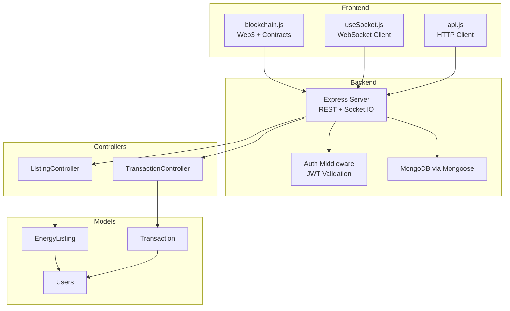
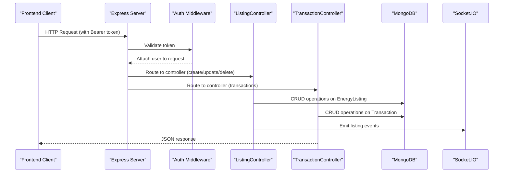
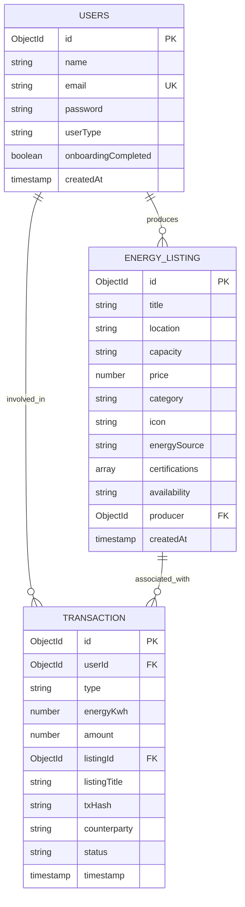
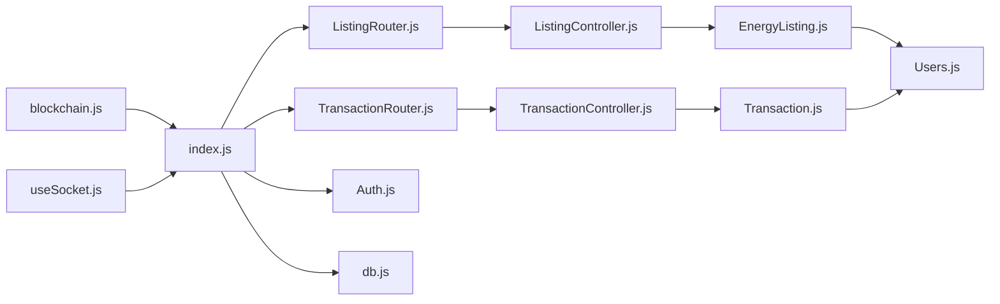

# Marketplace API

<cite>
**Referenced Files in This Document**
- [index.js](file://backend/index.js)
- [db.js](file://backend\DB\db.js)
- [Auth.js](file://backend\Middlewares\Auth.js)
- [AuthRouter.js](file://backend\Routes\AuthRouter.js)
- [ListingRouter.js](file://backend\Routes\ListingRouter.js)
- [TransactionRouter.js](file://backend\Routes\TransactionRouter.js)
- [ListingController.js](file://backend\Controllers\ListingController.js)
- [TransactionController.js](file://backend\Controllers\TransactionController.js)
- [EnergyListing.js](file://backend\Models\EnergyListing.js)
- [Transaction.js](file://backend\Models\Transaction.js)
- [Users.js](file://backend\Models\Users.js)
- [blockchain.js](file://frontend\src\services\blockchain.js)
- [useSocket.js](file://frontend\src\hooks\useSocket.js)
- [api.js](file://frontend\src\api.js)
</cite>

## Table of Contents
1. [Introduction](#introduction)
2. [Project Structure](#project-structure)
3. [Core Components](#core-components)
4. [Architecture Overview](#architecture-overview)
5. [Detailed Component Analysis](#detailed-component-analysis)
6. [Dependency Analysis](#dependency-analysis)
7. [Performance Considerations](#performance-considerations)
8. [Troubleshooting Guide](#troubleshooting-guide)
9. [Conclusion](#conclusion)
10. [Appendices](#appendices)

## Introduction
This document provides comprehensive API documentation for the energy marketplace system. It covers listing management, transaction processing, and trading operations. It also documents request schemas, validation rules, real-time market updates, order book functionality, and integration examples for marketplace clients. Security, escrow, and dispute resolution processes are outlined conceptually to guide secure integration.

## Project Structure
The marketplace system comprises:
- Backend REST API with Express.js, Socket.IO for real-time updates, and MongoDB via Mongoose
- Authentication middleware using JWT
- Models for listings and transactions
- Frontend services for blockchain interactions and WebSocket subscriptions

**Diagram sources**
- [index.js](file://backend\index.js#L1-L97)
- [Auth.js](file://backend\Middlewares\Auth.js#L1-L19)
- [ListingController.js](file://backend\Controllers\ListingController.js#L1-L253)
- [TransactionController.js](file://backend\Controllers\TransactionController.js#L1-L68)
- [EnergyListing.js](file://backend\Models\EnergyListing.js#L1-L56)
- [Transaction.js](file://backend\Models\Transaction.js#L1-L51)
- [Users.js](file://backend\Models\Users.js#L1-L32)
- [blockchain.js](file://frontend\src\services\blockchain.js#L1-L261)
- [useSocket.js](file://frontend\src\hooks\useSocket.js#L1-L142)
- [api.js](file://frontend\src\api.js#L1-L10)

**Section sources**
- [index.js](file://backend\index.js#L1-L97)
- [db.js](file://backend\DB\db.js#L1-L12)

## Core Components
- REST API base URL: http://localhost:8080/api
- Authentication: Bearer token via Authorization header
- Real-time updates: Socket.IO events for listings, trades, prices, and energy data
- Blockchain integration: Ethereum-compatible contracts for tokenization, exchange, and AMM

Key endpoints:
- Listings
  - GET /listings (public)
  - GET /user/listings (protected)
  - GET /user/listings/analytics (protected)
  - POST /listings (protected)
  - PUT /listings/:id (protected)
  - DELETE /listings/:id (protected)
- Transactions
  - GET /user/transactions (protected)
  - POST /transactions (protected)
- Authentication
  - POST /auth/register
  - POST /auth/login
  - POST /auth/google
  - GET /user/profile (protected)
  - POST /user/profile (protected)
  - PUT /user/profile (protected)
  - POST /user/reset-password (protected)
  - POST /user/verify-reset-code (protected)

**Section sources**
- [ListingRouter.js](file://backend\Routes\ListingRouter.js#L1-L24)
- [TransactionRouter.js](file://backend\Routes\TransactionRouter.js#L1-L11)
- [AuthRouter.js](file://backend\Routes\AuthRouter.js#L1-L15)

## Architecture Overview
The backend initializes Express, Socket.IO, CORS, and connects to MongoDB. Controllers handle requests and interact with models. Socket.IO emits real-time updates to rooms (marketplace, user-specific, energy-updates). Frontend integrates via HTTP client and WebSocket hooks, and interacts with blockchain contracts.

**Diagram sources**
- [index.js](file://backend\index.js#L1-L97)
- [Auth.js](file://backend\Middlewares\Auth.js#L1-L19)
- [ListingController.js](file://backend\Controllers\ListingController.js#L1-L253)
- [TransactionController.js](file://backend\Controllers\TransactionController.js#L1-L68)
- [EnergyListing.js](file://backend\Models\EnergyListing.js#L1-L56)
- [Transaction.js](file://backend\Models\Transaction.js#L1-L51)

## Detailed Component Analysis

### Authentication and Authorization
- JWT-based session validation
- Enforced on protected routes
- Token extracted from Authorization header

Security considerations:
- Use HTTPS in production
- Store tokens securely on the client
- Implement refresh token strategy if needed

**Section sources**
- [Auth.js](file://backend\Middlewares\Auth.js#L1-L19)
- [AuthRouter.js](file://backend\Routes\AuthRouter.js#L1-L15)

### Listing Management API
Endpoints:
- GET /api/listings
  - Query parameters: category (filter), search (title regex)
  - Returns paginated/sorted listings with producer name populated
- GET /api/user/listings
  - Returns current user’s listings sorted by creation date
- GET /api/user/listings/analytics
  - Aggregates listing counts, value, category/status breakdown, latest listing date, sales metrics
- POST /api/listings
  - Body: title, location, capacity, price, category, icon (optional)
  - Owner is derived from JWT subject
  - Emits real-time event to marketplace room
- PUT /api/listings/:id
  - Validates ownership before update
  - Emits real-time event to marketplace room
- DELETE /api/listings/:id
  - Validates ownership before deletion
  - Emits real-time event to marketplace room

Validation rules:
- Required fields: title, location, capacity, price, category
- Category enum: Solar, Wind, Hydro, Biomass
- Energy source enum: residential, commercial, industrial, community (default)
- Availability enum: available, limited, sold_out (default)
- Icon defaults to a sun emoji if omitted

Real-time updates:
- Events: listing-created, listing-updated, listing-deleted
- Rooms: marketplace

Example request (create listing):
- Method: POST
- URL: /api/listings
- Headers: Authorization: Bearer <token>
- Body: { title, location, capacity, price, category, icon? }

Response:
- 201 Created on success with populated listing
- 403 Not authorized if user does not own listing
- 500 Server error on failure

**Section sources**
- [ListingRouter.js](file://backend\Routes\ListingRouter.js#L1-L24)
- [ListingController.js](file://backend\Controllers\ListingController.js#L1-L253)
- [EnergyListing.js](file://backend\Models\EnergyListing.js#L1-L56)

### Transaction Processing API
Endpoints:
- GET /api/user/transactions
  - Returns last 50 transactions for the user, sorted by timestamp
- POST /api/transactions
  - Body: type (bought/sold), energyKwh, amount, listingId, listingTitle, txHash, counterparty
  - Automatically creates a complementary sold record for producers when type is bought and listingId is present

Validation rules:
- Required fields: type, energyKwh, amount
- Type enum: bought, sold
- Status enum: completed, pending, failed (default)
- Optional fields: listingId, listingTitle, txHash, counterparty

Real-time updates:
- Trades emit trade-completed to the marketplace room
- Price updates emit price-update to the marketplace room

Example request (create transaction):
- Method: POST
- URL: /api/transactions
- Headers: Authorization: Bearer <token>
- Body: { type, energyKwh, amount, listingId?, listingTitle?, txHash?, counterparty? }

Response:
- 201 Created on success
- 500 Server error on failure

**Section sources**
- [TransactionRouter.js](file://backend\Routes\TransactionRouter.js#L1-L11)
- [TransactionController.js](file://backend\Controllers\TransactionController.js#L1-L68)
- [Transaction.js](file://backend\Models\Transaction.js#L1-L51)

### Real-Time Market Updates and Order Book
The backend supports:
- Joining rooms: user-specific and marketplace
- Subscribing to energy data channel
- Broadcasting listing, trade, and price updates

Frontend hooks:
- useSocket manages connection lifecycle, joins rooms, subscribes to channels, and listens for events
- Provides helpers to clear notifications and emit custom events

WebSocket events:
- Server emits: energy-data, listing-created, listing-updated, listing-deleted, trade-completed, price-update
- Client emits: join-user-room(userId), join-marketplace(), subscribe-energy-data()

Note: The current backend does not expose explicit order book endpoints. Trading is handled via transaction records and blockchain contracts.

**Section sources**
- [index.js](file://backend\index.js#L47-L97)
- [useSocket.js](file://frontend\src\hooks\useSocket.js#L1-L142)

### Blockchain Integration for Trading Operations
The frontend service wraps three contracts:
- EnergyToken: token balance, dynamic pricing, buy/sell operations
- EnergyExchange: order placement and retrieval, order book entries
- EnergyAMM: swap and reserve queries

Key functions:
- buyEnergy(amount): payable operation returning tx hash
- sellEnergy(amount): returns tx hash
- placeOrder(amount, price, isBuyOrder): returns tx hash
- getSwapPrice(tokenAmount): returns ETH-equivalent price
- orderBook(index): returns order details

Frontend usage:
- Connect to wallet, switch to Polygon Amoy, initialize contracts
- Call functions and await transaction confirmations
- Use blockchainService methods to integrate with the marketplace

Note: The backend currently persists transaction records locally. Blockchain hashes can be recorded in the transaction model for auditability.

**Section sources**
- [blockchain.js](file://frontend\src\services\blockchain.js#L1-L261)

### Data Models and Schemas

**Diagram sources**
- [Users.js](file://backend\Models\Users.js#L1-L32)
- [EnergyListing.js](file://backend\Models\EnergyListing.js#L1-L56)
- [Transaction.js](file://backend\Models\Transaction.js#L1-L51)

## Dependency Analysis

**Diagram sources**
- [ListingRouter.js](file://backend\Routes\ListingRouter.js#L1-L24)
- [TransactionRouter.js](file://backend\Routes\TransactionRouter.js#L1-L11)
- [ListingController.js](file://backend\Controllers\ListingController.js#L1-L253)
- [TransactionController.js](file://backend\Controllers\TransactionController.js#L1-L68)
- [EnergyListing.js](file://backend\Models\EnergyListing.js#L1-L56)
- [Transaction.js](file://backend\Models\Transaction.js#L1-L51)
- [Users.js](file://backend\Models\Users.js#L1-L32)
- [index.js](file://backend\index.js#L1-L97)
- [Auth.js](file://backend\Middlewares\Auth.js#L1-L19)
- [db.js](file://backend\DB\db.js#L1-L12)
- [blockchain.js](file://frontend\src\services\blockchain.js#L1-L261)
- [useSocket.js](file://frontend\src\hooks\useSocket.js#L1-L142)

**Section sources**
- [index.js](file://backend\index.js#L1-L97)

## Performance Considerations
- Pagination and limits: Transaction listing limits to recent 50 items
- Sorting: Listings sorted by newest first; transactions sorted by timestamp descending
- Real-time broadcasting: Use targeted rooms to minimize unnecessary emissions
- Database indexing: Consider adding indexes on EnergyListing.producer, Transaction.userId, and listingId for frequent queries
- Socket.IO scaling: Use a Redis adapter for multi-instance deployments

## Troubleshooting Guide
Common issues and resolutions:
- Authentication failures
  - Ensure Authorization header starts with "Bearer "
  - Verify token is not expired and signed with the correct secret
- Ownership errors on listing updates/deletes
  - Confirm the requester matches the listing producer
- Server errors
  - Check backend logs for stack traces
  - Validate request body against model schemas
- Real-time updates not received
  - Verify client joined the correct rooms (marketplace, user-specific, energy-updates)
  - Confirm Socket.IO server is running and emitting events

**Section sources**
- [Auth.js](file://backend\Middlewares\Auth.js#L1-L19)
- [ListingController.js](file://backend\Controllers\ListingController.js#L101-L157)
- [TransactionController.js](file://backend\Controllers\TransactionController.js#L1-L68)
- [index.js](file://backend\index.js#L47-L97)

## Conclusion
The marketplace API provides robust endpoints for listing management, transaction logging, and real-time market updates. Combined with blockchain services, it enables secure energy trading workflows. For production, implement additional security measures, comprehensive logging, and consider integrating blockchain transaction hashes into the transaction model for full auditability.

## Appendices

### Endpoint Reference

- Authentication
  - POST /api/auth/register
  - POST /api/auth/login
  - POST /api/auth/google
  - GET /api/user/profile
  - POST /api/user/profile
  - PUT /api/user/profile
  - POST /api/user/reset-password
  - POST /api/user/verify-reset-code

- Listings
  - GET /api/listings
  - GET /api/user/listings
  - GET /api/user/listings/analytics
  - POST /api/listings
  - PUT /api/listings/:id
  - DELETE /api/listings/:id

- Transactions
  - GET /api/user/transactions
  - POST /api/transactions

- Real-time
  - Join rooms: join-user-room(userId), join-marketplace(), subscribe-energy-data()
  - Events: energy-data, listing-created, listing-updated, listing-deleted, trade-completed, price-update

### Request Schemas

- Create Listing
  - Required: title, location, capacity, price, category
  - Optional: icon
  - Enum: category ∈ {Solar, Wind, Hydro, Biomass}

- Update Listing
  - Same as create plus listing ownership verification

- Transaction
  - Required: type ∈ {bought, sold}, energyKwh, amount
  - Optional: listingId, listingTitle, txHash, counterparty
  - Status defaults to completed

- Blockchain Orders
  - placeOrder(amount, price, isBuyOrder)
  - Returns transaction hash

### Example Workflows

- Creating a listing and receiving real-time updates
  - POST /api/listings with Bearer token
  - Client joins marketplace room and listens for listing-created

- Buying/selling energy via blockchain
  - Connect wallet, switch chain, initialize contracts
  - buyEnergy(amount) or sellEnergy(amount)
  - Record txHash in transaction model

- Monitoring live energy data
  - Subscribe to energy-updates room
  - Display produced/consumed and grid price

### Security, Escrow, and Dispute Resolution (Conceptual Guidance)
- Escrow: Hold payments in smart contract until delivery confirmation; release upon mutual agreement
- Disputes: Use on-chain arbitration with verifiable proofs; maintain immutable logs
- Auditing: Record blockchain txHash and timestamps in transaction records
- Compliance: Add KYC/AML checks at registration and limit transaction amounts per user type