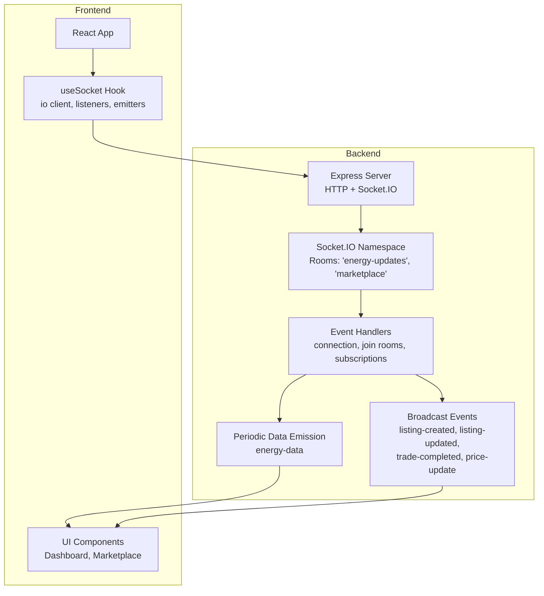
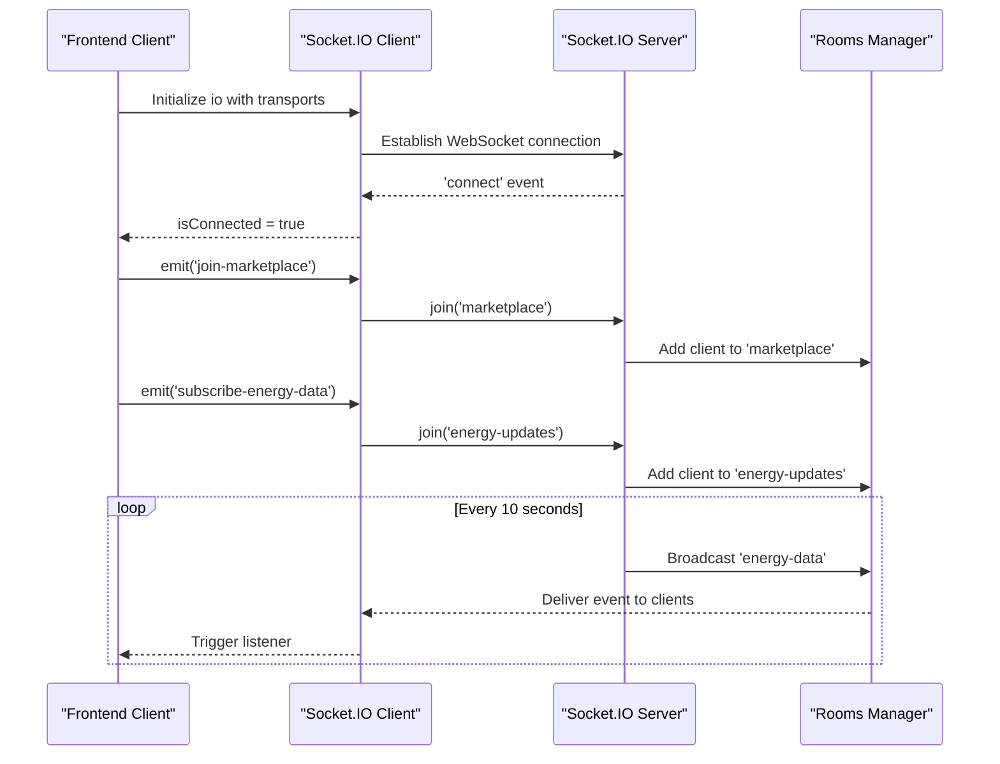
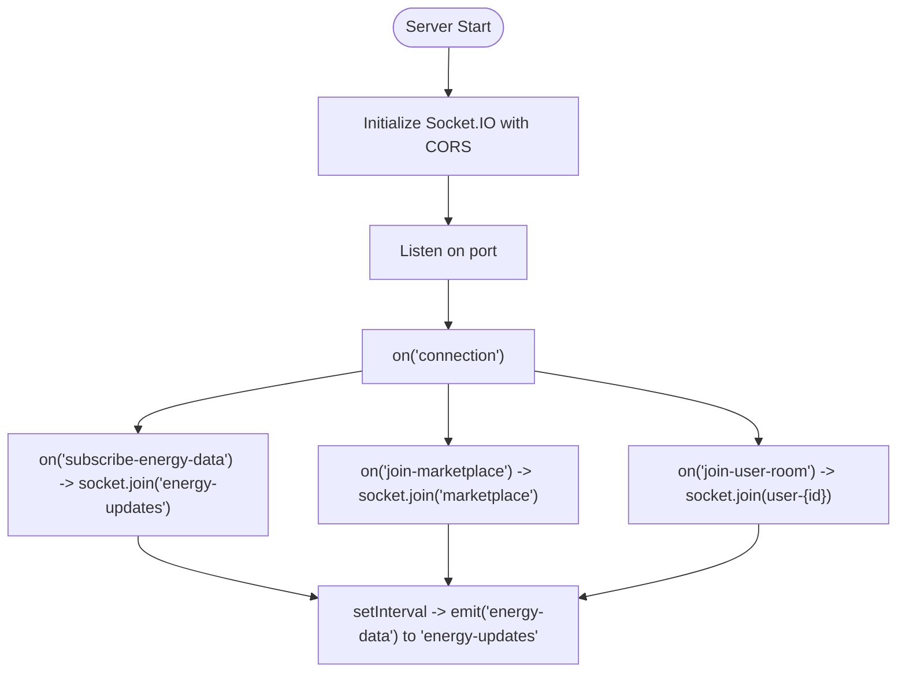
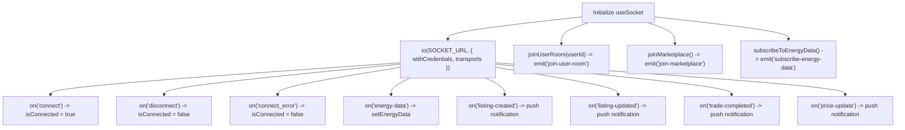
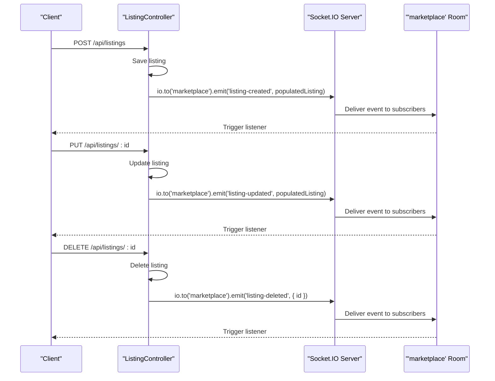
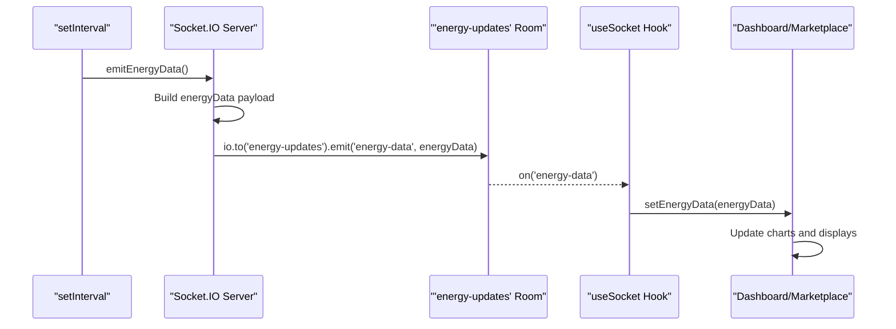
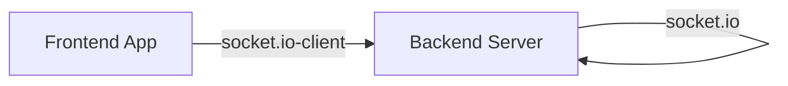

# Real-time Communication API

<cite>
**Referenced Files in This Document**
- [backend/index.js](file://backend/index.js)
- [backend/package.json](file://backend/package.json)
- [frontend/src/hooks/useSocket.js](file://frontend/src/hooks/useSocket.js)
- [frontend/src/frontend/Dashboard.jsx](file://frontend/src/frontend/Dashboard.jsx)
- [frontend/src/frontend/Marketplace.jsx](file://frontend/src/frontend/Marketplace.jsx)
- [frontend/package.json](file://frontend/package.json)
- [backend/Controllers/ListingController.js](file://backend/Controllers/ListingController.js)
- [backend/Controllers/TransactionController.js](file://backend/Controllers/TransactionController.js)
- [backend/Models/EnergyData.js](file://backend/Models/EnergyData.js)
- [backend/Models/Transaction.js](file://backend/Models/Transaction.js)
</cite>

## Table of Contents
1. [Introduction](#introduction)
2. [Project Structure](#project-structure)
3. [Core Components](#core-components)
4. [Architecture Overview](#architecture-overview)
5. [Detailed Component Analysis](#detailed-component-analysis)
6. [Dependency Analysis](#dependency-analysis)
7. [Performance Considerations](#performance-considerations)
8. [Troubleshooting Guide](#troubleshooting-guide)
9. [Conclusion](#conclusion)

## Introduction
This document provides comprehensive API documentation for real-time communication using Socket.IO within the EcoGrid platform. It covers connection protocols, event types, message formats, room-based communication, authentication handshake, and practical integration patterns. The system enables live energy data streaming, marketplace updates, and user notifications with robust connection management, reconnection strategies, and security considerations.

## Project Structure
The real-time communication spans two primary layers:
- Backend: Express server with Socket.IO integration, emitting periodic energy data and broadcasting marketplace events.
- Frontend: React hooks encapsulating Socket.IO client lifecycle, room subscriptions, and event listeners.

**Diagram sources**
- [backend/index.js](file://backend/index.js#L18-L24)
- [backend/index.js](file://backend/index.js#L48-L73)
- [backend/index.js](file://backend/index.js#L75-L89)
- [backend/Controllers/ListingController.js](file://backend/Controllers/ListingController.js#L82-L85)
- [frontend/src/hooks/useSocket.js](file://frontend/src/hooks/useSocket.js#L14-L17)
- [frontend/src/hooks/useSocket.js](file://frontend/src/hooks/useSocket.js#L36-L82)

**Section sources**
- [backend/index.js](file://backend/index.js#L1-L97)
- [frontend/src/hooks/useSocket.js](file://frontend/src/hooks/useSocket.js#L1-L142)

## Core Components
- Backend Socket.IO server with CORS configuration and room-based broadcasting.
- Frontend useSocket hook managing connection lifecycle, room joins, subscriptions, and event listeners.
- Controllers emitting real-time marketplace events to the 'marketplace' room.
- Periodic emission of energy data to the 'energy-updates' room.

Key capabilities:
- WebSocket transport with fallback to polling.
- Room-based communication for targeted updates.
- Event-driven real-time updates for listings, trades, and energy metrics.

**Section sources**
- [backend/index.js](file://backend/index.js#L18-L24)
- [backend/index.js](file://backend/index.js#L48-L73)
- [backend/index.js](file://backend/index.js#L75-L89)
- [frontend/src/hooks/useSocket.js](file://frontend/src/hooks/useSocket.js#L14-L17)
- [frontend/src/hooks/useSocket.js](file://frontend/src/hooks/useSocket.js#L90-L109)

## Architecture Overview
The real-time pipeline connects clients to the backend via Socket.IO, enabling bidirectional event exchange. Clients join rooms and subscribe to topics, while the backend emits updates periodically or upon business events.

**Diagram sources**
- [frontend/src/hooks/useSocket.js](file://frontend/src/hooks/useSocket.js#L14-L17)
- [frontend/src/hooks/useSocket.js](file://frontend/src/hooks/useSocket.js#L97-L109)
- [backend/index.js](file://backend/index.js#L57-L67)
- [backend/index.js](file://backend/index.js#L75-L89)

## Detailed Component Analysis

### Backend Socket.IO Server
Responsibilities:
- Initialize Socket.IO with CORS allowing the frontend origin.
- Manage client connections and handle room joins.
- Support subscriptions for energy data streams.
- Periodically emit energy data to the 'energy-updates' room.

Implementation highlights:
- CORS configuration for cross-origin requests.
- Room creation and joining for user-specific and marketplace contexts.
- Subscription handler to join the 'energy-updates' room.
- Interval-based emission of energy data.

**Diagram sources**
- [backend/index.js](file://backend/index.js#L18-L24)
- [backend/index.js](file://backend/index.js#L48-L73)
- [backend/index.js](file://backend/index.js#L75-L89)

**Section sources**
- [backend/index.js](file://backend/index.js#L18-L24)
- [backend/index.js](file://backend/index.js#L48-L73)
- [backend/index.js](file://backend/index.js#L75-L89)

### Frontend useSocket Hook
Responsibilities:
- Initialize Socket.IO client with credentials and transport preferences.
- Manage connection state and error handling.
- Subscribe to real-time events and update UI state.
- Provide convenience methods to join rooms and subscribe to energy data.

Key behaviors:
- Connects to the configured socket URL with credentials.
- Listens for 'connect', 'disconnect', and 'connect_error'.
- Subscribes to 'energy-data', 'listing-created', 'listing-updated', 'trade-completed', and 'price-update'.
- Exposes helpers to join rooms and emit custom events.

**Diagram sources**
- [frontend/src/hooks/useSocket.js](file://frontend/src/hooks/useSocket.js#L14-L17)
- [frontend/src/hooks/useSocket.js](file://frontend/src/hooks/useSocket.js#L21-L34)
- [frontend/src/hooks/useSocket.js](file://frontend/src/hooks/useSocket.js#L36-L82)
- [frontend/src/hooks/useSocket.js](file://frontend/src/hooks/useSocket.js#L90-L109)

**Section sources**
- [frontend/src/hooks/useSocket.js](file://frontend/src/hooks/useSocket.js#L1-L142)

### Marketplace Event Broadcasting
Controllers emit real-time marketplace events to the 'marketplace' room:
- 'listing-created' after successful listing creation.
- 'listing-updated' after listing modifications.
- 'listing-deleted' after listing removal.

**Diagram sources**
- [backend/Controllers/ListingController.js](file://backend/Controllers/ListingController.js#L82-L85)
- [backend/Controllers/ListingController.js](file://backend/Controllers/ListingController.js#L140-L143)
- [backend/Controllers/ListingController.js](file://backend/Controllers/ListingController.js#L186-L189)

**Section sources**
- [backend/Controllers/ListingController.js](file://backend/Controllers/ListingController.js#L82-L85)
- [backend/Controllers/ListingController.js](file://backend/Controllers/ListingController.js#L140-L143)
- [backend/Controllers/ListingController.js](file://backend/Controllers/ListingController.js#L186-L189)

### Energy Data Streaming
Backend periodically emits energy data to the 'energy-updates' room. Frontend components subscribe and render live metrics.

Message schema for 'energy-data':
- timestamp: ISO datetime string
- produced: numeric value
- consumed: numeric value
- gridPrice: numeric value
- solarOutput: numeric value
- windOutput: numeric value

**Diagram sources**
- [backend/index.js](file://backend/index.js#L75-L89)
- [frontend/src/hooks/useSocket.js](file://frontend/src/hooks/useSocket.js#L36-L39)
- [frontend/src/frontend/Dashboard.jsx](file://frontend/src/frontend/Dashboard.jsx#L132-L150)
- [frontend/src/frontend/Marketplace.jsx](file://frontend/src/frontend/Marketplace.jsx#L294-L302)

**Section sources**
- [backend/index.js](file://backend/index.js#L75-L89)
- [frontend/src/hooks/useSocket.js](file://frontend/src/hooks/useSocket.js#L36-L39)
- [frontend/src/frontend/Dashboard.jsx](file://frontend/src/frontend/Dashboard.jsx#L132-L150)
- [frontend/src/frontend/Marketplace.jsx](file://frontend/src/frontend/Marketplace.jsx#L294-L302)

### Authentication Handshake and Room Access
- The Socket.IO server is initialized with CORS allowing the frontend origin and credentials support.
- Clients establish a WebSocket connection with credentials enabled.
- Room access is controlled server-side via explicit join events:
  - 'join-user-room' for user-specific communications.
  - 'join-marketplace' for global marketplace updates.
  - 'subscribe-energy-data' for energy stream subscriptions.

Security considerations:
- CORS configuration restricts origins and methods.
- Credentials are supported for session-based authentication.
- Room membership is enforced server-side; clients cannot directly access rooms without proper join events.

**Section sources**
- [backend/index.js](file://backend/index.js#L18-L24)
- [backend/index.js](file://backend/index.js#L51-L61)
- [frontend/src/hooks/useSocket.js](file://frontend/src/hooks/useSocket.js#L90-L102)

## Dependency Analysis
External libraries:
- Backend: socket.io for real-time bidirectional communication.
- Frontend: socket.io-client for connecting to the server.

**Diagram sources**
- [backend/package.json](file://backend/package.json#L26)
- [frontend/package.json](file://frontend/package.json#L30)

**Section sources**
- [backend/package.json](file://backend/package.json#L13-L26)
- [frontend/package.json](file://frontend/package.json#L12-L32)

## Performance Considerations
- Frequency tuning: Energy data is emitted every 10 seconds. Adjust interval based on device capabilities and network conditions.
- Payload minimization: Keep event payloads concise; avoid unnecessary fields.
- Client-side buffering: Limit UI updates to prevent excessive re-renders; maintain fixed-size rolling windows for charts.
- Transport selection: Prefer WebSocket with polling fallback for reliability.
- Scalability: Use rooms to reduce broadcast fanout; consider partitioning by user or region for high-volume deployments.

## Troubleshooting Guide
Common issues and resolutions:
- Connection failures:
  - Verify CORS configuration matches the frontend origin.
  - Ensure credentials are enabled on the client and accepted by the server.
- Disconnections:
  - Monitor 'disconnect' and 'connect_error' events to detect and log issues.
  - Implement retry logic with exponential backoff in production.
- Room access problems:
  - Confirm clients emit join events before expecting messages.
  - Validate room names match server-side joins.
- Event delivery gaps:
  - Check that clients subscribe to the correct room and event names.
  - Review server logs for emission timing and room membership.

Integration tips:
- Initialize the socket in a React effect and clean up on unmount.
- Use helper methods to join rooms and subscribe to events.
- Debounce UI updates when receiving frequent events.

**Section sources**
- [frontend/src/hooks/useSocket.js](file://frontend/src/hooks/useSocket.js#L21-L34)
- [frontend/src/hooks/useSocket.js](file://frontend/src/hooks/useSocket.js#L84-L87)
- [backend/index.js](file://backend/index.js#L51-L61)

## Conclusion
The EcoGrid real-time communication system leverages Socket.IO to deliver responsive energy data, marketplace updates, and user notifications. With room-based communication, structured event schemas, and robust connection management, the platform supports scalable, low-latency interactions. By following the documented patterns and best practices, developers can integrate real-time features efficiently while maintaining performance and security.