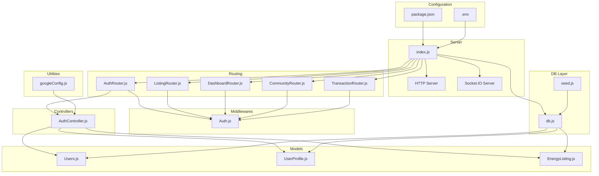
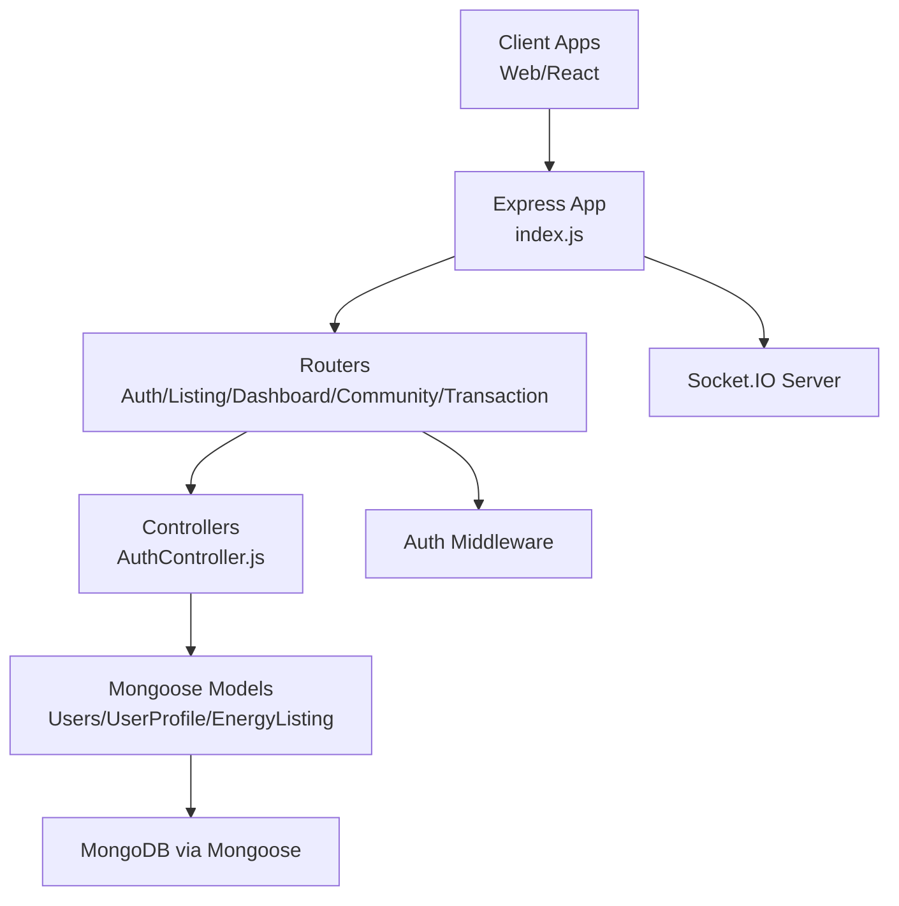
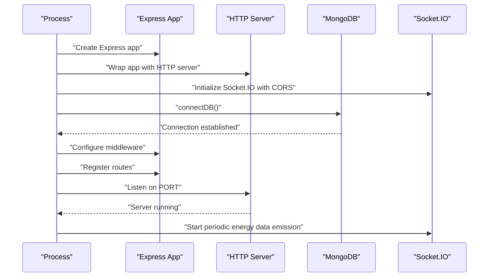
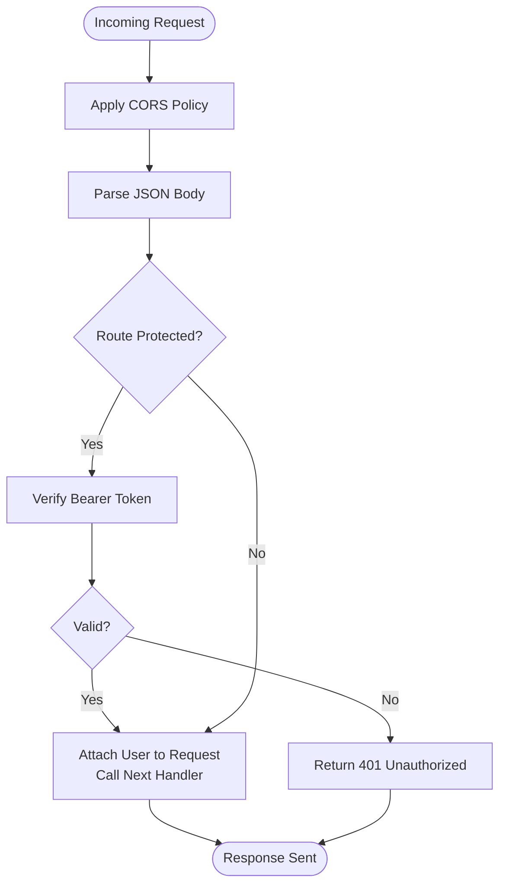
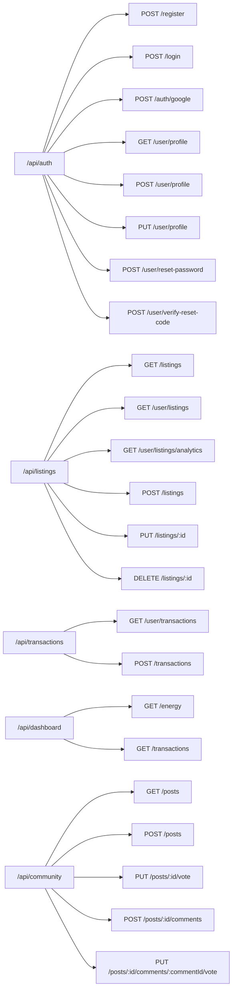
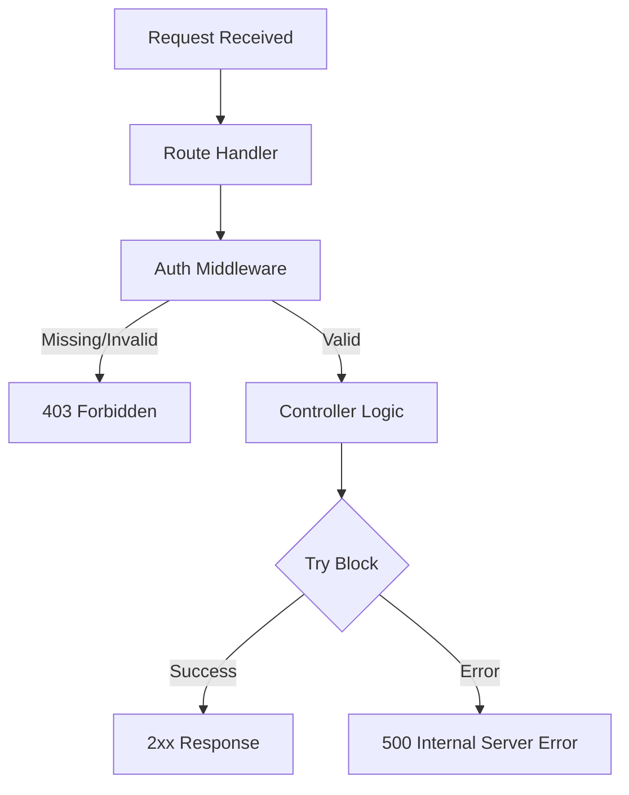
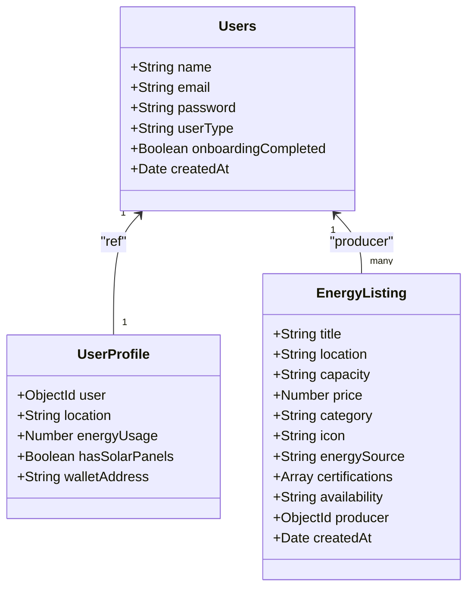
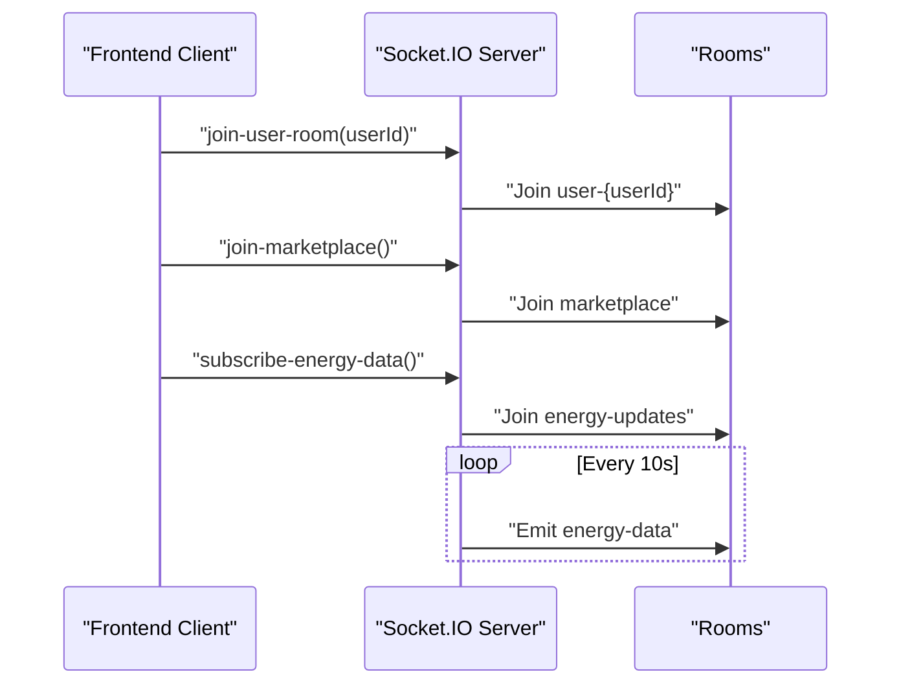
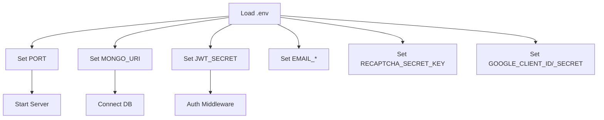
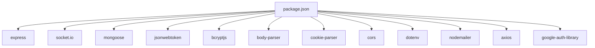

# API Architecture & Configuration

<cite>
**Referenced Files in This Document**
- [index.js](file://backend/index.js)
- [db.js](file://backend/DB/db.js)
- [package.json](file://backend/package.json)
- [.env](file://backend/.env)
- [AuthRouter.js](file://backend/Routes/AuthRouter.js)
- [ListingRouter.js](file://backend/Routes/ListingRouter.js)
- [DashboardRouter.js](file://backend/Routes/DashboardRouter.js)
- [CommunityRouter.js](file://backend/Routes/CommunityRouter.js)
- [TransactionRouter.js](file://backend/Routes/TransactionRouter.js)
- [Auth.js](file://backend/Middlewares/Auth.js)
- [AuthController.js](file://backend/Controllers/AuthController.js)
- [seed.js](file://backend/seed.js)
- [Users.js](file://backend/Models/Users.js)
- [UserProfile.js](file://backend/Models/UserProfile.js)
- [EnergyListing.js](file://backend/Models/EnergyListing.js)
- [googleConfig.js](file://backend/utils/googleConfig.js)
</cite>

## Table of Contents
1. [Introduction](#introduction)
2. [Project Structure](#project-structure)
3. [Core Components](#core-components)
4. [Architecture Overview](#architecture-overview)
5. [Detailed Component Analysis](#detailed-component-analysis)
6. [Dependency Analysis](#dependency-analysis)
7. [Performance Considerations](#performance-considerations)
8. [Troubleshooting Guide](#troubleshooting-guide)
9. [Conclusion](#conclusion)
10. [Appendices](#appendices)

## Introduction
This document describes the API architecture and configuration of the Node.js/Express backend server. It covers server initialization, middleware configuration, routing structure, RESTful API design, request/response patterns, error handling strategies, MongoDB connectivity via Mongoose, connection pooling and recovery, Socket.IO integration for real-time communication, environment configuration, CORS settings, security headers, startup procedures, health checks, monitoring, performance optimization, timeouts, and resource cleanup.

## Project Structure
The backend is organized by concerns:
- Entry point initializes Express, HTTP server, Socket.IO, connects to the database, configures middleware, registers routes, and starts the server.
- Routes define API endpoints grouped by domain (authentication, listings, transactions, dashboard, community).
- Controllers implement business logic and interact with models.
- Models define Mongoose schemas for MongoDB collections.
- Middlewares provide cross-cutting concerns like authentication.
- DB module encapsulates database connection.
- Utilities support third-party integrations (e.g., Google OAuth).
- Environment variables are loaded via dotenv.

**Diagram sources**
- [index.js](file://backend/index.js#L1-L97)
- [db.js](file://backend/DB/db.js#L1-L12)
- [package.json](file://backend/package.json#L1-L29)
- [.env](file://backend/.env#L1-L13)
- [AuthRouter.js](file://backend/Routes/AuthRouter.js#L1-L15)
- [ListingRouter.js](file://backend/Routes/ListingRouter.js#L1-L24)
- [DashboardRouter.js](file://backend/Routes/DashboardRouter.js#L1-L10)
- [CommunityRouter.js](file://backend/Routes/CommunityRouter.js#L1-L14)
- [TransactionRouter.js](file://backend/Routes/TransactionRouter.js#L1-L11)
- [AuthController.js](file://backend/Controllers/AuthController.js#L1-L200)
- [Auth.js](file://backend/Middlewares/Auth.js#L1-L19)
- [Users.js](file://backend/Models/Users.js#L1-L32)
- [UserProfile.js](file://backend/Models/UserProfile.js#L1-L31)
- [EnergyListing.js](file://backend/Models/EnergyListing.js#L1-L56)
- [seed.js](file://backend/seed.js#L1-L169)
- [googleConfig.js](file://backend/utils/googleConfig.js#L1-L14)

**Section sources**
- [index.js](file://backend/index.js#L1-L97)
- [package.json](file://backend/package.json#L1-L29)
- [.env](file://backend/.env#L1-L13)

## Core Components
- Express application and HTTP server creation with explicit HTTP server instantiation for Socket.IO compatibility.
- Socket.IO server configured with CORS and credential support, exposing rooms for user-specific and marketplace events.
- Centralized database connection via Mongoose with environment-driven URI.
- Middleware stack: CORS, body parsing, and JWT-based authentication guard.
- Modular routing under /api with domain-specific routers.
- Real-time emission loop simulating energy data updates.

Key implementation references:
- Server initialization and Socket.IO setup: [index.js](file://backend/index.js#L14-L24)
- CORS and JSON body parsing: [index.js](file://backend/index.js#L29-L35)
- Route registration: [index.js](file://backend/index.js#L41-L45)
- Socket.IO connection handler and rooms: [index.js](file://backend/index.js#L48-L73)
- Periodic energy data emission: [index.js](file://backend/index.js#L76-L89)
- Database connection: [db.js](file://backend/DB/db.js#L3-L10)
- Authentication middleware: [Auth.js](file://backend/Middlewares/Auth.js#L3-L18)

**Section sources**
- [index.js](file://backend/index.js#L14-L97)
- [db.js](file://backend/DB/db.js#L1-L12)
- [Auth.js](file://backend/Middlewares/Auth.js#L1-L19)

## Architecture Overview
The backend follows a layered architecture:
- Presentation layer: Express routes and controllers.
- Application layer: Business logic in controllers.
- Domain layer: Models and database operations.
- Infrastructure layer: Database connection, Socket.IO, environment configuration.

**Diagram sources**
- [index.js](file://backend/index.js#L1-L97)
- [AuthRouter.js](file://backend/Routes/AuthRouter.js#L1-L15)
- [ListingRouter.js](file://backend/Routes/ListingRouter.js#L1-L24)
- [DashboardRouter.js](file://backend/Routes/DashboardRouter.js#L1-L10)
- [CommunityRouter.js](file://backend/Routes/CommunityRouter.js#L1-L14)
- [TransactionRouter.js](file://backend/Routes/TransactionRouter.js#L1-L11)
- [AuthController.js](file://backend/Controllers/AuthController.js#L1-L200)
- [Auth.js](file://backend/Middlewares/Auth.js#L1-L19)
- [Users.js](file://backend/Models/Users.js#L1-L32)
- [UserProfile.js](file://backend/Models/UserProfile.js#L1-L31)
- [EnergyListing.js](file://backend/Models/EnergyListing.js#L1-L56)

## Detailed Component Analysis

### Server Initialization and Startup
- Creates Express app and HTTP server.
- Initializes Socket.IO with CORS allowing origin, methods, and credentials.
- Loads environment variables and connects to MongoDB.
- Registers middleware and routes.
- Starts HTTP server on configured port and logs WebSocket readiness.

**Diagram sources**
- [index.js](file://backend/index.js#L14-L97)
- [db.js](file://backend/DB/db.js#L3-L10)

**Section sources**
- [index.js](file://backend/index.js#L14-L97)
- [db.js](file://backend/DB/db.js#L1-L12)

### Middleware Configuration
- CORS: Allows credentials and restricts origin to development frontend URL.
- Body parser: Parses JSON payloads.
- Authentication: Validates Authorization header bearer tokens against JWT secret.

**Diagram sources**
- [index.js](file://backend/index.js#L29-L35)
- [Auth.js](file://backend/Middlewares/Auth.js#L3-L18)

**Section sources**
- [index.js](file://backend/index.js#L29-L35)
- [Auth.js](file://backend/Middlewares/Auth.js#L1-L19)

### Routing Structure and RESTful Design
- Base path: /api
- Auth endpoints: register, login, Google OAuth, profile CRUD, reset password, verify reset code.
- Listings endpoints: public browse, user-specific listings, analytics, create/update/delete.
- Transactions endpoints: user transactions history, create transaction.
- Dashboard endpoints: energy data, transactions summary.
- Community endpoints: posts listing, create post, voting, comments, comment voting.

**Diagram sources**
- [AuthRouter.js](file://backend/Routes/AuthRouter.js#L1-L15)
- [ListingRouter.js](file://backend/Routes/ListingRouter.js#L1-L24)
- [TransactionRouter.js](file://backend/Routes/TransactionRouter.js#L1-L11)
- [DashboardRouter.js](file://backend/Routes/DashboardRouter.js#L1-L10)
- [CommunityRouter.js](file://backend/Routes/CommunityRouter.js#L1-L14)

**Section sources**
- [AuthRouter.js](file://backend/Routes/AuthRouter.js#L1-L15)
- [ListingRouter.js](file://backend/Routes/ListingRouter.js#L1-L24)
- [TransactionRouter.js](file://backend/Routes/TransactionRouter.js#L1-L11)
- [DashboardRouter.js](file://backend/Routes/DashboardRouter.js#L1-L10)
- [CommunityRouter.js](file://backend/Routes/CommunityRouter.js#L1-L14)

### Request/Response Patterns and Error Handling
- Authentication middleware returns 403 for missing/invalid Authorization header and 401 for invalid/expired tokens.
- Controllers handle validation, persistence, and standardized success/error responses with appropriate HTTP status codes.
- Global environment variables drive secrets and service configurations.

**Diagram sources**
- [Auth.js](file://backend/Middlewares/Auth.js#L3-L18)
- [AuthController.js](file://backend/Controllers/AuthController.js#L49-L101)
- [AuthController.js](file://backend/Controllers/AuthController.js#L105-L155)

**Section sources**
- [Auth.js](file://backend/Middlewares/Auth.js#L1-L19)
- [AuthController.js](file://backend/Controllers/AuthController.js#L49-L155)

### Database Connection with MongoDB and Mongoose
- Connection function attempts to connect using MONGO_URI from environment.
- Models define schemas for Users, UserProfile, and EnergyListing.
- Seed script demonstrates population of demo data and clearing existing listings.

**Diagram sources**
- [Users.js](file://backend/Models/Users.js#L1-L32)
- [UserProfile.js](file://backend/Models/UserProfile.js#L1-L31)
- [EnergyListing.js](file://backend/Models/EnergyListing.js#L1-L56)

**Section sources**
- [db.js](file://backend/DB/db.js#L1-L12)
- [Users.js](file://backend/Models/Users.js#L1-L32)
- [UserProfile.js](file://backend/Models/UserProfile.js#L1-L31)
- [EnergyListing.js](file://backend/Models/EnergyListing.js#L1-L56)
- [seed.js](file://backend/seed.js#L1-L169)

### Socket.IO Integration for Real-Time Communication
- Socket.IO server bound to HTTP server with CORS configuration.
- Rooms:
  - User-specific room keyed by user ID.
  - Marketplace room for listing updates.
  - Energy updates room for real-time metrics.
- Events:
  - join-user-room(userId)
  - join-marketplace()
  - subscribe-energy-data()
  - energy-data payload emitted periodically to energy-updates room.

**Diagram sources**
- [index.js](file://backend/index.js#L48-L89)

**Section sources**
- [index.js](file://backend/index.js#L18-L89)

### Environment Configuration, CORS, and Security Headers
- Environment variables include port, MongoDB URI, JWT secret, email service credentials, reCAPTCHA secret, and Google OAuth client credentials.
- CORS enabled for development origin with credentials support.
- Authentication middleware enforces Bearer token presence and validity.

**Diagram sources**
- [.env](file://backend/.env#L1-L13)
- [index.js](file://backend/index.js#L29-L35)
- [Auth.js](file://backend/Middlewares/Auth.js#L10-L12)

**Section sources**
- [.env](file://backend/.env#L1-L13)
- [index.js](file://backend/index.js#L29-L35)
- [Auth.js](file://backend/Middlewares/Auth.js#L1-L19)

### Health Checks and Monitoring Setup
- Basic health indicator: root GET endpoint returns a simple message.
- Periodic emission of simulated energy data for real-time monitoring.
- Logging of connection/disconnection events and room joins.

Recommended additions (conceptual):
- Dedicated /health endpoint returning status and uptime.
- Metrics exposure via Prometheus-compatible endpoint.
- Winston or similar logger for structured logs.

**Section sources**
- [index.js](file://backend/index.js#L40-L40)
- [index.js](file://backend/index.js#L76-L89)

### Performance Optimization and Resource Cleanup
- Connection pooling: Mongoose manages pools by default; tune options via connection config if needed.
- Request timeout: Configure Express timeout middleware for long-running requests.
- Resource cleanup: Close Socket.IO gracefully on shutdown signals; ensure database disconnect on process exit.

[No sources needed since this section provides general guidance]

## Dependency Analysis
External dependencies include Express, Socket.IO, Mongoose, JWT, bcrypt, body-parser, cookie-parser, cors, dotenv, nodemailer, axios, and google-auth-library. The application uses ES modules with type set to module.

**Diagram sources**
- [package.json](file://backend/package.json#L13-L26)

**Section sources**
- [package.json](file://backend/package.json#L1-L29)

## Performance Considerations
- Enable compression for responses.
- Use pagination for listing endpoints.
- Index frequently queried fields in MongoDB.
- Implement rate limiting for authentication endpoints.
- Tune Socket.IO transports and ping intervals for production.
- Monitor memory usage and restart unhealthy processes.

[No sources needed since this section provides general guidance]

## Troubleshooting Guide
Common issues and remedies:
- Database connection failures: Verify MONGO_URI and network access; check connection logs.
- Authentication errors: Confirm Authorization header format and JWT_SECRET correctness.
- CORS errors: Ensure frontend origin matches configured origin and credentials are enabled.
- Socket.IO disconnections: Validate client-side room joins and event names.
- Environment variable mismatches: Confirm .env values and dotenv loading order.

**Section sources**
- [db.js](file://backend/DB/db.js#L3-L10)
- [Auth.js](file://backend/Middlewares/Auth.js#L3-L18)
- [index.js](file://backend/index.js#L29-L35)
- [index.js](file://backend/index.js#L48-L73)

## Conclusion
The backend provides a modular, layered architecture with clear separation of concerns. It integrates Express for routing, Mongoose for MongoDB persistence, Socket.IO for real-time features, and JWT for authentication. The design supports RESTful APIs, robust error handling, and extensible middleware. With proper environment configuration, monitoring, and performance tuning, the system can scale effectively.

## Appendices
- Authentication flow highlights:
  - Registration validates reCAPTCHA and user type, hashes password, and persists user.
  - Login verifies credentials, reCAPTCHA, and issues signed JWT.
  - Profile endpoints require authenticated sessions.

**Section sources**
- [AuthController.js](file://backend/Controllers/AuthController.js#L49-L155)
- [Auth.js](file://backend/Middlewares/Auth.js#L1-L19)
- [googleConfig.js](file://backend/utils/googleConfig.js#L1-L14)