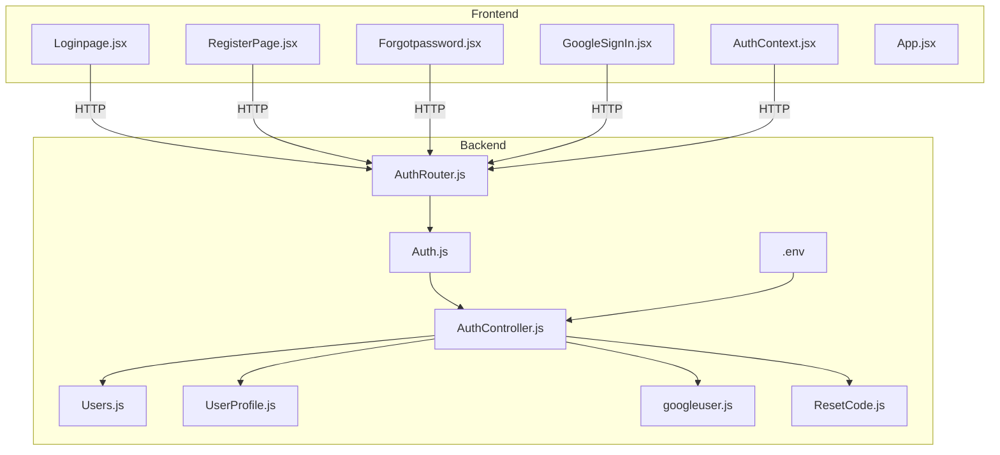
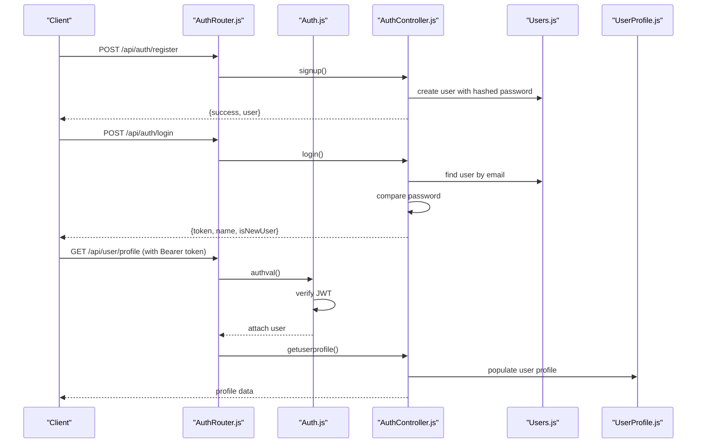
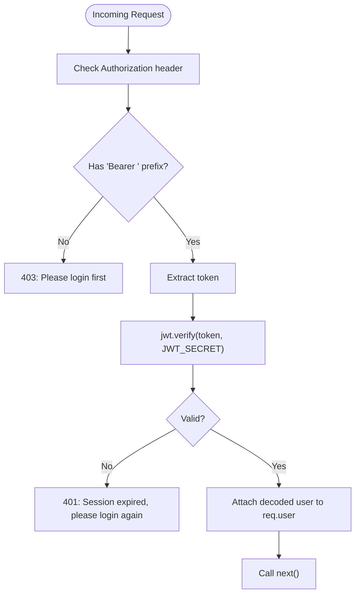
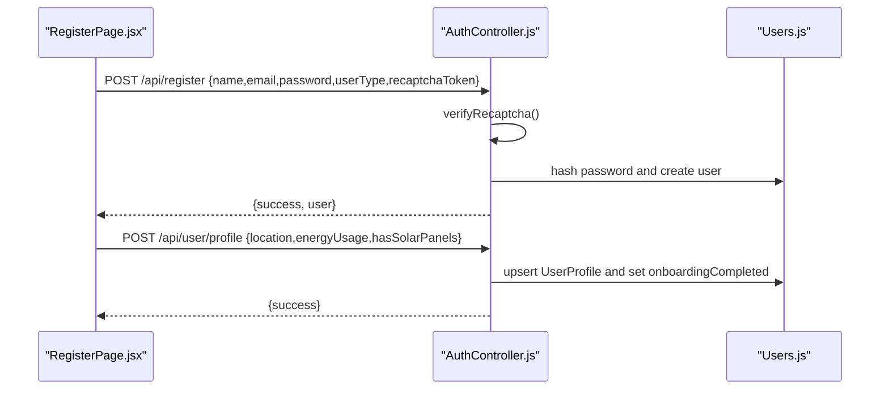
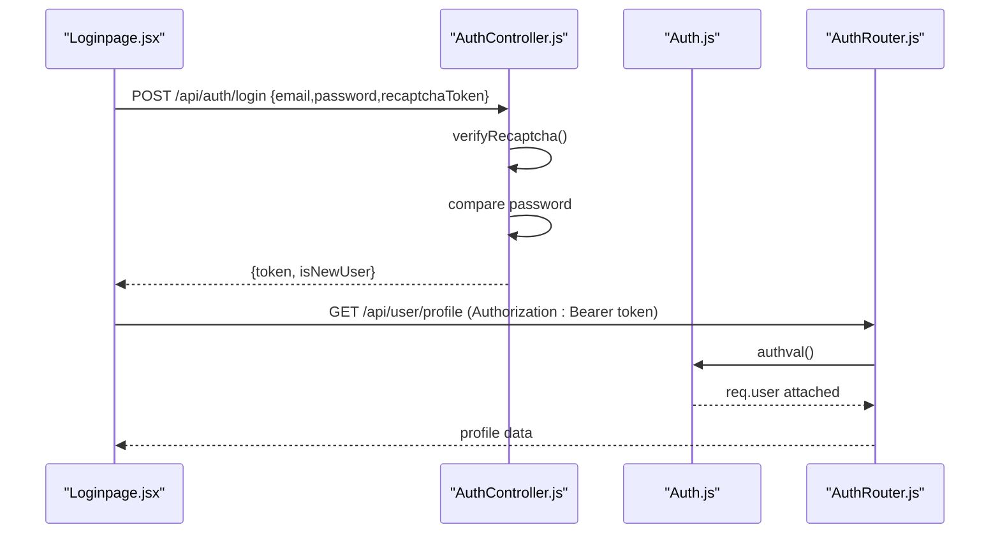
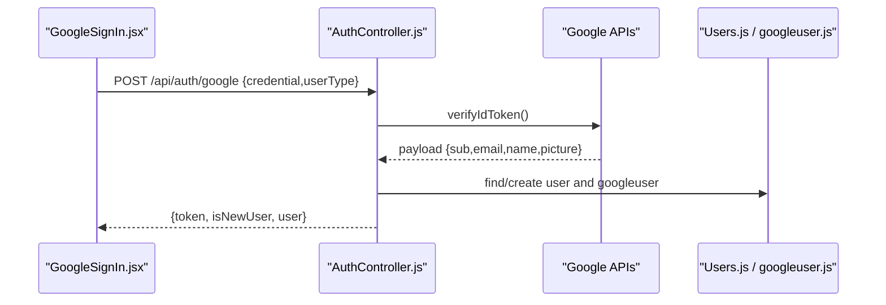
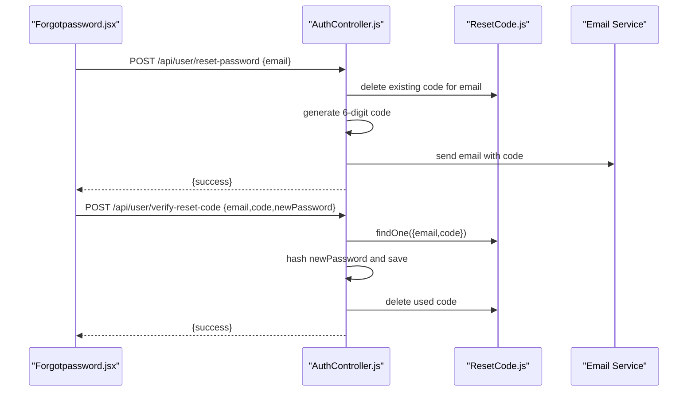
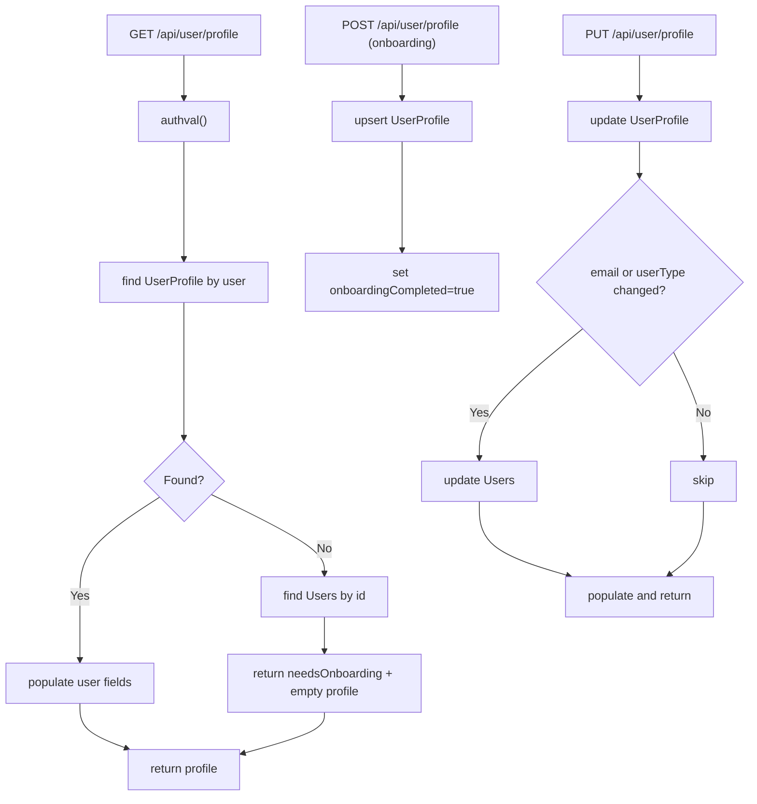
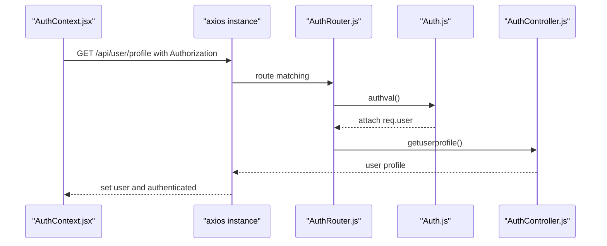
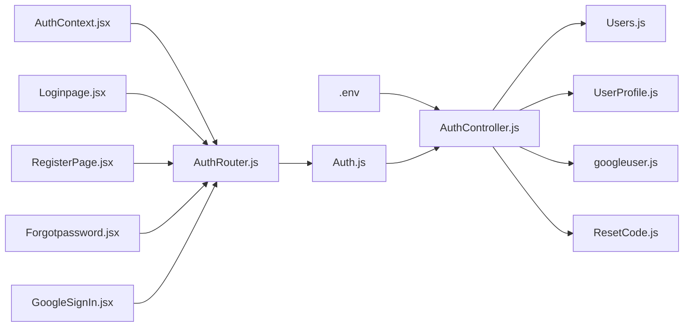

# Authentication System

<cite>
**Referenced Files in This Document**
- [AuthController.js](file://backend/Controllers/AuthController.js)
- [Auth.js](file://backend/Middlewares/Auth.js)
- [AuthRouter.js](file://backend/Routes/AuthRouter.js)
- [Users.js](file://backend/Models/Users.js)
- [UserProfile.js](file://backend/Models/UserProfile.js)
- [googleuser.js](file://backend/Models/googleuser.js)
- [ResetCode.js](file://backend/Models/ResetCode.js)
- [AuthContext.jsx](file://frontend/src/Context/AuthContext.jsx)
- [GoogleSignIn.jsx](file://frontend/src/components/GoogleSignIn.jsx)
- [Loginpage.jsx](file://frontend/src/frontend/Loginpage.jsx)
- [RegisterPage.jsx](file://frontend/src/frontend/RegisterPage.jsx)
- [Forgotpassword.jsx](file://frontend/src/frontend/Forgotpassword.jsx)
- [App.jsx](file://frontend/src/App.jsx)
- [api.js](file://frontend/src/api.js)
- [.env](file://backend/.env)
</cite>

## Table of Contents
1. [Introduction](#introduction)
2. [Project Structure](#project-structure)
3. [Core Components](#core-components)
4. [Architecture Overview](#architecture-overview)
5. [Detailed Component Analysis](#detailed-component-analysis)
6. [Dependency Analysis](#dependency-analysis)
7. [Performance Considerations](#performance-considerations)
8. [Troubleshooting Guide](#troubleshooting-guide)
9. [Conclusion](#conclusion)
10. [Appendices](#appendices)

## Introduction
This document describes the authentication system for the EcoGrid platform. It covers JWT-based user authentication and authorization, including the complete flow from registration to login, password hashing, token generation, and session management. It also documents the JWT middleware for route protection, user registration with onboarding, login/logout mechanisms, token refresh strategies, profile management, error handling, and security best practices. Client-side integration examples and token storage guidance are included.

## Project Structure
The authentication system spans backend controllers, middlewares, routes, and MongoDB models, and integrates with a React frontend that manages tokens and protected routing.

**Diagram sources**
- [AuthRouter.js](file://backend/Routes/AuthRouter.js#L1-L15)
- [Auth.js](file://backend/Middlewares/Auth.js#L1-L19)
- [AuthController.js](file://backend/Controllers/AuthController.js#L1-L482)
- [Users.js](file://backend/Models/Users.js#L1-L32)
- [UserProfile.js](file://backend/Models/UserProfile.js#L1-L31)
- [googleuser.js](file://backend/Models/googleuser.js#L1-L33)
- [ResetCode.js](file://backend/Models/ResetCode.js#L1-L23)
- [AuthContext.jsx](file://frontend/src/Context/AuthContext.jsx#L1-L70)
- [GoogleSignIn.jsx](file://frontend/src/components/GoogleSignIn.jsx#L1-L106)
- [Loginpage.jsx](file://frontend/src/frontend/Loginpage.jsx#L1-L353)
- [RegisterPage.jsx](file://frontend/src/frontend/RegisterPage.jsx#L1-L434)
- [Forgotpassword.jsx](file://frontend/src/frontend/Forgotpassword.jsx#L1-L322)
- [App.jsx](file://frontend/src/App.jsx#L1-L79)
- [.env](file://backend/.env#L1-L13)

**Section sources**
- [AuthRouter.js](file://backend/Routes/AuthRouter.js#L1-L15)
- [Auth.js](file://backend/Middlewares/Auth.js#L1-L19)
- [AuthController.js](file://backend/Controllers/AuthController.js#L1-L482)
- [Users.js](file://backend/Models/Users.js#L1-L32)
- [UserProfile.js](file://backend/Models/UserProfile.js#L1-L31)
- [googleuser.js](file://backend/Models/googleuser.js#L1-L33)
- [ResetCode.js](file://backend/Models/ResetCode.js#L1-L23)
- [AuthContext.jsx](file://frontend/src/Context/AuthContext.jsx#L1-L70)
- [GoogleSignIn.jsx](file://frontend/src/components/GoogleSignIn.jsx#L1-L106)
- [Loginpage.jsx](file://frontend/src/frontend/Loginpage.jsx#L1-L353)
- [RegisterPage.jsx](file://frontend/src/frontend/RegisterPage.jsx#L1-L434)
- [Forgotpassword.jsx](file://frontend/src/frontend/Forgotpassword.jsx#L1-L322)
- [App.jsx](file://frontend/src/App.jsx#L1-L79)
- [.env](file://backend/.env#L1-L13)

## Core Components
- Backend JWT Middleware: Validates Authorization header and attaches user payload to requests.
- Authentication Controller: Implements registration, login, Google OAuth, profile CRUD, password reset, and code verification.
- Routes: Expose endpoints for auth and profile management.
- Models: Define Users, UserProfile, googleuser, and ResetCode collections.
- Frontend Auth Context: Manages token retrieval, user hydration, and protected routing.
- Frontend Components: Provide login, registration, forgot password, and Google sign-in flows.

**Section sources**
- [Auth.js](file://backend/Middlewares/Auth.js#L1-L19)
- [AuthController.js](file://backend/Controllers/AuthController.js#L1-L482)
- [AuthRouter.js](file://backend/Routes/AuthRouter.js#L1-L15)
- [Users.js](file://backend/Models/Users.js#L1-L32)
- [UserProfile.js](file://backend/Models/UserProfile.js#L1-L31)
- [googleuser.js](file://backend/Models/googleuser.js#L1-L33)
- [ResetCode.js](file://backend/Models/ResetCode.js#L1-L23)
- [AuthContext.jsx](file://frontend/src/Context/AuthContext.jsx#L1-L70)
- [Loginpage.jsx](file://frontend/src/frontend/Loginpage.jsx#L1-L353)
- [RegisterPage.jsx](file://frontend/src/frontend/RegisterPage.jsx#L1-L434)
- [Forgotpassword.jsx](file://frontend/src/frontend/Forgotpassword.jsx#L1-L322)

## Architecture Overview
The system uses bearer tokens for stateless authentication. The frontend stores tokens in localStorage or sessionStorage and sends Authorization headers. The backend middleware verifies tokens and exposes protected endpoints for profile management and onboarding.

**Diagram sources**
- [AuthRouter.js](file://backend/Routes/AuthRouter.js#L1-L15)
- [Auth.js](file://backend/Middlewares/Auth.js#L1-L19)
- [AuthController.js](file://backend/Controllers/AuthController.js#L49-L219)
- [Users.js](file://backend/Models/Users.js#L1-L32)
- [UserProfile.js](file://backend/Models/UserProfile.js#L1-L31)

## Detailed Component Analysis

### JWT Middleware
- Extracts Authorization header and validates Bearer token.
- Verifies JWT signature using environment-provided secret.
- Attaches decoded user payload to request for downstream handlers.

**Diagram sources**
- [Auth.js](file://backend/Middlewares/Auth.js#L3-L18)

**Section sources**
- [Auth.js](file://backend/Middlewares/Auth.js#L1-L19)

### Registration and Onboarding
- Registration endpoint hashes passwords and requires userType and reCAPTCHA.
- Onboarding saves location, energy usage, and solar panel presence; marks onboardingCompleted.

**Diagram sources**
- [RegisterPage.jsx](file://frontend/src/frontend/RegisterPage.jsx#L104-L126)
- [AuthController.js](file://backend/Controllers/AuthController.js#L49-L101)
- [AuthController.js](file://backend/Controllers/AuthController.js#L158-L194)
- [Users.js](file://backend/Models/Users.js#L1-L32)

**Section sources**
- [AuthController.js](file://backend/Controllers/AuthController.js#L49-L101)
- [AuthController.js](file://backend/Controllers/AuthController.js#L158-L194)
- [RegisterPage.jsx](file://frontend/src/frontend/RegisterPage.jsx#L104-L126)
- [Users.js](file://backend/Models/Users.js#L1-L32)

### Login and Token Management
- Login validates credentials and reCAPTCHA, then issues a signed JWT with 24-hour expiry.
- Frontend stores token in localStorage or sessionStorage depending on “remember me”.
- Protected routes require a valid Bearer token.

**Diagram sources**
- [Loginpage.jsx](file://frontend/src/frontend/Loginpage.jsx#L48-L77)
- [AuthController.js](file://backend/Controllers/AuthController.js#L105-L155)
- [Auth.js](file://backend/Middlewares/Auth.js#L3-L18)
- [AuthRouter.js](file://backend/Routes/AuthRouter.js#L10-L10)

**Section sources**
- [AuthController.js](file://backend/Controllers/AuthController.js#L105-L155)
- [Loginpage.jsx](file://frontend/src/frontend/Loginpage.jsx#L48-L77)
- [Auth.js](file://backend/Middlewares/Auth.js#L1-L19)
- [AuthRouter.js](file://backend/Routes/AuthRouter.js#L10-L10)

### Google OAuth
- Frontend obtains Google credential and posts to backend.
- Backend verifies ID token, creates/syncs user records, and issues JWT.

**Diagram sources**
- [GoogleSignIn.jsx](file://frontend/src/components/GoogleSignIn.jsx#L43-L88)
- [AuthController.js](file://backend/Controllers/AuthController.js#L384-L482)
- [Users.js](file://backend/Models/Users.js#L1-L32)
- [googleuser.js](file://backend/Models/googleuser.js#L1-L33)

**Section sources**
- [GoogleSignIn.jsx](file://frontend/src/components/GoogleSignIn.jsx#L1-L106)
- [AuthController.js](file://backend/Controllers/AuthController.js#L384-L482)
- [Users.js](file://backend/Models/Users.js#L1-L32)
- [googleuser.js](file://backend/Models/googleuser.js#L1-L33)

### Password Reset Workflow
- Request reset code via email; code expires in 1 hour.
- Verify code and set new password.

**Diagram sources**
- [Forgotpassword.jsx](file://frontend/src/frontend/Forgotpassword.jsx#L19-L49)
- [AuthController.js](file://backend/Controllers/AuthController.js#L271-L381)
- [ResetCode.js](file://backend/Models/ResetCode.js#L1-L23)

**Section sources**
- [Forgotpassword.jsx](file://frontend/src/frontend/Forgotpassword.jsx#L1-L322)
- [AuthController.js](file://backend/Controllers/AuthController.js#L271-L381)
- [ResetCode.js](file://backend/Models/ResetCode.js#L1-L23)

### User Profile Management
- Retrieve profile with user data population.
- Upsert profile during onboarding.
- Edit profile and propagate email/userType updates to base user.

**Diagram sources**
- [AuthController.js](file://backend/Controllers/AuthController.js#L196-L261)
- [UserProfile.js](file://backend/Models/UserProfile.js#L1-L31)
- [Users.js](file://backend/Models/Users.js#L1-L32)

**Section sources**
- [AuthController.js](file://backend/Controllers/AuthController.js#L196-L261)
- [UserProfile.js](file://backend/Models/UserProfile.js#L1-L31)
- [Users.js](file://backend/Models/Users.js#L1-L32)

### Frontend Authentication Integration
- AuthContext hydrates user from stored token and sets authenticated state.
- LoginPage and RegisterPage collect reCAPTCHA tokens and persist tokens locally/session.
- Protected routes redirect unauthenticated users.

**Diagram sources**
- [AuthContext.jsx](file://frontend/src/Context/AuthContext.jsx#L17-L46)
- [AuthRouter.js](file://backend/Routes/AuthRouter.js#L10-L10)
- [Auth.js](file://backend/Middlewares/Auth.js#L3-L18)
- [AuthController.js](file://backend/Controllers/AuthController.js#L196-L219)

**Section sources**
- [AuthContext.jsx](file://frontend/src/Context/AuthContext.jsx#L1-L70)
- [App.jsx](file://frontend/src/App.jsx#L38-L47)
- [AuthRouter.js](file://backend/Routes/AuthRouter.js#L10-L10)
- [Auth.js](file://backend/Middlewares/Auth.js#L1-L19)
- [AuthController.js](file://backend/Controllers/AuthController.js#L196-L219)

## Dependency Analysis
- Backend depends on environment variables for JWT secret, email, and Google OAuth.
- Controllers depend on models for persistence and external services for reCAPTCHA and email.
- Frontend depends on AuthContext and route guards for protected navigation.

**Diagram sources**
- [.env](file://backend/.env#L1-L13)
- [AuthController.js](file://backend/Controllers/AuthController.js#L1-L482)
- [Users.js](file://backend/Models/Users.js#L1-L32)
- [UserProfile.js](file://backend/Models/UserProfile.js#L1-L31)
- [googleuser.js](file://backend/Models/googleuser.js#L1-L33)
- [ResetCode.js](file://backend/Models/ResetCode.js#L1-L23)
- [Auth.js](file://backend/Middlewares/Auth.js#L1-L19)
- [AuthRouter.js](file://backend/Routes/AuthRouter.js#L1-L15)
- [AuthContext.jsx](file://frontend/src/Context/AuthContext.jsx#L1-L70)
- [Loginpage.jsx](file://frontend/src/frontend/Loginpage.jsx#L1-L353)
- [RegisterPage.jsx](file://frontend/src/frontend/RegisterPage.jsx#L1-L434)
- [Forgotpassword.jsx](file://frontend/src/frontend/Forgotpassword.jsx#L1-L322)
- [GoogleSignIn.jsx](file://frontend/src/components/GoogleSignIn.jsx#L1-L106)

**Section sources**
- [.env](file://backend/.env#L1-L13)
- [AuthController.js](file://backend/Controllers/AuthController.js#L1-L482)
- [AuthRouter.js](file://backend/Routes/AuthRouter.js#L1-L15)
- [Auth.js](file://backend/Middlewares/Auth.js#L1-L19)
- [Users.js](file://backend/Models/Users.js#L1-L32)
- [UserProfile.js](file://backend/Models/UserProfile.js#L1-L31)
- [googleuser.js](file://backend/Models/googleuser.js#L1-L33)
- [ResetCode.js](file://backend/Models/ResetCode.js#L1-L23)
- [AuthContext.jsx](file://frontend/src/Context/AuthContext.jsx#L1-L70)
- [Loginpage.jsx](file://frontend/src/frontend/Loginpage.jsx#L1-L353)
- [RegisterPage.jsx](file://frontend/src/frontend/RegisterPage.jsx#L1-L434)
- [Forgotpassword.jsx](file://frontend/src/frontend/Forgotpassword.jsx#L1-L322)
- [GoogleSignIn.jsx](file://frontend/src/components/GoogleSignIn.jsx#L1-L106)

## Performance Considerations
- Token lifetime: 24 hours; consider shorter expirations with refresh tokens for higher security.
- Password hashing cost: bcrypt salt rounds are fixed; ensure adequate server resources.
- Database indexes: Ensure unique indexes on email fields in Users and googleuser collections.
- Email delivery: Asynchronous email sending; monitor delivery failures and retry strategies.
- Rate limiting: Consider rate-limiting login and reset endpoints to mitigate brute-force attempts.

[No sources needed since this section provides general guidance]

## Troubleshooting Guide
Common issues and resolutions:
- Invalid or missing Authorization header: Ensure clients send Bearer token.
- Expired token: Prompt users to log in again; implement token refresh strategy.
- reCAPTCHA failure: Re-render widget and inform users to complete verification.
- Email reset failures: Verify SMTP settings and logs; confirm domain sender configuration.
- Duplicate email on registration: Return conflict and prompt user to use another email.

**Section sources**
- [Auth.js](file://backend/Middlewares/Auth.js#L6-L17)
- [AuthController.js](file://backend/Controllers/AuthController.js#L12-L47)
- [Forgotpassword.jsx](file://frontend/src/frontend/Forgotpassword.jsx#L20-L26)
- [RegisterPage.jsx](file://frontend/src/frontend/RegisterPage.jsx#L115-L122)

## Conclusion
The authentication system provides a robust JWT-based flow with secure password handling, profile management, and Google OAuth integration. It supports onboarding, password reset, and protected routing. Enhancements such as refresh tokens, stricter rate limits, and improved error messaging would further strengthen the system.

[No sources needed since this section summarizes without analyzing specific files]

## Appendices

### API Endpoints Summary
- POST /api/auth/register: {name,email,password,userType,recaptchaToken}
- POST /api/auth/login: {email,password,recaptchaToken}
- POST /api/auth/google: {credential,userType}
- GET /api/user/profile: requires Authorization
- POST /api/user/profile: {location,energyUsage,hasSolarPanels}
- PUT /api/user/profile: {location,energyUsage,hasSolarPanels,email,userType,walletAddress}
- POST /api/user/reset-password: {email}
- POST /api/user/verify-reset-code: {email,code,newPassword}

**Section sources**
- [AuthRouter.js](file://backend/Routes/AuthRouter.js#L7-L14)
- [AuthController.js](file://backend/Controllers/AuthController.js#L49-L381)

### Client-Side Token Storage Examples
- Login with “remember me”: store token in localStorage.
- Login without “remember me”: store token in sessionStorage.
- Hydration: on app load, check for token and fetch profile to set authenticated state.

**Section sources**
- [Loginpage.jsx](file://frontend/src/frontend/Loginpage.jsx#L60-L61)
- [AuthContext.jsx](file://frontend/src/Context/AuthContext.jsx#L18-L46)

### Security Best Practices
- Use HTTPS in production.
- Rotate JWT_SECRET regularly.
- Enforce strong password policies and consider multi-factor authentication.
- Limit login attempts and implement account lockout.
- Sanitize and validate all inputs; avoid exposing sensitive data in error responses.

[No sources needed since this section provides general guidance]