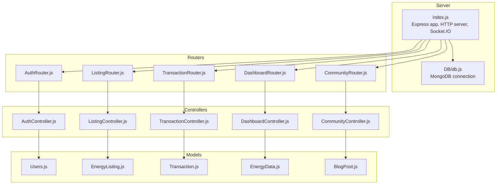
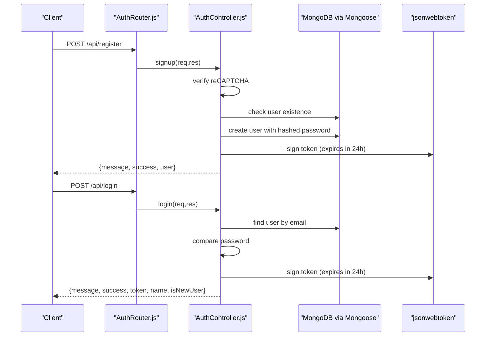
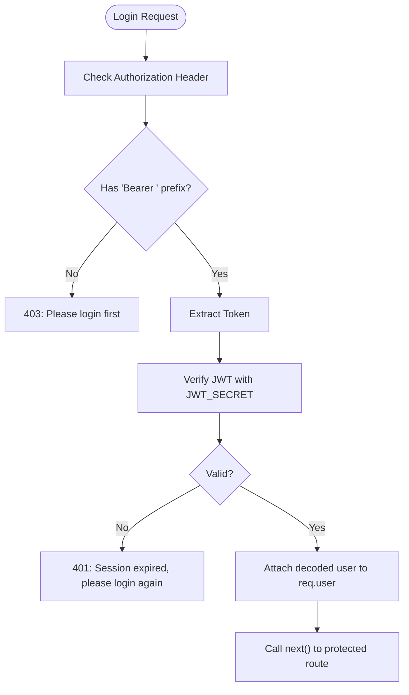
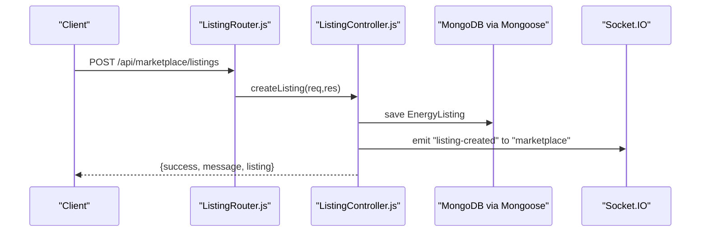
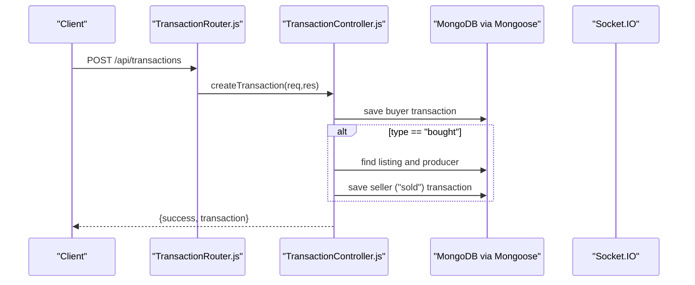
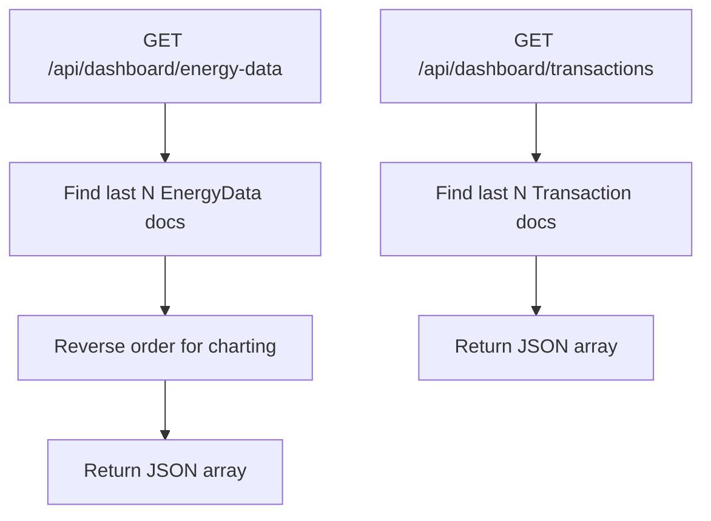
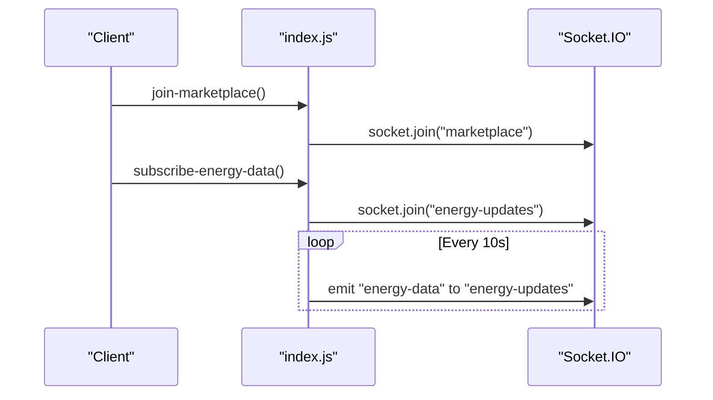
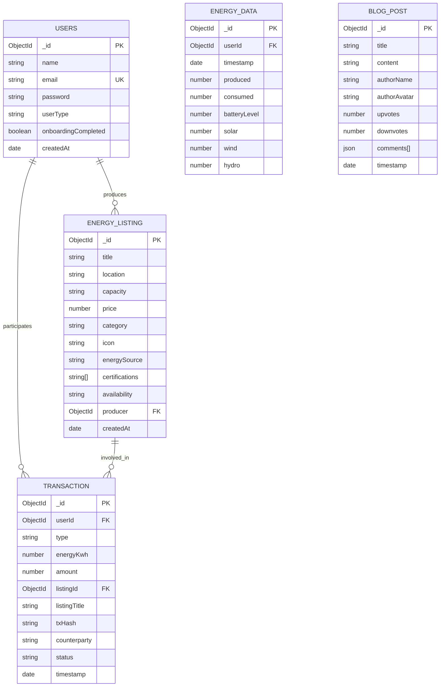
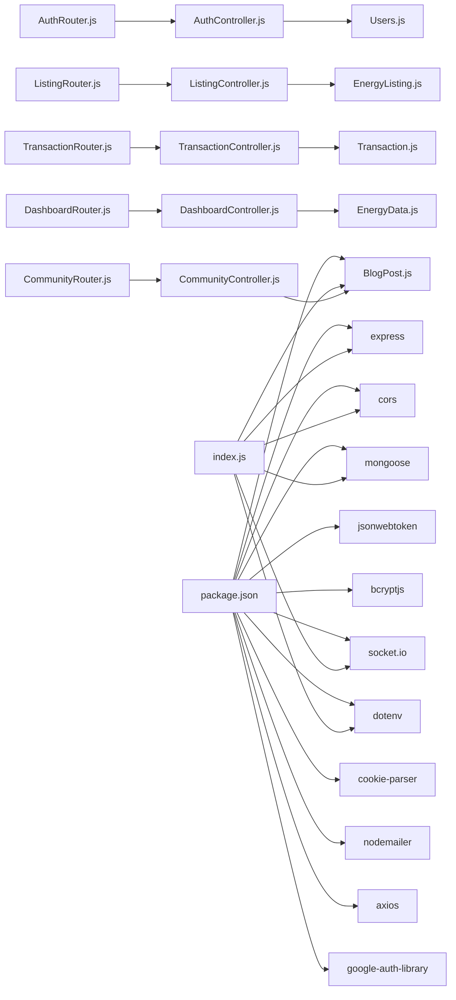

# Backend API Services

<cite>
**Referenced Files in This Document**
- [index.js](file://backend/index.js)
- [db.js](file://backend/DB/db.js)
- [Auth.js](file://backend/Middlewares/Auth.js)
- [AuthController.js](file://backend/Controllers/AuthController.js)
- [AuthRouter.js](file://backend/Routes/AuthRouter.js)
- [DashboardController.js](file://backend/Controllers/DashboardController.js)
- [ListingController.js](file://backend/Controllers/ListingController.js)
- [TransactionController.js](file://backend/Controllers/TransactionController.js)
- [CommunityController.js](file://backend/Controllers/CommunityController.js)
- [Users.js](file://backend/Models/Users.js)
- [EnergyListing.js](file://backend/Models/EnergyListing.js)
- [Transaction.js](file://backend/Models/Transaction.js)
- [EnergyData.js](file://backend/Models/EnergyData.js)
- [BlogPost.js](file://backend/Models/BlogPost.js)
- [package.json](file://backend/package.json)
- [.env](file://backend/.env)
</cite>

## Table of Contents
1. [Introduction](#introduction)
2. [Project Structure](#project-structure)
3. [Core Components](#core-components)
4. [Architecture Overview](#architecture-overview)
5. [Detailed Component Analysis](#detailed-component-analysis)
6. [Dependency Analysis](#dependency-analysis)
7. [Performance Considerations](#performance-considerations)
8. [Troubleshooting Guide](#troubleshooting-guide)
9. [Conclusion](#conclusion)
10. [Appendices](#appendices)

## Introduction
This document describes the backend API services for the Node.js/Express server powering the EcoGrid platform. It covers the RESTful API architecture, endpoint specifications, authentication and authorization mechanisms, controller pattern implementation, database integration with MongoDB via Mongoose, real-time communication with Socket.IO, error handling, input validation, security measures, and operational guidance. The API supports authentication, dashboard analytics, marketplace operations, and transaction processing.

## Project Structure
The backend is organized around a modular Express application with clear separation of concerns:
- Entry point initializes Express, HTTP server, Socket.IO, CORS, body parsing, and routes.
- Database connection module configures Mongoose.
- Middleware enforces JWT-based authentication.
- Controllers encapsulate business logic per domain (authentication, marketplace, transactions, community, dashboard).
- Models define Mongoose schemas for persistence.
- Routes bind endpoints to controllers and apply middleware.

**Diagram sources**
- [index.js](file://backend/index.js#L1-L97)
- [db.js](file://backend/DB/db.js#L1-L12)
- [AuthRouter.js](file://backend/Routes/AuthRouter.js#L1-L15)
- [ListingController.js](file://backend/Controllers/ListingController.js#L1-L253)
- [TransactionController.js](file://backend/Controllers/TransactionController.js#L1-L68)
- [DashboardController.js](file://backend/Controllers/DashboardController.js#L1-L25)
- [CommunityController.js](file://backend/Controllers/CommunityController.js#L1-L107)
- [Users.js](file://backend/Models/Users.js#L1-L32)
- [EnergyListing.js](file://backend/Models/EnergyListing.js#L1-L56)
- [Transaction.js](file://backend/Models/Transaction.js#L1-L51)
- [EnergyData.js](file://backend/Models/EnergyData.js#L1-L43)
- [BlogPost.js](file://backend/Models/BlogPost.js)

**Section sources**
- [index.js](file://backend/index.js#L1-L97)
- [db.js](file://backend/DB/db.js#L1-L12)

## Core Components
- Express server and HTTP server initialization with Socket.IO for real-time capabilities.
- Centralized CORS configuration and JSON body parsing.
- Route registration under /api and domain-specific subpaths (/api/dashboard, /api/community).
- Socket.IO rooms for user-specific and marketplace updates, plus periodic energy data broadcasting.
- Authentication middleware validating Bearer tokens against JWT_SECRET.
- Controllers implementing CRUD and analytics for marketplace, transactions, community, and dashboard.
- Mongoose models enforcing schema constraints and references.

Key implementation references:
- Server bootstrap and Socket.IO setup: [index.js](file://backend/index.js#L14-L97)
- Database connection: [db.js](file://backend/DB/db.js#L1-L12)
- Authentication middleware: [Auth.js](file://backend/Middlewares/Auth.js#L1-L19)
- Controllers: [AuthController.js](file://backend/Controllers/AuthController.js#L1-L482), [ListingController.js](file://backend/Controllers/ListingController.js#L1-L253), [TransactionController.js](file://backend/Controllers/TransactionController.js#L1-L68), [DashboardController.js](file://backend/Controllers/DashboardController.js#L1-L25), [CommunityController.js](file://backend/Controllers/CommunityController.js#L1-L107)
- Models: [Users.js](file://backend/Models/Users.js#L1-L32), [EnergyListing.js](file://backend/Models/EnergyListing.js#L1-L56), [Transaction.js](file://backend/Models/Transaction.js#L1-L51), [EnergyData.js](file://backend/Models/EnergyData.js#L1-L43), [BlogPost.js](file://backend/Models/BlogPost.js)

**Section sources**
- [index.js](file://backend/index.js#L14-L97)
- [db.js](file://backend/DB/db.js#L1-L12)
- [Auth.js](file://backend/Middlewares/Auth.js#L1-L19)
- [AuthController.js](file://backend/Controllers/AuthController.js#L1-L482)
- [ListingController.js](file://backend/Controllers/ListingController.js#L1-L253)
- [TransactionController.js](file://backend/Controllers/TransactionController.js#L1-L68)
- [DashboardController.js](file://backend/Controllers/DashboardController.js#L1-L25)
- [CommunityController.js](file://backend/Controllers/CommunityController.js#L1-L107)
- [Users.js](file://backend/Models/Users.js#L1-L32)
- [EnergyListing.js](file://backend/Models/EnergyListing.js#L1-L56)
- [Transaction.js](file://backend/Models/Transaction.js#L1-L51)
- [EnergyData.js](file://backend/Models/EnergyData.js#L1-L43)
- [BlogPost.js](file://backend/Models/BlogPost.js)

## Architecture Overview
The backend follows a layered architecture:
- Entry point initializes infrastructure and mounts routers.
- Routers define endpoint contracts and delegate to controllers.
- Controllers orchestrate business logic, interact with models, and emit Socket.IO events when applicable.
- Models define data structures and relationships; Mongoose handles validation and persistence.
- Middleware enforces authentication and authorization.

**Diagram sources**
- [AuthRouter.js](file://backend/Routes/AuthRouter.js#L1-L15)
- [AuthController.js](file://backend/Controllers/AuthController.js#L49-L155)
- [Users.js](file://backend/Models/Users.js#L1-L32)

**Section sources**
- [index.js](file://backend/index.js#L14-L46)
- [AuthRouter.js](file://backend/Routes/AuthRouter.js#L1-L15)
- [AuthController.js](file://backend/Controllers/AuthController.js#L49-L155)

## Detailed Component Analysis

### Authentication and Authorization
- Endpoint contracts:
  - POST /api/register: Creates a new user with reCAPTCHA verification and hashed password.
  - POST /api/login: Authenticates user and returns a signed JWT token.
  - POST /api/auth/google: Google OAuth login/signup with secure token verification.
  - GET /api/user/profile: Protected route to retrieve profile; requires Bearer token.
  - POST /api/user/profile: Protected route to save onboarding profile.
  - PUT /api/user/profile: Protected route to update profile and optionally user attributes.
  - POST /api/user/reset-password: Sends a password reset code via email.
  - POST /api/user/verify-reset-code: Verifies code and resets password.
- JWT middleware:
  - Validates Authorization header presence and Bearer scheme.
  - Verifies token signature using JWT_SECRET.
  - Attaches decoded user info to request for protected routes.
- Security measures:
  - Environment variables for JWT_SECRET, email credentials, and Google OAuth client.
  - Password hashing with bcrypt.
  - Email transport via nodemailer.
  - reCAPTCHA v3 verification for signup and login.

**Diagram sources**
- [Auth.js](file://backend/Middlewares/Auth.js#L3-L18)

**Section sources**
- [AuthRouter.js](file://backend/Routes/AuthRouter.js#L7-L14)
- [AuthController.js](file://backend/Controllers/AuthController.js#L49-L155)
- [Auth.js](file://backend/Middlewares/Auth.js#L1-L19)
- [.env](file://backend/.env#L1-L13)

### Marketplace Operations
- Endpoints:
  - GET /api/marketplace/listings?category=&search=: Fetch paginated and filtered listings with producer name population.
  - GET /api/marketplace/my-listings: Fetch current user’s listings.
  - POST /api/marketplace/listings: Create a new listing; emits “listing-created” to marketplace room.
  - PUT /api/marketplace/listings/:id: Update listing with ownership validation; emits “listing-updated”.
  - DELETE /api/marketplace/listings/:id: Delete listing with ownership validation; emits “listing-deleted”.
  - GET /api/marketplace/analytics: Aggregated analytics for the current user’s listings.
- Real-time updates:
  - Controllers emit Socket.IO events to the “marketplace” room upon create/update/delete.
  - Frontend joins “marketplace” room to receive live updates.

**Diagram sources**
- [ListingController.js](file://backend/Controllers/ListingController.js#L59-L99)

**Section sources**
- [ListingController.js](file://backend/Controllers/ListingController.js#L1-L253)
- [index.js](file://backend/index.js#L48-L73)

### Transaction Processing
- Endpoints:
  - GET /api/transactions: Fetch current user’s transactions.
  - POST /api/transactions: Create a buyer transaction; automatically creates a matching “sold” transaction for the producer when type is “bought”.
- Data model:
  - Tracks userId, type (bought/sold), energyKwh, amount, listing linkage, txHash, counterparty, status, and timestamp.

**Diagram sources**
- [TransactionController.js](file://backend/Controllers/TransactionController.js#L19-L67)

**Section sources**
- [TransactionController.js](file://backend/Controllers/TransactionController.js#L1-L68)
- [Transaction.js](file://backend/Models/Transaction.js#L1-L51)

### Dashboard Analytics
- Endpoints:
  - GET /api/dashboard/energy-data: Retrieve recent energy data for charts.
  - GET /api/dashboard/transactions: Retrieve recent transactions.
- Data sources:
  - Energy data stored in EnergyData model.
  - Transactions stored in Transaction model.

**Diagram sources**
- [DashboardController.js](file://backend/Controllers/DashboardController.js#L4-L24)
- [EnergyData.js](file://backend/Models/EnergyData.js#L1-L43)
- [Transaction.js](file://backend/Models/Transaction.js#L1-L51)

**Section sources**
- [DashboardController.js](file://backend/Controllers/DashboardController.js#L1-L25)

### Community and Blog
- Endpoints:
  - GET /api/community/posts?sort=: Fetch posts with sorting options (newest, oldest, popular).
  - POST /api/community/posts: Create a new post.
  - POST /api/community/posts/:id/vote: Vote on a post (up/down).
  - POST /api/community/posts/:id/comments: Add a comment to a post.
  - POST /api/community/posts/:id/comments/:commentId/vote: Vote on a comment.
- Data model:
  - BlogPost with embedded comments and upvote/downvote counters.

**Section sources**
- [CommunityController.js](file://backend/Controllers/CommunityController.js#L1-L107)
- [BlogPost.js](file://backend/Models/BlogPost.js)

### Real-Time Communication with Socket.IO
- Rooms:
  - User-specific room: “user-{userId}”
  - Marketplace room: “marketplace”
  - Energy updates room: “energy-updates”
- Events:
  - join-user-room(userId): Client joins personal room.
  - join-marketplace(): Client joins marketplace room.
  - subscribe-energy-data(): Client subscribes to energy updates.
  - listing-created, listing-updated, listing-deleted: Emitted by marketplace controller.
  - energy-data: Periodic broadcast of simulated smart meter data.
- Server emits every 10 seconds to “energy-updates”.

**Diagram sources**
- [index.js](file://backend/index.js#L48-L89)

**Section sources**
- [index.js](file://backend/index.js#L18-L89)

### Database Integration with MongoDB and Mongoose
- Connection:
  - Mongoose connects to URI from environment variables.
- Models:
  - Users: name, email (unique), password, userType, onboarding flag, timestamps.
  - EnergyListing: title, location, capacity, price, category, icon, energySource, certifications, availability, producer reference, timestamps.
  - Transaction: userId reference, type, energyKwh, amount, listingId reference, listingTitle, txHash, counterparty, status, timestamp.
  - EnergyData: userId reference, timestamp, produced, consumed, batteryLevel, solar/wind/hydro.
  - BlogPost: title, content, author metadata, comments with nested voting, timestamps.

**Diagram sources**
- [Users.js](file://backend/Models/Users.js#L1-L32)
- [EnergyListing.js](file://backend/Models/EnergyListing.js#L1-L56)
- [Transaction.js](file://backend/Models/Transaction.js#L1-L51)
- [EnergyData.js](file://backend/Models/EnergyData.js#L1-L43)
- [BlogPost.js](file://backend/Models/BlogPost.js)

**Section sources**
- [db.js](file://backend/DB/db.js#L1-L12)
- [Users.js](file://backend/Models/Users.js#L1-L32)
- [EnergyListing.js](file://backend/Models/EnergyListing.js#L1-L56)
- [Transaction.js](file://backend/Models/Transaction.js#L1-L51)
- [EnergyData.js](file://backend/Models/EnergyData.js#L1-L43)
- [BlogPost.js](file://backend/Models/BlogPost.js)

## Dependency Analysis
- External libraries:
  - express, cors, body-parser, mongoose, jsonwebtoken, bcryptjs, socket.io, dotenv, cookie-parser, nodemailer, axios, google-auth-library.
- Internal dependencies:
  - Routes depend on Controllers.
  - Controllers depend on Models and Mongoose.
  - Auth middleware depends on JWT and environment secrets.
  - Socket.IO is initialized in the entry point and shared via app settings.

**Diagram sources**
- [package.json](file://backend/package.json#L13-L26)
- [index.js](file://backend/index.js#L1-L12)
- [AuthRouter.js](file://backend/Routes/AuthRouter.js#L1-L3)
- [ListingController.js](file://backend/Controllers/ListingController.js#L1-L2)
- [TransactionController.js](file://backend/Controllers/TransactionController.js#L1-L2)
- [DashboardController.js](file://backend/Controllers/DashboardController.js#L1-L2)
- [CommunityController.js](file://backend/Controllers/CommunityController.js#L1-L1)
- [Users.js](file://backend/Models/Users.js#L1-L2)
- [EnergyListing.js](file://backend/Models/EnergyListing.js#L1-L3)
- [Transaction.js](file://backend/Models/Transaction.js#L1-L3)
- [EnergyData.js](file://backend/Models/EnergyData.js#L1-L3)
- [BlogPost.js](file://backend/Models/BlogPost.js)

**Section sources**
- [package.json](file://backend/package.json#L13-L26)
- [index.js](file://backend/index.js#L1-L12)

## Performance Considerations
- Database queries:
  - Use appropriate indexes on frequently queried fields (e.g., email on Users, timestamps on EnergyData/Transaction).
  - Apply pagination and limits in controllers (e.g., limit results).
- Socket.IO:
  - Keep rooms minimal and targeted; avoid unnecessary broadcasts.
  - Throttle emissions (already implemented with interval-based energy data).
- Middleware:
  - Ensure JWT verification occurs early to fail fast for invalid requests.
- Caching:
  - Consider caching static or read-heavy data where feasible.
- Connection pooling:
  - Mongoose manages connection pooling; ensure proper environment configuration.

[No sources needed since this section provides general guidance]

## Troubleshooting Guide
- Authentication failures:
  - Missing or malformed Authorization header: returns 403.
  - Invalid/expired token: returns 401.
  - Verify JWT_SECRET correctness and token expiration.
- Database connectivity:
  - Confirm MONGO_URI and network access.
  - Check for connection errors on startup.
- Socket.IO:
  - Ensure clients join “marketplace” and “energy-updates” rooms.
  - Verify CORS configuration allows the frontend origin.
- Email/password reset:
  - Validate EMAIL_SERVICE, EMAIL_USER, EMAIL_PASSWORD.
  - Confirm reset code model cleanup and expiry behavior.
- Rate limiting and security:
  - Consider adding rate limiting middleware for sensitive endpoints (login, reset).
  - Enforce HTTPS in production and secure cookies if needed.

**Section sources**
- [Auth.js](file://backend/Middlewares/Auth.js#L3-L18)
- [db.js](file://backend/DB/db.js#L3-L10)
- [index.js](file://backend/index.js#L18-L34)
- [AuthController.js](file://backend/Controllers/AuthController.js#L263-L335)

## Conclusion
The backend provides a robust, modular foundation for the EcoGrid platform with clear separation of concerns, strong authentication and authorization, real-time capabilities, and scalable data modeling. By adhering to the documented patterns and addressing the recommendations herein, teams can maintain reliability, security, and performance as the platform evolves.

[No sources needed since this section summarizes without analyzing specific files]

## Appendices

### API Reference Summary

- Authentication
  - POST /api/register: Body includes name, email, password, userType, recaptchaToken. Returns success and user.
  - POST /api/login: Body includes email, password, recaptchaToken. Returns success, token, name, isNewUser.
  - POST /api/auth/google: Body includes credential, userType. Returns success, token, isNewUser, user details.
  - GET /api/user/profile: Requires Bearer token. Returns profile or user with onboarding flag.
  - POST /api/user/profile: Requires Bearer token. Saves onboarding profile and marks onboarding completed.
  - PUT /api/user/profile: Requires Bearer token. Updates profile and optionally user email/userType.
  - POST /api/user/reset-password: Body includes email. Sends reset code via email.
  - POST /api/user/verify-reset-code: Body includes email, code, newPassword. Resets password.

- Marketplace
  - GET /api/marketplace/listings?category=&search=: Returns paginated and filtered listings with producer name.
  - GET /api/marketplace/my-listings: Returns current user’s listings.
  - POST /api/marketplace/listings: Body includes title, location, capacity, price, category, icon. Emits “listing-created”.
  - PUT /api/marketplace/listings/:id: Body includes listing fields. Emits “listing-updated”.
  - DELETE /api/marketplace/listings/:id: Emits “listing-deleted”.
  - GET /api/marketplace/analytics: Returns aggregated stats for current user’s listings.

- Transactions
  - GET /api/transactions: Returns current user’s recent transactions.
  - POST /api/transactions: Body includes type, energyKwh, amount, listingId, listingTitle, txHash, counterparty. Auto-creates matching “sold” record when type is “bought”.

- Dashboard
  - GET /api/dashboard/energy-data: Returns recent energy data for charts.
  - GET /api/dashboard/transactions: Returns recent transactions.

- Community
  - GET /api/community/posts?sort=: Returns posts sorted by newest, oldest, or popularity.
  - POST /api/community/posts: Body includes title, content, authorName, authorAvatar. Creates a post.
  - POST /api/community/posts/:id/vote: Body includes isUpvote. Votes on a post.
  - POST /api/community/posts/:id/comments: Body includes content, authorName, authorAvatar. Adds a comment.
  - POST /api/community/posts/:id/comments/:commentId/vote: Body includes isUpvote. Votes on a comment.

**Section sources**
- [AuthRouter.js](file://backend/Routes/AuthRouter.js#L7-L14)
- [ListingController.js](file://backend/Controllers/ListingController.js#L5-L202)
- [TransactionController.js](file://backend/Controllers/TransactionController.js#L4-L67)
- [DashboardController.js](file://backend/Controllers/DashboardController.js#L4-L24)
- [CommunityController.js](file://backend/Controllers/CommunityController.js#L3-L106)

### CORS and Security Notes
- CORS configured for frontend origin and credentials.
- JWT-based authentication enforced via middleware on protected routes.
- Environment variables manage secrets and third-party integrations.

**Section sources**
- [index.js](file://backend/index.js#L29-L34)
- [Auth.js](file://backend/Middlewares/Auth.js#L3-L18)
- [.env](file://backend/.env#L1-L13)