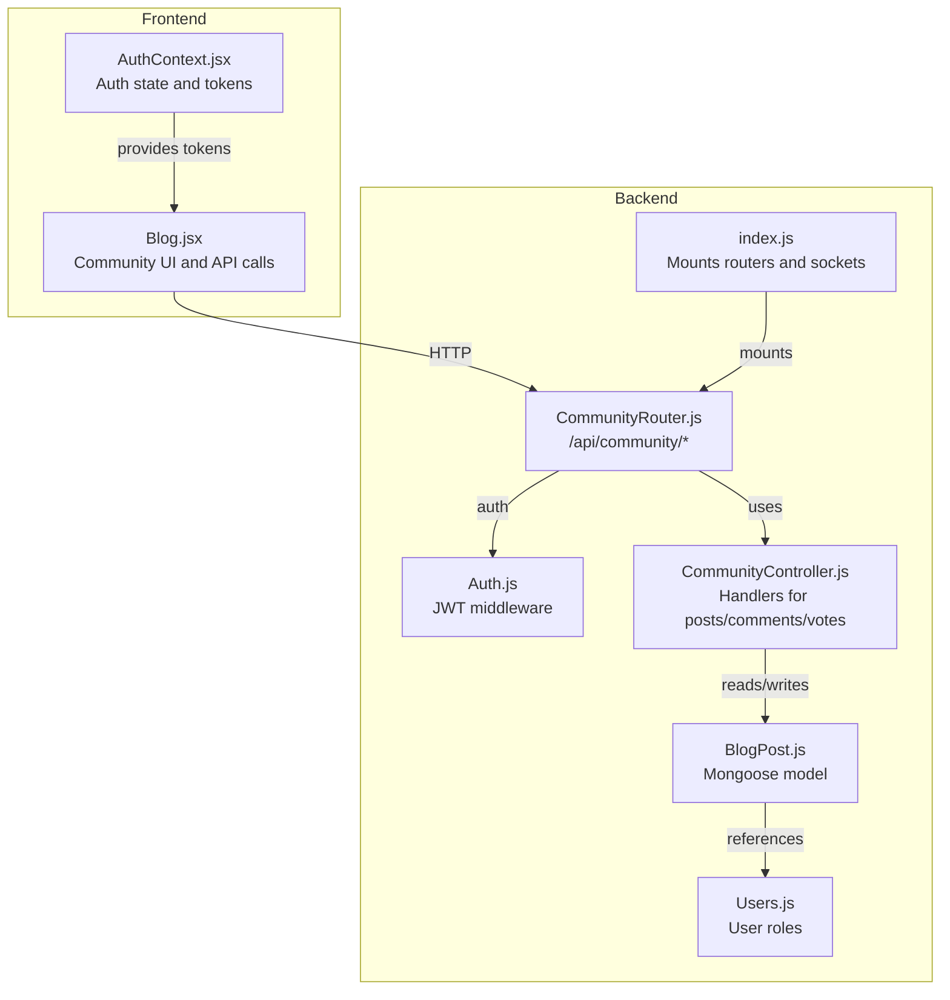
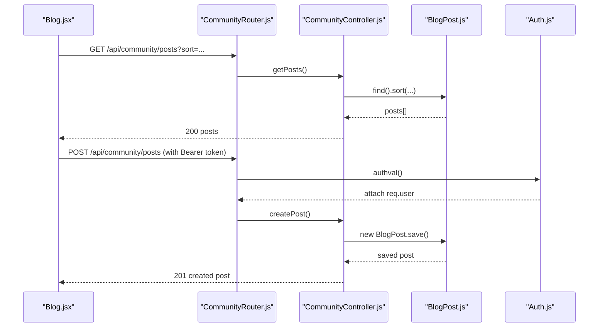
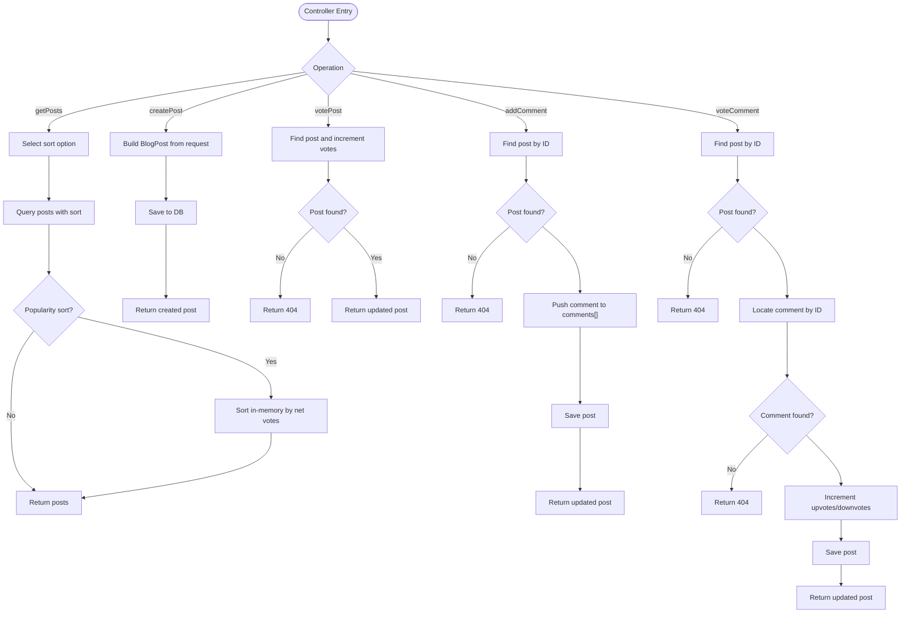
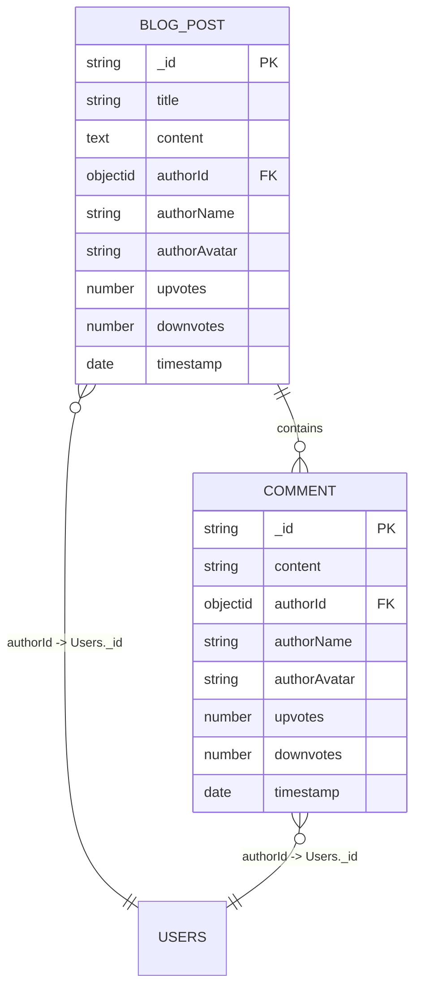
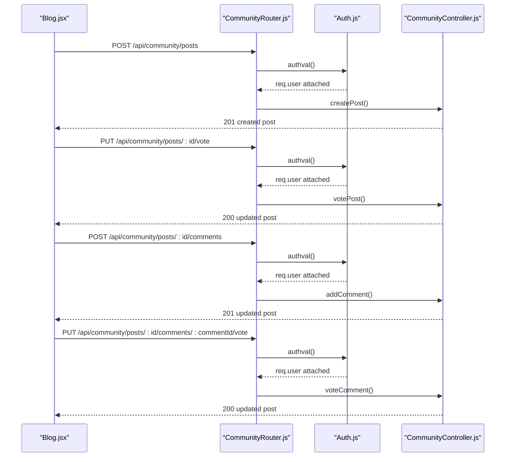
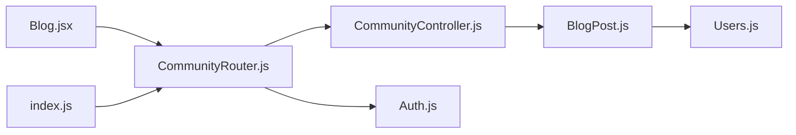

# Community Features

<cite>
**Referenced Files in This Document**
- [CommunityController.js](file://backend/Controllers/CommunityController.js)
- [BlogPost.js](file://backend/Models/BlogPost.js)
- [CommunityRouter.js](file://backend/Routes/CommunityRouter.js)
- [Auth.js](file://backend/Middlewares/Auth.js)
- [Blog.jsx](file://frontend/src/frontend/Blog.jsx)
- [index.js](file://backend/index.js)
- [Users.js](file://backend/Models/Users.js)
- [AuthContext.jsx](file://frontend/src/Context/AuthContext.jsx)
</cite>

## Table of Contents
1. [Introduction](#introduction)
2. [Project Structure](#project-structure)
3. [Core Components](#core-components)
4. [Architecture Overview](#architecture-overview)
5. [Detailed Component Analysis](#detailed-component-analysis)
6. [Dependency Analysis](#dependency-analysis)
7. [Performance Considerations](#performance-considerations)
8. [Troubleshooting Guide](#troubleshooting-guide)
9. [Conclusion](#conclusion)
10. [Appendices](#appendices)

## Introduction
This document explains the community features centered around blog management and user interactions in the EcoGrid platform. It covers the community controller implementation for managing blog posts, user comments, and content moderation, the blog post model structure including authorship and categorization, the community routing system with endpoints for content creation, editing, and deletion, user interaction features such as commenting systems, voting mechanisms, and content sharing, moderation tools, spam prevention, user reporting systems, permission-based access controls, content scheduling and publishing workflows, and SEO optimization features. It also provides examples of community engagement patterns and content management integration.

## Project Structure
The community system spans the backend (Express server, MongoDB models, controllers, and routers) and the frontend (React blog page and authentication context). The backend exposes REST endpoints under /api/community, protected by JWT middleware. The frontend consumes these endpoints to render posts, comments, and voting actions.

**Diagram sources**
- [index.js](file://backend/index.js#L41-L45)
- [CommunityRouter.js](file://backend/Routes/CommunityRouter.js#L1-L13)
- [CommunityController.js](file://backend/Controllers/CommunityController.js#L1-L107)
- [BlogPost.js](file://backend/Models/BlogPost.js#L1-L73)
- [Auth.js](file://backend/Middlewares/Auth.js#L1-L19)
- [Blog.jsx](file://frontend/src/frontend/Blog.jsx#L20-L115)
- [AuthContext.jsx](file://frontend/src/Context/AuthContext.jsx#L12-L46)
- [Users.js](file://backend/Models/Users.js#L1-L32)

**Section sources**
- [index.js](file://backend/index.js#L41-L45)
- [CommunityRouter.js](file://backend/Routes/CommunityRouter.js#L1-L13)
- [CommunityController.js](file://backend/Controllers/CommunityController.js#L1-L107)
- [BlogPost.js](file://backend/Models/BlogPost.js#L1-L73)
- [Blog.jsx](file://frontend/src/frontend/Blog.jsx#L20-L115)
- [AuthContext.jsx](file://frontend/src/Context/AuthContext.jsx#L12-L46)

## Core Components
- CommunityController: Implements handlers for fetching posts, creating posts, voting on posts, adding comments, and voting on comments.
- BlogPost Model: Defines the schema for blog posts and nested comments, including authorship, voting counts, timestamps, and optional author identity fields.
- CommunityRouter: Declares REST endpoints for community operations and applies JWT authentication middleware for write actions.
- Auth Middleware: Validates JWT tokens from Authorization headers and attaches user info to requests.
- Frontend Blog Page: Renders posts, handles sorting, creates posts, adds comments, and performs voting via authenticated API calls.
- Users Model: Stores user identities and roles used for authorship and potential future moderation features.

Key capabilities:
- Authorship: Posts and comments capture author name and avatar; optional authorId references the Users model.
- Voting: Upvotes/downvotes tracked per post and per comment.
- Comments: Nested array of comments with author metadata and timestamps.
- Sorting: Newest, oldest, and popularity (computed difference) sorting supported.

**Section sources**
- [CommunityController.js](file://backend/Controllers/CommunityController.js#L3-L107)
- [BlogPost.js](file://backend/Models/BlogPost.js#L35-L70)
- [CommunityRouter.js](file://backend/Routes/CommunityRouter.js#L7-L11)
- [Auth.js](file://backend/Middlewares/Auth.js#L3-L18)
- [Blog.jsx](file://frontend/src/frontend/Blog.jsx#L26-L115)
- [Users.js](file://backend/Models/Users.js#L3-L29)

## Architecture Overview
The community feature follows a layered architecture:
- Presentation Layer (frontend): React components render UI and orchestrate user actions.
- Application Layer (backend): Express routes delegate to controllers.
- Domain Layer (backend): Mongoose models define data structures and relationships.
- Security Layer (backend): JWT middleware enforces authentication for write operations.

**Diagram sources**
- [Blog.jsx](file://frontend/src/frontend/Blog.jsx#L26-L68)
- [CommunityRouter.js](file://backend/Routes/CommunityRouter.js#L7-L11)
- [CommunityController.js](file://backend/Controllers/CommunityController.js#L3-L43)
- [BlogPost.js](file://backend/Models/BlogPost.js#L35-L70)
- [Auth.js](file://backend/Middlewares/Auth.js#L3-L18)

## Detailed Component Analysis

### Community Controller Implementation
The controller encapsulates all community operations:
- Fetch posts with sorting options (newest, oldest, popular).
- Create posts with guest fallbacks for author metadata.
- Vote on posts (upvote/downvote).
- Add comments to posts.
- Vote on comments (upvote/downvote).

Processing logic highlights:
- Sorting: Uses database-native sort for newest/oldest; popularity computed in-memory by net votes.
- Voting: Atomic increment via MongoDB operators for posts; comments updated in-place.
- Comments: Push new comment into post’s comments array and persist.

**Diagram sources**
- [CommunityController.js](file://backend/Controllers/CommunityController.js#L3-L107)

**Section sources**
- [CommunityController.js](file://backend/Controllers/CommunityController.js#L3-L107)

### Blog Post Model Structure
The model defines:
- Post fields: title, content, authorId (optional reference), authorName, authorAvatar, upvotes, downvotes, comments[], timestamp.
- Comment fields: content, authorId (optional reference), authorName, authorAvatar, upvotes, downvotes, timestamp.

Implications:
- Authorship supports both authenticated users (authorId) and guests (authorName/authorAvatar).
- Comments mirror the same author metadata pattern.
- Timestamps enable chronological sorting and “time ago” display.

**Diagram sources**
- [BlogPost.js](file://backend/Models/BlogPost.js#L35-L70)
- [Users.js](file://backend/Models/Users.js#L3-L29)

**Section sources**
- [BlogPost.js](file://backend/Models/BlogPost.js#L3-L73)
- [Users.js](file://backend/Models/Users.js#L3-L29)

### Community Routing System
Endpoints:
- GET /api/community/posts: Public feed with sort query parameter.
- POST /api/community/posts: Requires Bearer token; creates a new post.
- PUT /api/community/posts/:id/vote: Requires Bearer token; upvote/downvote a post.
- POST /api/community/posts/:id/comments: Requires Bearer token; adds a comment to a post.
- PUT /api/community/posts/:id/comments/:commentId/vote: Requires Bearer token; upvote/downvote a comment.

Access control:
- All write operations are protected by authval middleware, which validates JWT and attaches user data to the request.

**Diagram sources**
- [CommunityRouter.js](file://backend/Routes/CommunityRouter.js#L7-L11)
- [Auth.js](file://backend/Middlewares/Auth.js#L3-L18)
- [CommunityController.js](file://backend/Controllers/CommunityController.js#L29-L107)
- [Blog.jsx](file://frontend/src/frontend/Blog.jsx#L47-L115)

**Section sources**
- [CommunityRouter.js](file://backend/Routes/CommunityRouter.js#L1-L13)
- [Auth.js](file://backend/Middlewares/Auth.js#L1-L19)
- [CommunityController.js](file://backend/Controllers/CommunityController.js#L29-L107)
- [Blog.jsx](file://frontend/src/frontend/Blog.jsx#L47-L115)

### User Interaction Features
- Commenting: Logged-in users can add comments; UI captures author metadata from AuthContext.
- Voting: Users can upvote/downvote posts and comments; UI sends isUpvote flag to backend.
- Sharing: Placeholder present in UI; integration points can be added to expose shareable URLs.

Frontend integration:
- Authentication headers are built from local/session storage tokens.
- Sorting is controlled client-side and passed as query parameter to the backend.

**Section sources**
- [Blog.jsx](file://frontend/src/frontend/Blog.jsx#L20-L115)
- [AuthContext.jsx](file://frontend/src/Context/AuthContext.jsx#L12-L46)

### Content Moderation Tools, Spam Prevention, and Reporting
Current state:
- No explicit moderation endpoints, reporting endpoints, or spam detection logic are implemented in the reviewed files.

Recommended additions (conceptual):
- Moderation endpoints: Approve/deny posts, delete/remove comments, ban users.
- Reporting endpoints: Submit reports for posts/comments with reason and evidence.
- Spam prevention: Rate limiting, content filtering, CAPTCHA, and keyword blacklists.
- Administrative dashboards: Manage reports, review flagged content, and audit logs.

[No sources needed since this section proposes conceptual enhancements not present in the codebase]

### Permission-Based Access Controls
- Write operations require a valid JWT token via authval middleware.
- The Users model defines userType with values prosumer, consumer, utility; future moderation roles can leverage this field.

Recommendations:
- Role-based permissions: Define admin/moderator roles alongside userType.
- Ownership checks: Ensure only post/comment authors or moderators can edit/delete.
- Scope tokens: Limit token scopes for different operations.

**Section sources**
- [Auth.js](file://backend/Middlewares/Auth.js#L3-L18)
- [Users.js](file://backend/Models/Users.js#L19-L23)

### Content Scheduling, Publishing Workflows, and SEO Optimization
Current state:
- No scheduling or publishing workflow endpoints are present in the reviewed files.
- No SEO-specific fields (e.g., meta title, description, slug) are defined in the model.

Recommendations:
- Scheduling: Add scheduledAt/publishedAt fields and a background job to publish drafts.
- Publishing workflow: Add statuses (draft, submitted, approved, published) and moderation steps.
- SEO: Introduce metaTitle, metaDescription, slug fields; canonical URL generation; Open Graph/Twitter meta rendering.

**Section sources**
- [BlogPost.js](file://backend/Models/BlogPost.js#L35-L70)

### Examples of Community Engagement Patterns and Content Management Integration
- New post composition: UI toggles a compose area; submission sends title/content with author metadata.
- Real-time engagement: Voting updates immediately reflect in the UI by refetching or updating the post in place.
- Sorting: Users can switch between newest, oldest, and popularity; backend computes popularity via net votes.
- Comment threads: Nested comments display with individual voting controls.

**Section sources**
- [Blog.jsx](file://frontend/src/frontend/Blog.jsx#L26-L115)

## Dependency Analysis
The community subsystem exhibits clear separation of concerns:
- Routes depend on controllers.
- Controllers depend on models.
- Frontend depends on routes via HTTP.
- Auth middleware is applied at route level for write operations.

**Diagram sources**
- [Blog.jsx](file://frontend/src/frontend/Blog.jsx#L26-L115)
- [CommunityRouter.js](file://backend/Routes/CommunityRouter.js#L1-L13)
- [CommunityController.js](file://backend/Controllers/CommunityController.js#L1-L107)
- [BlogPost.js](file://backend/Models/BlogPost.js#L1-L73)
- [Auth.js](file://backend/Middlewares/Auth.js#L1-L19)
- [Users.js](file://backend/Models/Users.js#L1-L32)
- [index.js](file://backend/index.js#L41-L45)

**Section sources**
- [Blog.jsx](file://frontend/src/frontend/Blog.jsx#L26-L115)
- [CommunityRouter.js](file://backend/Routes/CommunityRouter.js#L1-L13)
- [CommunityController.js](file://backend/Controllers/CommunityController.js#L1-L107)
- [BlogPost.js](file://backend/Models/BlogPost.js#L1-L73)
- [Auth.js](file://backend/Middlewares/Auth.js#L1-L19)
- [Users.js](file://backend/Models/Users.js#L1-L32)
- [index.js](file://backend/index.js#L41-L45)

## Performance Considerations
- Sorting: Newest/oldest sorts are efficient with database indexes; popularity sort performs in-memory sorting which may be costly for large datasets—consider aggregations or materialized scores.
- Voting: Increment operations are atomic; ensure indexes on _id and comments._id for comment updates.
- Comments: Pushing into arrays is O(1); deep pagination or infinite scroll recommended for long comment threads.
- Authentication: JWT verification occurs per request; consider caching verified user info for short-lived sessions.

[No sources needed since this section provides general guidance]

## Troubleshooting Guide
Common issues and resolutions:
- Authentication failures: Ensure Authorization header includes a valid Bearer token; verify JWT_SECRET and expiration.
- Post/comment not found: Confirm IDs exist and are correctly passed in URL parameters.
- Voting errors: Verify isUpvote payload is boolean; ensure correct endpoint paths (/posts/:id/vote vs /posts/:id/comments/:commentId/vote).
- CORS issues: Confirm frontend origin matches backend CORS configuration.

**Section sources**
- [Auth.js](file://backend/Middlewares/Auth.js#L3-L18)
- [CommunityController.js](file://backend/Controllers/CommunityController.js#L45-L107)
- [Blog.jsx](file://frontend/src/frontend/Blog.jsx#L95-L115)

## Conclusion
The community features provide a solid foundation for blog management and user interactions, including authorship, comments, and voting. The system is modular, with clear separation between frontend and backend, and robust authentication for write operations. Future enhancements should focus on moderation, reporting, scheduling, publishing workflows, and SEO to support scalable community growth and engagement.

## Appendices
- API Endpoint Reference
  - GET /api/community/posts?sort=newest|oldest|popular
  - POST /api/community/posts (requires Bearer token)
  - PUT /api/community/posts/:id/vote (requires Bearer token)
  - POST /api/community/posts/:id/comments (requires Bearer token)
  - PUT /api/community/posts/:id/comments/:commentId/vote (requires Bearer token)

[No sources needed since this section summarizes endpoints without analyzing specific files]