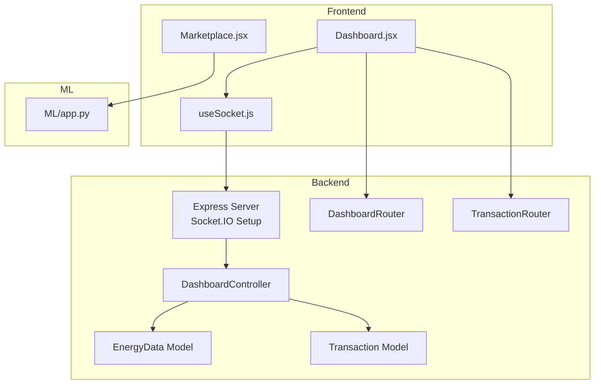
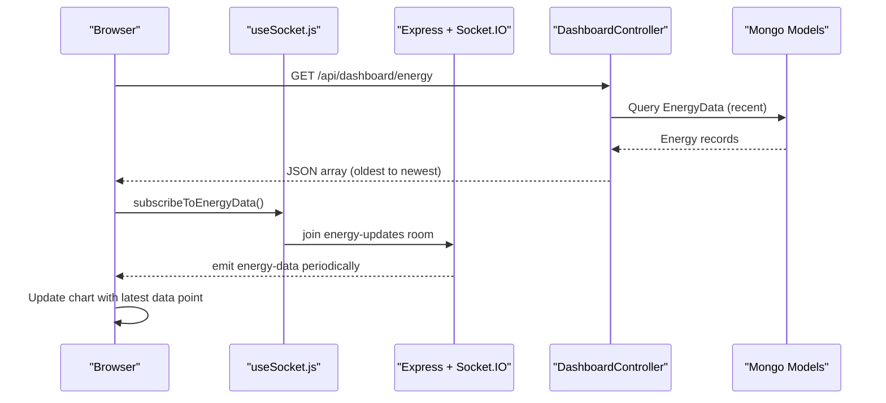
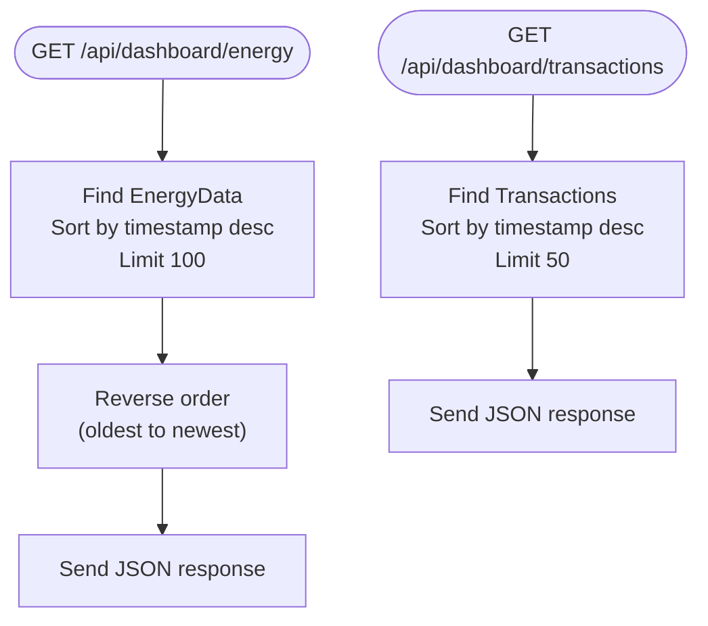
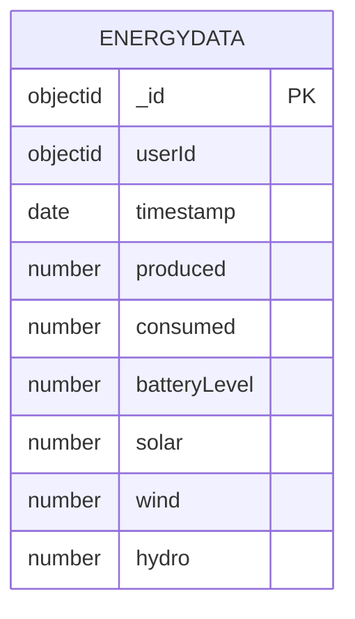
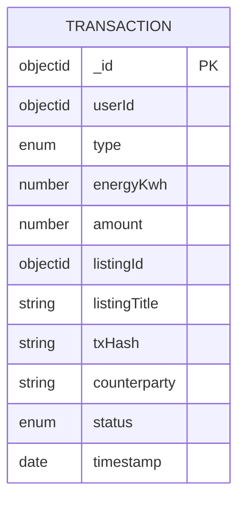
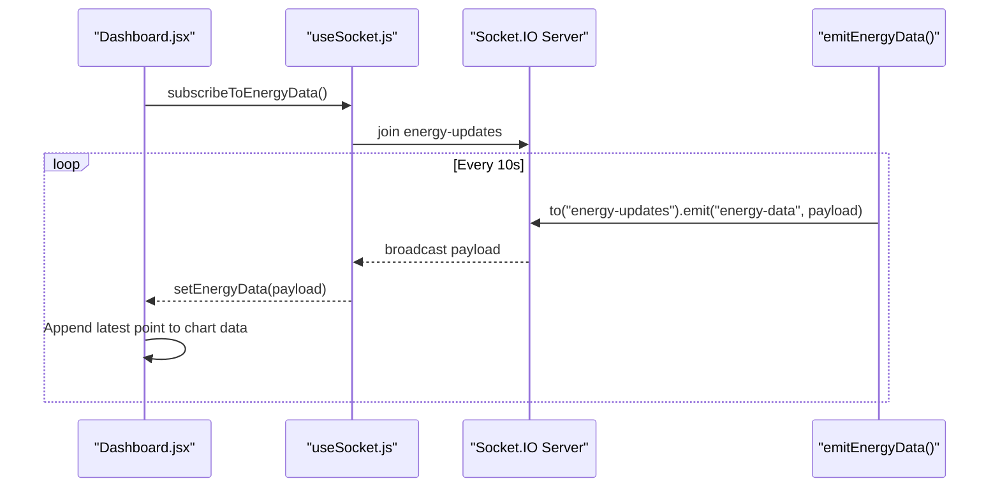
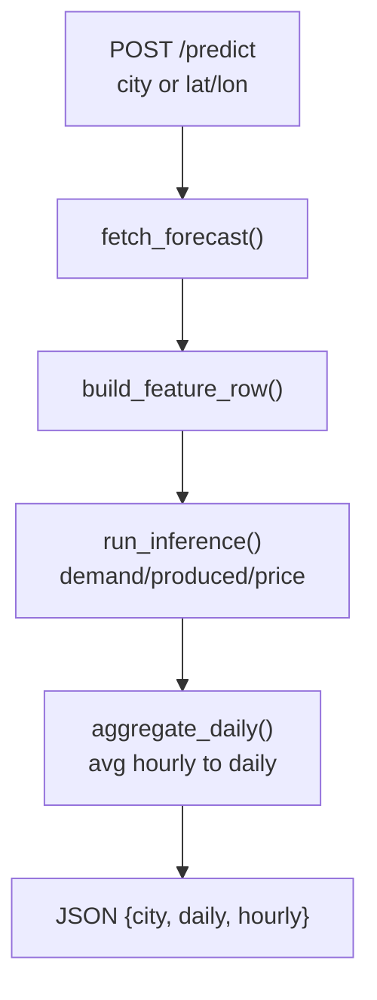
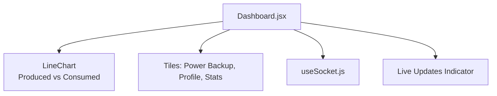
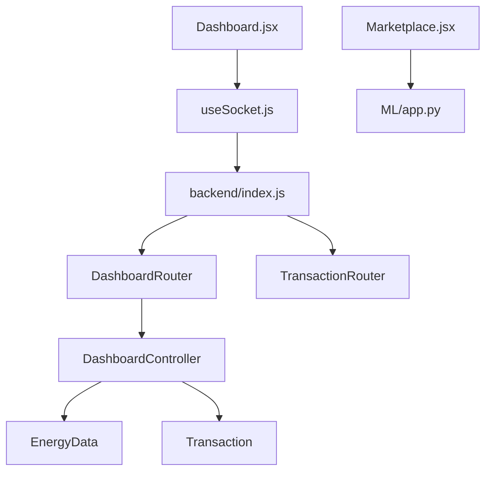

# Dashboard & Analytics

<cite>
**Referenced Files in This Document**
- [backend/index.js](file://backend/index.js)
- [backend/Controllers/DashboardController.js](file://backend/Controllers/DashboardController.js)
- [backend/Routes/DashboardRouter.js](file://backend/Routes/DashboardRouter.js)
- [backend/Models/EnergyData.js](file://backend/Models/EnergyData.js)
- [backend/Models/Transaction.js](file://backend/Models/Transaction.js)
- [backend/Routes/TransactionRouter.js](file://backend/Routes/TransactionRouter.js)
- [frontend/src/frontend/Marketplace.jsx](file://frontend/src/frontend/Marketplace.jsx)
- [frontend/src/frontend/Dashboard.jsx](file://frontend/src/frontend/Dashboard.jsx)
- [frontend/src/hooks/useSocket.js](file://frontend/src/hooks/useSocket.js)
- [ML/app.py](file://ML/app.py)
</cite>

## Table of Contents
1. [Introduction](#introduction)
2. [Project Structure](#project-structure)
3. [Core Components](#core-components)
4. [Architecture Overview](#architecture-overview)
5. [Detailed Component Analysis](#detailed-component-analysis)
6. [Dependency Analysis](#dependency-analysis)
7. [Performance Considerations](#performance-considerations)
8. [Troubleshooting Guide](#troubleshooting-guide)
9. [Conclusion](#conclusion)
10. [Appendices](#appendices)

## Introduction
This document explains the dashboard and analytics implementation for real-time energy monitoring and visualization. It covers the dashboard controller for retrieving and processing energy consumption/production data, the energy data model, analytics endpoints for charts and reports, real-time streaming via Socket.IO, and frontend widget integrations. It also outlines data aggregation methods, filtering and export considerations, caching strategies, and performance optimizations for large datasets.

## Project Structure
The dashboard spans three layers:
- Backend: Express server with Socket.IO for real-time updates, MongoDB-backed models for energy and transactions, and REST endpoints for dashboard data.
- Frontend: React dashboard with Recharts visualizations, Socket.IO client integration, and user widgets.
- Machine Learning: Forecasting service that aggregates hourly predictions into daily summaries and computes dynamic pricing.

**Diagram sources**
- [backend/index.js](file://backend/index.js#L14-L97)
- [backend/Routes/DashboardRouter.js](file://backend/Routes/DashboardRouter.js#L1-L10)
- [backend/Routes/TransactionRouter.js](file://backend/Routes/TransactionRouter.js#L1-L11)
- [backend/Controllers/DashboardController.js](file://backend/Controllers/DashboardController.js#L1-L25)
- [backend/Models/EnergyData.js](file://backend/Models/EnergyData.js#L1-L43)
- [backend/Models/Transaction.js](file://backend/Models/Transaction.js#L1-L51)
- [frontend/src/frontend/Dashboard.jsx](file://frontend/src/frontend/Dashboard.jsx#L1-L556)
- [frontend/src/hooks/useSocket.js](file://frontend/src/hooks/useSocket.js#L1-L142)
- [frontend/src/frontend/Marketplace.jsx](file://frontend/src/frontend/Marketplace.jsx#L443-L457)
- [ML/app.py](file://ML/app.py#L1-L251)

**Section sources**
- [backend/index.js](file://backend/index.js#L14-L97)
- [backend/Routes/DashboardRouter.js](file://backend/Routes/DashboardRouter.js#L1-L10)
- [backend/Routes/TransactionRouter.js](file://backend/Routes/TransactionRouter.js#L1-L11)
- [frontend/src/frontend/Dashboard.jsx](file://frontend/src/frontend/Dashboard.jsx#L1-L556)
- [frontend/src/hooks/useSocket.js](file://frontend/src/hooks/useSocket.js#L1-L142)
- [ML/app.py](file://ML/app.py#L1-L251)

## Core Components
- Dashboard controller: Retrieves recent energy and transaction data for the dashboard.
- Energy data model: Defines the schema for timestamps, consumption, production, and renewable sources.
- Transaction model: Tracks buy/sell activity for analytics and user stats.
- Real-time streaming: Socket.IO server emits periodic energy updates; the frontend subscribes and renders live charts.
- Analytics endpoints: ML service aggregates forecasts into daily series and computes dynamic pricing for reports.

**Section sources**
- [backend/Controllers/DashboardController.js](file://backend/Controllers/DashboardController.js#L1-L25)
- [backend/Models/EnergyData.js](file://backend/Models/EnergyData.js#L1-L43)
- [backend/Models/Transaction.js](file://backend/Models/Transaction.js#L1-L51)
- [backend/index.js](file://backend/index.js#L48-L97)
- [ML/app.py](file://ML/app.py#L95-L128)

## Architecture Overview
The system integrates real-time streaming with historical data retrieval and forecasting analytics.

**Diagram sources**
- [backend/Routes/DashboardRouter.js](file://backend/Routes/DashboardRouter.js#L1-L10)
- [backend/Controllers/DashboardController.js](file://backend/Controllers/DashboardController.js#L4-L15)
- [backend/Models/EnergyData.js](file://backend/Models/EnergyData.js#L1-L43)
- [frontend/src/hooks/useSocket.js](file://frontend/src/hooks/useSocket.js#L105-L109)
- [backend/index.js](file://backend/index.js#L48-L97)

## Detailed Component Analysis

### Dashboard Controller
Responsibilities:
- Fetch recent energy data ordered by timestamp descending and return oldest-first for chart rendering.
- Fetch recent transactions for user trade statistics.

Processing logic:
- Sort by timestamp descending, limit results, reverse order for chronological display.
- Limit transactions to a small number for quick tile rendering.

**Diagram sources**
- [backend/Controllers/DashboardController.js](file://backend/Controllers/DashboardController.js#L4-L24)

**Section sources**
- [backend/Controllers/DashboardController.js](file://backend/Controllers/DashboardController.js#L1-L25)

### Energy Data Model
Fields:
- Timestamp: record time.
- Produced: total generated energy.
- Consumed: total consumed energy.
- Battery level: optional storage metric.
- Solar/Wind/Hydro: per-source contributions.

Aggregation and analytics:
- Summarize by day/week/month for charts.
- Compute trends and ratios (e.g., surplus/deficit).
- Normalize units for consistent visualization.

**Diagram sources**
- [backend/Models/EnergyData.js](file://backend/Models/EnergyData.js#L3-L40)

**Section sources**
- [backend/Models/EnergyData.js](file://backend/Models/EnergyData.js#L1-L43)

### Transaction Model
Fields:
- Type: sold/bought.
- Energy kWh: amount traded.
- Amount: monetary value.
- Counterparty: trading partner identifier.
- Status: completed/pending/failed.
- Timestamp: trade time.

Analytics:
- Compute totals and counts per type.
- Unique buyer/seller counts for user stats.

**Diagram sources**
- [backend/Models/Transaction.js](file://backend/Models/Transaction.js#L3-L47)

**Section sources**
- [backend/Models/Transaction.js](file://backend/Models/Transaction.js#L1-L51)

### Real-Time Streaming with Socket.IO
Backend:
- Initializes Socket.IO and exposes rooms for user and marketplace.
- Emits periodic simulated energy data to the "energy-updates" room.

Frontend:
- Establishes connection, listens for "energy-data" events, and updates the live chart.
- Subscribes to energy updates via a dedicated hook.

**Diagram sources**
- [frontend/src/frontend/Dashboard.jsx](file://frontend/src/frontend/Dashboard.jsx#L80-L125)
- [frontend/src/hooks/useSocket.js](file://frontend/src/hooks/useSocket.js#L105-L109)
- [backend/index.js](file://backend/index.js#L48-L97)

**Section sources**
- [backend/index.js](file://backend/index.js#L48-L97)
- [frontend/src/frontend/Dashboard.jsx](file://frontend/src/frontend/Dashboard.jsx#L80-L125)
- [frontend/src/hooks/useSocket.js](file://frontend/src/hooks/useSocket.js#L1-L142)

### Analytics Endpoints and Forecasting
The ML service:
- Accepts city or coordinates, fetches weather forecast, builds feature vectors, runs inference, aggregates hourly to daily, and computes dynamic pricing.

**Diagram sources**
- [ML/app.py](file://ML/app.py#L195-L247)

**Section sources**
- [ML/app.py](file://ML/app.py#L1-L251)

### Frontend Dashboard Widgets and Integrations
- Live chart: Line chart of produced vs consumed energy with tooltips and responsive container.
- Tiles: Power backup metrics, user profile, buyers/sellers counts, and pricing controls.
- Real-time status indicator and last-updated timestamp.
- Socket hook manages connection lifecycle, room joins, and subscriptions.

**Diagram sources**
- [frontend/src/frontend/Dashboard.jsx](file://frontend/src/frontend/Dashboard.jsx#L274-L346)
- [frontend/src/hooks/useSocket.js](file://frontend/src/hooks/useSocket.js#L1-L142)

**Section sources**
- [frontend/src/frontend/Dashboard.jsx](file://frontend/src/frontend/Dashboard.jsx#L1-L556)
- [frontend/src/hooks/useSocket.js](file://frontend/src/hooks/useSocket.js#L1-L142)

### Marketplace Analytics Integration
The marketplace page consumes analytics data to render category breakdowns and status cards, demonstrating how backend analytics can feed multiple frontend views.

**Diagram sources**
- [ML/app.py](file://ML/app.py#L95-L128)
- [frontend/src/frontend/Marketplace.jsx](file://frontend/src/frontend/Marketplace.jsx#L443-L457)

**Section sources**
- [frontend/src/frontend/Marketplace.jsx](file://frontend/src/frontend/Marketplace.jsx#L443-L457)
- [ML/app.py](file://ML/app.py#L95-L128)

## Dependency Analysis
- Backend depends on Mongoose for models and Express for routing. Socket.IO is initialized in the server entry and passed to routes via app.locals.
- Frontend depends on Recharts for visualization and socket.io-client for real-time updates.
- ML service is decoupled and communicates via HTTP to deliver aggregated analytics.

**Diagram sources**
- [backend/index.js](file://backend/index.js#L14-L46)
- [backend/Routes/DashboardRouter.js](file://backend/Routes/DashboardRouter.js#L1-L10)
- [backend/Routes/TransactionRouter.js](file://backend/Routes/TransactionRouter.js#L1-L11)
- [backend/Controllers/DashboardController.js](file://backend/Controllers/DashboardController.js#L1-L25)
- [backend/Models/EnergyData.js](file://backend/Models/EnergyData.js#L1-L43)
- [backend/Models/Transaction.js](file://backend/Models/Transaction.js#L1-L51)
- [frontend/src/frontend/Dashboard.jsx](file://frontend/src/frontend/Dashboard.jsx#L1-L556)
- [frontend/src/hooks/useSocket.js](file://frontend/src/hooks/useSocket.js#L1-L142)
- [frontend/src/frontend/Marketplace.jsx](file://frontend/src/frontend/Marketplace.jsx#L443-L457)
- [ML/app.py](file://ML/app.py#L1-L251)

**Section sources**
- [backend/index.js](file://backend/index.js#L14-L46)
- [backend/Routes/DashboardRouter.js](file://backend/Routes/DashboardRouter.js#L1-L10)
- [backend/Routes/TransactionRouter.js](file://backend/Routes/TransactionRouter.js#L1-L11)
- [frontend/src/frontend/Dashboard.jsx](file://frontend/src/frontend/Dashboard.jsx#L1-L556)
- [frontend/src/frontend/Marketplace.jsx](file://frontend/src/frontend/Marketplace.jsx#L443-L457)
- [ML/app.py](file://ML/app.py#L1-L251)

## Performance Considerations
- Data limits: Controllers currently limit returned records to keep payloads small (e.g., recent 100 energy entries, 50 transactions).
- Frontend sliding window: Dashboard maintains a fixed-size rolling buffer for live charts to cap memory usage.
- Aggregation: Use server-side aggregation pipelines for daily/weekly summaries to reduce payload sizes.
- Caching: Cache frequent queries (e.g., last N hours) in memory or Redis to avoid repeated DB scans.
- Pagination: For deep historical views, implement pagination and lazy loading.
- Compression: Enable gzip on the Express server for large JSON responses.
- Efficient charting: Render only visible data points; defer offscreen computations.

[No sources needed since this section provides general guidance]

## Troubleshooting Guide
- Socket.IO connection issues:
  - Verify origin and credentials configuration match the frontend URL.
  - Check room join events and subscription emissions.
- Missing or stale data:
  - Confirm periodic emission interval and client subscription.
  - Validate that the chart receives the latest data point and trims to a fixed window.
- Backend errors:
  - Controller error responses return server error messages; inspect logs for database query failures.
- CORS:
  - Ensure frontend and backend origins are whitelisted and credentials are enabled.

**Section sources**
- [backend/index.js](file://backend/index.js#L18-L34)
- [frontend/src/hooks/useSocket.js](file://frontend/src/hooks/useSocket.js#L12-L34)
- [backend/Controllers/DashboardController.js](file://backend/Controllers/DashboardController.js#L12-L14)

## Conclusion
The dashboard integrates historical data retrieval, real-time streaming, and analytics to provide actionable insights. The energy data model supports granular tracking and aggregation, while Socket.IO ensures live updates. The ML service augments the platform with forecasting and dynamic pricing. With proper caching, pagination, and efficient chart rendering, the system scales to larger datasets and more complex analytics.

[No sources needed since this section summarizes without analyzing specific files]

## Appendices

### Data Filtering and Date Range Selection
- Implement date-range filters on the frontend and pass start/end timestamps to the backend.
- Backend endpoints can accept query parameters and apply date boundaries to queries.
- For large ranges, pre-aggregate data server-side to avoid heavy client-side filtering.

[No sources needed since this section provides general guidance]

### Export Capabilities
- Offer CSV/JSON exports of filtered datasets from the dashboard.
- Include metadata (timezone, units) and preserve chronological ordering.

[No sources needed since this section provides general guidance]

### Visualization Data Formatting
- Normalize units and align axes across charts.
- Use consistent time formatting and locale-aware tooltips.
- Provide toggleable views (hourly/daily/weekly) to balance detail and readability.

[No sources needed since this section provides general guidance]