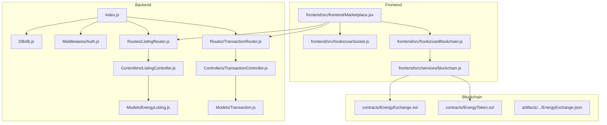
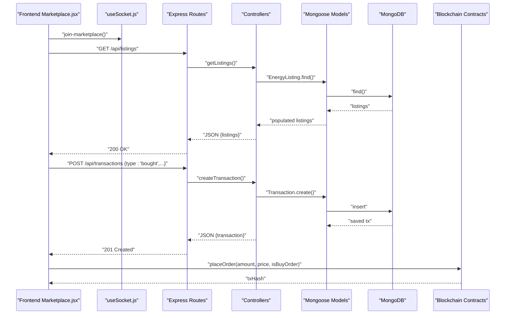
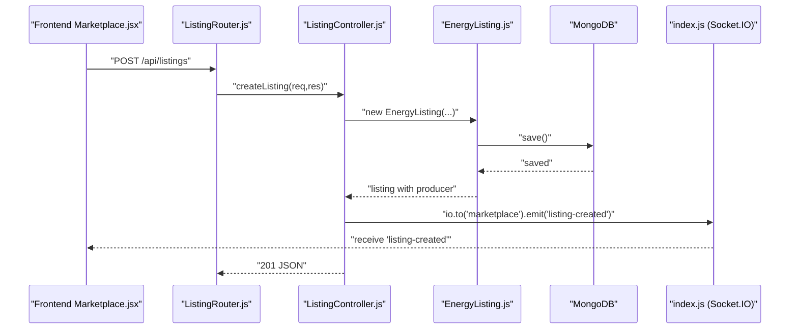
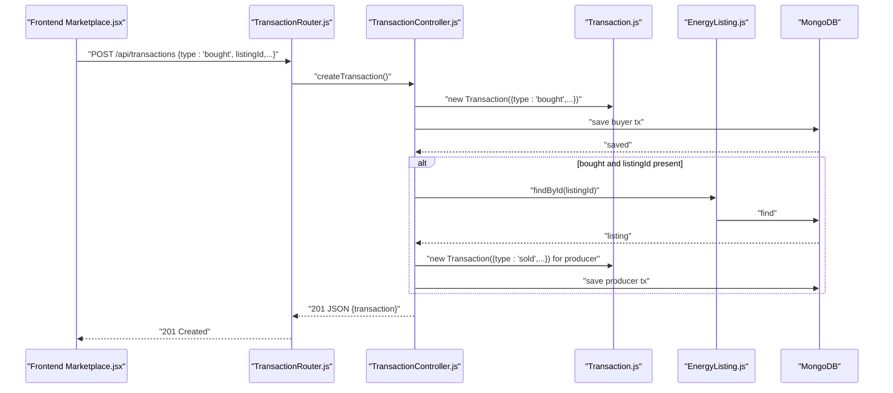
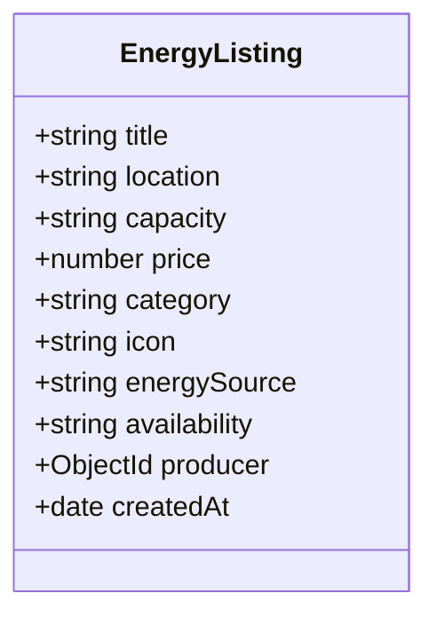
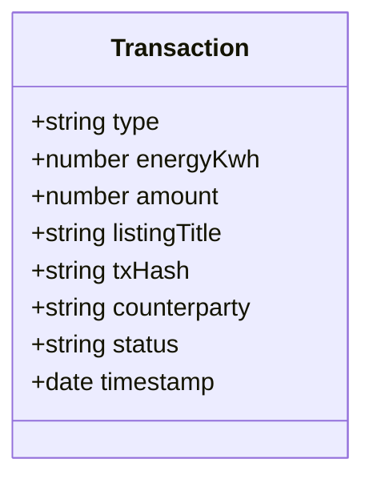
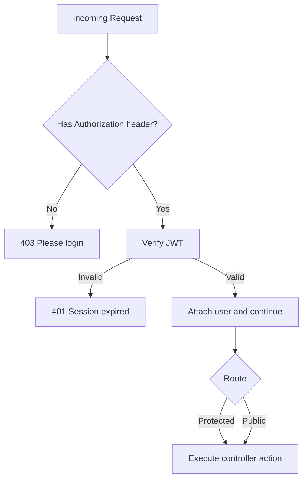
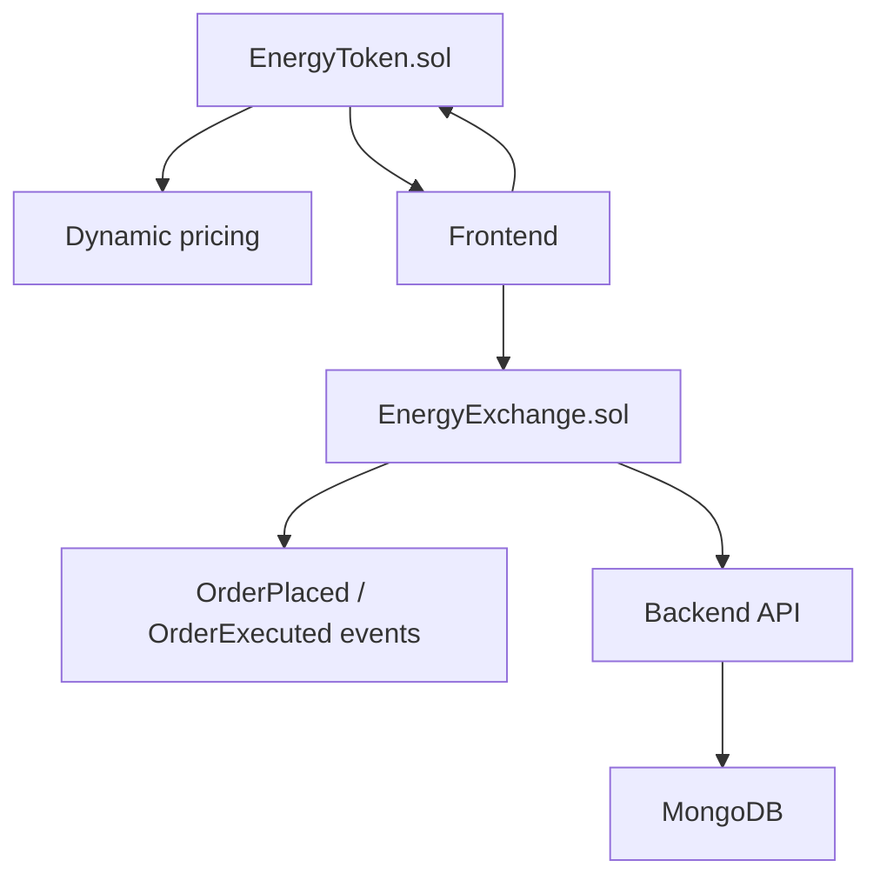
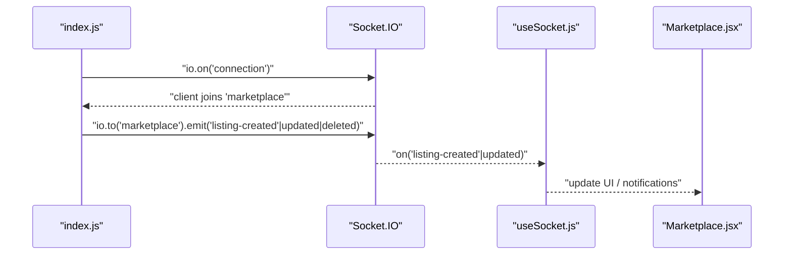
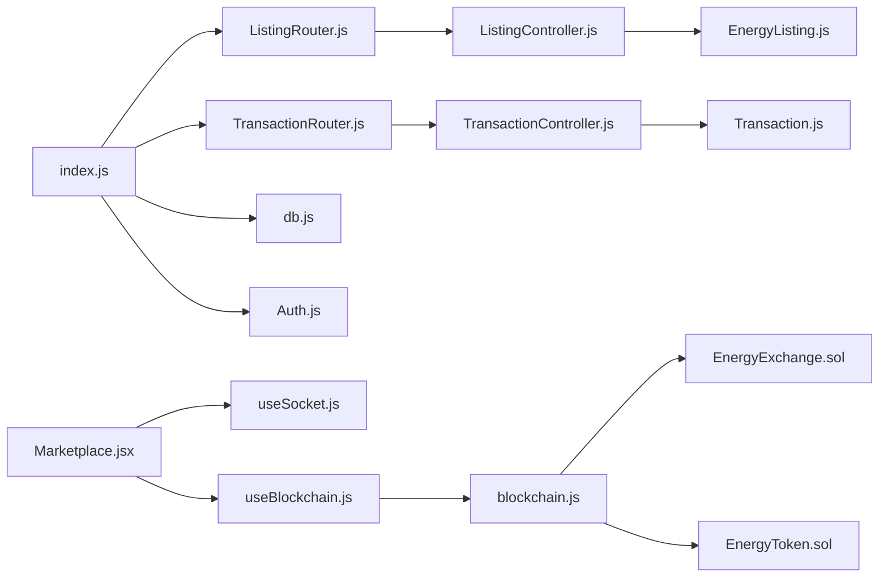

# Marketplace Operations

<cite>
**Referenced Files in This Document**
- [index.js](file://backend/index.js)
- [db.js](file://backend/DB/db.js)
- [Auth.js](file://backend/Middlewares/Auth.js)
- [ListingRouter.js](file://backend/Routes/ListingRouter.js)
- [TransactionRouter.js](file://backend/Routes/TransactionRouter.js)
- [ListingController.js](file://backend/Controllers/ListingController.js)
- [TransactionController.js](file://backend/Controllers/TransactionController.js)
- [EnergyListing.js](file://backend/Models/EnergyListing.js)
- [Transaction.js](file://backend/Models/Transaction.js)
- [Marketplace.jsx](file://frontend/src/frontend/Marketplace.jsx)
- [useSocket.js](file://frontend/src/hooks/useSocket.js)
- [useBlockchain.js](file://frontend/src/hooks/useBlockchain.js)
- [blockchain.js](file://frontend/src/services/blockchain.js)
- [EnergyExchange.sol](file://blockchain/contracts/EnergyExchange.sol)
- [EnergyToken.sol](file://blockchain/contracts/EnergyToken.sol)
- [EnergyExchange.json](file://blockchain/artifacts/contracts/EnergyExchange.sol/EnergyExchange.json)
</cite>

## Table of Contents
1. [Introduction](#introduction)
2. [Project Structure](#project-structure)
3. [Core Components](#core-components)
4. [Architecture Overview](#architecture-overview)
5. [Detailed Component Analysis](#detailed-component-analysis)
6. [Dependency Analysis](#dependency-analysis)
7. [Performance Considerations](#performance-considerations)
8. [Troubleshooting Guide](#troubleshooting-guide)
9. [Conclusion](#conclusion)
10. [Appendices](#appendices)

## Introduction
This document describes the marketplace operations for energy supply/demand trading. It covers:
- Energy listing management via the listing controller and model
- Transaction processing via the transaction controller and model
- Marketplace routing endpoints for CRUD operations, order placement, and transaction history
- Validation rules, user permissions, and real-time updates
- Transaction security, escrow considerations, and dispute resolution pathways
- Integration patterns with blockchain smart contracts and frontend components

## Project Structure
The marketplace spans three layers:
- Backend API (Node.js + Express) with controllers, models, routes, and middleware
- Frontend React application with marketplace UI, socket hooks, and blockchain integration
- Blockchain smart contracts implementing order placement, matching, and token mechanics

**Diagram sources**
- [index.js](file://backend/index.js#L1-L97)
- [db.js](file://backend/DB/db.js#L1-L12)
- [Auth.js](file://backend/Middlewares/Auth.js#L1-L19)
- [ListingRouter.js](file://backend/Routes/ListingRouter.js#L1-L24)
- [TransactionRouter.js](file://backend/Routes/TransactionRouter.js#L1-L11)
- [ListingController.js](file://backend/Controllers/ListingController.js#L1-L253)
- [TransactionController.js](file://backend/Controllers/TransactionController.js#L1-L68)
- [EnergyListing.js](file://backend/Models/EnergyListing.js#L1-L56)
- [Transaction.js](file://backend/Models/Transaction.js#L1-L51)
- [Marketplace.jsx](file://frontend/src/frontend/Marketplace.jsx#L1-L1188)
- [useSocket.js](file://frontend/src/hooks/useSocket.js#L1-L141)
- [useBlockchain.js](file://frontend/src/hooks/useBlockchain.js#L1-L155)
- [blockchain.js](file://frontend/src/services/blockchain.js#L1-L197)
- [EnergyExchange.sol](file://blockchain/contracts/EnergyExchange.sol#L1-L45)
- [EnergyToken.sol](file://blockchain/contracts/EnergyToken.sol#L1-L55)
- [EnergyExchange.json](file://blockchain/artifacts/contracts/EnergyExchange.sol/EnergyExchange.json#L1-L60)

**Section sources**
- [index.js](file://backend/index.js#L1-L97)
- [ListingRouter.js](file://backend/Routes/ListingRouter.js#L1-L24)
- [TransactionRouter.js](file://backend/Routes/TransactionRouter.js#L1-L11)
- [Marketplace.jsx](file://frontend/src/frontend/Marketplace.jsx#L1-L1188)

## Core Components
- Listing controller: CRUD operations for energy listings with ownership checks and real-time updates
- Transaction controller: user transaction records and automatic producer-side mirrored sales
- Energy listing model: schema with categories, availability, and producer relationship
- Transaction model: records of bought/sold trades with amounts, timestamps, and status
- Routing: protected endpoints for listings and transactions
- Authentication middleware: JWT bearer token validation
- Real-time updates: Socket.IO rooms for marketplace and user-specific notifications
- Blockchain integration: order placement and dynamic pricing via smart contracts

**Section sources**
- [ListingController.js](file://backend/Controllers/ListingController.js#L1-L253)
- [TransactionController.js](file://backend/Controllers/TransactionController.js#L1-L68)
- [EnergyListing.js](file://backend/Models/EnergyListing.js#L1-L56)
- [Transaction.js](file://backend/Models/Transaction.js#L1-L51)
- [ListingRouter.js](file://backend/Routes/ListingRouter.js#L1-L24)
- [TransactionRouter.js](file://backend/Routes/TransactionRouter.js#L1-L11)
- [Auth.js](file://backend/Middlewares/Auth.js#L1-L19)
- [index.js](file://backend/index.js#L1-L97)
- [useSocket.js](file://frontend/src/hooks/useSocket.js#L1-L141)
- [blockchain.js](file://frontend/src/services/blockchain.js#L1-L197)
- [EnergyExchange.sol](file://blockchain/contracts/EnergyExchange.sol#L1-L45)
- [EnergyToken.sol](file://blockchain/contracts/EnergyToken.sol#L1-L55)

## Architecture Overview
The marketplace follows a layered architecture:
- Presentation layer: React UI and hooks for socket and blockchain interactions
- Application layer: Express routes and controllers
- Domain layer: Mongoose models for listings and transactions
- Infrastructure layer: Socket.IO for real-time updates and MongoDB connection
- Consensus/ledger layer: Ethereum-compatible blockchain with smart contracts

**Diagram sources**
- [Marketplace.jsx](file://frontend/src/frontend/Marketplace.jsx#L1-L1188)
- [useSocket.js](file://frontend/src/hooks/useSocket.js#L1-L141)
- [ListingRouter.js](file://backend/Routes/ListingRouter.js#L1-L24)
- [TransactionRouter.js](file://backend/Routes/TransactionRouter.js#L1-L11)
- [ListingController.js](file://backend/Controllers/ListingController.js#L1-L253)
- [TransactionController.js](file://backend/Controllers/TransactionController.js#L1-L68)
- [EnergyListing.js](file://backend/Models/EnergyListing.js#L1-L56)
- [Transaction.js](file://backend/Models/Transaction.js#L1-L51)
- [EnergyExchange.sol](file://blockchain/contracts/EnergyExchange.sol#L1-L45)
- [EnergyToken.sol](file://blockchain/contracts/EnergyToken.sol#L1-L55)

## Detailed Component Analysis

### Energy Listing Management
The listing controller supports:
- Retrieving all listings with optional category and search filters
- Fetching a user’s own listings
- Creating a new listing with validated fields and assigning producer
- Updating/deleting a listing with ownership verification
- Emitting real-time events to the marketplace room
- Aggregating prosumer analytics (total listings, earnings, sales)

Key validations and permissions:
- Ownership checks on update/delete
- JWT-required routes for protected endpoints
- Producer population on create/update/read

Real-time updates:
- Socket.IO emits “listing-created”, “listing-updated”, and “listing-deleted” to the “marketplace” room

**Diagram sources**
- [ListingController.js](file://backend/Controllers/ListingController.js#L58-L99)
- [EnergyListing.js](file://backend/Models/EnergyListing.js#L1-L56)
- [index.js](file://backend/index.js#L47-L86)
- [ListingRouter.js](file://backend/Routes/ListingRouter.js#L18-L22)

**Section sources**
- [ListingController.js](file://backend/Controllers/ListingController.js#L1-L253)
- [EnergyListing.js](file://backend/Models/EnergyListing.js#L1-L56)
- [ListingRouter.js](file://backend/Routes/ListingRouter.js#L1-L24)
- [index.js](file://backend/index.js#L47-L86)

### Transaction Processing
The transaction controller:
- Retrieves user transactions sorted by timestamp
- Creates a transaction record for the buyer
- Automatically creates a mirrored “sold” transaction for the producer when a purchase occurs
- Marks transactions as completed upon creation

Security and audit:
- Transactions include buyer and seller identifiers, energy amount, ETK amount, listing linkage, and status
- Timestamps enable chronological reconciliation

**Diagram sources**
- [TransactionController.js](file://backend/Controllers/TransactionController.js#L18-L67)
- [Transaction.js](file://backend/Models/Transaction.js#L1-L51)
- [EnergyListing.js](file://backend/Models/EnergyListing.js#L1-L56)
- [TransactionRouter.js](file://backend/Routes/TransactionRouter.js#L7-L8)

**Section sources**
- [TransactionController.js](file://backend/Controllers/TransactionController.js#L1-L68)
- [Transaction.js](file://backend/Models/Transaction.js#L1-L51)
- [TransactionRouter.js](file://backend/Routes/TransactionRouter.js#L1-L11)

### Energy Listing Model
Schema highlights:
- Required fields: title, location, capacity, price, category
- Enumerations: category, energySource, availability
- Producer reference to Users
- Automatic timestamps

Pricing and quantity:
- Price stored as numeric; validated by controller casting
- Capacity stored as string; consumers parse as needed
- Availability defaults to available and can be updated by producers

Expiration handling:
- No explicit expiration field in the model; producers can mark as sold_out or remove listings

**Diagram sources**
- [EnergyListing.js](file://backend/Models/EnergyListing.js#L5-L53)

**Section sources**
- [EnergyListing.js](file://backend/Models/EnergyListing.js#L1-L56)

### Transaction Model
Fields:
- userId (optional), type (enum: bought/sold), energyKwh, amount
- listingId (optional), listingTitle, txHash, counterparty
- status (enum: completed/pending/failed), timestamp

Tracking:
- Enables reconciliation of buyer and seller sides
- Supports audit trails and reporting

**Diagram sources**
- [Transaction.js](file://backend/Models/Transaction.js#L3-L48)

**Section sources**
- [Transaction.js](file://backend/Models/Transaction.js#L1-L51)

### Marketplace Routing System
Endpoints:
- Public
  - GET /api/listings (filters supported)
- Protected (requires JWT)
  - GET /api/user/listings
  - GET /api/user/listings/analytics
  - POST /api/listings
  - PUT /api/listings/:id
  - DELETE /api/listings/:id
  - GET /api/user/transactions
  - POST /api/transactions

Middleware:
- authval validates Bearer token and attaches user to request

**Diagram sources**
- [Auth.js](file://backend/Middlewares/Auth.js#L3-L18)
- [ListingRouter.js](file://backend/Routes/ListingRouter.js#L14-L22)
- [TransactionRouter.js](file://backend/Routes/TransactionRouter.js#L7-L8)

**Section sources**
- [ListingRouter.js](file://backend/Routes/ListingRouter.js#L1-L24)
- [TransactionRouter.js](file://backend/Routes/TransactionRouter.js#L1-L11)
- [Auth.js](file://backend/Middlewares/Auth.js#L1-L19)

### Validation Rules and Permissions
- Listing creation/update:
  - Fields validated by controller casting and model schema
  - Ownership enforced via producer comparison
- Price constraints:
  - Controller casts price to number; model enforces numeric type
- User permissions:
  - All protected endpoints require JWT
  - Update/delete require ownership

**Section sources**
- [ListingController.js](file://backend/Controllers/ListingController.js#L58-L202)
- [EnergyListing.js](file://backend/Models/EnergyListing.js#L18-L26)
- [Auth.js](file://backend/Middlewares/Auth.js#L1-L19)

### Transaction Security, Escrow, and Disputes
Current backend implementation:
- Transactions are recorded as completed upon creation
- No built-in escrow or dispute resolution logic in the backend

Blockchain integration:
- Smart contracts support order placement and matching
- Dynamic pricing via EnergyToken
- Events emitted for order execution

Escrow and dispute resolution recommendations:
- Introduce an escrow contract to hold funds until delivery confirmation
- Add a dispute resolution mechanism with time-locks and governance
- Record dispute outcomes in the transaction model with status escalation

**Diagram sources**
- [EnergyExchange.sol](file://blockchain/contracts/EnergyExchange.sol#L17-L43)
- [EnergyToken.sol](file://blockchain/contracts/EnergyToken.sol#L43-L47)
- [EnergyExchange.json](file://blockchain/artifacts/contracts/EnergyExchange.sol/EnergyExchange.json#L34-L60)

**Section sources**
- [TransactionController.js](file://backend/Controllers/TransactionController.js#L18-L67)
- [EnergyExchange.sol](file://blockchain/contracts/EnergyExchange.sol#L1-L45)
- [EnergyToken.sol](file://blockchain/contracts/EnergyToken.sol#L1-L55)

### Real-Time Order Book Updates
Frontend integration:
- useSocket connects to backend Socket.IO server
- Subscribes to “marketplace” room and listens for “listing-created”, “listing-updated”
- Emits custom events for trade notifications and price updates

Backend initialization:
- Socket.IO configured with CORS and rooms
- Emits energy data periodically to “energy-updates”

**Diagram sources**
- [index.js](file://backend/index.js#L47-L86)
- [useSocket.js](file://frontend/src/hooks/useSocket.js#L41-L82)
- [Marketplace.jsx](file://frontend/src/frontend/Marketplace.jsx#L1-L1188)

**Section sources**
- [index.js](file://backend/index.js#L1-L97)
- [useSocket.js](file://frontend/src/hooks/useSocket.js#L1-L141)
- [Marketplace.jsx](file://frontend/src/frontend/Marketplace.jsx#L1-L1188)

## Dependency Analysis
- Controllers depend on models and middleware
- Routes depend on controllers and auth middleware
- Frontend depends on backend APIs and socket/blockchain services
- Backend depends on MongoDB and Socket.IO
- Blockchain contracts are consumed by frontend services

**Diagram sources**
- [ListingRouter.js](file://backend/Routes/ListingRouter.js#L1-L24)
- [TransactionRouter.js](file://backend/Routes/TransactionRouter.js#L1-L11)
- [ListingController.js](file://backend/Controllers/ListingController.js#L1-L253)
- [TransactionController.js](file://backend/Controllers/TransactionController.js#L1-L68)
- [EnergyListing.js](file://backend/Models/EnergyListing.js#L1-L56)
- [Transaction.js](file://backend/Models/Transaction.js#L1-L51)
- [index.js](file://backend/index.js#L1-L97)
- [db.js](file://backend/DB/db.js#L1-L12)
- [Auth.js](file://backend/Middlewares/Auth.js#L1-L19)
- [Marketplace.jsx](file://frontend/src/frontend/Marketplace.jsx#L1-L1188)
- [useSocket.js](file://frontend/src/hooks/useSocket.js#L1-L141)
- [useBlockchain.js](file://frontend/src/hooks/useBlockchain.js#L1-L155)
- [blockchain.js](file://frontend/src/services/blockchain.js#L1-L197)
- [EnergyExchange.sol](file://blockchain/contracts/EnergyExchange.sol#L1-L45)
- [EnergyToken.sol](file://blockchain/contracts/EnergyToken.sol#L1-L55)

**Section sources**
- [index.js](file://backend/index.js#L1-L97)
- [ListingRouter.js](file://backend/Routes/ListingRouter.js#L1-L24)
- [TransactionRouter.js](file://backend/Routes/TransactionRouter.js#L1-L11)

## Performance Considerations
- Indexing: Add database indexes on EnergyListing fields frequently queried (e.g., producer, category, createdAt)
- Pagination: Implement pagination for listing retrieval to avoid large payloads
- Real-time scaling: Use Redis or clustered Socket.IO for horizontal scaling
- Caching: Cache popular listings and recent transactions for read-heavy workloads
- Background jobs: Offload analytics computations to scheduled tasks

## Troubleshooting Guide
Common issues and resolutions:
- Authentication failures:
  - Ensure Authorization header starts with “Bearer ”
  - Verify JWT_SECRET and token validity
- Ownership errors on update/delete:
  - Confirm the logged-in user matches the listing producer
- Socket events not received:
  - Verify client joins “marketplace” room and server emits to “marketplace”
- Transaction creation anomalies:
  - Ensure buyer transaction is created; producer “sold” record is created automatically for purchases

**Section sources**
- [Auth.js](file://backend/Middlewares/Auth.js#L6-L17)
- [ListingController.js](file://backend/Controllers/ListingController.js#L108-L124)
- [index.js](file://backend/index.js#L57-L61)
- [TransactionController.js](file://backend/Controllers/TransactionController.js#L38-L60)

## Conclusion
The marketplace integrates RESTful endpoints, real-time updates, and blockchain-based trading primitives. The backend provides robust listing and transaction management with JWT protection and Socket.IO broadcasting. The frontend offers a responsive UI with live notifications and blockchain interactions. To enhance trust and reliability, consider integrating an on-chain escrow and formalized dispute resolution workflows.

## Appendices

### Endpoint Reference
- GET /api/listings
  - Query params: category (All, Solar, Wind, Hydro, Biomass), search (title regex)
- GET /api/user/listings
- GET /api/user/listings/analytics
- POST /api/listings
- PUT /api/listings/:id
- DELETE /api/listings/:id
- GET /api/user/transactions
- POST /api/transactions

**Section sources**
- [ListingRouter.js](file://backend/Routes/ListingRouter.js#L14-L22)
- [TransactionRouter.js](file://backend/Routes/TransactionRouter.js#L7-L8)

### Example Integration Patterns
- Frontend marketplace page fetches listings and transactions, updates UI in real-time, and triggers blockchain orders
- Backend controllers enforce ownership and emit Socket.IO events for live updates
- Smart contracts handle order placement and matching with dynamic pricing

**Section sources**
- [Marketplace.jsx](file://frontend/src/frontend/Marketplace.jsx#L36-L115)
- [useSocket.js](file://frontend/src/hooks/useSocket.js#L41-L82)
- [blockchain.js](file://frontend/src/services/blockchain.js#L190-L197)
- [EnergyExchange.sol](file://blockchain/contracts/EnergyExchange.sol#L17-L43)
- [EnergyToken.sol](file://blockchain/contracts/EnergyToken.sol#L43-L47)