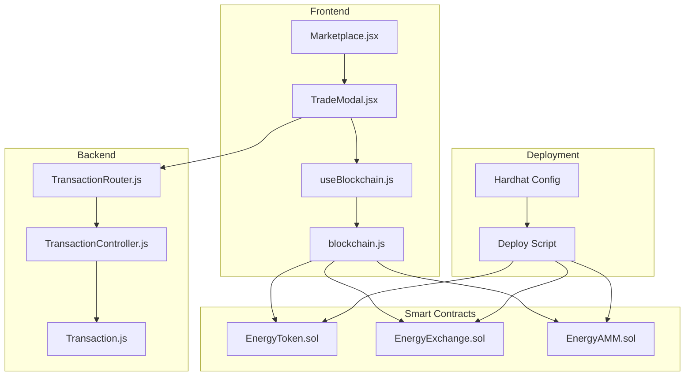
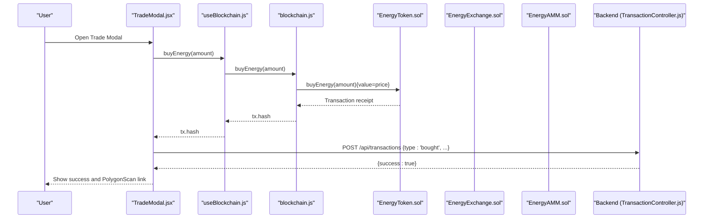
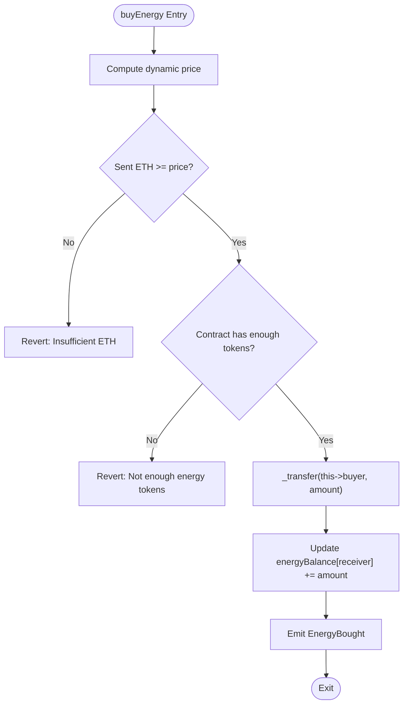
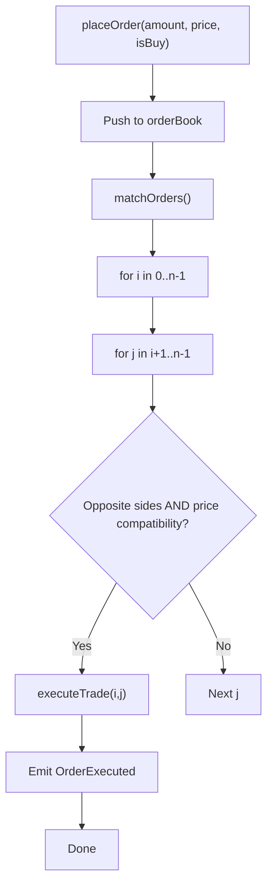
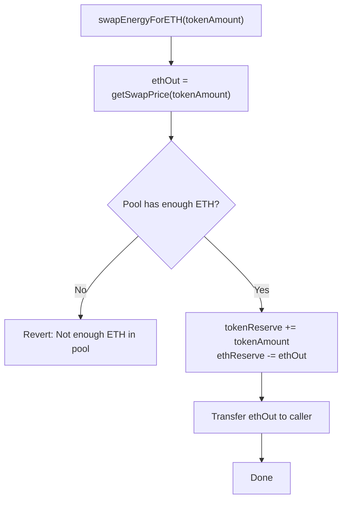
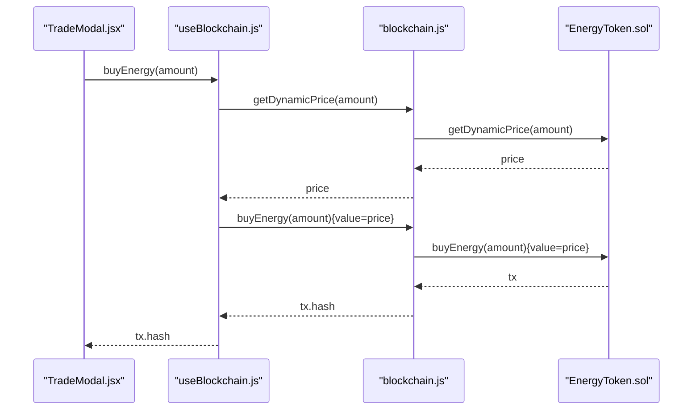
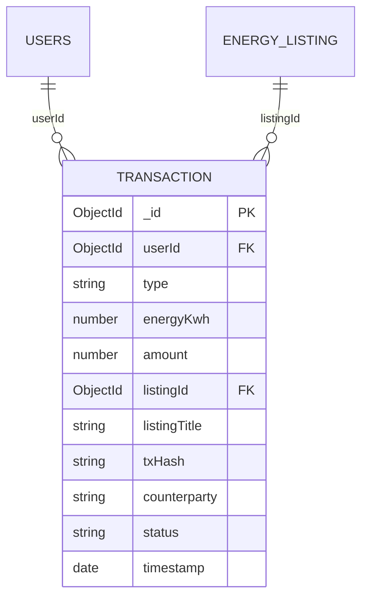
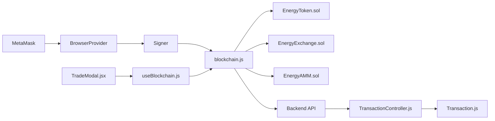

# Blockchain Integration

<cite>
**Referenced Files in This Document**
- [EnergyToken.sol](file://blockchain/contracts/EnergyToken.sol)
- [EnergyExchange.sol](file://blockchain/contracts/EnergyExchange.sol)
- [EnergyAMM.sol](file://blockchain/contracts/EnergyAMM.sol)
- [deploy.js](file://blockchain/scripts/deploy.js)
- [hardhat.config.js](file://blockchain/hardhat.config.js)
- [EnergyToken.test.js](file://blockchain/test/EnergyToken.test.js)
- [EnergyExchange.test.js](file://blockchain/test/EnergyExchange.test.js)
- [EnergyAMM.test.js](file://blockchain/test/EnergyAMM.test.js)
- [blockchain.js](file://frontend/src/services/blockchain.js)
- [useBlockchain.js](file://frontend/src/hooks/useBlockchain.js)
- [TradeModal.jsx](file://frontend/src/components/TradeModal.jsx)
- [Marketplace.jsx](file://frontend/src/frontend/Marketplace.jsx)
- [Transaction.js](file://backend/Models/Transaction.js)
- [TransactionController.js](file://backend/Controllers/TransactionController.js)
- [TransactionRouter.js](file://backend/Routes/TransactionRouter.js)
</cite>

## Table of Contents
1. [Introduction](#introduction)
2. [Project Structure](#project-structure)
3. [Core Components](#core-components)
4. [Architecture Overview](#architecture-overview)
5. [Detailed Component Analysis](#detailed-component-analysis)
6. [Dependency Analysis](#dependency-analysis)
7. [Performance Considerations](#performance-considerations)
8. [Troubleshooting Guide](#troubleshooting-guide)
9. [Conclusion](#conclusion)
10. [Appendices](#appendices)

## Introduction
This document explains the blockchain integration for the EcoGrid platform, focusing on the Solidity smart contracts and their deployment on the Polygon Amoy testnet. It covers:
- EnergyToken ERC20 implementation representing energy units
- EnergyExchange marketplace contract for peer-to-peer trading
- EnergyAMM automated market maker for token-to-ETH swaps
- Deployment via Hardhat and Polygon Amoy configuration
- Frontend integration patterns for wallet connection, transaction signing, and event listening
- Gas optimization strategies and cost management
- Upgrade mechanisms and security considerations
- Transaction lifecycle from initiation to completion with error handling
- Integration between blockchain state and the backend database
- Debugging techniques and common troubleshooting scenarios

## Project Structure
The blockchain integration spans three layers:
- Smart contracts: ERC20 token, marketplace, and AMM
- Frontend: wallet connection, transaction orchestration, and UI
- Backend: database persistence for transactions and analytics

**Diagram sources**
- [hardhat.config.js](file://blockchain/hardhat.config.js#L1-L12)
- [deploy.js](file://blockchain/scripts/deploy.js#L1-L29)
- [EnergyToken.sol](file://blockchain/contracts/EnergyToken.sol#L1-L55)
- [EnergyExchange.sol](file://blockchain/contracts/EnergyExchange.sol#L1-L45)
- [EnergyAMM.sol](file://blockchain/contracts/EnergyAMM.sol#L1-L24)
- [blockchain.js](file://frontend/src/services/blockchain.js#L1-L261)
- [useBlockchain.js](file://frontend/src/hooks/useBlockchain.js#L1-L155)
- [TradeModal.jsx](file://frontend/src/components/TradeModal.jsx#L1-L325)
- [Marketplace.jsx](file://frontend/src/frontend/Marketplace.jsx#L1-L1184)
- [Transaction.js](file://backend/Models/Transaction.js#L1-L51)
- [TransactionController.js](file://backend/Controllers/TransactionController.js#L1-L68)
- [TransactionRouter.js](file://backend/Routes/TransactionRouter.js#L1-L11)

**Section sources**
- [hardhat.config.js](file://blockchain/hardhat.config.js#L1-L12)
- [deploy.js](file://blockchain/scripts/deploy.js#L1-L29)
- [blockchain.js](file://frontend/src/services/blockchain.js#L1-L261)
- [useBlockchain.js](file://frontend/src/hooks/useBlockchain.js#L1-L155)
- [TradeModal.jsx](file://frontend/src/components/TradeModal.jsx#L1-L325)
- [Marketplace.jsx](file://frontend/src/frontend/Marketplace.jsx#L1-L1184)
- [Transaction.js](file://backend/Models/Transaction.js#L1-L51)
- [TransactionController.js](file://backend/Controllers/TransactionController.js#L1-L68)
- [TransactionRouter.js](file://backend/Routes/TransactionRouter.js#L1-L11)

## Core Components
- EnergyToken (ERC20 + Ownable): Represents energy units, supports dynamic pricing, deposits, and conversions between token and energy balances.
- EnergyExchange: Order-book style marketplace with automatic matching and execution events.
- EnergyAMM: Constant-product market maker for token-to-ETH swaps with reserve queries and price calculations.

Key implementation highlights:
- EnergyToken exposes buy/sell functions with dynamic pricing based on supply/demand factors and maintains a separate energyBalance for user energy holdings.
- EnergyExchange stores orders and executes matches when compatible buy/sell orders are found.
- EnergyAMM manages reserves and calculates swap prices proportional to reserves.

**Section sources**
- [EnergyToken.sol](file://blockchain/contracts/EnergyToken.sol#L1-L55)
- [EnergyExchange.sol](file://blockchain/contracts/EnergyExchange.sol#L1-L45)
- [EnergyAMM.sol](file://blockchain/contracts/EnergyAMM.sol#L1-L24)

## Architecture Overview
The end-to-end flow connects user actions in the frontend to on-chain transactions and backend persistence.

**Diagram sources**
- [TradeModal.jsx](file://frontend/src/components/TradeModal.jsx#L39-L80)
- [useBlockchain.js](file://frontend/src/hooks/useBlockchain.js#L46-L60)
- [blockchain.js](file://frontend/src/services/blockchain.js#L164-L176)
- [EnergyToken.sol](file://blockchain/contracts/EnergyToken.sol#L21-L30)
- [TransactionController.js](file://backend/Controllers/TransactionController.js#L18-L67)

## Detailed Component Analysis

### EnergyToken (ERC20 + Ownable)
- Purpose: Tokenized representation of energy units with dynamic pricing and dual balance tracking (token and energy).
- Key functions:
  - buyEnergy(amount){value: price}: Mints energy to buyer and updates energyBalance
  - sellEnergy(amount): Burns tokens from seller and transfers ETH proceeds
  - getDynamicPrice(amount): Computes price considering basePrice and supplyFactor
  - depositTokens(amount): Owner-only minting into contract reserves
- Security and state:
  - Ownable ownership controls depositTokens
  - Dynamic pricing prevents manipulation by adjusting price with demand
  - Separate energyBalance allows energy accounting independent of token transfers

**Diagram sources**
- [EnergyToken.sol](file://blockchain/contracts/EnergyToken.sol#L21-L30)

**Section sources**
- [EnergyToken.sol](file://blockchain/contracts/EnergyToken.sol#L1-L55)
- [EnergyToken.test.js](file://blockchain/test/EnergyToken.test.js#L83-L151)

### EnergyExchange (Order Book)
- Purpose: Decentralized P2P marketplace with automatic order matching.
- Key functions:
  - placeOrder(amount, price, isBuyOrder): Adds order to orderBook and triggers matchOrders
  - matchOrders(): Brute-force matching loop to pair compatible buy/sell orders
  - executeTrade(i, j): Updates remaining amounts and emits OrderExecuted
- Behavior:
  - Orders are stored in a single array; matching occurs immediately upon placement
  - Partial fills supported when buy/sell amounts differ

**Diagram sources**
- [EnergyExchange.sol](file://blockchain/contracts/EnergyExchange.sol#L17-L43)

**Section sources**
- [EnergyExchange.sol](file://blockchain/contracts/EnergyExchange.sol#L1-L45)
- [EnergyExchange.test.js](file://blockchain/test/EnergyExchange.test.js#L27-L198)

### EnergyAMM (Constant Product Market Maker)
- Purpose: Enables token-to-ETH swaps with reserve-based pricing.
- Key functions:
  - getSwapPrice(tokenAmount): Returns proportional ETH out based on reserves
  - swapEnergyForETH(tokenAmount): Transfers ETH to user and updates reserves
  - tokenReserve()/ethReserve(): Public getters for pool state
- Behavior:
  - Requires pool to hold sufficient ETH for the swap
  - Reserves update after each swap; larger swaps have higher price impact

**Diagram sources**
- [EnergyAMM.sol](file://blockchain/contracts/EnergyAMM.sol#L12-L20)

**Section sources**
- [EnergyAMM.sol](file://blockchain/contracts/EnergyAMM.sol#L1-L24)
- [EnergyAMM.test.js](file://blockchain/test/EnergyAMM.test.js#L79-L147)

### Frontend Integration Patterns
- Wallet connection and network switching:
  - Detects MetaMask, requests accounts, and switches to Polygon Amoy
  - Initializes contract instances with ABI and signer
- Transaction orchestration:
  - buyEnergy(amount): Computes price, signs transaction with value, waits for receipt
  - sellEnergy(amount): Signs transaction, waits for receipt
  - placeOrder(amount, price, isBuyOrder): Submits order, waits for execution
  - swapEnergyForETH(amount): Swaps tokens for ETH via AMM
- Event listening:
  - Accounts and chain change listeners keep UI in sync
- UI integration:
  - TradeModal coordinates wallet connection, price estimation, and transaction submission
  - Marketplace page displays user analytics and transaction history

**Diagram sources**
- [TradeModal.jsx](file://frontend/src/components/TradeModal.jsx#L24-L50)
- [useBlockchain.js](file://frontend/src/hooks/useBlockchain.js#L46-L60)
- [blockchain.js](file://frontend/src/services/blockchain.js#L155-L176)
- [EnergyToken.sol](file://blockchain/contracts/EnergyToken.sol#L43-L47)

**Section sources**
- [blockchain.js](file://frontend/src/services/blockchain.js#L1-L261)
- [useBlockchain.js](file://frontend/src/hooks/useBlockchain.js#L1-L155)
- [TradeModal.jsx](file://frontend/src/components/TradeModal.jsx#L1-L325)
- [Marketplace.jsx](file://frontend/src/frontend/Marketplace.jsx#L780-L807)

### Backend Transaction Persistence
- Transaction model captures user trades with blockchain txHash linkage
- Controller creates buyer record and automatically creates seller record for the producer when a purchase occurs
- Routes expose endpoints for retrieving user transactions and creating new ones

**Diagram sources**
- [Transaction.js](file://backend/Models/Transaction.js#L3-L48)
- [TransactionController.js](file://backend/Controllers/TransactionController.js#L18-L60)

**Section sources**
- [Transaction.js](file://backend/Models/Transaction.js#L1-L51)
- [TransactionController.js](file://backend/Controllers/TransactionController.js#L1-L68)
- [TransactionRouter.js](file://backend/Routes/TransactionRouter.js#L1-L11)

## Dependency Analysis
- Frontend depends on:
  - Ethers.js provider/signer for wallet interactions
  - Contract ABIs and addresses for EnergyToken, EnergyExchange, and EnergyAMM
- Contracts depend on:
  - OpenZeppelin ERC20 and Ownable for token and ownership
- Backend depends on:
  - MongoDB via Mongoose for transaction persistence
  - Express routes for API exposure

**Diagram sources**
- [blockchain.js](file://frontend/src/services/blockchain.js#L52-L101)
- [useBlockchain.js](file://frontend/src/hooks/useBlockchain.js#L17-L31)
- [EnergyToken.sol](file://blockchain/contracts/EnergyToken.sol#L4-L10)
- [TransactionController.js](file://backend/Controllers/TransactionController.js#L1-L68)
- [Transaction.js](file://backend/Models/Transaction.js#L1-L51)

**Section sources**
- [blockchain.js](file://frontend/src/services/blockchain.js#L1-L261)
- [useBlockchain.js](file://frontend/src/hooks/useBlockchain.js#L1-L155)
- [EnergyToken.sol](file://blockchain/contracts/EnergyToken.sol#L4-L10)
- [TransactionController.js](file://backend/Controllers/TransactionController.js#L1-L68)
- [Transaction.js](file://backend/Models/Transaction.js#L1-L51)

## Performance Considerations
- Gas optimization strategies:
  - Minimize state writes: Consolidate multiple updates in a single transaction when possible
  - Use efficient loops: EnergyExchange matching is O(n^2); consider off-chain matching with on-chain settlement for scalability
  - Reserve-based pricing: EnergyAMM’s getSwapPrice is O(1); ensure reserve sizes are balanced to reduce slippage
  - Batch operations: Group multiple small trades into larger batches to amortize gas costs
- Cost management:
  - Estimate gas price and fees before prompting users
  - Provide fee estimates in UI (e.g., estimated network fee display)
  - Monitor reserve health to avoid reverts due to insufficient liquidity
- Scalability:
  - Off-chain order aggregation with on-chain settlement reduces on-chain load
  - Consider limiting order lifetimes and partial fills to reduce state bloat

[No sources needed since this section provides general guidance]

## Troubleshooting Guide
Common issues and resolutions:
- Wallet connectivity:
  - Ensure MetaMask is installed and accounts are unlocked
  - Verify network is Polygon Amoy; switch or add chain if needed
- Transaction failures:
  - Insufficient ETH for buyEnergy or insufficient tokens for sellEnergy
  - Contract lacks sufficient ETH for AMM swaps
  - Nonce or gas price issues; retry with adjusted parameters
- Frontend errors:
  - Contract addresses not configured; confirm environment variables are set
  - ABI mismatches; ensure ABIs align with deployed bytecode
- Backend persistence:
  - Transaction creation requires authentication; ensure JWT token is present
  - Producer records are created automatically on purchase; verify listing ownership

**Section sources**
- [blockchain.js](file://frontend/src/services/blockchain.js#L52-L130)
- [EnergyToken.test.js](file://blockchain/test/EnergyToken.test.js#L99-L123)
- [EnergyAMM.test.js](file://blockchain/test/EnergyAMM.test.js#L112-L123)
- [TransactionController.js](file://backend/Controllers/TransactionController.js#L18-L67)

## Conclusion
The EcoGrid blockchain integration combines a tokenized energy unit (EnergyToken), a peer-to-peer marketplace (EnergyExchange), and a liquidity pool (EnergyAMM) with robust frontend and backend integration. The system leverages Polygon Amoy for testing, provides clear transaction lifecycles, and offers practical patterns for wallet connection, transaction signing, and event listening. With careful gas optimization, upgrade planning, and security hardening, the platform can evolve toward production readiness.

[No sources needed since this section summarizes without analyzing specific files]

## Appendices

### Deployment and Environment Setup
- Hardhat configuration defines Polygon Amoy network and private key for deployment
- Deploy script deploys all contracts and logs their addresses
- Frontend expects contract addresses via environment variables

**Section sources**
- [hardhat.config.js](file://blockchain/hardhat.config.js#L1-L12)
- [deploy.js](file://blockchain/scripts/deploy.js#L1-L29)
- [blockchain.js](file://frontend/src/services/blockchain.js#L32-L37)

### Testing Coverage
- EnergyToken tests validate deployment, dynamic pricing, buy/sell flows, and ERC20 compliance
- EnergyExchange tests validate order placement, matching, partial fills, and event emission
- EnergyAMM tests validate swap pricing, reserve updates, and edge cases

**Section sources**
- [EnergyToken.test.js](file://blockchain/test/EnergyToken.test.js#L1-L229)
- [EnergyExchange.test.js](file://blockchain/test/EnergyExchange.test.js#L1-L291)
- [EnergyAMM.test.js](file://blockchain/test/EnergyAMM.test.js#L1-L239)