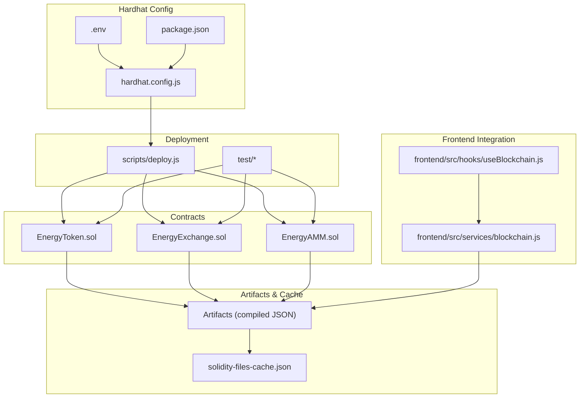
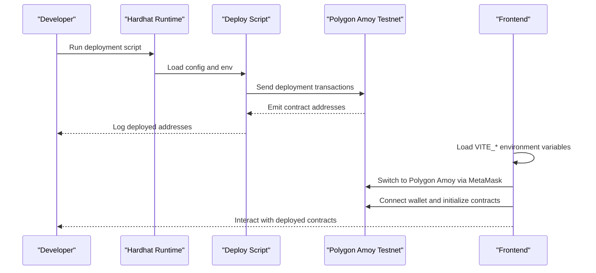
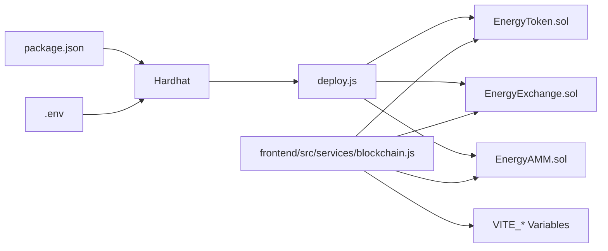
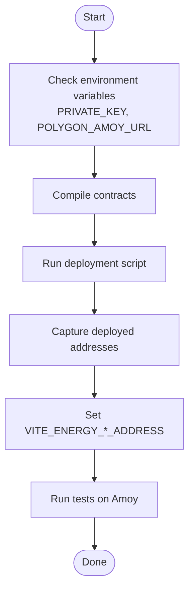

# Deployment & Configuration

<cite>
**Referenced Files in This Document**
- [hardhat.config.js](file://blockchain/hardhat.config.js)
- [deploy.js](file://blockchain/scripts/deploy.js)
- [.env](file://blockchain/.env)
- [package.json](file://blockchain/package.json)
- [EnergyToken.sol](file://blockchain/contracts/EnergyToken.sol)
- [EnergyExchange.sol](file://blockchain/contracts/EnergyExchange.sol)
- [EnergyAMM.sol](file://blockchain/contracts/EnergyAMM.sol)
- [solidity-files-cache.json](file://blockchain/cache/solidity-files-cache.json)
- [EnergyToken.test.js](file://blockchain/test/EnergyToken.test.js)
- [EnergyExchange.test.js](file://blockchain/test/EnergyExchange.test.js)
- [EnergyAMM.test.js](file://blockchain/test/EnergyAMM.test.js)
- [blockchain.js](file://frontend/src/services/blockchain.js)
- [useBlockchain.js](file://frontend/src/hooks/useBlockchain.js)
</cite>

## Table of Contents
1. [Introduction](#introduction)
2. [Project Structure](#project-structure)
3. [Core Components](#core-components)
4. [Architecture Overview](#architecture-overview)
5. [Detailed Component Analysis](#detailed-component-analysis)
6. [Dependency Analysis](#dependency-analysis)
7. [Performance Considerations](#performance-considerations)
8. [Troubleshooting Guide](#troubleshooting-guide)
9. [Conclusion](#conclusion)
10. [Appendices](#appendices)

## Introduction
This document provides comprehensive deployment and configuration guidance for the blockchain system. It covers Hardhat configuration, network setup for Polygon Amoy testnet, deployment scripts, environment variables, artifact generation, ABI management for frontend integration, and step-by-step deployment procedures from local development to testnet. It also includes troubleshooting advice for common issues such as nonce management, gas-related problems, and network connectivity.

## Project Structure
The blockchain module is organized around Solidity contracts, Hardhat configuration, deployment scripts, tests, and generated artifacts. Frontend integration consumes contract ABIs and addresses configured via environment variables.

**Diagram sources**
- [hardhat.config.js](file://blockchain/hardhat.config.js#L1-L12)
- [.env](file://blockchain/.env#L1-L2)
- [package.json](file://blockchain/package.json#L1-L11)
- [EnergyToken.sol](file://blockchain/contracts/EnergyToken.sol#L1-L55)
- [EnergyExchange.sol](file://blockchain/contracts/EnergyExchange.sol#L1-L45)
- [EnergyAMM.sol](file://blockchain/contracts/EnergyAMM.sol#L1-L24)
- [solidity-files-cache.json](file://blockchain/cache/solidity-files-cache.json#L1-L344)
- [deploy.js](file://blockchain/scripts/deploy.js#L1-L29)
- [EnergyToken.test.js](file://blockchain/test/EnergyToken.test.js#L1-L229)
- [EnergyExchange.test.js](file://blockchain/test/EnergyExchange.test.js#L1-L291)
- [EnergyAMM.test.js](file://blockchain/test/EnergyAMM.test.js#L1-L239)
- [blockchain.js](file://frontend/src/services/blockchain.js#L1-L261)
- [useBlockchain.js](file://frontend/src/hooks/useBlockchain.js#L1-L155)

**Section sources**
- [hardhat.config.js](file://blockchain/hardhat.config.js#L1-L12)
- [package.json](file://blockchain/package.json#L1-L11)
- [solidity-files-cache.json](file://blockchain/cache/solidity-files-cache.json#L1-L344)

## Core Components
- Hardhat configuration defines the Solidity compiler version and network endpoints for Polygon Amoy testnet using environment variables.
- Deployment script compiles and deploys contracts in sequence, logging deployment addresses.
- Contracts implement token mechanics, exchange matching, and AMM liquidity.
- Tests validate deployment, ownership, pricing, trading, and pool behavior.
- Frontend integrates contracts via ABI and environment-configured addresses.

**Section sources**
- [hardhat.config.js](file://blockchain/hardhat.config.js#L4-L12)
- [deploy.js](file://blockchain/scripts/deploy.js#L3-L24)
- [EnergyToken.sol](file://blockchain/contracts/EnergyToken.sol#L7-L54)
- [EnergyExchange.sol](file://blockchain/contracts/EnergyExchange.sol#L4-L44)
- [EnergyAMM.sol](file://blockchain/contracts/EnergyAMM.sol#L4-L23)
- [EnergyToken.test.js](file://blockchain/test/EnergyToken.test.js#L12-L40)
- [EnergyExchange.test.js](file://blockchain/test/EnergyExchange.test.js#L13-L25)
- [EnergyAMM.test.js](file://blockchain/test/EnergyAMM.test.js#L13-L38)
- [blockchain.js](file://frontend/src/services/blockchain.js#L3-L37)

## Architecture Overview
The deployment pipeline compiles Solidity contracts, generates artifacts, and deploys them to the Polygon Amoy testnet using a funded account derived from environment variables. Frontend connects to MetaMask, switches to the correct chain, and interacts with deployed contracts using embedded ABIs and environment-configured addresses.

**Diagram sources**
- [deploy.js](file://blockchain/scripts/deploy.js#L3-L24)
- [hardhat.config.js](file://blockchain/hardhat.config.js#L6-L11)
- [.env](file://blockchain/.env#L1-L2)
- [blockchain.js](file://frontend/src/services/blockchain.js#L52-L101)

## Detailed Component Analysis

### Hardhat Configuration
- Compiler settings: Solidity version is pinned to a specific patch level.
- Network configuration: Polygon Amoy endpoint and private key are loaded from environment variables.
- Tooling: Hardhat Toolbox is included for testing, compilation, and task support.

Key configuration elements:
- Solidity compiler version
- Network definition for Amoy with URL and account
- Environment variable loading

**Section sources**
- [hardhat.config.js](file://blockchain/hardhat.config.js#L4-L12)
- [package.json](file://blockchain/package.json#L2-L9)
- [.env](file://blockchain/.env#L1-L2)

### Deployment Script
The deployment script:
- Retrieves the default signer from Hardhat.
- Deploys contracts in sequence: EnergyToken, EnergyExchange, EnergyAMM.
- Waits for each transaction to be mined and logs the deployed address.

Operational flow:
- Get signers
- Deploy EnergyToken
- Deploy EnergyExchange
- Deploy EnergyAMM

**Section sources**
- [deploy.js](file://blockchain/scripts/deploy.js#L3-L24)

### Polygon Amoy Testnet Configuration
- RPC endpoint: Provided via environment variable.
- Private key: Used to fund the deployer account.
- Chain ID: Frontend expects the Amoy chain ID for switching.

Environment variables:
- PRIVATE_KEY
- POLYGON_AMOY_URL

Frontend chain configuration:
- Chain ID for Amoy
- RPC URL and block explorer URL

**Section sources**
- [.env](file://blockchain/.env#L1-L2)
- [blockchain.js](file://frontend/src/services/blockchain.js#L39-L130)

### Contracts Overview
- EnergyToken: ERC20-based token with dynamic pricing, energy balance tracking, and owner-only controls.
- EnergyExchange: Order book with matching logic and event emission.
- EnergyAMM: Constant-product AMM with reserve tracking and swap mechanics.

Contract responsibilities:
- Token minting, transfers, and owner functions
- Order placement, matching, and execution
- Liquidity pool swaps and reserve updates

**Section sources**
- [EnergyToken.sol](file://blockchain/contracts/EnergyToken.sol#L7-L54)
- [EnergyExchange.sol](file://blockchain/contracts/EnergyExchange.sol#L4-L44)
- [EnergyAMM.sol](file://blockchain/contracts/EnergyAMM.sol#L4-L23)

### Artifact Generation and ABI Management
- Artifacts are generated during compilation and include ABI, bytecode, and metadata.
- Hardhat’s cache tracks solc configuration and output selection.
- Frontend embeds simplified ABIs for the three contracts and reads contract addresses from environment variables.

Artifact details:
- Output selection includes ABI, bytecode, deployedBytecode, method identifiers, and metadata.
- OpenZeppelin contracts are resolved and included in artifacts.

Frontend integration:
- Contract addresses loaded from VITE_* environment variables
- Simplified ABIs for function/event signatures
- Provider and signer initialization with chain switching

**Section sources**
- [solidity-files-cache.json](file://blockchain/cache/solidity-files-cache.json#L8-L31)
- [solidity-files-cache.json](file://blockchain/cache/solidity-files-cache.json#L44-L66)
- [solidity-files-cache.json](file://blockchain/cache/solidity-files-cache.json#L79-L113)
- [blockchain.js](file://frontend/src/services/blockchain.js#L3-L37)
- [blockchain.js](file://frontend/src/services/blockchain.js#L71-L93)

### Step-by-Step Deployment Procedures

#### Local Development Setup
1. Install dependencies in the blockchain module.
2. Configure environment variables for private key and RPC endpoint.
3. Compile contracts to generate artifacts.
4. Run the deployment script to deploy contracts on the configured network.

Verification steps:
- Confirm deployment logs show contract addresses.
- Run tests to validate contract behavior locally.

**Section sources**
- [package.json](file://blockchain/package.json#L1-L11)
- [.env](file://blockchain/.env#L1-L2)
- [deploy.js](file://blockchain/scripts/deploy.js#L3-L24)
- [EnergyToken.test.js](file://blockchain/test/EnergyToken.test.js#L12-L40)
- [EnergyExchange.test.js](file://blockchain/test/EnergyExchange.test.js#L13-L25)
- [EnergyAMM.test.js](file://blockchain/test/EnergyAMM.test.js#L13-L38)

#### Testnet Deployment (Polygon Amoy)
1. Ensure environment variables are set for Amoy RPC and private key.
2. Run the deployment script against the Amoy network.
3. Capture the emitted contract addresses.
4. Update frontend environment variables with the deployed addresses.
5. Build and deploy the frontend to consume the contracts.

Frontend configuration:
- Set VITE_ENERGY_TOKEN_ADDRESS, VITE_ENERGY_EXCHANGE_ADDRESS, VITE_ENERGY_AMM_ADDRESS
- Ensure RPC URL and chain metadata are correct for Amoy

**Section sources**
- [.env](file://blockchain/.env#L1-L2)
- [hardhat.config.js](file://blockchain/hardhat.config.js#L6-L11)
- [deploy.js](file://blockchain/scripts/deploy.js#L3-L24)
- [blockchain.js](file://frontend/src/services/blockchain.js#L31-L37)
- [blockchain.js](file://frontend/src/services/blockchain.js#L103-L130)

### Contract Upgrade Patterns and Upgradeability
Current contracts are stateful implementations without explicit upgradeability mechanisms. To enable upgrades:
- Use Transparent Proxy pattern with a proxy contract delegating to an upgradeable implementation.
- Employ Upgradeable contracts from OpenZeppelin with initializer functions.
- Manage upgrades via an admin governance mechanism (e.g., TimelockController or multisig).
- Version artifacts and track proxy addresses separately from implementation addresses.

Note: The current repository does not include proxy contracts or upgradeability scaffolding. Implementing upgrades requires refactoring existing contracts into upgradeable forms and adding proxy contracts.

[No sources needed since this section provides general guidance]

### Environment Variable Configuration
- Development: PRIVATE_KEY and POLYGON_AMOY_URL define the deployer and RPC endpoint.
- Production: Frontend environment variables (VITE_ENERGY_*_ADDRESS) define contract addresses.

Recommended variables:
- PRIVATE_KEY: Wallet private key for signing transactions
- POLYGON_AMOY_URL: Alchemy or public RPC endpoint for Amoy
- VITE_ENERGY_TOKEN_ADDRESS: Deployed EnergyToken address
- VITE_ENERGY_EXCHANGE_ADDRESS: Deployed EnergyExchange address
- VITE_ENERGY_AMM_ADDRESS: Deployed EnergyAMM address

**Section sources**
- [.env](file://blockchain/.env#L1-L2)
- [blockchain.js](file://frontend/src/services/blockchain.js#L31-L37)

## Dependency Analysis
The deployment depends on Hardhat, environment variables, and OpenZeppelin contracts. The frontend depends on MetaMask provider and environment-configured contract addresses.

**Diagram sources**
- [package.json](file://blockchain/package.json#L1-L11)
- [.env](file://blockchain/.env#L1-L2)
- [deploy.js](file://blockchain/scripts/deploy.js#L1-L29)
- [EnergyToken.sol](file://blockchain/contracts/EnergyToken.sol#L1-L55)
- [EnergyExchange.sol](file://blockchain/contracts/EnergyExchange.sol#L1-L45)
- [EnergyAMM.sol](file://blockchain/contracts/EnergyAMM.sol#L1-L24)
- [blockchain.js](file://frontend/src/services/blockchain.js#L31-L37)

**Section sources**
- [package.json](file://blockchain/package.json#L1-L11)
- [solidity-files-cache.json](file://blockchain/cache/solidity-files-cache.json#L1-L344)

## Performance Considerations
- Gas optimization: Enable optimizer settings in Hardhat for production builds to reduce deployment and runtime costs.
- Batch deployments: Group related transactions where possible to minimize nonce churn.
- Reserve sizing: For AMM, ensure adequate ETH and token reserves to avoid slippage and reverts.
- Testing coverage: Comprehensive tests help identify performance bottlenecks before deployment.

[No sources needed since this section provides general guidance]

## Troubleshooting Guide

Common deployment issues and resolutions:
- Nonce management
  - Symptom: Transactions failing due to invalid nonce.
  - Resolution: Use a single signer per deployment session or manage nonces explicitly when batching.
- Gas limit problems
  - Symptom: Transactions out-of-gas or stuck.
  - Resolution: Increase gasLimit/gasPrice in deployment script; monitor network conditions; use estimateGas before sending.
- Network connectivity
  - Symptom: RPC endpoint unreachable or rate-limited.
  - Resolution: Verify POLYGON_AMOY_URL; consider switching to a reliable provider; check firewall/proxy settings.
- ABI mismatches
  - Symptom: Frontend errors invoking contract functions.
  - Resolution: Ensure frontend ABIs match deployed contract interfaces; confirm VITE_ENERGY_*_ADDRESS values.
- Chain mismatch
  - Symptom: Frontend cannot switch to Amoy or incorrect chain detected.
  - Resolution: Confirm POLYGON_AMOY_CHAIN_ID and RPC URL; ensure MetaMask is configured for Amoy.

**Section sources**
- [deploy.js](file://blockchain/scripts/deploy.js#L26-L29)
- [blockchain.js](file://frontend/src/services/blockchain.js#L103-L130)
- [EnergyAMM.test.js](file://blockchain/test/EnergyAMM.test.js#L112-L123)

## Conclusion
This guide outlined how to configure and deploy the blockchain system using Hardhat, how to target Polygon Amoy testnet, how to manage environment variables, and how to integrate contracts in the frontend. While the current contracts are not upgradeable, the document provided guidance for implementing proxy-based upgrades. Following the step-by-step procedures and troubleshooting tips will help ensure smooth local and testnet deployments.

## Appendices

### Appendix A: Deployment Flowchart

**Diagram sources**
- [.env](file://blockchain/.env#L1-L2)
- [deploy.js](file://blockchain/scripts/deploy.js#L3-L24)
- [blockchain.js](file://frontend/src/services/blockchain.js#L31-L37)