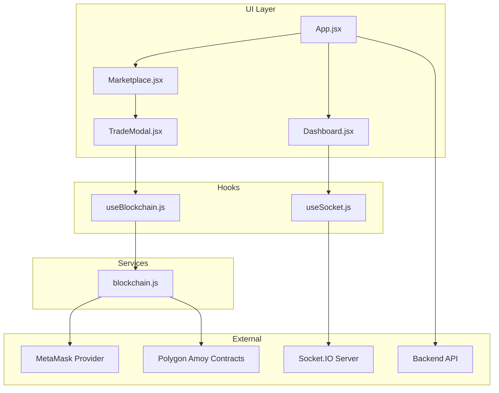
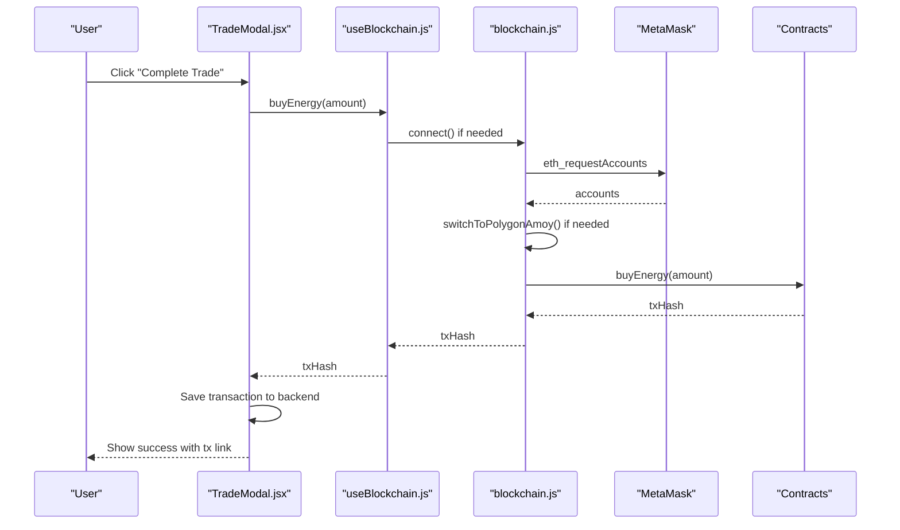
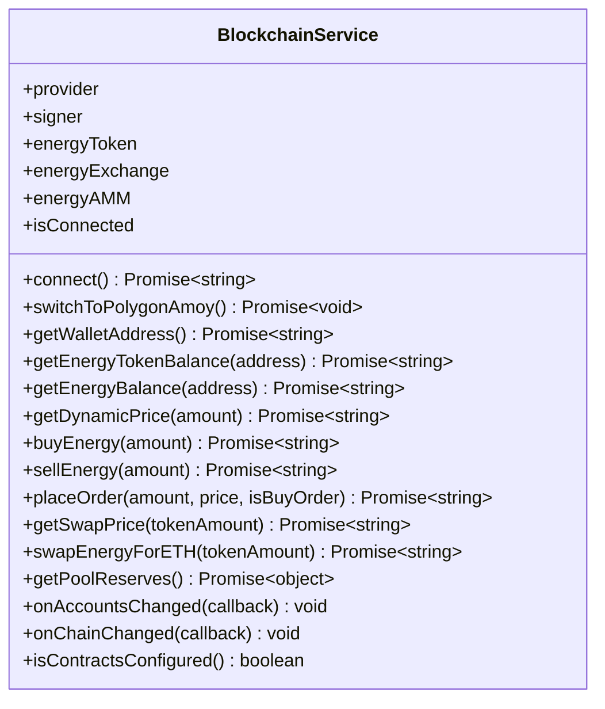
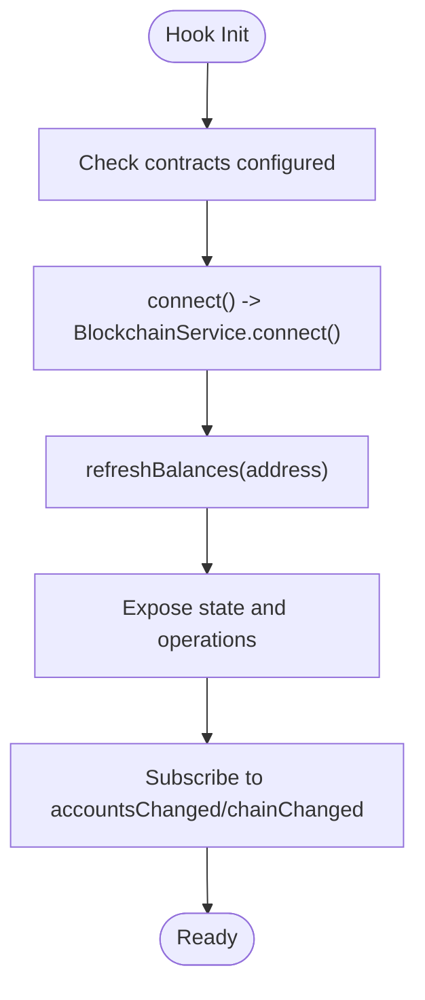
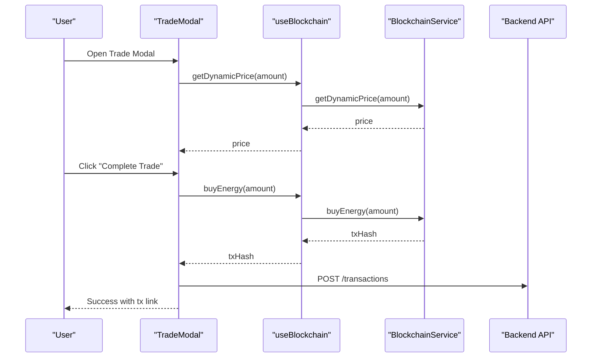
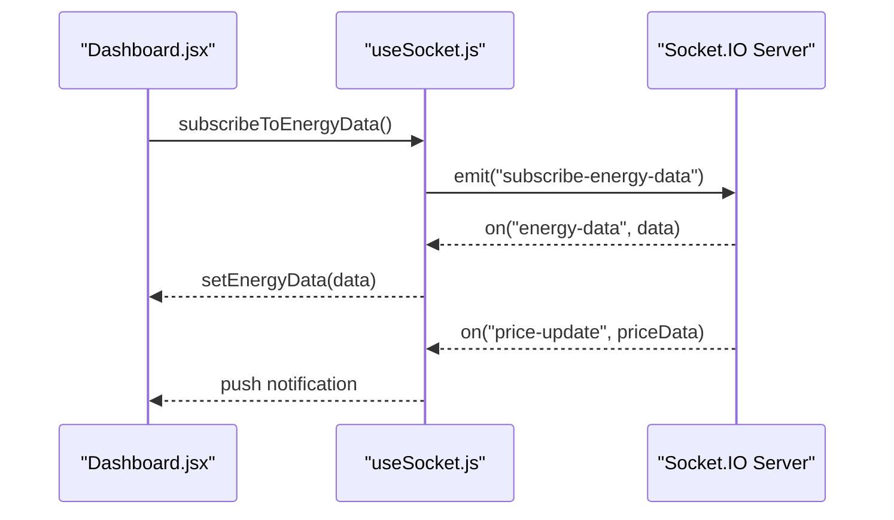
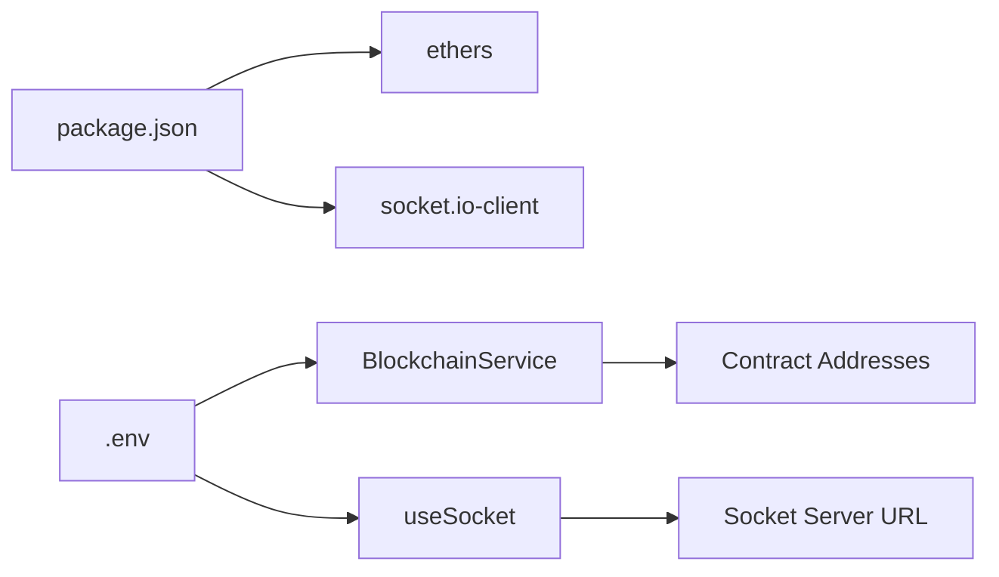

# Frontend Integration

<cite>
**Referenced Files in This Document**
- [blockchain.js](file://frontend/src/services/blockchain.js)
- [useBlockchain.js](file://frontend/src/hooks/useBlockchain.js)
- [useSocket.js](file://frontend/src/hooks/useSocket.js)
- [TradeModal.jsx](file://frontend/src/components/TradeModal.jsx)
- [Marketplace.jsx](file://frontend/src/frontend/Marketplace.jsx)
- [Dashboard.jsx](file://frontend/src/frontend/Dashboard.jsx)
- [App.jsx](file://frontend/src/App.jsx)
- [main.jsx](file://frontend/src/main.jsx)
- [.env](file://frontend/.env)
- [package.json](file://frontend/package.json)
</cite>

## Table of Contents
1. [Introduction](#introduction)
2. [Project Structure](#project-structure)
3. [Core Components](#core-components)
4. [Architecture Overview](#architecture-overview)
5. [Detailed Component Analysis](#detailed-component-analysis)
6. [Dependency Analysis](#dependency-analysis)
7. [Performance Considerations](#performance-considerations)
8. [Troubleshooting Guide](#troubleshooting-guide)
9. [Conclusion](#conclusion)
10. [Appendices](#appendices)

## Introduction
This document explains the frontend integration for blockchain interactions in the EcoGrid platform. It covers wallet connection management, contract interaction patterns, transaction signing workflows, custom React hooks for state management, MetaMask integration, contract interaction patterns for reading state, sending transactions, and event subscriptions. It also documents error handling strategies, common frontend operations (token transfers, marketplace orders, liquidity provision), performance optimization techniques, and integration with Socket.IO for real-time event streaming and dashboard updates.

## Project Structure
The frontend integrates three primary layers:
- Blockchain service abstraction encapsulating wallet and contract interactions
- React hooks for state management and lifecycle handling
- UI components orchestrating user actions and rendering real-time data

**Diagram sources**
- [App.jsx](file://frontend/src/App.jsx#L1-L79)
- [Marketplace.jsx](file://frontend/src/frontend/Marketplace.jsx#L1-L1188)
- [Dashboard.jsx](file://frontend/src/frontend/Dashboard.jsx#L1-L556)
- [TradeModal.jsx](file://frontend/src/components/TradeModal.jsx#L1-L325)
- [useBlockchain.js](file://frontend/src/hooks/useBlockchain.js#L1-L155)
- [useSocket.js](file://frontend/src/hooks/useSocket.js#L1-L142)
- [blockchain.js](file://frontend/src/services/blockchain.js#L1-L261)

**Section sources**
- [App.jsx](file://frontend/src/App.jsx#L1-L79)
- [main.jsx](file://frontend/src/main.jsx#L1-L15)

## Core Components
- BlockchainService: Manages MetaMask provider, signer, and contract instances; handles network switching and transaction signing.
- useBlockchain: React hook exposing connection state, balances, and contract operations with error handling and real-time updates.
- useSocket: React hook managing Socket.IO connection and event subscriptions for real-time updates.
- TradeModal: UI component orchestrating wallet connection, price estimation, transaction signing, and backend synchronization.
- Marketplace and Dashboard: Pages consuming hooks and components to render marketplace listings and live energy charts.

**Section sources**
- [blockchain.js](file://frontend/src/services/blockchain.js#L1-L261)
- [useBlockchain.js](file://frontend/src/hooks/useBlockchain.js#L1-L155)
- [useSocket.js](file://frontend/src/hooks/useSocket.js#L1-L142)
- [TradeModal.jsx](file://frontend/src/components/TradeModal.jsx#L1-L325)
- [Marketplace.jsx](file://frontend/src/frontend/Marketplace.jsx#L1-L1188)
- [Dashboard.jsx](file://frontend/src/frontend/Dashboard.jsx#L1-L556)

## Architecture Overview
The frontend follows a layered architecture:
- UI components trigger actions via React hooks
- Hooks call the BlockchainService for wallet and contract operations
- BlockchainService interacts with MetaMask and smart contracts
- Real-time events are streamed via Socket.IO to keep the UI updated
- Backend APIs support user sessions, listings, and transaction records

**Diagram sources**
- [TradeModal.jsx](file://frontend/src/components/TradeModal.jsx#L39-L80)
- [useBlockchain.js](file://frontend/src/hooks/useBlockchain.js#L46-L60)
- [blockchain.js](file://frontend/src/services/blockchain.js#L52-L101)
- [blockchain.js](file://frontend/src/services/blockchain.js#L164-L176)

## Detailed Component Analysis

### BlockchainService
Responsibilities:
- Detect and initialize MetaMask provider and signer
- Switch to Polygon Amoy Testnet when needed
- Initialize contract instances for EnergyToken, EnergyExchange, and EnergyAMM
- Provide read/write operations for balances, dynamic pricing, orders, and swaps
- Expose event listeners for accounts and chain changes

Key patterns:
- Provider detection and account authorization via window.ethereum
- Network switching using wallet_switchEthereumChain and wallet_addEthereumChain
- Contract interactions using ethers.Contract with parsed amounts and awaited receipts
- Event subscription for accountsChanged and chainChanged

**Diagram sources**
- [blockchain.js](file://frontend/src/services/blockchain.js#L42-L257)

**Section sources**
- [blockchain.js](file://frontend/src/services/blockchain.js#L1-L261)

### useBlockchain Hook
Responsibilities:
- Manage connection state, wallet address, balances, loading, and errors
- Provide operations: connect, buyEnergy, sellEnergy, placeOrder, getDynamicPrice, swapEnergyForETH, refreshBalances
- Subscribe to MetaMask events to update state on account or chain changes
- Guard operations with connection checks and propagate errors

Patterns:
- useCallback for stable function references
- useEffect to subscribe to accountsChanged and chainChanged
- Centralized error handling with setError and rethrowing

**Diagram sources**
- [useBlockchain.js](file://frontend/src/hooks/useBlockchain.js#L13-L134)

**Section sources**
- [useBlockchain.js](file://frontend/src/hooks/useBlockchain.js#L1-L155)

### TradeModal Component
Responsibilities:
- Render wallet connection UI and trade form
- Estimate price using getDynamicPrice
- Trigger buyEnergy and persist transaction to backend
- Display success/error states and redirect to blockchain explorer

Patterns:
- Controlled inputs for amount and estimated price
- Conditional rendering based on connection and contract configuration
- Integration with useBlockchain for all blockchain operations

**Diagram sources**
- [TradeModal.jsx](file://frontend/src/components/TradeModal.jsx#L24-L80)
- [useBlockchain.js](file://frontend/src/hooks/useBlockchain.js#L93-L100)
- [useBlockchain.js](file://frontend/src/hooks/useBlockchain.js#L46-L60)
- [blockchain.js](file://frontend/src/services/blockchain.js#L155-L176)

**Section sources**
- [TradeModal.jsx](file://frontend/src/components/TradeModal.jsx#L1-L325)

### useSocket Hook
Responsibilities:
- Establish Socket.IO connection to the backend server
- Listen for energy-data, listing updates, trade-completed, and price-update events
- Provide methods to join rooms and emit custom events
- Manage notification queue for UI feedback

Patterns:
- useRef to maintain socket instance across renders
- useEffect for connection lifecycle and cleanup
- Event-driven updates for real-time dashboards

**Diagram sources**
- [Dashboard.jsx](file://frontend/src/frontend/Dashboard.jsx#L80-L125)
- [useSocket.js](file://frontend/src/hooks/useSocket.js#L12-L88)
- [useSocket.js](file://frontend/src/hooks/useSocket.js#L105-L109)

**Section sources**
- [useSocket.js](file://frontend/src/hooks/useSocket.js#L1-L142)
- [Dashboard.jsx](file://frontend/src/frontend/Dashboard.jsx#L1-L556)

### Marketplace Page
Responsibilities:
- Display energy listings, filtering, and search
- Allow prosumers to manage listings and view analytics
- Integrate TradeModal for purchasing energy
- Show transaction history and user statistics

Patterns:
- API-driven listing and analytics loading
- Conditional UI for prosumer capabilities
- Integration with TradeModal and useBlockchain

**Section sources**
- [Marketplace.jsx](file://frontend/src/frontend/Marketplace.jsx#L1-L1188)

## Dependency Analysis
External libraries and environment configuration:
- ethers: v6.x for provider, signer, and contract interactions
- socket.io-client: for real-time communication
- Environment variables define contract addresses and backend/socket URLs

**Diagram sources**
- [package.json](file://frontend/package.json#L12-L32)
- [.env](file://frontend/.env#L1-L7)
- [blockchain.js](file://frontend/src/services/blockchain.js#L32-L37)
- [useSocket.js](file://frontend/src/hooks/useSocket.js#L4-L4)

**Section sources**
- [package.json](file://frontend/package.json#L1-L50)
- [.env](file://frontend/.env#L1-L7)

## Performance Considerations
- Batch reads/writes: Group multiple read calls (e.g., balances) into a single refresh cycle to minimize RPC calls.
- Debounce user input: Throttle getDynamicPrice calls during rapid input changes in TradeModal.
- Memoization: useCallback and useMemo reduce unnecessary re-renders in hooks and components.
- Caching: Cache contract addresses and signer instances; avoid re-initializing contracts on every render.
- Lazy initialization: Initialize contracts only after successful wallet connection and configuration check.
- Efficient UI updates: Limit DOM updates by updating only necessary state slices (e.g., energyData vs. full state).
- Socket batching: Coalesce frequent events (e.g., price updates) to reduce UI thrashing.

[No sources needed since this section provides general guidance]

## Troubleshooting Guide
Common issues and resolutions:
- Wallet not detected: Ensure MetaMask is installed and window.ethereum is available. The service throws a descriptive error if not present.
- Wrong network: The service attempts wallet_switchEthereumChain and falls back to wallet_addEthereumChain for Polygon Amoy Testnet.
- Contract addresses missing: isContractsConfigured must return true; otherwise, trading functions are disabled.
- Transaction failures: Errors are caught in hooks and surfaced to the UI; inspect tx receipt and blockchain explorer links.
- Real-time updates not appearing: Verify socket connection status and ensure server emits events to subscribed rooms.

**Section sources**
- [blockchain.js](file://frontend/src/services/blockchain.js#L52-L130)
- [blockchain.js](file://frontend/src/services/blockchain.js#L252-L256)
- [useBlockchain.js](file://frontend/src/hooks/useBlockchain.js#L118-L134)
- [TradeModal.jsx](file://frontend/src/components/TradeModal.jsx#L184-L192)

## Conclusion
The frontend integrates MetaMask, smart contracts, and real-time data streams through a clean separation of concerns. The BlockchainService centralizes wallet and contract logic, while useBlockchain and useSocket provide predictable state management and event handling for UI components. The TradeModal demonstrates a complete transaction flow from price estimation to backend persistence. Following the performance and troubleshooting recommendations ensures a responsive and reliable user experience.

[No sources needed since this section summarizes without analyzing specific files]

## Appendices

### MetaMask Integration Steps
- Provider detection: window.ethereum presence is checked before connecting.
- Account authorization: eth_requestAccounts prompts user to unlock and share accounts.
- Network management: wallet_switchEthereumChain attempts to switch; wallet_addEthereumChain adds Polygon Amoy if missing.
- Event subscriptions: accountsChanged and chainChanged keep UI synchronized.

**Section sources**
- [blockchain.js](file://frontend/src/services/blockchain.js#L52-L130)
- [useBlockchain.js](file://frontend/src/hooks/useBlockchain.js#L118-L134)

### Contract Interaction Patterns
- Reading state: balanceOf, energyBalance, getDynamicPrice, getSwapPrice, tokenReserve, ethReserve
- Writing state: buyEnergy, sellEnergy, placeOrder, swapEnergyForETH
- Event subscriptions: accountsChanged, chainChanged

**Section sources**
- [blockchain.js](file://frontend/src/services/blockchain.js#L139-L238)
- [blockchain.js](file://frontend/src/services/blockchain.js#L240-L250)

### Common Frontend Operations
- Token transfers: buyEnergy and sellEnergy operations
- Marketplace orders: placeOrder with amount, price, and order type
- Liquidity provision: swapEnergyForETH and AMM reserves inspection

**Section sources**
- [useBlockchain.js](file://frontend/src/hooks/useBlockchain.js#L46-L116)
- [blockchain.js](file://frontend/src/services/blockchain.js#L164-L238)

### Real-Time Streaming with Socket.IO
- Connection lifecycle: connect, disconnect, connect_error
- Event subscriptions: energy-data, listing-created, listing-updated, trade-completed, price-update
- Room joining: join-user-room, join-marketplace
- UI integration: Dashboard listens for live energy data and price updates

**Section sources**
- [useSocket.js](file://frontend/src/hooks/useSocket.js#L12-L88)
- [Dashboard.jsx](file://frontend/src/frontend/Dashboard.jsx#L80-L125)