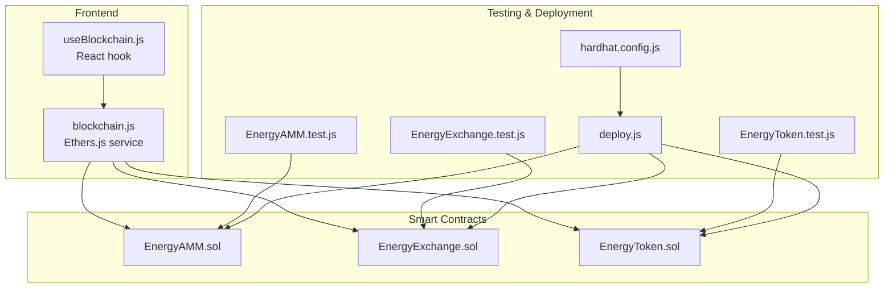
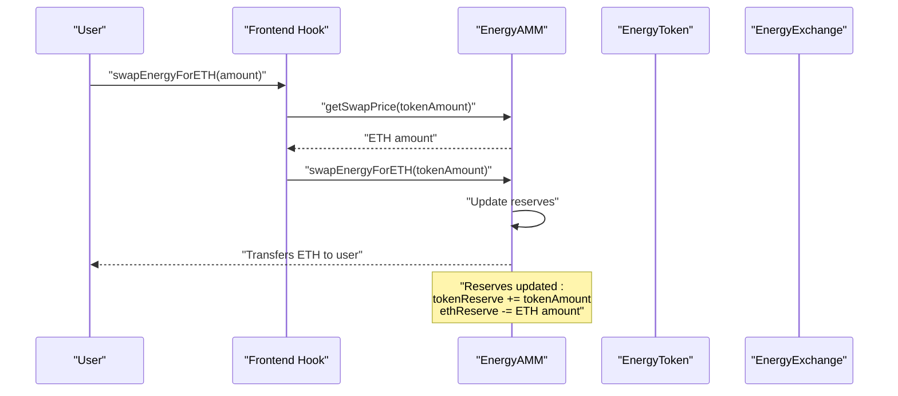
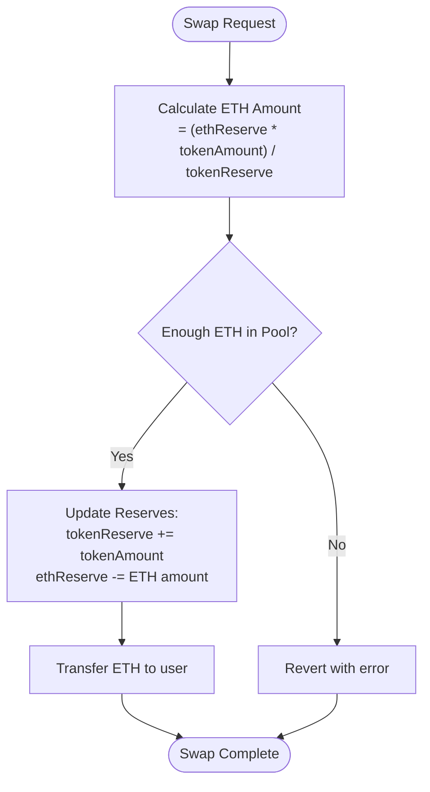
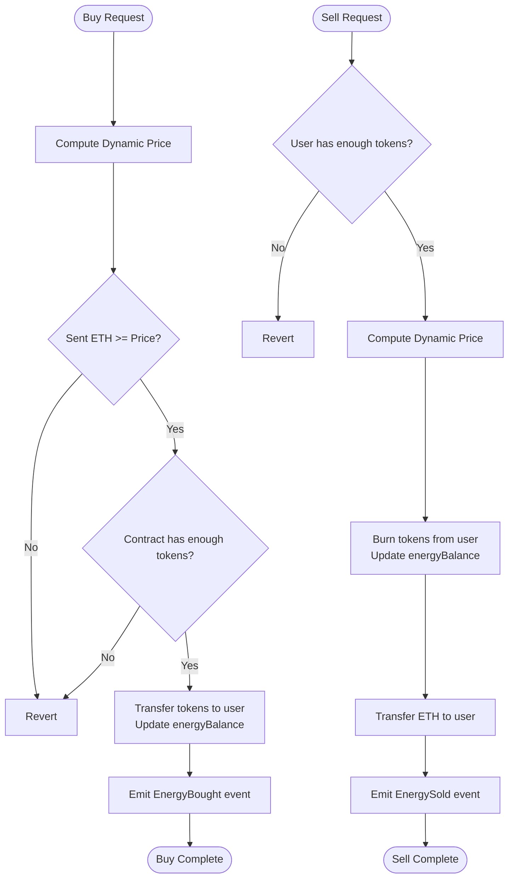
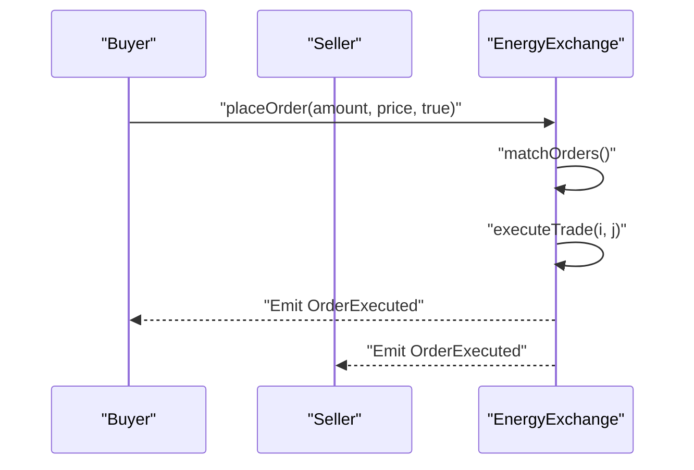
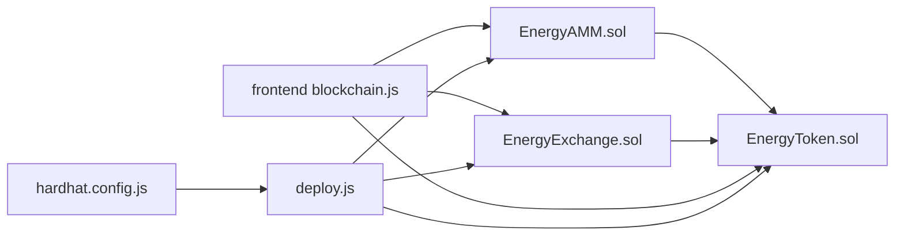

# EnergyAMM (Automated Market Maker)

<cite>
**Referenced Files in This Document**
- [EnergyAMM.sol](file://blockchain/contracts/EnergyAMM.sol)
- [EnergyExchange.sol](file://blockchain/contracts/EnergyExchange.sol)
- [EnergyToken.sol](file://blockchain/contracts/EnergyToken.sol)
- [EnergyAMM.test.js](file://blockchain/test/EnergyAMM.test.js)
- [EnergyExchange.test.js](file://blockchain/test/EnergyExchange.test.js)
- [EnergyToken.test.js](file://blockchain/test/EnergyToken.test.js)
- [deploy.js](file://blockchain/scripts/deploy.js)
- [hardhat.config.js](file://blockchain/hardhat.config.js)
- [blockchain.js](file://frontend/src/services/blockchain.js)
- [useBlockchain.js](file://frontend/src/hooks/useBlockchain.js)
- [README.md](file://blockchain/README.md)
</cite>

## Table of Contents
1. [Introduction](#introduction)
2. [Project Structure](#project-structure)
3. [Core Components](#core-components)
4. [Architecture Overview](#architecture-overview)
5. [Detailed Component Analysis](#detailed-component-analysis)
6. [Dependency Analysis](#dependency-analysis)
7. [Performance Considerations](#performance-considerations)
8. [Troubleshooting Guide](#troubleshooting-guide)
9. [Conclusion](#conclusion)
10. [Appendices](#appendices)

## Introduction
This document provides comprehensive technical documentation for the EnergyAMM automated market maker implementation within the unified energy trading ecosystem. It explains the constant product market maker model adapted for energy trading, including dynamic reserve ratios, fee structures, liquidity provision, swap operations, and integration with EnergyToken and EnergyExchange contracts. It also covers mathematical foundations, state variables, event emissions, security considerations, and practical usage examples.

## Project Structure
The project is organized into three primary layers:
- Smart contracts (Solidity): EnergyAMM, EnergyExchange, EnergyToken
- Frontend integration (React + Ethers.js): Wallet connection, contract interaction, and UI hooks
- Testing and deployment: Hardhat-based tests and deployment script

**Diagram sources**
- [EnergyAMM.sol](file://blockchain/contracts/EnergyAMM.sol#L1-L24)
- [EnergyExchange.sol](file://blockchain/contracts/EnergyExchange.sol#L1-L45)
- [EnergyToken.sol](file://blockchain/contracts/EnergyToken.sol#L1-L55)
- [blockchain.js](file://frontend/src/services/blockchain.js#L1-L261)
- [useBlockchain.js](file://frontend/src/hooks/useBlockchain.js#L1-L155)
- [EnergyAMM.test.js](file://blockchain/test/EnergyAMM.test.js#L1-L239)
- [EnergyExchange.test.js](file://blockchain/test/EnergyExchange.test.js#L1-L291)
- [EnergyToken.test.js](file://blockchain/test/EnergyToken.test.js#L1-L229)
- [deploy.js](file://blockchain/scripts/deploy.js#L1-L29)
- [hardhat.config.js](file://blockchain/hardhat.config.js#L1-L12)

**Section sources**
- [EnergyAMM.sol](file://blockchain/contracts/EnergyAMM.sol#L1-L24)
- [EnergyExchange.sol](file://blockchain/contracts/EnergyExchange.sol#L1-L45)
- [EnergyToken.sol](file://blockchain/contracts/EnergyToken.sol#L1-L55)
- [blockchain.js](file://frontend/src/services/blockchain.js#L1-L261)
- [useBlockchain.js](file://frontend/src/hooks/useBlockchain.js#L1-L155)
- [EnergyAMM.test.js](file://blockchain/test/EnergyAMM.test.js#L1-L239)
- [EnergyExchange.test.js](file://blockchain/test/EnergyExchange.test.js#L1-L291)
- [EnergyToken.test.js](file://blockchain/test/EnergyToken.test.js#L1-L229)
- [deploy.js](file://blockchain/scripts/deploy.js#L1-L29)
- [hardhat.config.js](file://blockchain/hardhat.config.js#L1-L12)

## Core Components
- EnergyAMM: Constant product market maker for swapping EnergyToken for ETH with proportional price calculation and reserve updates.
- EnergyToken: ERC20-based token with dynamic pricing based on supply/demand and energy balance tracking.
- EnergyExchange: Order-book exchange for limit orders with automatic matching and execution events.

Key capabilities:
- Liquidity provision and swap operations
- Dynamic pricing and reserve management
- Event-driven state updates
- Frontend integration via Ethers.js

**Section sources**
- [EnergyAMM.sol](file://blockchain/contracts/EnergyAMM.sol#L4-L23)
- [EnergyToken.sol](file://blockchain/contracts/EnergyToken.sol#L7-L54)
- [EnergyExchange.sol](file://blockchain/contracts/EnergyExchange.sol#L4-L44)

## Architecture Overview
The unified energy trading ecosystem comprises three contracts that interact with each other and the frontend:
- EnergyToken manages token issuance, dynamic pricing, and energy balance accounting.
- EnergyExchange handles limit orders and matching.
- EnergyAMM provides on-chain liquidity for token-to-ETH swaps using a constant product model.

**Diagram sources**
- [EnergyAMM.sol](file://blockchain/contracts/EnergyAMM.sol#L8-L20)
- [blockchain.js](file://frontend/src/services/blockchain.js#L204-L224)
- [useBlockchain.js](file://frontend/src/hooks/useBlockchain.js#L102-L116)

## Detailed Component Analysis

### EnergyAMM (Automated Market Maker)
EnergyAMM implements a constant product market maker model adapted for energy trading. It maintains two reserves: tokenReserve (EnergyToken) and ethReserve (ETH). Swaps are executed using proportional price calculation based on current reserves.

Mathematical foundation:
- Price calculation: ETH amount = (ethReserve × tokenAmount) / tokenReserve
- Reserve updates: After a swap, tokenReserve increases and ethReserve decreases proportionally.

State variables:
- tokenReserve: Current EnergyToken reserve in the pool
- ethReserve: Current ETH reserve in the pool

Functions:
- getSwapPrice(tokenAmount): Returns ETH amount for a given token amount
- swapEnergyForETH(tokenAmount): Executes the swap and transfers ETH to the caller
- receive(): Allows receiving ETH to fund the pool

Security and error handling:
- Reverts if pool lacks sufficient ETH to fulfill the swap
- No fee structure currently implemented; future enhancements could introduce fee collection

**Diagram sources**
- [EnergyAMM.sol](file://blockchain/contracts/EnergyAMM.sol#L8-L20)

**Section sources**
- [EnergyAMM.sol](file://blockchain/contracts/EnergyAMM.sol#L4-L23)
- [EnergyAMM.test.js](file://blockchain/test/EnergyAMM.test.js#L40-L176)

### EnergyToken (ERC20 Token with Dynamic Pricing)
EnergyToken is an ERC20 token with dynamic pricing based on supply and demand. It tracks user energy balances separately from token balances and emits events for buy/sell actions.

Dynamic pricing formula:
- demandFactor = (totalSupply - availableSupply) / supplyFactor
- price = basePrice + (demandFactor × amount)

State variables:
- INITIAL_SUPPLY: Total initial token supply
- basePrice: Base price per token
- supplyFactor: Factor controlling price sensitivity to demand
- energyBalance: Tracks user energy units held

Functions:
- buyEnergy(amount): Mints tokens to user and updates energy balance
- sellEnergy(amount): Burns tokens from user and transfers ETH based on dynamic price
- getDynamicPrice(amount): Computes ETH value for a given token amount
- depositTokens(amount): Owner-only function to add tokens to the contract

Security and error handling:
- Ownership restrictions on depositTokens
- Insufficient funds and insufficient ETH checks during buy/sell
- Events emitted for transparency

**Diagram sources**
- [EnergyToken.sol](file://blockchain/contracts/EnergyToken.sol#L21-L41)

**Section sources**
- [EnergyToken.sol](file://blockchain/contracts/EnergyToken.sol#L7-L54)
- [EnergyToken.test.js](file://blockchain/test/EnergyToken.test.js#L83-L206)

### EnergyExchange (Order Book Exchange)
EnergyExchange implements a simple order book with automatic matching. Orders are stored in an array and matched when buy price ≥ sell price.

State variables:
- orderBook: Array of Order structs containing user, amount, price, and isBuyOrder flag

Functions:
- placeOrder(amount, price, isBuyOrder): Adds an order and triggers matching
- matchOrders(): Iterates through orders to find compatible pairs
- executeTrade(i, j): Executes a trade between two matched orders

Security and error handling:
- No fees or governance features; matching occurs automatically upon order placement
- Partial fills handled when order amounts differ

**Diagram sources**
- [EnergyExchange.sol](file://blockchain/contracts/EnergyExchange.sol#L17-L43)

**Section sources**
- [EnergyExchange.sol](file://blockchain/contracts/EnergyExchange.sol#L4-L44)
- [EnergyExchange.test.js](file://blockchain/test/EnergyExchange.test.js#L88-L199)

### Frontend Integration
The frontend integrates with the contracts using Ethers.js:
- Connects to MetaMask, switches to Polygon Amoy testnet, and initializes contract instances
- Provides functions to buy/sell tokens, place orders, and swap tokens for ETH
- Exposes hooks for React components to manage state and user interactions

Key integration points:
- Contract ABIs for EnergyToken, EnergyExchange, and EnergyAMM
- Reserve queries and swap execution
- Event listening for real-time updates

**Section sources**
- [blockchain.js](file://frontend/src/services/blockchain.js#L3-L29)
- [blockchain.js](file://frontend/src/services/blockchain.js#L204-L238)
- [useBlockchain.js](file://frontend/src/hooks/useBlockchain.js#L102-L116)

## Dependency Analysis
The contracts and frontend components depend on OpenZeppelin for ERC20 and ownership features, and on Hardhat for testing and deployment.

**Diagram sources**
- [EnergyAMM.sol](file://blockchain/contracts/EnergyAMM.sol#L1-L2)
- [EnergyToken.sol](file://blockchain/contracts/EnergyToken.sol#L4-L5)
- [EnergyExchange.sol](file://blockchain/contracts/EnergyExchange.sol#L1-L2)
- [blockchain.js](file://frontend/src/services/blockchain.js#L1-L1)
- [deploy.js](file://blockchain/scripts/deploy.js#L1-L29)
- [hardhat.config.js](file://blockchain/hardhat.config.js#L1-L12)

**Section sources**
- [EnergyAMM.sol](file://blockchain/contracts/EnergyAMM.sol#L1-L2)
- [EnergyToken.sol](file://blockchain/contracts/EnergyToken.sol#L4-L5)
- [EnergyExchange.sol](file://blockchain/contracts/EnergyExchange.sol#L1-L2)
- [blockchain.js](file://frontend/src/services/blockchain.js#L1-L1)
- [deploy.js](file://blockchain/scripts/deploy.js#L1-L29)
- [hardhat.config.js](file://blockchain/hardhat.config.js#L1-L12)

## Performance Considerations
- Gas efficiency: EnergyAMM’s swap operation is O(1) with minimal state reads/writes.
- Order matching: EnergyExchange’s matching algorithm is O(n^2) in worst-case; consider optimizing for production deployments.
- Frontend caching: Fetch reserves and prices judiciously to reduce RPC calls.
- Batch operations: Group multiple swaps or orders to minimize transaction overhead.

[No sources needed since this section provides general guidance]

## Troubleshooting Guide
Common issues and resolutions:
- Not enough ETH in pool: EnergyAMM reverts if ethReserve is insufficient for the calculated ETH amount.
- Insufficient tokens or ETH: EnergyToken reverts on buy/sell if the contract or sender lacks sufficient balance.
- Network mismatch: Frontend enforces Polygon Amoy chain; ensure MetaMask is configured correctly.
- Contract addresses not configured: Update environment variables with deployed contract addresses.

**Section sources**
- [EnergyAMM.sol](file://blockchain/contracts/EnergyAMM.sol#L12-L20)
- [EnergyToken.sol](file://blockchain/contracts/EnergyToken.sol#L21-L41)
- [blockchain.js](file://frontend/src/services/blockchain.js#L64-L68)
- [README.md](file://blockchain/README.md#L1-L1)

## Conclusion
EnergyAMM provides a foundational constant product market maker for energy trading, enabling token-to-ETH swaps with transparent reserve management. Combined with EnergyToken’s dynamic pricing and EnergyExchange’s order book, the ecosystem offers a comprehensive framework for decentralized energy markets. Future enhancements could include fee structures, liquidity provider incentives, and advanced risk controls.

[No sources needed since this section summarizes without analyzing specific files]

## Appendices

### Mathematical Foundations and Formulas
- Constant product model: k = tokenReserve × ethReserve
- Swap price: ETH_out = (ethReserve × token_in) / (tokenReserve - token_in)
- Dynamic pricing: price = basePrice + ((totalSupply - availableSupply) / supplyFactor) × amount

**Section sources**
- [EnergyAMM.sol](file://blockchain/contracts/EnergyAMM.sol#L8-L10)
- [EnergyToken.sol](file://blockchain/contracts/EnergyToken.sol#L43-L47)

### State Variables Reference
- EnergyAMM
  - tokenReserve: uint256
  - ethReserve: uint256
- EnergyToken
  - INITIAL_SUPPLY: uint256
  - basePrice: uint256
  - supplyFactor: uint256
  - energyBalance: mapping(address => uint256)
- EnergyExchange
  - orderBook: Order[]

**Section sources**
- [EnergyAMM.sol](file://blockchain/contracts/EnergyAMM.sol#L5-L6)
- [EnergyToken.sol](file://blockchain/contracts/EnergyToken.sol#L8-L12)
- [EnergyExchange.sol](file://blockchain/contracts/EnergyExchange.sol#L5-L12)

### Event Emission Reference
- EnergyAMM: No explicit events in current implementation
- EnergyToken: EnergyBought, EnergySold
- EnergyExchange: OrderPlaced, OrderExecuted

**Section sources**
- [EnergyAMM.sol](file://blockchain/contracts/EnergyAMM.sol#L1-L24)
- [EnergyToken.sol](file://blockchain/contracts/EnergyToken.sol#L14-L15)
- [EnergyExchange.sol](file://blockchain/contracts/EnergyExchange.sol#L14-L15)

### Practical Usage Examples
- Deploying contracts: Use the Hardhat deployment script to deploy all three contracts on Polygon Amoy.
- Buying energy: Call EnergyToken.buyEnergy with sufficient ETH to cover dynamic price.
- Selling energy: Approve tokens and call EnergyToken.sellEnergy to receive ETH.
- Placing orders: Use EnergyExchange.placeOrder to submit buy/sell orders; matching occurs automatically.
- Swapping tokens for ETH: Call EnergyAMM.swapEnergyForETH to exchange EnergyToken for ETH using current reserves.

**Section sources**
- [deploy.js](file://blockchain/scripts/deploy.js#L3-L24)
- [EnergyToken.test.js](file://blockchain/test/EnergyToken.test.js#L89-L150)
- [EnergyExchange.test.js](file://blockchain/test/EnergyExchange.test.js#L28-L86)
- [EnergyAMM.test.js](file://blockchain/test/EnergyAMM.test.js#L80-L148)