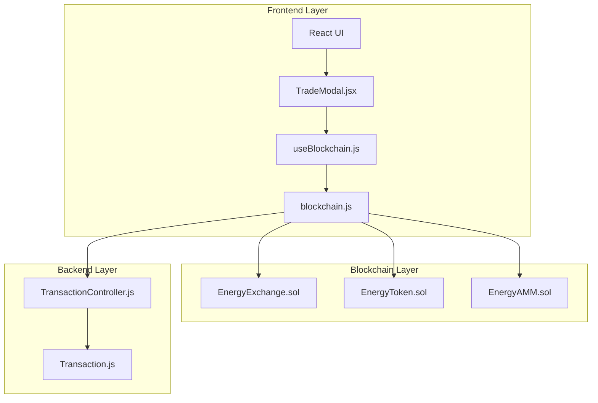
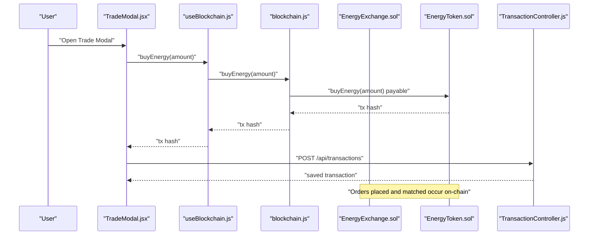
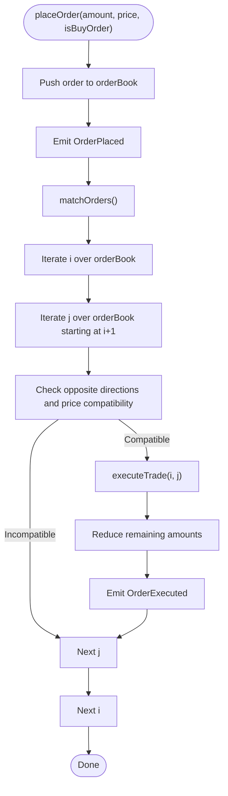
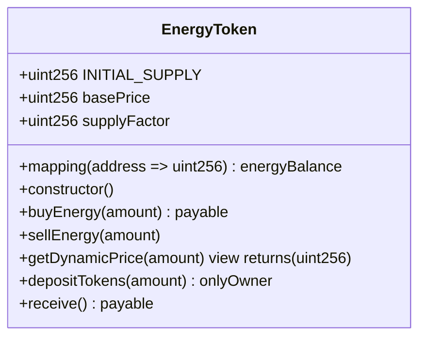
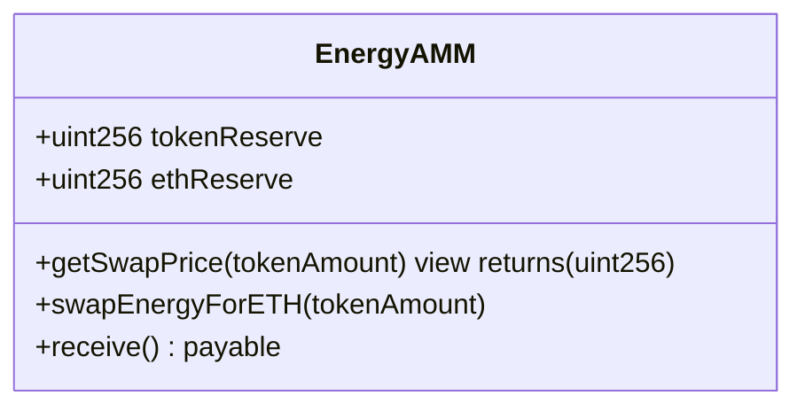
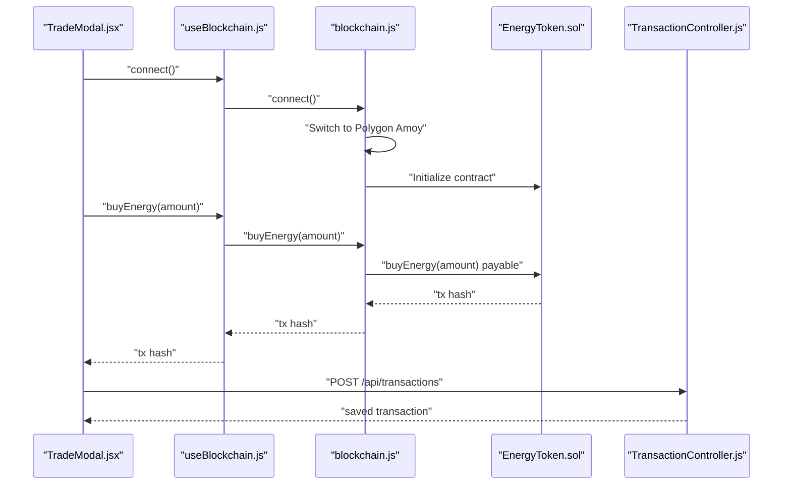
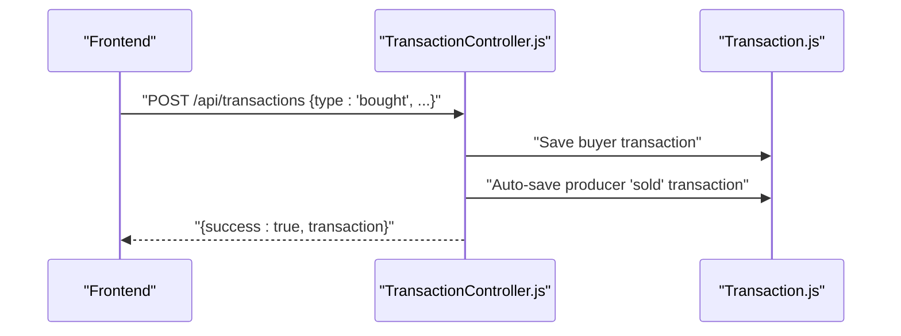
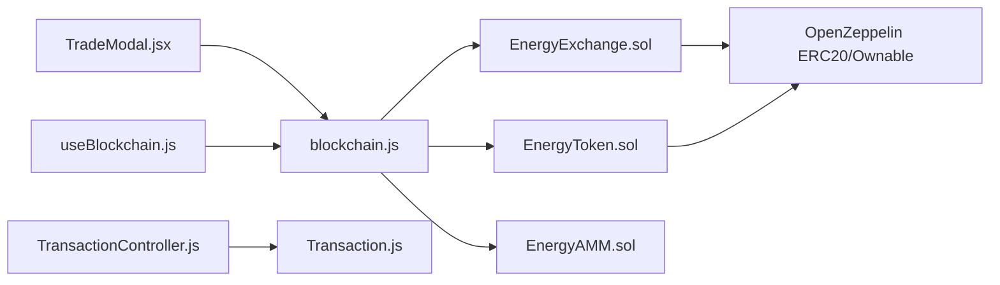

# EnergyExchange (Marketplace)

<cite>
**Referenced Files in This Document**
- [EnergyExchange.sol](file://blockchain/contracts/EnergyExchange.sol)
- [EnergyToken.sol](file://blockchain/contracts/EnergyToken.sol)
- [EnergyAMM.sol](file://blockchain/contracts/EnergyAMM.sol)
- [deploy.js](file://blockchain/scripts/deploy.js)
- [hardhat.config.js](file://blockchain/hardhat.config.js)
- [EnergyExchange.test.js](file://blockchain/test/EnergyExchange.test.js)
- [blockchain.js](file://frontend/src/services/blockchain.js)
- [useBlockchain.js](file://frontend/src/hooks/useBlockchain.js)
- [TradeModal.jsx](file://frontend/src/components/TradeModal.jsx)
- [TransactionController.js](file://backend/Controllers/TransactionController.js)
- [Transaction.js](file://backend/Models/Transaction.js)
- [README.md](file://README.md)
</cite>

## Table of Contents
1. [Introduction](#introduction)
2. [Project Structure](#project-structure)
3. [Core Components](#core-components)
4. [Architecture Overview](#architecture-overview)
5. [Detailed Component Analysis](#detailed-component-analysis)
6. [Dependency Analysis](#dependency-analysis)
7. [Performance Considerations](#performance-considerations)
8. [Troubleshooting Guide](#troubleshooting-guide)
9. [Conclusion](#conclusion)
10. [Appendices](#appendices)

## Introduction
This document provides comprehensive smart contract documentation for the EnergyExchange marketplace implementation. It explains the peer-to-peer energy trading functionality, including listing creation, order matching, and settlement processes. It documents the bid/ask order book system, price discovery mechanisms, and transaction execution logic. It also covers the escrow-like mechanics via EnergyToken, the fee structure and revenue distribution, integration with EnergyToken for payment processing, and the Oracle-like role of the AMM for liquidity and price signals. Security considerations such as front-running protection, gas optimization, and access control patterns are addressed. Practical examples illustrate marketplace operations, order lifecycle management, and settlement procedures. Finally, it documents state management, event emissions, and integration patterns with external systems.

## Project Structure
The marketplace spans three layers:
- Blockchain Layer: Solidity contracts implementing the exchange, token, and AMM.
- Frontend Layer: React UI integrating with MetaMask and interacting with contracts.
- Backend Layer: Node.js server managing user sessions, transaction records, and persistence.

**Diagram sources**
- [EnergyExchange.sol](file://blockchain/contracts/EnergyExchange.sol#L1-L45)
- [EnergyToken.sol](file://blockchain/contracts/EnergyToken.sol#L1-L55)
- [EnergyAMM.sol](file://blockchain/contracts/EnergyAMM.sol#L1-L24)
- [TradeModal.jsx](file://frontend/src/components/TradeModal.jsx#L1-L325)
- [useBlockchain.js](file://frontend/src/hooks/useBlockchain.js#L1-L155)
- [blockchain.js](file://frontend/src/services/blockchain.js#L1-L261)
- [TransactionController.js](file://backend/Controllers/TransactionController.js#L1-L68)
- [Transaction.js](file://backend/Models/Transaction.js#L1-L51)

**Section sources**
- [README.md](file://README.md#L244-L267)
- [hardhat.config.js](file://blockchain/hardhat.config.js#L1-L12)

## Core Components
- EnergyExchange: Central order book contract storing buy/sell orders and executing matches.
- EnergyToken: ERC20-based token representing energy units with dynamic pricing and balances.
- EnergyAMM: Automated Market Maker providing liquidity and swap pricing signals.

Key capabilities:
- Order book management with event-driven execution.
- Dynamic pricing for energy purchases/sales.
- Liquidity provision and swap mechanics.
- Frontend integration for seamless trading.

**Section sources**
- [EnergyExchange.sol](file://blockchain/contracts/EnergyExchange.sol#L1-L45)
- [EnergyToken.sol](file://blockchain/contracts/EnergyToken.sol#L1-L55)
- [EnergyAMM.sol](file://blockchain/contracts/EnergyAMM.sol#L1-L24)

## Architecture Overview
The marketplace architecture integrates user actions from the frontend with on-chain state transitions and persistent records in the backend.

**Diagram sources**
- [TradeModal.jsx](file://frontend/src/components/TradeModal.jsx#L1-L325)
- [useBlockchain.js](file://frontend/src/hooks/useBlockchain.js#L1-L155)
- [blockchain.js](file://frontend/src/services/blockchain.js#L1-L261)
- [EnergyExchange.sol](file://blockchain/contracts/EnergyExchange.sol#L1-L45)
- [EnergyToken.sol](file://blockchain/contracts/EnergyToken.sol#L1-L55)
- [TransactionController.js](file://backend/Controllers/TransactionController.js#L1-L68)

## Detailed Component Analysis

### EnergyExchange (Order Book and Matching)
The EnergyExchange contract implements a simple order book with:
- Order struct containing user, amount, price, and direction.
- Public order book array.
- Events for order placement and execution.

Matching logic:
- Nested loops scan the order book for compatible buy/sell pairs.
- Execution reduces remaining amounts and emits events.

**Diagram sources**
- [EnergyExchange.sol](file://blockchain/contracts/EnergyExchange.sol#L17-L43)

**Section sources**
- [EnergyExchange.sol](file://blockchain/contracts/EnergyExchange.sol#L1-L45)
- [EnergyExchange.test.js](file://blockchain/test/EnergyExchange.test.js#L27-L199)

### EnergyToken (Payment and Dynamic Pricing)
EnergyToken serves as the payment mechanism:
- ERC20 token with a name and symbol.
- Dynamic pricing based on supply/demand factors.
- Balances tracked separately from ERC20 balances.
- Buy/sell functions with ETH transfers and token movements.

**Diagram sources**
- [EnergyToken.sol](file://blockchain/contracts/EnergyToken.sol#L1-L55)

**Section sources**
- [EnergyToken.sol](file://blockchain/contracts/EnergyToken.sol#L1-L55)

### EnergyAMM (Liquidity and Price Signals)
EnergyAMM provides liquidity and price discovery:
- Reserves for tokens and ETH.
- Swap mechanics and price calculation.
- Reserve queries for monitoring.

**Diagram sources**
- [EnergyAMM.sol](file://blockchain/contracts/EnergyAMM.sol#L1-L24)

**Section sources**
- [EnergyAMM.sol](file://blockchain/contracts/EnergyAMM.sol#L1-L24)

### Frontend Integration (Trading Workflow)
The frontend integrates with MetaMask and interacts with contracts:
- Connect wallet, switch to Polygon Amoy, initialize contracts.
- Fetch balances and dynamic pricing.
- Execute buy/sell and place orders.
- Persist transactions in the backend.

**Diagram sources**
- [TradeModal.jsx](file://frontend/src/components/TradeModal.jsx#L1-L325)
- [useBlockchain.js](file://frontend/src/hooks/useBlockchain.js#L1-L155)
- [blockchain.js](file://frontend/src/services/blockchain.js#L1-L261)
- [EnergyToken.sol](file://blockchain/contracts/EnergyToken.sol#L1-L55)
- [TransactionController.js](file://backend/Controllers/TransactionController.js#L1-L68)

**Section sources**
- [TradeModal.jsx](file://frontend/src/components/TradeModal.jsx#L1-L325)
- [useBlockchain.js](file://frontend/src/hooks/useBlockchain.js#L1-L155)
- [blockchain.js](file://frontend/src/services/blockchain.js#L1-L261)

### Backend Transaction Persistence
The backend persists user transactions and mirrors sales for producers:
- Retrieve user transactions.
- Create purchase records and auto-create sale records for producers.

**Diagram sources**
- [TransactionController.js](file://backend/Controllers/TransactionController.js#L1-L68)
- [Transaction.js](file://backend/Models/Transaction.js#L1-L51)

**Section sources**
- [TransactionController.js](file://backend/Controllers/TransactionController.js#L1-L68)
- [Transaction.js](file://backend/Models/Transaction.js#L1-L51)

## Dependency Analysis
- Contracts depend on OpenZeppelin for ERC20 and ownership.
- Frontend depends on ethers.js for wallet and contract interactions.
- Backend depends on Mongoose for data modeling and persistence.

**Diagram sources**
- [EnergyExchange.sol](file://blockchain/contracts/EnergyExchange.sol#L1-L45)
- [EnergyToken.sol](file://blockchain/contracts/EnergyToken.sol#L1-L55)
- [EnergyAMM.sol](file://blockchain/contracts/EnergyAMM.sol#L1-L24)
- [blockchain.js](file://frontend/src/services/blockchain.js#L1-L261)
- [TradeModal.jsx](file://frontend/src/components/TradeModal.jsx#L1-L325)
- [useBlockchain.js](file://frontend/src/hooks/useBlockchain.js#L1-L155)
- [TransactionController.js](file://backend/Controllers/TransactionController.js#L1-L68)
- [Transaction.js](file://backend/Models/Transaction.js#L1-L51)

**Section sources**
- [EnergyExchange.sol](file://blockchain/contracts/EnergyExchange.sol#L1-L45)
- [EnergyToken.sol](file://blockchain/contracts/EnergyToken.sol#L1-L55)
- [EnergyAMM.sol](file://blockchain/contracts/EnergyAMM.sol#L1-L24)
- [blockchain.js](file://frontend/src/services/blockchain.js#L1-L261)
- [TransactionController.js](file://backend/Controllers/TransactionController.js#L1-L68)

## Performance Considerations
- Order matching complexity: The nested loop scanning is O(n^2) in the worst case. For production, consider indexing and priority queues to reduce scanning overhead.
- Gas optimization: Minimize storage writes by batching updates and avoiding redundant state reads.
- Front-running risks: The current matching algorithm executes immediately upon order placement. Introduce a batch auction or time-weighted matching to mitigate miner/front-running advantages.
- Access control: Ensure only authorized parties can modify critical parameters (e.g., supply factor, base price) in EnergyToken and owner-only functions in EnergyExchange.

[No sources needed since this section provides general guidance]

## Troubleshooting Guide
Common issues and resolutions:
- Wallet/network mismatch: Ensure the wallet is connected to Polygon Amoy and contracts are configured.
- Insufficient funds: Verify ETH balance for gas and token balance for purchases.
- Order not executing: Confirm price compatibility and sufficient amounts; check order book state.
- Transaction persistence failures: Validate backend connectivity and JWT authentication.

**Section sources**
- [blockchain.js](file://frontend/src/services/blockchain.js#L103-L130)
- [TradeModal.jsx](file://frontend/src/components/TradeModal.jsx#L184-L192)
- [EnergyExchange.test.js](file://blockchain/test/EnergyExchange.test.js#L108-L125)

## Conclusion
The EnergyExchange marketplace demonstrates a functional P2P energy trading system with an order book, dynamic pricing, and backend persistence. While the current implementation focuses on core mechanics, enhancements such as batch auctions, improved matching algorithms, and formalized fee/revenue distribution would strengthen scalability, fairness, and security.

[No sources needed since this section summarizes without analyzing specific files]

## Appendices

### Function Reference Index
- EnergyExchange
  - placeOrder(amount, price, isBuyOrder): Adds an order and triggers matching.
  - orderBook(index): Reads order details by index.
  - Events: OrderPlaced, OrderExecuted.
- EnergyToken
  - buyEnergy(amount) payable: Purchases energy tokens at dynamic price.
  - sellEnergy(amount): Sells tokens for ETH at dynamic price.
  - getDynamicPrice(amount): Computes price based on supply/demand.
  - energyBalance(address): Tracks user energy balance.
- EnergyAMM
  - getSwapPrice(tokenAmount): Returns ETH equivalent for token amount.
  - swapEnergyForETH(tokenAmount): Executes swap and updates reserves.

**Section sources**
- [EnergyExchange.sol](file://blockchain/contracts/EnergyExchange.sol#L17-L43)
- [EnergyToken.sol](file://blockchain/contracts/EnergyToken.sol#L21-L47)
- [EnergyAMM.sol](file://blockchain/contracts/EnergyAMM.sol#L8-L22)

### Practical Examples

- Placing a buy order and immediate execution:
  - Caller invokes placeOrder with amount, price, and isBuyOrder=true.
  - matchOrders scans for compatible sell orders and executes via executeTrade.
  - Emits OrderPlaced and OrderExecuted events.

- Dynamic pricing purchase:
  - Caller retrieves getDynamicPrice(amount) and calls buyEnergy(amount) with ETH value.
  - Transfers ETH to contract and mints tokens to caller.

- Producer-side sale:
  - Caller approves tokens, calls sellEnergy(amount).
  - Burns tokens and transfers ETH to caller.

- Backend transaction recording:
  - Frontend posts transaction details to backend.
  - Backend saves buyer record and auto-creates producer sale record.

**Section sources**
- [EnergyExchange.test.js](file://blockchain/test/EnergyExchange.test.js#L88-L154)
- [EnergyToken.sol](file://blockchain/contracts/EnergyToken.sol#L21-L41)
- [TransactionController.js](file://backend/Controllers/TransactionController.js#L18-L60)

### Security Considerations
- Front-running protection: Implement batch auctions or time-weighted matching to reduce miner manipulation.
- Gas optimization: Use efficient loops, minimize state writes, and avoid reentrancy.
- Access control: Restrict owner-only functions and parameter changes.
- Escrow-like mechanics: Use EnergyToken balances to track funds until settlement.

[No sources needed since this section provides general guidance]

### Deployment and Configuration
- Hardhat configuration targets Polygon Amoy testnet.
- Deployment script deploys EnergyToken, EnergyExchange, and EnergyAMM.
- Frontend requires contract addresses and network configuration.

**Section sources**
- [hardhat.config.js](file://blockchain/hardhat.config.js#L4-L11)
- [deploy.js](file://blockchain/scripts/deploy.js#L3-L24)
- [README.md](file://README.md#L251-L267)