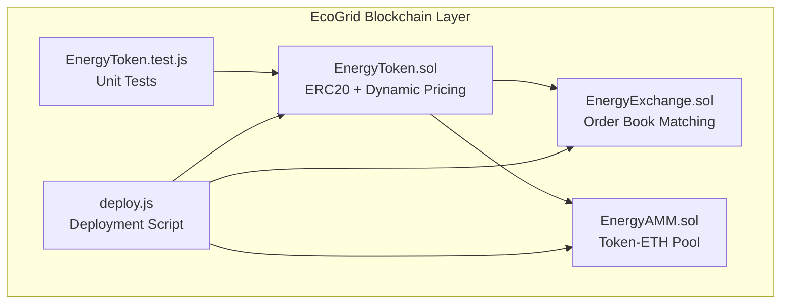
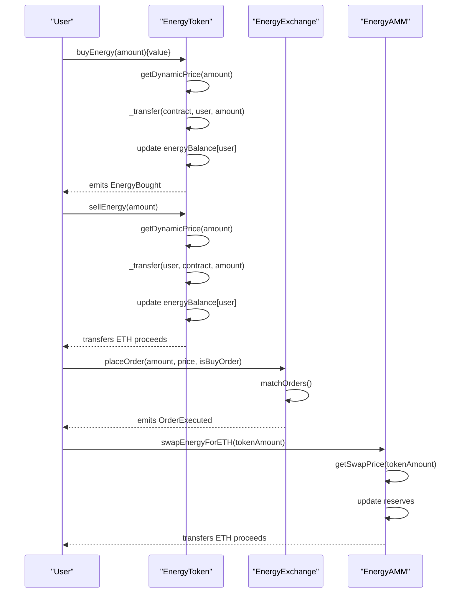
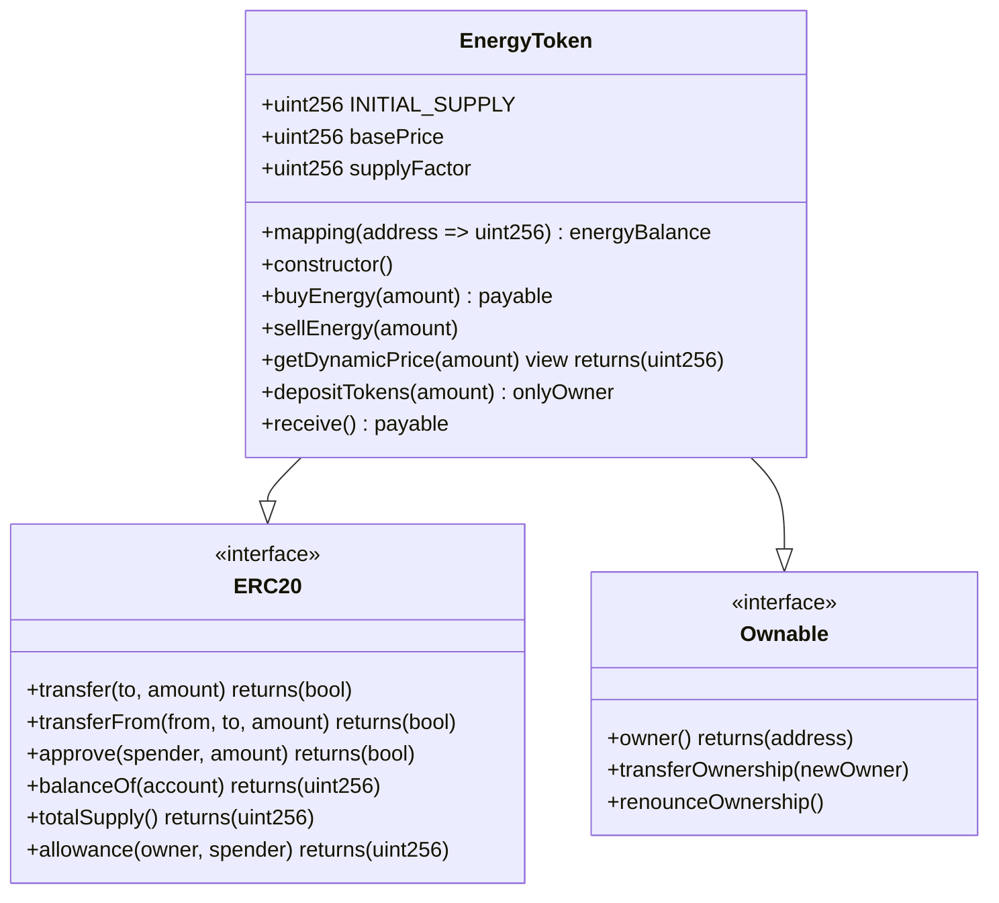
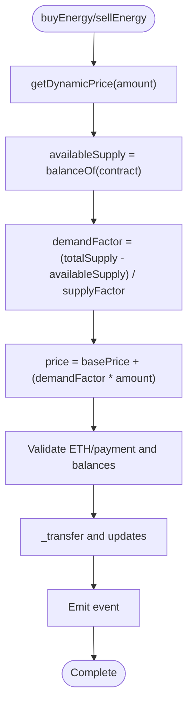
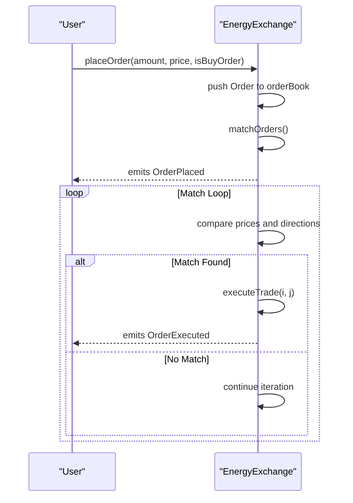
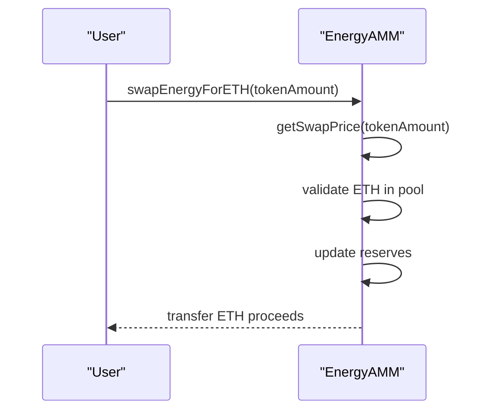
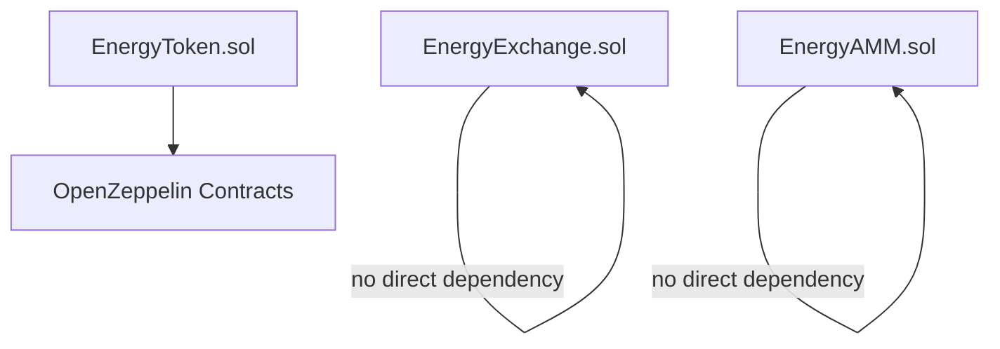

# EnergyToken (ERC20)

<cite>
**Referenced Files in This Document**
- [EnergyToken.sol](file://blockchain/contracts/EnergyToken.sol)
- [EnergyExchange.sol](file://blockchain/contracts/EnergyExchange.sol)
- [EnergyAMM.sol](file://blockchain/contracts/EnergyAMM.sol)
- [EnergyToken.test.js](file://blockchain/test/EnergyToken.test.js)
- [deploy.js](file://blockchain/scripts/deploy.js)
- [hardhat.config.js](file://blockchain/hardhat.config.js)
- [package.json](file://blockchain/package.json)
- [EnergyToken.json](file://blockchain/artifacts/contracts/EnergyToken.sol/EnergyToken.json)
</cite>

## Table of Contents
1. [Introduction](#introduction)
2. [Project Structure](#project-structure)
3. [Core Components](#core-components)
4. [Architecture Overview](#architecture-overview)
5. [Detailed Component Analysis](#detailed-component-analysis)
6. [Dependency Analysis](#dependency-analysis)
7. [Performance Considerations](#performance-considerations)
8. [Troubleshooting Guide](#troubleshooting-guide)
9. [Conclusion](#conclusion)
10. [Appendices](#appendices)

## Introduction
EnergyToken is an ERC20-compliant token designed for the EcoGrid ecosystem, enabling trading of energy credits on-chain. It integrates dynamic pricing based on supply-demand dynamics and provides specialized energy accounting alongside standard token mechanics. The contract extends OpenZeppelin's ERC20 and Ownable, offering minting, burning, and ownership controls while maintaining full ERC20 compatibility for interoperability with exchanges and AMMs.

## Project Structure
The blockchain module contains three primary smart contracts and associated testing and deployment scripts:
- EnergyToken.sol: Core ERC20 token with dynamic pricing and energy accounting
- EnergyExchange.sol: Order book matching engine for peer-to-peer energy trades
- EnergyAMM.sol: Automated Market Maker for token-ETH swaps
- Test suite validating token behavior and integration points
- Deployment script orchestrating contract deployment

**Diagram sources**
- [EnergyToken.sol](file://blockchain/contracts/EnergyToken.sol#L1-L55)
- [EnergyExchange.sol](file://blockchain/contracts/EnergyExchange.sol#L1-L45)
- [EnergyAMM.sol](file://blockchain/contracts/EnergyAMM.sol#L1-L24)
- [EnergyToken.test.js](file://blockchain/test/EnergyToken.test.js#L1-L229)
- [deploy.js](file://blockchain/scripts/deploy.js#L1-L29)

**Section sources**
- [EnergyToken.sol](file://blockchain/contracts/EnergyToken.sol#L1-L55)
- [EnergyExchange.sol](file://blockchain/contracts/EnergyExchange.sol#L1-L45)
- [EnergyAMM.sol](file://blockchain/contracts/EnergyAMM.sol#L1-L24)
- [EnergyToken.test.js](file://blockchain/test/EnergyToken.test.js#L1-L229)
- [deploy.js](file://blockchain/scripts/deploy.js#L1-L29)

## Core Components
- EnergyToken contract
  - Implements ERC20 standard with OpenZeppelin's ERC20 and Ownable
  - Provides dynamic pricing via getDynamicPrice(amount)
  - Maintains separate energyBalance mapping for user energy holdings
  - Exposes buyEnergy and sellEnergy for ETH-token exchange
  - Supports owner-only depositTokens for replenishing liquidity
- EnergyExchange contract
  - Order book with bid/ask matching logic
  - Executes trades when buy price meets sell price
- EnergyAMM contract
  - Constant product market maker for token-ETH swaps
  - Provides swapEnergyForETH with reserve-based pricing

Key ERC20 functions remain inherited from OpenZeppelin, including transfer, transferFrom, approve, balanceOf, totalSupply, and allowance.

**Section sources**
- [EnergyToken.sol](file://blockchain/contracts/EnergyToken.sol#L7-L55)
- [EnergyExchange.sol](file://blockchain/contracts/EnergyExchange.sol#L4-L45)
- [EnergyAMM.sol](file://blockchain/contracts/EnergyAMM.sol#L4-L24)
- [EnergyToken.test.js](file://blockchain/test/EnergyToken.test.js#L208-L227)

## Architecture Overview
EnergyToken operates as the central token in the EcoGrid ecosystem, integrating with external systems through:
- Dynamic pricing: price adjusts based on available supply and demand factors
- Ownership controls: owner manages token distribution and reserves
- Exchange integration: EnergyExchange enables peer-to-peer matching
- Liquidity provision: EnergyAMM provides automated liquidity for token-ETH swaps

**Diagram sources**
- [EnergyToken.sol](file://blockchain/contracts/EnergyToken.sol#L21-L47)
- [EnergyExchange.sol](file://blockchain/contracts/EnergyExchange.sol#L17-L43)
- [EnergyAMM.sol](file://blockchain/contracts/EnergyAMM.sol#L8-L20)

## Detailed Component Analysis

### EnergyToken Contract
EnergyToken extends ERC20 and Ownable, inheriting standard token mechanics and ownership controls. It introduces:
- Dynamic pricing: basePrice plus demandFactor derived from total supply and available supply
- Energy accounting: separate energyBalance mapping for user energy holdings
- Specialized functions: buyEnergy, sellEnergy, depositTokens
- Events: EnergyBought, EnergySold

**Diagram sources**
- [EnergyToken.sol](file://blockchain/contracts/EnergyToken.sol#L7-L55)
- [EnergyToken.json](file://blockchain/artifacts/contracts/EnergyToken.sol/EnergyToken.json#L300-L562)

#### Function Signatures and Behavior
- buyEnergy(uint256 amount) payable
  - Validates ETH payment covers dynamic price
  - Requires contract holds sufficient tokens
  - Transfers tokens from contract to buyer
  - Updates buyer's energyBalance
  - Emits EnergyBought event
- sellEnergy(uint256 amount)
  - Validates sender has sufficient tokens
  - Calculates dynamic price
  - Transfers tokens from sender to contract
  - Decrements sender's energyBalance
  - Transfers ETH proceeds to sender
  - Emits EnergySold event
- getDynamicPrice(uint256 amount) view
  - Computes price = basePrice + (demandFactor × amount)
  - demandFactor = (totalSupply - availableSupply) / supplyFactor
- depositTokens(uint256 amount) onlyOwner
  - Owner-only function to deposit tokens into contract
- receive() payable
  - Enables contract to accept ETH for buyEnergy

Parameter validation and return values are enforced by require statements and internal ERC20 transfers.

**Section sources**
- [EnergyToken.sol](file://blockchain/contracts/EnergyToken.sol#L21-L53)
- [EnergyToken.test.js](file://blockchain/test/EnergyToken.test.js#L83-L206)

#### Dynamic Pricing Algorithm
The dynamic pricing mechanism ensures price reflects current market conditions:
- Base price is fixed at deployment
- Supply factor determines sensitivity to demand
- Price increases with higher demand (more tokens sold) and lower available supply

**Diagram sources**
- [EnergyToken.sol](file://blockchain/contracts/EnergyToken.sol#L43-L47)

**Section sources**
- [EnergyToken.sol](file://blockchain/contracts/EnergyToken.sol#L43-L47)
- [EnergyToken.test.js](file://blockchain/test/EnergyToken.test.js#L63-L81)

### EnergyExchange Contract
EnergyExchange maintains an order book and executes trades when buy and sell orders match:
- Orders stored in array with user, amount, price, and direction
- matchOrders iterates to find compatible buy/sell pairs
- executeTrade settles matched orders and emits OrderExecuted

**Diagram sources**
- [EnergyExchange.sol](file://blockchain/contracts/EnergyExchange.sol#L17-L43)

**Section sources**
- [EnergyExchange.sol](file://blockchain/contracts/EnergyExchange.sol#L4-L45)
- [EnergyToken.test.js](file://blockchain/test/EnergyToken.test.js#L153-L206)

### EnergyAMM Contract
EnergyAMM provides automated liquidity for token-ETH swaps:
- Reserves track token and ETH balances
- getSwapPrice calculates ETH proceeds based on constant product formula
- swapEnergyForETH updates reserves and transfers ETH to user

**Diagram sources**
- [EnergyAMM.sol](file://blockchain/contracts/EnergyAMM.sol#L8-L20)

**Section sources**
- [EnergyAMM.sol](file://blockchain/contracts/EnergyAMM.sol#L4-L24)

## Dependency Analysis
EnergyToken depends on OpenZeppelin's ERC20 and Ownable for standard token functionality and ownership controls. The deployment script orchestrates deployment of all three contracts, while tests validate core token behavior and integration points.

**Diagram sources**
- [EnergyToken.sol](file://blockchain/contracts/EnergyToken.sol#L4-L5)
- [deploy.js](file://blockchain/scripts/deploy.js#L7-L23)

**Section sources**
- [EnergyToken.sol](file://blockchain/contracts/EnergyToken.sol#L4-L5)
- [deploy.js](file://blockchain/scripts/deploy.js#L1-L29)
- [package.json](file://blockchain/package.json#L5-L8)

## Performance Considerations
- Dynamic pricing computation is O(1) per transaction
- Order matching in EnergyExchange uses nested loops; complexity grows with order book size
- Reserve updates in EnergyAMM are constant-time operations
- Gas efficiency benefits from using OpenZeppelin's optimized ERC20 implementation

## Troubleshooting Guide
Common issues and resolutions:
- Insufficient ETH sent during buyEnergy: Ensure ETH value equals or exceeds computed dynamic price
- Contract lacks tokens for purchase: Owner must deposit tokens via depositTokens
- Insufficient token balance for sale: Verify user balance and energyBalance
- Order matching failures: Confirm order prices meet criteria and order book contains matching entries
- AMM liquidity exhaustion: Ensure contract holds adequate ETH for swaps

Validation and error handling are enforced through require statements and revert on failure.

**Section sources**
- [EnergyToken.sol](file://blockchain/contracts/EnergyToken.sol#L21-L47)
- [EnergyExchange.sol](file://blockchain/contracts/EnergyExchange.sol#L23-L43)
- [EnergyAMM.sol](file://blockchain/contracts/EnergyAMM.sol#L12-L20)
- [EnergyToken.test.js](file://blockchain/test/EnergyToken.test.js#L99-L123)

## Conclusion
EnergyToken provides a robust foundation for energy trading within the EcoGrid ecosystem. Its dynamic pricing model aligns incentives with supply-demand conditions, while integration with EnergyExchange and EnergyAMM ensures efficient liquidity and market-making. Ownership controls enable centralized management for grid stability, and full ERC20 compatibility facilitates broad ecosystem adoption.

## Appendices

### Security Measures
- Reentrancy protection: No explicit reentrancy guards are present; consider adding modifiers for sensitive operations
- Overflow/underflow protection: Managed by Solidity 0.8.x implicit checks and OpenZeppelin's safe math
- Access control: Ownable pattern restricts depositTokens to owner
- Event emission: Comprehensive events for transparency and off-chain indexing

### Practical Examples
- Token transfers and approvals: Verified by tests covering transfer, approve, and transferFrom
- Supply adjustments: Minting occurs at deployment; owner can deposit tokens to increase liquidity
- Dynamic pricing: Tests confirm price calculation and enforcement

**Section sources**
- [EnergyToken.test.js](file://blockchain/test/EnergyToken.test.js#L208-L227)
- [EnergyToken.sol](file://blockchain/contracts/EnergyToken.sol#L17-L18)
- [EnergyToken.sol](file://blockchain/contracts/EnergyToken.sol#L49-L51)