# Smart Contracts

<cite>
**Referenced Files in This Document**
- [EnergyToken.sol](file://blockchain/contracts/EnergyToken.sol)
- [EnergyExchange.sol](file://blockchain/contracts/EnergyExchange.sol)
- [EnergyAMM.sol](file://blockchain/contracts/EnergyAMM.sol)
- [deploy.js](file://blockchain/scripts/deploy.js)
- [EnergyToken.test.js](file://blockchain/test/EnergyToken.test.js)
- [EnergyExchange.test.js](file://blockchain/test/EnergyExchange.test.js)
- [EnergyAMM.test.js](file://blockchain/test/EnergyAMM.test.js)
- [hardhat.config.js](file://blockchain/hardhat.config.js)
- [package.json](file://blockchain/package.json)
- [ERC20.json](file://blockchain/artifacts/@openzeppelin/contracts/token/ERC20/ERC20.sol/ERC20.json)
- [Ownable.json](file://blockchain/artifacts/@openzeppelin/contracts/access/Ownable.sol/Ownable.json)
</cite>

## Table of Contents
1. [Introduction](#introduction)
2. [Project Structure](#project-structure)
3. [Core Components](#core-components)
4. [Architecture Overview](#architecture-overview)
5. [Detailed Component Analysis](#detailed-component-analysis)
6. [Dependency Analysis](#dependency-analysis)
7. [Performance Considerations](#performance-considerations)
8. [Security Considerations](#security-considerations)
9. [Practical Usage Examples](#practical-usage-examples)
10. [Troubleshooting Guide](#troubleshooting-guide)
11. [Conclusion](#conclusion)

## Introduction
This document provides comprehensive documentation for the EcoGrid smart contracts suite, focusing on:
- EnergyToken: an ERC20 token with dynamic pricing, supply management, and ownership controls
- EnergyExchange: a peer-to-peer marketplace for energy trading with order matching and settlement logic
- EnergyAMM: an automated market maker enabling liquidity provision and price discovery

It covers architecture, state management, events, access control, security considerations, and practical interaction patterns. The contracts are written in Solidity 0.8.20 and leverage OpenZeppelin’s ERC20 and Ownable modules.

## Project Structure
The blockchain module contains the three core contracts, deployment scripts, tests, and configuration:
- contracts: EnergyToken.sol, EnergyExchange.sol, EnergyAMM.sol
- scripts: deploy.js
- test: EnergyToken.test.js, EnergyExchange.test.js, EnergyAMM.test.js
- artifacts: OpenZeppelin ABI fragments for ERC20 and Ownable
- hardhat.config.js and package.json define the development environment and dependencies

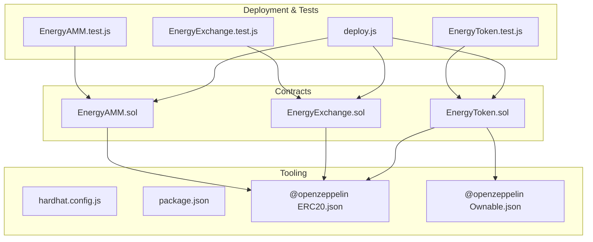

**Diagram sources**
- [EnergyToken.sol](file://blockchain/contracts/EnergyToken.sol#L1-L55)
- [EnergyExchange.sol](file://blockchain/contracts/EnergyExchange.sol#L1-L45)
- [EnergyAMM.sol](file://blockchain/contracts/EnergyAMM.sol#L1-L24)
- [deploy.js](file://blockchain/scripts/deploy.js#L1-L29)
- [EnergyToken.test.js](file://blockchain/test/EnergyToken.test.js#L1-L229)
- [EnergyExchange.test.js](file://blockchain/test/EnergyExchange.test.js#L1-L291)
- [EnergyAMM.test.js](file://blockchain/test/EnergyAMM.test.js#L1-L239)
- [hardhat.config.js](file://blockchain/hardhat.config.js#L1-L12)
- [package.json](file://blockchain/package.json#L1-L11)
- [ERC20.json](file://blockchain/artifacts/@openzeppelin/contracts/token/ERC20/ERC20.sol/ERC20.json#L1-L200)
- [Ownable.json](file://blockchain/artifacts/@openzeppelin/contracts/access/Ownable.sol/Ownable.json#L1-L86)

**Section sources**
- [hardhat.config.js](file://blockchain/hardhat.config.js#L1-L12)
- [package.json](file://blockchain/package.json#L1-L11)

## Core Components
- EnergyToken (ERC20 + Ownable)
  - Dynamic pricing based on available supply and demand factors
  - Supply management via owner-only token deposits
  - Dual balance tracking: token balance and “energy balance”
  - Events: EnergyBought, EnergySold
- EnergyExchange (pure Solidity)
  - Order book with buy/sell orders
  - Automatic matching and partial fills
  - Events: OrderPlaced, OrderExecuted
- EnergyAMM (pure Solidity)
  - Constant product market maker with token and ETH reserves
  - Swap function for token-to-ETH conversion
  - Events: none (external observers track ETH transfers)

Key implementation references:
- EnergyToken constructor, dynamic pricing, buy/sell, owner-only deposit, receive fallback
- EnergyExchange order placement, matching loop, execution
- EnergyAMM reserves, swap pricing, swap execution

**Section sources**
- [EnergyToken.sol](file://blockchain/contracts/EnergyToken.sol#L1-L55)
- [EnergyExchange.sol](file://blockchain/contracts/EnergyExchange.sol#L1-L45)
- [EnergyAMM.sol](file://blockchain/contracts/EnergyAMM.sol#L1-L24)

## Architecture Overview
The contracts operate independently but integrate through tokenization of energy credits:
- EnergyToken represents tradable energy units with dynamic valuation
- EnergyExchange enables peer-to-peer matching of buy/sell orders
- EnergyAMM provides liquidity and price discovery via a constant-product formula

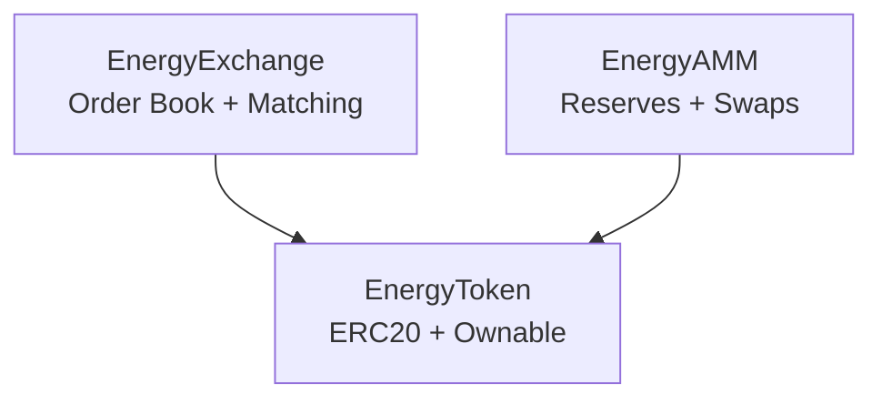

**Diagram sources**
- [EnergyToken.sol](file://blockchain/contracts/EnergyToken.sol#L7-L55)
- [EnergyExchange.sol](file://blockchain/contracts/EnergyExchange.sol#L4-L45)
- [EnergyAMM.sol](file://blockchain/contracts/EnergyAMM.sol#L4-L24)

## Detailed Component Analysis

### EnergyToken Contract
EnergyToken extends OpenZeppelin’s ERC20 and Ownable to provide:
- Token mechanics: name, symbol, total supply, transfers, approvals
- Ownership: owner-only functions (deposit tokens)
- Dynamic pricing: price derived from base price, supply factor, and demand
- Dual balances: token balance and “energy balance” for accounting

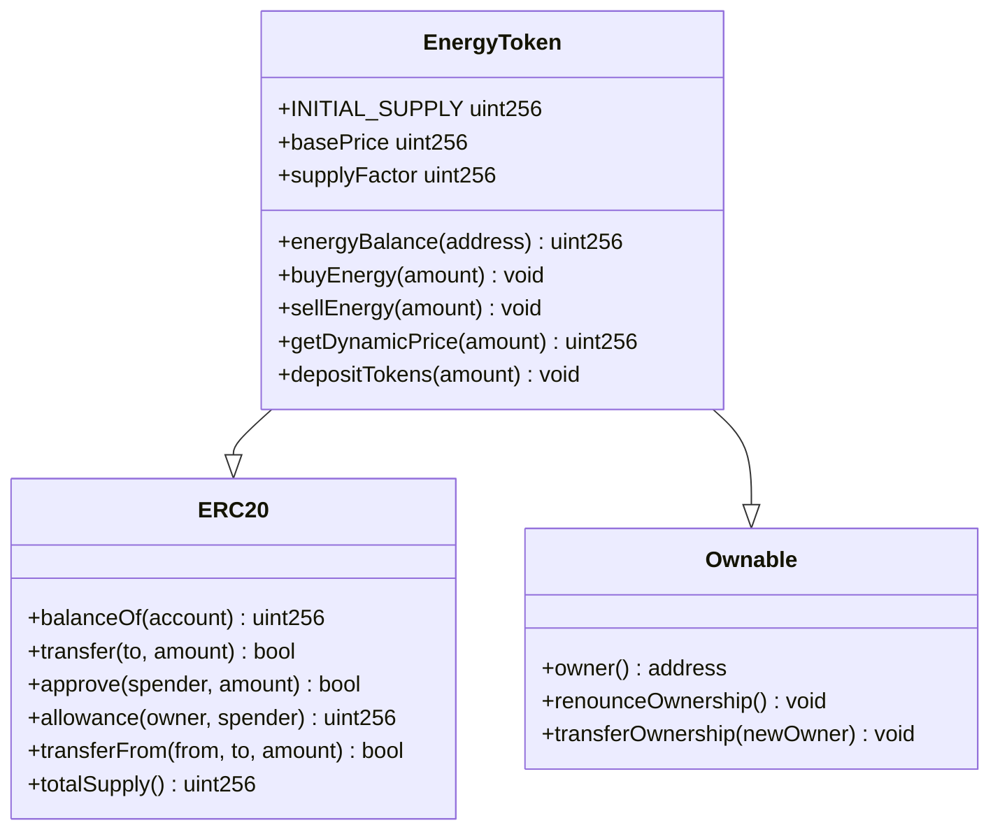

**Diagram sources**
- [EnergyToken.sol](file://blockchain/contracts/EnergyToken.sol#L7-L55)
- [ERC20.json](file://blockchain/artifacts/@openzeppelin/contracts/token/ERC20/ERC20.sol/ERC20.json#L142-L200)
- [Ownable.json](file://blockchain/artifacts/@openzeppelin/contracts/access/Ownable.sol/Ownable.json#L47-L86)

Key functions and events:
- Constructor mints initial supply to deployer
- buyEnergy(amount): validates ETH payment, checks contract token balance, transfers tokens to buyer, updates buyer’s energy balance, emits EnergyBought
- sellEnergy(amount): validates sender tokens, transfers tokens to contract, updates sender’s energy balance, sends ETH proceeds, emits EnergySold
- getDynamicPrice(amount): computes price using basePrice plus a demand factor derived from supply utilization and supplyFactor
- depositTokens(amount): owner-only function to top up contract token inventory
- receive(): payable fallback to accept ETH

Access control:
- Ownable modifier restricts depositTokens to owner

Events:
- EnergyBought(buyer, amount, price)
- EnergySold(seller, amount, price)

State variables:
- basePrice, supplyFactor, energyBalance mapping, inherited ERC20 state

Operational flow (buy):

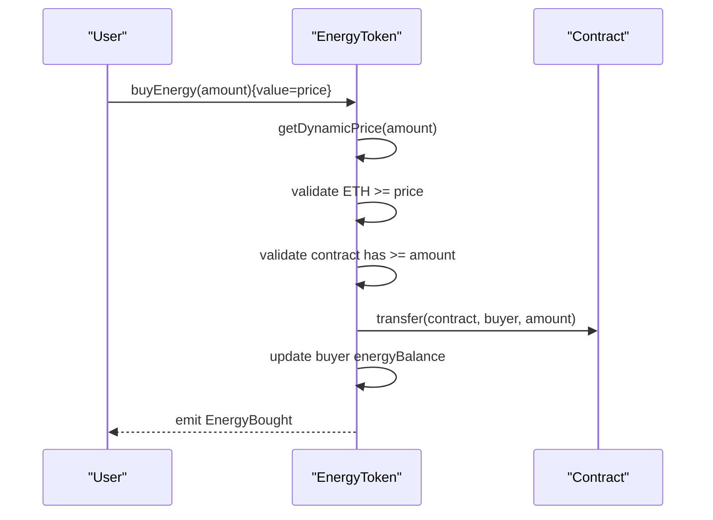

**Diagram sources**
- [EnergyToken.sol](file://blockchain/contracts/EnergyToken.sol#L21-L30)

Operational flow (sell):

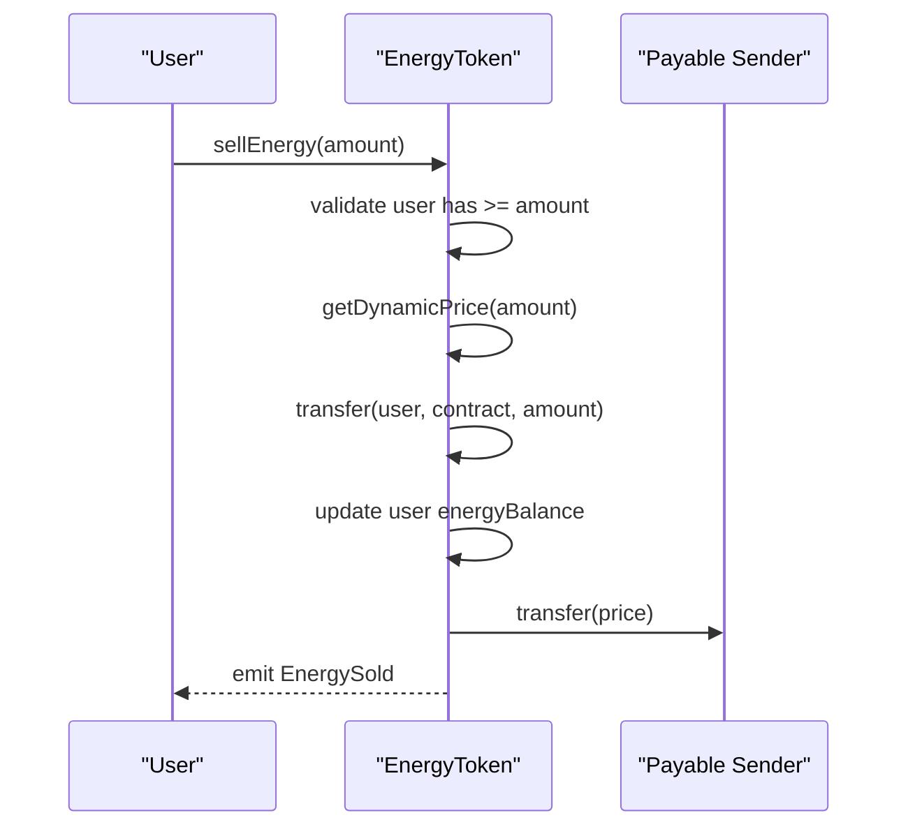

**Diagram sources**
- [EnergyToken.sol](file://blockchain/contracts/EnergyToken.sol#L32-L41)

Dynamic pricing algorithm:

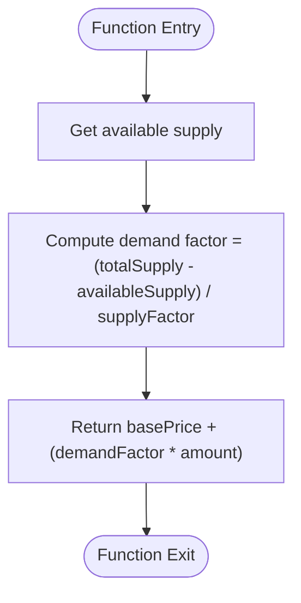

**Diagram sources**
- [EnergyToken.sol](file://blockchain/contracts/EnergyToken.sol#L43-L47)

**Section sources**
- [EnergyToken.sol](file://blockchain/contracts/EnergyToken.sol#L7-L55)
- [ERC20.json](file://blockchain/artifacts/@openzeppelin/contracts/token/ERC20/ERC20.sol/ERC20.json#L142-L200)
- [Ownable.json](file://blockchain/artifacts/@openzeppelin/contracts/access/Ownable.sol/Ownable.json#L47-L86)

### EnergyExchange Contract
EnergyExchange maintains an order book and executes trades automatically upon order placement.

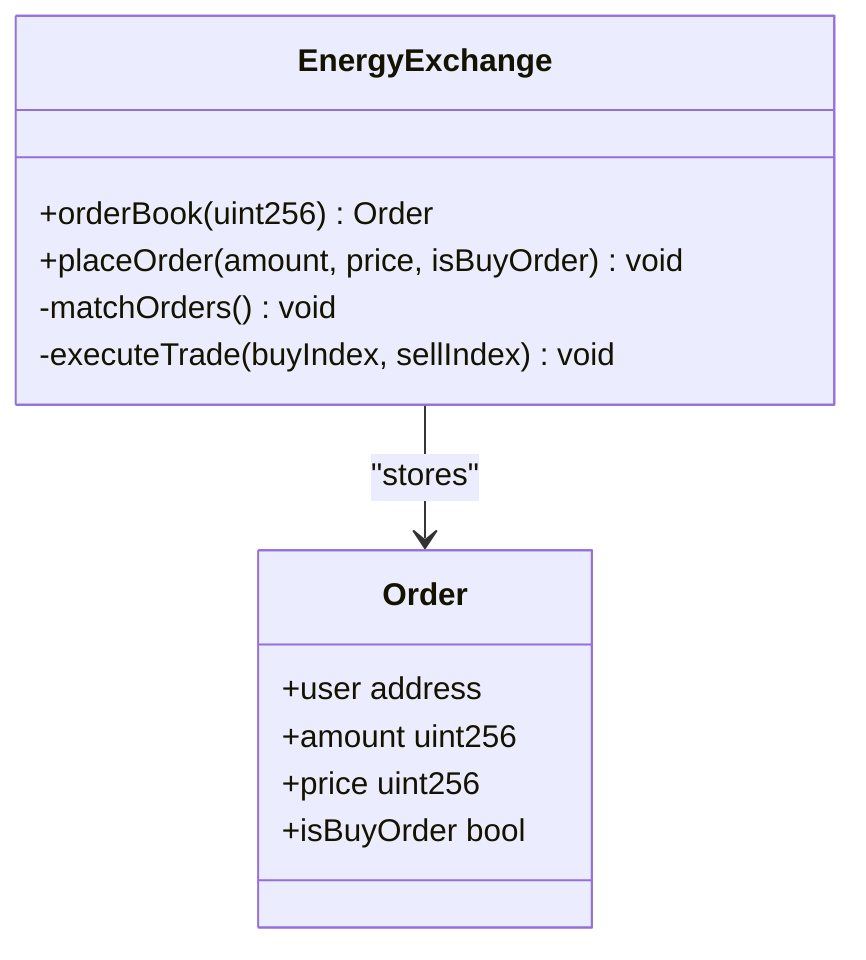

**Diagram sources**
- [EnergyExchange.sol](file://blockchain/contracts/EnergyExchange.sol#L4-L45)

Order placement and matching:
- placeOrder pushes a new Order into orderBook and triggers matchOrders
- matchOrders scans the orderBook for compatible buy/sell pairs and executes trades
- executeTrade reduces matched amounts and emits OrderExecuted

Matching logic:

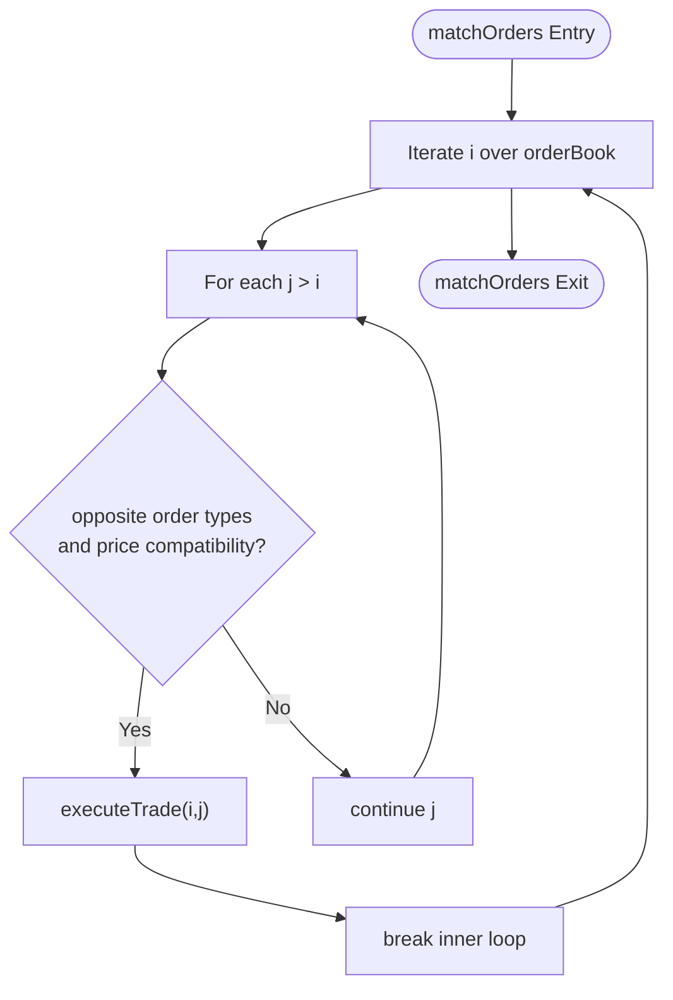

**Diagram sources**
- [EnergyExchange.sol](file://blockchain/contracts/EnergyExchange.sol#L23-L32)

Events:
- OrderPlaced(user, amount, price, isBuyOrder)
- OrderExecuted(buyer, seller, amount, price)

**Section sources**
- [EnergyExchange.sol](file://blockchain/contracts/EnergyExchange.sol#L4-L45)

### EnergyAMM Contract
EnergyAMM implements a constant product market maker with separate token and ETH reserves.

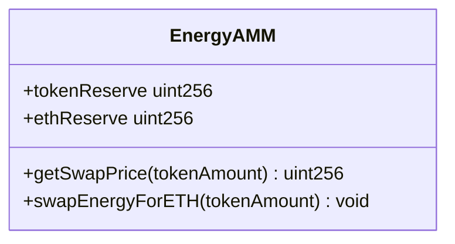

**Diagram sources**
- [EnergyAMM.sol](file://blockchain/contracts/EnergyAMM.sol#L4-L24)

Swap mechanics:
- getSwapPrice(tokenAmount) = (ethReserve * tokenAmount) / tokenReserve
- swapEnergyForETH(tokenAmount):
  - Computes ethAmount from getSwapPrice
  - Validates pool has sufficient ETH
  - Updates reserves
  - Transfers ETH to user

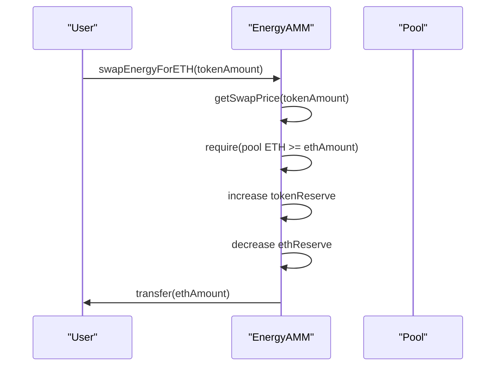

**Diagram sources**
- [EnergyAMM.sol](file://blockchain/contracts/EnergyAMM.sol#L12-L20)

**Section sources**
- [EnergyAMM.sol](file://blockchain/contracts/EnergyAMM.sol#L4-L24)

## Dependency Analysis
- OpenZeppelin dependencies:
  - ERC20: provides standard token semantics (transfers, approvals, allowances)
  - Ownable: provides owner-only access control and ownership transfer
- Hardhat toolchain:
  - Hardhat and @nomicfoundation/hardhat-toolbox for compilation and testing
  - dotenv for environment configuration
- Network configuration targets Polygon Amoy via environment variables

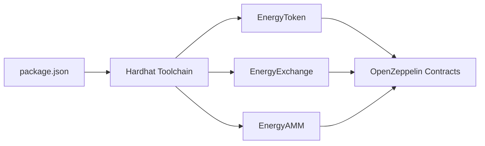

**Diagram sources**
- [package.json](file://blockchain/package.json#L1-L11)
- [hardhat.config.js](file://blockchain/hardhat.config.js#L1-L12)
- [EnergyToken.sol](file://blockchain/contracts/EnergyToken.sol#L4-L5)
- [EnergyExchange.sol](file://blockchain/contracts/EnergyExchange.sol#L1-L3)
- [EnergyAMM.sol](file://blockchain/contracts/EnergyAMM.sol#L1-L3)

**Section sources**
- [package.json](file://blockchain/package.json#L1-L11)
- [hardhat.config.js](file://blockchain/hardhat.config.js#L1-L12)

## Performance Considerations
- EnergyExchange matching complexity:
  - Current nested loop scanning increases time complexity; consider indexing or priority queues for large order books
- EnergyToken dynamic pricing:
  - Computation is O(1); minimal gas overhead
- EnergyAMM:
  - Constant-time swap calculations with straightforward reserve updates
- Reserve sizing:
  - Ensure adequate ETH reserve to avoid frequent reverts during swaps

[No sources needed since this section provides general guidance]

## Security Considerations
- Reentrancy protection:
  - No reentrant calls observed in current flows; ensure future upgrades avoid callbacks to untrusted addresses
- Overflow/underflow:
  - Solidity 0.8.x guards against arithmetic overflows/underflows; validated by tests
- Access control:
  - depositTokens restricted to owner via Ownable
- ETH safety:
  - EnergyToken.sellEnergy uses low-level transfer; ensure contract holds sufficient ETH
  - EnergyAMM.swapEnergyForETH validates pool ETH availability
- Event-driven auditing:
  - All major actions emit events for off-chain monitoring

**Section sources**
- [EnergyToken.sol](file://blockchain/contracts/EnergyToken.sol#L49-L53)
- [EnergyAMM.sol](file://blockchain/contracts/EnergyAMM.sol#L14-L15)
- [EnergyToken.test.js](file://blockchain/test/EnergyToken.test.js#L184-L194)
- [EnergyAMM.test.js](file://blockchain/test/EnergyAMM.test.js#L112-L123)

## Practical Usage Examples
- Deploying contracts:
  - Use the provided Hardhat script to deploy all three contracts on the configured network
  - Verify deployed addresses printed by the script
- Interacting with EnergyToken:
  - Mint initial supply to owner
  - Owner deposits tokens into contract for selling
  - Users buy energy by sending ETH; sellers receive ETH after token transfers
- Interacting with EnergyExchange:
  - Place buy/sell orders; matching occurs immediately
  - Observe OrderPlaced and OrderExecuted events
- Interacting with EnergyAMM:
  - Send ETH to the pool contract to fund reserves
  - Swap tokens for ETH using swapEnergyForETH

Deployment and initialization:
- Deploy script deploys EnergyToken, EnergyExchange, and EnergyAMM
- Funding ETH to EnergyAMM is required for swaps

**Section sources**
- [deploy.js](file://blockchain/scripts/deploy.js#L3-L24)
- [EnergyToken.test.js](file://blockchain/test/EnergyToken.test.js#L12-L17)
- [EnergyExchange.test.js](file://blockchain/test/EnergyExchange.test.js#L13-L18)
- [EnergyAMM.test.js](file://blockchain/test/EnergyAMM.test.js#L13-L23)

## Troubleshooting Guide
- Insufficient ETH for purchase:
  - buyEnergy requires exact or greater ETH; ensure msg.value matches computed price
- Contract lacks tokens for sale:
  - sellEnergy fails if contract balance is insufficient; owner must deposit tokens
- Pool ETH shortage:
  - swapEnergyForETH reverts if ETH reserve is insufficient; fund the pool
- Unauthorized operations:
  - depositTokens reverts for non-owners; verify ownership

Common failure scenarios and validations are covered by unit tests.

**Section sources**
- [EnergyToken.test.js](file://blockchain/test/EnergyToken.test.js#L99-L123)
- [EnergyToken.test.js](file://blockchain/test/EnergyToken.test.js#L184-L194)
- [EnergyAMM.test.js](file://blockchain/test/EnergyAMM.test.js#L112-L123)

## Conclusion
The EcoGrid smart contracts establish a cohesive ecosystem for energy trading:
- EnergyToken provides a dynamic, transparent energy-backed ERC20
- EnergyExchange enables efficient peer-to-peer matching
- EnergyAMM offers liquidity and automated price discovery

With OpenZeppelin’s battle-tested modules and comprehensive test coverage, the contracts are well-positioned for secure and reliable operation. Future enhancements could focus on scaling EnergyExchange and adding advanced governance features.