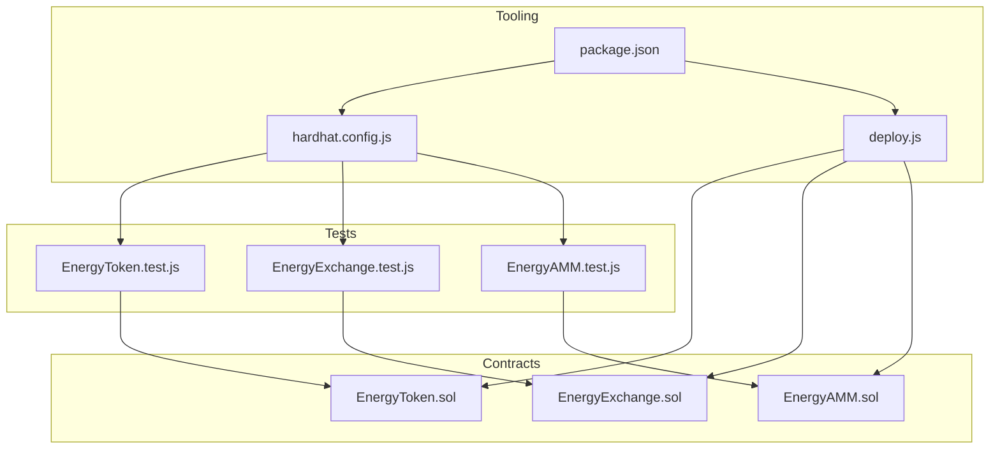
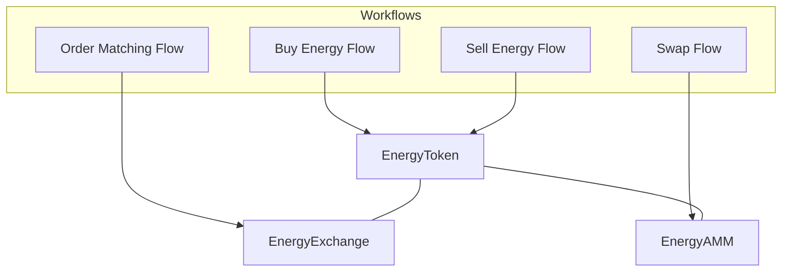
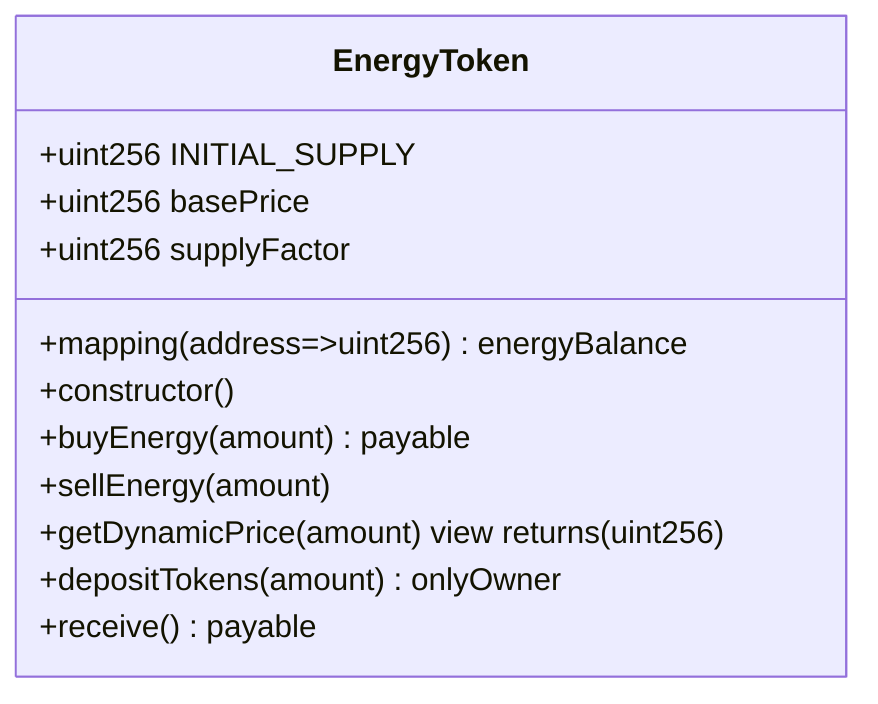
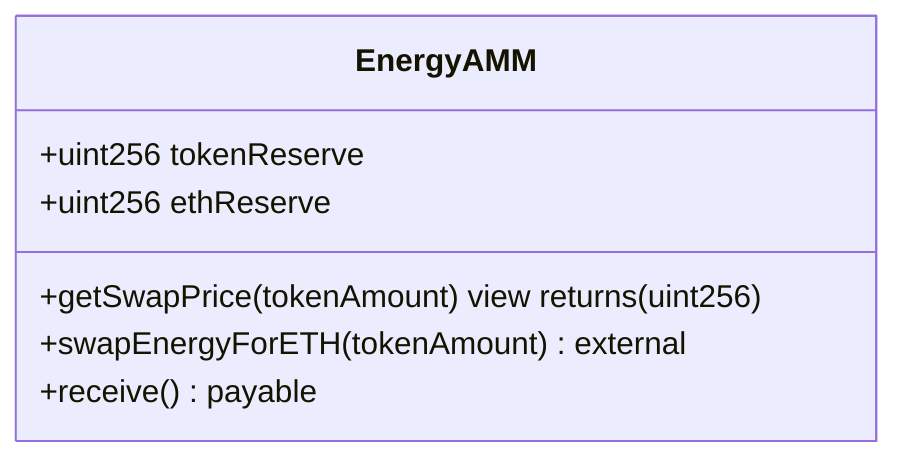
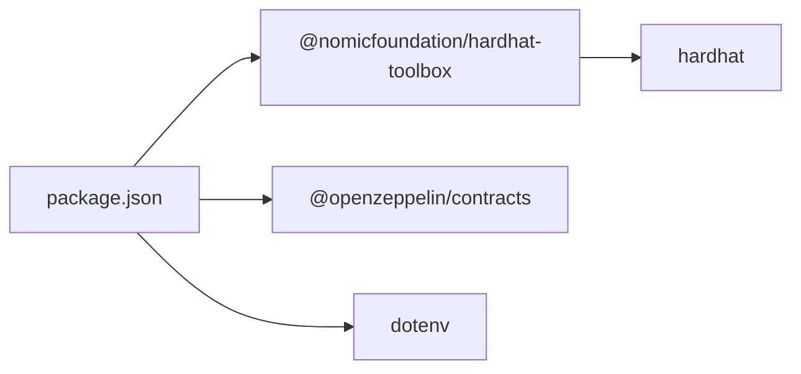

# Testing & Security

<cite>
**Referenced Files in This Document**
- [EnergyToken.sol](file://blockchain/contracts/EnergyToken.sol)
- [EnergyExchange.sol](file://blockchain/contracts/EnergyExchange.sol)
- [EnergyAMM.sol](file://blockchain/contracts/EnergyAMM.sol)
- [EnergyToken.test.js](file://blockchain/test/EnergyToken.test.js)
- [EnergyExchange.test.js](file://blockchain/test/EnergyExchange.test.js)
- [EnergyAMM.test.js](file://blockchain/test/EnergyAMM.test.js)
- [hardhat.config.js](file://blockchain/hardhat.config.js)
- [deploy.js](file://blockchain/scripts/deploy.js)
- [package.json](file://blockchain/package.json)
- [README.md](file://blockchain/README.md)
</cite>

## Table of Contents
1. [Introduction](#introduction)
2. [Project Structure](#project-structure)
3. [Core Components](#core-components)
4. [Architecture Overview](#architecture-overview)
5. [Detailed Component Analysis](#detailed-component-analysis)
6. [Dependency Analysis](#dependency-analysis)
7. [Performance Considerations](#performance-considerations)
8. [Security Considerations](#security-considerations)
9. [Testing Strategy](#testing-strategy)
10. [Debugging Tools and Techniques](#debugging-tools-and-techniques)
11. [Continuous Integration Patterns](#continuous-integration-patterns)
12. [Troubleshooting Guide](#troubleshooting-guide)
13. [Conclusion](#conclusion)

## Introduction
This document provides comprehensive testing and security guidance for the EcoGrid blockchain system. It covers the testing strategy for smart contracts, including unit tests, integration tests, and end-to-end workflow tests. It documents the test suite implementation for EnergyToken, EnergyExchange, and EnergyAMM liquidity mechanics. It also outlines security considerations such as reentrancy, gas optimization, overflow/underflow protection, and access control, along with the security audit process and best practices for DeFi smart contract development. Finally, it describes debugging tools, gas optimization strategies, and continuous integration patterns tailored for blockchain development.

## Project Structure
The blockchain module contains three core smart contracts and corresponding Hardhat-based test suites. Contracts are located under the contracts directory, while tests reside under the test directory. Hardhat configuration defines network settings and Solidity compiler options. Deployment scripts orchestrate contract deployment.



**Diagram sources**
- [EnergyToken.sol](file://blockchain/contracts/EnergyToken.sol#L1-L55)
- [EnergyExchange.sol](file://blockchain/contracts/EnergyExchange.sol#L1-L45)
- [EnergyAMM.sol](file://blockchain/contracts/EnergyAMM.sol#L1-L24)
- [EnergyToken.test.js](file://blockchain/test/EnergyToken.test.js#L1-L229)
- [EnergyExchange.test.js](file://blockchain/test/EnergyExchange.test.js#L1-L291)
- [EnergyAMM.test.js](file://blockchain/test/EnergyAMM.test.js#L1-L239)
- [hardhat.config.js](file://blockchain/hardhat.config.js#L1-L12)
- [deploy.js](file://blockchain/scripts/deploy.js#L1-L29)
- [package.json](file://blockchain/package.json#L1-L11)

**Section sources**
- [EnergyToken.sol](file://blockchain/contracts/EnergyToken.sol#L1-L55)
- [EnergyExchange.sol](file://blockchain/contracts/EnergyExchange.sol#L1-L45)
- [EnergyAMM.sol](file://blockchain/contracts/EnergyAMM.sol#L1-L24)
- [EnergyToken.test.js](file://blockchain/test/EnergyToken.test.js#L1-L229)
- [EnergyExchange.test.js](file://blockchain/test/EnergyExchange.test.js#L1-L291)
- [EnergyAMM.test.js](file://blockchain/test/EnergyAMM.test.js#L1-L239)
- [hardhat.config.js](file://blockchain/hardhat.config.js#L1-L12)
- [deploy.js](file://blockchain/scripts/deploy.js#L1-L29)
- [package.json](file://blockchain/package.json#L1-L11)

## Core Components
This section summarizes the responsibilities and key mechanisms of each core contract.

- EnergyToken
  - ERC20-compliant token with dynamic pricing for buying/selling energy.
  - Owner-only capability to deposit tokens into the contract.
  - Dynamic pricing formula considers base price, supply factor, and available supply.
  - Events emitted for buy/sell actions.

- EnergyExchange
  - Order-book matching engine for peer-to-peer trades.
  - Orders stored in memory; matching occurs immediately upon placing an order.
  - Enforces compatibility of opposite order types and price thresholds.

- EnergyAMM
  - Constant-product market maker with token and ETH reserves.
  - Calculates swap price via reserve ratios and transfers ETH to users.
  - Requires sufficient ETH liquidity in the pool for swaps.

**Section sources**
- [EnergyToken.sol](file://blockchain/contracts/EnergyToken.sol#L7-L55)
- [EnergyExchange.sol](file://blockchain/contracts/EnergyExchange.sol#L4-L45)
- [EnergyAMM.sol](file://blockchain/contracts/EnergyAMM.sol#L4-L24)

## Architecture Overview
The system comprises three interconnected components: a token with dynamic pricing, an order-matching exchange, and an AMM liquidity pool. Tests exercise deployment, state transitions, event emission, and edge cases across all components.



**Diagram sources**
- [EnergyToken.sol](file://blockchain/contracts/EnergyToken.sol#L21-L41)
- [EnergyExchange.sol](file://blockchain/contracts/EnergyExchange.sol#L17-L32)
- [EnergyAMM.sol](file://blockchain/contracts/EnergyAMM.sol#L8-L20)

## Detailed Component Analysis

### EnergyToken Analysis
Key behaviors:
- Dynamic pricing based on circulating supply and configurable factors.
- Buy/sell operations update both token balances and an internal energy balance mapping.
- Owner-only deposit function to replenish the contract’s token inventory.
- Receive fallback to accept ETH payments.



**Diagram sources**
- [EnergyToken.sol](file://blockchain/contracts/EnergyToken.sol#L7-L55)

**Section sources**
- [EnergyToken.sol](file://blockchain/contracts/EnergyToken.sol#L7-L55)
- [EnergyToken.test.js](file://blockchain/test/EnergyToken.test.js#L4-L229)

### EnergyExchange Analysis
Key behaviors:
- Stores orders in a single array with user, amount, price, and type.
- Immediately attempts to match newly placed orders against existing ones.
- Executes partial fills when buy/sell amounts differ.
- Prevents matching two orders of the same type.

```mermaid
classDiagram
class EnergyExchange {
+struct Order {
+address user
+uint256 amount
+uint256 price
+bool isBuyOrder
}
+Order[] orderBook
+placeOrder(amount, price, isBuyOrder)
-matchOrders() internal
-executeTrade(buyIndex, sellIndex) internal
}
```

**Diagram sources**
- [EnergyExchange.sol](file://blockchain/contracts/EnergyExchange.sol#L4-L45)

**Section sources**
- [EnergyExchange.sol](file://blockchain/contracts/EnergyExchange.sol#L4-L45)
- [EnergyExchange.test.js](file://blockchain/test/EnergyExchange.test.js#L4-L291)

### EnergyAMM Analysis
Key behaviors:
- Maintains token and ETH reserves with a constant product invariant implicitly enforced by swap logic.
- Swap price computed from reserve ratios; ETH transferred to user.
- Reserve updates occur after successful swaps; pool must contain sufficient ETH.



**Diagram sources**
- [EnergyAMM.sol](file://blockchain/contracts/EnergyAMM.sol#L4-L24)

**Section sources**
- [EnergyAMM.sol](file://blockchain/contracts/EnergyAMM.sol#L4-L24)
- [EnergyAMM.test.js](file://blockchain/test/EnergyAMM.test.js#L4-L239)

## Dependency Analysis
External dependencies and tooling:
- Hardhat and Hardhat Toolbox for compilation, testing, and deployment.
- OpenZeppelin contracts for ERC20 and access control.
- Environment variables for network configuration and private keys.



**Diagram sources**
- [package.json](file://blockchain/package.json#L1-L11)

**Section sources**
- [package.json](file://blockchain/package.json#L1-L11)
- [hardhat.config.js](file://blockchain/hardhat.config.js#L1-L12)

## Performance Considerations
- Gas optimization strategies
  - Minimize state writes in loops; batch operations where possible.
  - Use efficient data structures (arrays vs. mappings) judiciously; consider indexing patterns.
  - Avoid redundant balance checks; leverage require conditions early to short-circuit.
  - Prefer pure view functions for calculations to reduce on-chain costs.
  - Use assembly only when it demonstrably reduces gas and improves readability.
- Cost management
  - Estimate gas limits per transaction; monitor gasUsed in tests to detect regressions.
  - Optimize for frequent operations (e.g., swap price calculation) by caching derived values off-chain.
  - Consider batching multiple swaps or trades to amortize overhead.

[No sources needed since this section provides general guidance]

## Security Considerations
- Reentrancy attacks
  - Ensure atomic state changes in external calls; avoid calling untrusted external functions before state updates.
  - For ETH transfers, prefer safe transfer patterns and validate balances before releasing funds.
- Gas optimization
  - Use unchecked arithmetic carefully; prefer SafeMath or Solidity 0.8+ implicit under/overflow protection.
  - Limit dynamic gas consumption by avoiding nested loops over unbounded arrays.
- Overflow/underflow protection
  - Solidity 0.8+ provides compile-time checks; still validate inputs and intermediate calculations.
- Access control vulnerabilities
  - Restrict owner-only functions; verify modifiers and roles carefully.
  - Avoid relying solely on msg.sender for permissions; enforce explicit role checks.
- Additional DeFi-specific risks
  - Front-running: Use commit-reveal patterns or pre-commits for sensitive operations.
  - Flash loans: Ensure invariant checks and pause mechanisms for critical paths.
  - Fee theft: Validate fee calculations and cap fees to prevent manipulation.
- Security audit process
  - Perform static analysis with multiple tools; review critical paths and assumptions.
  - Conduct manual code walkthroughs for complex flows (matching engine, AMM math).
  - Run fuzzing campaigns targeting edge cases (zero amounts, large numbers, rapid fire orders).
  - Establish a bug bounty program and maintain a responsible disclosure policy.
- Best practices
  - Favor immutable infrastructure for pools; enable upgrades only via governance.
  - Keep upgradeable contracts minimal; separate logic from storage.
  - Use timelocks for sensitive operations; employ multisig for owner key management.

[No sources needed since this section provides general guidance]

## Testing Strategy
- Unit tests
  - Focus on isolated contract logic: pricing formulas, order matching rules, and reserve updates.
  - Validate preconditions and postconditions for each function.
- Integration tests
  - Orchestrate multi-contract interactions: token purchases affecting AMM liquidity and exchange matching.
  - Simulate realistic sequences: buy tokens, deposit into exchange, place orders, execute trades.
- End-to-end workflow tests
  - Model complete user journeys: mint tokens, stake liquidity, trade, and withdraw proceeds.
  - Include failure scenarios: insufficient funds, insufficient liquidity, invalid parameters.
- Test coverage targets
  - Aim for >90% statement coverage; prioritize critical paths and branching conditions.
  - Include property-based tests for large/small amounts and extreme values.

**Section sources**
- [EnergyToken.test.js](file://blockchain/test/EnergyToken.test.js#L4-L229)
- [EnergyExchange.test.js](file://blockchain/test/EnergyExchange.test.js#L4-L291)
- [EnergyAMM.test.js](file://blockchain/test/EnergyAMM.test.js#L4-L239)

## Debugging Tools and Techniques
- Hardhat console logging
  - Use console.log in Solidity via Hardhat’s built-in logger to trace execution paths during tests and deployments.
- Transaction tracing
  - Inspect transaction receipts for logs and gas usage; correlate emitted events with state changes.
- State inspection
  - Query contract state before and after operations; compare expected vs. actual balances and reserves.
- Local network debugging
  - Run a local Hardhat node; fork mainnet/testnet to reproduce production-like environments.
- Static analysis
  - Integrate tools like Slither or Mythril to detect common vulnerabilities and anomalies.

[No sources needed since this section provides general guidance]

## Continuous Integration Patterns
- Automated testing
  - Run Hardhat tests on pull requests; gate merges on passing tests and coverage thresholds.
- Linting and formatting
  - Enforce Solidity and JavaScript style standards; automate checks in CI.
- Deployment safety
  - Require manual approval for deployments; use deterministic deployment scripts and verify artifacts.
- Environment parity
  - Use environment variables for network configuration; keep secrets out of repositories.
- Reporting
  - Publish test reports and gas usage metrics; track regressions over time.

**Section sources**
- [hardhat.config.js](file://blockchain/hardhat.config.js#L1-L12)
- [deploy.js](file://blockchain/scripts/deploy.js#L1-L29)

## Troubleshooting Guide
Common issues and resolutions:
- Deployment failures
  - Verify network URL and private key environment variables; ensure adequate funding for gas.
- Test failures
  - Confirm initial state setup (reserves, balances); check event parsing and log filtering.
- Gas estimation errors
  - Adjust gas limits; inspect gasUsed in receipts; optimize hot paths.
- Network connectivity
  - Validate RPC endpoints; retry transient failures; use fallback providers.

**Section sources**
- [README.md](file://blockchain/README.md#L1-L1)
- [hardhat.config.js](file://blockchain/hardhat.config.js#L7-L10)
- [EnergyAMM.test.js](file://blockchain/test/EnergyAMM.test.js#L112-L123)

## Conclusion
The EcoGrid blockchain system includes robust unit and integration tests for EnergyToken, EnergyExchange, and EnergyAMM. By adhering to security best practices, implementing comprehensive testing strategies, leveraging debugging tools, and establishing CI patterns, the system can achieve reliability, transparency, and resilience. Regular audits, property-based testing, and careful gas optimization will further strengthen the platform for real-world DeFi operations.