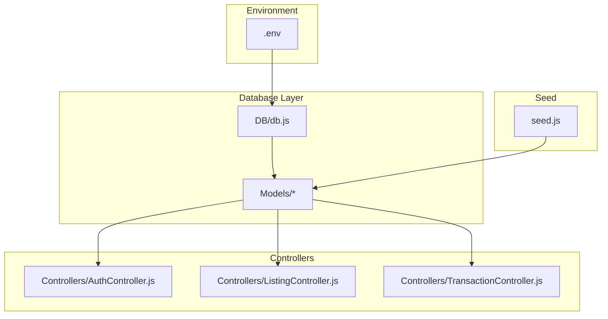
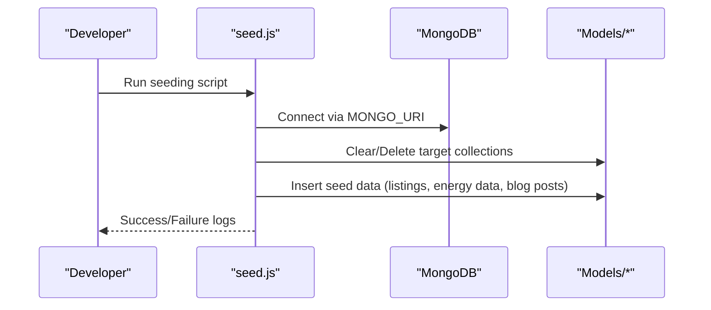
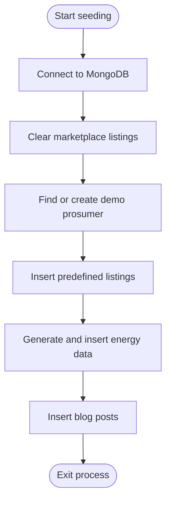
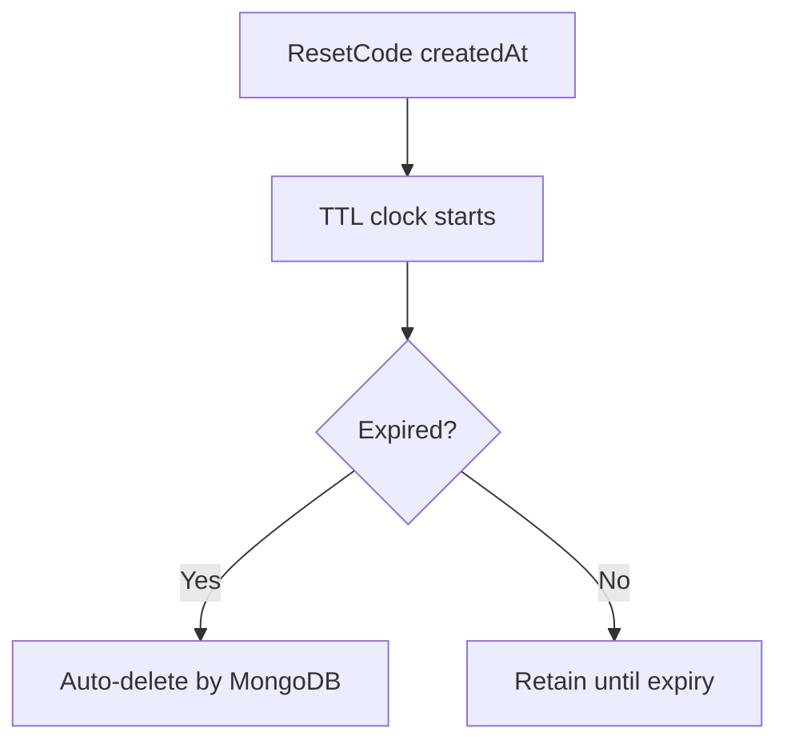
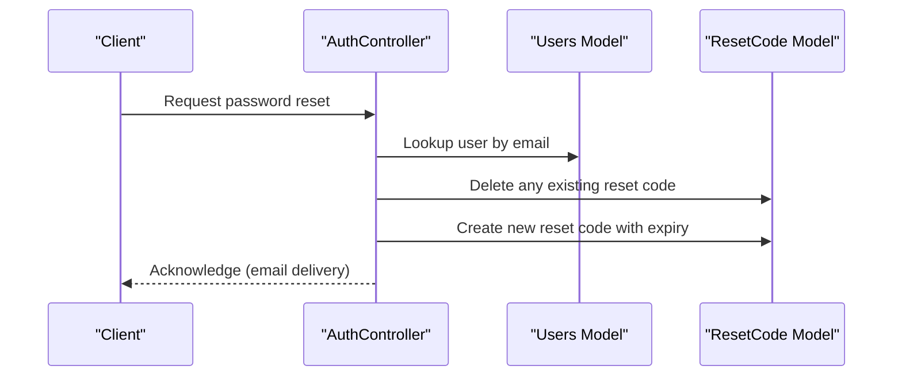
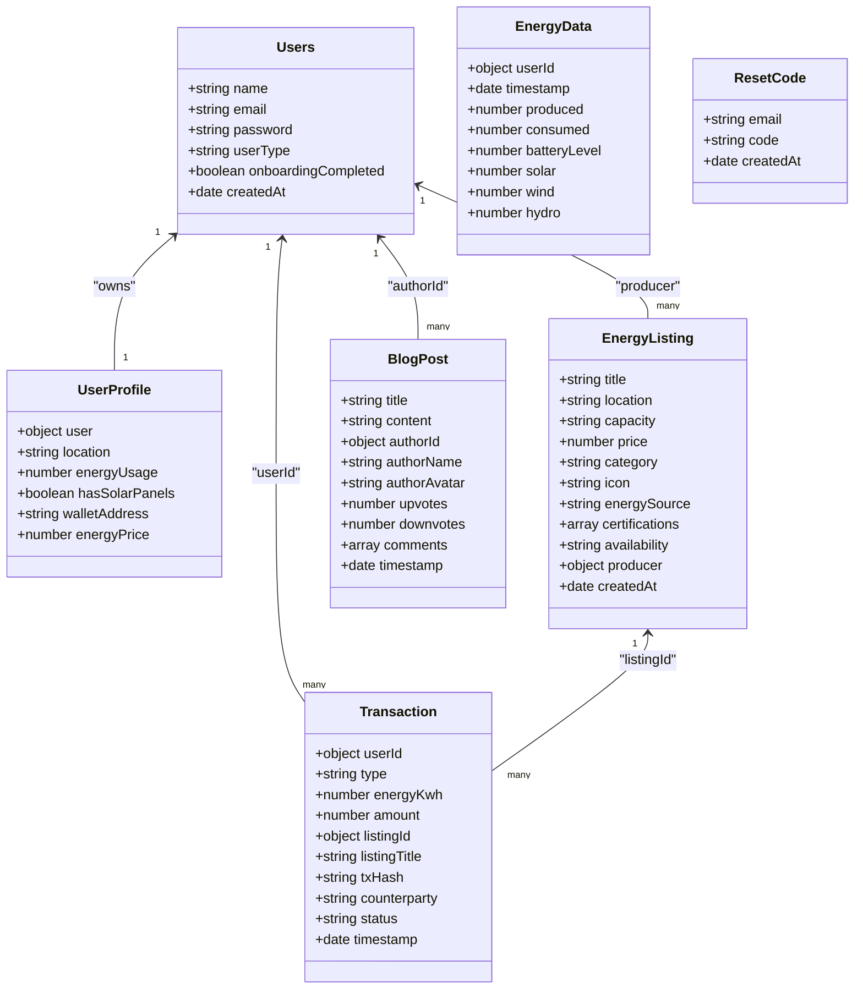

# Data Management and Lifecycle

<cite>
**Referenced Files in This Document**
- [seed.js](file://backend/seed.js)
- [db.js](file://backend/DB/db.js)
- [Users.js](file://backend/Models/Users.js)
- [UserProfile.js](file://backend/Models/UserProfile.js)
- [googleuser.js](file://backend/Models/googleuser.js)
- [EnergyData.js](file://backend/Models/EnergyData.js)
- [EnergyListing.js](file://backend/Models/EnergyListing.js)
- [Transaction.js](file://backend/Models/Transaction.js)
- [ResetCode.js](file://backend/Models/ResetCode.js)
- [BlogPost.js](file://backend/Models/BlogPost.js)
- [AuthController.js](file://backend/Controllers/AuthController.js)
- [TransactionController.js](file://backend/Controllers/TransactionController.js)
- [ListingController.js](file://backend/Controllers/ListingController.js)
- [.env](file://backend/.env)
</cite>

## Table of Contents
1. [Introduction](#introduction)
2. [Project Structure](#project-structure)
3. [Core Components](#core-components)
4. [Architecture Overview](#architecture-overview)
5. [Detailed Component Analysis](#detailed-component-analysis)
6. [Dependency Analysis](#dependency-analysis)
7. [Performance Considerations](#performance-considerations)
8. [Troubleshooting Guide](#troubleshooting-guide)
9. [Conclusion](#conclusion)
10. [Appendices](#appendices)

## Introduction
This document describes data management and lifecycle practices for the EcoGrid MongoDB implementation. It covers:
- Data seeding for development and testing
- Data retention and cleanup policies
- Backup and restore procedures
- Data export and migration strategies
- Archiving patterns for compliance and performance
- Bulk operations, validation, and error handling

## Project Structure
The data layer centers around Mongoose models and controllers that manage users, energy data, marketplace listings, transactions, and reset codes. Environment variables define connection and third-party integrations.

**Diagram sources**
- [db.js](file://backend/DB/db.js#L1-L12)
- [seed.js](file://backend/seed.js#L1-L169)
- [AuthController.js](file://backend/Controllers/AuthController.js#L1-L482)
- [ListingController.js](file://backend/Controllers/ListingController.js#L1-L253)
- [TransactionController.js](file://backend/Controllers/TransactionController.js#L1-L68)
- [.env](file://backend/.env#L1-L13)

**Section sources**
- [db.js](file://backend/DB/db.js#L1-L12)
- [seed.js](file://backend/seed.js#L1-L169)
- [.env](file://backend/.env#L1-L13)

## Core Components
- Users and Profiles: User identity, roles, onboarding state, and profile metadata.
- EnergyData: Historical energy production/consumption metrics with timestamps.
- EnergyListing: Marketplace items with producer linkage and availability.
- Transaction: Buy/sell records with counters and blockchain hash linkage.
- ResetCode: Temporary password reset codes with automatic expiry.
- BlogPost: Community content with comments and voting metadata.

Key model attributes and relationships are defined in the referenced files.

**Section sources**
- [Users.js](file://backend/Models/Users.js#L1-L32)
- [UserProfile.js](file://backend/Models/UserProfile.js#L1-L37)
- [googleuser.js](file://backend/Models/googleuser.js#L1-L33)
- [EnergyData.js](file://backend/Models/EnergyData.js#L1-L43)
- [EnergyListing.js](file://backend/Models/EnergyListing.js#L1-L56)
- [Transaction.js](file://backend/Models/Transaction.js#L1-L51)
- [ResetCode.js](file://backend/Models/ResetCode.js#L1-L23)
- [BlogPost.js](file://backend/Models/BlogPost.js#L1-L73)

## Architecture Overview
The backend connects to MongoDB via Mongoose, exposes REST endpoints for authentication, marketplace, and transactions, and seeds development data.

**Diagram sources**
- [seed.js](file://backend/seed.js#L12-L169)
- [.env](file://backend/.env#L2-L2)

**Section sources**
- [seed.js](file://backend/seed.js#L1-L169)
- [.env](file://backend/.env#L1-L13)

## Detailed Component Analysis

### Data Seeding for Development and Testing
Purpose:
- Initialize marketplace listings owned by a demo prosumer.
- Populate dashboard energy charts with synthetic data.
- Seed community blog posts for content pages.

Process:
- Connect to MongoDB using the environment-provided URI.
- Clear existing marketplace listings while preserving user accounts.
- Create or reuse a prosumer account for ownership.
- Insert predefined energy listings.
- Generate and insert synthetic energy data points.
- Seed blog posts with authors and comments.

Operational notes:
- The script exits after seeding completes.
- Errors are logged and cause process termination.

**Diagram sources**
- [seed.js](file://backend/seed.js#L17-L169)

**Section sources**
- [seed.js](file://backend/seed.js#L1-L169)

### Data Retention Policies
Retention scope and rationale:
- EnergyData: Short-term operational insights; keep recent windows for dashboards.
- Transactions: Audit trail and analytics; maintain historical records.
- User profiles and identities: Long-term for continuity and compliance.
- ResetCodes: Very short-lived (auto-expire) to minimize risk.
- Blog posts and comments: Content retention aligned with platform policy.

Retention strategy:
- Enforce TTL-based expiration for reset codes.
- Maintain soft-deletion or archival for compliance-sensitive data.
- Archive older energy data to cold storage tiers for cost optimization.

**Section sources**
- [ResetCode.js](file://backend/Models/ResetCode.js#L14-L18)

### Automated Cleanup Procedures
Cleanup mechanisms:
- Reset codes: Automatic expiry via TTL index configured at the schema level.
- Temporary session data: Managed by JWT expiry; no server-side cleanup required.
- Stale marketplace listings: Manual moderation; consider adding status transitions and scheduled cleanup jobs for inactive producers.

**Diagram sources**
- [ResetCode.js](file://backend/Models/ResetCode.js#L14-L18)

**Section sources**
- [ResetCode.js](file://backend/Models/ResetCode.js#L1-L23)

### Backup and Restore Procedures
Backup:
- Use MongoDB Atlas backup (recommended for hosted clusters) or mongodump for self-managed deployments.
- Schedule periodic snapshots for production.

Restore:
- Use mongorestore to recover from backups.
- Validate restored data integrity and re-run seeding for dev/test environments.

[No sources needed since this section provides general guidance]

### Data Export Capabilities
Export options:
- Bulk export of collections for analytics or migration using aggregation pipelines.
- CSV exports for reporting via controller endpoints or batch jobs.
- Incremental exports keyed by timestamps for delta synchronization.

[No sources needed since this section provides general guidance]

### Migration Strategies for Schema Changes
Approach:
- Use Mongoose schema versioning and controlled rollout.
- Backfill new fields for existing documents.
- Validate data post-migration and monitor query performance.

[No sources needed since this section provides general guidance]

### Archiving Patterns for Compliance and Performance
Archival:
- Move older EnergyData entries to archive collections or external storage.
- Maintain immutable copies for regulatory audits.
- Compress and partition archived data by date.

Performance:
- Use capped collections or time-series collections for high-volume telemetry.
- Apply indexing on frequently queried fields (timestamps, userId, listingId).

[No sources needed since this section provides general guidance]

### Bulk Operations
Examples:
- Insert many energy data points for dashboard initialization.
- Insert multiple marketplace listings for seeding.
- Batch updates for listing status or user profile adjustments.

Guidance:
- Use insertMany for seeding and batch inserts.
- Use bulkWrite for mixed upserts and deletes.

**Section sources**
- [seed.js](file://backend/seed.js#L126-L139)
- [seed.js](file://backend/seed.js#L142-L159)

### Data Validation Processes
Validation points:
- Authentication endpoints validate inputs and enforce reCAPTCHA.
- User registration ensures unique email and required fields.
- Transaction creation normalizes numeric fields and sets defaults.
- Listing creation validates ownership and populates producer info.

**Diagram sources**
- [AuthController.js](file://backend/Controllers/AuthController.js#L271-L335)
- [ResetCode.js](file://backend/Models/ResetCode.js#L1-L23)

**Section sources**
- [AuthController.js](file://backend/Controllers/AuthController.js#L10-L101)
- [AuthController.js](file://backend/Controllers/AuthController.js#L271-L381)
- [TransactionController.js](file://backend/Controllers/TransactionController.js#L19-L67)

### Error Handling During Data Management Operations
Patterns:
- Centralized try/catch blocks in controllers.
- Graceful degradation for optional features (e.g., socket events).
- Idempotent operations for reset codes and transactions.

Common scenarios:
- Duplicate user registration handled by unique email checks.
- Expired or invalid reset codes rejected with clear messages.
- Ownership checks prevent unauthorized listing modifications.

**Section sources**
- [AuthController.js](file://backend/Controllers/AuthController.js#L49-L101)
- [AuthController.js](file://backend/Controllers/AuthController.js#L337-L381)
- [ListingController.js](file://backend/Controllers/ListingController.js#L102-L157)
- [TransactionController.js](file://backend/Controllers/TransactionController.js#L1-L68)

## Dependency Analysis
Relationships among models and controllers:

**Diagram sources**
- [Users.js](file://backend/Models/Users.js#L1-L32)
- [UserProfile.js](file://backend/Models/UserProfile.js#L1-L37)
- [EnergyListing.js](file://backend/Models/EnergyListing.js#L1-L56)
- [EnergyData.js](file://backend/Models/EnergyData.js#L1-L43)
- [Transaction.js](file://backend/Models/Transaction.js#L1-L51)
- [ResetCode.js](file://backend/Models/ResetCode.js#L1-L23)
- [BlogPost.js](file://backend/Models/BlogPost.js#L1-L73)

**Section sources**
- [Users.js](file://backend/Models/Users.js#L1-L32)
- [EnergyListing.js](file://backend/Models/EnergyListing.js#L1-L56)
- [Transaction.js](file://backend/Models/Transaction.js#L1-L51)
- [EnergyData.js](file://backend/Models/EnergyData.js#L1-L43)
- [ResetCode.js](file://backend/Models/ResetCode.js#L1-L23)
- [BlogPost.js](file://backend/Models/BlogPost.js#L1-L73)

## Performance Considerations
- Indexing: Add compound indexes on timestamps and foreign keys (userId, listingId) to optimize queries.
- Aggregation: Use pipeline stages for analytics (e.g., prosumer sales) to reduce client-side computation.
- Pagination: Limit and sort results for listing and transaction retrieval.
- TTL: Rely on built-in TTL for reset codes; avoid manual cleanup overhead.

[No sources needed since this section provides general guidance]

## Troubleshooting Guide
Common issues and resolutions:
- Connection failures: Verify MONGO_URI and network access.
- Email delivery errors: Confirm EMAIL_* credentials and service configuration.
- Reset code invalid/expired: Ensure TTL is active and client handles expiry gracefully.
- Transaction creation anomalies: Validate numeric conversions and listing ownership.

**Section sources**
- [db.js](file://backend/DB/db.js#L1-L12)
- [.env](file://backend/.env#L5-L8)
- [AuthController.js](file://backend/Controllers/AuthController.js#L271-L335)
- [TransactionController.js](file://backend/Controllers/TransactionController.js#L19-L67)

## Conclusion
EcoGrid’s data lifecycle is designed for rapid development with robust operational safeguards. Seeding streamlines onboarding, TTL-based cleanup minimizes maintenance, and modular controllers enable scalable growth. Adopt the recommended practices for backups, exports, migrations, and archiving to meet compliance and performance goals.

## Appendices

### Environment Variables Reference
- MONGO_URI: MongoDB connection string.
- JWT_SECRET: Secret for signing tokens.
- EMAIL_*: Nodemailer configuration for password reset emails.
- RECAPTCHA_SECRET_KEY: For reCAPTCHA verification.
- GOOGLE_CLIENT_ID/SECRET: For Google OAuth.

**Section sources**
- [.env](file://backend/.env#L1-L13)