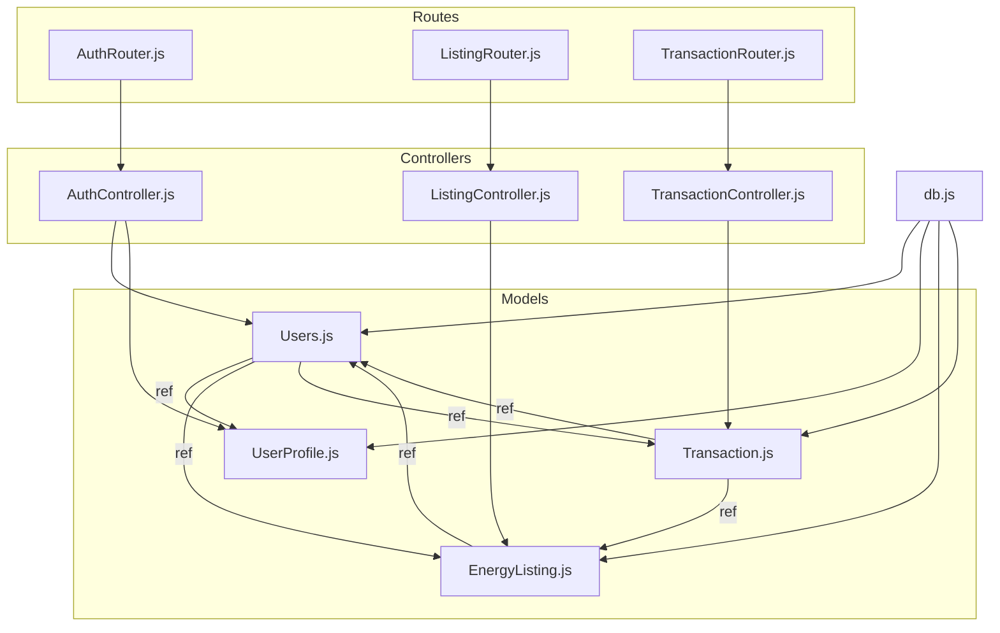
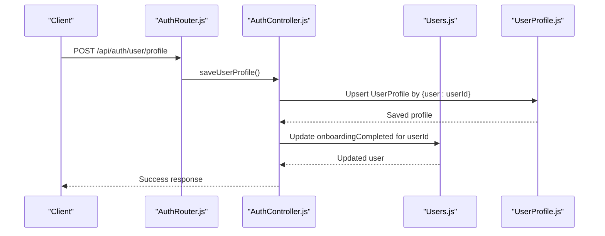
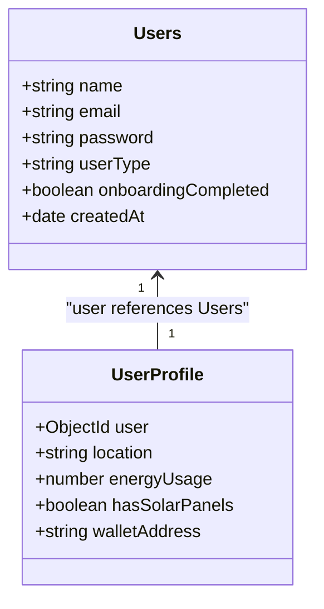
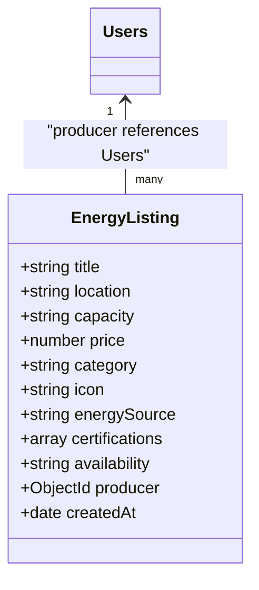
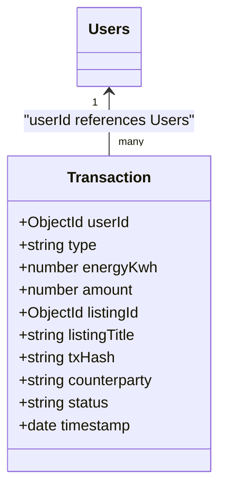
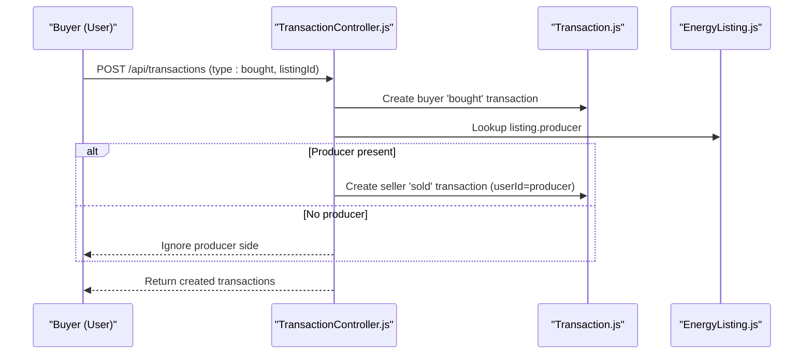
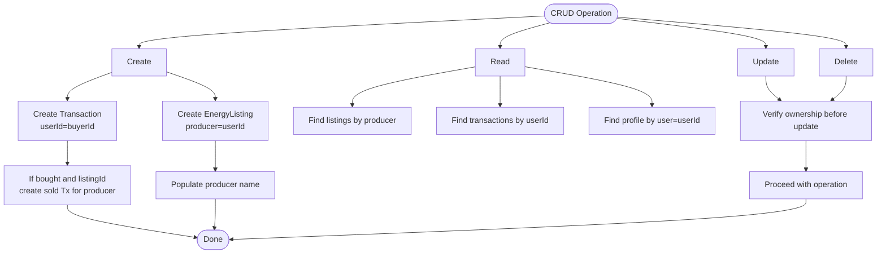
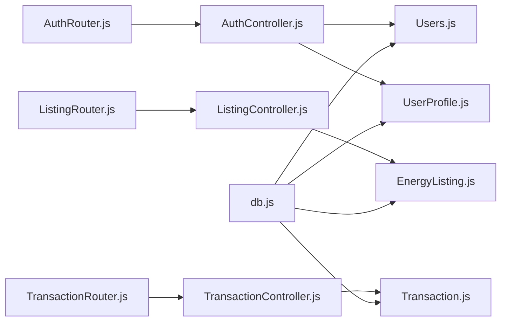

# Data Relationships and Associations

<cite>
**Referenced Files in This Document**
- [Users.js](file://backend/Models/Users.js)
- [UserProfile.js](file://backend/Models/UserProfile.js)
- [EnergyListing.js](file://backend/Models/EnergyListing.js)
- [Transaction.js](file://backend/Models/Transaction.js)
- [AuthController.js](file://backend/Controllers/AuthController.js)
- [ListingController.js](file://backend/Controllers/ListingController.js)
- [TransactionController.js](file://backend/Controllers/TransactionController.js)
- [AuthRouter.js](file://backend/Routes/AuthRouter.js)
- [ListingRouter.js](file://backend/Routes/ListingRouter.js)
- [TransactionRouter.js](file://backend/Routes/TransactionRouter.js)
- [db.js](file://backend\DB\db.js)
</cite>

## Table of Contents
1. [Introduction](#introduction)
2. [Project Structure](#project-structure)
3. [Core Components](#core-components)
4. [Architecture Overview](#architecture-overview)
5. [Detailed Component Analysis](#detailed-component-analysis)
6. [Dependency Analysis](#dependency-analysis)
7. [Performance Considerations](#performance-considerations)
8. [Troubleshooting Guide](#troubleshooting-guide)
9. [Conclusion](#conclusion)

## Introduction
This document explains the data relationships and associations among MongoDB collections in the EcoGrid platform. It focuses on:
- One-to-one relationship between Users and UserProfile
- One-to-many relationships between Users and EnergyListings, and between Users and Transactions
- Many-to-many relationship facilitated by the Transaction schema for EnergyListings
- Foreign key references, embedded document patterns, and hybrid approaches
- Relationship mapping during CRUD operations
- Referential integrity constraints and cascading operations
- Query patterns for joining related data and performance implications
- Data consistency and eventual consistency patterns in the distributed system

## Project Structure
The data model layer is organized around Mongoose models under backend/Models, controllers under backend/Controllers, and route definitions under backend/Routes. Authentication, marketplace listings, and transactions are the primary domains covered here.

**Diagram sources**
- [Users.js](file://backend/Models/Users.js#L1-L32)
- [UserProfile.js](file://backend/Models/UserProfile.js#L1-L31)
- [EnergyListing.js](file://backend/Models/EnergyListing.js#L1-L56)
- [Transaction.js](file://backend/Models/Transaction.js#L1-L51)
- [AuthController.js](file://backend/Controllers/AuthController.js#L1-L482)
- [ListingController.js](file://backend/Controllers/ListingController.js#L1-L253)
- [TransactionController.js](file://backend/Controllers/TransactionController.js#L1-L68)
- [AuthRouter.js](file://backend/Routes/AuthRouter.js#L1-L15)
- [ListingRouter.js](file://backend/Routes/ListingRouter.js#L1-L24)
- [TransactionRouter.js](file://backend/Routes/TransactionRouter.js#L1-L11)
- [db.js](file://backend\DB\db.js#L1-L12)

**Section sources**
- [Users.js](file://backend/Models/Users.js#L1-L32)
- [UserProfile.js](file://backend/Models/UserProfile.js#L1-L31)
- [EnergyListing.js](file://backend/Models/EnergyListing.js#L1-L56)
- [Transaction.js](file://backend/Models/Transaction.js#L1-L51)
- [AuthRouter.js](file://backend/Routes/AuthRouter.js#L1-L15)
- [ListingRouter.js](file://backend/Routes/ListingRouter.js#L1-L24)
- [TransactionRouter.js](file://backend/Routes/TransactionRouter.js#L1-L11)
- [db.js](file://backend\DB\db.js#L1-L12)

## Core Components
- Users: Core identity and authentication entity with user type and onboarding flag.
- UserProfile: One-to-one profile linked via ObjectId reference to Users.
- EnergyListing: Market item created by a User (producer), with metadata and availability.
- Transaction: Records buying/selling events; links Users and EnergyListings, enabling many-to-many via dual records.

Key schema-level references:
- UserProfile.user references Users
- EnergyListing.producer references Users
- Transaction.userId references Users
- Transaction.listingId references EnergyListing

These relationships are enforced through ObjectId references and Mongoose population in controllers.

**Section sources**
- [Users.js](file://backend/Models/Users.js#L1-L32)
- [UserProfile.js](file://backend/Models/UserProfile.js#L1-L31)
- [EnergyListing.js](file://backend/Models/EnergyListing.js#L1-L56)
- [Transaction.js](file://backend/Models/Transaction.js#L1-L51)

## Architecture Overview
The system uses a hybrid schema design:
- Separate collections for Users, UserProfile, EnergyListing, and Transaction
- Foreign key references stored as ObjectId
- Controlled population of related documents in controllers
- Real-time updates via socket events triggered after listing creation/update

**Diagram sources**
- [AuthRouter.js](file://backend/Routes/AuthRouter.js#L10-L12)
- [AuthController.js](file://backend/Controllers/AuthController.js#L158-L194)
- [Users.js](file://backend/Models/Users.js#L1-L32)
- [UserProfile.js](file://backend/Models/UserProfile.js#L1-L31)

**Section sources**
- [AuthRouter.js](file://backend/Routes/AuthRouter.js#L1-L15)
- [AuthController.js](file://backend/Controllers/AuthController.js#L158-L194)

## Detailed Component Analysis

### Users and UserProfile: One-to-One Association
- Relationship: Exactly one UserProfile per User via UserProfile.user ObjectId reference.
- Implementation pattern:
  - Create or update profile by querying { user: userId }
  - Onboarding completion flag updated on profile save
  - Population of user fields supported in queries
- Hybrid approach: Identity and credentials live in Users; profile and preferences live in UserProfile.

**Diagram sources**
- [Users.js](file://backend/Models/Users.js#L1-L32)
- [UserProfile.js](file://backend/Models/UserProfile.js#L1-L31)

**Section sources**
- [UserProfile.js](file://backend/Models/UserProfile.js#L5-L27)
- [AuthController.js](file://backend/Controllers/AuthController.js#L158-L194)

### Users and EnergyListings: One-to-Many Association
- Relationship: One User can own many EnergyListings (producer).
- Implementation pattern:
  - EnergyListing.producer stores ObjectId of Users
  - Controllers filter by producer and enforce ownership for update/delete
  - Listings are populated with producer name on retrieval

**Diagram sources**
- [Users.js](file://backend/Models/Users.js#L1-L32)
- [EnergyListing.js](file://backend/Models/EnergyListing.js#L1-L56)

**Section sources**
- [EnergyListing.js](file://backend/Models/EnergyListing.js#L44-L48)
- [ListingController.js](file://backend/Controllers/ListingController.js#L38-L56)
- [ListingController.js](file://backend/Controllers/ListingController.js#L101-L157)

### Users and Transactions: One-to-Many Association
- Relationship: One User can have many Transactions (buying or selling).
- Implementation pattern:
  - Transaction.userId references Users
  - Controllers filter by userId for user-specific views
  - Analytics aggregate per-user transactions

**Diagram sources**
- [Users.js](file://backend/Models/Users.js#L1-L32)
- [Transaction.js](file://backend/Models/Transaction.js#L1-L51)

**Section sources**
- [Transaction.js](file://backend/Models/Transaction.js#L4-L26)
- [TransactionController.js](file://backend/Controllers/TransactionController.js#L4-L16)
- [ListingController.js](file://backend/Controllers/ListingController.js#L205-L253)

### Many-to-Many via Transaction Facilitation
- Relationship: Buyers and Sellers are linked to EnergyListings through Transaction records.
- Mechanism:
  - When a buyer creates a Transaction with type bought and a listingId, the system creates a corresponding sold Transaction for the listing’s producer.
  - This dual-record pattern enables many-to-many between Users and EnergyListings via Transaction.

**Diagram sources**
- [TransactionController.js](file://backend/Controllers/TransactionController.js#L18-L67)
- [Transaction.js](file://backend/Models/Transaction.js#L1-L51)
- [EnergyListing.js](file://backend/Models/EnergyListing.js#L1-L56)

**Section sources**
- [TransactionController.js](file://backend/Controllers/TransactionController.js#L18-L67)

### Relationship Mapping During CRUD Operations
- Create Listing:
  - Controller sets producer to current user ID and persists.
  - Subsequent reads populate producer name.
- Update/Delete Listing:
  - Ownership verified against producer field before mutation.
- Create Transaction:
  - Buyer record created; seller record auto-created if applicable.
- Get User Profile:
  - Query by { user: userId } and optionally populate user details.

**Diagram sources**
- [ListingController.js](file://backend/Controllers/ListingController.js#L58-L99)
- [ListingController.js](file://backend/Controllers/ListingController.js#L101-L157)
- [TransactionController.js](file://backend/Controllers/TransactionController.js#L18-L67)
- [AuthController.js](file://backend/Controllers/AuthController.js#L158-L194)

**Section sources**
- [ListingController.js](file://backend/Controllers/ListingController.js#L58-L99)
- [ListingController.js](file://backend/Controllers/ListingController.js#L101-L157)
- [TransactionController.js](file://backend/Controllers/TransactionController.js#L18-L67)
- [AuthController.js](file://backend/Controllers/AuthController.js#L158-L194)

### Referential Integrity Constraints and Cascading Operations
- Referential integrity:
  - ObjectId references define logical relationships; no automatic enforcement at DB level.
  - Ownership checks in controllers prevent unauthorized mutations.
- Cascading:
  - No automatic deletion cascades are implemented in the controllers.
  - Deleting a User does not automatically remove related EnergyListings or Transactions.
  - Deleting an EnergyListing or Transaction does not trigger reciprocal deletions.

Recommendations:
- Enforce ownership checks consistently across all write operations.
- Consider soft-delete patterns or manual cleanup routines for referential hygiene.
- Use database transactions where feasible (e.g., creating buyer/seller pair atomically).

**Section sources**
- [ListingController.js](file://backend/Controllers/ListingController.js#L101-L157)
- [TransactionController.js](file://backend/Controllers/TransactionController.js#L18-L67)

### Query Patterns for Joining Related Data
- Populate relationships:
  - Listings: populate producer name on listing retrieval.
  - Profile: populate user details when returning profile.
- Filter and sort:
  - Filter listings by category and search term.
  - Sort by creation date descending.
  - Limit recent transactions for user view.
- Aggregation-style analytics:
  - Prosumer analytics compute counts and sums across user’s listings and completed sales.

Example patterns (paths):
- [getListings](file://backend/Controllers/ListingController.js#L5-L35)
- [getUserListings](file://backend/Controllers/ListingController.js#L38-L56)
- [getUserTransactions](file://backend/Controllers/TransactionController.js#L4-L16)
- [getuserprofile](file://backend/Controllers/AuthController.js#L196-L219)
- [getProsumerAnalytics](file://backend/Controllers/ListingController.js#L205-L253)

**Section sources**
- [ListingController.js](file://backend/Controllers/ListingController.js#L5-L35)
- [ListingController.js](file://backend/Controllers/ListingController.js#L38-L56)
- [TransactionController.js](file://backend/Controllers/TransactionController.js#L4-L16)
- [AuthController.js](file://backend/Controllers/AuthController.js#L196-L219)
- [ListingController.js](file://backend/Controllers/ListingController.js#L205-L253)

## Dependency Analysis
- Controllers depend on Models for persistence and on Mongoose population for joins.
- Routes bind HTTP endpoints to controllers.
- Database connection is established globally via db.js.

**Diagram sources**
- [AuthRouter.js](file://backend/Routes/AuthRouter.js#L1-L15)
- [ListingRouter.js](file://backend/Routes/ListingRouter.js#L1-L24)
- [TransactionRouter.js](file://backend/Routes/TransactionRouter.js#L1-L11)
- [AuthController.js](file://backend/Controllers/AuthController.js#L1-L482)
- [ListingController.js](file://backend/Controllers/ListingController.js#L1-L253)
- [TransactionController.js](file://backend/Controllers/TransactionController.js#L1-L68)
- [Users.js](file://backend/Models/Users.js#L1-L32)
- [UserProfile.js](file://backend/Models/UserProfile.js#L1-L31)
- [EnergyListing.js](file://backend/Models/EnergyListing.js#L1-L56)
- [Transaction.js](file://backend/Models/Transaction.js#L1-L51)
- [db.js](file://backend\DB\db.js#L1-L12)

**Section sources**
- [AuthRouter.js](file://backend/Routes/AuthRouter.js#L1-L15)
- [ListingRouter.js](file://backend/Routes/ListingRouter.js#L1-L24)
- [TransactionRouter.js](file://backend/Routes/TransactionRouter.js#L1-L11)
- [db.js](file://backend\DB\db.js#L1-L12)

## Performance Considerations
- Indexing recommendations:
  - Add indexes on frequently queried fields: Users.email, EnergyListing.producer, Transaction.userId, Transaction.listingId, EnergyListing.category/title/search fields.
- Population costs:
  - Populate only required fields to minimize round trips and payload sizes.
- Aggregation:
  - Use aggregation pipelines for analytics (e.g., category breakdown, status counts) to reduce client-side computation.
- Caching:
  - Cache static or slowly changing data (e.g., categories, icons) at the application layer.
- Pagination:
  - Apply pagination and limits for listing and transaction feeds to control memory and latency.

[No sources needed since this section provides general guidance]

## Troubleshooting Guide
Common issues and mitigations:
- Ownership errors on update/delete:
  - Ensure the producer or userId matches the authenticated user before mutating.
  - Reference: [update/delete listing ownership checks](file://backend/Controllers/ListingController.js#L118-L124)
- Missing profile during onboarding:
  - Fallback to user fields when profile is absent; mark needsOnboarding accordingly.
  - Reference: [getuserprofile fallback](file://backend/Controllers/AuthController.js#L196-L219)
- Producer side not recorded for buyer transactions:
  - Auto-created sold transaction depends on listing.producer presence; handle missing producer gracefully.
  - Reference: [auto-create sold transaction](file://backend/Controllers/TransactionController.js#L38-L60)
- Connection issues:
  - Verify MONGO_URI and connection logs.
  - Reference: [MongoDB connection](file://backend\DB\db.js#L3-L10)

**Section sources**
- [ListingController.js](file://backend/Controllers/ListingController.js#L118-L124)
- [AuthController.js](file://backend/Controllers/AuthController.js#L196-L219)
- [TransactionController.js](file://backend/Controllers/TransactionController.js#L38-L60)
- [db.js](file://backend\DB\db.js#L3-L10)

## Conclusion
EcoGrid employs a clean, hybrid schema leveraging separate collections with ObjectId references and controlled population in controllers. The design enforces strong ownership semantics at the application level, supports real-time updates, and enables flexible analytics. While MongoDB lacks native cascading and cross-collection referential enforcement, the controllers implement safeguards and dual-transaction patterns to maintain data coherence across Users, EnergyListings, and Transactions.