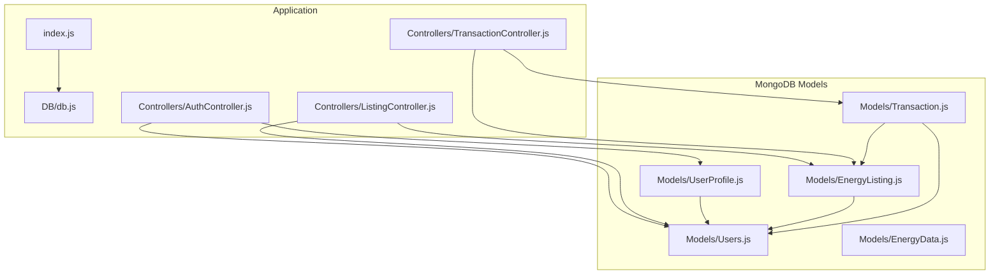
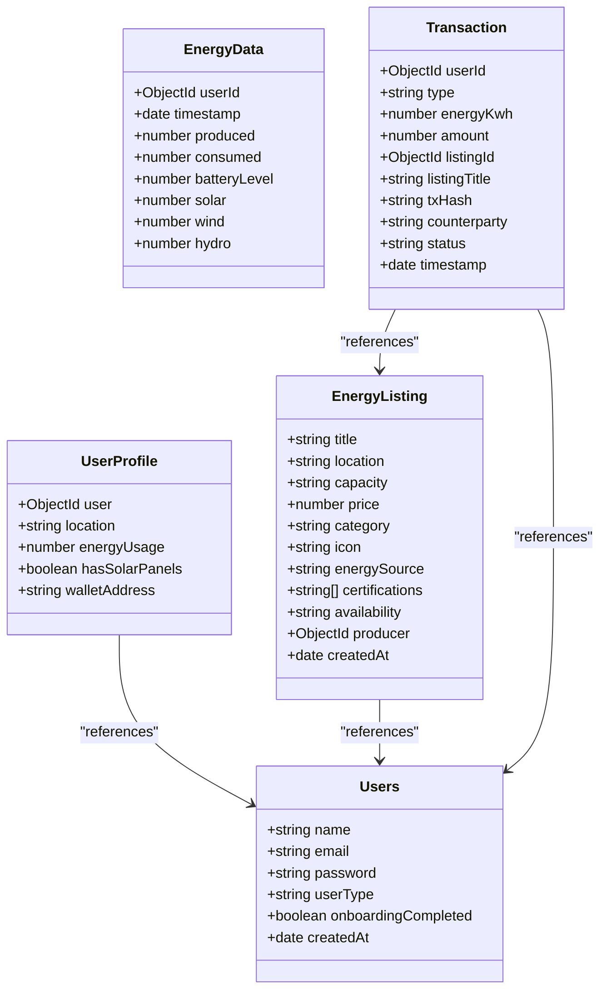
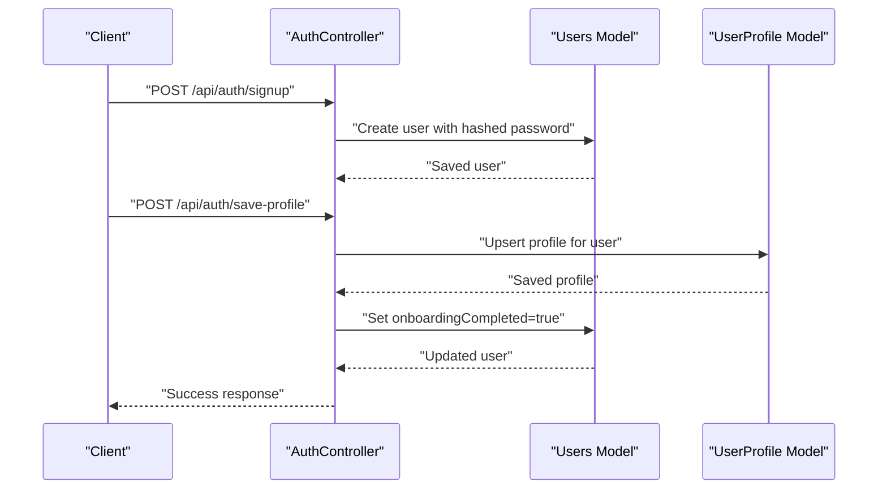
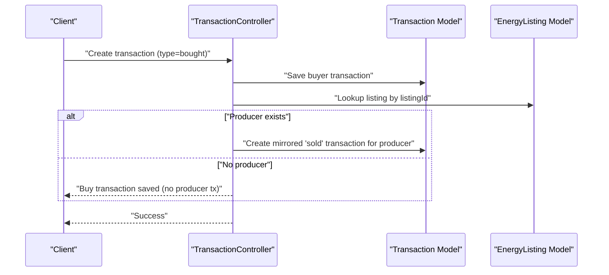
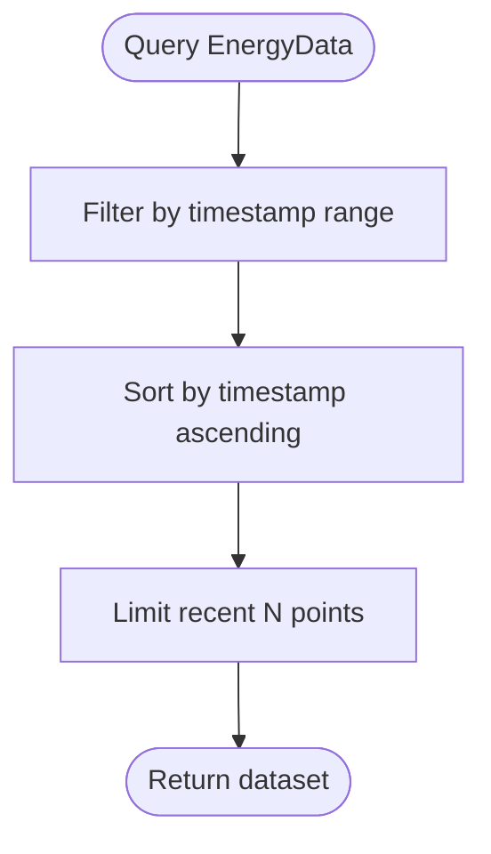
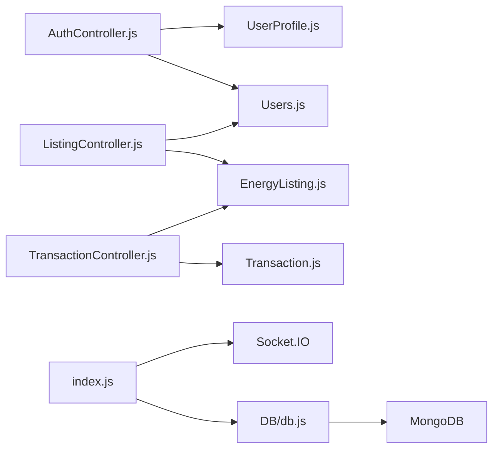
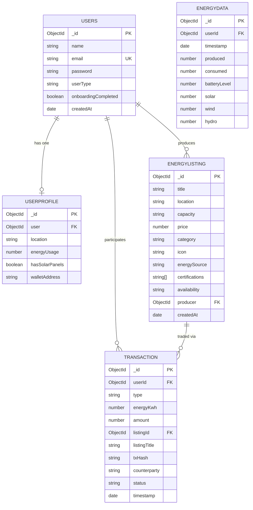

# Database Design

<cite>
**Referenced Files in This Document**
- [Users.js](file://backend/Models/Users.js)
- [UserProfile.js](file://backend/Models/UserProfile.js)
- [EnergyData.js](file://backend/Models/EnergyData.js)
- [EnergyListing.js](file://backend/Models/EnergyListing.js)
- [Transaction.js](file://backend/Models/Transaction.js)
- [db.js](file://backend/DB/db.js)
- [seed.js](file://backend/seed.js)
- [index.js](file://backend/index.js)
- [AuthController.js](file://backend/Controllers/AuthController.js)
- [ListingController.js](file://backend/Controllers/ListingController.js)
- [TransactionController.js](file://backend/Controllers/TransactionController.js)
- [.env](file://backend/.env)
</cite>

## Table of Contents
1. [Introduction](#introduction)
2. [Project Structure](#project-structure)
3. [Core Components](#core-components)
4. [Architecture Overview](#architecture-overview)
5. [Detailed Component Analysis](#detailed-component-analysis)
6. [Dependency Analysis](#dependency-analysis)
7. [Performance Considerations](#performance-considerations)
8. [Troubleshooting Guide](#troubleshooting-guide)
9. [Conclusion](#conclusion)
10. [Appendices](#appendices)

## Introduction
This document describes the MongoDB-based data persistence layer for the EcoGrid platform. It defines the entity relationship models for Users, UserProfiles, EnergyData, EnergyListings, and Transactions, including field definitions, data types, validation rules, and business constraints. It explains the relationships between collections, outlines indexing strategies for query optimization, documents the data seeding process for development and testing, and covers migration patterns, schema evolution, backup procedures, common queries and aggregation pipelines, and security considerations for data access control and sensitive information handling.

## Project Structure
The data persistence layer is implemented using Mongoose ODM models under the backend/Models directory. Application entry connects to MongoDB via a centralized connection module. Controllers orchestrate data access and business logic, while seed.js initializes development datasets.

**Diagram sources**
- [index.js](file://backend/index.js#L1-L97)
- [db.js](file://backend/DB/db.js#L1-L12)
- [AuthController.js](file://backend/Controllers/AuthController.js#L1-L482)
- [ListingController.js](file://backend/Controllers/ListingController.js#L1-L253)
- [TransactionController.js](file://backend/Controllers/TransactionController.js#L1-L68)
- [Users.js](file://backend/Models/Users.js#L1-L32)
- [UserProfile.js](file://backend/Models/UserProfile.js#L1-L31)
- [EnergyData.js](file://backend/Models/EnergyData.js#L1-L43)
- [EnergyListing.js](file://backend/Models/EnergyListing.js#L1-L56)
- [Transaction.js](file://backend/Models/Transaction.js#L1-L51)

**Section sources**
- [index.js](file://backend/index.js#L1-L97)
- [db.js](file://backend/DB/db.js#L1-L12)

## Core Components
This section defines each schema with fields, types, validation rules, and constraints.

- Users
  - Purpose: Core identity and authentication records.
  - Fields:
    - name: String, required
    - email: String, required, unique, trimmed, lowercased
    - password: String, required
    - userType: String, required, enum: ["prosumer", "consumer", "utility"]
    - onboardingCompleted: Boolean, default false
    - createdAt: Date, default current time
  - Validation rules:
    - Enforced by Mongoose schema-level validators.
    - Unique constraint on email enforced at schema level.
  - Business constraints:
    - userType determines role-based access and UI flows.
    - onboardingCompleted indicates completion of initial profile setup.

- UserProfiles
  - Purpose: Onboarding and profile details linked to Users.
  - Fields:
    - user: ObjectId referencing Users, required
    - location: String, required
    - energyUsage: Number, required
    - hasSolarPanels: Boolean, required
    - walletAddress: String, default empty
  - Validation rules:
    - Required fields enforced by schema.
    - One-to-one relationship implied by unique ObjectId reference.
  - Business constraints:
    - Each user has one profile; creation/update handled during onboarding.

- EnergyData
  - Purpose: Historical energy production/consumption metrics for dashboards.
  - Fields:
    - userId: ObjectId referencing Users (optional)
    - timestamp: Date, required, default current time
    - produced: Number, required, default 0
    - consumed: Number, required, default 0
    - batteryLevel: Number, default 100
    - solar: Number, default 0
    - wind: Number, default 0
    - hydro: Number, default 0
  - Validation rules:
    - Defaults applied at schema level.
  - Business constraints:
    - Optional userId allows system-generated or anonymous metrics.

- EnergyListings
  - Purpose: Energy supply/offers for trading.
  - Fields:
    - title: String, required
    - location: String, required
    - capacity: String, required
    - price: Number, required
    - category: String, required, enum: ["Solar", "Wind", "Hydro", "Biomass"]
    - icon: String, default emoji
    - energySource: String, enum: ["residential", "commercial", "industrial", "community"], default "residential"
    - certifications: Array of String
    - availability: String, enum: ["available", "limited", "sold_out"], default "available"
    - producer: ObjectId referencing Users, required
    - createdAt: Date, default current time
  - Validation rules:
    - Enumerations enforced at schema level.
    - Required fields enforced.
  - Business constraints:
    - Ownership enforced in controller logic (producer must match requester).

- Transactions
  - Purpose: Records of buying/selling energy trades.
  - Fields:
    - userId: ObjectId referencing Users (optional)
    - type: String, required, enum: ["sold", "bought"]
    - energyKwh: Number, required
    - amount: Number, required
    - listingId: ObjectId referencing EnergyListings (optional)
    - listingTitle: String, default empty
    - txHash: String, default empty
    - counterparty: String, default empty
    - status: String, enum: ["completed", "pending", "failed"], default "completed"
    - timestamp: Date, default current time
  - Validation rules:
    - Enumerations enforced at schema level.
  - Business constraints:
    - When a consumer buys, a mirrored "sold" transaction is created for the producer automatically.

**Section sources**
- [Users.js](file://backend/Models/Users.js#L1-L32)
- [UserProfile.js](file://backend/Models/UserProfile.js#L1-L31)
- [EnergyData.js](file://backend/Models/EnergyData.js#L1-L43)
- [EnergyListing.js](file://backend/Models/EnergyListing.js#L1-L56)
- [Transaction.js](file://backend/Models/Transaction.js#L1-L51)

## Architecture Overview
The data layer follows a document-oriented design with explicit references between collections. Controllers handle business logic and enforce ownership and validation. Real-time updates are emitted via Socket.IO to subscribed clients.

**Diagram sources**
- [Users.js](file://backend/Models/Users.js#L1-L32)
- [UserProfile.js](file://backend/Models/UserProfile.js#L1-L31)
- [EnergyListing.js](file://backend/Models/EnergyListing.js#L1-L56)
- [EnergyData.js](file://backend/Models/EnergyData.js#L1-L43)
- [Transaction.js](file://backend/Models/Transaction.js#L1-L51)

## Detailed Component Analysis

### Users and UserProfiles
- Relationship: One-to-one via UserProfile.user referencing Users.
- Access patterns:
  - Authentication controllers create and update Users and populate UserProfiles during onboarding.
  - Profile retrieval supports fallback when a profile does not yet exist.
- Security:
  - Passwords are hashed before storage.
  - Email uniqueness prevents duplicates.

**Diagram sources**
- [AuthController.js](file://backend/Controllers/AuthController.js#L49-L101)
- [AuthController.js](file://backend/Controllers/AuthController.js#L158-L194)
- [Users.js](file://backend/Models/Users.js#L1-L32)
- [UserProfile.js](file://backend/Models/UserProfile.js#L1-L31)

**Section sources**
- [AuthController.js](file://backend/Controllers/AuthController.js#L49-L101)
- [AuthController.js](file://backend/Controllers/AuthController.js#L158-L194)
- [Users.js](file://backend/Models/Users.js#L1-L32)
- [UserProfile.js](file://backend/Models/UserProfile.js#L1-L31)

### EnergyListings and Transactions
- Ownership enforcement:
  - Controllers verify that the requesting user matches the listing’s producer before allowing updates/deletes.
- Auto-generated mirrored transactions:
  - When a consumer buys energy, a corresponding "sold" transaction is created for the producer.

**Diagram sources**
- [TransactionController.js](file://backend/Controllers/TransactionController.js#L19-L67)
- [EnergyListing.js](file://backend/Models/EnergyListing.js#L1-L56)
- [Transaction.js](file://backend/Models/Transaction.js#L1-L51)

**Section sources**
- [ListingController.js](file://backend/Controllers/ListingController.js#L101-L157)
- [TransactionController.js](file://backend/Controllers/TransactionController.js#L19-L67)

### EnergyData
- Purpose: Time-series metrics for dashboard visualizations.
- Typical queries:
  - Range-based filtering by timestamp.
  - Aggregations for produced/consumed totals and averages.

**Diagram sources**
- [EnergyData.js](file://backend/Models/EnergyData.js#L1-L43)

**Section sources**
- [EnergyData.js](file://backend/Models/EnergyData.js#L1-L43)

## Dependency Analysis
- Internal dependencies:
  - Controllers depend on Models for CRUD operations.
  - Models reference each other via ObjectId relations.
- External dependencies:
  - MongoDB via Mongoose.
  - Socket.IO for real-time events.
- Environment:
  - Connection URI and secrets loaded from environment variables.

**Diagram sources**
- [AuthController.js](file://backend/Controllers/AuthController.js#L1-L482)
- [ListingController.js](file://backend/Controllers/ListingController.js#L1-L253)
- [TransactionController.js](file://backend/Controllers/TransactionController.js#L1-L68)
- [Users.js](file://backend/Models/Users.js#L1-L32)
- [UserProfile.js](file://backend/Models/UserProfile.js#L1-L31)
- [EnergyListing.js](file://backend/Models/EnergyListing.js#L1-L56)
- [Transaction.js](file://backend/Models/Transaction.js#L1-L51)
- [db.js](file://backend/DB/db.js#L1-L12)
- [index.js](file://backend/index.js#L1-L97)

**Section sources**
- [index.js](file://backend/index.js#L1-L97)
- [db.js](file://backend/DB/db.js#L1-L12)
- [AuthController.js](file://backend/Controllers/AuthController.js#L1-L482)
- [ListingController.js](file://backend/Controllers/ListingController.js#L1-L253)
- [TransactionController.js](file://backend/Controllers/TransactionController.js#L1-L68)

## Performance Considerations
- Indexing strategies:
  - Compound index on {producer: 1, createdAt: -1} for EnergyListings to optimize user-specific listing queries and reverse chronological sort.
  - Compound index on {userId: 1, timestamp: -1} for Transactions to accelerate per-user transaction history retrieval and sorting.
  - Single-field index on EnergyData.timestamp to speed up time-range queries.
  - Unique index on Users.email to prevent duplicates and support fast lookups.
- Query patterns:
  - Controllers commonly sort by createdAt descending and limit results; ensure indexes support these patterns.
  - Population of producer name in listing queries is frequent; consider denormalizing minimal producer info if needed.
- Aggregation pipelines:
  - Use aggregation for analytics (e.g., category breakdown, status counts) to minimize client-side processing.
- Real-time updates:
  - Socket.IO rooms reduce broadcast overhead; ensure efficient event emission and client-side batching.

[No sources needed since this section provides general guidance]

## Troubleshooting Guide
- Connection issues:
  - Confirm MONGO_URI in environment variables is reachable and credentials are valid.
- Duplicate key errors on email:
  - Ensure unique index on email is present; verify sign-up flow handles existing users.
- Ownership errors on listing updates/deletes:
  - Controllers enforce producer ownership; verify request.user._id is set by middleware and matches listing.producer.
- Transaction mirroring failures:
  - Producer transaction creation is attempted after buyer transaction; confirm listing.producer exists and is accessible.

**Section sources**
- [.env](file://backend/.env#L1-L13)
- [db.js](file://backend/DB/db.js#L1-L12)
- [ListingController.js](file://backend/Controllers/ListingController.js#L101-L157)
- [TransactionController.js](file://backend/Controllers/TransactionController.js#L19-L67)

## Conclusion
The MongoDB data layer uses clear document schemas with explicit references to model Users, UserProfiles, EnergyListings, Transactions, and EnergyData. Controllers enforce ownership and validation, while Socket.IO enables real-time updates. Indexing and aggregation strategies should be implemented to support common queries and analytics. The seeding script provides a reproducible dataset for development and testing.

[No sources needed since this section summarizes without analyzing specific files]

## Appendices

### A. Entity Relationship Model

**Diagram sources**
- [Users.js](file://backend/Models/Users.js#L1-L32)
- [UserProfile.js](file://backend/Models/UserProfile.js#L1-L31)
- [EnergyListing.js](file://backend/Models/EnergyListing.js#L1-L56)
- [Transaction.js](file://backend/Models/Transaction.js#L1-L51)
- [EnergyData.js](file://backend/Models/EnergyData.js#L1-L43)

### B. Index Recommendations
- EnergyListings: {producer: 1, createdAt: -1}, {category: 1}, {title: "text", location: "text"}
- Transactions: {userId: 1, timestamp: -1}, {listingId: 1}
- Users: {email: 1}
- EnergyData: {timestamp: 1}

[No sources needed since this section provides general guidance]

### C. Data Seeding Process
- Connects to MongoDB using MONGO_URI.
- Clears and seeds EnergyListings, EnergyData, and BlogPosts.
- Creates or reuses a demo prosumer user to own listings.
- Exits after seeding completes.

**Section sources**
- [seed.js](file://backend/seed.js#L1-L169)
- [.env](file://backend/.env#L1-L13)

### D. Migration and Backup Procedures
- Migration patterns:
  - Add new fields with defaults in schema; use model-level defaults to backfill existing documents.
  - For renaming fields, perform a one-time aggregation pipeline to rename and update.
  - For deprecating fields, keep reads backward compatible while writing new values.
- Backup procedures:
  - Use MongoDB Atlas backups or mongodump/mongorestore for local deployments.
  - Schedule periodic snapshots and retain multiple generations for point-in-time recovery.

[No sources needed since this section provides general guidance]

### E. Common Queries and Aggregation Pipelines
- Get user’s listings sorted by newest:
  - Filter by producer equals userId, sort by createdAt descending.
- Get marketplace listings with optional category and search:
  - Filter by category and regex search on title; populate producer name.
- Analytics for a prosumer:
  - Aggregate listings by category and availability; compute total value and sales stats from completed transactions.
- Recent energy data points:
  - Filter by timestamp range, sort ascending, limit N.

**Section sources**
- [ListingController.js](file://backend/Controllers/ListingController.js#L5-L35)
- [ListingController.js](file://backend/Controllers/ListingController.js#L38-L56)
- [ListingController.js](file://backend/Controllers/ListingController.js#L205-L253)
- [TransactionController.js](file://backend/Controllers/TransactionController.js#L4-L16)
- [EnergyData.js](file://backend/Models/EnergyData.js#L1-L43)

### F. Security Considerations
- Data access control:
  - Controllers enforce ownership checks for listing updates/deletes.
  - JWT tokens protect endpoints; ensure secure cookie policies for session transport.
- Sensitive information handling:
  - Passwords are hashed before storage.
  - Email addresses are unique and lowercased to avoid ambiguity.
  - Reset codes are stored with TTL to limit exposure windows.
- Transport and storage:
  - Store secrets in environment variables; restrict access to deployment infrastructure.
  - Enable TLS for MongoDB connections and limit network exposure.

**Section sources**
- [AuthController.js](file://backend/Controllers/AuthController.js#L105-L155)
- [AuthController.js](file://backend/Controllers/AuthController.js#L271-L381)
- [seed.js](file://backend/seed.js#L1-L169)
- [.env](file://backend/.env#L1-L13)