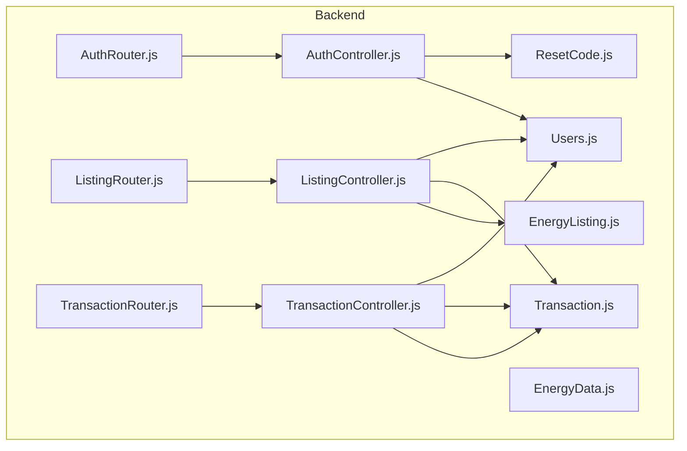
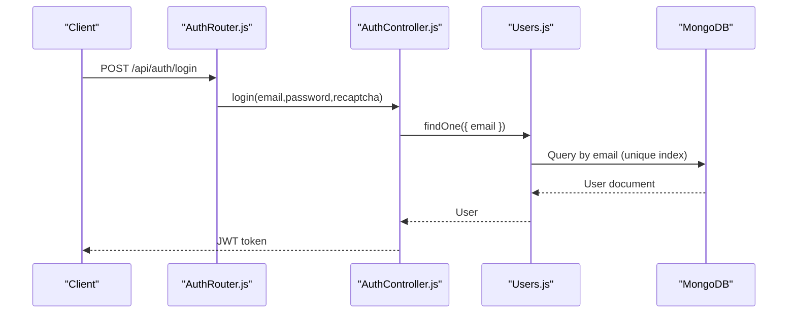
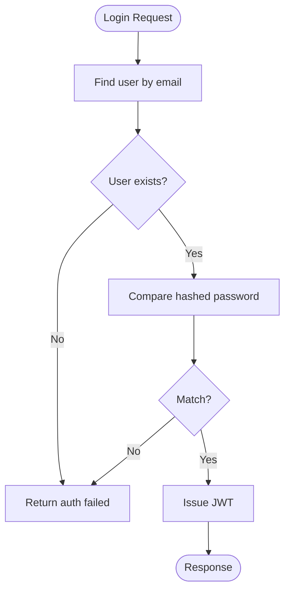
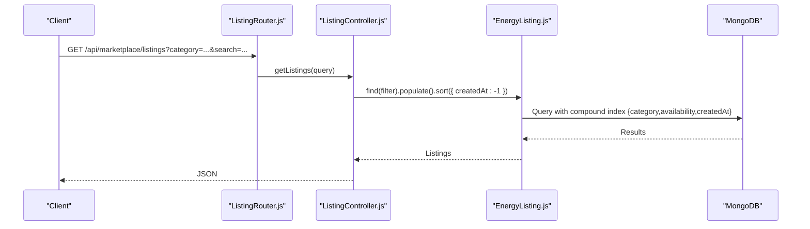
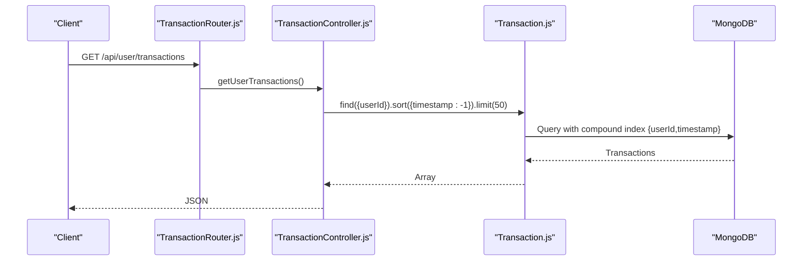
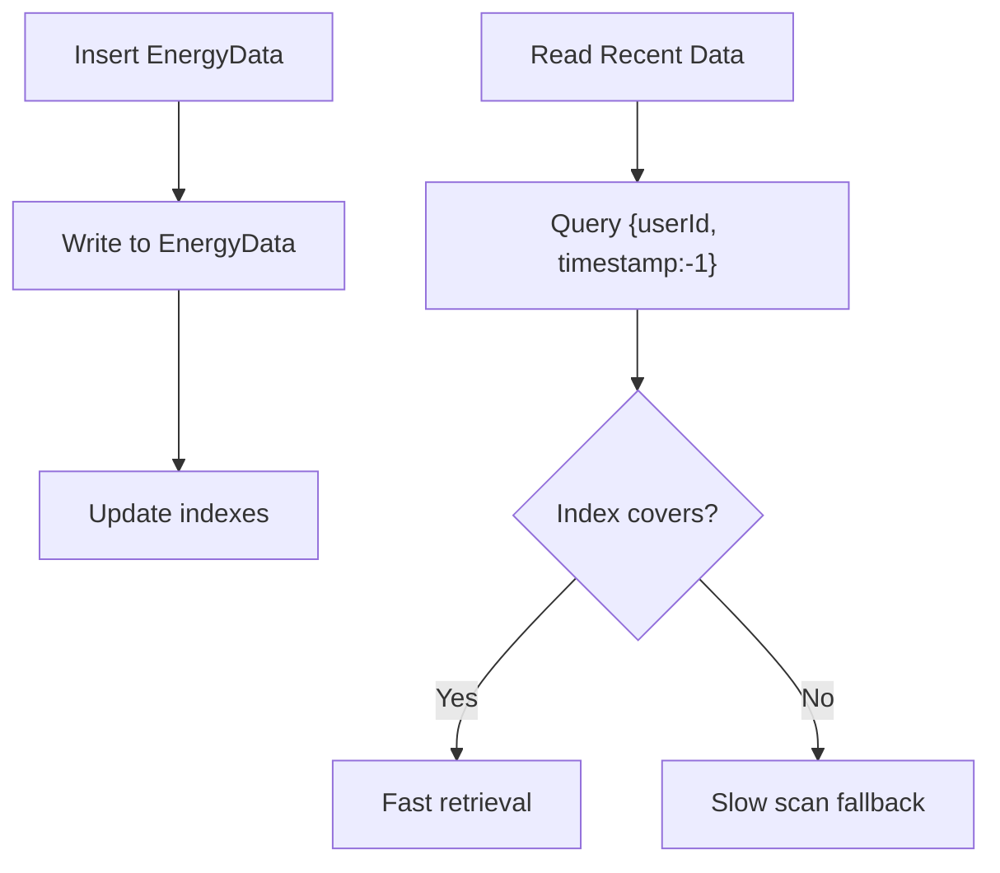
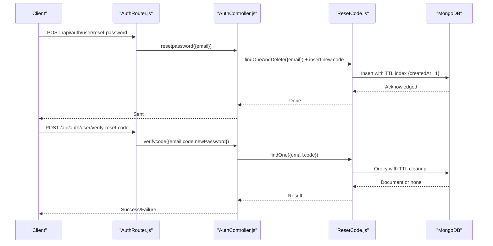
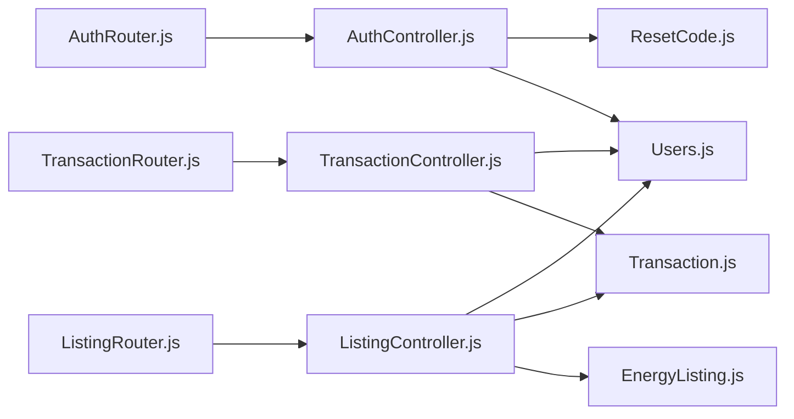

# Indexing Strategies and Performance

<cite>
**Referenced Files in This Document**
- [db.js](file://backend/DB/db.js)
- [EnergyData.js](file://backend/Models/EnergyData.js)
- [Users.js](file://backend/Models/Users.js)
- [EnergyListing.js](file://backend/Models/EnergyListing.js)
- [Transaction.js](file://backend/Models/Transaction.js)
- [ResetCode.js](file://backend/Models/ResetCode.js)
- [AuthController.js](file://backend/Controllers/AuthController.js)
- [ListingController.js](file://backend/Controllers/ListingController.js)
- [TransactionController.js](file://backend/Controllers/TransactionController.js)
- [AuthRouter.js](file://backend/Routes/AuthRouter.js)
- [ListingRouter.js](file://backend/Routes/ListingRouter.js)
- [TransactionRouter.js](file://backend/Routes/TransactionRouter.js)
</cite>

## Table of Contents
1. [Introduction](#introduction)
2. [Project Structure](#project-structure)
3. [Core Components](#core-components)
4. [Architecture Overview](#architecture-overview)
5. [Detailed Component Analysis](#detailed-component-analysis)
6. [Dependency Analysis](#dependency-analysis)
7. [Performance Considerations](#performance-considerations)
8. [Troubleshooting Guide](#troubleshooting-guide)
9. [Conclusion](#conclusion)
10. [Appendices](#appendices)

## Introduction
This document provides a comprehensive guide to MongoDB indexing strategies and performance optimization tailored for the EcoGrid application. It focuses on:
- Compound indexes for frequently queried fields (energy data timestamps, user authentication fields, listing status filters, and transaction date ranges)
- TTL indexes for temporary reset codes and automatic cleanup of ephemeral data
- Query optimization techniques for real-time energy monitoring and marketplace operations
- Index maintenance, monitoring, and troubleshooting slow queries
- Trade-offs between write performance and read efficiency for high-frequency energy data updates

## Project Structure
The EcoGrid backend uses Mongoose ODM models to define collections and their fields. Queries are routed via Express routers to controllers that perform filtering, sorting, and aggregation. Authentication, marketplace listings, and transactions are the primary domains requiring optimized indexes.

**Diagram sources**
- [AuthRouter.js](file://backend/Routes/AuthRouter.js#L1-L15)
- [ListingRouter.js](file://backend/Routes/ListingRouter.js#L1-L24)
- [TransactionRouter.js](file://backend/Routes/TransactionRouter.js#L1-L11)
- [AuthController.js](file://backend/Controllers/AuthController.js#L1-L482)
- [ListingController.js](file://backend/Controllers/ListingController.js#L1-L253)
- [TransactionController.js](file://backend/Controllers/TransactionController.js#L1-L68)
- [Users.js](file://backend/Models/Users.js#L1-L32)
- [EnergyListing.js](file://backend/Models/EnergyListing.js#L1-L56)
- [Transaction.js](file://backend/Models/Transaction.js#L1-L51)
- [EnergyData.js](file://backend/Models/EnergyData.js#L1-L43)
- [ResetCode.js](file://backend/Models/ResetCode.js#L1-L23)

**Section sources**
- [db.js](file://backend/DB/db.js#L1-L12)
- [AuthRouter.js](file://backend/Routes/AuthRouter.js#L1-L15)
- [ListingRouter.js](file://backend/Routes/ListingRouter.js#L1-L24)
- [TransactionRouter.js](file://backend/Routes/TransactionRouter.js#L1-L11)

## Core Components
- Users: Unique email, user type, onboarding flag, creation timestamp
- EnergyListing: Producer reference, category, availability, creation timestamp
- Transaction: User reference, type, amount, energyKwh, listing reference, status, timestamp
- EnergyData: User reference, timestamp, production/consumption metrics
- ResetCode: Email, code, creation timestamp with TTL

These components underpin the primary read/write workloads:
- Authentication and profile lookups
- Marketplace browsing and filtering
- Real-time energy monitoring streams
- Transaction history and analytics

**Section sources**
- [Users.js](file://backend/Models/Users.js#L1-L32)
- [EnergyListing.js](file://backend/Models/EnergyListing.js#L1-L56)
- [Transaction.js](file://backend/Models/Transaction.js#L1-L51)
- [EnergyData.js](file://backend/Models/EnergyData.js#L1-L43)
- [ResetCode.js](file://backend/Models/ResetCode.js#L1-L23)

## Architecture Overview
The application’s data access pattern centers around:
- Authentication queries on email and hashed credentials
- Marketplace queries on category, availability, and title search
- Transaction queries on user ID and timestamp ranges
- Energy monitoring queries on user ID and timestamp ranges
- Temporary reset code queries on email/code with automatic expiry

**Diagram sources**
- [AuthRouter.js](file://backend/Routes/AuthRouter.js#L1-L15)
- [AuthController.js](file://backend/Controllers/AuthController.js#L105-L155)
- [Users.js](file://backend/Models/Users.js#L1-L32)

## Detailed Component Analysis

### Authentication Indexes
- Purpose: Optimize login and profile retrieval by email and hashed credentials
- Current state: Email is unique; no explicit compound index for login
- Recommended:
  - Compound index on { email: 1, userType: 1 } to accelerate login and role checks
  - Ensure unique index on email remains for fast existence checks

**Diagram sources**
- [AuthController.js](file://backend/Controllers/AuthController.js#L105-L155)
- [Users.js](file://backend/Models/Users.js#L8-L14)

**Section sources**
- [AuthController.js](file://backend/Controllers/AuthController.js#L105-L155)
- [Users.js](file://backend/Models/Users.js#L8-L14)

### Marketplace Indexes
- Purpose: Optimize listing retrieval by category, availability, and title search
- Current state: Filters by category and regex-based title search; sorts by createdAt desc
- Recommended:
  - Compound index on { category: 1, availability: 1, createdAt: -1 } to support filtering and sorting
  - Text index on { title: "text", location: "text" } for flexible search
  - Consider partialFilterExpression to index only available listings if applicable

**Diagram sources**
- [ListingRouter.js](file://backend/Routes/ListingRouter.js#L14-L15)
- [ListingController.js](file://backend/Controllers/ListingController.js#L5-L35)
- [EnergyListing.js](file://backend/Models/EnergyListing.js#L1-L56)

**Section sources**
- [ListingController.js](file://backend/Controllers/ListingController.js#L5-L35)
- [EnergyListing.js](file://backend/Models/EnergyListing.js#L22-L43)

### Transaction Indexes
- Purpose: Optimize user transaction history and analytics queries
- Current state: Queries by userId with timestamp sort and limit; analytics query aggregates sold transactions
- Recommended:
  - Compound index on { userId: 1, timestamp: -1 } to support recent history and pagination
  - Additional compound index on { userId: 1, type: 1, status: 1, timestamp: -1 } to accelerate analytics and filtering
  - Consider time-series collection or time-based sharding for very high-volume transaction data

**Diagram sources**
- [TransactionRouter.js](file://backend/Routes/TransactionRouter.js#L7-L8)
- [TransactionController.js](file://backend/Controllers/TransactionController.js#L4-L16)
- [Transaction.js](file://backend/Models/Transaction.js#L1-L51)

**Section sources**
- [TransactionController.js](file://backend/Controllers/TransactionController.js#L4-L16)
- [Transaction.js](file://backend/Models/Transaction.js#L4-L47)

### Energy Monitoring Indexes
- Purpose: Optimize frequent reads of recent energy data per user
- Current state: No explicit indexes on EnergyData
- Recommended:
  - Compound index on { userId: 1, timestamp: -1 } to support time-sorted queries
  - Consider TTL index on { timestamp: 1 } if historical retention is time-bound
  - For high-frequency writes, evaluate write concern and bulk operations to minimize index overhead

**Diagram sources**
- [EnergyData.js](file://backend/Models/EnergyData.js#L1-L43)

**Section sources**
- [EnergyData.js](file://backend/Models/EnergyData.js#L1-L43)

### Reset Codes and TTL Indexes
- Purpose: Secure, time-limited password reset codes with automatic cleanup
- Current state: ResetCode model defines createdAt with an expires option
- Recommended:
  - Ensure TTL index on { createdAt: 1 } with expireAfterSeconds set to 3600
  - Monitor orphaned documents and background cleanup behavior
  - Validate that queries target { email: ..., code: ... } efficiently

**Diagram sources**
- [AuthRouter.js](file://backend/Routes/AuthRouter.js#L13-L14)
- [AuthController.js](file://backend/Controllers/AuthController.js#L271-L381)
- [ResetCode.js](file://backend/Models/ResetCode.js#L1-L23)

**Section sources**
- [AuthController.js](file://backend/Controllers/AuthController.js#L271-L381)
- [ResetCode.js](file://backend/Models/ResetCode.js#L14-L18)

## Dependency Analysis
- Controllers depend on models for schema definitions and queries
- Routers bind endpoints to controller actions
- Authentication middleware protects routes used by marketplace and transaction controllers
- Cross-model references (populate) rely on indexed foreign keys

**Diagram sources**
- [AuthRouter.js](file://backend/Routes/AuthRouter.js#L1-L15)
- [ListingRouter.js](file://backend/Routes/ListingRouter.js#L1-L24)
- [TransactionRouter.js](file://backend/Routes/TransactionRouter.js#L1-L11)
- [AuthController.js](file://backend/Controllers/AuthController.js#L1-L482)
- [ListingController.js](file://backend/Controllers/ListingController.js#L1-L253)
- [TransactionController.js](file://backend/Controllers/TransactionController.js#L1-L68)
- [Users.js](file://backend/Models/Users.js#L1-L32)
- [EnergyListing.js](file://backend/Models/EnergyListing.js#L1-L56)
- [Transaction.js](file://backend/Models/Transaction.js#L1-L51)
- [ResetCode.js](file://backend/Models/ResetCode.js#L1-L23)

**Section sources**
- [AuthRouter.js](file://backend/Routes/AuthRouter.js#L1-L15)
- [ListingRouter.js](file://backend/Routes/ListingRouter.js#L1-L24)
- [TransactionRouter.js](file://backend/Routes/TransactionRouter.js#L1-L11)

## Performance Considerations
- Write vs read trade-offs:
  - High-frequency EnergyData inserts benefit from minimal index overhead; consider fewer indexes and bulk writes
  - Use compound indexes for read-heavy paths (user + timestamp) to avoid collection scans
- Query patterns:
  - Sorts by timestamp and filters by user/category/status are common; ensure indexes cover these projections
- Aggregation and analytics:
  - For prosumer analytics, pre-filtering by status and type reduces downstream processing
- Real-time updates:
  - Socket events complement database reads; keep queries efficient to minimize latency

[No sources needed since this section provides general guidance]

## Troubleshooting Guide
- Slow queries:
  - Use explain() to inspect query plans and index usage
  - Look for Stage "COLLSCAN" indicating missing indexes
  - Confirm sort and projection are covered by indexes
- Index effectiveness monitoring:
  - Track index sizes and query stats via database profiling
  - Review slow query logs and optimize based on actual workload
- Maintenance procedures:
  - Rebuild stale indexes after large-scale deletions or schema changes
  - Periodically audit unused or redundant indexes
- Example EXPLAIN analysis workflow:
  - Run explain("executionStats") on targeted queries
  - Verify winning plan uses expected compound indexes
  - Adjust indexes if needed based on returned metrics

[No sources needed since this section provides general guidance]

## Conclusion
By aligning indexes with real-world query patterns—authentication, marketplace filtering, transaction history, and energy monitoring—EcoGrid can achieve significant performance gains. TTL indexes streamline temporary data lifecycle management, while careful index design balances write throughput with read efficiency for high-frequency energy data updates.

[No sources needed since this section summarizes without analyzing specific files]

## Appendices

### Index Recommendations Summary
- Authentication: { email: 1, userType: 1 } (unique on email)
- Marketplace: { category: 1, availability: 1, createdAt: -1 }; text index on { title: "text", location: "text" }
- Transactions: { userId: 1, timestamp: -1 }; { userId: 1, type: 1, status: 1, timestamp: -1 }
- EnergyData: { userId: 1, timestamp: -1 }
- ResetCode: { createdAt: 1 } with expireAfterSeconds 3600

[No sources needed since this section provides general guidance]