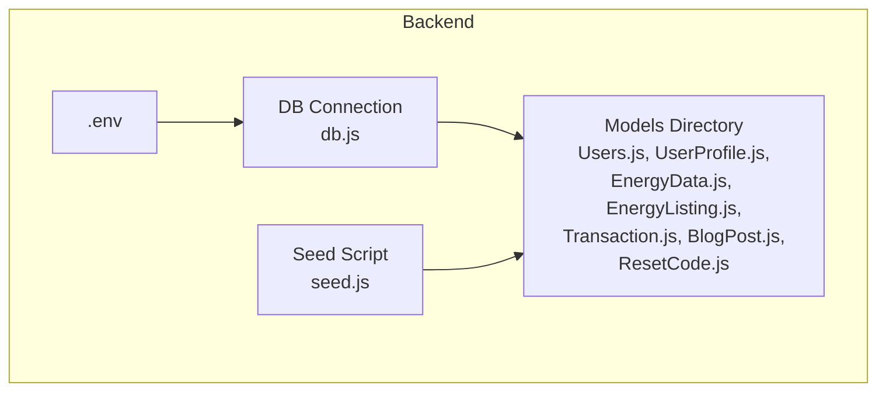
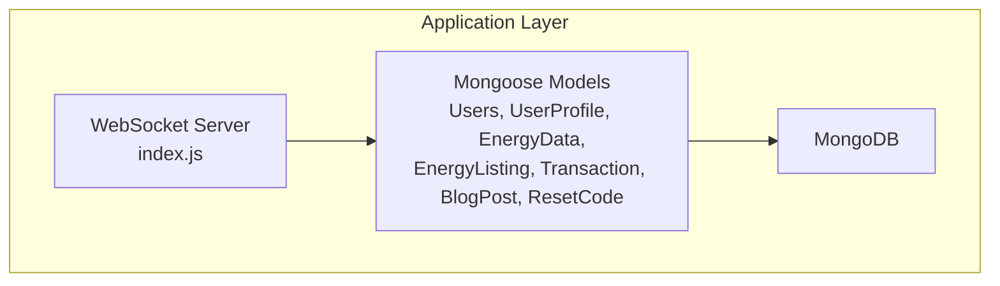
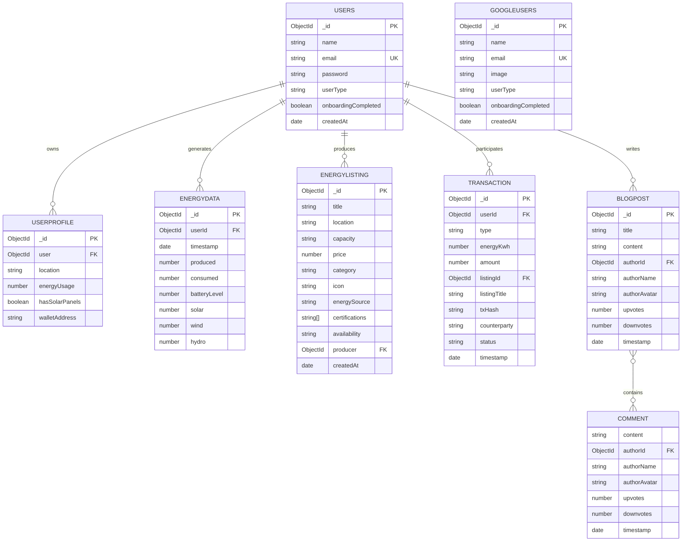

# MongoDB Schema Design

<cite>
**Referenced Files in This Document**
- [Users.js](file://backend/Models/Users.js)
- [googleuser.js](file://backend/Models/googleuser.js)
- [UserProfile.js](file://backend/Models/UserProfile.js)
- [EnergyData.js](file://backend/Models/EnergyData.js)
- [EnergyListing.js](file://backend/Models/EnergyListing.js)
- [Transaction.js](file://backend/Models/Transaction.js)
- [BlogPost.js](file://backend/Models/BlogPost.js)
- [ResetCode.js](file://backend/Models/ResetCode.js)
- [db.js](file://backend/DB/db.js)
- [index.js](file://backend/index.js)
- [seed.js](file://backend/seed.js)
- [.env](file://backend/.env)
</cite>

## Table of Contents
1. [Introduction](#introduction)
2. [Project Structure](#project-structure)
3. [Core Components](#core-components)
4. [Architecture Overview](#architecture-overview)
5. [Detailed Component Analysis](#detailed-component-analysis)
6. [Dependency Analysis](#dependency-analysis)
7. [Performance Considerations](#performance-considerations)
8. [Troubleshooting Guide](#troubleshooting-guide)
9. [Conclusion](#conclusion)
10. [Appendices](#appendices)

## Introduction
This document provides comprehensive MongoDB schema design documentation for the EcoGrid application. It details the field definitions, data types, validation rules, and business constraints for all collections used in the system. The schemas covered include Users, UserProfile, EnergyData, EnergyListing, Transaction, BlogPost, and ResetCode. For each model, we explain the purpose of each field, validation requirements, and data format specifications. We also provide typical document structures, rationale behind field choices, and considerations for schema evolution and backward compatibility.

## Project Structure
The MongoDB schemas are defined as Mongoose models within the backend Models directory. Each model file exports a Mongoose schema and model. The application connects to MongoDB via a centralized connection function and seeds initial data for demonstration.

**Diagram sources**
- [db.js](file://backend/DB/db.js#L1-L12)
- [seed.js](file://backend/seed.js#L1-L169)
- [.env](file://backend/.env#L1-L13)

**Section sources**
- [db.js](file://backend/DB/db.js#L1-L12)
- [seed.js](file://backend/seed.js#L1-L169)
- [.env](file://backend/.env#L1-L13)

## Core Components
This section summarizes the primary schemas and their roles in the EcoGrid ecosystem.

- Users: Core user account with authentication and user type classification.
- UserProfile: Energy-related profile data linked to Users.
- EnergyData: Real-time and historical energy production/consumption metrics.
- EnergyListing: Marketplace listings for energy assets with categorization and availability.
- Transaction: Trading records for bought/sold energy with optional blockchain transaction hash.
- BlogPost: Community-driven posts with comments and voting metadata.
- ResetCode: Temporary password reset codes with automatic expiration.

**Section sources**
- [Users.js](file://backend/Models/Users.js#L1-L32)
- [UserProfile.js](file://backend/Models/UserProfile.js#L1-L31)
- [EnergyData.js](file://backend/Models/EnergyData.js#L1-L43)
- [EnergyListing.js](file://backend/Models/EnergyListing.js#L1-L56)
- [Transaction.js](file://backend/Models/Transaction.js#L1-L51)
- [BlogPost.js](file://backend/Models/BlogPost.js#L1-L73)
- [ResetCode.js](file://backend/Models/ResetCode.js#L1-L23)

## Architecture Overview
The application uses Mongoose ODM to define schemas and models. The backend initializes a WebSocket server for real-time energy updates and marketplace notifications. Schemas are designed to support:
- Authentication and user profiles
- Real-time energy monitoring
- Marketplace transactions
- Community engagement
- Password recovery

**Diagram sources**
- [index.js](file://backend/index.js#L1-L97)
- [Users.js](file://backend/Models/Users.js#L1-L32)
- [UserProfile.js](file://backend/Models/UserProfile.js#L1-L31)
- [EnergyData.js](file://backend/Models/EnergyData.js#L1-L43)
- [EnergyListing.js](file://backend/Models/EnergyListing.js#L1-L56)
- [Transaction.js](file://backend/Models/Transaction.js#L1-L51)
- [BlogPost.js](file://backend/Models/BlogPost.js#L1-L73)
- [ResetCode.js](file://backend/Models/ResetCode.js#L1-L23)

## Detailed Component Analysis

### Users Schema
Purpose: Store core user account information and authentication metadata.

Field definitions and validation:
- name
  - Type: String
  - Validation: required
  - Purpose: Full name of the user
- email
  - Type: String
  - Validation: required, unique, trim, lowercase
  - Purpose: Unique identifier for authentication
- password
  - Type: String
  - Validation: required
  - Purpose: Hashed password stored securely
- userType
  - Type: String
  - Validation: required, enum: ["prosumer", "consumer", "utility"]
  - Purpose: Role-based access and permissions
- onboardingCompleted
  - Type: Boolean
  - Default: false
  - Purpose: Tracks completion of onboarding flow
- createdAt
  - Type: Date
  - Default: Date.now
  - Purpose: Timestamp of account creation

Typical document structure:
{
  "_id": ObjectId,
  "name": "string",
  "email": "string",
  "password": "string",
  "userType": "prosumer|consumer|utility",
  "onboardingCompleted": true|false,
  "createdAt": "date"
}

Rationale:
- Unique email ensures single account per email address.
- Enumerated userType simplifies role-based logic.
- onboardingCompleted flag enables targeted onboarding flows.

Backward compatibility:
- Adding optional fields (e.g., preferences) maintains backward compatibility.
- Changing enums requires careful migration and validation updates.

**Section sources**
- [Users.js](file://backend/Models/Users.js#L1-L32)

### UserProfile Schema
Purpose: Store energy-related profile data linked to a user.

Field definitions and validation:
- user
  - Type: ObjectId referencing Users
  - Validation: required
  - Purpose: Links profile to a specific user
- location
  - Type: String
  - Validation: required
  - Purpose: Geographic location for energy analytics
- energyUsage
  - Type: Number
  - Validation: required
  - Purpose: Average monthly energy usage in kWh
- hasSolarPanels
  - Type: Boolean
  - Validation: required
  - Purpose: Indicates ownership of solar panels
- walletAddress
  - Type: String
  - Default: ""
  - Purpose: Blockchain wallet address for energy transactions

Typical document structure:
{
  "_id": ObjectId,
  "user": ObjectId,
  "location": "string",
  "energyUsage": number,
  "hasSolarPanels": true|false,
  "walletAddress": "string"
}

Rationale:
- ObjectId reference ensures referential integrity with Users.
- Numeric energyUsage enables analytics and forecasting.
- walletAddress supports integration with blockchain-based energy trading.

**Section sources**
- [UserProfile.js](file://backend/Models/UserProfile.js#L1-L31)

### EnergyData Schema
Purpose: Capture real-time and historical energy production and consumption metrics.

Field definitions and validation:
- userId
  - Type: ObjectId referencing Users
  - Validation: optional
  - Purpose: Links energy data to a specific user (optional for system-generated data)
- timestamp
  - Type: Date
  - Default: Date.now
  - Validation: required
  - Purpose: Timestamp of the measurement
- produced
  - Type: Number
  - Default: 0
  - Validation: required
  - Purpose: Energy produced (kWh)
- consumed
  - Type: Number
  - Default: 0
  - Validation: required
  - Purpose: Energy consumed (kWh)
- batteryLevel
  - Type: Number
  - Default: 100
  - Purpose: Battery charge level percentage
- solar
  - Type: Number
  - Default: 0
  - Purpose: Solar energy contribution (kWh)
- wind
  - Type: Number
  - Default: 0
  - Purpose: Wind energy contribution (kWh)
- hydro
  - Type: Number
  - Default: 0
  - Purpose: Hydroelectric energy contribution (kWh)

Typical document structure:
{
  "_id": ObjectId,
  "userId": ObjectId,
  "timestamp": "date",
  "produced": number,
  "consumed": number,
  "batteryLevel": number,
  "solar": number,
  "wind": number,
  "hydro": number
}

Rationale:
- Optional userId allows system-generated data for dashboard visuals.
- Defaults enable safe aggregation even with missing data.
- Separate renewable sources enable granular analytics.

**Section sources**
- [EnergyData.js](file://backend/Models/EnergyData.js#L1-L43)

### EnergyListing Schema
Purpose: Enable marketplace functionality for buying and selling energy assets.

Field definitions and validation:
- title
  - Type: String
  - Validation: required
  - Purpose: Short description of the listing
- location
  - Type: String
  - Validation: required
  - Purpose: Geographic location of the asset
- capacity
  - Type: String
  - Validation: required
  - Purpose: Total capacity (e.g., "5 kWh")
- price
  - Type: Number
  - Validation: required
  - Purpose: Price per kWh
- category
  - Type: String
  - Validation: required, enum: ["Solar", "Wind", "Hydro", "Biomass"]
  - Purpose: Energy source type
- icon
  - Type: String
  - Default: "☀️"
  - Purpose: Emoji icon representing the energy source
- energySource
  - Type: String
  - Validation: enum: ["residential", "commercial", "industrial", "community"]
  - Default: "residential"
  - Purpose: Target consumer segment
- certifications
  - Type: Array of String
  - Purpose: Optional certifications or labels
- availability
  - Type: String
  - Validation: enum: ["available", "limited", "sold_out"]
  - Default: "available"
  - Purpose: Current listing status
- producer
  - Type: ObjectId referencing Users
  - Validation: required
  - Purpose: Owner/producer of the energy asset
- createdAt
  - Type: Date
  - Default: Date.now
  - Purpose: Timestamp of listing creation

Typical document structure:
{
  "_id": ObjectId,
  "title": "string",
  "location": "string",
  "capacity": "string",
  "price": number,
  "category": "Solar|Wind|Hydro|Biomass",
  "icon": "string",
  "energySource": "residential|commercial|industrial|community",
  "certifications": ["string"],
  "availability": "available|limited|sold_out",
  "producer": ObjectId,
  "createdAt": "date"
}

Rationale:
- Enumerations constrain invalid values and simplify filtering.
- Producer reference ties ownership to user accounts.
- availability field supports dynamic marketplace state.

**Section sources**
- [EnergyListing.js](file://backend/Models/EnergyListing.js#L1-L56)

### Transaction Schema
Purpose: Record energy trades between users with optional blockchain integration.

Field definitions and validation:
- userId
  - Type: ObjectId referencing Users
  - Validation: optional
  - Purpose: Buyer or seller user identity
- type
  - Type: String
  - Validation: enum: ["sold", "bought"]
  - Required: true
  - Purpose: Direction of the transaction
- energyKwh
  - Type: Number
  - Validation: required
  - Purpose: Quantity of energy traded (kWh)
- amount
  - Type: Number
  - Validation: required
  - Purpose: Total monetary amount
- listingId
  - Type: ObjectId referencing EnergyListing
  - Validation: optional
  - Purpose: Reference to the listing associated with the trade
- listingTitle
  - Type: String
  - Default: ""
  - Purpose: Cached title for display
- txHash
  - Type: String
  - Default: ""
  - Purpose: Blockchain transaction hash (when applicable)
- counterparty
  - Type: String
  - Default: ""
  - Purpose: Name or identifier of the trading partner
- status
  - Type: String
  - Validation: enum: ["completed", "pending", "failed"]
  - Default: "completed"
  - Purpose: Transaction lifecycle status
- timestamp
  - Type: Date
  - Default: Date.now
  - Purpose: Timestamp of the transaction

Typical document structure:
{
  "_id": ObjectId,
  "userId": ObjectId,
  "type": "sold|bought",
  "energyKwh": number,
  "amount": number,
  "listingId": ObjectId,
  "listingTitle": "string",
  "txHash": "string",
  "counterparty": "string",
  "status": "completed|pending|failed",
  "timestamp": "date"
}

Rationale:
- Optional userId accommodates system-initiated or anonymous transactions.
- status enum supports robust transaction lifecycle management.
- txHash enables blockchain traceability.

**Section sources**
- [Transaction.js](file://backend/Models/Transaction.js#L1-L51)

### BlogPost Schema
Purpose: Support community features with threaded comments and voting.

Field definitions and validation:
- title
  - Type: String
  - Validation: required
  - Purpose: Post title
- content
  - Type: String
  - Validation: required
  - Purpose: Post body
- authorId
  - Type: ObjectId referencing Users
  - Validation: optional
  - Purpose: Author identity (optional for guest posts)
- authorName
  - Type: String
  - Validation: required
  - Purpose: Author display name
- authorAvatar
  - Type: String
  - Default: "👤"
  - Purpose: Avatar emoji or URL
- upvotes
  - Type: Number
  - Default: 0
  - Purpose: Upvote count
- downvotes
  - Type: Number
  - Default: 0
  - Purpose: Downvote count
- comments
  - Type: Array of embedded CommentSchema
  - Purpose: Threaded comments with author metadata
- timestamp
  - Type: Date
  - Default: Date.now
  - Purpose: Post creation timestamp

Embedded CommentSchema:
- content
  - Type: String
  - Validation: required
- authorId
  - Type: ObjectId referencing Users
  - Validation: optional
- authorName
  - Type: String
  - Validation: required
- authorAvatar
  - Type: String
  - Default: "👤"
- upvotes
  - Type: Number
  - Default: 0
- downvotes
  - Type: Number
  - Default: 0
- timestamp
  - Type: Date
  - Default: Date.now

Typical document structure:
{
  "_id": ObjectId,
  "title": "string",
  "content": "string",
  "authorId": ObjectId,
  "authorName": "string",
  "authorAvatar": "string",
  "upvotes": number,
  "downvotes": number,
  "comments": [
    {
      "content": "string",
      "authorId": ObjectId,
      "authorName": "string",
      "authorAvatar": "string",
      "upvotes": number,
      "downvotes": number,
      "timestamp": "date"
    }
  ],
  "timestamp": "date"
}

Rationale:
- Embedded comments reduce joins and improve read performance.
- Optional authorId supports guest posting scenarios.
- Voting counts enable ranking and moderation.

**Section sources**
- [BlogPost.js](file://backend/Models/BlogPost.js#L1-L73)

### ResetCode Schema
Purpose: Manage password reset requests with time-based expiration.

Field definitions and validation:
- email
  - Type: String
  - Validation: required
  - Purpose: Email address associated with the reset request
- code
  - Type: String
  - Validation: required
  - Purpose: Generated reset code
- createdAt
  - Type: Date
  - Default: Date.now
  - Validation: required
  - Purpose: Timestamp of code generation
  - Expiration: 3600 seconds (1 hour)

Typical document structure:
{
  "_id": ObjectId,
  "email": "string",
  "code": "string",
  "createdAt": "date"
}

Rationale:
- Automatic expiration ensures security and prevents reuse.
- Embedded TTL index on createdAt enables automatic cleanup.

**Section sources**
- [ResetCode.js](file://backend/Models/ResetCode.js#L1-L23)

## Dependency Analysis
This section maps inter-model dependencies and relationships.

**Diagram sources**
- [Users.js](file://backend/Models/Users.js#L1-L32)
- [googleuser.js](file://backend/Models/googleuser.js#L1-L33)
- [UserProfile.js](file://backend/Models/UserProfile.js#L1-L31)
- [EnergyData.js](file://backend/Models/EnergyData.js#L1-L43)
- [EnergyListing.js](file://backend/Models/EnergyListing.js#L1-L56)
- [Transaction.js](file://backend/Models/Transaction.js#L1-L51)
- [BlogPost.js](file://backend/Models/BlogPost.js#L1-L73)

**Section sources**
- [Users.js](file://backend/Models/Users.js#L1-L32)
- [UserProfile.js](file://backend/Models/UserProfile.js#L1-L31)
- [EnergyData.js](file://backend/Models/EnergyData.js#L1-L43)
- [EnergyListing.js](file://backend/Models/EnergyListing.js#L1-L56)
- [Transaction.js](file://backend/Models/Transaction.js#L1-L51)
- [BlogPost.js](file://backend/Models/BlogPost.js#L1-L73)

## Performance Considerations
- Indexing recommendations:
  - Compound indexes on frequently queried fields (e.g., timestamp ascending for EnergyData).
  - Sparse indexes for optional fields (e.g., userId in EnergyData) to save space.
  - Text indexes for searchable fields (e.g., title in BlogPost).
- Aggregation pipeline:
  - Use $group stages to compute daily totals for produced/consumed energy.
  - Use $lookup judiciously; prefer embedding where appropriate (comments in BlogPost).
- Real-time updates:
  - WebSocket rooms (marketplace, energy-updates) reduce unnecessary broadcasts.
  - Emit only changed fields to clients to minimize bandwidth.
- Storage optimization:
  - Use NumberInt/NumberLong for counters and timestamps to avoid precision loss.
  - Compress large text fields if storage is constrained.

[No sources needed since this section provides general guidance]

## Troubleshooting Guide
Common issues and resolutions:
- Connection failures:
  - Verify MONGO_URI in .env is correct and accessible.
  - Ensure network policies allow connections to the cluster.
- Duplicate key errors:
  - Unique constraints on email in Users and googleuser require unique emails.
  - Validate uniqueness before insertions.
- Referential integrity:
  - Ensure ObjectId references exist before inserting child documents.
  - Use $lookup with match conditions to prevent orphaned references.
- Expiration of reset codes:
  - ResetCode automatically expires after 1 hour; ensure client handles expired codes gracefully.
- Real-time data:
  - Confirm clients join the correct rooms and handle disconnects.

**Section sources**
- [.env](file://backend/.env#L1-L13)
- [ResetCode.js](file://backend/Models/ResetCode.js#L1-L23)
- [index.js](file://backend/index.js#L47-L97)

## Conclusion
The EcoGrid MongoDB schema design balances flexibility, performance, and security. Each model encapsulates domain-specific concerns while leveraging Mongoose’s validation and population capabilities. The schemas support real-time updates, marketplace transactions, and community features. For future enhancements, prioritize backward-compatible migrations, thoughtful indexing, and robust error handling.

[No sources needed since this section summarizes without analyzing specific files]

## Appendices

### Typical Document Structures
- Users: See Users Schema section
- UserProfile: See UserProfile Schema section
- EnergyData: See EnergyData Schema section
- EnergyListing: See EnergyListing Schema section
- Transaction: See Transaction Schema section
- BlogPost: See BlogPost Schema section
- ResetCode: See ResetCode Schema section

### Schema Evolution and Backward Compatibility
- Add optional fields with defaults to preserve existing documents.
- Use explicit enums for categorical fields to prevent invalid values.
- Introduce deprecation timelines for removed fields; keep computed fields during transition.
- Maintain backward-compatible APIs by mapping new field names to legacy ones during reads/writes.
- Version documents with a version field for major schema changes.

[No sources needed since this section provides general guidance]