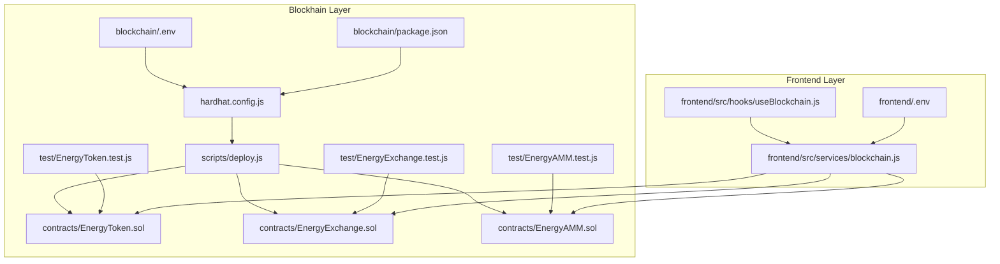
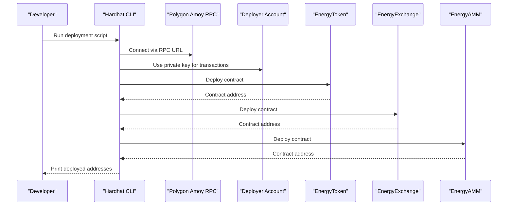
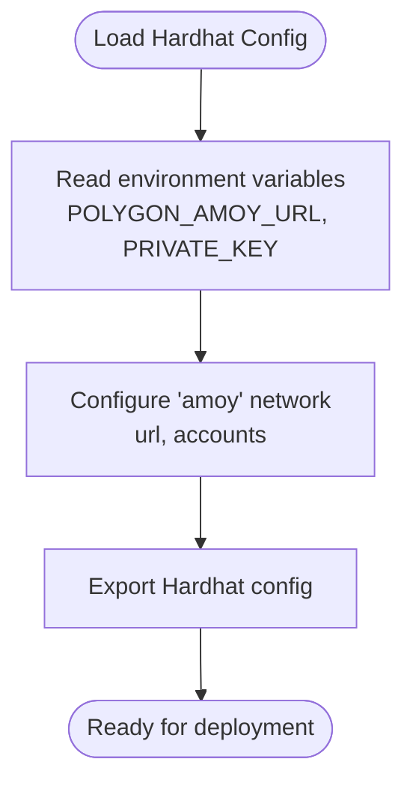
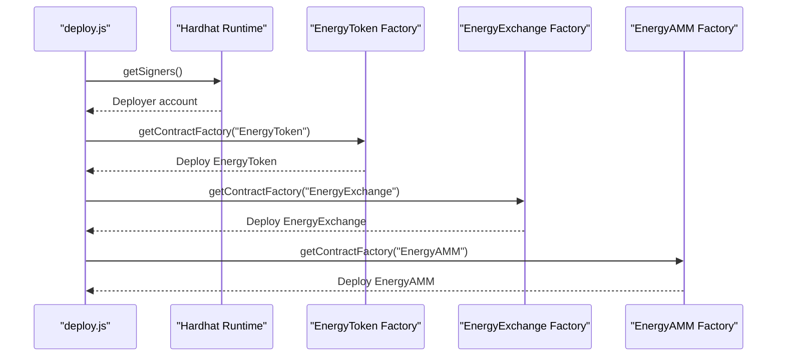
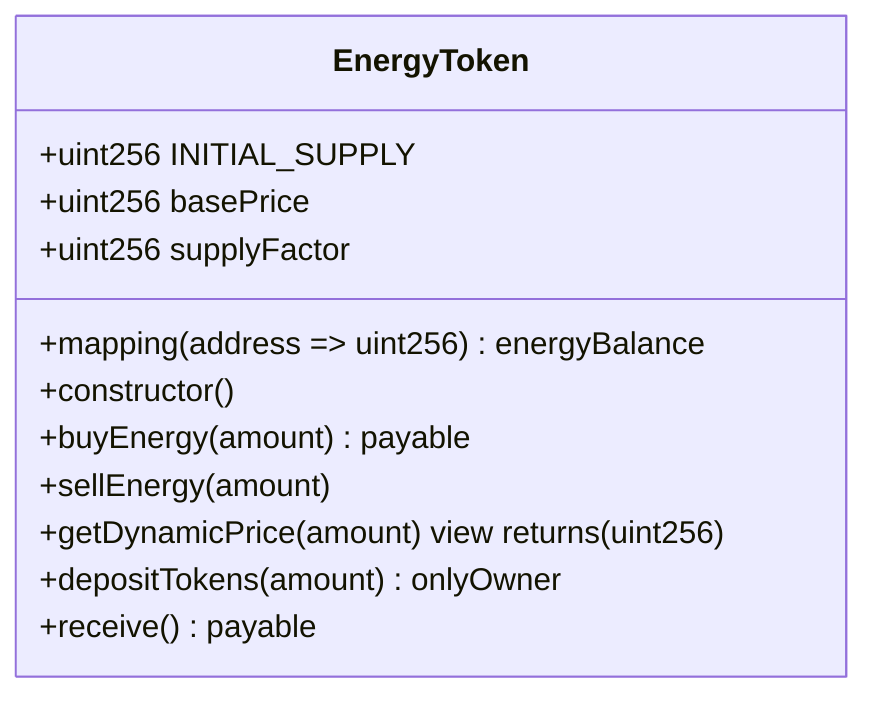
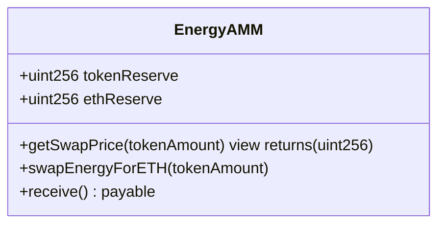
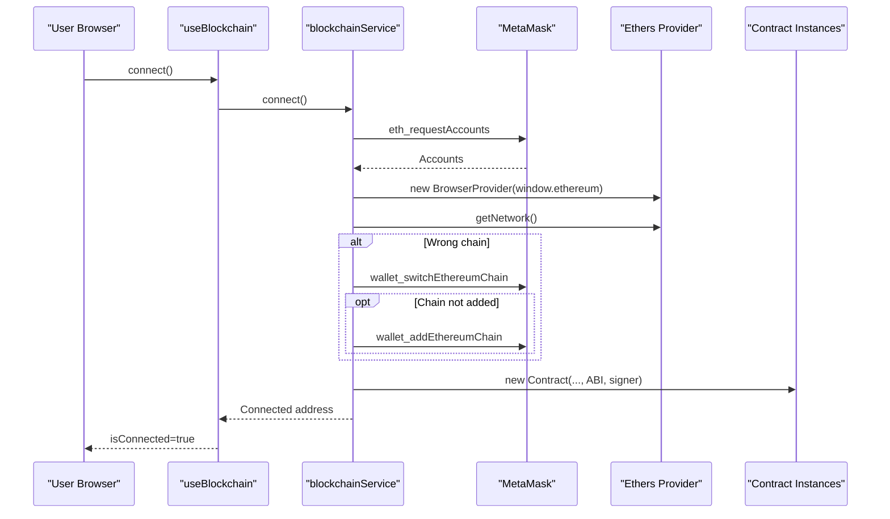
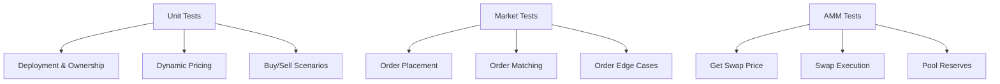
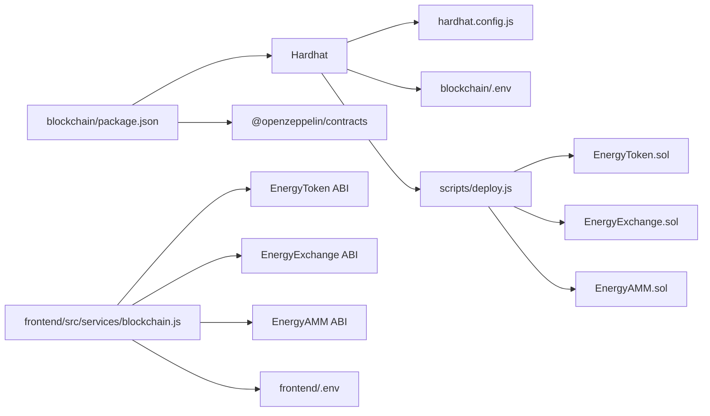

# Blockchain Deployment

<cite>
**Referenced Files in This Document**
- [hardhat.config.js](file://blockchain/hardhat.config.js)
- [deploy.js](file://blockchain/scripts/deploy.js)
- [EnergyToken.sol](file://blockchain/contracts/EnergyToken.sol)
- [EnergyExchange.sol](file://blockchain/contracts/EnergyExchange.sol)
- [EnergyAMM.sol](file://blockchain/contracts/EnergyAMM.sol)
- [.env](file://blockchain/.env)
- [package.json](file://blockchain/package.json)
- [EnergyToken.test.js](file://blockchain/test/EnergyToken.test.js)
- [EnergyExchange.test.js](file://blockchain/test/EnergyExchange.test.js)
- [EnergyAMM.test.js](file://blockchain/test/EnergyAMM.test.js)
- [blockchain.js](file://frontend/src/services/blockchain.js)
- [useBlockchain.js](file://frontend/src/hooks/useBlockchain.js)
- [frontend .env](file://frontend/.env)
- [README.md (blockchain)](file://blockchain/README.md)
</cite>

## Table of Contents
1. [Introduction](#introduction)
2. [Project Structure](#project-structure)
3. [Core Components](#core-components)
4. [Architecture Overview](#architecture-overview)
5. [Detailed Component Analysis](#detailed-component-analysis)
6. [Dependency Analysis](#dependency-analysis)
7. [Performance Considerations](#performance-considerations)
8. [Troubleshooting Guide](#troubleshooting-guide)
9. [Conclusion](#conclusion)
10. [Appendices](#appendices)

## Introduction
This document provides comprehensive blockchain deployment guidance for the EcoGrid project focused on Polygon Amoy testnet. It covers Hardhat configuration for Polygon network integration, smart contract deployment for EnergyToken, EnergyExchange, and EnergyAMM, wallet integration via MetaMask, frontend contract interaction, testing strategies, troubleshooting, and security considerations.

## Project Structure
The blockchain-related components are organized under the blockchain directory with contracts, Hardhat configuration, deployment scripts, and tests. Frontend integration resides under the frontend directory with services and hooks to interact with the deployed contracts.



**Diagram sources**
- [hardhat.config.js](file://blockchain/hardhat.config.js#L1-L12)
- [deploy.js](file://blockchain/scripts/deploy.js#L1-L29)
- [EnergyToken.sol](file://blockchain/contracts/EnergyToken.sol#L1-L55)
- [EnergyExchange.sol](file://blockchain/contracts/EnergyExchange.sol#L1-L45)
- [EnergyAMM.sol](file://blockchain/contracts/EnergyAMM.sol#L1-L24)
- [.env](file://blockchain/.env#L1-L2)
- [package.json](file://blockchain/package.json#L1-L11)
- [EnergyToken.test.js](file://blockchain/test/EnergyToken.test.js#L1-L229)
- [EnergyExchange.test.js](file://blockchain/test/EnergyExchange.test.js#L1-L291)
- [EnergyAMM.test.js](file://blockchain/test/EnergyAMM.test.js#L1-L239)
- [blockchain.js](file://frontend/src/services/blockchain.js#L1-L261)
- [useBlockchain.js](file://frontend/src/hooks/useBlockchain.js#L1-L155)
- [frontend .env](file://frontend/.env#L1-L7)

**Section sources**
- [hardhat.config.js](file://blockchain/hardhat.config.js#L1-L12)
- [deploy.js](file://blockchain/scripts/deploy.js#L1-L29)
- [EnergyToken.sol](file://blockchain/contracts/EnergyToken.sol#L1-L55)
- [EnergyExchange.sol](file://blockchain/contracts/EnergyExchange.sol#L1-L45)
- [EnergyAMM.sol](file://blockchain/contracts/EnergyAMM.sol#L1-L24)
- [.env](file://blockchain/.env#L1-L2)
- [package.json](file://blockchain/package.json#L1-L11)
- [EnergyToken.test.js](file://blockchain/test/EnergyToken.test.js#L1-L229)
- [EnergyExchange.test.js](file://blockchain/test/EnergyExchange.test.js#L1-L291)
- [EnergyAMM.test.js](file://blockchain/test/EnergyAMM.test.js#L1-L239)
- [blockchain.js](file://frontend/src/services/blockchain.js#L1-L261)
- [useBlockchain.js](file://frontend/src/hooks/useBlockchain.js#L1-L155)
- [frontend .env](file://frontend/.env#L1-L7)

## Core Components
- Hardhat configuration defines the Polygon Amoy network endpoint and private key for deployment.
- Deployment script deploys EnergyToken, EnergyExchange, and EnergyAMM contracts sequentially.
- Contracts implement token mechanics, order book trading, and AMM swap logic.
- Frontend service integrates MetaMask, manages contract instances, and handles transactions.
- Tests validate deployment, ownership, pricing, trading, and AMM swap behavior.

**Section sources**
- [hardhat.config.js](file://blockchain/hardhat.config.js#L4-L12)
- [deploy.js](file://blockchain/scripts/deploy.js#L3-L24)
- [EnergyToken.sol](file://blockchain/contracts/EnergyToken.sol#L7-L54)
- [EnergyExchange.sol](file://blockchain/contracts/EnergyExchange.sol#L4-L44)
- [EnergyAMM.sol](file://blockchain/contracts/EnergyAMM.sol#L4-L23)
- [blockchain.js](file://frontend/src/services/blockchain.js#L42-L101)
- [EnergyToken.test.js](file://blockchain/test/EnergyToken.test.js#L12-L40)
- [EnergyExchange.test.js](file://blockchain/test/EnergyExchange.test.js#L13-L25)
- [EnergyAMM.test.js](file://blockchain/test/EnergyAMM.test.js#L13-L38)

## Architecture Overview
The deployment pipeline connects developer tools to the Polygon Amoy testnet, deploying contracts and enabling frontend interactions through MetaMask.



**Diagram sources**
- [hardhat.config.js](file://blockchain/hardhat.config.js#L6-L10)
- [deploy.js](file://blockchain/scripts/deploy.js#L3-L24)
- [.env](file://blockchain/.env#L1-L2)

## Detailed Component Analysis

### Hardhat Configuration for Polygon Amoy
- Solidity compiler version is set to a recent patch.
- Network named amoy configured with RPC URL and private key from environment variables.
- No gas optimization settings are defined in the current configuration.



**Diagram sources**
- [hardhat.config.js](file://blockchain/hardhat.config.js#L4-L12)
- [.env](file://blockchain/.env#L1-L2)

**Section sources**
- [hardhat.config.js](file://blockchain/hardhat.config.js#L4-L12)
- [.env](file://blockchain/.env#L1-L2)

### Smart Contract Deployment Script
- Retrieves the deployer signer and logs the account address.
- Deploys EnergyToken, EnergyExchange, and EnergyAMM in sequence.
- Waits for each contract to be deployed and logs the address.



**Diagram sources**
- [deploy.js](file://blockchain/scripts/deploy.js#L3-L24)

**Section sources**
- [deploy.js](file://blockchain/scripts/deploy.js#L3-L24)

### EnergyToken Contract
- Inherits ERC20 and Ownable.
- Implements dynamic pricing based on supply and demand.
- Supports buying/selling energy tokens with ETH settlement.
- Owner-only deposit of tokens into the contract.



**Diagram sources**
- [EnergyToken.sol](file://blockchain/contracts/EnergyToken.sol#L7-L54)

**Section sources**
- [EnergyToken.sol](file://blockchain/contracts/EnergyToken.sol#L7-L54)

### EnergyExchange Contract
- Maintains an order book with buy/sell orders.
- Matches compatible orders and executes trades.
- Emits events for placed and executed orders.

```mermaid
classDiagram
class EnergyExchange {
+struct Order {
+address user
+uint256 amount
+uint256 price
+bool isBuyOrder
}
+Order[] orderBook
+placeOrder(amount, price, isBuyOrder)
-matchOrders() internal
-executeTrade(buyIndex, sellIndex) internal
}
```

**Diagram sources**
- [EnergyExchange.sol](file://blockchain/contracts/EnergyExchange.sol#L4-L44)

**Section sources**
- [EnergyExchange.sol](file://blockchain/contracts/EnergyExchange.sol#L4-L44)

### EnergyAMM Contract
- Constant product market maker with token and ETH reserves.
- Calculates swap price and transfers ETH to users.
- Requires sufficient ETH in the pool for swaps.



**Diagram sources**
- [EnergyAMM.sol](file://blockchain/contracts/EnergyAMM.sol#L4-L23)

**Section sources**
- [EnergyAMM.sol](file://blockchain/contracts/EnergyAMM.sol#L4-L23)

### Frontend Integration (MetaMask and Contracts)
- Initializes Ethers.js provider/signer from MetaMask.
- Switches to Polygon Amoy automatically if needed.
- Manages contract instances using local ABIs and environment-configured addresses.
- Provides functions for buying/selling energy, placing orders, swapping tokens for ETH, and fetching pool reserves.
- React hook orchestrates connection, balance updates, and event listeners.



**Diagram sources**
- [useBlockchain.js](file://frontend/src/hooks/useBlockchain.js#L17-L31)
- [blockchain.js](file://frontend/src/services/blockchain.js#L52-L101)

**Section sources**
- [blockchain.js](file://frontend/src/services/blockchain.js#L42-L130)
- [useBlockchain.js](file://frontend/src/hooks/useBlockchain.js#L4-L31)
- [frontend .env](file://frontend/.env#L1-L3)

### Testing Strategy
- Unit tests validate deployment parameters, ownership, and basic token functions.
- Dynamic pricing tests ensure price increases with demand.
- Buy/sell scenarios cover success conditions, insufficient funds, and event emission.
- Exchange tests validate order placement, matching logic, partial fills, and edge cases.
- AMM tests validate swap pricing, reserve updates, and pool depletion scenarios.



**Diagram sources**
- [EnergyToken.test.js](file://blockchain/test/EnergyToken.test.js#L19-L206)
- [EnergyExchange.test.js](file://blockchain/test/EnergyExchange.test.js#L27-L289)
- [EnergyAMM.test.js](file://blockchain/test/EnergyAMM.test.js#L40-L237)

**Section sources**
- [EnergyToken.test.js](file://blockchain/test/EnergyToken.test.js#L12-L227)
- [EnergyExchange.test.js](file://blockchain/test/EnergyExchange.test.js#L13-L290)
- [EnergyAMM.test.js](file://blockchain/test/EnergyAMM.test.js#L13-L238)

## Dependency Analysis
- Hardhat depends on the toolbox and dotenv for configuration.
- Contracts depend on OpenZeppelin ERC20 and Ownable.
- Frontend depends on Ethers.js and consumes contract ABIs and addresses from environment variables.



**Diagram sources**
- [package.json](file://blockchain/package.json#L5-L9)
- [hardhat.config.js](file://blockchain/hardhat.config.js#L1-L12)
- [deploy.js](file://blockchain/scripts/deploy.js#L1-L29)
- [EnergyToken.sol](file://blockchain/contracts/EnergyToken.sol#L4-L5)
- [EnergyExchange.sol](file://blockchain/contracts/EnergyExchange.sol#L1-L2)
- [EnergyAMM.sol](file://blockchain/contracts/EnergyAMM.sol#L1-L2)
- [blockchain.js](file://frontend/src/services/blockchain.js#L4-L29)
- [frontend .env](file://frontend/.env#L1-L3)

**Section sources**
- [package.json](file://blockchain/package.json#L1-L11)
- [hardhat.config.js](file://blockchain/hardhat.config.js#L1-L12)
- [deploy.js](file://blockchain/scripts/deploy.js#L1-L29)
- [EnergyToken.sol](file://blockchain/contracts/EnergyToken.sol#L4-L5)
- [EnergyExchange.sol](file://blockchain/contracts/EnergyExchange.sol#L1-L2)
- [EnergyAMM.sol](file://blockchain/contracts/EnergyAMM.sol#L1-L2)
- [blockchain.js](file://frontend/src/services/blockchain.js#L4-L29)
- [frontend .env](file://frontend/.env#L1-L3)

## Performance Considerations
- Gas optimization settings are not configured in Hardhat; consider adding compiler settings and optimizer directives for production deployments.
- Frontend batch operations and caching can reduce RPC calls; memoize frequently accessed values.
- Reserve sizing in AMM impacts slippage and capital efficiency; tune initial reserves appropriately.

[No sources needed since this section provides general guidance]

## Troubleshooting Guide
Common issues and resolutions:
- Insufficient funds on Polygon Amoy:
  - Fund the account using a faucet for MATIC tokens on Amoy.
  - Verify the account balance before deployment.
- Network connectivity problems:
  - Confirm the RPC URL is reachable and the environment variable is set.
  - Ensure the network chain ID matches Polygon Amoy.
- Contract deployment failures:
  - Validate private key correctness and network configuration.
  - Check for nonce or gas limit errors; retry with adjusted parameters.
- Frontend connection issues:
  - Ensure MetaMask is installed and unlocked.
  - Verify chain switching and contract address configuration in environment variables.

**Section sources**
- [.env](file://blockchain/.env#L1-L2)
- [blockchain.js](file://frontend/src/services/blockchain.js#L103-L130)
- [frontend .env](file://frontend/.env#L1-L3)
- [README.md (blockchain)](file://blockchain/README.md#L1-L1)

## Conclusion
This guide outlines the end-to-end deployment and integration of EcoGrid smart contracts on Polygon Amoy, including Hardhat configuration, deployment automation, contract mechanics, MetaMask integration, and comprehensive testing. By following the outlined steps and troubleshooting tips, teams can reliably deploy, verify, and operate the system on the testnet while preparing for future upgrades and mainnet migration.

[No sources needed since this section summarizes without analyzing specific files]

## Appendices

### Wallet Integration Checklist
- Install MetaMask and create an account.
- Add Polygon Amoy to MetaMask with the provided RPC and explorer URLs.
- Fund the account with testnet MATIC from a reliable faucet.
- Connect MetaMask to the DApp and confirm the correct network.

**Section sources**
- [blockchain.js](file://frontend/src/services/blockchain.js#L103-L130)

### Environment Variables Reference
- Hardhat:
  - POLYGON_AMOY_URL: RPC endpoint for Polygon Amoy.
  - PRIVATE_KEY: Private key for deployment account.
- Frontend:
  - VITE_ENERGY_TOKEN_ADDRESS: Deployed EnergyToken contract address.
  - VITE_ENERGY_EXCHANGE_ADDRESS: Deployed EnergyExchange contract address.
  - VITE_ENERGY_AMM_ADDRESS: Deployed EnergyAMM contract address.

**Section sources**
- [.env](file://blockchain/.env#L1-L2)
- [frontend .env](file://frontend/.env#L1-L3)

### Security Considerations
- Contract auditing:
  - Review ownership, access control, and reentrancy protections.
  - Validate arithmetic bounds and overflow/underflow safeguards.
- Transaction validation:
  - Always verify balances and allowances before executing transactions.
  - Use event logs to track state changes and detect anomalies.
- Gas fee optimization:
  - Batch operations where possible.
  - Monitor gas price and estimate fees before submission.
  - Consider using gas station APIs for dynamic gas pricing.

[No sources needed since this section provides general guidance]