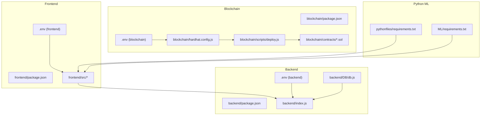
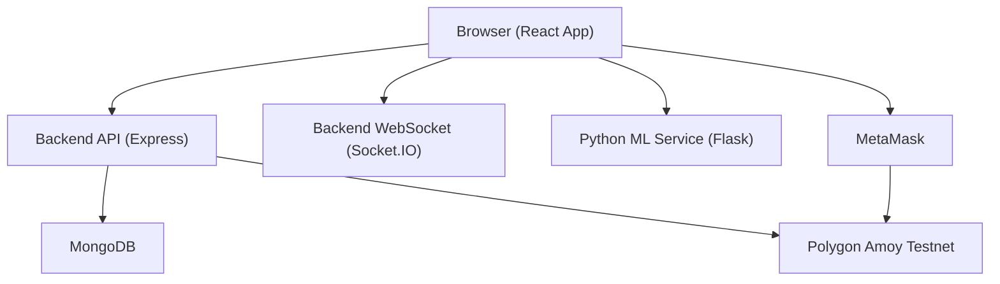
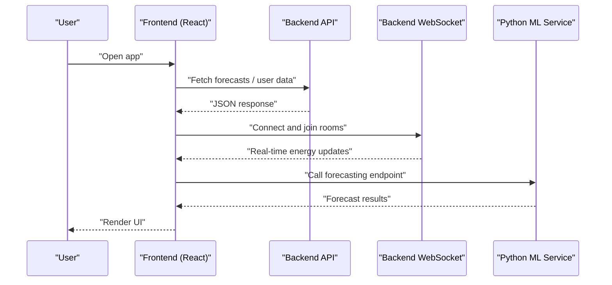
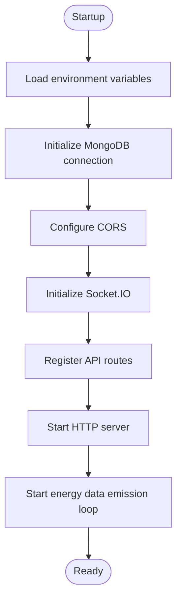
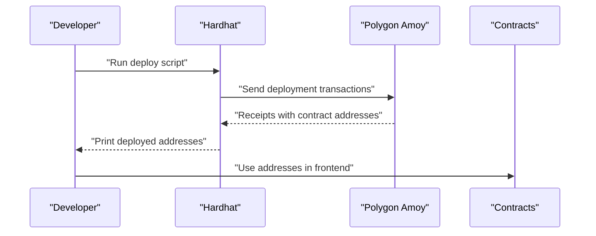
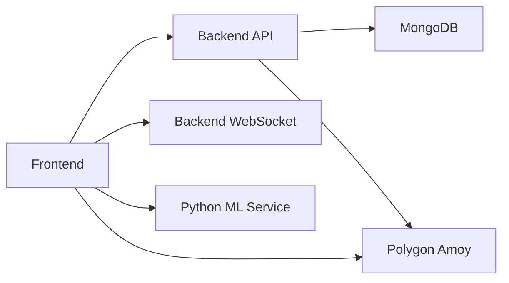

# Deployment Guide

<cite>
**Referenced Files in This Document**
- [README.md](file://README.md)
- [package.json](file://package.json)
- [backend/package.json](file://backend/package.json)
- [frontend/package.json](file://frontend/package.json)
- [blockchain/package.json](file://blockchain/package.json)
- [ML/requirements.txt](file://ML/requirements.txt)
- [pythonfiles/requirements.txt](file://pythonfiles/requirements.txt)
- [backend/.env](file://backend/.env)
- [frontend/.env](file://frontend/.env)
- [blockchain/.env](file://blockchain/.env)
- [backend/index.js](file://backend/index.js)
- [backend/DB/db.js](file://backend/DB/db.js)
- [frontend/src/services/blockchain.js](file://frontend/src/services/blockchain.js)
- [frontend/src/hooks/useBlockchain.js](file://frontend/src/hooks/useBlockchain.js)
- [blockchain/hardhat.config.js](file://blockchain/hardhat.config.js)
- [blockchain/scripts/deploy.js](file://blockchain/scripts/deploy.js)
- [blockchain/contracts/EnergyToken.sol](file://blockchain/contracts/EnergyToken.sol)
- [blockchain/contracts/EnergyExchange.sol](file://blockchain/contracts/EnergyExchange.sol)
- [blockchain/contracts/EnergyAMM.sol](file://blockchain/contracts/EnergyAMM.sol)
</cite>

## Table of Contents
1. [Introduction](#introduction)
2. [Project Structure](#project-structure)
3. [Core Components](#core-components)
4. [Architecture Overview](#architecture-overview)
5. [Detailed Component Analysis](#detailed-component-analysis)
6. [Dependency Analysis](#dependency-analysis)
7. [Performance Considerations](#performance-considerations)
8. [Troubleshooting Guide](#troubleshooting-guide)
9. [Conclusion](#conclusion)
10. [Appendices](#appendices)

## Introduction
This guide provides comprehensive deployment instructions for the EcoGrid platform, covering development setup, production deployment, and blockchain network configuration. It documents environment variables, build processes for the React frontend, Node.js backend, and Python ML service, containerization strategies, Polygon Amoy testnet deployment, wallet configuration, gas fee management, load balancing, SSL and reverse proxy setup, CI/CD integration, monitoring/logging, troubleshooting, rollback procedures, scaling, and performance optimization.

## Project Structure
The repository is organized into three primary microservices plus shared components:
- Frontend (React/Vite): User interface and blockchain interactions
- Backend (Node.js/Express): REST API, authentication, database, and WebSocket support
- Blockchain (Solidity/Hardhat): Smart contracts and deployment scripts
- Python ML service: Energy forecasting via Flask and XGBoost
- Shared root: Documentation and top-level configuration

**Diagram sources**
- [frontend/package.json](file://frontend/package.json#L1-L50)
- [backend/package.json](file://backend/package.json#L1-L29)
- [blockchain/package.json](file://blockchain/package.json#L1-L11)
- [ML/requirements.txt](file://ML/requirements.txt#L1-L4)
- [pythonfiles/requirements.txt](file://pythonfiles/requirements.txt#L1-L8)

**Section sources**
- [README.md](file://README.md#L5-L65)
- [package.json](file://package.json#L1-L6)

## Core Components
- Frontend (React/Vite)
  - Build: Vite-based React application with environment variables for API endpoints and contract addresses
  - Runtime: Ethers.js integration for Polygon Amoy testnet interactions
- Backend (Node.js/Express)
  - REST API with authentication, user profiles, marketplace, and dashboard
  - MongoDB connectivity and Socket.IO for real-time energy updates
- Blockchain (Hardhat/Polygon Amoy)
  - ERC20 energy token, exchange marketplace, and AMM liquidity pool
  - Deployment script targeting Polygon Amoy testnet
- Python ML Service
  - Flask API for energy forecasting using XGBoost and scikit-learn

Key environment variables:
- Frontend: REACT_APP_API_URL, VITE_ENERGY_* contract addresses, VITE_SOCKET_URL
- Backend: PORT, MONGO_URI, JWT_SECRET, EMAIL_* for notifications, GOOGLE_CLIENT_ID/SECRET
- Blockchain: POLYGON_AMOY_URL, PRIVATE_KEY

**Section sources**
- [frontend/package.json](file://frontend/package.json#L1-L50)
- [backend/package.json](file://backend/package.json#L1-L29)
- [blockchain/package.json](file://blockchain/package.json#L1-L11)
- [ML/requirements.txt](file://ML/requirements.txt#L1-L4)
- [pythonfiles/requirements.txt](file://pythonfiles/requirements.txt#L1-L8)
- [frontend/.env](file://frontend/.env#L1-L7)
- [backend/.env](file://backend/.env#L1-L13)
- [blockchain/.env](file://blockchain/.env#L1-L2)

## Architecture Overview
High-level runtime architecture:
- Frontend connects to backend REST API and Socket.IO server
- Frontend interacts with Polygon Amoy testnet via MetaMask and Ethers.js
- Backend persists data in MongoDB and emits real-time events via Socket.IO
- Python ML service provides forecasting endpoints consumed by the frontend

**Diagram sources**
- [backend/index.js](file://backend/index.js#L1-L97)
- [frontend/src/services/blockchain.js](file://frontend/src/services/blockchain.js#L1-L261)
- [frontend/src/hooks/useBlockchain.js](file://frontend/src/hooks/useBlockchain.js#L1-L155)
- [backend/DB/db.js](file://backend/DB/db.js#L1-L12)

## Detailed Component Analysis

### Frontend (React/Vite)
- Build process
  - Scripts: dev, build, preview, lint
  - Dependencies include React, Tailwind, Ethers.js, Socket.IO client
- Environment variables
  - REACT_APP_API_URL: Backend API base URL
  - VITE_ENERGY_TOKEN_ADDRESS, VITE_ENERGY_EXCHANGE_ADDRESS, VITE_ENERGY_AMM_ADDRESS: Contract addresses
  - VITE_SOCKET_URL: Socket.IO server URL
  - VITE_GOOGLE_CLIENT_ID: For Google OAuth
- Blockchain integration
  - Ethers.js provider/signer initialization
  - Automatic network switching to Polygon Amoy chain ID
  - Contract ABI bindings for token, exchange, and AMM
- Real-time features
  - Socket.IO client connects to backend for live energy updates

**Diagram sources**
- [frontend/src/services/blockchain.js](file://frontend/src/services/blockchain.js#L1-L261)
- [frontend/src/hooks/useBlockchain.js](file://frontend/src/hooks/useBlockchain.js#L1-L155)
- [backend/index.js](file://backend/index.js#L47-L89)

**Section sources**
- [frontend/package.json](file://frontend/package.json#L1-L50)
- [frontend/.env](file://frontend/.env#L1-L7)
- [frontend/src/services/blockchain.js](file://frontend/src/services/blockchain.js#L1-L261)
- [frontend/src/hooks/useBlockchain.js](file://frontend/src/hooks/useBlockchain.js#L1-L155)

### Backend (Node.js/Express)
- Entry point initializes Express, CORS, body parser, Socket.IO, and registers routes
- Environment variables
  - PORT: server port
  - MONGO_URI: MongoDB connection string
  - JWT_SECRET: signing secret for tokens
  - EMAIL_* and GOOGLE_* for third-party integrations
- Database connection
  - Mongoose connection handled centrally
- Real-time updates
  - Socket.IO rooms for user-specific and marketplace feeds
  - Simulated energy data emission every 10 seconds

**Diagram sources**
- [backend/index.js](file://backend/index.js#L1-L97)
- [backend/DB/db.js](file://backend/DB/db.js#L1-L12)

**Section sources**
- [backend/package.json](file://backend/package.json#L1-L29)
- [backend/.env](file://backend/.env#L1-L13)
- [backend/index.js](file://backend/index.js#L1-L97)
- [backend/DB/db.js](file://backend/DB/db.js#L1-L12)

### Blockchain (Hardhat/Polygon Amoy)
- Contracts
  - EnergyToken: ERC20-based token with dynamic pricing and energy balance tracking
  - EnergyExchange: Order book matching and trade execution
  - EnergyAMM: Automated market maker for token-to-ETH swaps
- Deployment
  - Hardhat config defines amoy network using environment variables
  - Deployment script deploys all contracts and logs addresses
- Frontend integration
  - Contract addresses loaded from Vite env vars
  - Automatic chain switching to Polygon Amoy

**Diagram sources**
- [blockchain/hardhat.config.js](file://blockchain/hardhat.config.js#L1-L12)
- [blockchain/scripts/deploy.js](file://blockchain/scripts/deploy.js#L1-L29)
- [blockchain/contracts/EnergyToken.sol](file://blockchain/contracts/EnergyToken.sol#L1-L55)
- [blockchain/contracts/EnergyExchange.sol](file://blockchain/contracts/EnergyExchange.sol#L1-L45)
- [blockchain/contracts/EnergyAMM.sol](file://blockchain/contracts/EnergyAMM.sol#L1-L24)

**Section sources**
- [blockchain/package.json](file://blockchain/package.json#L1-L11)
- [blockchain/.env](file://blockchain/.env#L1-L2)
- [blockchain/hardhat.config.js](file://blockchain/hardhat.config.js#L1-L12)
- [blockchain/scripts/deploy.js](file://blockchain/scripts/deploy.js#L1-L29)
- [frontend/.env](file://frontend/.env#L1-L7)
- [frontend/src/services/blockchain.js](file://frontend/src/services/blockchain.js#L31-L37)

### Python ML Service
- Purpose: Provide energy forecasting via Flask endpoints
- Dependencies: Flask, pandas, numpy, xgboost, matplotlib, scikit-learn
- Integration: Frontend consumes forecasting results from backend API

Build and runtime considerations:
- Use a WSGI server (e.g., gunicorn) in production
- Expose endpoints for model info and forecast generation

**Section sources**
- [pythonfiles/requirements.txt](file://pythonfiles/requirements.txt#L1-L8)
- [ML/requirements.txt](file://ML/requirements.txt#L1-L4)
- [README.md](file://README.md#L184-L188)

## Dependency Analysis
Inter-service dependencies and coupling:
- Frontend depends on Backend REST API and Socket.IO server
- Frontend depends on Python ML service for forecasting
- Backend depends on MongoDB for persistence
- Frontend depends on Polygon Amoy testnet via MetaMask
- Blockchain deployment depends on Hardhat and environment variables

**Diagram sources**
- [backend/index.js](file://backend/index.js#L1-L97)
- [frontend/src/services/blockchain.js](file://frontend/src/services/blockchain.js#L1-L261)

**Section sources**
- [backend/package.json](file://backend/package.json#L1-L29)
- [frontend/package.json](file://frontend/package.json#L1-L50)
- [blockchain/package.json](file://blockchain/package.json#L1-L11)

## Performance Considerations
- Backend
  - Optimize database queries and connection pooling
  - Use environment-specific configurations for production (e.g., larger instance sizes)
  - Enable compression and caching for API responses
- Frontend
  - Bundle and minify for production builds
  - Lazy-load heavy components
  - Debounce frequent API calls
- Blockchain
  - Batch transactions where possible
  - Monitor gas prices and adjust accordingly
- Python ML
  - Use efficient data types and vectorized operations
  - Consider model quantization or pruning for inference speed

[No sources needed since this section provides general guidance]

## Troubleshooting Guide
Common deployment issues and resolutions:
- Frontend cannot reach backend
  - Verify REACT_APP_API_URL and VITE_SOCKET_URL
  - Confirm CORS configuration in backend matches frontend origin
- Socket.IO connection failures
  - Ensure VITE_SOCKET_URL points to backend server
  - Check firewall and network policies
- MongoDB connection errors
  - Validate MONGO_URI and network access
  - Confirm database credentials and network ACLs
- Polygon Amoy deployment failures
  - Check PRIVATE_KEY and POLYGON_AMOY_URL
  - Ensure sufficient MATIC for gas fees
- Contract addresses not recognized
  - Confirm VITE_ENERGY_* variables are set post-deployment
  - Reload browser after updating environment variables
- Wallet network mismatch
  - Use automatic chain switching or instruct users to manually switch to Polygon Amoy

**Section sources**
- [frontend/.env](file://frontend/.env#L1-L7)
- [backend/.env](file://backend/.env#L1-L13)
- [blockchain/.env](file://blockchain/.env#L1-L2)
- [backend/index.js](file://backend/index.js#L29-L34)
- [frontend/src/services/blockchain.js](file://frontend/src/services/blockchain.js#L103-L130)

## Conclusion
This guide outlined a complete deployment strategy for EcoGrid across development and production environments. It covered environment configuration, build processes, containerization approaches, Polygon Amoy deployment, real-time features, and operational best practices. By following these steps, teams can reliably deploy, monitor, and scale the platform.

[No sources needed since this section summarizes without analyzing specific files]

## Appendices

### Environment Variable Reference

- Frontend (.env)
  - REACT_APP_API_URL: Base URL for backend API
  - VITE_ENERGY_TOKEN_ADDRESS: EnergyToken contract address
  - VITE_ENERGY_EXCHANGE_ADDRESS: EnergyExchange contract address
  - VITE_ENERGY_AMM_ADDRESS: EnergyAMM contract address
  - VITE_SOCKET_URL: Socket.IO server URL
  - VITE_GOOGLE_CLIENT_ID: Google OAuth client ID

- Backend (.env)
  - PORT: Server port
  - MONGO_URI: MongoDB connection string
  - JWT_SECRET: JWT signing secret
  - EMAIL_SERVICE, EMAIL_USER, EMAIL_PASSWORD: Email provider credentials
  - RECAPTCHA_SECRET_KEY: reCAPTCHA secret key
  - GOOGLE_CLIENT_ID, GOOGLE_CLIENT_SECRET: Google OAuth client secrets

- Blockchain (.env)
  - POLYGON_AMOY_URL: Polygon Amoy RPC endpoint
  - PRIVATE_KEY: Account private key for deployments

**Section sources**
- [frontend/.env](file://frontend/.env#L1-L7)
- [backend/.env](file://backend/.env#L1-L13)
- [blockchain/.env](file://blockchain/.env#L1-L2)

### Build Processes

- React Frontend
  - Install dependencies: npm install
  - Development: npm run dev
  - Production build: npm run build

- Node.js Backend
  - Install dependencies: npm install
  - Development: npm start (nodemon)

- Python ML Service
  - Install dependencies: pip install -r requirements.txt
  - Run Flask app: python app.py

**Section sources**
- [frontend/package.json](file://frontend/package.json#L6-L11)
- [backend/package.json](file://backend/package.json#L7-L9)
- [pythonfiles/requirements.txt](file://pythonfiles/requirements.txt#L1-L8)
- [ML/requirements.txt](file://ML/requirements.txt#L1-L4)

### Containerization Strategies
- Multi-stage Docker builds for React (Nginx static hosting), Node.js (node:alpine), and Python (python:3.11-slim)
- Separate containers per service with health checks
- Compose orchestration for local development and staging
- Registry push/pull for production deployments

[No sources needed since this section provides general guidance]

### Polygon Amoy Deployment and Gas Fee Management
- Deployment command: npx hardhat run scripts/deploy.js --network amoy
- Ensure MATIC balance for gas fees
- Configure PRIVATE_KEY and POLYGON_AMOY_URL securely
- After deployment, update frontend VITE_ENERGY_* variables

**Section sources**
- [README.md](file://README.md#L178-L182)
- [blockchain/hardhat.config.js](file://blockchain/hardhat.config.js#L4-L12)
- [blockchain/scripts/deploy.js](file://blockchain/scripts/deploy.js#L1-L29)
- [frontend/.env](file://frontend/.env#L1-L7)

### Load Balancing, SSL, and Reverse Proxy
- Use Nginx or HAProxy for SSL termination and load balancing across backend instances
- Route WebSocket traffic to the same backend instance for session affinity
- Serve static React assets via Nginx or CDN

[No sources needed since this section provides general guidance]

### CI/CD Pipeline Integration
- Automate testing, building, and containerization
- Deploy to staging for validation, then promote to production
- Manage secrets via environment managers or vaults
- Rollback to previous image/tag on failure

[No sources needed since this section provides general guidance]

### Monitoring and Logging
- Backend: Winston or pino for structured logs; expose metrics via Prometheus-compatible exporter
- Frontend: Error reporting via Sentry or equivalent
- Database: Monitor slow queries and replica lag
- Blockchain: Track transaction receipts and gas usage

[No sources needed since this section provides general guidance]

### Scaling Considerations
- Horizontal scaling: Stateless backend replicas behind a load balancer
- Database: Sharding and read replicas for high-traffic
- Real-time: Sticky sessions or centralized pub/sub for Socket.IO
- Storage: CDN for static assets; blob storage for media
- Python ML: Separate service with autoscaling based on forecast requests

[No sources needed since this section provides general guidance]