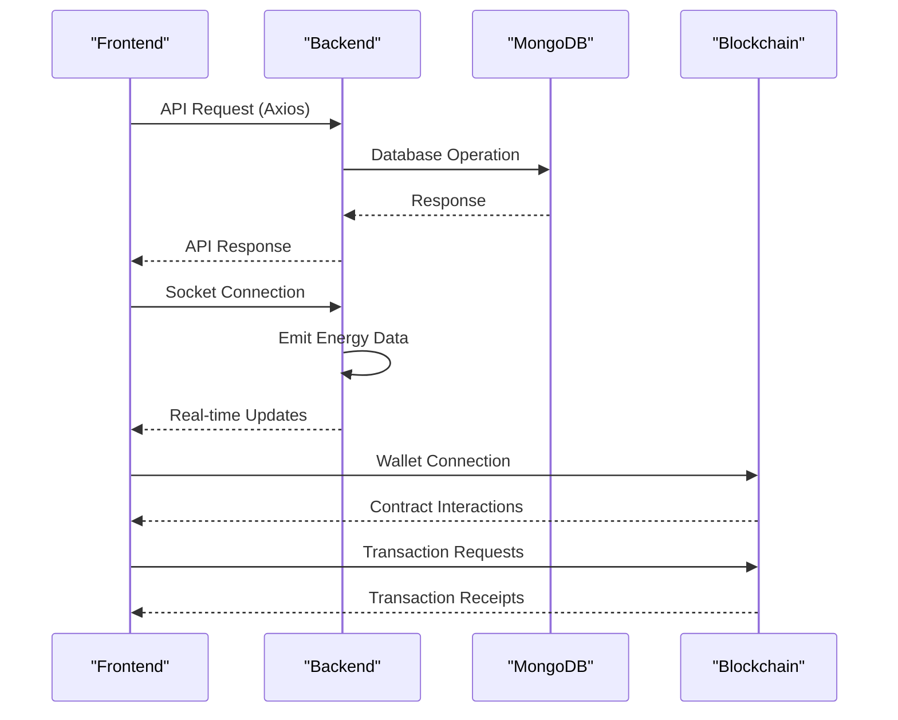
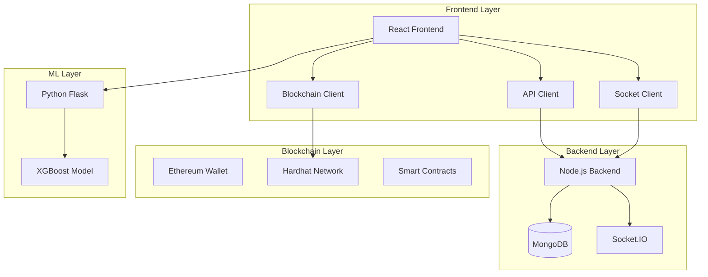

# Development Setup

<cite>
**Referenced Files in This Document**
- [README.md](file://README.md)
- [package.json](file://package.json)
- [backend/package.json](file://backend/package.json)
- [frontend/package.json](file://frontend/package.json)
- [blockchain/package.json](file://blockchain/package.json)
- [ML/requirements.txt](file://ML/requirements.txt)
- [pythonfiles/requirements.txt](file://pythonfiles/requirements.txt)
- [backend/.env](file://backend/.env)
- [frontend/.env](file://frontend/.env)
- [blockchain/.env](file://blockchain/.env)
- [backend/index.js](file://backend/index.js)
- [backend/DB/db.js](file://backend/DB/db.js)
- [blockchain/hardhat.config.js](file://blockchain/hardhat.config.js)
- [frontend/src/api.js](file://frontend/src/api.js)
- [frontend/vite.config.js](file://frontend/vite.config.js)
- [frontend/src/services/blockchain.js](file://frontend/src/services/blockchain.js)
- [frontend/src/hooks/useBlockchain.js](file://frontend/src/hooks/useBlockchain.js)
- [frontend/src/hooks/useSocket.js](file://frontend/src/hooks/useSocket.js)
</cite>

## Table of Contents
1. [Introduction](#introduction)
2. [System Requirements](#system-requirements)
3. [Installation Steps](#installation-steps)
4. [Environment Configuration](#environment-configuration)
5. [Database Setup](#database-setup)
6. [Development Server Startup](#development-server-startup)
7. [Hot Reload and Development Scripts](#hot-reload-and-development-scripts)
8. [Debugging Setup](#debugging-setup)
9. [Component Integration](#component-integration)
10. [Architecture Overview](#architecture-overview)
11. [Dependency Analysis](#dependency-analysis)
12. [Performance Considerations](#performance-considerations)
13. [Troubleshooting Guide](#troubleshooting-guide)
14. [Conclusion](#conclusion)

## Introduction
This document provides comprehensive development environment setup instructions for the EcoGrid platform. It covers system requirements, installation procedures, environment configuration, database setup, development server startup, hot reload configuration, debugging setup, and integration between components including API connectivity, real-time communication, and blockchain network simulation.

## System Requirements
- Node.js: Required for React frontend, Node.js backend, and Hardhat blockchain development
- Python: Required for the machine learning service and Flask API
- MongoDB: Required for backend user and application data storage
- Blockchain Tools: Hardhat, Ethers.js, and MetaMask for Polygon Amoy Testnet simulation
- Package managers: npm for JavaScript packages and pip for Python packages

**Section sources**
- [README.md](file://README.md#L138-L158)
- [backend/package.json](file://backend/package.json#L13-L27)
- [frontend/package.json](file://frontend/package.json#L12-L33)
- [blockchain/package.json](file://blockchain/package.json#L1-L11)
- [ML/requirements.txt](file://ML/requirements.txt#L1-L4)
- [pythonfiles/requirements.txt](file://pythonfiles/requirements.txt#L1-L8)

## Installation Steps
Follow these steps to set up the development environment:

1. Install dependencies for all components:
   - Backend: Install Node.js dependencies
   - Frontend: Install Node.js dependencies
   - Machine Learning: Install Python dependencies
   - Blockchain: Install Hardhat and related dependencies

2. Start the development servers:
   - Launch the React frontend
   - Launch the Node.js backend
   - Launch the Python Flask API
   - Deploy and interact with blockchain contracts on Polygon Amoy Testnet

3. Verify connectivity:
   - Confirm frontend can reach backend API
   - Confirm backend can connect to MongoDB
   - Confirm blockchain service can communicate with MetaMask and contracts

**Section sources**
- [README.md](file://README.md#L161-L182)
- [backend/package.json](file://backend/package.json#L7-L9)
- [frontend/package.json](file://frontend/package.json#L6-L11)
- [pythonfiles/requirements.txt](file://pythonfiles/requirements.txt#L1-L8)

## Environment Configuration
Configure environment variables for each component:

### Backend Environment Variables
- PORT: Server port (default: 8080)
- MONGO_URI: MongoDB connection string
- JWT_SECRET: Secret key for JWT token generation
- EMAIL_SERVICE: Email service provider (e.g., gmail)
- EMAIL_USER: Email account for sending emails
- EMAIL_PASSWORD: Email app-specific password
- RECAPTCHA_SECRET_KEY: Google reCAPTCHA secret key
- GOOGLE_CLIENT_ID: Google OAuth client ID
- GOOGLE_CLIENT_SECRET: Google OAuth client secret

### Frontend Environment Variables
- VITE_ENERGY_TOKEN_ADDRESS: Address of deployed EnergyToken contract
- VITE_ENERGY_EXCHANGE_ADDRESS: Address of deployed EnergyExchange contract
- VITE_ENERGY_AMM_ADDRESS: Address of deployed EnergyAMM contract
- VITE_GOOGLE_CLIENT_ID: Google OAuth client ID for frontend
- REACT_APP_API_URL: Backend API URL (default: "http://localhost:8080/api")
- REACT_APP_RECAPTCHA_SITE_KEY: Google reCAPTCHA site key
- VITE_SOCKET_URL: WebSocket server URL (default: "http://localhost:8080")

### Blockchain Environment Variables
- PRIVATE_KEY: Ethereum wallet private key for contract deployment
- POLYGON_AMOY_URL: Polygon Amoy testnet RPC URL

**Section sources**
- [backend/.env](file://backend/.env#L1-L13)
- [frontend/.env](file://frontend/.env#L1-L7)
- [blockchain/.env](file://blockchain/.env#L1-L2)

## Database Setup
MongoDB connection is configured via the backend environment variable MONGO_URI. The backend connects to MongoDB using the Mongoose ODM.

Key configuration points:
- Connection string is loaded from environment variables
- Connection logging confirms successful database connectivity
- Error handling ensures graceful failure reporting

**Section sources**
- [backend/DB/db.js](file://backend/DB/db.js#L3-L10)
- [backend/.env](file://backend/.env#L2-L2)

## Development Server Startup
Start the development servers in the following order:

### React Frontend
- Uses Vite for fast development server
- Hot module replacement enabled
- Aliases configured for clean imports

### Node.js Backend
- Express server with Socket.IO for real-time communication
- CORS configured for frontend origin
- Automatic database connection on startup

### Python Flask API
- Machine learning forecasting service
- XGBoost model integration
- RESTful endpoints for energy predictions

### Blockchain Simulation
- Hardhat network configured for Polygon Amoy Testnet
- Private key and RPC URL from environment variables
- Contract deployment scripts available

**Section sources**
- [frontend/vite.config.js](file://frontend/vite.config.js#L1-L18)
- [backend/index.js](file://backend/index.js#L14-L46)
- [blockchain/hardhat.config.js](file://blockchain/hardhat.config.js#L4-L12)

## Hot Reload and Development Scripts
Configure hot reload and development scripts for efficient development:

### Frontend Hot Reload
- Vite handles automatic browser refresh on file changes
- React Fast Refresh enabled for component updates
- Alias resolution for clean import paths

### Backend Hot Reload
- Nodemon automatically restarts server on code changes
- Development mode enables auto-reload for Node.js files

### Real-time Communication
- Socket.IO provides bidirectional event-based communication
- Rooms for user-specific and marketplace communications
- Automatic reconnection with error handling

**Section sources**
- [frontend/vite.config.js](file://frontend/vite.config.js#L8-L16)
- [backend/package.json](file://backend/package.json#L8-L8)
- [frontend/src/hooks/useSocket.js](file://frontend/src/hooks/useSocket.js#L12-L35)

## Debugging Setup
Enable debugging across all components:

### Frontend Debugging
- React DevTools recommended for component inspection
- Browser console for network and WebSocket debugging
- Environment variable logging for configuration verification

### Backend Debugging
- Console logs for connection events and errors
- Socket.IO connection lifecycle tracking
- Database connection status monitoring

### Blockchain Debugging
- MetaMask console for transaction debugging
- Hardhat console for contract interaction testing
- Network switching verification for Polygon Amoy

**Section sources**
- [frontend/src/hooks/useSocket.js](file://frontend/src/hooks/useSocket.js#L21-L34)
- [backend/index.js](file://backend/index.js#L48-L73)
- [frontend/src/services/blockchain.js](file://frontend/src/services/blockchain.js#L53-L100)

## Component Integration
Integration between components during development:

### API Connectivity
- Frontend communicates with backend via Axios
- Base URL configured through environment variables
- Google OAuth integration for authentication
- Recaptcha integration for security

### Real-time Communication
- Socket.IO enables live energy data streaming
- User-specific rooms for personalized updates
- Marketplace notifications for trading activities
- Price updates and listing modifications

### Blockchain Network Simulation
- Ethers.js for wallet connection and contract interactions
- Polygon Amoy Testnet for realistic blockchain environment
- Dynamic contract address configuration
- Wallet switching and chain change handling

**Diagram sources**
- [frontend/src/api.js](file://frontend/src/api.js#L3-L5)
- [backend/index.js](file://backend/index.js#L75-L89)
- [frontend/src/services/blockchain.js](file://frontend/src/services/blockchain.js#L52-L101)

**Section sources**
- [frontend/src/api.js](file://frontend/src/api.js#L3-L10)
- [backend/index.js](file://backend/index.js#L48-L89)
- [frontend/src/hooks/useSocket.js](file://frontend/src/hooks/useSocket.js#L12-L88)
- [frontend/src/services/blockchain.js](file://frontend/src/services/blockchain.js#L52-L130)

## Architecture Overview
The EcoGrid platform follows a microservice-like architecture with clear separation of concerns:

**Diagram sources**
- [frontend/package.json](file://frontend/package.json#L12-L33)
- [backend/package.json](file://backend/package.json#L13-L27)
- [blockchain/package.json](file://blockchain/package.json#L5-L9)
- [pythonfiles/requirements.txt](file://pythonfiles/requirements.txt#L1-L8)

## Dependency Analysis
Analyze dependencies between components:

### Frontend Dependencies
- React ecosystem for UI components
- Socket.IO client for real-time communication
- Ethers.js for blockchain interactions
- Axios for API communication

### Backend Dependencies
- Express for HTTP server
- Socket.IO for real-time features
- Mongoose for MongoDB integration
- JWT for authentication
- Nodemailer for email functionality

### Blockchain Dependencies
- Hardhat for development environment
- OpenZeppelin contracts for secure implementations
- Dotenv for environment configuration

**Section sources**
- [frontend/package.json](file://frontend/package.json#L12-L33)
- [backend/package.json](file://backend/package.json#L13-L27)
- [blockchain/package.json](file://blockchain/package.json#L5-L9)

## Performance Considerations
Optimize development performance:

### Frontend Performance
- Enable production builds for performance testing
- Monitor bundle sizes and optimize imports
- Use lazy loading for large components

### Backend Performance
- Database connection pooling configuration
- Socket.IO room management for scalability
- Caching strategies for frequently accessed data

### Blockchain Performance
- Gas optimization for testnet deployments
- Batch transaction processing
- Network selection for optimal RPC endpoints

## Troubleshooting Guide
Common development environment issues and solutions:

### Environment Variable Issues
- Verify all .env files have correct values
- Check variable names match configuration expectations
- Ensure sensitive variables are properly escaped

### Database Connection Problems
- Verify MongoDB URI is accessible
- Check network connectivity to database
- Confirm database credentials are correct

### Socket.IO Connection Failures
- Verify CORS configuration allows frontend origin
- Check firewall settings for WebSocket connections
- Ensure backend server is running on expected port

### Blockchain Connection Issues
- Verify MetaMask is installed and configured
- Check Polygon Amoy Testnet RPC URL accessibility
- Confirm private key has sufficient testnet funds

### Port Conflicts
- Change PORT environment variable if 8080 is in use
- Verify frontend development server port (5173) is available
- Check for conflicting processes on development ports

**Section sources**
- [backend/.env](file://backend/.env#L1-L13)
- [frontend/.env](file://frontend/.env#L1-L7)
- [blockchain/.env](file://blockchain/.env#L1-L2)
- [backend/index.js](file://backend/index.js#L29-L34)

## Conclusion
The EcoGrid development environment combines modern web technologies with blockchain integration. By following this setup guide, you can establish a robust development environment that supports real-time communication, machine learning capabilities, and blockchain simulation. Regular updates to dependencies, proper environment configuration, and attention to performance considerations will ensure smooth development and testing of the platform's features.