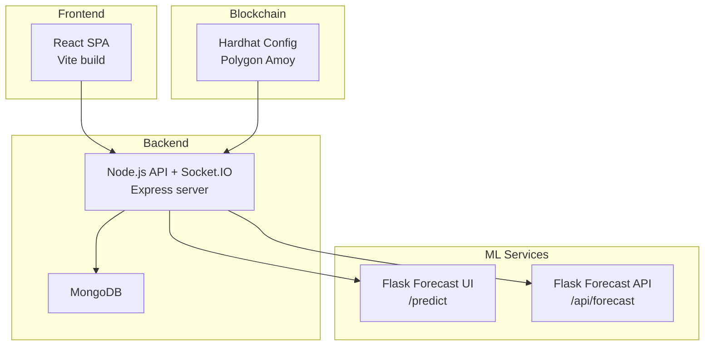
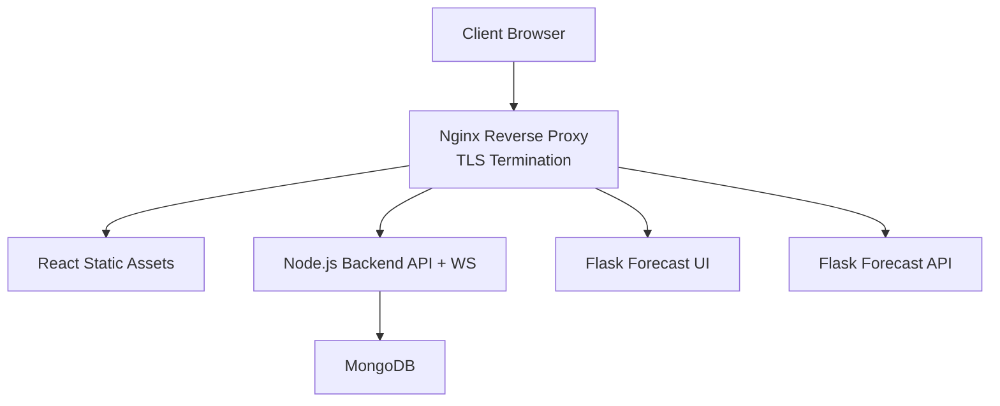
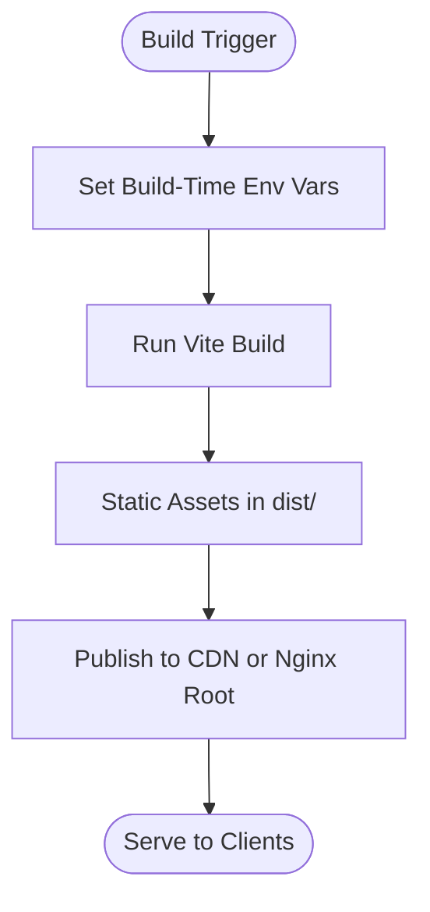
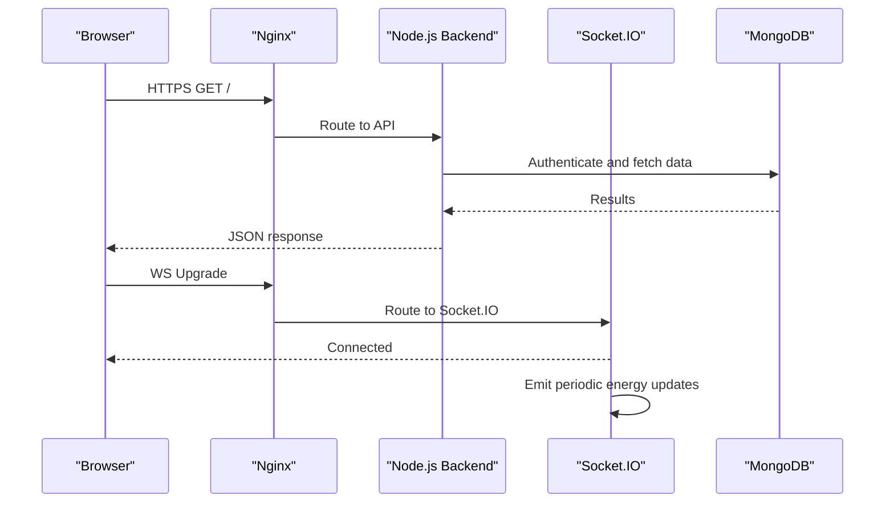
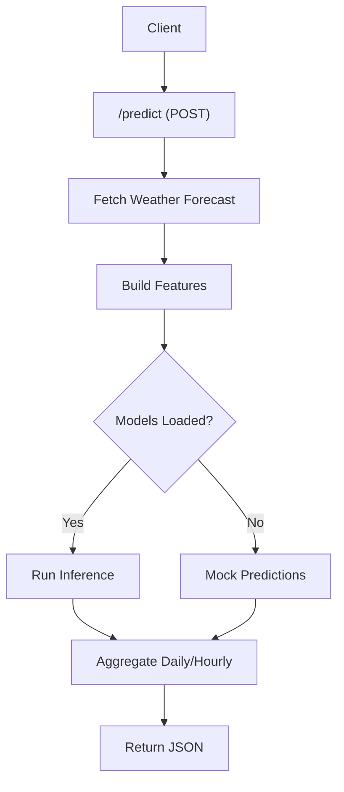
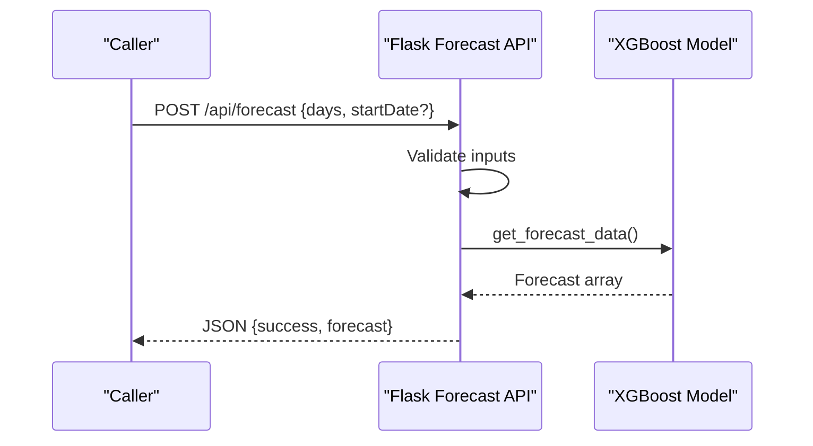
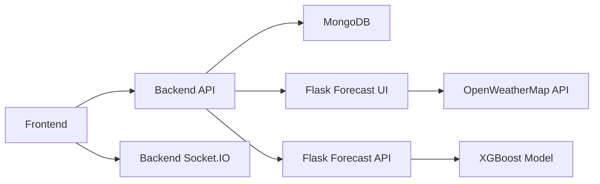

# Production Deployment

<cite>
**Referenced Files in This Document**
- [backend/package.json](file://backend/package.json)
- [backend/index.js](file://backend/index.js)
- [backend/.env](file://backend/.env)
- [backend/DB/db.js](file://backend/DB/db.js)
- [backend/Routes/AuthRouter.js](file://backend/Routes/AuthRouter.js)
- [frontend/package.json](file://frontend/package.json)
- [frontend/vite.config.js](file://frontend/vite.config.js)
- [frontend/.env](file://frontend/.env)
- [frontend/src/api.js](file://frontend/src/api.js)
- [ML/app.py](file://ML/app.py)
- [ML/templates/index.html](file://ML/templates/index.html)
- [ML/requirements.txt](file://ML/requirements.txt)
- [pythonfiles/app.py](file://pythonfiles/app.py)
- [pythonfiles/routes.py](file://pythonfiles/routes.py)
- [blockchain/hardhat.config.js](file://blockchain/hardhat.config.js)
</cite>

## Table of Contents
1. [Introduction](#introduction)
2. [Project Structure](#project-structure)
3. [Core Components](#core-components)
4. [Architecture Overview](#architecture-overview)
5. [Detailed Component Analysis](#detailed-component-analysis)
6. [Dependency Analysis](#dependency-analysis)
7. [Performance Considerations](#performance-considerations)
8. [Troubleshooting Guide](#troubleshooting-guide)
9. [Conclusion](#conclusion)
10. [Appendices](#appendices)

## Introduction
This document provides production-grade deployment guidance for the EcoGrid platform. It covers containerization strategies for the React frontend, Node.js backend, Python ML service, and MongoDB database; Kubernetes deployment manifests and service configurations; SSL/TLS and reverse proxy setup with Nginx; environment variable management for secrets and external services; optimized React build pipeline; database migration and backup strategies; monitoring and alerting; and security controls including firewall and access policies.

## Project Structure
The platform comprises:
- Frontend built with Vite/React
- Backend written in Node.js/Express with Socket.IO and MongoDB via Mongoose
- Two ML services:
  - A Flask-based service serving a weather-dependent energy forecasting UI
  - A separate Flask service exposing XGBoost-based forecasting via REST
- Blockchain configuration for Polygon Amoy testnet via Hardhat

**Diagram sources**
- [frontend/package.json](file://frontend/package.json#L1-L50)
- [backend/index.js](file://backend/index.js#L1-L97)
- [backend/DB/db.js](file://backend/DB/db.js#L1-L12)
- [ML/app.py](file://ML/app.py#L1-L251)
- [pythonfiles/app.py](file://pythonfiles/app.py#L1-L15)
- [blockchain/hardhat.config.js](file://blockchain/hardhat.config.js#L1-L12)

**Section sources**
- [frontend/package.json](file://frontend/package.json#L1-L50)
- [backend/package.json](file://backend/package.json#L1-L29)
- [ML/requirements.txt](file://ML/requirements.txt#L1-L4)

## Core Components
- React Frontend
  - Build pipeline via Vite; production build outputs static assets
  - Environment variables injected at build time via Vite config
- Node.js Backend
  - Express server with Socket.IO for real-time updates
  - MongoDB connectivity via Mongoose
  - Authentication routes wired to controllers and middleware
- Flask ML Services
  - Forecast UI service with CORS and prediction endpoint
  - Forecast API service with XGBoost model blueprint
- Blockchain
  - Hardhat configuration for Polygon Amoy with environment-backed network URL and private key

**Section sources**
- [frontend/vite.config.js](file://frontend/vite.config.js#L1-L18)
- [frontend/.env](file://frontend/.env#L1-L7)
- [backend/index.js](file://backend/index.js#L1-L97)
- [backend/DB/db.js](file://backend/DB/db.js#L1-L12)
- [backend/Routes/AuthRouter.js](file://backend/Routes/AuthRouter.js#L1-L15)
- [ML/app.py](file://ML/app.py#L1-L251)
- [pythonfiles/routes.py](file://pythonfiles/routes.py#L1-L49)
- [blockchain/hardhat.config.js](file://blockchain/hardhat.config.js#L1-L12)

## Architecture Overview
The production architecture centers on a reverse proxy (Nginx) terminating TLS and routing traffic to:
- React static assets (served by Nginx)
- Node.js backend API and WebSocket endpoints
- Flask ML services for forecasting

**Diagram sources**
- [backend/index.js](file://backend/index.js#L1-L97)
- [backend/DB/db.js](file://backend/DB/db.js#L1-L12)
- [ML/app.py](file://ML/app.py#L1-L251)
- [pythonfiles/app.py](file://pythonfiles/app.py#L1-L15)

## Detailed Component Analysis

### React Frontend Containerization and Build
- Build process
  - Use Vite to produce optimized static assets
  - Configure environment variables at build time via Vite’s define mechanism
  - Serve static assets directly from Nginx in production
- Asset bundling and minification
  - Vite handles bundling and minification during build
- CDN integration
  - Host static assets on a CDN behind the same domain or a dedicated subdomain to reduce latency
- Environment variables
  - Expose only whitelisted variables at build time; keep secrets out of client-side code
  - Runtime configuration can be provided via a small bootstrap script or API

**Diagram sources**
- [frontend/vite.config.js](file://frontend/vite.config.js#L1-L18)
- [frontend/package.json](file://frontend/package.json#L1-L50)

**Section sources**
- [frontend/vite.config.js](file://frontend/vite.config.js#L1-L18)
- [frontend/package.json](file://frontend/package.json#L1-L50)

### Node.js Backend Containerization and Real-Time Streaming
- Container image
  - Multi-stage build: compile dependencies, copy runtime, install production-only packages
- Ports and health checks
  - Expose API port and WebSocket port; configure readiness/liveness probes
- Real-time streaming
  - Socket.IO rooms for user-specific and marketplace updates
  - Emit periodic energy data to clients subscribed to the energy updates room
- CORS and origins
  - Configure allowed origins for development and production
- Database connectivity
  - Connect to MongoDB Atlas via MONGO_URI; ensure replica set and failover are configured upstream

**Diagram sources**
- [backend/index.js](file://backend/index.js#L1-L97)
- [backend/DB/db.js](file://backend/DB/db.js#L1-L12)

**Section sources**
- [backend/index.js](file://backend/index.js#L1-L97)
- [backend/DB/db.js](file://backend/DB/db.js#L1-L12)

### Flask Forecast UI Containerization
- Purpose
  - Provides a web UI for energy forecasting powered by OpenWeatherMap and TensorFlow models
- CORS and endpoints
  - Enable CORS for cross-origin requests
  - Serve index template and accept POST to /predict
- External dependencies
  - Requires OpenWeatherMap API key and model files (.h5) mounted or bundled appropriately

**Diagram sources**
- [ML/app.py](file://ML/app.py#L1-L251)

**Section sources**
- [ML/app.py](file://ML/app.py#L1-L251)
- [ML/requirements.txt](file://ML/requirements.txt#L1-L4)

### Flask Forecast API Containerization
- Purpose
  - Exposes a REST endpoint for energy forecasting using an XGBoost model
- Endpoints
  - POST /api/forecast for predictions
  - GET /api/model-info for metadata
- Data validation
  - Enforce constraints on days and startDate

**Diagram sources**
- [pythonfiles/routes.py](file://pythonfiles/routes.py#L1-L49)
- [pythonfiles/app.py](file://pythonfiles/app.py#L1-L15)

**Section sources**
- [pythonfiles/routes.py](file://pythonfiles/routes.py#L1-L49)
- [pythonfiles/app.py](file://pythonfiles/app.py#L1-L15)

### MongoDB Database
- Connectivity
  - Use MONGO_URI from environment; ensure TLS enabled and replica set configured upstream
- Monitoring and backups
  - Use managed MongoDB Atlas for automated backups, point-in-time recovery, and monitoring
- Migration
  - Use Mongoose-compatible migrations or a migration tool; validate schema changes before rollout

**Section sources**
- [backend/.env](file://backend/.env#L1-L13)
- [backend/DB/db.js](file://backend/DB/db.js#L1-L12)

### Blockchain Configuration
- Network
  - Polygon Amoy via Hardhat using environment variables for RPC URL and private key
- Security
  - Store secrets in a vault or secret manager; restrict access to CI/developers

**Section sources**
- [blockchain/hardhat.config.js](file://blockchain/hardhat.config.js#L1-L12)

## Dependency Analysis
- Frontend depends on backend API and Socket.IO for real-time updates
- Backend depends on MongoDB for persistence and on ML services for forecasts
- ML services depend on external APIs (OpenWeatherMap) and local model files
- Blockchain configuration depends on environment variables for network access

**Diagram sources**
- [frontend/src/api.js](file://frontend/src/api.js#L1-L10)
- [backend/index.js](file://backend/index.js#L1-L97)
- [backend/DB/db.js](file://backend/DB/db.js#L1-L12)
- [ML/app.py](file://ML/app.py#L1-L251)
- [pythonfiles/routes.py](file://pythonfiles/routes.py#L1-L49)

**Section sources**
- [frontend/src/api.js](file://frontend/src/api.js#L1-L10)
- [backend/Routes/AuthRouter.js](file://backend/Routes/AuthRouter.js#L1-L15)

## Performance Considerations
- Frontend
  - Enable gzip/brotli compression in Nginx; set long-lived caching headers for static assets
  - Use a CDN for global distribution
- Backend
  - Scale horizontally; enable sticky sessions only if required; offload WebSocket scaling to a compatible proxy
  - Tune Socket.IO transports and reconnection strategies
- Database
  - Use connection pooling; monitor slow queries; shard if necessary
- ML services
  - Pre-warm model loading; cache frequently requested forecasts; consider model quantization or ONNX conversion

## Troubleshooting Guide
- CORS errors
  - Verify allowed origins for both development and production
- Socket.IO disconnections
  - Check reverse proxy WebSocket upgrade settings; ensure timeouts and keepalive are configured
- MongoDB connectivity
  - Confirm MONGO_URI and network ACLs; verify TLS settings
- Flask service failures
  - Validate OpenWeatherMap API key and model file presence
- Environment variables
  - Ensure secrets are not exposed in client-side builds; use secure secret managers

**Section sources**
- [backend/index.js](file://backend/index.js#L1-L97)
- [backend/.env](file://backend/.env#L1-L13)
- [ML/app.py](file://ML/app.py#L1-L251)

## Conclusion
This guide outlines a production-ready deployment strategy for the EcoGrid platform. By containerizing each component, terminating TLS at the edge with Nginx, securing environment variables, and implementing robust monitoring and backups, the platform can achieve high availability, scalability, and security.

## Appendices

### A. SSL Certificate Configuration
- Obtain certificates from a trusted CA or ACME automation
- Configure Nginx to serve HTTPS and redirect HTTP to HTTPS
- Use strong cipher suites and modern TLS versions

### B. Reverse Proxy and Load Balancing
- Nginx as a reverse proxy terminating TLS and routing to backend and ML services
- Optionally front the platform with a cloud load balancer for high availability

### C. Environment Variable Management
- Production secrets stored in a secret manager or sealed secrets
- Frontend variables must be whitelisted at build time; avoid embedding sensitive values
- Backend variables include database URI, JWT secret, email credentials, and OAuth client secrets

**Section sources**
- [frontend/vite.config.js](file://frontend/vite.config.js#L1-L18)
- [frontend/.env](file://frontend/.env#L1-L7)
- [backend/.env](file://backend/.env#L1-L13)

### D. Build Process for Optimized React Frontend
- Use Vite build to generate static assets
- Configure CDN delivery and cache headers
- Inject only safe environment variables at build time

**Section sources**
- [frontend/package.json](file://frontend/package.json#L1-L50)
- [frontend/vite.config.js](file://frontend/vite.config.js#L1-L18)

### E. Database Migration, Backup, and Disaster Recovery
- Use managed MongoDB Atlas for automated backups and point-in-time recovery
- Perform schema migrations with validation and rollback plans
- Test DR procedures regularly and document RTO/RPO targets

**Section sources**
- [backend/DB/db.js](file://backend/DB/db.js#L1-L12)
- [backend/.env](file://backend/.env#L1-L13)

### F. Monitoring, Logging, and Alerting
- Centralize logs from containers and services
- Collect metrics (latency, throughput, error rates) and set alerts for anomalies
- Instrument the frontend, backend, and ML services

### G. Security Controls
- Firewall: allow only necessary ports (80/443 for Nginx, backend ports, ML ports)
- Network segmentation: place services in separate subnets; enforce least privilege
- Access control: enforce role-based access, rate limiting, and input validation
- Secrets: never commit secrets; use encrypted storage and rotation policies