# Authentication System

<cite>
**Referenced Files in This Document**
- [AuthContext.jsx](file://frontend/src/Context/AuthContext.jsx)
- [App.jsx](file://frontend/src/App.jsx)
- [RefreshHandler.jsx](file://frontend/src/RefreshHandler.jsx)
- [Loginpage.jsx](file://frontend/src/frontend/Loginpage.jsx)
- [RegisterPage.jsx](file://frontend/src/frontend/RegisterPage.jsx)
- [Forgotpassword.jsx](file://frontend/src/frontend/Forgotpassword.jsx)
- [GoogleSignIn.jsx](file://frontend/src/components/GoogleSignIn.jsx)
- [api.js](file://frontend/src/api.js)
- [AuthController.js](file://backend/Controllers/AuthController.js)
- [Auth.js](file://backend/Middlewares/Auth.js)
- [AuthRouter.js](file://backend/Routes/AuthRouter.js)
- [Users.js](file://backend/Models/Users.js)
- [UserProfile.js](file://backend/Models/UserProfile.js)
- [ResetCode.js](file://backend/Models/ResetCode.js)
</cite>

## Table of Contents
1. [Introduction](#introduction)
2. [Project Structure](#project-structure)
3. [Core Components](#core-components)
4. [Architecture Overview](#architecture-overview)
5. [Detailed Component Analysis](#detailed-component-analysis)
6. [Dependency Analysis](#dependency-analysis)
7. [Performance Considerations](#performance-considerations)
8. [Troubleshooting Guide](#troubleshooting-guide)
9. [Conclusion](#conclusion)

## Introduction
This document explains the authentication system for the EcoGrid platform. It covers JWT token management, session persistence, protected route handling, the authentication context provider, login/logout functionality, user state management, the registration process, password validation, email verification workflows, forgot password functionality, reset token handling, error handling strategies, loading states, user feedback mechanisms, and security considerations for token storage and transmission.

## Project Structure
The authentication system spans the frontend React application and the backend Node.js/Express server. The frontend manages user sessions, routing, and UI feedback, while the backend enforces authentication, validates tokens, and persists user data.

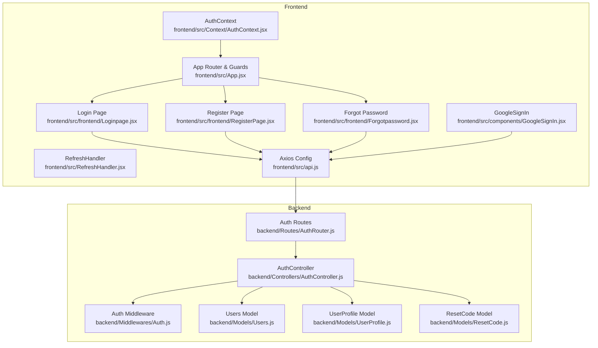

**Diagram sources**
- [AuthContext.jsx](file://frontend/src/Context/AuthContext.jsx#L1-L70)
- [App.jsx](file://frontend/src/App.jsx#L1-L79)
- [RefreshHandler.jsx](file://frontend/src/RefreshHandler.jsx#L1-L41)
- [Loginpage.jsx](file://frontend/src/frontend/Loginpage.jsx#L1-L353)
- [RegisterPage.jsx](file://frontend/src/frontend/RegisterPage.jsx#L1-L434)
- [Forgotpassword.jsx](file://frontend/src/frontend/Forgotpassword.jsx#L1-L322)
- [GoogleSignIn.jsx](file://frontend/src/components/GoogleSignIn.jsx#L1-L106)
- [api.js](file://frontend/src/api.js#L1-L10)
- [AuthController.js](file://backend/Controllers/AuthController.js#L1-L482)
- [Auth.js](file://backend/Middlewares/Auth.js#L1-L19)
- [AuthRouter.js](file://backend/Routes/AuthRouter.js#L1-L15)
- [Users.js](file://backend/Models/Users.js#L1-L32)
- [UserProfile.js](file://backend/Models/UserProfile.js#L1-L31)
- [ResetCode.js](file://backend/Models/ResetCode.js#L1-L23)

**Section sources**
- [AuthContext.jsx](file://frontend/src/Context/AuthContext.jsx#L1-L70)
- [App.jsx](file://frontend/src/App.jsx#L1-L79)
- [AuthController.js](file://backend/Controllers/AuthController.js#L1-L482)
- [Auth.js](file://backend/Middlewares/Auth.js#L1-L19)
- [AuthRouter.js](file://backend/Routes/AuthRouter.js#L1-L15)

## Core Components
- Authentication Context Provider: Initializes and maintains user session state, loads persisted tokens, and exposes authentication state to the app.
- Protected Routes: Guards private pages and redirects unauthenticated users.
- Login and Registration Pages: Handle form submission, reCAPTCHA, token storage, and onboarding.
- Forgot Password: Initiates reset code delivery and verifies reset code.
- Google Sign-In: Integrates Google OAuth to authenticate users.
- Backend Authentication Controller: Implements JWT signing, middleware verification, user CRUD, profile management, and password reset workflows.
- Models: Define Users, UserProfile, and ResetCode collections.

**Section sources**
- [AuthContext.jsx](file://frontend/src/Context/AuthContext.jsx#L1-L70)
- [App.jsx](file://frontend/src/App.jsx#L38-L47)
- [Loginpage.jsx](file://frontend/src/frontend/Loginpage.jsx#L48-L77)
- [RegisterPage.jsx](file://frontend/src/frontend/RegisterPage.jsx#L104-L126)
- [Forgotpassword.jsx](file://frontend/src/frontend/Forgotpassword.jsx#L19-L49)
- [GoogleSignIn.jsx](file://frontend/src/components/GoogleSignIn.jsx#L43-L88)
- [AuthController.js](file://backend/Controllers/AuthController.js#L105-L155)
- [Auth.js](file://backend/Middlewares/Auth.js#L3-L18)
- [Users.js](file://backend/Models/Users.js#L1-L32)
- [UserProfile.js](file://backend/Models/UserProfile.js#L1-L31)
- [ResetCode.js](file://backend/Models/ResetCode.js#L1-L23)

## Architecture Overview
The authentication flow connects frontend UI components to backend endpoints via Axios, with JWT tokens stored in browser storage and validated by middleware.

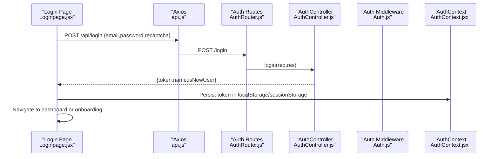

**Diagram sources**
- [Loginpage.jsx](file://frontend/src/frontend/Loginpage.jsx#L48-L77)
- [api.js](file://frontend/src/api.js#L1-L10)
- [AuthRouter.js](file://backend/Routes/AuthRouter.js#L7-L8)
- [AuthController.js](file://backend/Controllers/AuthController.js#L105-L155)
- [Auth.js](file://backend/Middlewares/Auth.js#L3-L18)
- [AuthContext.jsx](file://frontend/src/Context/AuthContext.jsx#L8-L52)

## Detailed Component Analysis

### Authentication Context Provider
- Purpose: Centralizes authentication state, loads persisted tokens, and initializes user profile retrieval.
- Token loading: Reads token from localStorage or sessionStorage; attempts to fetch user profile using Authorization header; clears invalid tokens; sets loading state.
- Exposes: isAuthenticated, user, and isLoading to the app.

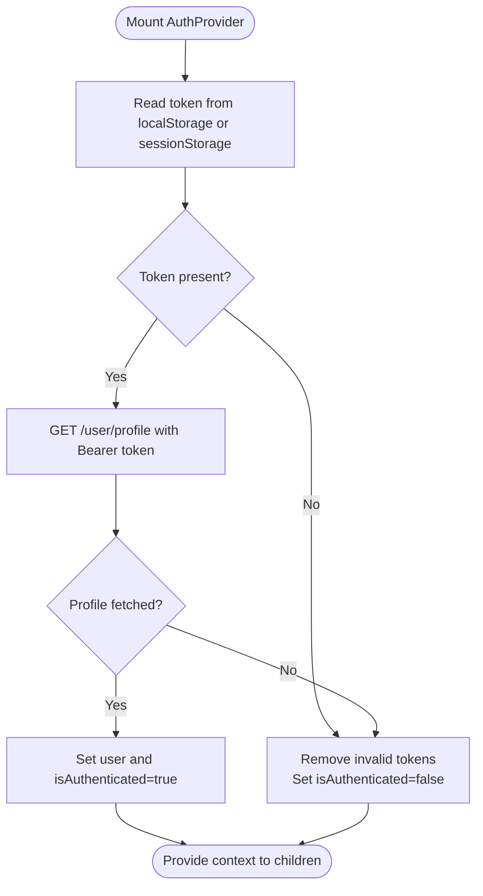

**Diagram sources**
- [AuthContext.jsx](file://frontend/src/Context/AuthContext.jsx#L17-L46)

**Section sources**
- [AuthContext.jsx](file://frontend/src/Context/AuthContext.jsx#L1-L70)

### Protected Route Handling
- PrivateRoute wrapper checks isAuthenticated; if false, shows a toast and navigates to home.
- RefreshHandler prevents navigation to login/register when authenticated and ensures redirect to dashboard.

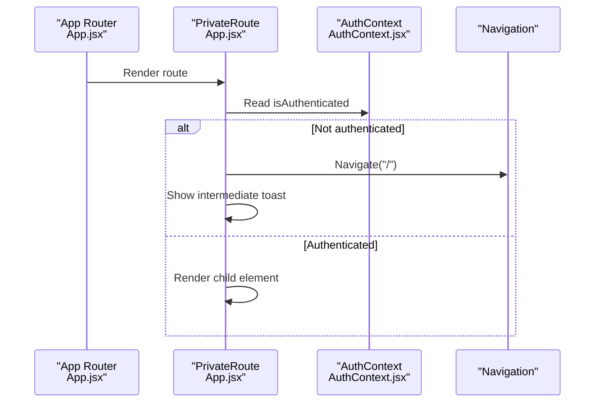

**Diagram sources**
- [App.jsx](file://frontend/src/App.jsx#L38-L47)
- [RefreshHandler.jsx](file://frontend/src/RefreshHandler.jsx#L14-L35)

**Section sources**
- [App.jsx](file://frontend/src/App.jsx#L38-L47)
- [RefreshHandler.jsx](file://frontend/src/RefreshHandler.jsx#L1-L41)

### Login and Logout Functionality
- Login:
  - Validates fields and reCAPTCHA.
  - Submits credentials to backend; stores token in localStorage or sessionStorage depending on "remember me".
  - Triggers onboarding if user is new; otherwise navigates to dashboard.
- Logout:
  - Not shown in the referenced files; typical pattern is to remove token and reset context state.

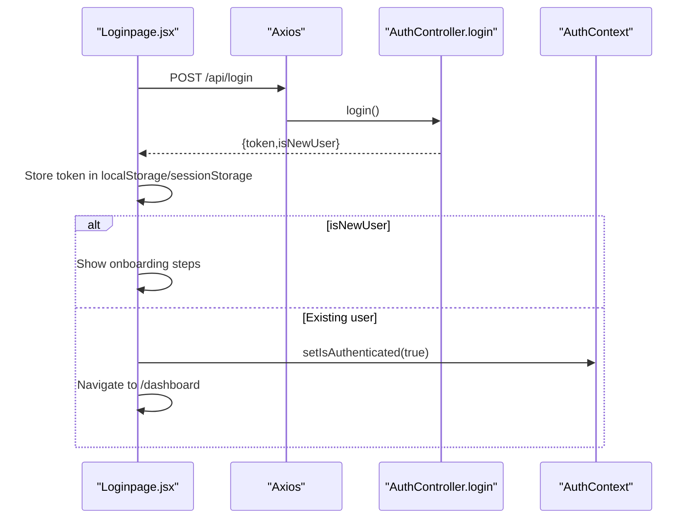

**Diagram sources**
- [Loginpage.jsx](file://frontend/src/frontend/Loginpage.jsx#L48-L77)
- [AuthController.js](file://backend/Controllers/AuthController.js#L105-L155)
- [AuthContext.jsx](file://frontend/src/Context/AuthContext.jsx#L8-L52)

**Section sources**
- [Loginpage.jsx](file://frontend/src/frontend/Loginpage.jsx#L48-L77)
- [AuthController.js](file://backend/Controllers/AuthController.js#L105-L155)

### Registration Process and Password Validation
- Registration:
  - Validates form fields and reCAPTCHA.
  - Calls backend to create user; displays success and navigates to login.
- Password validation:
  - Enforces minimum length and strength; shows real-time strength indicator.

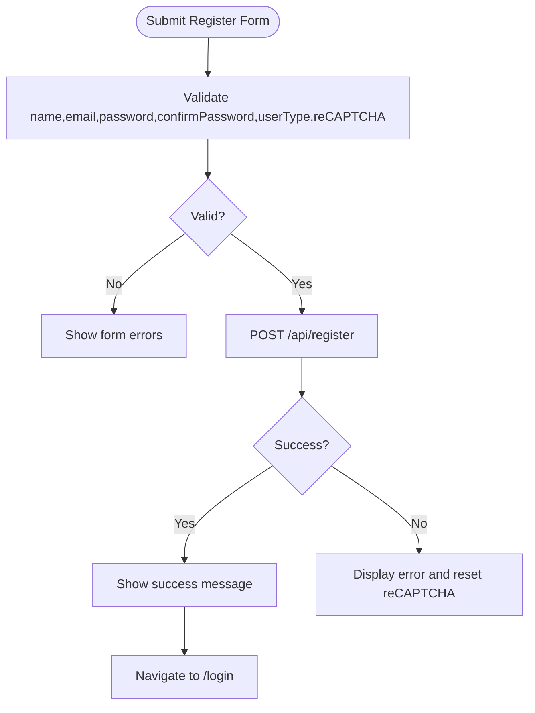

**Diagram sources**
- [RegisterPage.jsx](file://frontend/src/frontend/RegisterPage.jsx#L86-L126)

**Section sources**
- [RegisterPage.jsx](file://frontend/src/frontend/RegisterPage.jsx#L1-L434)
- [AuthController.js](file://backend/Controllers/AuthController.js#L49-L101)

### Email Verification and Password Reset Workflows
- Forgot Password Request:
  - Sends email to backend to deliver a 6-digit reset code.
- Reset Code Verification:
  - Validates code and new password; updates user’s password and deletes the reset code.

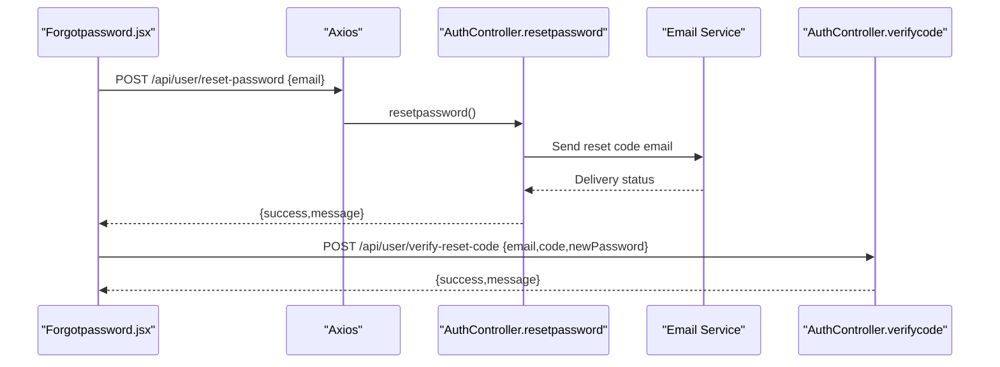

**Diagram sources**
- [Forgotpassword.jsx](file://frontend/src/frontend/Forgotpassword.jsx#L19-L49)
- [AuthController.js](file://backend/Controllers/AuthController.js#L271-L335)
- [AuthController.js](file://backend/Controllers/AuthController.js#L337-L381)

**Section sources**
- [Forgotpassword.jsx](file://frontend/src/frontend/Forgotpassword.jsx#L1-L322)
- [AuthController.js](file://backend/Controllers/AuthController.js#L271-L381)
- [ResetCode.js](file://backend/Models/ResetCode.js#L1-L23)

### Google Sign-In Integration
- Renders Google Sign-In button and handles OAuth callback.
- Posts credential to backend to authenticate; stores token and updates context.

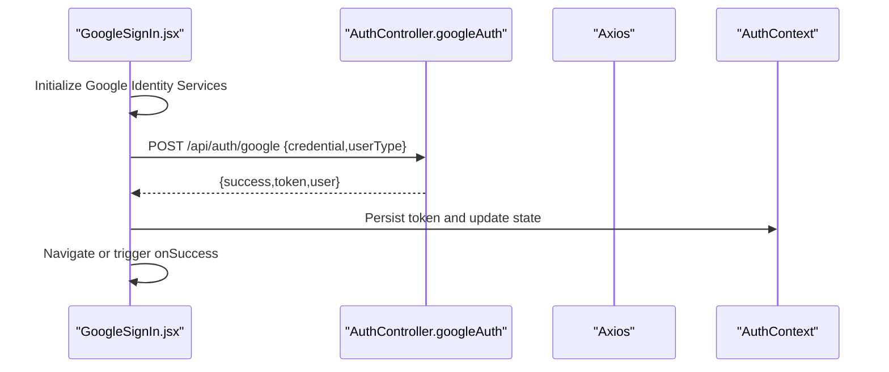

**Diagram sources**
- [GoogleSignIn.jsx](file://frontend/src/components/GoogleSignIn.jsx#L10-L88)
- [AuthController.js](file://backend/Controllers/AuthController.js#L384-L482)
- [api.js](file://frontend/src/api.js#L7-L10)

**Section sources**
- [GoogleSignIn.jsx](file://frontend/src/components/GoogleSignIn.jsx#L1-L106)
- [AuthController.js](file://backend/Controllers/AuthController.js#L384-L482)

### JWT Token Management and Session Persistence
- Token storage:
  - Login stores token in localStorage or sessionStorage based on "remember me".
  - AuthProvider reads token on startup and validates via profile fetch.
- Token transmission:
  - Frontend attaches Authorization: Bearer <token> header for protected requests.
- Backend enforcement:
  - Middleware extracts token from Authorization header and verifies with JWT secret.

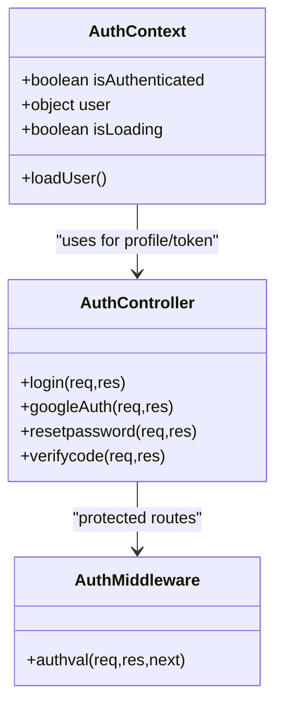

**Diagram sources**
- [AuthContext.jsx](file://frontend/src/Context/AuthContext.jsx#L7-L53)
- [AuthController.js](file://backend/Controllers/AuthController.js#L105-L155)
- [Auth.js](file://backend/Middlewares/Auth.js#L3-L18)

**Section sources**
- [AuthContext.jsx](file://frontend/src/Context/AuthContext.jsx#L17-L46)
- [Loginpage.jsx](file://frontend/src/frontend/Loginpage.jsx#L60-L61)
- [Auth.js](file://backend/Middlewares/Auth.js#L3-L18)

### User State Management
- AuthContext holds isAuthenticated, user, and isLoading.
- App-level PrivateRoute and RefreshHandler coordinate navigation and redirection.
- Onboarding flow updates user profile after login for new users.

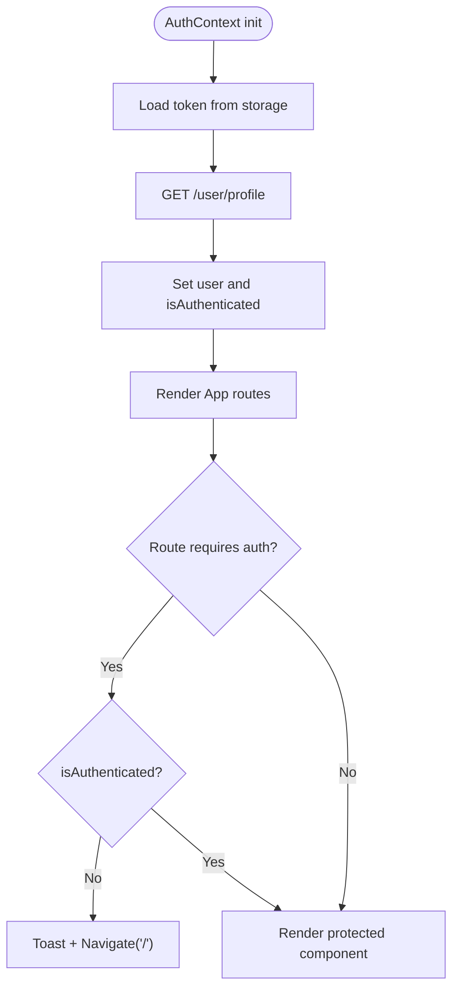

**Diagram sources**
- [AuthContext.jsx](file://frontend/src/Context/AuthContext.jsx#L17-L52)
- [App.jsx](file://frontend/src/App.jsx#L38-L47)
- [RefreshHandler.jsx](file://frontend/src/RefreshHandler.jsx#L14-L35)

**Section sources**
- [AuthContext.jsx](file://frontend/src/Context/AuthContext.jsx#L1-L70)
- [App.jsx](file://frontend/src/App.jsx#L1-L79)
- [RefreshHandler.jsx](file://frontend/src/RefreshHandler.jsx#L1-L41)

## Dependency Analysis
- Frontend depends on backend routes for authentication and profile operations.
- Backend enforces authentication via middleware and uses models for persistence.
- Google Sign-In integrates external identity services and posts to backend.

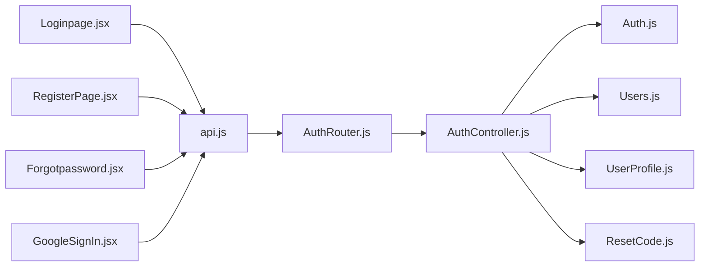

**Diagram sources**
- [Loginpage.jsx](file://frontend/src/frontend/Loginpage.jsx#L33-L36)
- [RegisterPage.jsx](file://frontend/src/frontend/RegisterPage.jsx#L16-L19)
- [Forgotpassword.jsx](file://frontend/src/frontend/Forgotpassword.jsx#L14-L17)
- [GoogleSignIn.jsx](file://frontend/src/components/GoogleSignIn.jsx#L45-L54)
- [api.js](file://frontend/src/api.js#L1-L10)
- [AuthRouter.js](file://backend/Routes/AuthRouter.js#L1-L15)
- [AuthController.js](file://backend/Controllers/AuthController.js#L1-L482)
- [Auth.js](file://backend/Middlewares/Auth.js#L1-L19)
- [Users.js](file://backend/Models/Users.js#L1-L32)
- [UserProfile.js](file://backend/Models/UserProfile.js#L1-L31)
- [ResetCode.js](file://backend/Models/ResetCode.js#L1-L23)

**Section sources**
- [AuthRouter.js](file://backend/Routes/AuthRouter.js#L1-L15)
- [AuthController.js](file://backend/Controllers/AuthController.js#L1-L482)

## Performance Considerations
- Minimize unnecessary re-renders by keeping authentication state granular and avoiding heavy computations in AuthContext.
- Debounce or throttle reCAPTCHA callbacks to reduce network churn.
- Cache user profile data locally after first fetch to avoid repeated requests.
- Use lazy loading for heavy components behind protected routes.

## Troubleshooting Guide
- Authentication fails silently:
  - Verify JWT_SECRET is set in backend environment.
  - Ensure Authorization header is attached for protected requests.
- Token not persisted:
  - Confirm localStorage/sessionStorage availability and not blocked by browser settings.
- Protected route redirects incorrectly:
  - Check PrivateRoute logic and RefreshHandler conditions.
- reCAPTCHA failures:
  - Validate site key and secret key configuration.
  - Ensure reCAPTCHA is completed before submission.
- Email delivery issues:
  - Confirm email service configuration and network connectivity.
- Password reset code expiration:
  - ResetCode expires after 1 hour; prompt users to request a new code.

**Section sources**
- [Auth.js](file://backend/Middlewares/Auth.js#L3-L18)
- [AuthContext.jsx](file://frontend/src/Context/AuthContext.jsx#L17-L46)
- [Loginpage.jsx](file://frontend/src/frontend/Loginpage.jsx#L38-L46)
- [Forgotpassword.jsx](file://frontend/src/frontend/Forgotpassword.jsx#L19-L49)
- [AuthController.js](file://backend/Controllers/AuthController.js#L263-L335)
- [ResetCode.js](file://backend/Models/ResetCode.js#L14-L18)

## Conclusion
The authentication system combines a robust backend with secure JWT-based sessions and a responsive frontend that manages user state, protected routes, and user feedback. By centralizing token handling in the context provider, enforcing middleware protection, and implementing clear workflows for registration, login, onboarding, and password reset, the system provides a secure and user-friendly experience. Adhering to the security and troubleshooting recommendations ensures reliable operation across environments.