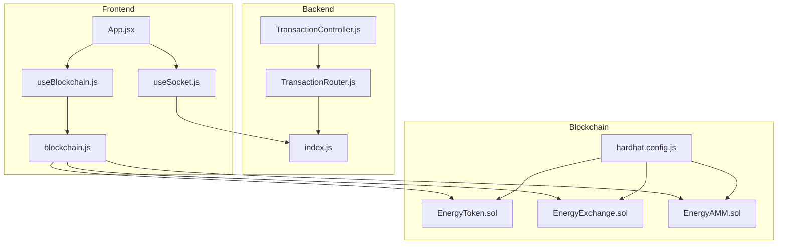
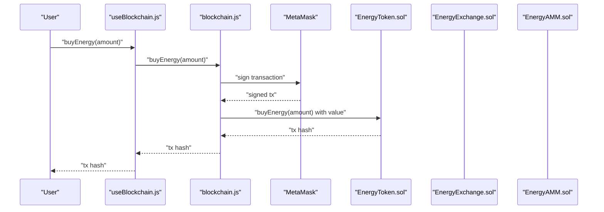
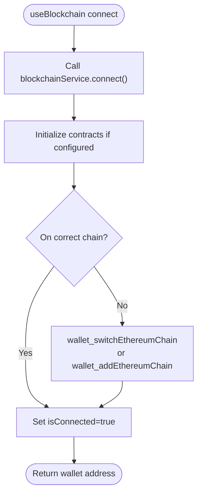
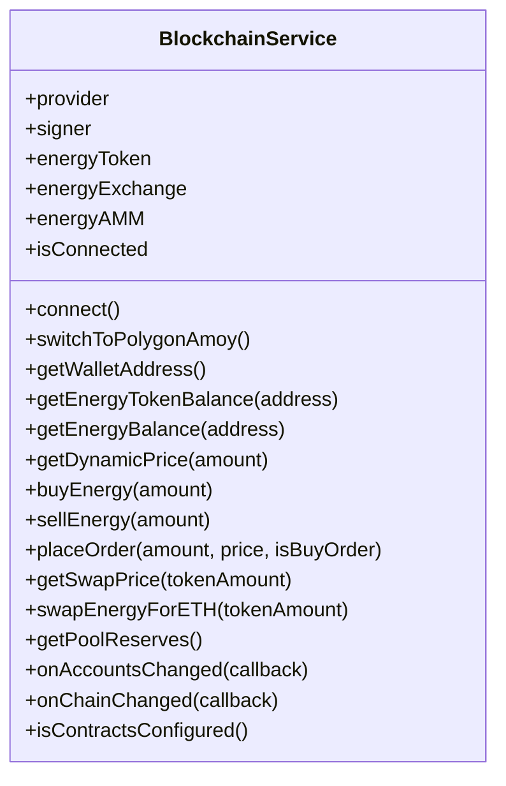
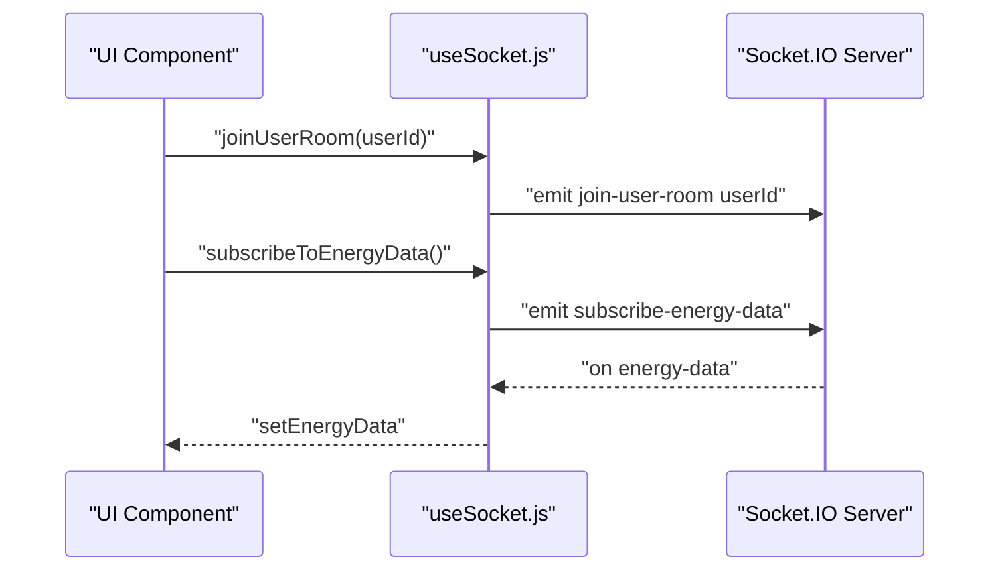
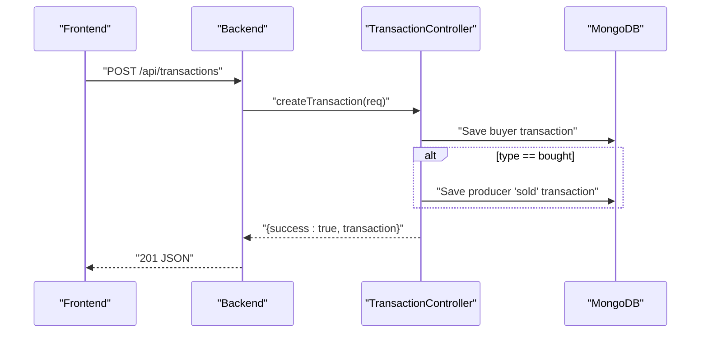
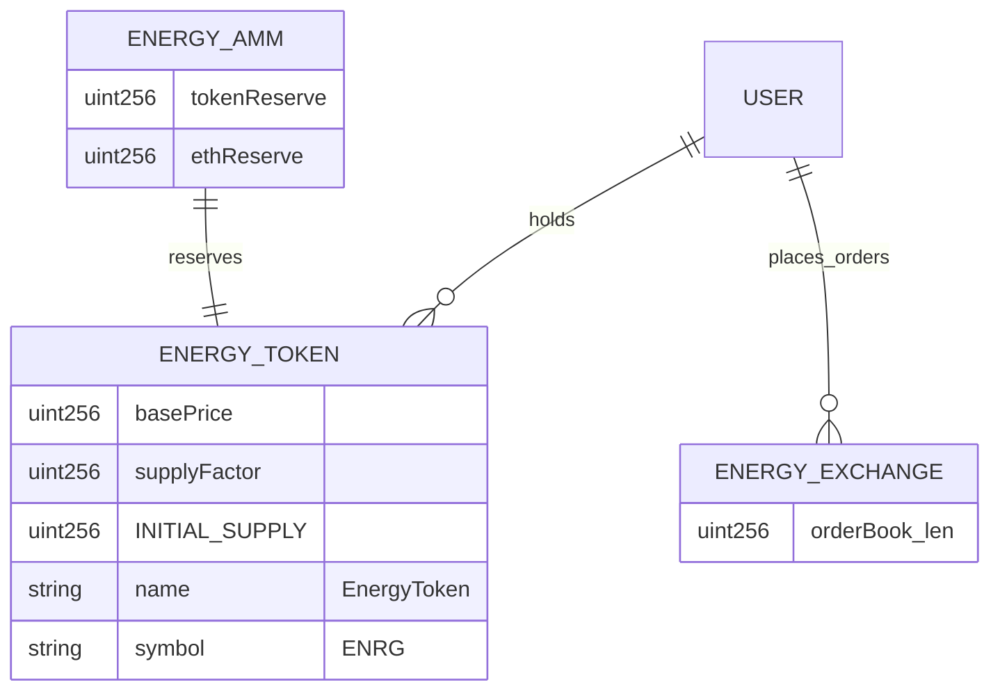
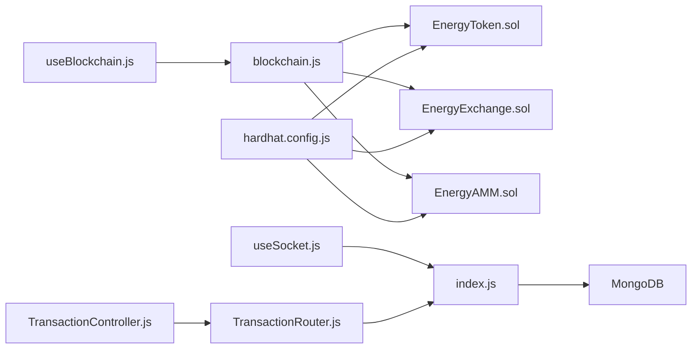

# Blockchain Integration

<cite>
**Referenced Files in This Document**
- [useBlockchain.js](file://frontend/src/hooks/useBlockchain.js)
- [blockchain.js](file://frontend/src/services/blockchain.js)
- [useSocket.js](file://frontend/src/hooks/useSocket.js)
- [TransactionController.js](file://backend/Controllers/TransactionController.js)
- [TransactionRouter.js](file://backend/Routes/TransactionRouter.js)
- [EnergyToken.sol](file://blockchain/contracts/EnergyToken.sol)
- [EnergyExchange.sol](file://blockchain/contracts/EnergyExchange.sol)
- [EnergyAMM.sol](file://blockchain/contracts/EnergyAMM.sol)
- [hardhat.config.js](file://blockchain/hardhat.config.js)
- [frontend/.env](file://frontend/.env)
- [blockchain/.env](file://blockchain/.env)
- [App.jsx](file://frontend/src/App.jsx)
- [index.js](file://backend/index.js)
</cite>

## Table of Contents
1. [Introduction](#introduction)
2. [Project Structure](#project-structure)
3. [Core Components](#core-components)
4. [Architecture Overview](#architecture-overview)
5. [Detailed Component Analysis](#detailed-component-analysis)
6. [Dependency Analysis](#dependency-analysis)
7. [Performance Considerations](#performance-considerations)
8. [Troubleshooting Guide](#troubleshooting-guide)
9. [Conclusion](#conclusion)
10. [Appendices](#appendices)

## Introduction
This document explains the blockchain integration for the EcoGrid platform. It focuses on MetaMask wallet connection, smart contract interactions, transaction management, and real-time event streaming via Socket.IO. It documents the service implementation, ABI handling, transaction signing, hook-based integration patterns, state management, error handling, network switching to Polygon Amoy Testnet, and transaction fee/gas considerations. It also outlines backend transaction persistence and the relationship between frontend hooks and backend APIs.

## Project Structure
The blockchain integration spans three layers:
- Frontend React hooks and services for wallet and contract interactions
- Smart contracts deployed on Polygon Amoy Testnet
- Backend server exposing REST endpoints and managing Socket.IO real-time events

**Diagram sources**
- [useBlockchain.js](file://frontend/src/hooks/useBlockchain.js#L1-L155)
- [blockchain.js](file://frontend/src/services/blockchain.js#L1-L261)
- [useSocket.js](file://frontend/src/hooks/useSocket.js#L1-L142)
- [App.jsx](file://frontend/src/App.jsx#L1-L79)
- [TransactionController.js](file://backend/Controllers/TransactionController.js#L1-L68)
- [TransactionRouter.js](file://backend/Routes/TransactionRouter.js#L1-L11)
- [index.js](file://backend/index.js#L1-L97)
- [EnergyToken.sol](file://blockchain/contracts/EnergyToken.sol#L1-L55)
- [EnergyExchange.sol](file://blockchain/contracts/EnergyExchange.sol#L1-L45)
- [EnergyAMM.sol](file://blockchain/contracts/EnergyAMM.sol#L1-L24)
- [hardhat.config.js](file://blockchain/hardhat.config.js#L1-L12)

**Section sources**
- [useBlockchain.js](file://frontend/src/hooks/useBlockchain.js#L1-L155)
- [blockchain.js](file://frontend/src/services/blockchain.js#L1-L261)
- [useSocket.js](file://frontend/src/hooks/useSocket.js#L1-L142)
- [App.jsx](file://frontend/src/App.jsx#L1-L79)
- [TransactionController.js](file://backend/Controllers/TransactionController.js#L1-L68)
- [TransactionRouter.js](file://backend/Routes/TransactionRouter.js#L1-L11)
- [index.js](file://backend/index.js#L1-L97)
- [EnergyToken.sol](file://blockchain/contracts/EnergyToken.sol#L1-L55)
- [EnergyExchange.sol](file://blockchain/contracts/EnergyExchange.sol#L1-L45)
- [EnergyAMM.sol](file://blockchain/contracts/EnergyAMM.sol#L1-L24)
- [hardhat.config.js](file://blockchain/hardhat.config.js#L1-L12)

## Core Components
- useBlockchain hook: Centralizes wallet connection, balances, and contract interactions. Manages loading, error, and connection state. Subscribes to MetaMask account and chain changes.
- blockchain service: Wraps Ethers.js provider/signer, initializes contracts, switches to Polygon Amoy Testnet, and executes transactions with wait-and-hash semantics.
- useSocket hook: Provides Socket.IO client lifecycle, rooms, and event subscriptions for real-time energy data and marketplace updates.
- Backend transaction controller: Persists blockchain-related trades and automatically mirrors producer-side “sold” records for buyer “bought” transactions.
- Smart contracts: EnergyToken (dynamic pricing, energy balance accounting), EnergyExchange (order book and matching), EnergyAMM (constant product market maker).

**Section sources**
- [useBlockchain.js](file://frontend/src/hooks/useBlockchain.js#L1-L155)
- [blockchain.js](file://frontend/src/services/blockchain.js#L1-L261)
- [useSocket.js](file://frontend/src/hooks/useSocket.js#L1-L142)
- [TransactionController.js](file://backend/Controllers/TransactionController.js#L1-L68)
- [EnergyToken.sol](file://blockchain/contracts/EnergyToken.sol#L1-L55)
- [EnergyExchange.sol](file://blockchain/contracts/EnergyExchange.sol#L1-L45)
- [EnergyAMM.sol](file://blockchain/contracts/EnergyAMM.sol#L1-L24)

## Architecture Overview
The system integrates frontend hooks and services with backend APIs and Socket.IO. Wallet interactions are handled client-side via MetaMask and Ethers.js. Transactions are persisted on-chain and mirrored in the backend database. Real-time updates are streamed via Socket.IO to inform users of energy metrics and marketplace activity.

**Diagram sources**
- [useBlockchain.js](file://frontend/src/hooks/useBlockchain.js#L46-L60)
- [blockchain.js](file://frontend/src/services/blockchain.js#L164-L176)
- [EnergyToken.sol](file://blockchain/contracts/EnergyToken.sol#L21-L30)

## Detailed Component Analysis

### useBlockchain Hook
- Responsibilities:
  - Manage connection state, wallet address, balances, and errors.
  - Expose actions: connect, buyEnergy, sellEnergy, placeOrder, getDynamicPrice, swapEnergyForETH, refreshBalances.
  - Subscribe to MetaMask events: accountsChanged and chainChanged.
- State management:
  - Tracks isConnected, walletAddress, tokenBalance, energyBalance, loading, error, isContractsConfigured.
- Integration patterns:
  - Delegates all blockchain operations to blockchain service.
  - Updates balances after successful transactions.
- Error handling:
  - Catches and surfaces errors from service calls; prevents operations when not connected.

**Diagram sources**
- [useBlockchain.js](file://frontend/src/hooks/useBlockchain.js#L17-L31)
- [blockchain.js](file://frontend/src/services/blockchain.js#L52-L101)
- [blockchain.js](file://frontend/src/services/blockchain.js#L103-L130)

**Section sources**
- [useBlockchain.js](file://frontend/src/hooks/useBlockchain.js#L1-L155)

### blockchain Service
- Responsibilities:
  - Provider/signer initialization via Ethers.js BrowserProvider.
  - Contract instantiation using injected ABI and environment-configured addresses.
  - Network switching to Polygon Amoy Testnet with fallback to add-chain.
  - Transaction execution with wait-and-hash semantics.
- ABI handling:
  - Minimal ABIs defined inline for token, exchange, and AMM.
- Transaction signing:
  - Uses signer from provider; transactions are awaited for receipt.
- Gas and fees:
  - Dynamic pricing and AMM swap price derived from contracts; gas is managed by MetaMask/chain.
- Real-time events:
  - Exposes onAccountsChanged and onChainChanged callbacks for UI synchronization.

**Diagram sources**
- [blockchain.js](file://frontend/src/services/blockchain.js#L42-L257)

**Section sources**
- [blockchain.js](file://frontend/src/services/blockchain.js#L1-L261)

### useSocket Hook
- Responsibilities:
  - Establish Socket.IO connection to backend.
  - Manage rooms: user-specific and marketplace.
  - Subscribe to energy data and various notifications.
  - Provide helpers to clear notifications and emit custom events.
- Backend integration:
  - Connects to the backend HTTP server hosting Socket.IO.
  - Emits join and subscribe events; listens for emitted updates.

**Diagram sources**
- [useSocket.js](file://frontend/src/hooks/useSocket.js#L90-L109)
- [index.js](file://backend/index.js#L48-L86)

**Section sources**
- [useSocket.js](file://frontend/src/hooks/useSocket.js#L1-L142)
- [index.js](file://backend/index.js#L1-L97)

### Backend Transaction Controller and Router
- Responsibilities:
  - Persist user transactions and mirror producer-side “sold” records for “bought” transactions.
  - Provide endpoint to fetch recent user transactions.
- Data model:
  - Stores userId, type (bought/sold), energyKwh, amount, listingId/title, txHash, counterparty, status.
- Authentication:
  - Requires authenticated requests via middleware.

**Diagram sources**
- [TransactionController.js](file://backend/Controllers/TransactionController.js#L18-L67)
- [TransactionRouter.js](file://backend/Routes/TransactionRouter.js#L1-L11)

**Section sources**
- [TransactionController.js](file://backend/Controllers/TransactionController.js#L1-L68)
- [TransactionRouter.js](file://backend/Routes/TransactionRouter.js#L1-L11)

### Smart Contracts
- EnergyToken.sol
  - ERC20-based token with dynamic pricing based on supply/demand.
  - Maintains per-user energyBalance and emits buy/sell events.
- EnergyExchange.sol
  - Order book with immediate matching and execution events.
- EnergyAMM.sol
  - Constant product market maker with reserve tracking and swap pricing.

**Diagram sources**
- [EnergyToken.sol](file://blockchain/contracts/EnergyToken.sol#L7-L54)
- [EnergyExchange.sol](file://blockchain/contracts/EnergyExchange.sol#L4-L44)
- [EnergyAMM.sol](file://blockchain/contracts/EnergyAMM.sol#L4-L23)

**Section sources**
- [EnergyToken.sol](file://blockchain/contracts/EnergyToken.sol#L1-L55)
- [EnergyExchange.sol](file://blockchain/contracts/EnergyExchange.sol#L1-L45)
- [EnergyAMM.sol](file://blockchain/contracts/EnergyAMM.sol#L1-L24)

## Dependency Analysis
- Frontend depends on:
  - Ethers.js for wallet and contract interactions.
  - Environment variables for contract addresses and Socket.IO URL.
- Backend depends on:
  - Socket.IO for real-time events.
  - MongoDB for transaction persistence.
- Contracts depend on:
  - Hardhat configuration for deployment to Polygon Amoy Testnet.

**Diagram sources**
- [useBlockchain.js](file://frontend/src/hooks/useBlockchain.js#L1-L3)
- [blockchain.js](file://frontend/src/services/blockchain.js#L1-L1)
- [EnergyToken.sol](file://blockchain/contracts/EnergyToken.sol#L1-L2)
- [EnergyExchange.sol](file://blockchain/contracts/EnergyExchange.sol#L1-L2)
- [EnergyAMM.sol](file://blockchain/contracts/EnergyAMM.sol#L1-L2)
- [useSocket.js](file://frontend/src/hooks/useSocket.js#L1-L2)
- [index.js](file://backend/index.js#L1-L6)
- [TransactionController.js](file://backend/Controllers/TransactionController.js#L1-L1)
- [TransactionRouter.js](file://backend/Routes/TransactionRouter.js#L1-L3)
- [hardhat.config.js](file://blockchain/hardhat.config.js#L1-L12)

**Section sources**
- [useBlockchain.js](file://frontend/src/hooks/useBlockchain.js#L1-L3)
- [blockchain.js](file://frontend/src/services/blockchain.js#L1-L1)
- [useSocket.js](file://frontend/src/hooks/useSocket.js#L1-L2)
- [index.js](file://backend/index.js#L1-L97)
- [TransactionController.js](file://backend/Controllers/TransactionController.js#L1-L68)
- [TransactionRouter.js](file://backend/Routes/TransactionRouter.js#L1-L11)
- [EnergyToken.sol](file://blockchain/contracts/EnergyToken.sol#L1-L55)
- [EnergyExchange.sol](file://blockchain/contracts/EnergyExchange.sol#L1-L45)
- [EnergyAMM.sol](file://blockchain/contracts/EnergyAMM.sol#L1-L24)
- [hardhat.config.js](file://blockchain/hardhat.config.js#L1-L12)

## Performance Considerations
- Transaction latency:
  - All operations await transaction receipt; consider UX improvements like optimistic updates and polling alternatives if needed.
- Gas optimization:
  - Dynamic pricing and AMM swap prices are computed off-chain; gas is paid by the user’s MetaMask.
- Real-time updates:
  - Socket.IO emits periodic energy data; tune intervals to balance freshness and bandwidth.
- Network stability:
  - Ensure robust fallbacks for network switching and handle frequent chain/account changes gracefully.

[No sources needed since this section provides general guidance]

## Troubleshooting Guide
- MetaMask not detected:
  - The service checks for the presence of the Ethereum provider and throws an error if missing.
- Wrong network:
  - The service attempts to switch to Polygon Amoy Testnet; if the chain is not present, it tries to add it.
- Contract not configured:
  - The service validates contract addresses before enabling operations.
- Transaction failures:
  - Errors during buy/sell/placeOrder/swap are surfaced to the UI; ensure sufficient funds and allowances where applicable.
- Socket.IO connection issues:
  - Verify backend CORS configuration and that the frontend Socket.IO URL matches the backend.

**Section sources**
- [blockchain.js](file://frontend/src/services/blockchain.js#L52-L101)
- [blockchain.js](file://frontend/src/services/blockchain.js#L103-L130)
- [blockchain.js](file://frontend/src/services/blockchain.js#L252-L256)
- [useSocket.js](file://frontend/src/hooks/useSocket.js#L12-L34)
- [index.js](file://backend/index.js#L17-L24)

## Conclusion
The blockchain integration leverages a clean separation of concerns: a reusable hook and service manage wallet and contract interactions, while Socket.IO delivers real-time updates. Backend controllers persist transactions and mirror producer records. Polygon Amoy Testnet is configured for development, with dynamic pricing and AMM swap mechanics implemented in Solidity. The design supports scalable enhancements such as advanced gas estimation, multi-chain support, and richer real-time dashboards.

[No sources needed since this section summarizes without analyzing specific files]

## Appendices

### Polygon Amoy Testnet Configuration
- Chain ID and RPC:
  - Chain ID is used for switching and adding the network.
  - RPC URL is provided for network addition.
- Environment variables:
  - Contract addresses are loaded from frontend environment variables.
  - Backend Socket.IO URL is configurable via environment.

**Section sources**
- [blockchain.js](file://frontend/src/services/blockchain.js#L39-L40)
- [blockchain.js](file://frontend/src/services/blockchain.js#L103-L130)
- [frontend/.env](file://frontend/.env#L1-L7)
- [blockchain/.env](file://blockchain/.env#L1-L2)
- [hardhat.config.js](file://blockchain/hardhat.config.js#L6-L11)

### Transaction Fee and Gas Management
- Fees:
  - Dynamic pricing in EnergyToken determines payment in ETH for purchases.
  - AMM swap price is calculated internally; ETH is transferred to the user upon swap.
- Gas:
  - Managed by MetaMask; users sign transactions with appropriate gas limits/fees.

**Section sources**
- [EnergyToken.sol](file://blockchain/contracts/EnergyToken.sol#L43-L47)
- [EnergyAMM.sol](file://blockchain/contracts/EnergyAMM.sol#L8-L20)
- [blockchain.js](file://frontend/src/services/blockchain.js#L169-L173)
- [blockchain.js](file://frontend/src/services/blockchain.js#L219-L221)

### Backend Real-Time Events
- Rooms and subscriptions:
  - User-specific room, marketplace room, and energy data subscription are supported.
- Emission cadence:
  - Periodic energy data emission simulates smart meter updates.

**Section sources**
- [index.js](file://backend/index.js#L48-L86)
- [useSocket.js](file://frontend/src/hooks/useSocket.js#L90-L109)