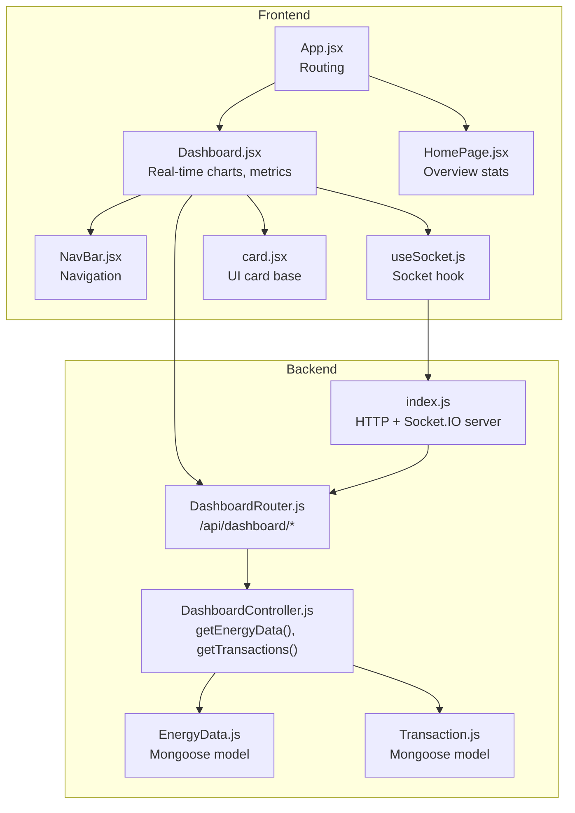
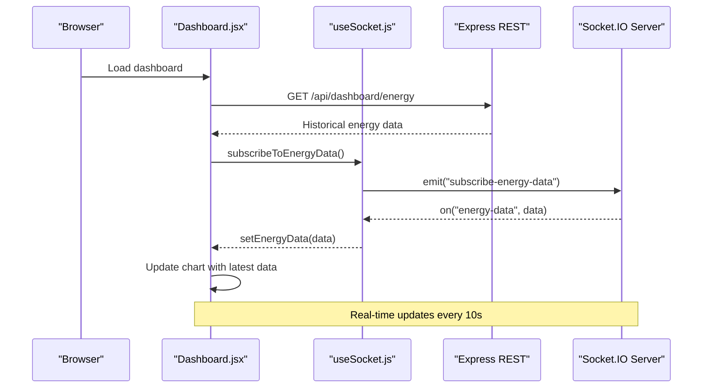
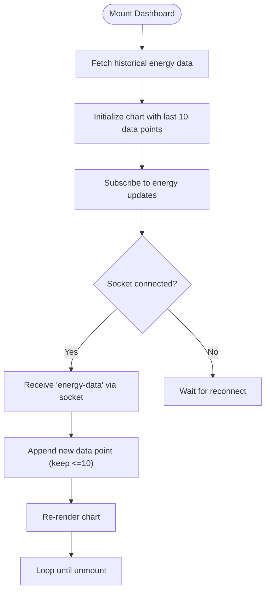
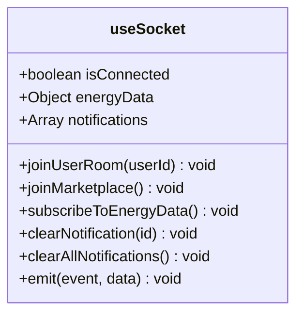
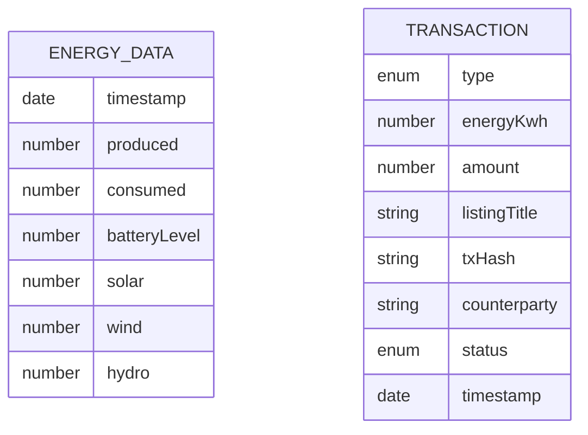
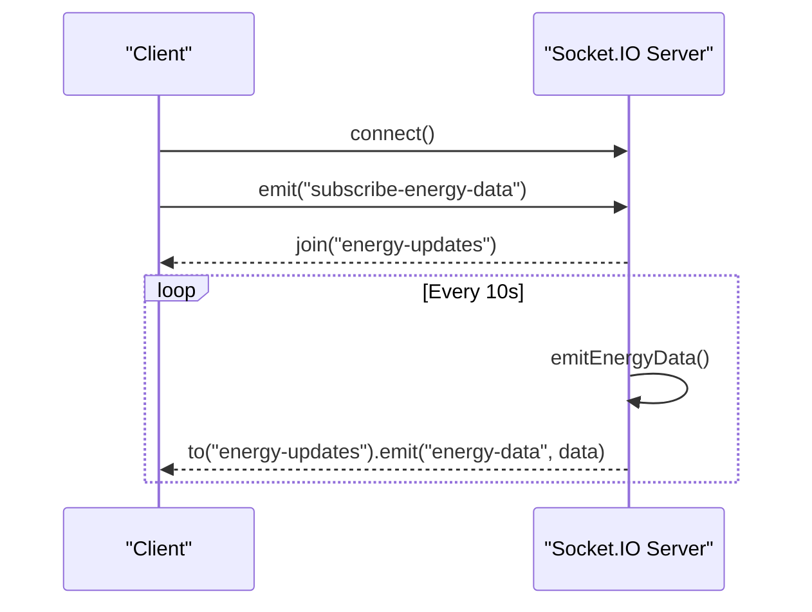
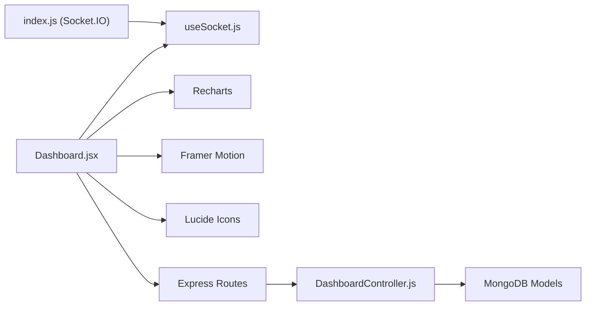

# Energy Dashboard

<cite>
**Referenced Files in This Document**
- [Dashboard.jsx](file://frontend/src/frontend/Dashboard.jsx)
- [useSocket.js](file://frontend/src/hooks/useSocket.js)
- [App.jsx](file://frontend/src/App.jsx)
- [NavBar.jsx](file://frontend/src/frontend/NavBar.jsx)
- [card.jsx](file://frontend/src/components/ui/card.jsx)
- [HomePage.jsx](file://frontend/src/frontend/HomePage.jsx)
- [DashboardController.js](file://backend/Controllers/DashboardController.js)
- [DashboardRouter.js](file://backend/Routes/DashboardRouter.js)
- [EnergyData.js](file://backend/Models/EnergyData.js)
- [Transaction.js](file://backend/Models/Transaction.js)
- [index.js](file://backend/index.js)
</cite>

## Table of Contents
1. [Introduction](#introduction)
2. [Project Structure](#project-structure)
3. [Core Components](#core-components)
4. [Architecture Overview](#architecture-overview)
5. [Detailed Component Analysis](#detailed-component-analysis)
6. [Dependency Analysis](#dependency-analysis)
7. [Performance Considerations](#performance-considerations)
8. [Troubleshooting Guide](#troubleshooting-guide)
9. [Conclusion](#conclusion)

## Introduction
This document explains the energy dashboard components and their real-time monitoring capabilities. It covers the dashboard layout, responsive design, interactive charts, data visualization, real-time updates via Socket.IO, historical data retrieval, card-based metrics, and homepage overview statistics. It also documents the homepage’s animated presentation and quick-access controls.

## Project Structure
The dashboard spans a frontend React application and a Node.js/Express backend with Socket.IO for real-time updates. The frontend routes include the dashboard, homepage, and other pages. The backend exposes REST endpoints for energy and transaction data and manages Socket.IO rooms and emissions.

**Diagram sources**
- [App.jsx](file://frontend/src/App.jsx#L54-L73)
- [Dashboard.jsx](file://frontend/src/frontend/Dashboard.jsx#L1-L556)
- [useSocket.js](file://frontend/src/hooks/useSocket.js#L1-L142)
- [NavBar.jsx](file://frontend/src/frontend/NavBar.jsx#L1-L333)
- [HomePage.jsx](file://frontend/src/frontend/HomePage.jsx#L1-L829)
- [DashboardRouter.js](file://backend/Routes/DashboardRouter.js#L1-L10)
- [DashboardController.js](file://backend/Controllers/DashboardController.js#L1-L25)
- [EnergyData.js](file://backend/Models/EnergyData.js#L1-L43)
- [Transaction.js](file://backend/Models/Transaction.js#L1-L51)
- [index.js](file://backend/index.js#L1-L97)

**Section sources**
- [App.jsx](file://frontend/src/App.jsx#L54-L73)
- [Dashboard.jsx](file://frontend/src/frontend/Dashboard.jsx#L1-L556)
- [DashboardRouter.js](file://backend/Routes/DashboardRouter.js#L1-L10)
- [DashboardController.js](file://backend/Controllers/DashboardController.js#L1-L25)
- [index.js](file://backend/index.js#L1-L97)

## Core Components
- Dashboard page with:
  - Live smart meter chart (line chart with real-time updates)
  - Power backup metrics (monthly usage, sold, purchased, wallet)
  - Energy pricing controls and comparison
  - User profile and trade statistics
  - Real-time status indicator and last-updated timestamp
- Socket hook for connection management, subscriptions, and notifications
- REST endpoints for historical energy data and transactions
- Homepage with animated hero, overview statistics, feature highlights, testimonials, and CTA

**Section sources**
- [Dashboard.jsx](file://frontend/src/frontend/Dashboard.jsx#L25-L556)
- [useSocket.js](file://frontend/src/hooks/useSocket.js#L1-L142)
- [DashboardController.js](file://backend/Controllers/DashboardController.js#L1-L25)
- [HomePage.jsx](file://frontend/src/frontend/HomePage.jsx#L1-L829)

## Architecture Overview
The dashboard integrates REST APIs and WebSocket streams:
- Frontend fetches historical energy data and user transactions on mount
- Frontend subscribes to real-time energy updates via Socket.IO
- Backend serves REST endpoints and emits periodic energy updates to clients
- Socket.IO rooms enable targeted notifications and marketplace updates

**Diagram sources**
- [Dashboard.jsx](file://frontend/src/frontend/Dashboard.jsx#L80-L125)
- [useSocket.js](file://frontend/src/hooks/useSocket.js#L104-L109)
- [DashboardRouter.js](file://backend/Routes/DashboardRouter.js#L6-L7)
- [DashboardController.js](file://backend/Controllers/DashboardController.js#L4-L15)
- [index.js](file://backend/index.js#L48-L89)

## Detailed Component Analysis

### Dashboard Page
The dashboard orchestrates:
- Real-time chart rendering using a responsive line chart
- Metrics cards for power backup, pricing, and user profile
- Live status indicator synchronized with Socket.IO connection state
- Historical data loading and real-time updates appended to the chart

**Diagram sources**
- [Dashboard.jsx](file://frontend/src/frontend/Dashboard.jsx#L80-L125)
- [useSocket.js](file://frontend/src/hooks/useSocket.js#L36-L39)

**Section sources**
- [Dashboard.jsx](file://frontend/src/frontend/Dashboard.jsx#L25-L556)

### Socket Hook (useSocket)
The hook encapsulates:
- Socket initialization with fallback transports
- Connection lifecycle events (connect, disconnect, connect_error)
- Subscription to energy data channel
- Notifications for listings, trades, and price updates
- Room joining helpers for user and marketplace contexts

**Diagram sources**
- [useSocket.js](file://frontend/src/hooks/useSocket.js#L1-L142)

**Section sources**
- [useSocket.js](file://frontend/src/hooks/useSocket.js#L1-L142)

### REST Endpoints and Data Models
- Endpoint: GET /api/dashboard/energy returns recent energy records ordered newest-first
- Endpoint: GET /api/dashboard/transactions returns recent transactions
- Models:
  - EnergyData: timestamp, produced, consumed, battery level, and renewable sources
  - Transaction: type (sold/bought), energyKwh, amount, counterparty, status, timestamp

**Diagram sources**
- [EnergyData.js](file://backend/Models/EnergyData.js#L1-L43)
- [Transaction.js](file://backend/Models/Transaction.js#L1-L51)

**Section sources**
- [DashboardController.js](file://backend/Controllers/DashboardController.js#L1-L25)
- [DashboardRouter.js](file://backend/Routes/DashboardRouter.js#L1-L10)
- [EnergyData.js](file://backend/Models/EnergyData.js#L1-L43)
- [Transaction.js](file://backend/Models/Transaction.js#L1-L51)

### Socket.IO Server
- Initializes HTTP server and Socket.IO with CORS for frontend origin
- Manages rooms: user-specific, marketplace, and energy-updates
- Emits periodic energy data snapshots to subscribed clients

**Diagram sources**
- [index.js](file://backend/index.js#L17-L89)

**Section sources**
- [index.js](file://backend/index.js#L1-L97)

### Homepage Overview
The homepage presents:
- Animated hero with floating elements and gradient sun rays
- Overview statistics counters (communities powered, cost reduction, CO₂ saved)
- Feature highlights with animated icons
- Testimonial carousel with navigation
- Call-to-action footer with links

**Section sources**
- [HomePage.jsx](file://frontend/src/frontend/HomePage.jsx#L1-L829)

### Navigation and Routing
- App routes define protected/private routes and public pages
- Navbar adapts to scroll, supports desktop/mobile menus, and handles logout
- Dashboard is accessible only when authenticated

**Section sources**
- [App.jsx](file://frontend/src/App.jsx#L38-L73)
- [NavBar.jsx](file://frontend/src/frontend/NavBar.jsx#L1-L333)

### Card-Based UI Component
The card component provides a reusable layout with header, title, description, content, and footer slots, enabling consistent metric displays across the dashboard.

**Section sources**
- [card.jsx](file://frontend/src/components/ui/card.jsx#L1-L102)

## Dependency Analysis
- Frontend depends on:
  - Recharts for responsive line charts
  - Framer Motion for animations and transitions
  - Lucide icons for visual indicators
  - Socket.IO client for real-time updates
- Backend depends on:
  - Express for HTTP routing
  - Mongoose for MongoDB models
  - Socket.IO server for real-time messaging

**Diagram sources**
- [Dashboard.jsx](file://frontend/src/frontend/Dashboard.jsx#L1-L25)
- [useSocket.js](file://frontend/src/hooks/useSocket.js#L1-L142)
- [DashboardRouter.js](file://backend/Routes/DashboardRouter.js#L1-L10)
- [DashboardController.js](file://backend/Controllers/DashboardController.js#L1-L25)
- [index.js](file://backend/index.js#L1-L97)

**Section sources**
- [Dashboard.jsx](file://frontend/src/frontend/Dashboard.jsx#L1-L25)
- [useSocket.js](file://frontend/src/hooks/useSocket.js#L1-L142)
- [DashboardRouter.js](file://backend/Routes/DashboardRouter.js#L1-L10)
- [DashboardController.js](file://backend/Controllers/DashboardController.js#L1-L25)
- [index.js](file://backend/index.js#L1-L97)

## Performance Considerations
- Keep chart data bounded (last 10 points) to minimize DOM and render overhead
- Debounce or throttle socket updates if frequency increases
- Lazy-load heavy visualizations only when the tab is active
- Use responsive containers to avoid unnecessary reflows on resize
- Cache recent transactions and profile data to reduce redundant requests

## Troubleshooting Guide
- Socket connection errors:
  - Verify frontend origin matches backend CORS configuration
  - Confirm environment variable VITE_SOCKET_URL points to the backend URL
- Real-time data not updating:
  - Ensure the client emitted subscribe-energy-data after connecting
  - Check that the server is emitting to the energy-updates room
- Historical data missing:
  - Confirm the backend endpoint returns data and is reachable
  - Validate database connectivity and model schema alignment
- Authentication redirects:
  - Ensure private routes guard access and display user-friendly messages

**Section sources**
- [useSocket.js](file://frontend/src/hooks/useSocket.js#L12-L34)
- [index.js](file://backend/index.js#L18-L24)
- [Dashboard.jsx](file://frontend/src/frontend/Dashboard.jsx#L80-L104)
- [DashboardRouter.js](file://backend/Routes/DashboardRouter.js#L6-L7)

## Conclusion
The energy dashboard combines responsive UI, real-time streaming, and historical analytics to deliver a comprehensive monitoring experience. The modular frontend components, robust Socket.IO integration, and REST endpoints provide a scalable foundation for energy production and consumption tracking, with room for future enhancements such as dynamic pricing and expanded marketplace notifications.