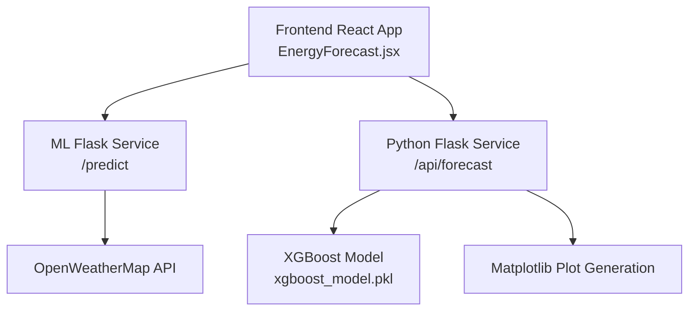
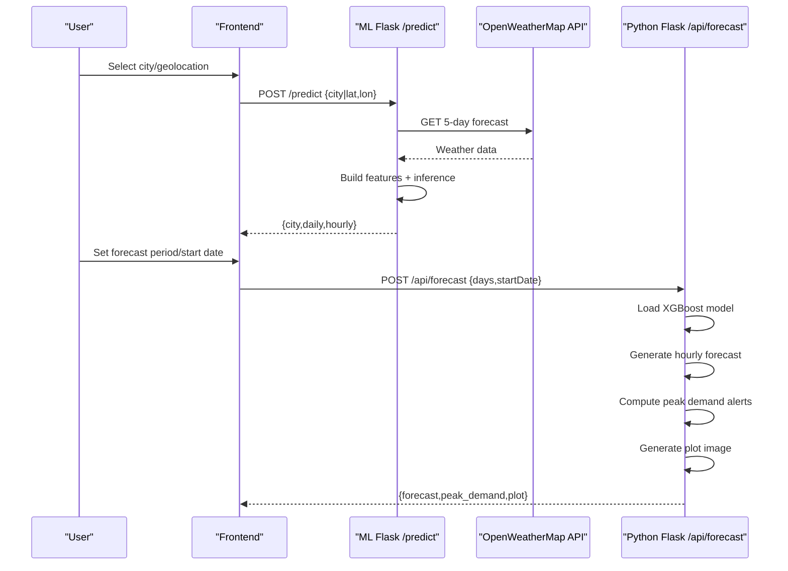
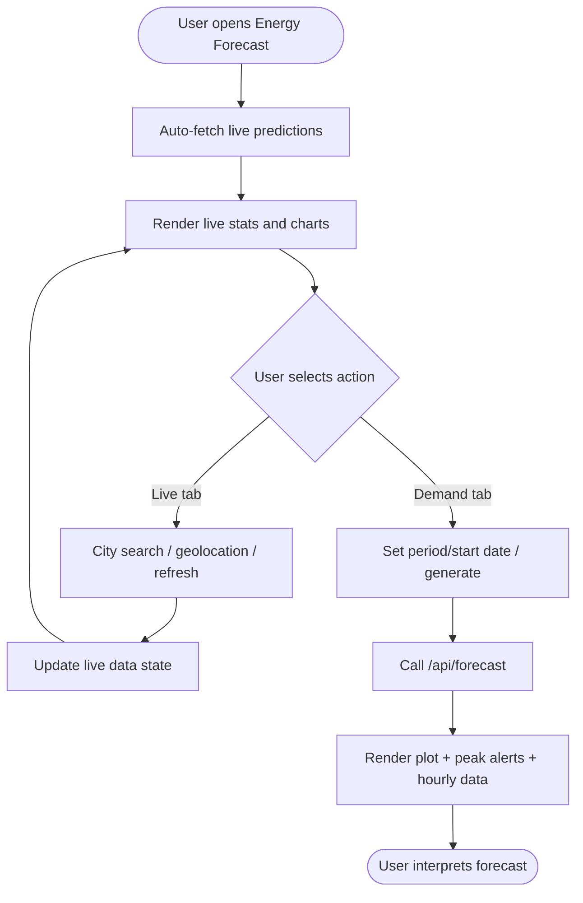
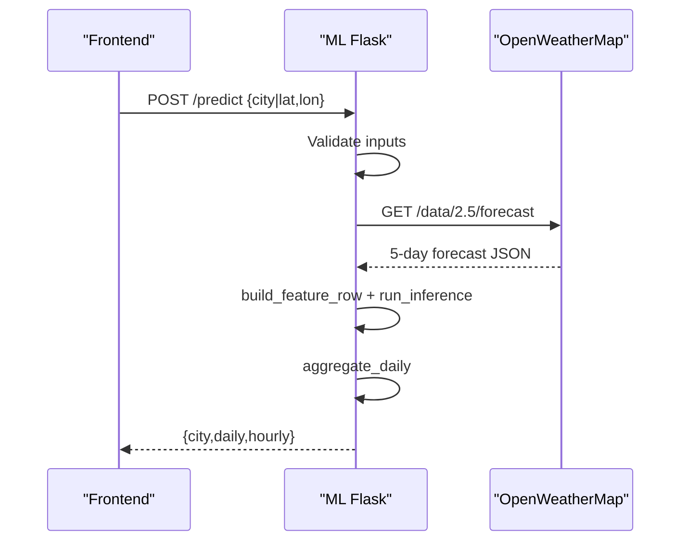
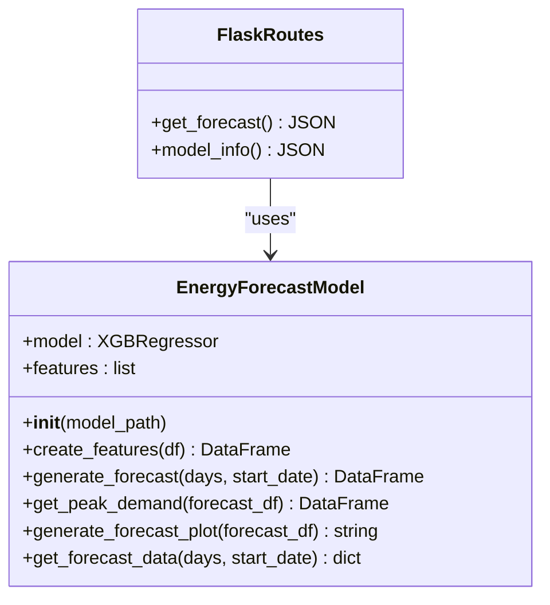
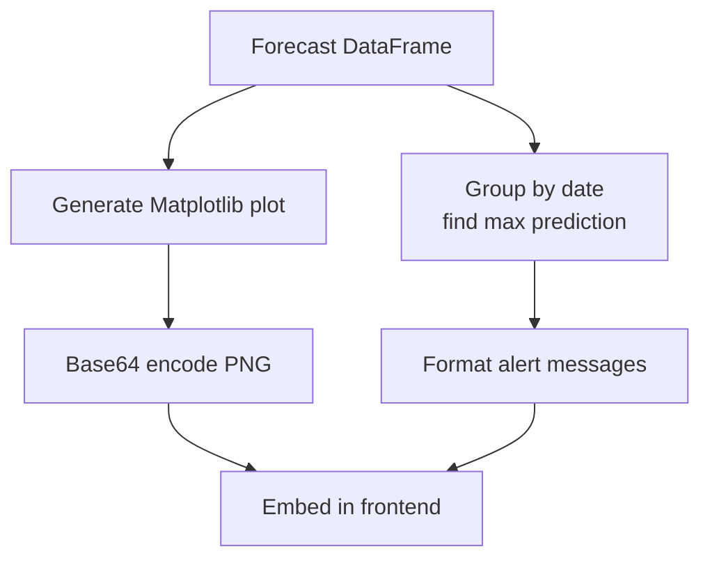
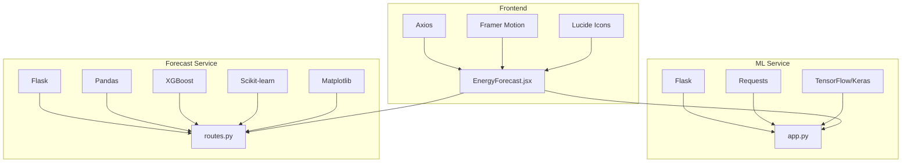

# Energy Forecasting Interface

<cite>
**Referenced Files in This Document**
- [EnergyForecast.jsx](file://frontend/src/frontend/EnergyForecast.jsx)
- [app.py](file://ML/app.py)
- [routes.py](file://pythonfiles/routes.py)
- [model.py](file://pythonfiles/model.py)
- [app.py](file://pythonfiles/app.py)
- [index.html](file://ML/templates/index.html)
- [requirements.txt](file://ML/requirements.txt)
- [requirements.txt](file://pythonfiles/requirements.txt)
- [package.json](file://frontend/package.json)
- [package.json](file://backend/package.json)
</cite>

## Table of Contents
1. [Introduction](#introduction)
2. [Project Structure](#project-structure)
3. [Core Components](#core-components)
4. [Architecture Overview](#architecture-overview)
5. [Detailed Component Analysis](#detailed-component-analysis)
6. [Dependency Analysis](#dependency-analysis)
7. [Performance Considerations](#performance-considerations)
8. [Troubleshooting Guide](#troubleshooting-guide)
9. [Conclusion](#conclusion)

## Introduction
This document explains the energy forecasting interface integration, covering XGBoost model integration, prediction visualization components, and peak demand analysis features. It documents forecasting request handling, data preprocessing, and result rendering. It also details customizable forecast periods, prediction confidence intervals, historical comparison features, real-time forecast updates, model information display, and export capabilities. The document outlines API integration patterns, error handling for forecasting requests, and user interaction patterns for forecast interpretation.

## Project Structure
The system comprises:
- Frontend React application with a dedicated Energy Forecast page
- Two backend services:
  - ML service (Flask) for live weather-driven predictions
  - Python forecasting service (Flask) for XGBoost-based demand forecasts
- Shared visualization utilities and configuration

**Diagram sources**
- [EnergyForecast.jsx](file://frontend/src/frontend/EnergyForecast.jsx#L100-L173)
- [app.py](file://ML/app.py#L195-L247)
- [routes.py](file://pythonfiles/routes.py#L13-L42)
- [model.py](file://pythonfiles/model.py#L12-L120)

**Section sources**
- [EnergyForecast.jsx](file://frontend/src/frontend/EnergyForecast.jsx#L80-L173)
- [app.py](file://ML/app.py#L1-L251)
- [routes.py](file://pythonfiles/routes.py#L1-L49)
- [model.py](file://pythonfiles/model.py#L1-L128)

## Core Components
- Frontend Energy Forecast Page
  - Handles live predictions and demand forecasts
  - Manages tabs for "Live ML Predictions" and "Demand Forecast"
  - Implements city selection, geolocation detection, and manual refresh
  - Renders statistics, charts, and tabular data
- ML Flask Service
  - Accepts city or coordinates, fetches 5-day weather forecast
  - Builds feature vectors and runs inference using Keras models
  - Aggregates hourly predictions into daily summaries
  - Returns structured JSON for the frontend
- Python Forecast Flask Service
  - Accepts forecast period and optional start date
  - Uses XGBoost model to generate hourly forecasts
  - Computes peak demand alerts and generates plots
  - Returns forecast data, peak alerts, and plot images

**Section sources**
- [EnergyForecast.jsx](file://frontend/src/frontend/EnergyForecast.jsx#L80-L715)
- [app.py](file://ML/app.py#L195-L247)
- [routes.py](file://pythonfiles/routes.py#L13-L42)
- [model.py](file://pythonfiles/model.py#L12-L120)

## Architecture Overview
The frontend integrates with two Flask services:
- Live predictions endpoint: POST /predict (ML service)
- Demand forecast endpoint: POST /api/forecast (Python forecasting service)

**Diagram sources**
- [EnergyForecast.jsx](file://frontend/src/frontend/EnergyForecast.jsx#L103-L173)
- [app.py](file://ML/app.py#L195-L247)
- [routes.py](file://pythonfiles/routes.py#L13-L42)

## Detailed Component Analysis

### Frontend: Energy Forecast Page
- State Management
  - Live predictions: city, geolocation, live data, loading/error states
  - Demand forecast: period, start date, forecast data, loading/error states
  - Tab switching between live and demand views
- API Integration
  - Live predictions: POST http://localhost:5000/predict
  - Demand forecast: POST http://localhost:5001/api/forecast
- Rendering
  - Stat cards for current production, demand, surplus, and price
  - 7-day mini-bar charts for production and demand
  - Daily and hourly tables with animations
  - Demand forecast plot and peak demand alerts
- Interactions
  - City search with predefined suggestions
  - Geolocation detection with loading/error feedback
  - Manual refresh and tab navigation
  - Toggle for hourly breakdown visibility

**Diagram sources**
- [EnergyForecast.jsx](file://frontend/src/frontend/EnergyForecast.jsx#L80-L715)

**Section sources**
- [EnergyForecast.jsx](file://frontend/src/frontend/EnergyForecast.jsx#L80-L715)

### ML Flask Service: Live Predictions
- Endpoint: POST /predict
- Request: city or lat/lon
- Workflow:
  - Validate inputs
  - Fetch 5-day forecast from OpenWeatherMap
  - Build feature vectors per hour
  - Run inference using Keras models (demand, produced, price)
  - Aggregate hourly results into daily averages
  - Return structured JSON with city info, daily, and hourly arrays
- Error Handling:
  - HTTP 400 for invalid city or missing inputs
  - HTTP 404 for city not found
  - HTTP 500 for API errors or internal failures

**Diagram sources**
- [app.py](file://ML/app.py#L195-L247)

**Section sources**
- [app.py](file://ML/app.py#L195-L247)

### Python Forecast Flask Service: XGBoost Integration
- Endpoint: POST /api/forecast
- Request: days (1–30), startDate (optional)
- Workflow:
  - Validate and parse days and optional start date
  - Instantiate EnergyForecastModel and load XGBoost model
  - Generate hourly forecast DataFrame with engineered features
  - Compute peak demand per day and format alert messages
  - Generate plot image and encode as base64
  - Return forecast records, peak alerts, and plot image
- Model Features:
  - dayofyear, hour, dayofweek, quarter, month, year
- Peak Demand Analysis:
  - Identifies hourly peak per date
  - Produces formatted alert messages for UI display

**Diagram sources**
- [model.py](file://pythonfiles/model.py#L12-L120)
- [routes.py](file://pythonfiles/routes.py#L13-L42)

**Section sources**
- [routes.py](file://pythonfiles/routes.py#L13-L42)
- [model.py](file://pythonfiles/model.py#L12-L120)

### Visualization Components
- Live Predictions
  - Mini-bar charts for 7-day production and demand
  - Animated stat cards with trends
  - Daily and hourly tables with hover effects
- Demand Forecast
  - Plot image embedded as base64 PNG
  - Peak demand alert banners
  - Optional hourly data table toggle

**Diagram sources**
- [model.py](file://pythonfiles/model.py#L46-L98)

**Section sources**
- [EnergyForecast.jsx](file://frontend/src/frontend/EnergyForecast.jsx#L620-L696)
- [model.py](file://pythonfiles/model.py#L67-L98)

### Historical Comparison and Confidence Intervals
- Historical Comparison
  - Daily aggregation from hourly predictions enables multi-day comparisons
  - Frontend displays 7-day rolling windows for production and demand
- Confidence Intervals
  - Current implementation does not expose explicit confidence bands
  - Recommendation: Extend model to output quantiles or bootstrap predictions for uncertainty bounds

**Section sources**
- [app.py](file://ML/app.py#L95-L114)
- [EnergyForecast.jsx](file://frontend/src/frontend/EnergyForecast.jsx#L185-L193)

### Real-time Updates and Model Information
- Real-time Updates
  - Manual refresh via Predict button
  - Auto-fetch on initial load
  - Geolocation-based updates
- Model Information
  - Separate endpoint exposes model metadata (features, description)
  - Can be integrated to display model capabilities and assumptions

**Section sources**
- [EnergyForecast.jsx](file://frontend/src/frontend/EnergyForecast.jsx#L175-L178)
- [routes.py](file://pythonfiles/routes.py#L43-L49)

### Export Capabilities
- Current Implementation
  - Plot images are embedded as base64 within the response
  - No explicit export endpoint for CSV or PDF
- Recommendations
  - Add endpoints to download forecast data and plots
  - Support CSV export of hourly records and peak alerts

**Section sources**
- [routes.py](file://pythonfiles/routes.py#L13-L42)
- [model.py](file://pythonfiles/model.py#L100-L120)

## Dependency Analysis
- Frontend Dependencies
  - React, Framer Motion, Lucide icons, Axios for API calls
  - Tailwind CSS for styling
- Backend Dependencies
  - ML service: Flask, Flask-CORS, NumPy, Requests, TensorFlow/Keras
  - Forecast service: Flask, Pandas, NumPy, XGBoost, Matplotlib, Scikit-learn

**Diagram sources**
- [package.json](file://frontend/package.json#L12-L32)
- [requirements.txt](file://ML/requirements.txt#L1-L4)
- [requirements.txt](file://pythonfiles/requirements.txt#L1-L8)

**Section sources**
- [package.json](file://frontend/package.json#L12-L32)
- [requirements.txt](file://ML/requirements.txt#L1-L4)
- [requirements.txt](file://pythonfiles/requirements.txt#L1-L8)

## Performance Considerations
- Model Loading
  - Lazy-loading of Keras models in ML service prevents startup delays
  - XGBoost model is loaded once per request in forecast service
- Data Processing
  - Feature engineering and inference occur server-side
  - Matplotlib plot generation uses non-interactive backend for headless environments
- Network
  - OpenWeatherMap requests are timed out after 10 seconds
  - CORS enabled for cross-origin frontend access
- Scalability
  - Consider caching frequent city forecasts
  - Use asynchronous workers for long-running forecast computations

[No sources needed since this section provides general guidance]

## Troubleshooting Guide
- Live Prediction Errors
  - Invalid city or missing coordinates: HTTP 400 with error message
  - City not found: HTTP 404
  - API key issues or network errors: HTTP 500
- Forecast Errors
  - Invalid days range (must be 1–30): HTTP 400
  - Invalid date format: HTTP 400
  - Internal exceptions: HTTP 500
- Frontend UX
  - Loading indicators during fetches
  - Clear error banners with actionable messages
  - Disabled controls during requests to prevent duplicate submissions

**Section sources**
- [app.py](file://ML/app.py#L205-L215)
- [routes.py](file://pythonfiles/routes.py#L19-L41)
- [EnergyForecast.jsx](file://frontend/src/frontend/EnergyForecast.jsx#L329-L339)
- [EnergyForecast.jsx](file://frontend/src/frontend/EnergyForecast.jsx#L590-L600)

## Conclusion
The energy forecasting interface integrates two Flask services to deliver real-time predictions and XGBoost-based demand forecasts. The frontend provides an intuitive UI for selecting locations, viewing live energy metrics, and interpreting demand forecasts with peak alerts and plots. While the current implementation focuses on deterministic forecasts, extending it with confidence intervals and export capabilities would further enhance usability for operational planning.