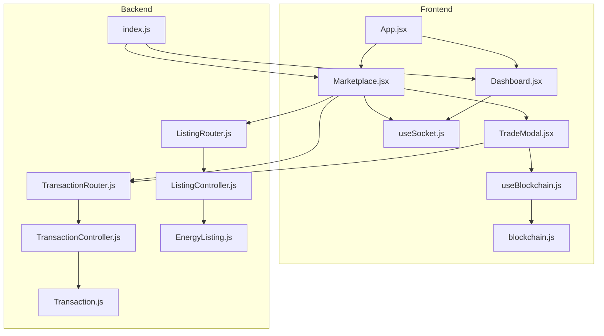
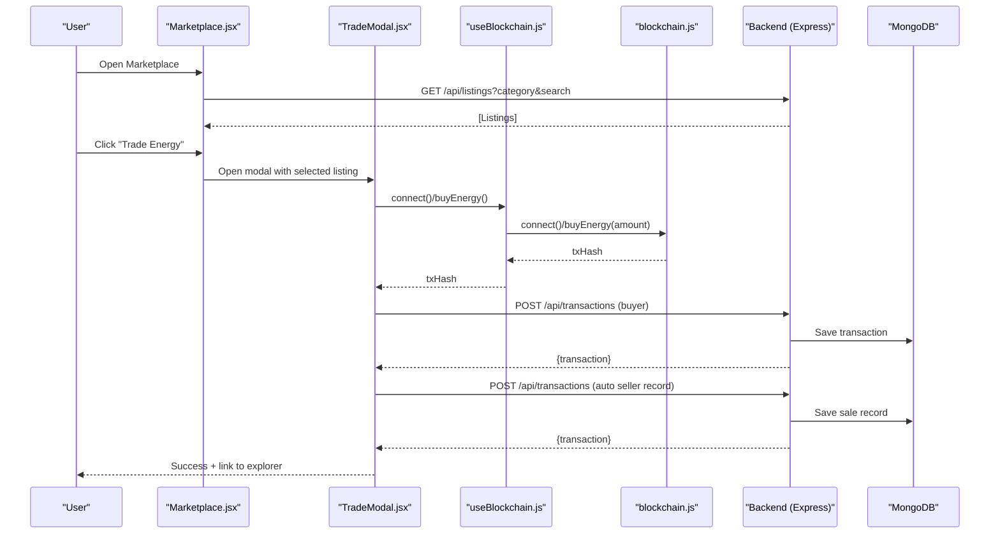
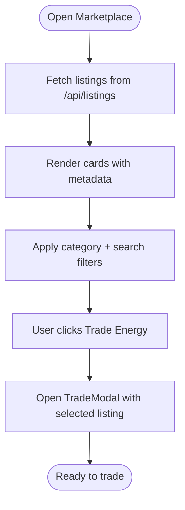
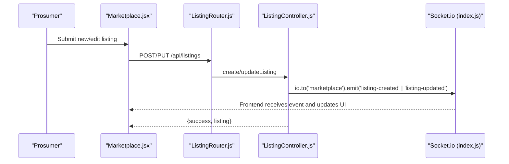
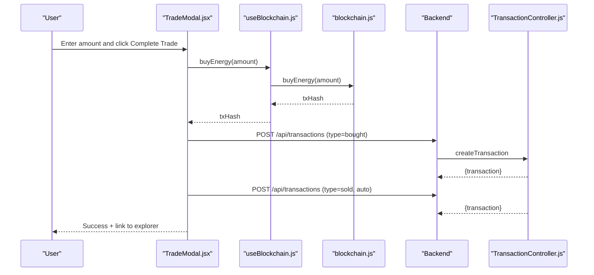
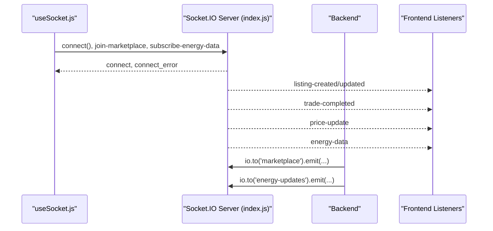
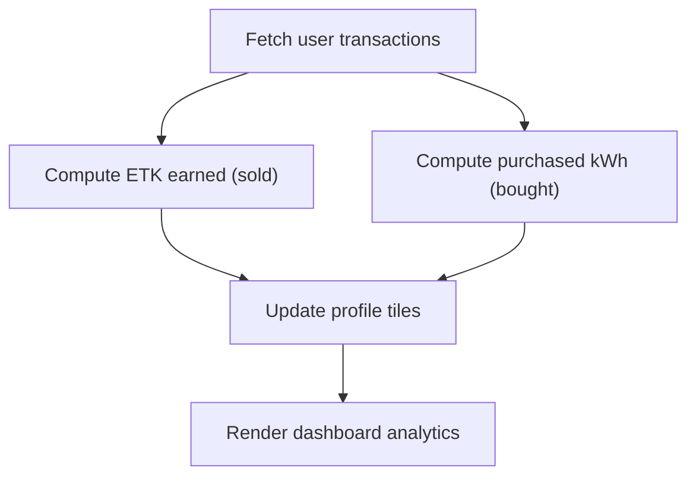
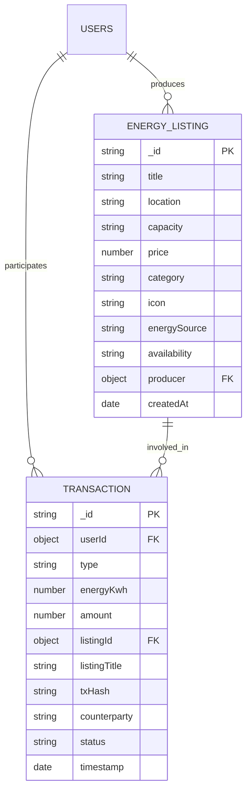
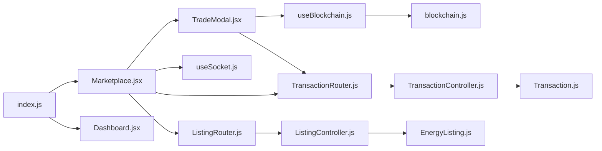

# Energy Marketplace

<cite>
**Referenced Files in This Document**
- [Marketplace.jsx](file://frontend/src/frontend/Marketplace.jsx)
- [TradeModal.jsx](file://frontend/src/components/TradeModal.jsx)
- [useBlockchain.js](file://frontend/src/hooks/useBlockchain.js)
- [blockchain.js](file://frontend/src/services/blockchain.js)
- [useSocket.js](file://frontend/src/hooks/useSocket.js)
- [App.jsx](file://frontend/src/App.jsx)
- [Dashboard.jsx](file://frontend/src/frontend/Dashboard.jsx)
- [index.js](file://backend/index.js)
- [ListingController.js](file://backend/Controllers/ListingController.js)
- [TransactionController.js](file://backend/Controllers/TransactionController.js)
- [ListingRouter.js](file://backend/Routes/ListingRouter.js)
- [TransactionRouter.js](file://backend/Routes/TransactionRouter.js)
- [EnergyListing.js](file://backend/Models/EnergyListing.js)
- [Transaction.js](file://backend/Models/Transaction.js)
</cite>

## Table of Contents
1. [Introduction](#introduction)
2. [Project Structure](#project-structure)
3. [Core Components](#core-components)
4. [Architecture Overview](#architecture-overview)
5. [Detailed Component Analysis](#detailed-component-analysis)
6. [Dependency Analysis](#dependency-analysis)
7. [Performance Considerations](#performance-considerations)
8. [Troubleshooting Guide](#troubleshooting-guide)
9. [Conclusion](#conclusion)

## Introduction
This document describes the energy marketplace interface and its ecosystem. It explains how users discover and trade renewable energy listings, how real-time market updates are delivered, and how the trading modal integrates blockchain-based order placement and transaction recording. It also documents the marketplace layout, search and filtering, listing management, user dashboards, and notification systems.

## Project Structure
The marketplace spans a frontend built with React and a backend powered by Node.js and Express. Real-time updates are handled via Socket.IO, and blockchain interactions are encapsulated in a dedicated service and hook. The backend exposes REST endpoints for listings and transactions and emits events for live updates.

**Diagram sources**
- [App.jsx](file://frontend/src/App.jsx#L1-L79)
- [Marketplace.jsx](file://frontend/src/frontend/Marketplace.jsx#L1-L1188)
- [TradeModal.jsx](file://frontend/src/components/TradeModal.jsx#L1-L325)
- [useBlockchain.js](file://frontend/src/hooks/useBlockchain.js#L1-L155)
- [blockchain.js](file://frontend/src/services/blockchain.js#L1-L261)
- [useSocket.js](file://frontend/src/hooks/useSocket.js#L1-L142)
- [Dashboard.jsx](file://frontend/src/frontend/Dashboard.jsx#L1-L556)
- [index.js](file://backend/index.js#L1-L97)
- [ListingController.js](file://backend/Controllers/ListingController.js#L1-L253)
- [TransactionController.js](file://backend/Controllers/TransactionController.js#L1-L68)
- [ListingRouter.js](file://backend/Routes/ListingRouter.js#L1-L24)
- [TransactionRouter.js](file://backend/Routes/TransactionRouter.js#L1-L11)
- [EnergyListing.js](file://backend/Models/EnergyListing.js#L1-L56)
- [Transaction.js](file://backend/Models/Transaction.js#L1-L51)

**Section sources**
- [App.jsx](file://frontend/src/App.jsx#L1-L79)
- [index.js](file://backend/index.js#L1-L97)

## Core Components
- Marketplace page: renders listings, filters, search, and the trading action; manages user profile stats and tabs for prosumers.
- Trade modal: handles wallet connection, dynamic pricing, order placement, and post-transaction updates.
- Blockchain hook and service: abstract wallet connectivity, balances, and contract interactions.
- Socket hook: connects to real-time channels for energy data, listing updates, and price alerts.
- Backend controllers and routers: manage listings CRUD, analytics, and transactions; emit real-time events.
- Data models: define listing and transaction schemas.

**Section sources**
- [Marketplace.jsx](file://frontend/src/frontend/Marketplace.jsx#L1-L1188)
- [TradeModal.jsx](file://frontend/src/components/TradeModal.jsx#L1-L325)
- [useBlockchain.js](file://frontend/src/hooks/useBlockchain.js#L1-L155)
- [blockchain.js](file://frontend/src/services/blockchain.js#L1-L261)
- [useSocket.js](file://frontend/src/hooks/useSocket.js#L1-L142)
- [ListingController.js](file://backend/Controllers/ListingController.js#L1-L253)
- [TransactionController.js](file://backend/Controllers/TransactionController.js#L1-L68)
- [EnergyListing.js](file://backend/Models/EnergyListing.js#L1-L56)
- [Transaction.js](file://backend/Models/Transaction.js#L1-L51)

## Architecture Overview
The marketplace follows a layered architecture:
- Presentation layer: React components for marketplace, dashboard, and modals.
- Integration layer: Socket.IO for real-time updates and blockchain service for on-chain actions.
- Application layer: Express routes and controllers handling business logic.
- Data layer: Mongoose models for listings and transactions.

**Diagram sources**
- [Marketplace.jsx](file://frontend/src/frontend/Marketplace.jsx#L780-L800)
- [TradeModal.jsx](file://frontend/src/components/TradeModal.jsx#L39-L80)
- [useBlockchain.js](file://frontend/src/hooks/useBlockchain.js#L46-L60)
- [blockchain.js](file://frontend/src/services/blockchain.js#L164-L176)
- [TransactionRouter.js](file://backend/Routes/TransactionRouter.js#L7-L8)
- [TransactionController.js](file://backend/Controllers/TransactionController.js#L18-L67)
- [EnergyListing.js](file://backend/Models/EnergyListing.js#L1-L56)
- [Transaction.js](file://backend/Models/Transaction.js#L1-L51)

## Detailed Component Analysis

### Marketplace Layout, Search, and Filtering
- Tabs: Prosumer users can toggle between marketplace and dashboard views.
- Filters: Category buttons and a text search input filter the displayed listings.
- Listing cards: Show title, location, capacity, price, category badge, producer, and a trade action.
- Prosumer dashboard: Shows analytics, listing inventory, and transaction history.

**Diagram sources**
- [Marketplace.jsx](file://frontend/src/frontend/Marketplace.jsx#L90-L115)
- [Marketplace.jsx](file://frontend/src/frontend/Marketplace.jsx#L310-L324)
- [Marketplace.jsx](file://frontend/src/frontend/Marketplace.jsx#L656-L777)

**Section sources**
- [Marketplace.jsx](file://frontend/src/frontend/Marketplace.jsx#L414-L430)
- [Marketplace.jsx](file://frontend/src/frontend/Marketplace.jsx#L596-L654)
- [Marketplace.jsx](file://frontend/src/frontend/Marketplace.jsx#L656-L777)

### Listing Management System
- Fetch user’s listings and analytics for the prosumer dashboard.
- Create, update, and delete listings with ownership checks.
- Real-time updates: backend emits events to the “marketplace” room when listings change.

**Diagram sources**
- [Marketplace.jsx](file://frontend/src/frontend/Marketplace.jsx#L127-L237)
- [ListingRouter.js](file://backend/Routes/ListingRouter.js#L20-L22)
- [ListingController.js](file://backend/Controllers/ListingController.js#L58-L99)
- [index.js](file://backend/index.js#L82-L85)

**Section sources**
- [Marketplace.jsx](file://frontend/src/frontend/Marketplace.jsx#L36-L88)
- [ListingController.js](file://backend/Controllers/ListingController.js#L37-L56)
- [ListingController.js](file://backend/Controllers/ListingController.js#L101-L157)
- [ListingController.js](file://backend/Controllers/ListingController.js#L159-L202)
- [index.js](file://backend/index.js#L48-L73)

### Trading Interface and Modal
- Wallet integration: Connect MetaMask, display balances, and enable trade actions.
- Dynamic pricing: Estimates cost based on contract function.
- Transaction recording: After successful purchase, records buyer and automatically creates seller record for the producer.
- Post-trade UX: Success screen with transaction explorer link and stats refresh.

**Diagram sources**
- [TradeModal.jsx](file://frontend/src/components/TradeModal.jsx#L39-L80)
- [useBlockchain.js](file://frontend/src/hooks/useBlockchain.js#L46-L60)
- [blockchain.js](file://frontend/src/services/blockchain.js#L164-L176)
- [TransactionRouter.js](file://backend/Routes/TransactionRouter.js#L7-L8)
- [TransactionController.js](file://backend/Controllers/TransactionController.js#L18-L67)

**Section sources**
- [TradeModal.jsx](file://frontend/src/components/TradeModal.jsx#L6-L37)
- [TradeModal.jsx](file://frontend/src/components/TradeModal.jsx#L39-L80)
- [TradeModal.jsx](file://frontend/src/components/TradeModal.jsx#L54-L72)
- [useBlockchain.js](file://frontend/src/hooks/useBlockchain.js#L17-L31)
- [useBlockchain.js](file://frontend/src/hooks/useBlockchain.js#L33-L44)
- [blockchain.js](file://frontend/src/services/blockchain.js#L155-L176)

### Real-Time Market Updates and Notifications
- Socket connection: Establishes a persistent connection and joins rooms for marketplace and energy data.
- Events: Receives listing updates, trade completions, and price changes; aggregates notifications.
- Backend emission: Emits energy data periodically and on listing changes.

**Diagram sources**
- [useSocket.js](file://frontend/src/hooks/useSocket.js#L12-L88)
- [index.js](file://backend/index.js#L48-L89)
- [Marketplace.jsx](file://frontend/src/frontend/Marketplace.jsx#L41-L41)

**Section sources**
- [useSocket.js](file://frontend/src/hooks/useSocket.js#L1-L142)
- [index.js](file://backend/index.js#L17-L89)

### User Profile Integration, Dashboards, and Transaction History
- Marketplace profile tiles: ETK balance, total trades, energy balance computed from transactions.
- Prosumer dashboard: Analytics, listing inventory, and transaction history table.
- Dashboard page: Live smart meter chart, user profile tiles, and pricing controls.

**Diagram sources**
- [Marketplace.jsx](file://frontend/src/frontend/Marketplace.jsx#L63-L83)
- [Dashboard.jsx](file://frontend/src/frontend/Dashboard.jsx#L36-L78)

**Section sources**
- [Marketplace.jsx](file://frontend/src/frontend/Marketplace.jsx#L564-L594)
- [Marketplace.jsx](file://frontend/src/frontend/Marketplace.jsx#L503-L558)
- [Dashboard.jsx](file://frontend/src/frontend/Dashboard.jsx#L36-L78)

### Data Models
- EnergyListing: Defines listing attributes, category, availability, and producer relationship.
- Transaction: Tracks buyer/seller trades, amounts, timestamps, and status.

**Diagram sources**
- [EnergyListing.js](file://backend/Models/EnergyListing.js#L5-L53)
- [Transaction.js](file://backend/Models/Transaction.js#L3-L48)

**Section sources**
- [EnergyListing.js](file://backend/Models/EnergyListing.js#L1-L56)
- [Transaction.js](file://backend/Models/Transaction.js#L1-L51)

## Dependency Analysis
- Frontend depends on:
  - Socket.IO client for real-time updates.
  - Blockchain service for wallet and contract interactions.
  - Backend REST APIs for listings and transactions.
- Backend depends on:
  - MongoDB via Mongoose for persistence.
  - Socket.IO for real-time event broadcasting.
  - Authentication middleware for protected routes.

**Diagram sources**
- [Marketplace.jsx](file://frontend/src/frontend/Marketplace.jsx#L1-L10)
- [TradeModal.jsx](file://frontend/src/components/TradeModal.jsx#L1-L6)
- [useBlockchain.js](file://frontend/src/hooks/useBlockchain.js#L1-L4)
- [blockchain.js](file://frontend/src/services/blockchain.js#L1-L4)
- [useSocket.js](file://frontend/src/hooks/useSocket.js#L1-L4)
- [ListingRouter.js](file://backend/Routes/ListingRouter.js#L1-L10)
- [TransactionRouter.js](file://backend/Routes/TransactionRouter.js#L1-L8)
- [ListingController.js](file://backend/Controllers/ListingController.js#L1-L4)
- [TransactionController.js](file://backend/Controllers/TransactionController.js#L1-L3)
- [EnergyListing.js](file://backend/Models/EnergyListing.js#L1-L5)
- [Transaction.js](file://backend/Models/Transaction.js#L1-L5)
- [index.js](file://backend/index.js#L1-L12)
- [Dashboard.jsx](file://frontend/src/frontend/Dashboard.jsx#L1-L25)

**Section sources**
- [ListingRouter.js](file://backend/Routes/ListingRouter.js#L1-L24)
- [TransactionRouter.js](file://backend/Routes/TransactionRouter.js#L1-L11)
- [index.js](file://backend/index.js#L1-L46)

## Performance Considerations
- Debounce or throttle search/filter updates to avoid excessive re-renders.
- Paginate or limit transaction history to reduce payload sizes.
- Cache blockchain balances and dynamic prices locally to minimize repeated calls.
- Use virtualized lists for long transaction tables.
- Optimize Socket.IO rooms and event frequency to prevent overload.

## Troubleshooting Guide
- Wallet connection failures:
  - Ensure MetaMask is installed and accounts are unlocked.
  - Verify the correct network is selected; the service attempts to switch to the configured chain.
- Contract configuration:
  - Contracts must be deployed and addresses configured; otherwise, trade actions will fail.
- Socket connectivity:
  - Confirm backend CORS allows the frontend origin and that the server is running.
  - Check room subscriptions and event listeners in the socket hook.
- Transaction recording:
  - Confirm authentication token is present and routes are protected.
  - Verify backend emits listing and trade events to keep the UI synchronized.

**Section sources**
- [blockchain.js](file://frontend/src/services/blockchain.js#L52-L101)
- [blockchain.js](file://frontend/src/services/blockchain.js#L103-L130)
- [useSocket.js](file://frontend/src/hooks/useSocket.js#L12-L88)
- [TransactionRouter.js](file://backend/Routes/TransactionRouter.js#L7-L8)
- [ListingController.js](file://backend/Controllers/ListingController.js#L82-L85)

## Conclusion
The energy marketplace integrates a responsive frontend, robust backend APIs, real-time communication, and blockchain-based trading. Users can browse listings, refine results, trade energy with dynamic pricing, and track transactions. Prosumers gain powerful analytics and inventory management, while real-time updates keep the interface lively and informative.