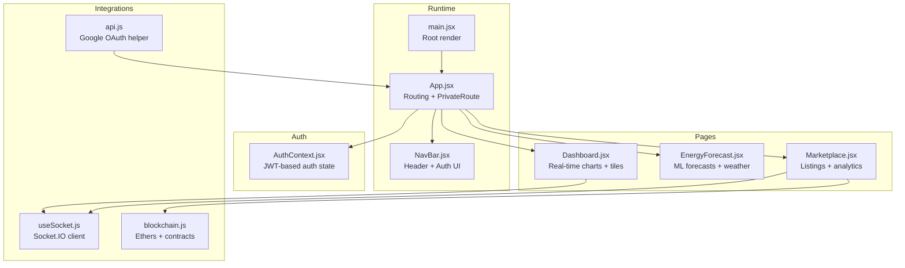
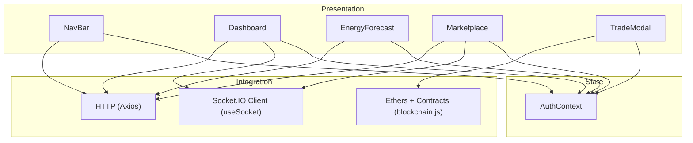
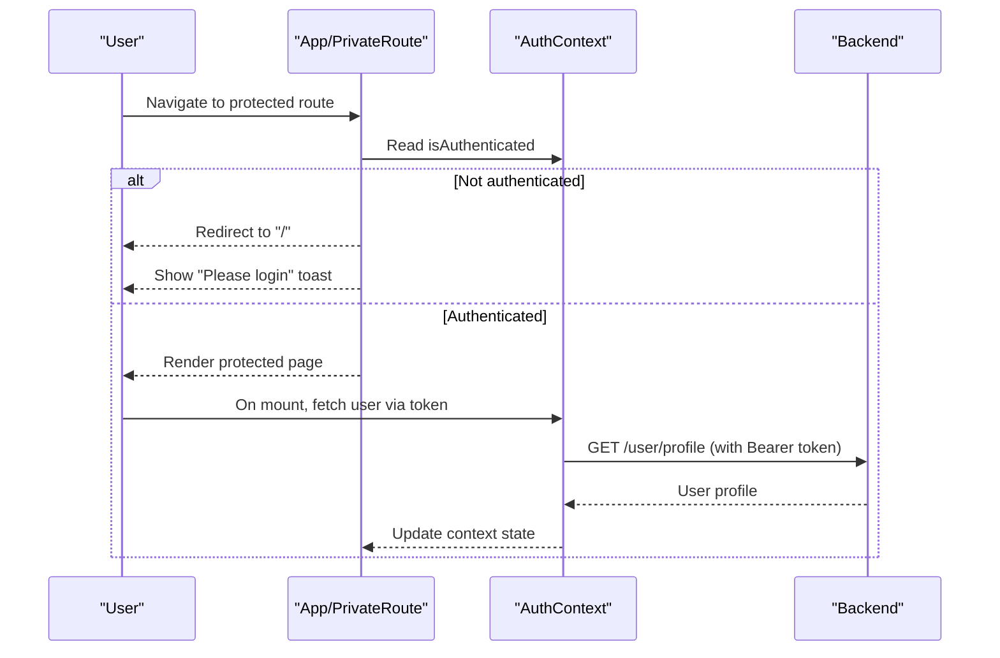
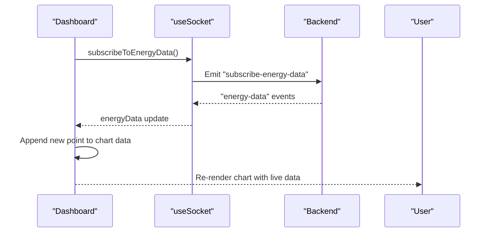
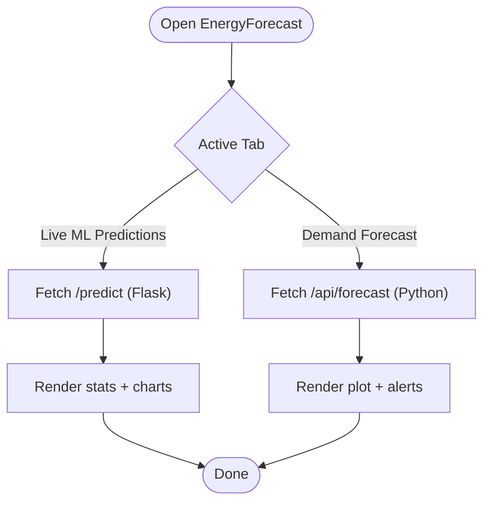
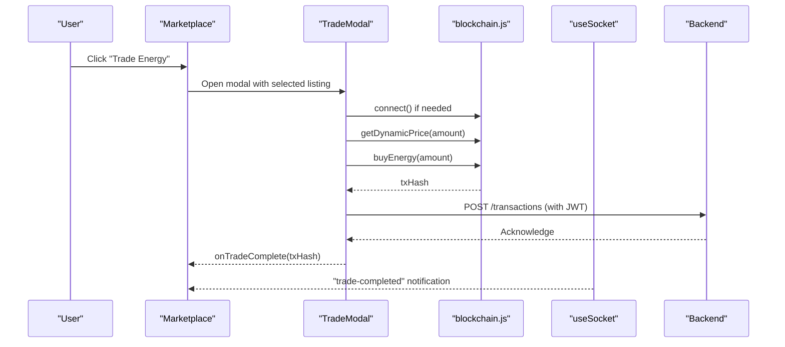
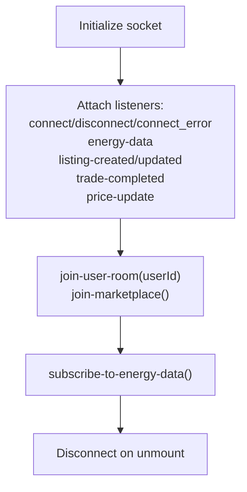
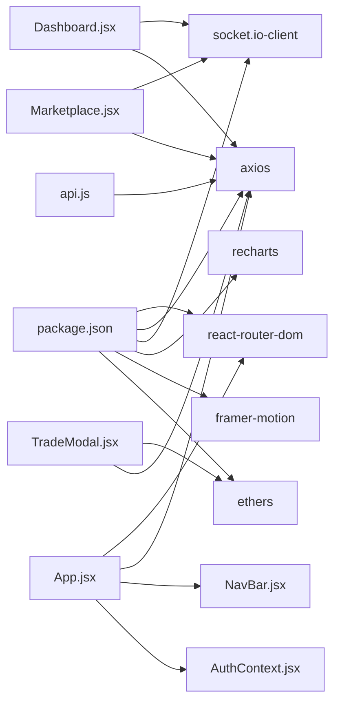

# Frontend Application

<cite>
**Referenced Files in This Document**
- [App.jsx](file://frontend/src/App.jsx)
- [main.jsx](file://frontend/src/main.jsx)
- [AuthContext.jsx](file://frontend/src/Context/AuthContext.jsx)
- [api.js](file://frontend/src/api.js)
- [package.json](file://frontend/package.json)
- [Dashboard.jsx](file://frontend/src/frontend/Dashboard.jsx)
- [EnergyForecast.jsx](file://frontend/src/frontend/EnergyForecast.jsx)
- [Marketplace.jsx](file://frontend/src/frontend/Marketplace.jsx)
- [NavBar.jsx](file://frontend/src/frontend/NavBar.jsx)
- [useSocket.js](file://frontend/src/hooks/useSocket.js)
- [TradeModal.jsx](file://frontend/src/components/TradeModal.jsx)
- [blockchain.js](file://frontend/src/services/blockchain.js)
</cite>

## Table of Contents
1. [Introduction](#introduction)
2. [Project Structure](#project-structure)
3. [Core Components](#core-components)
4. [Architecture Overview](#architecture-overview)
5. [Detailed Component Analysis](#detailed-component-analysis)
6. [Dependency Analysis](#dependency-analysis)
7. [Performance Considerations](#performance-considerations)
8. [Troubleshooting Guide](#troubleshooting-guide)
9. [Conclusion](#conclusion)

## Introduction
This document explains the React-based EcoGrid frontend application. It covers the component architecture, state management with the Context API, routing, authentication with JWT tokens and protected routes, real-time monitoring and visualization dashboards, the marketplace interface for energy trading, forecasting integration with Python ML services, responsive design with Tailwind CSS, component composition patterns, event handling strategies, and real-time communication via Socket.IO.

## Project Structure
The frontend is a Vite-powered React application with:
- A strict provider hierarchy rooted in main.jsx
- Centralized authentication via AuthContext
- Route-based navigation with private route protection
- Feature pages for dashboard, forecasting, marketplace, and shared UI components
- Real-time integrations via Socket.IO and blockchain services

**Diagram sources**
- [main.jsx](file://frontend/src/main.jsx#L8-L14)
- [App.jsx](file://frontend/src/App.jsx#L20-L77)
- [AuthContext.jsx](file://frontend/src/Context/AuthContext.jsx#L7-L53)
- [Dashboard.jsx](file://frontend/src/frontend/Dashboard.jsx#L25-L131)
- [EnergyForecast.jsx](file://frontend/src/frontend/EnergyForecast.jsx#L80-L178)
- [Marketplace.jsx](file://frontend/src/frontend/Marketplace.jsx#L8-L115)
- [useSocket.js](file://frontend/src/hooks/useSocket.js#L6-L88)
- [blockchain.js](file://frontend/src/services/blockchain.js#L42-L101)
- [api.js](file://frontend/src/api.js#L7-L10)

**Section sources**
- [main.jsx](file://frontend/src/main.jsx#L8-L14)
- [App.jsx](file://frontend/src/App.jsx#L20-L77)

## Core Components
- App: Declares routes, defines a PrivateRoute wrapper, and renders pages. Uses AuthContext to gate protected routes.
- AuthContext: Centralizes authentication state, loads user profile via JWT, and exposes loading state.
- NavBar: Provides navigation, scroll-aware styling, and user dropdown with logout.
- Dashboard: Real-time energy visualization, user tiles, and live meter updates via Socket.IO.
- EnergyForecast: Live ML predictions and demand forecasting with weather integration.
- Marketplace: Listings browsing, filtering, analytics for prosumers, and trade modal with blockchain integration.
- useSocket: Hook encapsulating Socket.IO connection, subscriptions, and notifications.
- TradeModal: Wallet connection, dynamic pricing, and on-chain purchase flow.
- blockchain.js: Ethers-based service for wallet connect, balances, dynamic pricing, and contract interactions.
- api.js: Helper for Google OAuth code exchange.

**Section sources**
- [App.jsx](file://frontend/src/App.jsx#L38-L47)
- [AuthContext.jsx](file://frontend/src/Context/AuthContext.jsx#L7-L53)
- [NavBar.jsx](file://frontend/src/frontend/NavBar.jsx#L21-L66)
- [Dashboard.jsx](file://frontend/src/frontend/Dashboard.jsx#L25-L131)
- [EnergyForecast.jsx](file://frontend/src/frontend/EnergyForecast.jsx#L80-L178)
- [Marketplace.jsx](file://frontend/src/frontend/Marketplace.jsx#L8-L115)
- [useSocket.js](file://frontend/src/hooks/useSocket.js#L6-L88)
- [TradeModal.jsx](file://frontend/src/components/TradeModal.jsx#L6-L80)
- [blockchain.js](file://frontend/src/services/blockchain.js#L42-L101)
- [api.js](file://frontend/src/api.js#L7-L10)

## Architecture Overview
The application follows a layered architecture:
- Presentation layer: Pages and shared UI components
- State layer: AuthContext for JWT-based authentication
- Integration layer: Socket.IO for real-time updates, Ethers for blockchain, Axios for HTTP
- Routing layer: React Router DOM with private route protection

**Diagram sources**
- [NavBar.jsx](file://frontend/src/frontend/NavBar.jsx#L27-L28)
- [Dashboard.jsx](file://frontend/src/frontend/Dashboard.jsx#L28-L29)
- [EnergyForecast.jsx](file://frontend/src/frontend/EnergyForecast.jsx#L100-L178)
- [Marketplace.jsx](file://frontend/src/frontend/Marketplace.jsx#L8-L115)
- [useSocket.js](file://frontend/src/hooks/useSocket.js#L12-L88)
- [TradeModal.jsx](file://frontend/src/components/TradeModal.jsx#L6-L17)
- [blockchain.js](file://frontend/src/services/blockchain.js#L42-L101)
- [AuthContext.jsx](file://frontend/src/Context/AuthContext.jsx#L12-L46)

## Detailed Component Analysis

### Authentication and Protected Routes
- AuthContext initializes an Axios instance with credentials and loads user profile using a stored JWT token.
- App wraps protected routes with a PrivateRoute that checks authentication and redirects unauthenticated users to the home page with a toast prompt.
- NavBar handles logout by clearing tokens and updating context state.

**Diagram sources**
- [App.jsx](file://frontend/src/App.jsx#L38-L47)
- [AuthContext.jsx](file://frontend/src/Context/AuthContext.jsx#L17-L46)
- [NavBar.jsx](file://frontend/src/frontend/NavBar.jsx#L46-L66)

**Section sources**
- [AuthContext.jsx](file://frontend/src/Context/AuthContext.jsx#L7-L53)
- [App.jsx](file://frontend/src/App.jsx#L38-L47)
- [NavBar.jsx](file://frontend/src/frontend/NavBar.jsx#L46-L66)

### Dashboard: Real-Time Monitoring and Visualization
- Dashboard displays user tiles (usage, sold/purchased kWh, buyers/sellers), live smart meter data, and energy pricing controls.
- Real-time updates are received via Socket.IO; the chart auto-scrolls to maintain a rolling window of the latest 10 data points.
- Historical data is fetched on mount to seed the chart.

**Diagram sources**
- [Dashboard.jsx](file://frontend/src/frontend/Dashboard.jsx#L80-L125)
- [useSocket.js](file://frontend/src/hooks/useSocket.js#L104-L109)

**Section sources**
- [Dashboard.jsx](file://frontend/src/frontend/Dashboard.jsx#L25-L131)
- [useSocket.js](file://frontend/src/hooks/useSocket.js#L6-L88)

### Energy Forecasting: ML Integration
- Two tabs: Live ML Predictions and Demand Forecast.
- Live tab integrates with a Flask ML service (/predict) for hourly/daily production, demand, surplus, and pricing.
- Demand tab integrates with a Python ML service (/api/forecast) to generate plots and peak alerts.
- Weather integration enriches predictions; geolocation detection is supported.

**Diagram sources**
- [EnergyForecast.jsx](file://frontend/src/frontend/EnergyForecast.jsx#L80-L178)
- [EnergyForecast.jsx](file://frontend/src/frontend/EnergyForecast.jsx#L152-L173)

**Section sources**
- [EnergyForecast.jsx](file://frontend/src/frontend/EnergyForecast.jsx#L80-L178)

### Marketplace: Trading and Listings
- Marketplace supports browsing, filtering, and searching listings.
- Prosumers can manage their listings (create, edit, delete) and view analytics and transaction history.
- TradeModal enables wallet connection, dynamic pricing calculation, and on-chain purchase via blockchain service.
- Real-time notifications for listings, trades, and price updates are handled via Socket.IO.

**Diagram sources**
- [Marketplace.jsx](file://frontend/src/frontend/Marketplace.jsx#L780-L814)
- [TradeModal.jsx](file://frontend/src/components/TradeModal.jsx#L39-L80)
- [blockchain.js](file://frontend/src/services/blockchain.js#L164-L176)
- [useSocket.js](file://frontend/src/hooks/useSocket.js#L62-L82)

**Section sources**
- [Marketplace.jsx](file://frontend/src/frontend/Marketplace.jsx#L8-L115)
- [TradeModal.jsx](file://frontend/src/components/TradeModal.jsx#L6-L80)
- [blockchain.js](file://frontend/src/services/blockchain.js#L42-L101)
- [useSocket.js](file://frontend/src/hooks/useSocket.js#L6-L88)

### Real-Time Communication with Socket.IO
- useSocket manages connection lifecycle, event listeners, and subscription helpers.
- Components can join rooms and subscribe to topics (e.g., energy data, marketplace, user-specific updates).
- Notifications are accumulated and surfaced to users.

**Diagram sources**
- [useSocket.js](file://frontend/src/hooks/useSocket.js#L12-L88)

**Section sources**
- [useSocket.js](file://frontend/src/hooks/useSocket.js#L6-L88)

### Responsive Design and Tailwind CSS
- Mobile-first approach with responsive grids and spacing.
- Motion animations via Framer Motion enhance UX transitions.
- Tailwind utilities define gradients, shadows, and responsive breakpoints across components.

[No sources needed since this section provides general guidance]

## Dependency Analysis
- Runtime dependencies include React, React Router DOM, Axios, Socket.IO client, Recharts, Tailwind CSS, and Ethers.
- Internal dependencies:
  - App depends on AuthContext and NavBar
  - Dashboard and Marketplace depend on useSocket
  - TradeModal depends on blockchain service
  - api.js provides Google OAuth integration

**Diagram sources**
- [package.json](file://frontend/package.json#L12-L32)
- [App.jsx](file://frontend/src/App.jsx#L1-L18)
- [Dashboard.jsx](file://frontend/src/frontend/Dashboard.jsx#L1-L25)
- [Marketplace.jsx](file://frontend/src/frontend/Marketplace.jsx#L1-L6)
- [TradeModal.jsx](file://frontend/src/components/TradeModal.jsx#L1-L5)
- [api.js](file://frontend/src/api.js#L1-L10)

**Section sources**
- [package.json](file://frontend/package.json#L12-L32)

## Performance Considerations
- Prefer lazy loading for heavy pages (e.g., forecasting) to reduce initial bundle size.
- Debounce or throttle real-time chart updates to avoid excessive re-renders.
- Use virtualized lists for large transaction/history tables.
- Cache frequently accessed data (e.g., user profile, listings) to minimize API calls.
- Optimize image assets and leverage SVGs for icons.

[No sources needed since this section provides general guidance]

## Troubleshooting Guide
- Authentication issues:
  - Verify token presence in local/session storage and expiration.
  - Check backend CORS and credential handling for Axios.
- Socket.IO errors:
  - Inspect connection events and logs; ensure server URL matches environment.
  - Confirm rooms and subscriptions are emitted after connection.
- Blockchain integration:
  - Ensure MetaMask is installed and on the correct network (Polygon Amoy).
  - Verify contract addresses are configured in environment variables.
- API failures:
  - Confirm base URLs and headers; handle 401/403 gracefully with redirects.

**Section sources**
- [AuthContext.jsx](file://frontend/src/Context/AuthContext.jsx#L17-L46)
- [useSocket.js](file://frontend/src/hooks/useSocket.js#L12-L34)
- [blockchain.js](file://frontend/src/services/blockchain.js#L52-L101)

## Conclusion
EcoGrid’s frontend combines robust state management, secure routing, real-time updates, and blockchain integration to deliver a modern, responsive energy trading platform. The modular component architecture and clear separation of concerns enable maintainability and scalability as new features are introduced.