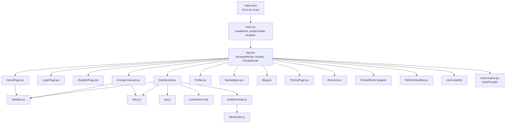
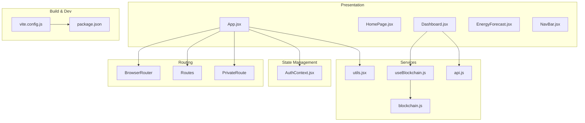
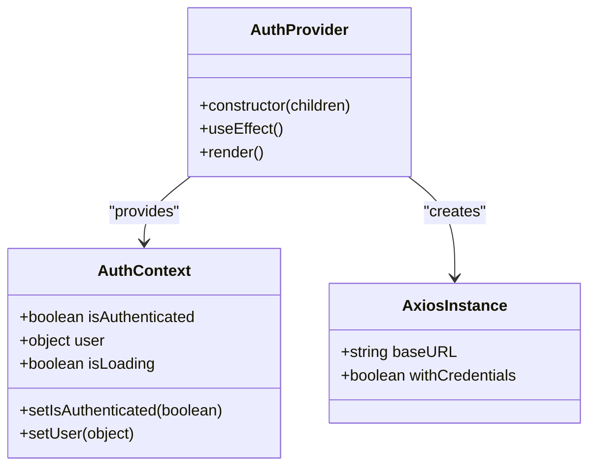
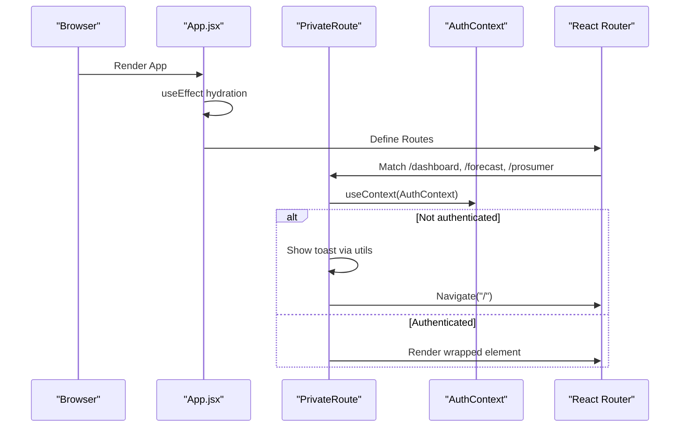
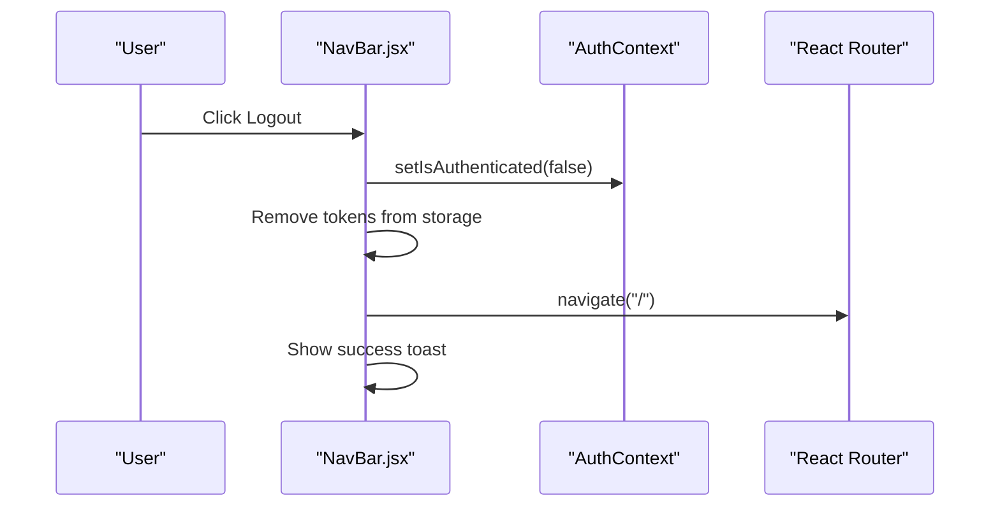
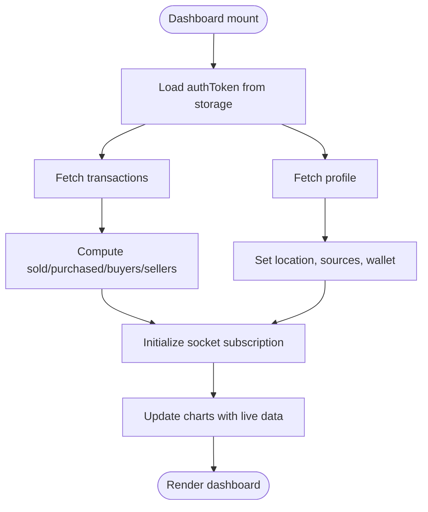
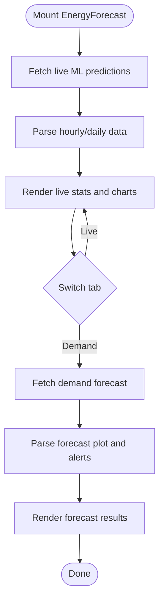
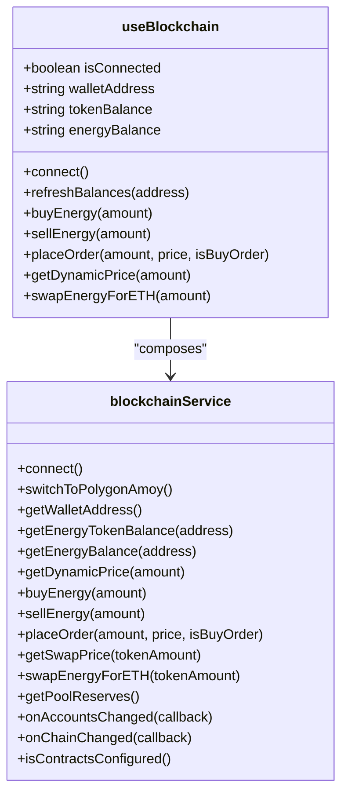
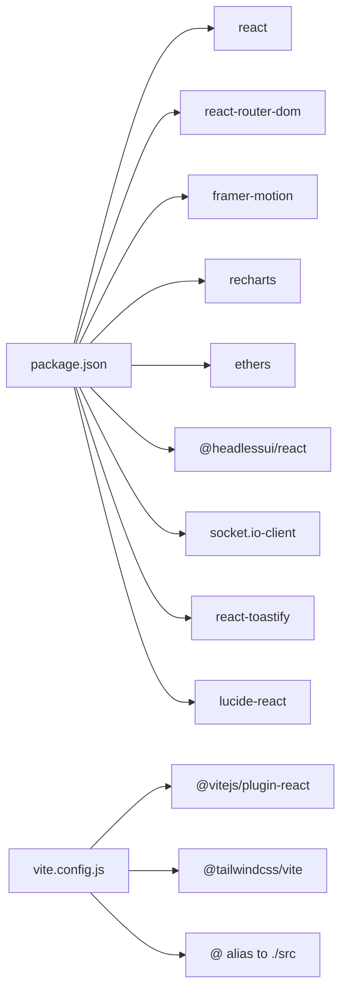

# React Application Architecture

<cite>
**Referenced Files in This Document**
- [main.jsx](file://frontend/src/main.jsx)
- [App.jsx](file://frontend/src/App.jsx)
- [AuthContext.jsx](file://frontend/src/Context/AuthContext.jsx)
- [NavBar.jsx](file://frontend/src/frontend/NavBar.jsx)
- [RefreshHandler.jsx](file://frontend/src/RefreshHandler.jsx)
- [HomePage.jsx](file://frontend/src/frontend/HomePage.jsx)
- [Dashboard.jsx](file://frontend/src/frontend/Dashboard.jsx)
- [EnergyForecast.jsx](file://frontend/src/frontend/EnergyForecast.jsx)
- [useBlockchain.js](file://frontend/src/hooks/useBlockchain.js)
- [blockchain.js](file://frontend/src/services/blockchain.js)
- [vite.config.js](file://frontend/vite.config.js)
- [package.json](file://frontend/package.json)
- [utils.jsx](file://frontend/utils.jsx)
- [api.js](file://frontend/src/api.js)
- [index.html](file://frontend/index.html)
</cite>

## Table of Contents
1. [Introduction](#introduction)
2. [Project Structure](#project-structure)
3. [Core Components](#core-components)
4. [Architecture Overview](#architecture-overview)
5. [Detailed Component Analysis](#detailed-component-analysis)
6. [Dependency Analysis](#dependency-analysis)
7. [Performance Considerations](#performance-considerations)
8. [Troubleshooting Guide](#troubleshooting-guide)
9. [Conclusion](#conclusion)

## Introduction
This document explains the React application architecture for the EcoGrid frontend. It covers the component hierarchy, routing with React Router, state management via Context API, Vite build configuration and development setup, the application entry point and provider wrappers, component composition patterns, authentication context implementation, and the development workflow. It also highlights performance optimization techniques and integration points with external services such as blockchain and machine learning APIs.

## Project Structure
The frontend is organized around a clear separation of concerns:
- Entry point initializes providers and renders the root App component.
- Routing is configured centrally in App.jsx with private route protection.
- Authentication state is managed via a dedicated Context Provider.
- UI components are grouped under src/frontend, with shared UI primitives under src/components/ui.
- Hooks encapsulate reusable logic (e.g., blockchain interactions).
- Services abstract external integrations (e.g., blockchain SDK).
- Build and dev tooling are configured via Vite.

**Diagram sources**
- [index.html](file://frontend/index.html#L1-L14)
- [main.jsx](file://frontend/src/main.jsx#L1-L15)
- [App.jsx](file://frontend/src/App.jsx#L1-L79)
- [AuthContext.jsx](file://frontend/src/Context/AuthContext.jsx#L1-L70)
- [RefreshHandler.jsx](file://frontend/src/RefreshHandler.jsx#L1-L41)
- [HomePage.jsx](file://frontend/src/frontend/HomePage.jsx#L1-L829)
- [Dashboard.jsx](file://frontend/src/frontend/Dashboard.jsx#L1-L556)
- [EnergyForecast.jsx](file://frontend/src/frontend/EnergyForecast.jsx#L1-L715)
- [NavBar.jsx](file://frontend/src/frontend/NavBar.jsx#L1-L333)
- [useBlockchain.js](file://frontend/src/hooks/useBlockchain.js#L1-L155)
- [blockchain.js](file://frontend/src/services/blockchain.js#L1-L261)
- [utils.jsx](file://frontend/utils.jsx#L1-L19)
- [api.js](file://frontend/src/api.js#L1-L10)

**Section sources**
- [index.html](file://frontend/index.html#L1-L14)
- [main.jsx](file://frontend/src/main.jsx#L1-L15)
- [App.jsx](file://frontend/src/App.jsx#L1-L79)

## Core Components
- Application shell and routing: App.jsx defines routes, a loading screen, and a PrivateRoute wrapper for protected pages.
- Authentication context: AuthContext.jsx centralizes authentication state, user profile, and loading state with a provider that hydrates state on startup.
- Navigation: NavBar.jsx integrates with AuthContext to render authenticated menus and handle logout.
- Page components: HomePage.jsx, Dashboard.jsx, EnergyForecast.jsx, and others implement domain-specific UI and logic.
- Utility and API helpers: utils.jsx provides toast notifications; api.js wraps backend calls.
- Blockchain integration: useBlockchain.js composes blockchain service hooks; blockchain.js manages wallet connection and contract interactions.

**Section sources**
- [App.jsx](file://frontend/src/App.jsx#L1-L79)
- [AuthContext.jsx](file://frontend/src/Context/AuthContext.jsx#L1-L70)
- [NavBar.jsx](file://frontend/src/frontend/NavBar.jsx#L1-L333)
- [HomePage.jsx](file://frontend/src/frontend/HomePage.jsx#L1-L829)
- [Dashboard.jsx](file://frontend/src/frontend/Dashboard.jsx#L1-L556)
- [EnergyForecast.jsx](file://frontend/src/frontend/EnergyForecast.jsx#L1-L715)
- [utils.jsx](file://frontend/utils.jsx#L1-L19)
- [api.js](file://frontend/src/api.js#L1-L10)
- [useBlockchain.js](file://frontend/src/hooks/useBlockchain.js#L1-L155)
- [blockchain.js](file://frontend/src/services/blockchain.js#L1-L261)

## Architecture Overview
The application follows a layered architecture:
- Presentation layer: React components and UI primitives.
- Routing and navigation: React Router with a central App component and a PrivateRoute wrapper.
- State management: Context API for authentication and user session state.
- Services and hooks: Encapsulate external integrations (blockchain, sockets, ML APIs).
- Build and dev: Vite with React plugin, Tailwind CSS, and path aliases.

**Diagram sources**
- [App.jsx](file://frontend/src/App.jsx#L1-L79)
- [AuthContext.jsx](file://frontend/src/Context/AuthContext.jsx#L1-L70)
- [HomePage.jsx](file://frontend/src/frontend/HomePage.jsx#L1-L829)
- [Dashboard.jsx](file://frontend/src/frontend/Dashboard.jsx#L1-L556)
- [EnergyForecast.jsx](file://frontend/src/frontend/EnergyForecast.jsx#L1-L715)
- [NavBar.jsx](file://frontend/src/frontend/NavBar.jsx#L1-L333)
- [useBlockchain.js](file://frontend/src/hooks/useBlockchain.js#L1-L155)
- [blockchain.js](file://frontend/src/services/blockchain.js#L1-L261)
- [utils.jsx](file://frontend/utils.jsx#L1-L19)
- [api.js](file://frontend/src/api.js#L1-L10)
- [vite.config.js](file://frontend/vite.config.js#L1-L18)
- [package.json](file://frontend/package.json#L1-L50)

## Detailed Component Analysis

### Authentication Context and Provider
The AuthContext provides centralized authentication state and lifecycle hydration:
- Creates a context and a provider.
- Initializes axios with credentials and base URL.
- Hydrates user session on app load using stored tokens.
- Exposes state and setters for authentication status, user data, and loading state.
- Renders a custom loading screen while authenticating.

**Diagram sources**
- [AuthContext.jsx](file://frontend/src/Context/AuthContext.jsx#L1-L70)

**Section sources**
- [AuthContext.jsx](file://frontend/src/Context/AuthContext.jsx#L1-L70)

### Routing and Private Route Protection
App.jsx configures routing with React Router and implements a PrivateRoute wrapper:
- Centralized route definitions for public and protected pages.
- PrivateRoute checks authentication and shows a toast message when redirecting.
- Uses a loading spinner until hydration completes.
- Integrates a RefreshHandler to prevent navigation to login/register when authenticated.

**Diagram sources**
- [App.jsx](file://frontend/src/App.jsx#L1-L79)
- [AuthContext.jsx](file://frontend/src/Context/AuthContext.jsx#L1-L70)
- [utils.jsx](file://frontend/utils.jsx#L1-L19)

**Section sources**
- [App.jsx](file://frontend/src/App.jsx#L1-L79)
- [RefreshHandler.jsx](file://frontend/src/RefreshHandler.jsx#L1-L41)

### Navigation Bar and Logout Flow
NavBar.jsx integrates with AuthContext to display authenticated menus and handle logout:
- Reads authentication state and user profile from context.
- Provides a dropdown menu with profile and logout actions.
- On logout, clears tokens and context state, navigates to home, and shows a success toast.

**Diagram sources**
- [NavBar.jsx](file://frontend/src/frontend/NavBar.jsx#L1-L333)
- [AuthContext.jsx](file://frontend/src/Context/AuthContext.jsx#L1-L70)
- [utils.jsx](file://frontend/utils.jsx#L1-L19)

**Section sources**
- [NavBar.jsx](file://frontend/src/frontend/NavBar.jsx#L1-L333)

### Dashboard Component and Real-Time Data
Dashboard.jsx demonstrates composition patterns and integration:
- Uses AuthContext for user data.
- Integrates socket-based live energy data via a custom hook.
- Fetches historical data and updates charts dynamically.
- Uses motion animations and Recharts for visualizations.

**Diagram sources**
- [Dashboard.jsx](file://frontend/src/frontend/Dashboard.jsx#L1-L556)

**Section sources**
- [Dashboard.jsx](file://frontend/src/frontend/Dashboard.jsx#L1-L556)

### Energy Forecast Component
EnergyForecast.jsx showcases a unified page with tabs for live ML predictions and demand forecasts:
- Implements city selection and geolocation detection.
- Fetches live ML predictions and demand forecasts from Flask services.
- Renders statistics cards, bar charts, and detailed tables with animations.

**Diagram sources**
- [EnergyForecast.jsx](file://frontend/src/frontend/EnergyForecast.jsx#L1-L715)

**Section sources**
- [EnergyForecast.jsx](file://frontend/src/frontend/EnergyForecast.jsx#L1-L715)

### Blockchain Hook and Service
useBlockchain.js and blockchain.js encapsulate Ethereum interactions:
- useBlockchain.js exposes connection, balance retrieval, and transaction functions.
- blockchain.js manages wallet connection, network switching, contract initialization, and event listeners.

**Diagram sources**
- [useBlockchain.js](file://frontend/src/hooks/useBlockchain.js#L1-L155)
- [blockchain.js](file://frontend/src/services/blockchain.js#L1-L261)

**Section sources**
- [useBlockchain.js](file://frontend/src/hooks/useBlockchain.js#L1-L155)
- [blockchain.js](file://frontend/src/services/blockchain.js#L1-L261)

## Dependency Analysis
The frontend depends on React, React Router, Tailwind CSS, and several libraries for UI, animations, charts, and blockchain integration. Vite orchestrates the build pipeline with React and Tailwind plugins and resolves aliases.

**Diagram sources**
- [package.json](file://frontend/package.json#L1-L50)
- [vite.config.js](file://frontend/vite.config.js#L1-L18)

**Section sources**
- [package.json](file://frontend/package.json#L1-L50)
- [vite.config.js](file://frontend/vite.config.js#L1-L18)

## Performance Considerations
- Lazy loading and code splitting: Consider lazy-loading heavy pages (e.g., Dashboard, EnergyForecast) to reduce initial bundle size.
- Memoization: Use useMemo/useCallback in components that compute or render expensive data (e.g., charts).
- Conditional rendering: Keep loading screens minimal and avoid unnecessary re-renders during hydration.
- Chart optimization: Limit data points and throttle updates for live charts.
- Asset optimization: Ensure images and SVGs are optimized; leverage Vite’s built-in asset handling.
- Network efficiency: Batch requests and debounce user-triggered fetches (e.g., city search).
- Context granularity: Split AuthContext into smaller contexts if the app grows to reduce re-renders for unrelated state.

## Troubleshooting Guide
- Authentication hydration issues:
  - Verify token presence in storage and axios base URL configuration.
  - Check error handling paths that clear tokens and reset state.
- Toast messages:
  - Confirm react-toastify styles are imported and utils functions are used consistently.
- Navigation loops:
  - Review RefreshHandler logic to prevent redirects when navigating between login/register and other pages.
- Blockchain connectivity:
  - Ensure MetaMask is installed and the correct network is selected.
  - Verify contract addresses and ABI configurations.
- Build issues:
  - Confirm Vite plugins are installed and Tailwind is configured.
  - Check path aliases and environment variable placeholders.

**Section sources**
- [AuthContext.jsx](file://frontend/src/Context/AuthContext.jsx#L1-L70)
- [utils.jsx](file://frontend/utils.jsx#L1-L19)
- [RefreshHandler.jsx](file://frontend/src/RefreshHandler.jsx#L1-L41)
- [blockchain.js](file://frontend/src/services/blockchain.js#L1-L261)
- [vite.config.js](file://frontend/vite.config.js#L1-L18)

## Conclusion
The EcoGrid React application employs a clean, modular architecture with centralized authentication via Context API, robust routing with private route protection, and integrated services for blockchain and ML-powered features. Vite streamlines development and builds, while hooks and services encapsulate cross-cutting concerns. Following the outlined patterns and best practices will help maintain scalability and performance as the application evolves.