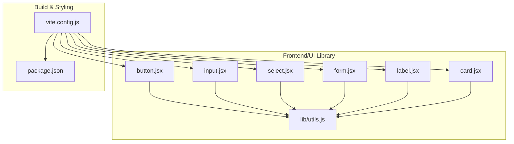
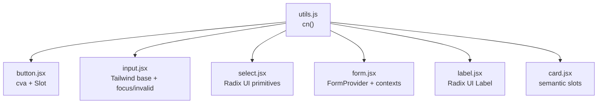
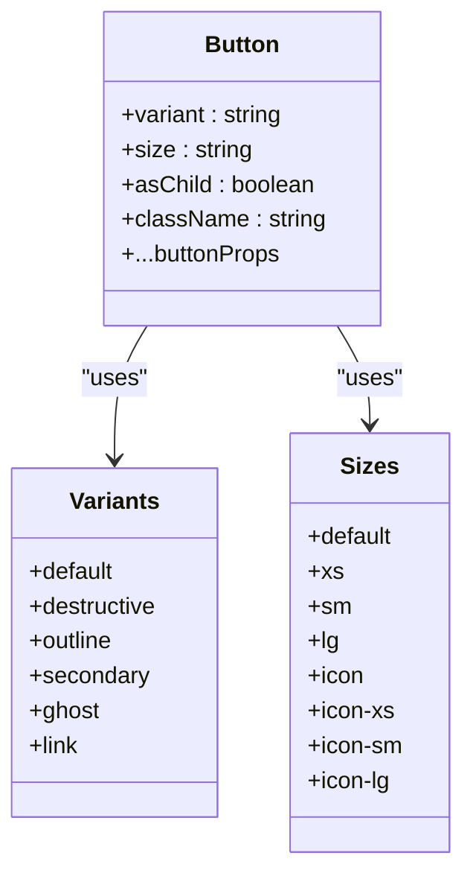
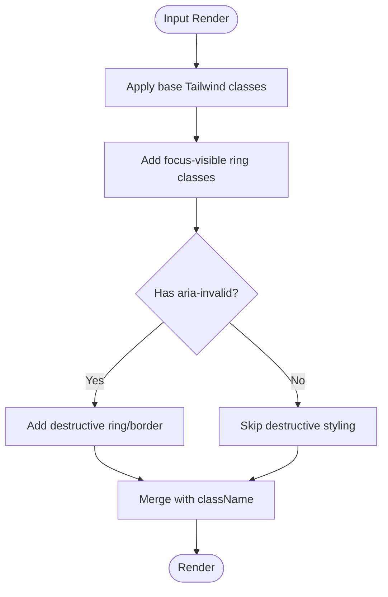
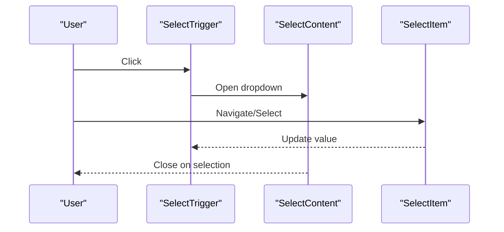
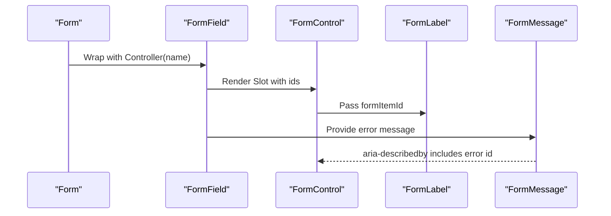
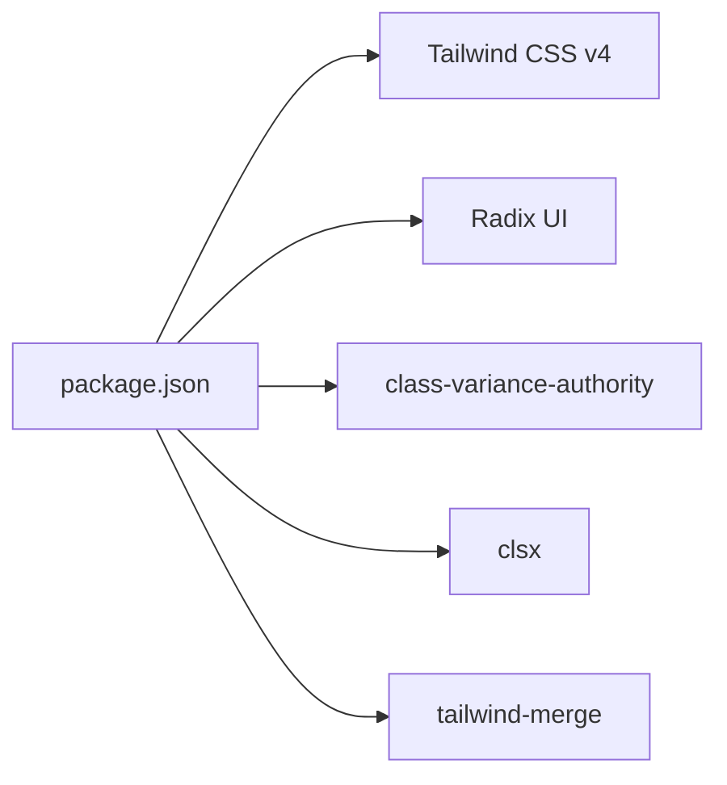

# UI Components Library

<cite>
**Referenced Files in This Document**
- [button.jsx](file://frontend/src/components/ui/button.jsx)
- [input.jsx](file://frontend/src/components/ui/input.jsx)
- [select.jsx](file://frontend/src/components/ui/select.jsx)
- [form.jsx](file://frontend/src/components/ui/form.jsx)
- [label.jsx](file://frontend/src/components/ui/label.jsx)
- [card.jsx](file://frontend/src/components/ui/card.jsx)
- [utils.js](file://frontend/src/lib/utils.js)
- [vite.config.js](file://frontend/vite.config.js)
- [package.json](file://frontend/package.json)
- [Util.jsx](file://frontend/src/frontend/Util.jsx)
</cite>

## Table of Contents
1. [Introduction](#introduction)
2. [Project Structure](#project-structure)
3. [Core Components](#core-components)
4. [Architecture Overview](#architecture-overview)
5. [Detailed Component Analysis](#detailed-component-analysis)
6. [Dependency Analysis](#dependency-analysis)
7. [Performance Considerations](#performance-considerations)
8. [Troubleshooting Guide](#troubleshooting-guide)
9. [Conclusion](#conclusion)
10. [Appendices](#appendices)

## Introduction
This document describes the reusable UI components library used across the frontend. It explains the design system built on Tailwind CSS, component composition patterns, prop interfaces, variants, customization options, accessibility features, and responsive behavior. It also covers integration guidelines, testing strategies, and usage examples for the button, form, input, and select components.

## Project Structure
The UI components live under the frontend/src/components/ui directory and are integrated with Tailwind CSS via Vite and the Tailwind plugin. Utility helpers merge Tailwind classes safely, and the components rely on Radix UI primitives for accessible interactions.

**Diagram sources**
- [button.jsx](file://frontend/src/components/ui/button.jsx#L1-L61)
- [input.jsx](file://frontend/src/components/ui/input.jsx#L1-L25)
- [select.jsx](file://frontend/src/components/ui/select.jsx#L1-L171)
- [form.jsx](file://frontend/src/components/ui/form.jsx#L1-L144)
- [label.jsx](file://frontend/src/components/ui/label.jsx#L1-L22)
- [card.jsx](file://frontend/src/components/ui/card.jsx#L1-L102)
- [utils.js](file://frontend/src/lib/utils.js#L1-L7)
- [vite.config.js](file://frontend/vite.config.js#L1-L18)
- [package.json](file://frontend/package.json#L1-L50)

**Section sources**
- [vite.config.js](file://frontend/vite.config.js#L1-L18)
- [package.json](file://frontend/package.json#L12-L33)

## Core Components
This section documents the primary UI components: Button, Input, Select, Form, Label, and Card. It focuses on prop interfaces, variants, styling patterns, accessibility, and responsive behavior.

- Button
  - Purpose: Render interactive actions with consistent spacing, focus states, and variants.
  - Key props: variant, size, asChild, className, plus native button attributes.
  - Variants: default, destructive, outline, secondary, ghost, link.
  - Sizes: default, xs, sm, lg, icon, icon-xs, icon-sm, icon-lg.
  - Accessibility: Focus-visible ring, aria-invalid integration, supports nested SVG sizing.
  - Composition: Uses class variance authority for variants and radix Slot for asChild rendering.

- Input
  - Purpose: Text and file inputs with consistent focus states, invalid states, and placeholder styles.
  - Key props: type, className, plus native input attributes.
  - Accessibility: Focus-visible ring, aria-invalid integration, selection highlighting.
  - Responsive: Base text sizing with media query adjustments.

- Select
  - Purpose: Accessible dropdown with trigger, content, items, and scroll controls.
  - Key props: Root accepts all SelectPrimitive.Root props; Trigger accepts size; Content accepts position and align.
  - Variants: Trigger size defaults to default/sm.
  - Accessibility: Uses Radix UI primitives for keyboard navigation, ARIA attributes, and portal rendering.
  - Composition: Exports Select, SelectTrigger, SelectContent, SelectItem, SelectLabel, SelectSeparator, SelectScrollUpButton, SelectScrollDownButton, SelectValue, SelectGroup.

- Form
  - Purpose: React Hook Form provider and composition helpers for form items, labels, controls, descriptions, and messages.
  - Key exports: Form, FormItem, FormLabel, FormControl, FormDescription, FormMessage, FormField, useFormField.
  - Accessibility: Generates ids for labels and controls, sets aria-invalid and aria-describedby dynamically.
  - Composition: Uses contexts to propagate field metadata and integrates with react-hook-form.

- Label
  - Purpose: Associated labels for form controls with disabled states and peer integration.
  - Key props: className, plus native label attributes.
  - Accessibility: Disabled state support and peer-disabled cursor behavior.

- Card
  - Purpose: Semantic containers for content with header, title, description, action, content, and footer slots.
  - Key exports: Card, CardHeader, CardTitle, CardDescription, CardAction, CardContent, CardFooter.
  - Composition: Uses data-slot attributes for consistent styling hooks and responsive grid layout.

**Section sources**
- [button.jsx](file://frontend/src/components/ui/button.jsx#L7-L39)
- [input.jsx](file://frontend/src/components/ui/input.jsx#L5-L22)
- [select.jsx](file://frontend/src/components/ui/select.jsx#L9-L171)
- [form.jsx](file://frontend/src/components/ui/form.jsx#L8-L144)
- [label.jsx](file://frontend/src/components/ui/label.jsx#L6-L19)
- [card.jsx](file://frontend/src/components/ui/card.jsx#L5-L91)

## Architecture Overview
The UI library follows a composition-first pattern:
- Utility layer merges Tailwind classes safely.
- Component layer defines variants and styling with Tailwind utilities.
- Primitive layer integrates Radix UI for accessible interactions.
- Build layer configures Tailwind and React plugins.

**Diagram sources**
- [utils.js](file://frontend/src/lib/utils.js#L4-L6)
- [button.jsx](file://frontend/src/components/ui/button.jsx#L7-L39)
- [input.jsx](file://frontend/src/components/ui/input.jsx#L14-L19)
- [select.jsx](file://frontend/src/components/ui/select.jsx#L37-L47)
- [form.jsx](file://frontend/src/components/ui/form.jsx#L8-L144)
- [label.jsx](file://frontend/src/components/ui/label.jsx#L11-L17)
- [card.jsx](file://frontend/src/components/ui/card.jsx#L10-L16)

## Detailed Component Analysis

### Button Component
- Design system integration: Uses class variance authority to define variants and sizes; applies focus-visible ring and aria-invalid styling.
- Prop interface:
  - variant: "default" | "destructive" | "outline" | "secondary" | "ghost" | "link"
  - size: "default" | "xs" | "sm" | "lg" | "icon" | "icon-xs" | "icon-sm" | "icon-lg"
  - asChild: boolean to render as radix Slot
  - className: optional override
  - Additional button props (e.g., onClick, disabled)
- Accessibility: Focus-visible ring, aria-invalid integration, nested SVG sizing handled automatically.
- Responsive: Size variants adjust padding and height; icon sizes adapt to content.

**Diagram sources**
- [button.jsx](file://frontend/src/components/ui/button.jsx#L7-L39)

**Section sources**
- [button.jsx](file://frontend/src/components/ui/button.jsx#L41-L58)

### Input Component
- Design system integration: Tailwind base classes for borders, focus rings, disabled states, and placeholder text; integrates with dark mode and selection styles.
- Prop interface:
  - type: input type
  - className: optional override
  - Additional input props (e.g., onChange, value, placeholder)
- Accessibility: Focus-visible ring, aria-invalid integration, selection highlight color.
- Responsive: Text sizing adapts via md:text-sm.

**Diagram sources**
- [input.jsx](file://frontend/src/components/ui/input.jsx#L14-L19)

**Section sources**
- [input.jsx](file://frontend/src/components/ui/input.jsx#L5-L22)

### Select Component
- Design system integration: Uses Radix UI primitives for keyboard navigation and ARIA attributes; content rendered via portal with animations.
- Prop interface:
  - Root: SelectPrimitive.Root props
  - Trigger: className, size ("default" | "sm"), children, plus trigger props
  - Content: className, children, position ("item-aligned" | "popper"), align
  - Item: className, children, plus item props
  - Scroll buttons: className, plus primitive props
  - Others: SelectGroup, SelectValue, SelectLabel, SelectSeparator
- Accessibility: Portal rendering, scroll buttons, item indicators, and keyboard navigation.
- Responsive: Trigger height adjusts per size; viewport adapts to trigger dimensions when position="popper".

**Diagram sources**
- [select.jsx](file://frontend/src/components/ui/select.jsx#L34-L47)
- [select.jsx](file://frontend/src/components/ui/select.jsx#L57-L79)
- [select.jsx](file://frontend/src/components/ui/select.jsx#L99-L116)

**Section sources**
- [select.jsx](file://frontend/src/components/ui/select.jsx#L9-L171)

### Form Component Suite
- Design system integration: React Hook Form provider with composition helpers; generates ids and ARIA attributes for accessibility.
- Prop interface:
  - Form: Provider wrapper around react-hook-form
  - FormItem: className, plus container props
  - FormLabel: className, plus label props
  - FormControl: renders Slot with aria-describedby and aria-invalid
  - FormDescription: className, plus paragraph props
  - FormMessage: className, renders error message or children when no error
  - FormField: wraps Controller with name and context
  - useFormField: returns id, name, formItemId, formDescriptionId, formMessageId, and field state
- Accessibility: Dynamically sets aria-invalid and aria-describedby based on field state.

**Diagram sources**
- [form.jsx](file://frontend/src/components/ui/form.jsx#L8-L22)
- [form.jsx](file://frontend/src/components/ui/form.jsx#L78-L95)
- [form.jsx](file://frontend/src/components/ui/form.jsx#L112-L132)

**Section sources**
- [form.jsx](file://frontend/src/components/ui/form.jsx#L12-L144)

### Label Component
- Design system integration: Radix UI label with disabled state support and peer integration.
- Prop interface:
  - className: optional override
  - Additional label props (e.g., htmlFor)
- Accessibility: Disabled state classes and peer-disabled cursor behavior.

**Section sources**
- [label.jsx](file://frontend/src/components/ui/label.jsx#L6-L19)

### Card Component
- Design system integration: Semantic slots for header, title, description, action, content, and footer; responsive grid layout.
- Prop interface:
  - Card: className, plus div props
  - CardHeader: className, plus grid props
  - CardTitle: className, plus div props
  - CardDescription: className, plus div props
  - CardAction: className, plus div props
  - CardContent: className, plus div props
  - CardFooter: className, plus div props
- Composition: Uses data-slot attributes for consistent styling hooks.

**Section sources**
- [card.jsx](file://frontend/src/components/ui/card.jsx#L5-L91)

## Dependency Analysis
The UI components depend on:
- Tailwind CSS v4 via the Tailwind Vite plugin.
- Radix UI for accessible primitives.
- class-variance-authority for variant definitions.
- clsx and tailwind-merge for safe class merging.

**Diagram sources**
- [package.json](file://frontend/package.json#L12-L33)

**Section sources**
- [package.json](file://frontend/package.json#L12-L33)

## Performance Considerations
- Prefer variant and size props over ad-hoc className overrides to keep styles predictable and cache-friendly.
- Use asChild patterns (e.g., Button with asChild) to avoid unnecessary DOM nodes.
- Keep Select content lightweight; avoid heavy DOM inside SelectItem.
- Leverage data-slot attributes for targeted styling to minimize cascade specificity conflicts.
- Use the cn utility to merge classes efficiently and avoid duplication.

## Troubleshooting Guide
- Button focus ring not visible:
  - Ensure focus-visible ring classes are applied and Tailwind JIT is enabled.
  - Verify that the focus-visible ring color is configured in your theme.
- Input invalid state not styled:
  - Confirm aria-invalid is set on the input element or parent.
  - Ensure destructive ring tokens exist in your theme.
- Select dropdown not aligned:
  - Adjust position and align props on SelectContent.
  - When using position="popper", content aligns relative to the trigger.
- Form errors not announced:
  - Ensure FormMessage renders and aria-describedby includes the message id.
  - Verify useFormField is used within FormItem and FormField.
- Label not associated with input:
  - Use FormLabel with htmlFor bound to formItemId from useFormField.

**Section sources**
- [button.jsx](file://frontend/src/components/ui/button.jsx#L8-L38)
- [input.jsx](file://frontend/src/components/ui/input.jsx#L15-L18)
- [select.jsx](file://frontend/src/components/ui/select.jsx#L57-L79)
- [form.jsx](file://frontend/src/components/ui/form.jsx#L78-L95)
- [label.jsx](file://frontend/src/components/ui/label.jsx#L11-L17)

## Conclusion
The UI components library provides a cohesive, accessible, and responsive foundation for building consistent interfaces. By leveraging Tailwind CSS, Radix UI, and composition patterns, teams can maintain design system alignment while enabling flexible customization. Follow the documented prop interfaces, accessibility practices, and integration guidelines to ensure reliable component usage across the application.

## Appendices

### Theme and Design System Integration
- Tailwind CSS v4 is configured via the Tailwind Vite plugin.
- The cn utility merges classes safely, preventing conflicts and duplicates.
- Components integrate with focus-visible rings, dark mode tokens, and ARIA attributes for accessibility.

**Section sources**
- [vite.config.js](file://frontend/vite.config.js#L3-L3)
- [utils.js](file://frontend/src/lib/utils.js#L4-L6)

### Component Testing Strategies
- Unit tests:
  - Render components with props and assert data-slot attributes and variant classes.
  - Test focus-visible states and aria-invalid behavior.
- Integration tests:
  - For Form, mount a FormProvider and simulate user interactions to verify ids and ARIA attributes.
  - For Select, simulate open/close and selection to verify controlled behavior.
- Accessibility tests:
  - Use automated tools to verify keyboard navigation and screen reader announcements.
  - Manually verify focus order and error messaging.

### Component Usage Examples
- Button
  - Variant and size combinations for primary actions, destructive warnings, and icon-only triggers.
  - asChild usage to render links or custom elements.
- Input
  - Controlled usage with onChange handlers; placeholder and disabled states.
- Select
  - Grouped options, labels, separators, and scroll buttons for long lists.
- Form
  - Compose FormItem, FormLabel, FormControl, FormDescription, and FormMessage for each field.
- Label
  - Pair with inputs and controls using htmlFor and disabled states.

### Notes on Alternative Button Implementation
There is another Button component exported from frontend/src/frontend/Util.jsx with different variants and sizes. When integrating, choose one implementation consistently across the app to avoid confusion.

**Section sources**
- [Util.jsx](file://frontend/src/frontend/Util.jsx#L23-L51)