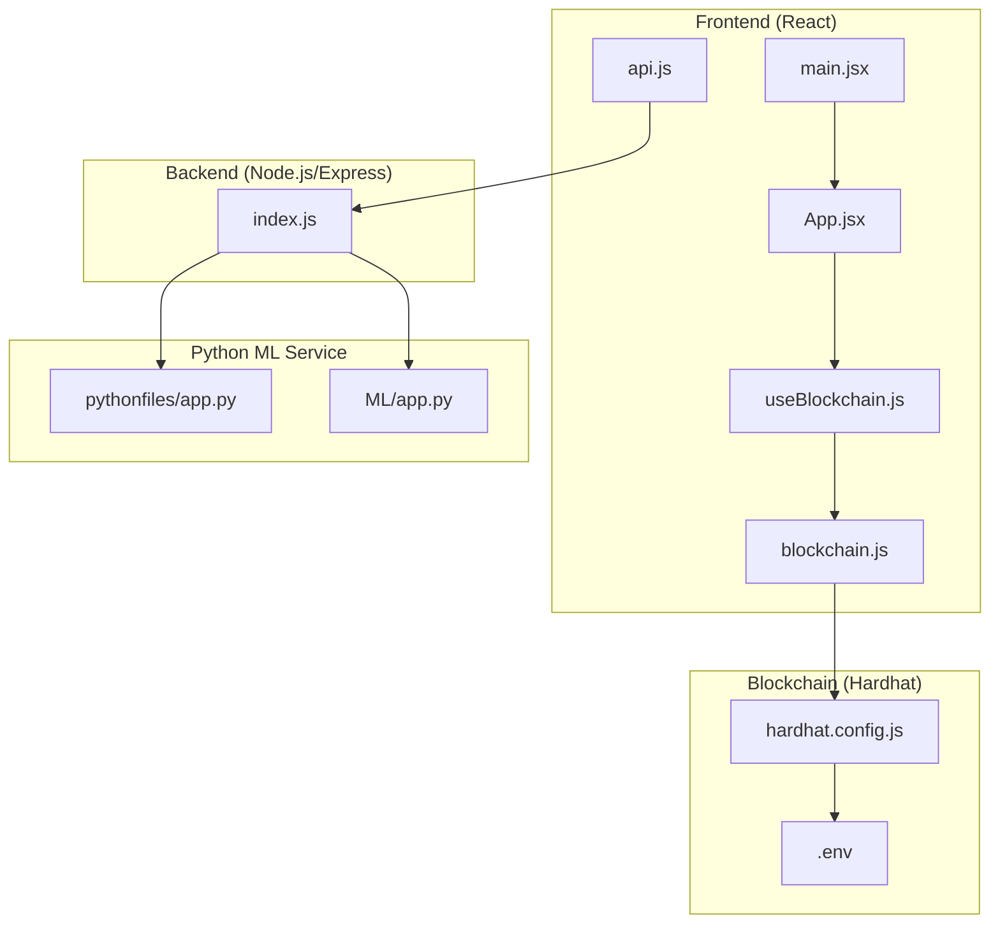

# Getting Started

<cite>
**Referenced Files in This Document**
- [README.md](file://README.md)
- [frontend/package.json](file://frontend/package.json)
- [backend/package.json](file://backend/package.json)
- [blockchain/package.json](file://blockchain/package.json)
- [pythonfiles/requirements.txt](file://pythonfiles/requirements.txt)
- [ML/requirements.txt](file://ML/requirements.txt)
- [frontend/.env](file://frontend/.env)
- [backend/.env](file://backend/.env)
- [blockchain/.env](file://blockchain/.env)
- [blockchain/hardhat.config.js](file://blockchain/hardhat.config.js)
- [frontend/src/services/blockchain.js](file://frontend/src/services/blockchain.js)
- [frontend/src/hooks/useBlockchain.js](file://frontend/src/hooks/useBlockchain.js)
- [frontend/src/main.jsx](file://frontend/src/main.jsx)
- [frontend/src/App.jsx](file://frontend/src/App.jsx)
- [frontend/src/api.js](file://frontend/src/api.js)
- [backend/index.js](file://backend/index.js)
- [pythonfiles/app.py](file://pythonfiles/app.py)
- [ML/app.py](file://ML/app.py)
</cite>

## Table of Contents
1. [Introduction](#introduction)
2. [Prerequisites](#prerequisites)
3. [Environment Setup](#environment-setup)
4. [Component Installation](#component-installation)
5. [Environment Variables](#environment-variables)
6. [Verification Steps](#verification-steps)
7. [Architecture Overview](#architecture-overview)
8. [First Run Tutorial](#first-run-tutorial)
9. [Troubleshooting Guide](#troubleshooting-guide)
10. [Conclusion](#conclusion)

## Introduction
This guide walks you through setting up the EcoGrid development environment. EcoGrid is a sustainable energy management platform featuring:
- A React frontend with real-time dashboards and marketplace
- A Node.js/Express backend with MongoDB and Socket.IO
- A Python Flask ML service for energy forecasting
- Solidity smart contracts for energy trading on Polygon Amoy testnet

The guide covers prerequisites, installation, environment configuration, verification, and first-run onboarding.

## Prerequisites
Ensure the following tools are installed on your machine:
- Node.js (LTS recommended) for frontend and backend
- Python 3.8+ for the ML service
- MongoDB Atlas account and connection string for the backend database
- MetaMask browser extension for blockchain interactions
- A Polygon Amoy testnet RPC endpoint and test MATIC funds for gas

**Section sources**
- [README.md](file://README.md#L159-L166)
- [backend/.env](file://backend/.env#L1-L3)
- [blockchain/.env](file://blockchain/.env#L1-L2)

## Environment Setup
Follow these steps to prepare your development environment:

1. Fork and clone the repository locally.
2. Install dependencies for all components:
   - Frontend: `cd frontend && npm install`
   - Backend: `cd backend && npm install`
   - Blockchain: `cd blockchain && npm install`
   - Python forecasting (choose one):
     - Legacy: `cd pythonfiles && pip install -r requirements.txt`
     - Modern ML: `cd ML && pip install -r requirements.txt`

3. Confirm installation by checking the package managers:
   - Frontend dependencies: [frontend/package.json](file://frontend/package.json#L12-L33)
   - Backend dependencies: [backend/package.json](file://backend/package.json#L13-L27)
   - Blockchain dependencies: [blockchain/package.json](file://blockchain/package.json#L1-L11)
   - Python forecasting dependencies:
     - Legacy: [pythonfiles/requirements.txt](file://pythonfiles/requirements.txt#L1-L8)
     - Modern ML: [ML/requirements.txt](file://ML/requirements.txt#L1-L4)

**Section sources**
- [README.md](file://README.md#L161-L166)
- [frontend/package.json](file://frontend/package.json#L12-L33)
- [backend/package.json](file://backend/package.json#L13-L27)
- [blockchain/package.json](file://blockchain/package.json#L1-L11)
- [pythonfiles/requirements.txt](file://pythonfiles/requirements.txt#L1-L8)
- [ML/requirements.txt](file://ML/requirements.txt#L1-L4)

## Component Installation
Install each component as follows:

- Frontend React application
  - Install dependencies: `cd frontend && npm install`
  - Start development server: `npm run dev`
  - Entry point: [frontend/src/main.jsx](file://frontend/src/main.jsx#L1-L15)
  - Routing and pages: [frontend/src/App.jsx](file://frontend/src/App.jsx#L20-L79)

- Backend Node.js server
  - Install dependencies: `cd backend && npm install`
  - Start server: `npm start`
  - Entry point and Socket.IO setup: [backend/index.js](file://backend/index.js#L1-L97)

- Python Flask ML service
  - Legacy forecasting: `cd pythonfiles && pip install -r requirements.txt`
    - Run: `python app.py`
    - Entry point: [pythonfiles/app.py](file://pythonfiles/app.py#L1-L15)
  - Modern ML forecasting: `cd ML && pip install -r requirements.txt`
    - Run: `python app.py`
    - Entry point: [ML/app.py](file://ML/app.py#L1-L251)

- Blockchain contracts
  - Install dependencies: `cd blockchain && npm install`
  - Configure Hardhat: [blockchain/hardhat.config.js](file://blockchain/hardhat.config.js#L1-L12)
  - Deploy to Polygon Amoy testnet:
    - Set environment variables: [blockchain/.env](file://blockchain/.env#L1-L2)
    - Run: `npx hardhat run scripts/deploy.js --network amoy`

**Section sources**
- [README.md](file://README.md#L168-L182)
- [frontend/src/main.jsx](file://frontend/src/main.jsx#L1-L15)
- [frontend/src/App.jsx](file://frontend/src/App.jsx#L20-L79)
- [backend/index.js](file://backend/index.js#L1-L97)
- [pythonfiles/app.py](file://pythonfiles/app.py#L1-L15)
- [ML/app.py](file://ML/app.py#L1-L251)
- [blockchain/hardhat.config.js](file://blockchain/hardhat.config.js#L1-L12)
- [blockchain/.env](file://blockchain/.env#L1-L2)

## Environment Variables
Configure environment variables for each component:

- Frontend (.env)
  - Addresses for deployed contracts and API gateway:
    - [frontend/.env](file://frontend/.env#L1-L7)
  - Key variables include:
    - `VITE_ENERGY_TOKEN_ADDRESS`
    - `VITE_ENERGY_EXCHANGE_ADDRESS`
    - `VITE_ENERGY_AMM_ADDRESS`
    - `REACT_APP_API_URL`
    - `VITE_SOCKET_URL`

- Backend (.env)
  - Server, database, and auth settings:
    - [backend/.env](file://backend/.env#L1-L13)
  - Key variables include:
    - `PORT`
    - `MONGO_URI`
    - `JWT_SECRET`
    - Email and reCAPTCHA credentials
    - Google OAuth client settings

- Blockchain (.env)
  - Network and deployment credentials:
    - [blockchain/.env](file://blockchain/.env#L1-L2)
  - Key variables include:
    - `PRIVATE_KEY`
    - `POLYGON_AMOY_URL`

- Hardhat configuration
  - Network and compiler settings:
    - [blockchain/hardhat.config.js](file://blockchain/hardhat.config.js#L1-L12)

- Frontend blockchain service
  - Contract ABIs and addresses used by the frontend:
    - [frontend/src/services/blockchain.js](file://frontend/src/services/blockchain.js#L4-L37)

**Section sources**
- [frontend/.env](file://frontend/.env#L1-L7)
- [backend/.env](file://backend/.env#L1-L13)
- [blockchain/.env](file://blockchain/.env#L1-L2)
- [blockchain/hardhat.config.js](file://blockchain/hardhat.config.js#L1-L12)
- [frontend/src/services/blockchain.js](file://frontend/src/services/blockchain.js#L4-L37)

## Verification Steps
After starting all services, verify they are running correctly:

- Frontend
  - Visit the development server at http://localhost:5173
  - Confirm the main page loads and routing works
  - Entry point: [frontend/src/main.jsx](file://frontend/src/main.jsx#L1-L15)
  - Routing: [frontend/src/App.jsx](file://frontend/src/App.jsx#L20-L79)

- Backend
  - Confirm the server responds at http://localhost:8080
  - Verify Socket.IO is enabled and CORS allows the frontend origin
  - Entry point and Socket.IO setup: [backend/index.js](file://backend/index.js#L14-L46)

- Python Flask ML service
  - Legacy forecasting: Ensure the Flask server runs on port 5001
    - Entry point: [pythonfiles/app.py](file://pythonfiles/app.py#L1-L15)
  - Modern ML forecasting: Ensure the Flask server runs on port 5000
    - Entry point: [ML/app.py](file://ML/app.py#L1-L251)

- Blockchain
  - Contracts deployed on Polygon Amoy testnet
  - RPC URL and private key configured:
    - [blockchain/.env](file://blockchain/.env#L1-L2)
    - [blockchain/hardhat.config.js](file://blockchain/hardhat.config.js#L1-L12)

- API connectivity
  - Frontend API base URL configured:
    - [frontend/src/api.js](file://frontend/src/api.js#L3-L5)
  - Backend routes registered:
    - [backend/index.js](file://backend/index.js#L41-L45)

**Section sources**
- [frontend/src/main.jsx](file://frontend/src/main.jsx#L1-L15)
- [frontend/src/App.jsx](file://frontend/src/App.jsx#L20-L79)
- [backend/index.js](file://backend/index.js#L14-L46)
- [pythonfiles/app.py](file://pythonfiles/app.py#L1-L15)
- [ML/app.py](file://ML/app.py#L1-L251)
- [blockchain/.env](file://blockchain/.env#L1-L2)
- [blockchain/hardhat.config.js](file://blockchain/hardhat.config.js#L1-L12)
- [frontend/src/api.js](file://frontend/src/api.js#L3-L5)

## Architecture Overview
The EcoGrid system integrates four major components:

**Diagram sources**
- [frontend/src/main.jsx](file://frontend/src/main.jsx#L1-L15)
- [frontend/src/App.jsx](file://frontend/src/App.jsx#L20-L79)
- [frontend/src/hooks/useBlockchain.js](file://frontend/src/hooks/useBlockchain.js#L1-L155)
- [frontend/src/services/blockchain.js](file://frontend/src/services/blockchain.js#L42-L101)
- [frontend/src/api.js](file://frontend/src/api.js#L1-L10)
- [backend/index.js](file://backend/index.js#L1-L97)
- [pythonfiles/app.py](file://pythonfiles/app.py#L1-L15)
- [ML/app.py](file://ML/app.py#L1-L251)
- [blockchain/hardhat.config.js](file://blockchain/hardhat.config.js#L1-L12)
- [blockchain/.env](file://blockchain/.env#L1-L2)

## First Run Tutorial
Complete this end-to-end walkthrough to launch EcoGrid and onboard your first user:

1. Start the backend
   - From the repository root, navigate to the backend directory and start the server:
     - Command: `cd backend && npm start`
     - Entry point: [backend/index.js](file://backend/index.js#L1-L97)

2. Start the Python ML service
   - Choose one of the two forecasting services:
     - Legacy: `cd pythonfiles && python app.py`
       - Entry point: [pythonfiles/app.py](file://pythonfiles/app.py#L1-L15)
     - Modern ML: `cd ML && python app.py`
       - Entry point: [ML/app.py](file://ML/app.py#L1-L251)

3. Start the frontend
   - From the repository root, navigate to the frontend directory and start the development server:
     - Command: `cd frontend && npm run dev`
     - Entry point: [frontend/src/main.jsx](file://frontend/src/main.jsx#L1-L15)
     - Routing: [frontend/src/App.jsx](file://frontend/src/App.jsx#L20-L79)

4. Deploy blockchain contracts (testnet)
   - Ensure environment variables are configured:
     - [blockchain/.env](file://blockchain/.env#L1-L2)
   - Deploy using Hardhat:
     - Command: `cd blockchain && npx hardhat run scripts/deploy.js --network amoy`
     - Configuration: [blockchain/hardhat.config.js](file://blockchain/hardhat.config.js#L1-L12)

5. Initial user onboarding
   - Open the frontend at http://localhost:5173
   - Registration and login:
     - Registration page: [frontend/src/App.jsx](file://frontend/src/App.jsx#L57-L58)
     - Login page: [frontend/src/App.jsx](file://frontend/src/App.jsx#L56-L57)
   - Authentication context provider:
     - [frontend/src/main.jsx](file://frontend/src/main.jsx#L6-L12)
   - Google OAuth integration:
     - Frontend env: [frontend/.env](file://frontend/.env#L4-L6)
     - Backend env: [backend/.env](file://backend/.env#L9-L13)

6. Real-time features
   - Socket.IO connection and rooms:
     - [backend/index.js](file://backend/index.js#L17-L73)
   - Frontend API base URL:
     - [frontend/src/api.js](file://frontend/src/api.js#L3-L5)

7. Blockchain interactions
   - Connect wallet and switch to Polygon Amoy:
     - [frontend/src/services/blockchain.js](file://frontend/src/services/blockchain.js#L52-L130)
   - Use blockchain hooks:
     - [frontend/src/hooks/useBlockchain.js](file://frontend/src/hooks/useBlockchain.js#L17-L31)

**Section sources**
- [backend/index.js](file://backend/index.js#L1-L97)
- [pythonfiles/app.py](file://pythonfiles/app.py#L1-L15)
- [ML/app.py](file://ML/app.py#L1-L251)
- [frontend/src/main.jsx](file://frontend/src/main.jsx#L1-L15)
- [frontend/src/App.jsx](file://frontend/src/App.jsx#L20-L79)
- [blockchain/.env](file://blockchain/.env#L1-L2)
- [blockchain/hardhat.config.js](file://blockchain/hardhat.config.js#L1-L12)
- [frontend/.env](file://frontend/.env#L4-L6)
- [backend/.env](file://backend/.env#L9-L13)
- [frontend/src/api.js](file://frontend/src/api.js#L3-L5)
- [frontend/src/services/blockchain.js](file://frontend/src/services/blockchain.js#L52-L130)
- [frontend/src/hooks/useBlockchain.js](file://frontend/src/hooks/useBlockchain.js#L17-L31)

## Troubleshooting Guide
Common setup issues and resolutions:

- Port conflicts
  - Frontend default port: 5173
  - Backend default port: 8080
  - Legacy ML service: 5001
  - Modern ML service: 5000
  - Adjust ports in environment files if needed:
    - Frontend: [frontend/.env](file://frontend/.env#L5-L6)
    - Backend: [backend/.env](file://backend/.env#L1)
    - Legacy ML: [pythonfiles/app.py](file://pythonfiles/app.py#L14-L15)
    - Modern ML: [ML/app.py](file://ML/app.py#L250-L251)

- MongoDB connection failures
  - Verify connection string in environment:
    - [backend/.env](file://backend/.env#L2)
  - Ensure the cluster is reachable and credentials are correct

- Socket.IO not connecting
  - Confirm CORS configuration allows frontend origin:
    - [backend/index.js](file://backend/index.js#L29-L34)
  - Check frontend API base URL:
    - [frontend/src/api.js](file://frontend/src/api.js#L3-L5)

- Python dependencies
  - Use virtual environments to avoid conflicts:
    - Legacy ML: [pythonfiles/requirements.txt](file://pythonfiles/requirements.txt#L1-L8)
    - Modern ML: [ML/requirements.txt](file://ML/requirements.txt#L1-L4)

- Blockchain deployment
  - Ensure testnet funds for gas:
    - [blockchain/.env](file://blockchain/.env#L2)
  - Verify Hardhat network configuration:
    - [blockchain/hardhat.config.js](file://blockchain/hardhat.config.js#L6-L11)

- Frontend contract addresses
  - Update deployed contract addresses after deployment:
    - [frontend/.env](file://frontend/.env#L1-L3)
    - [frontend/src/services/blockchain.js](file://frontend/src/services/blockchain.js#L32-L37)

- Google OAuth
  - Ensure client ID and secret are configured:
    - Frontend: [frontend/.env](file://frontend/.env#L4-L6)
    - Backend: [backend/.env](file://backend/.env#L9-L13)

**Section sources**
- [frontend/.env](file://frontend/.env#L1-L7)
- [backend/.env](file://backend/.env#L1-L13)
- [pythonfiles/app.py](file://pythonfiles/app.py#L14-L15)
- [ML/app.py](file://ML/app.py#L250-L251)
- [backend/index.js](file://backend/index.js#L29-L34)
- [frontend/src/api.js](file://frontend/src/api.js#L3-L5)
- [pythonfiles/requirements.txt](file://pythonfiles/requirements.txt#L1-L8)
- [ML/requirements.txt](file://ML/requirements.txt#L1-L4)
- [blockchain/.env](file://blockchain/.env#L1-L2)
- [blockchain/hardhat.config.js](file://blockchain/hardhat.config.js#L6-L11)
- [frontend/src/services/blockchain.js](file://frontend/src/services/blockchain.js#L32-L37)

## Conclusion
You now have a fully configured EcoGrid development environment. Start with the backend and ML service, then launch the frontend and deploy blockchain contracts. Use the first-run tutorial to verify all components and onboard your first user. Refer to the troubleshooting section for common issues and environment variable references for quick configuration updates.