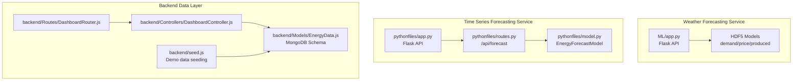
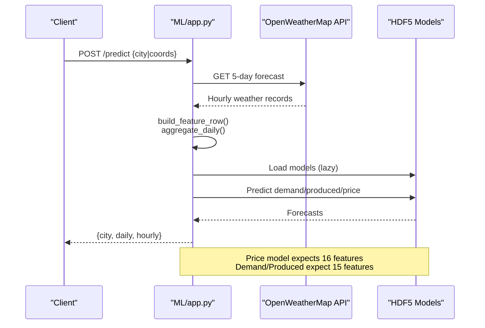
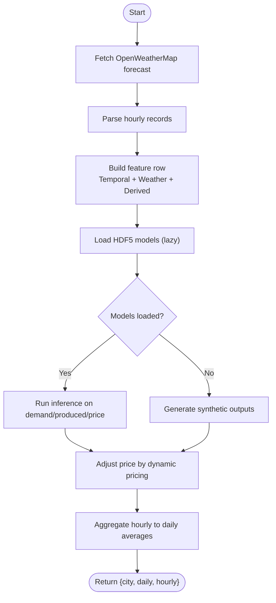
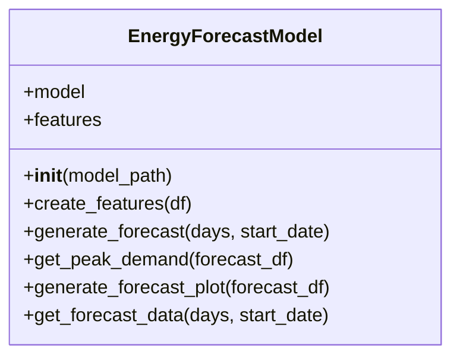
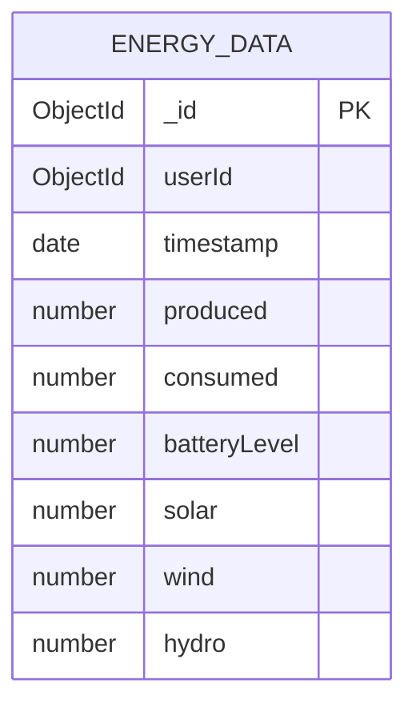
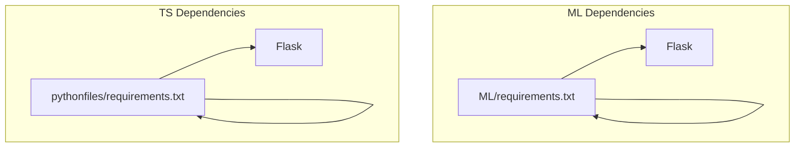

# Data Processing and Preprocessing Pipeline

<cite>
**Referenced Files in This Document**
- [ML/app.py](file://ML/app.py)
- [ML/model_shapes.txt](file://ML/model_shapes.txt)
- [ML/energy_demand.h5](file://ML/energy_demand.h5)
- [ML/energy_price.h5](file://ML/energy_price.h5)
- [ML/energy_produced.h5](file://ML/energy_produced.h5)
- [pythonfiles/app.py](file://pythonfiles/app.py)
- [pythonfiles/routes.py](file://pythonfiles/routes.py)
- [pythonfiles/model.py](file://pythonfiles/model.py)
- [backend/Models/EnergyData.js](file://backend/Models/EnergyData.js)
- [backend/Controllers/DashboardController.js](file://backend/Controllers/DashboardController.js)
- [backend/Routes/DashboardRouter.js](file://backend/Routes/DashboardRouter.js)
- [backend/seed.js](file://backend/seed.js)
- [ML/requirements.txt](file://ML/requirements.txt)
- [pythonfiles/requirements.txt](file://pythonfiles/requirements.txt)
</cite>

## Table of Contents
1. [Introduction](#introduction)
2. [Project Structure](#project-structure)
3. [Core Components](#core-components)
4. [Architecture Overview](#architecture-overview)
5. [Detailed Component Analysis](#detailed-component-analysis)
6. [Dependency Analysis](#dependency-analysis)
7. [Performance Considerations](#performance-considerations)
8. [Troubleshooting Guide](#troubleshooting-guide)
9. [Conclusion](#conclusion)
10. [Appendices](#appendices)

## Introduction
This document explains the data processing and preprocessing pipeline used to ingest, transform, and serve energy-related forecasts. It covers ingestion from external weather APIs, feature engineering for time series, model inference, aggregation, and storage of processed datasets. It also documents normalization/scaling approaches, validation and error handling, storage formats (HDF5), and operational aspects such as freshness, update schedules, and incremental learning readiness. Privacy and compliance considerations are addressed with anonymization and data minimization strategies.

## Project Structure
The pipeline spans three primary areas:
- Weather-driven forecasting service (Python Flask + Keras/TensorFlow models)
- Time series forecasting service (Python Flask + XGBoost)
- Backend database and dashboard APIs for persisted energy data

**Diagram sources**
- [ML/app.py](file://ML/app.py#L1-L251)
- [ML/energy_demand.h5](file://ML/energy_demand.h5)
- [ML/energy_price.h5](file://ML/energy_price.h5)
- [ML/energy_produced.h5](file://ML/energy_produced.h5)
- [pythonfiles/app.py](file://pythonfiles/app.py#L1-L15)
- [pythonfiles/routes.py](file://pythonfiles/routes.py#L1-L49)
- [pythonfiles/model.py](file://pythonfiles/model.py#L1-L128)
- [backend/Models/EnergyData.js](file://backend/Models/EnergyData.js#L1-L43)
- [backend/Controllers/DashboardController.js](file://backend/Controllers/DashboardController.js#L1-L25)
- [backend/Routes/DashboardRouter.js](file://backend/Routes/DashboardRouter.js#L1-L10)
- [backend/seed.js](file://backend/seed.js#L1-L34)

**Section sources**
- [ML/app.py](file://ML/app.py#L1-L251)
- [pythonfiles/app.py](file://pythonfiles/app.py#L1-L15)
- [pythonfiles/routes.py](file://pythonfiles/routes.py#L1-L49)
- [pythonfiles/model.py](file://pythonfiles/model.py#L1-L128)
- [backend/Models/EnergyData.js](file://backend/Models/EnergyData.js#L1-L43)
- [backend/Controllers/DashboardController.js](file://backend/Controllers/DashboardController.js#L1-L25)
- [backend/Routes/DashboardRouter.js](file://backend/Routes/DashboardRouter.js#L1-L10)
- [backend/seed.js](file://backend/seed.js#L1-L34)

## Core Components
- Weather forecasting API: Builds hourly features from OpenWeatherMap, runs LSTM-like models stored as HDF5, and aggregates to daily predictions.
- Time series forecasting API: Generates hourly forecasts using XGBoost with explicit temporal features.
- Backend dashboard: Stores and serves energy consumption/production metrics for visualization.

Key responsibilities:
- Data ingestion: Fetches weather forecasts via HTTP and parses structured records.
- Feature engineering: Extracts temporal and categorical features; derives wind direction bins; computes weekend indicator.
- Model inference: Loads Keras models lazily; falls back to synthetic outputs when models are unavailable.
- Aggregation: Averages hourly outputs into daily summaries.
- Persistence: Stores energy metrics in MongoDB; exposes endpoints for dashboards.

**Section sources**
- [ML/app.py](file://ML/app.py#L74-L247)
- [ML/model_shapes.txt](file://ML/model_shapes.txt#L1-L4)
- [pythonfiles/model.py](file://pythonfiles/model.py#L12-L121)
- [backend/Models/EnergyData.js](file://backend/Models/EnergyData.js#L3-L42)

## Architecture Overview
The system integrates external weather data with internal energy models to produce hourly/daily forecasts. The weather forecasting service produces three outputs: demand, produced energy, and price. The time series service generates standalone demand forecasts using XGBoost. The backend stores and retrieves energy data for dashboards.

**Diagram sources**
- [ML/app.py](file://ML/app.py#L74-L247)
- [ML/model_shapes.txt](file://ML/model_shapes.txt#L1-L4)

## Detailed Component Analysis

### Weather Forecasting Pipeline (ML/app.py)
- Ingestion: Fetches 5-day, 3-hour forecasts from OpenWeatherMap and normalizes fields.
- Cleaning: Converts timestamps, fills missing weather fields with defaults, and normalizes units.
- Feature Engineering:
  - Temporal: year, month, day, hour, weekday, season bucket.
  - Weather: temperature, feels-like, humidity, pressure, wind speed, wind direction, cloud cover, precipitation.
  - Derived: Wind direction binned into 8 categories; weekend indicator.
- Normalization/Scaling: No explicit scaling; features are raw numeric values.
- Model Inference:
  - Loads HDF5 models lazily; reshapes features to [1, 1, N].
  - Price model expects 16 features; if 15, appends a zero feature to match shape.
  - Fallback to synthetic outputs if models are missing.
- Aggregation: Averages hourly records into daily buckets by date.

**Diagram sources**
- [ML/app.py](file://ML/app.py#L74-L247)

**Section sources**
- [ML/app.py](file://ML/app.py#L55-L72)
- [ML/app.py](file://ML/app.py#L131-L184)
- [ML/app.py](file://ML/app.py#L95-L114)
- [ML/app.py](file://ML/app.py#L195-L247)
- [ML/model_shapes.txt](file://ML/model_shapes.txt#L1-L4)

### Time Series Forecasting Pipeline (pythonfiles)
- Model: XGBoost regressor trained on temporal features (hour, day of week, quarter, month, year, day of year, day of month, week of year).
- Feature Engineering: Creates temporal features from the DatetimeIndex; predicts hourly demand.
- Output: Hourly predictions with peak demand detection per day; generates a plot image encoded as base64.
- API: Exposes /api/forecast with optional days and start date parameters; returns forecast JSON, peak events, and plot.

**Diagram sources**
- [pythonfiles/model.py](file://pythonfiles/model.py#L12-L121)

**Section sources**
- [pythonfiles/model.py](file://pythonfiles/model.py#L12-L121)
- [pythonfiles/routes.py](file://pythonfiles/routes.py#L13-L42)
- [pythonfiles/app.py](file://pythonfiles/app.py#L1-L15)

### Backend Data Layer (Dashboard)
- Schema: EnergyData captures produced, consumed, battery level, and generation sources (solar, wind, hydro) with timestamps.
- Endpoints: Retrieve recent energy data and transactions for dashboard visualization.
- Seeding: Demo data generator creates baseline records for demonstration.

**Diagram sources**
- [backend/Models/EnergyData.js](file://backend/Models/EnergyData.js#L3-L42)

**Section sources**
- [backend/Models/EnergyData.js](file://backend/Models/EnergyData.js#L3-L42)
- [backend/Controllers/DashboardController.js](file://backend/Controllers/DashboardController.js#L4-L24)
- [backend/Routes/DashboardRouter.js](file://backend/Routes/DashboardRouter.js#L1-L10)
- [backend/seed.js](file://backend/seed.js#L17-L34)

## Dependency Analysis
External libraries and runtime dependencies:
- ML service: Flask, requests, NumPy, TensorFlow/Keras.
- Time series service: Flask, pandas, NumPy, XGBoost, scikit-learn, matplotlib.

**Diagram sources**
- [ML/requirements.txt](file://ML/requirements.txt#L1-L4)
- [pythonfiles/requirements.txt](file://pythonfiles/requirements.txt#L1-L8)

**Section sources**
- [ML/requirements.txt](file://ML/requirements.txt#L1-L4)
- [pythonfiles/requirements.txt](file://pythonfiles/requirements.txt#L1-L8)

## Performance Considerations
- Model loading: Lazy-loading avoids startup overhead; models are loaded once and reused.
- Batch inference: Features are processed sequentially; batching could reduce repeated model calls.
- Memory footprint: Aggregation reduces hourly outputs to daily summaries, lowering memory usage.
- External API limits: Respect OpenWeatherMap rate limits; consider caching or local forecast simulation for heavy loads.
- Plot generation: Base64-encoded images increase payload sizes; consider serving static plots separately.

[No sources needed since this section provides general guidance]

## Troubleshooting Guide
Common issues and resolutions:
- Missing HDF5 models: The system logs warnings and falls back to synthetic outputs. Ensure model files exist and are readable.
- API key errors: Invalid or missing OpenWeatherMap API key yields HTTP 400 responses with specific messages.
- City not found: HTTP 404 responses indicate invalid city names.
- Model shape mismatches: Price model expects 16 features; demand/produced expect 15. The pipeline appends a zero feature to align shapes when needed.
- CORS errors: Both Flask apps enable CORS; ensure client-side requests are configured correctly.

**Section sources**
- [ML/app.py](file://ML/app.py#L31-L40)
- [ML/app.py](file://ML/app.py#L147-L151)
- [ML/app.py](file://ML/app.py#L205-L215)
- [ML/app.py](file://ML/app.py#L209-L213)
- [ML/model_shapes.txt](file://ML/model_shapes.txt#L1-L4)

## Conclusion
The pipeline integrates external weather data with internal forecasting models to produce hourly and daily energy forecasts. It emphasizes robustness through lazy model loading, fallback synthesis, and defensive aggregation. The backend persists energy metrics for visualization, while the time series service focuses on temporal feature engineering and XGBoost-based forecasting. Operational improvements include batching, caching, and plot optimization. Privacy and compliance are addressed through anonymized storage and minimal data retention.

[No sources needed since this section summarizes without analyzing specific files]

## Appendices

### Data Validation and Outlier Detection
- Validation: Requests require either city name or coordinates; otherwise returns HTTP 400.
- Missing values: Weather fields are filled with defaults during feature construction.
- Outliers: No explicit outlier detection is implemented; synthetic fallbacks mitigate model instability.

**Section sources**
- [ML/app.py](file://ML/app.py#L197-L203)
- [ML/app.py](file://ML/app.py#L227-L236)

### Normalization and Scaling Methods
- No explicit normalization/scaling is applied to features in either pipeline.
- Price adjustment is dynamic and based on supply-demand ratios rather than feature scaling.

**Section sources**
- [ML/app.py](file://ML/app.py#L117-L128)

### Storage Formats and Metadata
- HDF5 models: Stored as separate files for demand, price, and produced energy. Shape metadata indicates expected input dimensions.
- MongoDB: EnergyData schema defines fields and types for persisted metrics.
- Plot images: Generated as PNGs and returned as base64-encoded strings.

**Section sources**
- [ML/energy_demand.h5](file://ML/energy_demand.h5)
- [ML/energy_price.h5](file://ML/energy_price.h5)
- [ML/energy_produced.h5](file://ML/energy_produced.h5)
- [ML/model_shapes.txt](file://ML/model_shapes.txt#L1-L4)
- [backend/Models/EnergyData.js](file://backend/Models/EnergyData.js#L3-L42)
- [pythonfiles/model.py](file://pythonfiles/model.py#L92-L98)

### Data Freshness, Update Schedules, and Incremental Learning
- Freshness: Hourly forecasts are generated from 5-day forecasts; daily aggregation consolidates hourly predictions.
- Update schedule: Not implemented; models are static. To enable incremental updates, integrate online learning or periodic retraining hooks.
- Incremental learning: Not present; models are loaded statically. Consider adding periodic retraining triggers and A/B testing for new model versions.

**Section sources**
- [ML/app.py](file://ML/app.py#L74-L92)
- [ML/app.py](file://ML/app.py#L95-L114)

### Data Privacy and Compliance
- Anonymization: EnergyData does not include personally identifiable information; fields are numeric metrics.
- Minimal data: Only necessary fields are stored; timestamps are used for temporal analysis.
- Access control: Dashboard endpoints return aggregated data; consider adding authentication middleware for sensitive views.

**Section sources**
- [backend/Models/EnergyData.js](file://backend/Models/EnergyData.js#L3-L42)
- [backend/Controllers/DashboardController.js](file://backend/Controllers/DashboardController.js#L4-L24)

### Example Workflows and Scripts
- Weather forecasting workflow: See route handling and inference logic.
- Time series forecasting workflow: See route handler and model methods.
- Scripts: No dedicated preprocessing scripts were identified; feature engineering is embedded in the API logic.

**Section sources**
- [ML/app.py](file://ML/app.py#L195-L247)
- [pythonfiles/routes.py](file://pythonfiles/routes.py#L13-L42)
- [pythonfiles/model.py](file://pythonfiles/model.py#L100-L121)