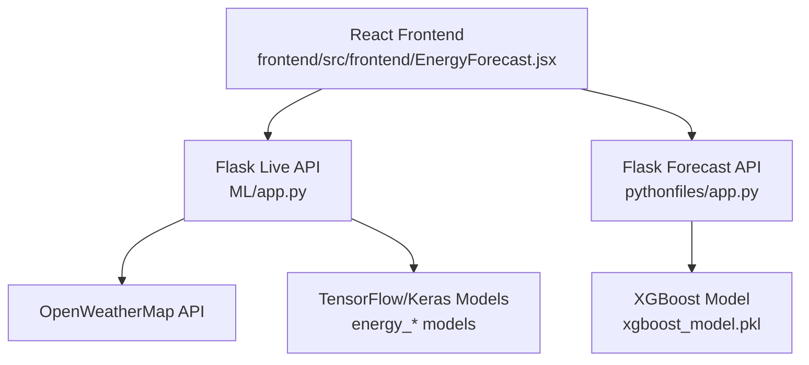
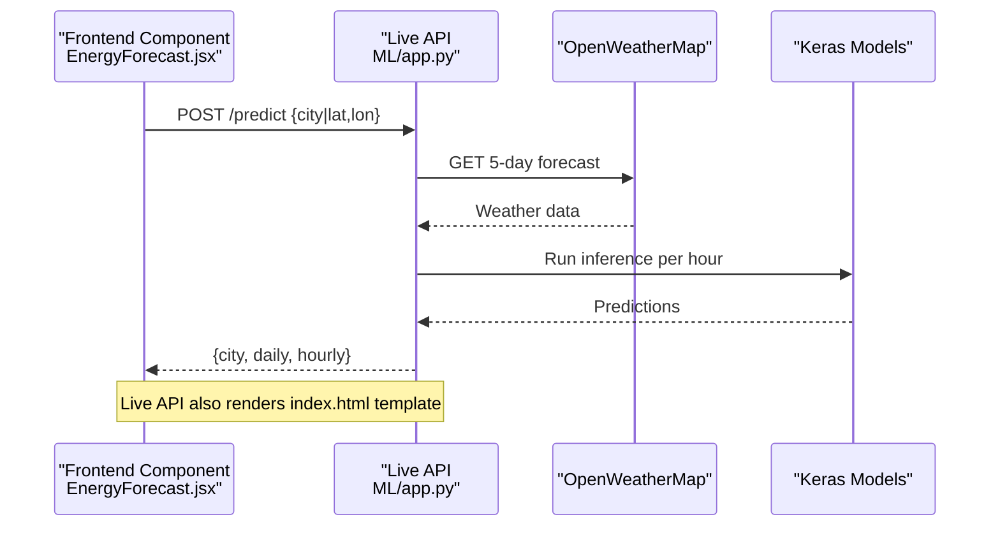
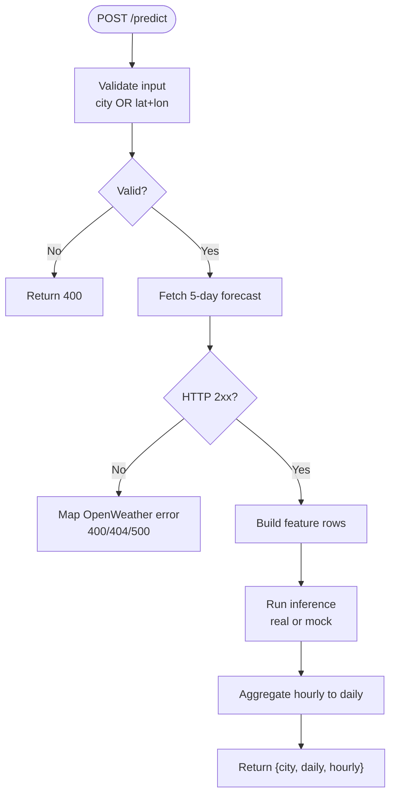
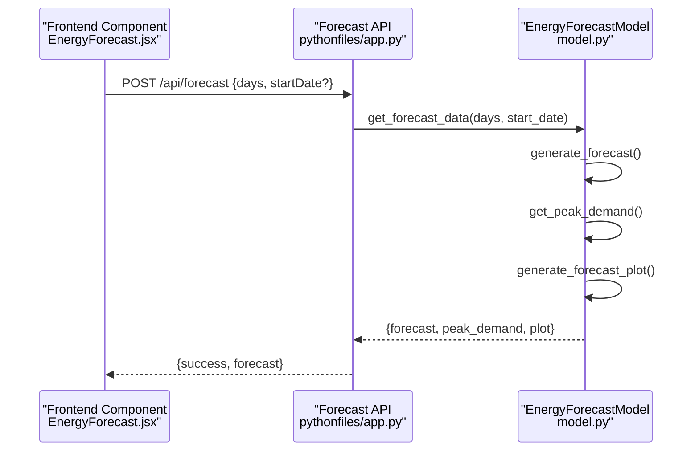
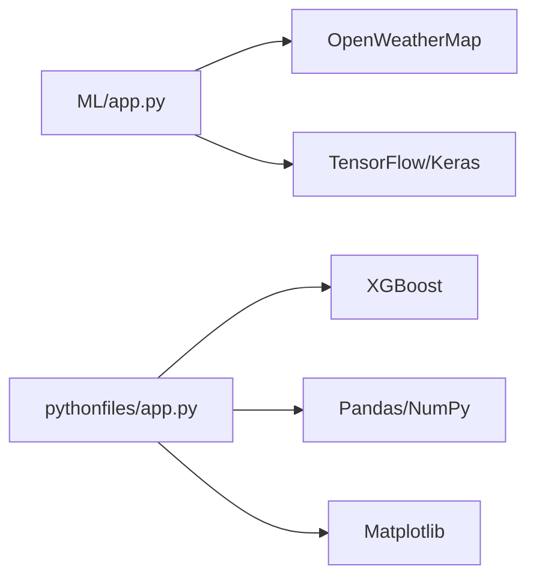

# Flask API Integration and Endpoints

<cite>
**Referenced Files in This Document**
- [ML/app.py](file://ML/app.py)
- [ML/requirements.txt](file://ML/requirements.txt)
- [ML/templates/index.html](file://ML/templates/index.html)
- [pythonfiles/app.py](file://pythonfiles/app.py)
- [pythonfiles/routes.py](file://pythonfiles/routes.py)
- [pythonfiles/model.py](file://pythonfiles/model.py)
- [frontend/src/frontend/EnergyForecast.jsx](file://frontend/src/frontend/EnergyForecast.jsx)
- [frontend/src/api.js](file://frontend/src/api.js)
- [README.md](file://README.md)
</cite>

## Table of Contents
1. [Introduction](#introduction)
2. [Project Structure](#project-structure)
3. [Core Components](#core-components)
4. [Architecture Overview](#architecture-overview)
5. [Detailed Component Analysis](#detailed-component-analysis)
6. [Dependency Analysis](#dependency-analysis)
7. [Performance Considerations](#performance-considerations)
8. [Troubleshooting Guide](#troubleshooting-guide)
9. [Conclusion](#conclusion)
10. [Appendices](#appendices)

## Introduction
This document describes the Flask-based APIs used by the frontend to deliver energy intelligence features. It covers:
- RESTful endpoints for live predictions and demand forecasting
- Request/response schemas and validation
- Error handling and integration with external services
- Configuration, routing, and CORS setup
- Authentication, rate limiting, and security considerations
- Practical usage examples with cURL and Python requests
- Versioning, backward compatibility, and deprecation policies
- Performance, latency, and scalability guidance

## Project Structure
The Flask APIs are implemented in two separate applications:
- Live prediction service: ML/app.py exposes a single endpoint to compute hourly/daily energy predictions based on weather.
- Demand forecasting service: pythonfiles/app.py exposes forecasting and model info endpoints backed by an XGBoost model.

**Diagram sources**
- [ML/app.py](file://ML/app.py#L1-L251)
- [pythonfiles/app.py](file://pythonfiles/app.py#L1-L15)
- [pythonfiles/routes.py](file://pythonfiles/routes.py#L1-L49)
- [pythonfiles/model.py](file://pythonfiles/model.py#L1-L128)
- [frontend/src/frontend/EnergyForecast.jsx](file://frontend/src/frontend/EnergyForecast.jsx#L100-L128)

**Section sources**
- [README.md](file://README.md#L184-L188)
- [ML/app.py](file://ML/app.py#L1-L251)
- [pythonfiles/app.py](file://pythonfiles/app.py#L1-L15)

## Core Components
- Live Prediction API (/predict): Accepts city or coordinates, fetches 5-day weather forecast, builds features, runs inference, aggregates to daily, and returns hourly and daily results.
- Demand Forecast API (/api/forecast): Accepts days and optional start date, generates hourly predictions using XGBoost, computes peak demand, and returns a plot and tabular data.
- Model Info Endpoint (/api/model-info): Returns metadata about the forecasting model.

Key configuration highlights:
- CORS enabled globally for both apps
- Flask app.run configured for local development
- External dependencies pinned in requirements

**Section sources**
- [ML/app.py](file://ML/app.py#L195-L247)
- [pythonfiles/routes.py](file://pythonfiles/routes.py#L13-L49)
- [ML/requirements.txt](file://ML/requirements.txt#L1-L4)

## Architecture Overview
The frontend integrates with both Flask services. Live predictions call ML/app.py’s /predict endpoint, while demand forecasts call pythonfiles/app.py’s /api/forecast and /api/model-info.

**Diagram sources**
- [ML/app.py](file://ML/app.py#L195-L247)
- [ML/templates/index.html](file://ML/templates/index.html#L590-L610)
- [frontend/src/frontend/EnergyForecast.jsx](file://frontend/src/frontend/EnergyForecast.jsx#L100-L128)

## Detailed Component Analysis

### Live Prediction API (/predict)
Purpose:
- Compute hourly and daily energy metrics (demand, produced, surplus, price) for a given city or coordinates.

Endpoints:
- Method: POST
- Path: /predict
- Content-Type: application/json

Request schema:
- city: string (optional if lat/lon provided)
- lat: number (optional)
- lon: number (optional)

Validation:
- At least one of city or lat/lon must be provided; otherwise returns 400 with error message.

External integrations:
- OpenWeatherMap: 5-day, 3-hour forecast
- TensorFlow/Keras models: demand, produced, price predictors

Processing logic:
- Build feature vectors per hour
- Run inference (real or mock fallback)
- Aggregate hourly to daily averages
- Apply dynamic pricing logic

Response schema:
- city: {name, country, lat, lon}
- daily: array of {date, demand, produced, surplus, price, temp, humidity}
- hourly: array of {date, hour, demand, produced, surplus, price, temp, humidity}

Error handling:
- 400: Missing city/coordinates, invalid OpenWeatherMap key, city not found
- 500: Other errors during forecast retrieval or processing

**Diagram sources**
- [ML/app.py](file://ML/app.py#L195-L247)

**Section sources**
- [ML/app.py](file://ML/app.py#L195-L247)
- [ML/templates/index.html](file://ML/templates/index.html#L590-L610)
- [frontend/src/frontend/EnergyForecast.jsx](file://frontend/src/frontend/EnergyForecast.jsx#L100-L128)

### Demand Forecast API (/api/forecast)
Purpose:
- Generate energy demand forecasts using an XGBoost model with configurable period and start date.

Endpoints:
- Method: POST
- Path: /api/forecast
- Content-Type: application/json

Request schema:
- days: integer (1–30)
- startDate: string (optional, YYYY-MM-DD)

Validation:
- days must be within 1–30; otherwise returns 400
- startDate must match YYYY-MM-DD; otherwise returns 400

Processing logic:
- Generate hourly timestamps from start date or today
- Create features from timestamps
- Predict using XGBoost model
- Compute peak demand per day
- Generate a PNG plot (base64)

Response schema:
- success: boolean
- forecast: {forecast, peak_demand, plot}

**Diagram sources**
- [pythonfiles/routes.py](file://pythonfiles/routes.py#L13-L41)
- [pythonfiles/model.py](file://pythonfiles/model.py#L100-L120)
- [frontend/src/frontend/EnergyForecast.jsx](file://frontend/src/frontend/EnergyForecast.jsx#L153-L173)

**Section sources**
- [pythonfiles/routes.py](file://pythonfiles/routes.py#L13-L41)
- [pythonfiles/model.py](file://pythonfiles/model.py#L100-L120)
- [frontend/src/frontend/EnergyForecast.jsx](file://frontend/src/frontend/EnergyForecast.jsx#L153-L173)

### Model Information Endpoint (/api/model-info)
Purpose:
- Retrieve metadata about the forecasting model.

Endpoints:
- Method: GET
- Path: /api/model-info

Response schema:
- features: array of feature names
- model_file: string
- description: string

**Section sources**
- [pythonfiles/routes.py](file://pythonfiles/routes.py#L43-L49)
- [pythonfiles/model.py](file://pythonfiles/model.py#L12-L18)

## Dependency Analysis
- External services:
  - OpenWeatherMap: weather forecast data
  - TensorFlow/Keras: demand, produced, price models
  - XGBoost: demand forecasting model
- Internal dependencies:
  - Flask blueprints and CORS
  - Pandas/NumPy for data processing
  - Matplotlib for plotting (converted to base64)

**Diagram sources**
- [ML/app.py](file://ML/app.py#L1-L251)
- [pythonfiles/app.py](file://pythonfiles/app.py#L1-L15)
- [pythonfiles/model.py](file://pythonfiles/model.py#L1-L128)

**Section sources**
- [ML/app.py](file://ML/app.py#L1-L251)
- [pythonfiles/app.py](file://pythonfiles/app.py#L1-L15)
- [pythonfiles/model.py](file://pythonfiles/model.py#L1-L128)

## Performance Considerations
- Model loading:
  - Live API lazily loads Keras models on first use; missing model files fall back to mock inference to keep UI responsive.
- Data processing:
  - Feature engineering and inference run per hour; aggregation reduces payload size.
- External calls:
  - OpenWeatherMap requests are subject to network latency and rate limits; consider caching or retry strategies.
- Visualization:
  - Forecast plots are generated and returned as base64 images; consider serving static assets separately for production.

[No sources needed since this section provides general guidance]

## Troubleshooting Guide
Common issues and resolutions:
- Missing city or coordinates:
  - Symptom: 400 error “City name or coordinates are required”
  - Resolution: Provide either city or both lat and lon
- OpenWeatherMap errors:
  - 401 Unauthorized: Invalid API key
  - 404 Not Found: City not found
  - 500 Internal Server Error: Other HTTP or network errors
- Forecast range validation:
  - Symptom: 400 error “Days must be between 1 and 30”
  - Resolution: Adjust days to within allowed range
- Date format:
  - Symptom: 400 error “Invalid date format. Use YYYY-MM-DD”
  - Resolution: Provide startDate in YYYY-MM-DD format

**Section sources**
- [ML/app.py](file://ML/app.py#L202-L215)
- [pythonfiles/routes.py](file://pythonfiles/routes.py#L19-L31)

## Conclusion
The Flask APIs provide two complementary capabilities: live energy predictions powered by weather and neural networks, and demand forecasting powered by XGBoost. They are integrated seamlessly by the React frontend, with clear request/response contracts and robust error handling. For production, consider adding authentication, rate limiting, and improved caching strategies.

[No sources needed since this section summarizes without analyzing specific files]

## Appendices

### API Usage Examples

- Live Prediction (cURL)
  - POST to http://localhost:5000/predict
  - Example payload: {"city": "Berlin"}
  - Example payload: {"lat": 52.52, "lon": 13.406}

- Live Prediction (Python requests)
  - Endpoint: http://localhost:5000/predict
  - Headers: {"Content-Type": "application/json"}
  - Body: {"city": "Berlin"}

- Demand Forecast (cURL)
  - POST to http://localhost:5001/api/forecast
  - Example payload: {"days": 7, "startDate": "2025-06-01"}

- Demand Forecast (Python requests)
  - Endpoint: http://localhost:5001/api/forecast
  - Headers: {"Content-Type": "application/json"}
  - Body: {"days": 7}

- Model Info (cURL)
  - GET http://localhost:5001/api/model-info

**Section sources**
- [ML/app.py](file://ML/app.py#L195-L247)
- [pythonfiles/routes.py](file://pythonfiles/routes.py#L13-L49)
- [frontend/src/frontend/EnergyForecast.jsx](file://frontend/src/frontend/EnergyForecast.jsx#L100-L128)
- [frontend/src/frontend/EnergyForecast.jsx](file://frontend/src/frontend/EnergyForecast.jsx#L153-L173)

### Authentication, Rate Limiting, and Security
- Authentication:
  - No authentication is implemented in the Flask APIs documented here.
- CORS:
  - Enabled globally for both Flask apps to allow frontend cross-origin requests.
- Rate limiting:
  - Not implemented; consider adding rate limiting middleware for production.
- Secrets and keys:
  - OpenWeatherMap API key is embedded in the live API; replace with environment variable in production.
  - Flask SECRET_KEY is present in the forecasting app; use environment variables for secrets in production.

**Section sources**
- [ML/app.py](file://ML/app.py#L8-L9)
- [ML/app.py](file://ML/app.py#L14)
- [pythonfiles/app.py](file://pythonfiles/app.py#L5-L10)

### API Versioning, Backward Compatibility, and Deprecation
- Versioning:
  - No explicit versioning scheme is present in the endpoints documented here.
- Backward compatibility:
  - Maintain stable request/response shapes for existing clients.
- Deprecation:
  - Introduce a deprecation policy with advance notice and migration path before changing endpoint signatures.

[No sources needed since this section provides general guidance]

### Integration Notes
- Frontend integration:
  - Live predictions call ML/app.py’s /predict endpoint.
  - Demand forecasts call pythonfiles/app.py’s /api/forecast and /api/model-info endpoints.
- Backend integration:
  - The README documents a separate Express backend for authentication and marketplace; it is distinct from the Flask forecasting services.

**Section sources**
- [frontend/src/frontend/EnergyForecast.jsx](file://frontend/src/frontend/EnergyForecast.jsx#L100-L128)
- [frontend/src/frontend/EnergyForecast.jsx](file://frontend/src/frontend/EnergyForecast.jsx#L153-L173)
- [README.md](file://README.md#L184-L188)