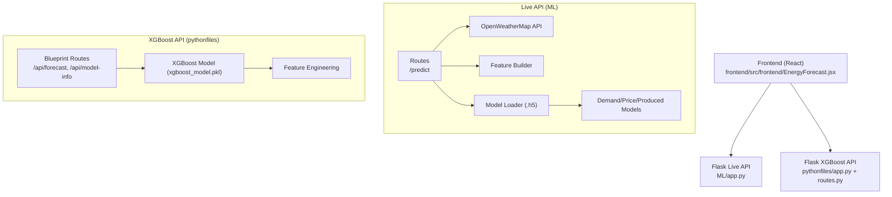
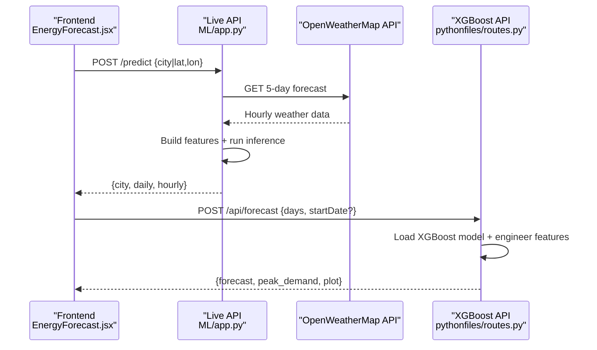
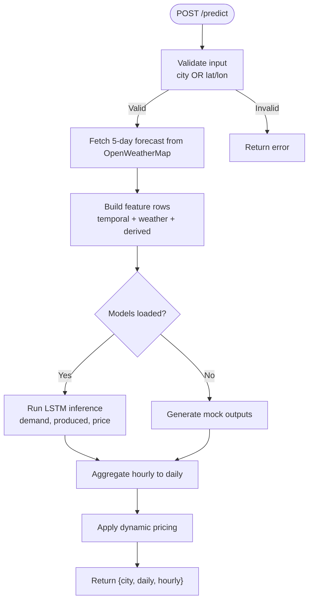
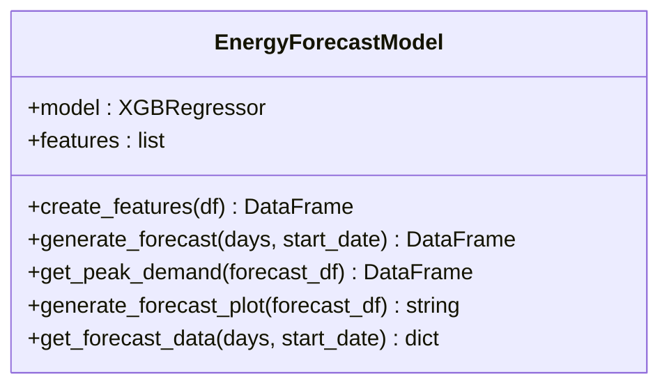
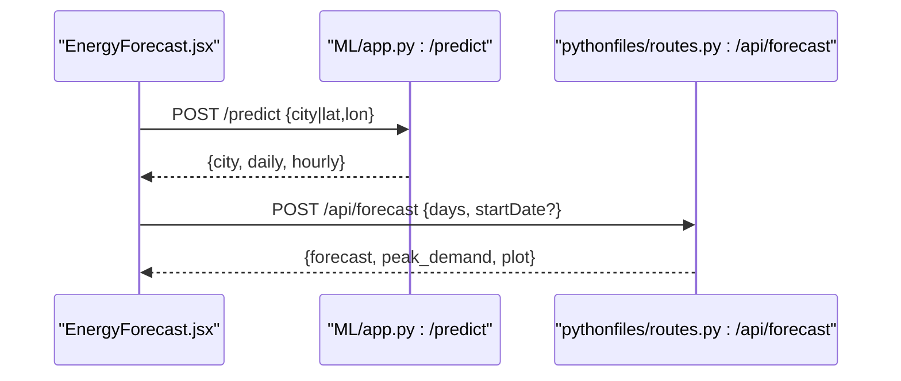
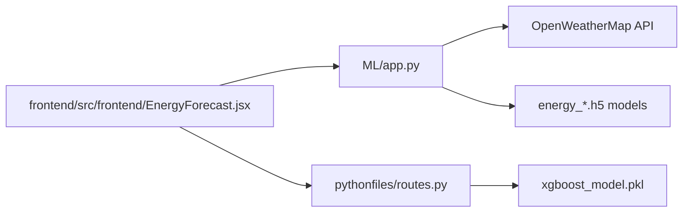

# Machine Learning System

<cite>
**Referenced Files in This Document**
- [ML/app.py](file://ML/app.py)
- [ML/templates/index.html](file://ML/templates/index.html)
- [ML/model_shapes.txt](file://ML/model_shapes.txt)
- [ML/energy_demand.h5](file://ML/energy_demand.h5)
- [ML/energy_price.h5](file://ML/energy_price.h5)
- [ML/energy_produced.h5](file://ML/energy_produced.h5)
- [pythonfiles/app.py](file://pythonfiles/app.py)
- [pythonfiles/routes.py](file://pythonfiles/routes.py)
- [pythonfiles/model.py](file://pythonfiles/model.py)
- [frontend/src/frontend/EnergyForecast.jsx](file://frontend/src/frontend/EnergyForecast.jsx)
</cite>

## Table of Contents
1. [Introduction](#introduction)
2. [Project Structure](#project-structure)
3. [Core Components](#core-components)
4. [Architecture Overview](#architecture-overview)
5. [Detailed Component Analysis](#detailed-component-analysis)
6. [Dependency Analysis](#dependency-analysis)
7. [Performance Considerations](#performance-considerations)
8. [Troubleshooting Guide](#troubleshooting-guide)
9. [Conclusion](#conclusion)
10. [Appendices](#appendices)

## Introduction
This document describes the machine learning system powering energy forecasting in the EcoGrid platform. It covers:
- The XGBoost-based energy demand forecasting service and its Flask API
- The integrated Keras/LSTM-based energy prediction service for live weather-driven forecasts
- Data preprocessing, feature engineering, and seasonal pattern handling
- Deployment strategy, performance optimization, and monitoring
- Integration with the main frontend application via RESTful APIs
- Model evaluation, accuracy assessment, and prediction confidence handling
- Retraining procedures, data freshness, and operational guidance

## Project Structure
The system comprises two complementary Flask services:
- Live weather-driven forecasting service (Keras/LSTM): ML/app.py
- Historical/XGBoost-based demand forecasting service: pythonfiles/model.py + routes.py

**Diagram sources**
- [ML/app.py](file://ML/app.py#L195-L247)
- [pythonfiles/app.py](file://pythonfiles/app.py#L1-L15)
- [pythonfiles/routes.py](file://pythonfiles/routes.py#L13-L49)
- [pythonfiles/model.py](file://pythonfiles/model.py#L12-L44)

**Section sources**
- [ML/app.py](file://ML/app.py#L1-L251)
- [pythonfiles/app.py](file://pythonfiles/app.py#L1-L15)
- [pythonfiles/routes.py](file://pythonfiles/routes.py#L1-L49)
- [pythonfiles/model.py](file://pythonfiles/model.py#L1-L128)
- [frontend/src/frontend/EnergyForecast.jsx](file://frontend/src/frontend/EnergyForecast.jsx#L100-L178)

## Core Components
- Live weather-driven forecasting service:
  - Flask route: POST /predict
  - Feature engineering: temporal + weather-derived features
  - Model inference: Keras LSTM models for demand, produced, price
  - Dynamic pricing logic based on predicted supply/demand
- XGBoost demand forecasting service:
  - Flask blueprint: POST /api/forecast, GET /api/model-info
  - XGBoost regressor with temporal features
  - Forecast plotting and peak demand detection

Key runtime characteristics:
- Lazy-loading of Keras models (.h5) with graceful fallback
- Shape expectations for LSTM inputs documented in model_shapes.txt
- Frontend integration via localhost Flask endpoints

**Section sources**
- [ML/app.py](file://ML/app.py#L16-L247)
- [ML/model_shapes.txt](file://ML/model_shapes.txt#L1-L4)
- [pythonfiles/routes.py](file://pythonfiles/routes.py#L13-L49)
- [pythonfiles/model.py](file://pythonfiles/model.py#L12-L120)

## Architecture Overview
End-to-end flow for live predictions and demand forecasting:

**Diagram sources**
- [ML/app.py](file://ML/app.py#L195-L247)
- [pythonfiles/routes.py](file://pythonfiles/routes.py#L13-L41)
- [frontend/src/frontend/EnergyForecast.jsx](file://frontend/src/frontend/EnergyForecast.jsx#L100-L178)

## Detailed Component Analysis

### Live Weather-Driven Forecasting Service (ML/app.py)
- Endpoint: POST /predict
  - Accepts city name or lat/lon
  - Fetches 5-day hourly weather forecast from OpenWeatherMap
  - Builds feature vectors with temporal and weather-derived attributes
  - Runs inference using Keras LSTM models for demand, produced, price
  - Aggregates hourly results into daily summaries
  - Applies dynamic pricing based on predicted supply/demand balance
- Feature engineering:
  - Temporal: year, month, day, hour, weekday, season
  - Weather: temperature, feels_like, humidity, pressure, wind speed/direction, cloud cover, precipitation
  - Derived: weekend indicator
- Model loading and inference:
  - Lazy load .h5 models if present; otherwise simulate plausible outputs
  - Price model expects 16 features; if needed, append a zero feature to match shape
- Response format:
  - city: name, country, lat, lon
  - daily: averaged hourly values per day
  - hourly: per-hour values

**Diagram sources**
- [ML/app.py](file://ML/app.py#L195-L247)
- [ML/app.py](file://ML/app.py#L74-L92)
- [ML/app.py](file://ML/app.py#L55-L72)
- [ML/app.py](file://ML/app.py#L131-L184)

**Section sources**
- [ML/app.py](file://ML/app.py#L195-L247)
- [ML/app.py](file://ML/app.py#L74-L92)
- [ML/app.py](file://ML/app.py#L55-L72)
- [ML/app.py](file://ML/app.py#L131-L184)
- [ML/model_shapes.txt](file://ML/model_shapes.txt#L1-L4)

### XGBoost Demand Forecasting Service (pythonfiles)
- Endpoints:
  - POST /api/forecast: generates hourly demand forecast for N days
  - GET /api/model-info: returns model metadata (features, file)
- Model implementation:
  - Loads xgboost_model.pkl
  - Creates temporal features: hour, dayofweek, quarter, month, year, dayofyear, dayofmonth, weekofyear
  - Generates hourly predictions over requested period
  - Computes peak demand per day and produces a plot (PNG base64)
- Response format:
  - forecast: array of {datetime, prediction}
  - peak_demand: array of {datetime, prediction, hour, message}
  - plot: PNG image encoded as base64 string

**Diagram sources**
- [pythonfiles/model.py](file://pythonfiles/model.py#L12-L120)

**Section sources**
- [pythonfiles/routes.py](file://pythonfiles/routes.py#L13-L49)
- [pythonfiles/model.py](file://pythonfiles/model.py#L12-L120)

### Frontend Integration
- Live predictions:
  - Calls http://localhost:5000/predict with city or lat/lon
  - Renders hourly/daily charts and KPIs
- Demand forecast:
  - Calls http://localhost:5001/api/forecast with days and optional startDate
  - Renders plot, peak alerts, and hourly data table

**Diagram sources**
- [frontend/src/frontend/EnergyForecast.jsx](file://frontend/src/frontend/EnergyForecast.jsx#L100-L178)
- [ML/app.py](file://ML/app.py#L195-L247)
- [pythonfiles/routes.py](file://pythonfiles/routes.py#L13-L41)

**Section sources**
- [frontend/src/frontend/EnergyForecast.jsx](file://frontend/src/frontend/EnergyForecast.jsx#L100-L178)

## Dependency Analysis
- External dependencies:
  - ML service: Flask, NumPy, Requests, TensorFlow/Keras
  - XGBoost service: Flask, Pandas, NumPy, XGBoost, Matplotlib, scikit-learn, Gunicorn
- Internal dependencies:
  - ML service depends on OpenWeatherMap API and local .h5 model files
  - XGBoost service depends on xgboost_model.pkl and internal feature engineering

**Diagram sources**
- [ML/app.py](file://ML/app.py#L1-L251)
- [pythonfiles/routes.py](file://pythonfiles/routes.py#L1-L49)
- [frontend/src/frontend/EnergyForecast.jsx](file://frontend/src/frontend/EnergyForecast.jsx#L100-L178)

**Section sources**
- [ML/app.py](file://ML/app.py#L1-L251)
- [pythonfiles/routes.py](file://pythonfiles/routes.py#L1-L49)
- [ML/energy_demand.h5](file://ML/energy_demand.h5)
- [ML/energy_price.h5](file://ML/energy_price.h5)
- [ML/energy_produced.h5](file://ML/energy_produced.h5)
- [pythonfiles/model.py](file://pythonfiles/model.py#L12-L16)

## Performance Considerations
- Model loading and warm-up:
  - Lazy-loading avoids startup failures if .h5 files are missing; fallback ensures UI remains functional
- Inference optimization:
  - Batch-like processing of hourly records; reshape to [1, 1, N] for LSTM models
  - Price model shape adjustment via zero-padding when needed
- Data freshness:
  - OpenWeatherMap forecast refreshed on each request; ensure API key validity and rate limits
- Scalability:
  - Use Gunicorn in production for pythonfiles service
  - Consider caching frequent city forecasts and pre-aggregating daily summaries
- Latency:
  - Minimize external API calls; cache city coordinates and reduce repeated calls
  - Compress plots and avoid unnecessary recomputation

[No sources needed since this section provides general guidance]

## Troubleshooting Guide
Common issues and resolutions:
- Missing .h5 models:
  - Behavior: Fallback to mock outputs; verify model files presence
  - Action: Place energy_demand.h5, energy_price.h5, energy_produced.h5 in ML/
- Invalid OpenWeatherMap API key:
  - Behavior: HTTP 401 error mapped to user-friendly message
  - Action: Replace OPENWEATHER_API_KEY in ML/app.py with a valid key
- City not found:
  - Behavior: HTTP 404 mapped to user-friendly message
  - Action: Verify city spelling or use lat/lon coordinates
- Price model shape mismatch:
  - Behavior: Automatic fallback by appending a zero feature to match expected 16 features
  - Action: Ensure model_shapes.txt alignment or adjust feature builder accordingly
- XGBoost endpoint errors:
  - Behavior: Validation errors for days range and date format; generic exceptions handled
  - Action: Ensure days is between 1 and 30; startDate is YYYY-MM-DD if provided

**Section sources**
- [ML/app.py](file://ML/app.py#L131-L184)
- [ML/app.py](file://ML/app.py#L195-L247)
- [ML/model_shapes.txt](file://ML/model_shapes.txt#L1-L4)
- [pythonfiles/routes.py](file://pythonfiles/routes.py#L19-L31)

## Conclusion
The EcoGrid machine learning system combines a weather-driven LSTM service and an XGBoost-based demand forecasting service. Together, they provide hourly and daily energy predictions, dynamic pricing signals, and visual insights. The modular design enables independent scaling and deployment, while the frontend integrates seamlessly via RESTful endpoints. Proper model management, data freshness, and performance tuning are essential for reliable operation.

[No sources needed since this section summarizes without analyzing specific files]

## Appendices

### API Definitions

- Live Forecast API (ML/app.py)
  - Method: POST
  - Path: /predict
  - Request body:
    - city: string (required if lat/lon not provided)
    - lat: number (optional)
    - lon: number (optional)
  - Response:
    - city: {name, country, lat, lon}
    - daily: array of {date, demand, produced, surplus, price, temp, humidity}
    - hourly: array of {date, hour, demand, produced, surplus, price, temp, humidity}

- XGBoost Forecast API (pythonfiles/routes.py)
  - Method: POST
  - Path: /api/forecast
  - Request body:
    - days: integer (1–30)
    - startDate: string "YYYY-MM-DD" (optional)
  - Response:
    - success: boolean
    - forecast: {forecast, peak_demand, plot}

- Model Info API (pythonfiles/routes.py)
  - Method: GET
  - Path: /api/model-info
  - Response:
    - features: array of feature names
    - model_file: string
    - description: string

**Section sources**
- [ML/app.py](file://ML/app.py#L195-L247)
- [pythonfiles/routes.py](file://pythonfiles/routes.py#L13-L49)

### Data Preprocessing and Feature Engineering
- ML service (LSTM):
  - Features: year, month, day, hour, weekday, season, temperature, feels_like, humidity, pressure, wind speed, wind direction, cloud cover, precipitation, weekend flag
  - Season mapping: month to quarter-like index
  - Wind direction: binned into 8 sectors
  - Weekend: boolean derived from weekday
- XGBoost service:
  - Features: dayofyear, hour, dayofweek, quarter, month, year
  - Additional derived features: dayofmonth, weekofyear

**Section sources**
- [ML/app.py](file://ML/app.py#L46-L72)
- [pythonfiles/model.py](file://pythonfiles/model.py#L19-L30)

### Model Shapes and Inputs
- LSTM model shapes (per model_shapes.txt):
  - demand: (None, 24, 15)
  - price: (None, 24, 16)
  - produced: (None, 24, 15)
- Price model shape mismatch handling:
  - Automatic zero-padding appended to match 16 features when necessary

**Section sources**
- [ML/model_shapes.txt](file://ML/model_shapes.txt#L1-L4)
- [ML/app.py](file://ML/app.py#L145-L151)

### Example Prediction Requests and Responses
- Live Forecast Request:
  - POST http://localhost:5000/predict
  - Body: {"city": "London"}
- Live Forecast Response:
  - Fields: city, daily, hourly
  - daily: [{"date": "...", "demand": 123.45, "produced": 67.89, "surplus": 55.56, "price": 0.1234, "temp": 12.3, "humidity": 78}]
  - hourly: [{"date": "...", "hour": 14, "demand": 123.45, "produced": 67.89, "surplus": 55.56, "price": 0.1234, "temp": 12.3, "humidity": 78}]
- XGBoost Forecast Request:
  - POST http://localhost:5001/api/forecast
  - Body: {"days": 7, "startDate": "2025-06-01"}
- XGBoost Forecast Response:
  - Fields: success, forecast
  - forecast: {forecast: [...], peak_demand: [...], plot: "data:image/png;base64,..."}

**Section sources**
- [ML/app.py](file://ML/app.py#L195-L247)
- [pythonfiles/routes.py](file://pythonfiles/routes.py#L13-L41)
- [frontend/src/frontend/EnergyForecast.jsx](file://frontend/src/frontend/EnergyForecast.jsx#L100-L178)

### Model Evaluation, Accuracy, and Confidence
- Current implementation does not expose explicit metrics or confidence intervals in responses.
- Recommendations:
  - Integrate evaluation metrics (MAE, RMSE, MAPE) during training and log them
  - Return confidence bands or quantiles from XGBoost (e.g., quantile regression) for uncertainty
  - Track prediction drift and trigger retraining alerts

[No sources needed since this section provides general guidance]

### Retraining Procedures and Data Freshness
- Retraining:
  - Retrain XGBoost model with recent historical data; update xgboost_model.pkl
  - Retrain LSTM models with new weather-demand pairs; update .h5 files
- Data freshness:
  - OpenWeatherMap forecast updates every 3 hours; ensure fresh requests for accurate predictions
  - Monitor API key validity and quota limits

[No sources needed since this section provides general guidance]