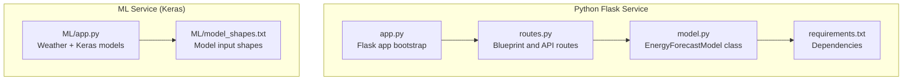
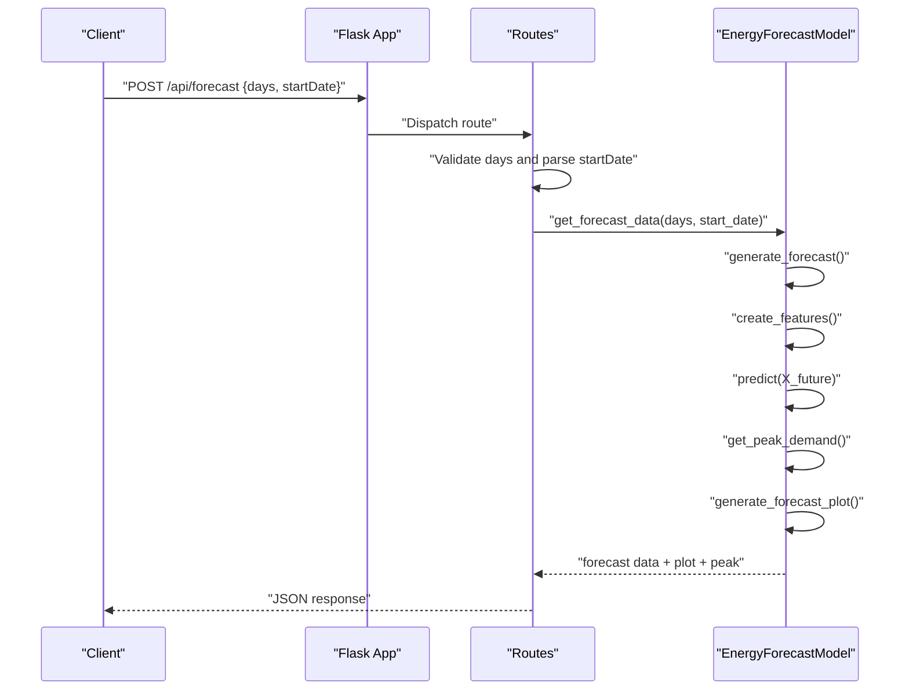
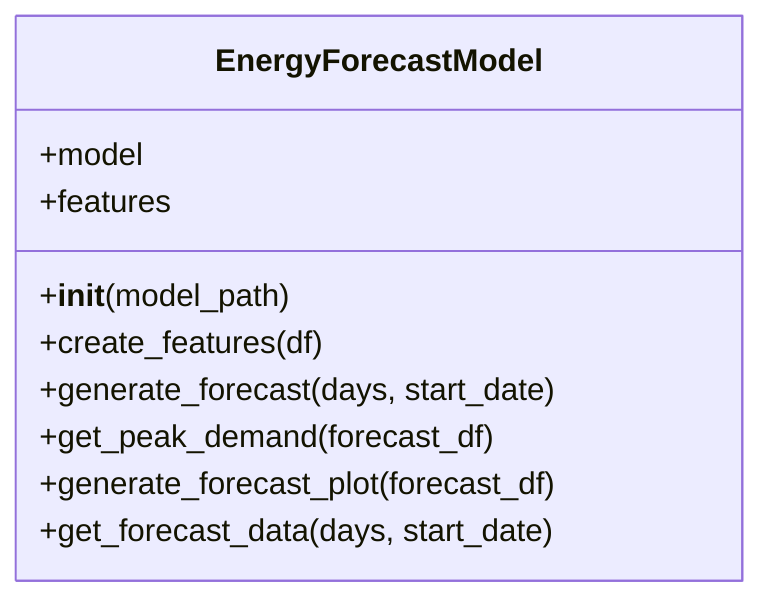
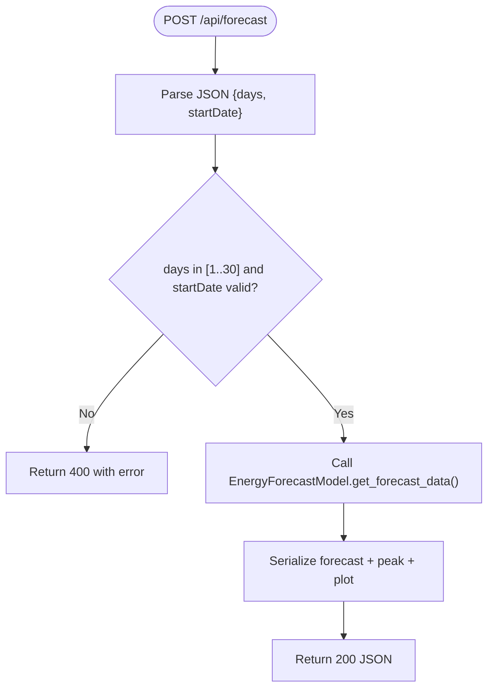
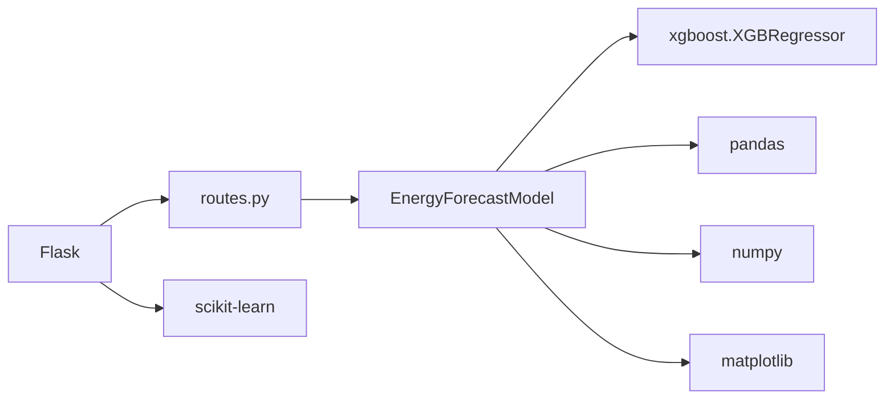

# Model Architecture and Implementation

<cite>
**Referenced Files in This Document**
- [model.py](file://pythonfiles/model.py)
- [routes.py](file://pythonfiles/routes.py)
- [app.py](file://pythonfiles/app.py)
- [requirements.txt](file://pythonfiles/requirements.txt)
- [app.py](file://ML/app.py)
- [model_shapes.txt](file://ML/model_shapes.txt)
</cite>

## Table of Contents
1. [Introduction](#introduction)
2. [Project Structure](#project-structure)
3. [Core Components](#core-components)
4. [Architecture Overview](#architecture-overview)
5. [Detailed Component Analysis](#detailed-component-analysis)
6. [Dependency Analysis](#dependency-analysis)
7. [Performance Considerations](#performance-considerations)
8. [Troubleshooting Guide](#troubleshooting-guide)
9. [Conclusion](#conclusion)
10. [Appendices](#appendices)

## Introduction
This document describes the XGBoost-based energy demand forecasting model and its Python-based serving stack. It explains the decision tree ensemble structure, feature engineering pipeline, model serialization and loading, input/output specifications, and deployment considerations. It also outlines the training methodology, dataset preparation, cross-validation strategies, performance optimization techniques, and interpretability approaches such as SHAP-based analysis.

## Project Structure
The forecasting system is composed of:
- A Flask web service exposing REST endpoints for energy demand forecasting.
- An XGBoost regressor model serialized to a pickle file and loaded at runtime.
- A feature engineering module that transforms timestamps into cyclical and calendar features.
- A plotting utility to produce forecast charts.
- A separate ML service (unrelated to XGBoost) for weather-based energy demand, price, and production modeling.

**Diagram sources**
- [routes.py](file://pythonfiles/routes.py#L1-L49)
- [model.py](file://pythonfiles/model.py#L1-L128)
- [app.py](file://pythonfiles/app.py#L1-L15)
- [requirements.txt](file://pythonfiles/requirements.txt#L1-L8)
- [app.py](file://ML/app.py#L1-L251)
- [model_shapes.txt](file://ML/model_shapes.txt#L1-L4)

**Section sources**
- [routes.py](file://pythonfiles/routes.py#L1-L49)
- [model.py](file://pythonfiles/model.py#L1-L128)
- [app.py](file://pythonfiles/app.py#L1-L15)
- [requirements.txt](file://pythonfiles/requirements.txt#L1-L8)
- [app.py](file://ML/app.py#L1-L251)
- [model_shapes.txt](file://ML/model_shapes.txt#L1-L4)

## Core Components
- EnergyForecastModel: Loads a pre-trained XGBoost regressor, creates temporal features, generates hourly forecasts, identifies peak demand per day, produces plots, and serializes forecast data.
- Flask routes: Exposes POST /api/forecast to accept days and optional start date, returning forecast data and peak demand highlights.
- Dependencies: Flask, pandas, numpy, xgboost, scikit-learn, matplotlib, gunicorn.

Key implementation references:
- Model initialization and loading: [model.py](file://pythonfiles/model.py#L12-L17)
- Feature creation: [model.py](file://pythonfiles/model.py#L19-L30)
- Forecast generation: [model.py](file://pythonfiles/model.py#L32-L44)
- Peak demand detection: [model.py](file://pythonfiles/model.py#L46-L65)
- Plot generation: [model.py](file://pythonfiles/model.py#L67-L98)
- Forecast serialization: [model.py](file://pythonfiles/model.py#L100-L120)
- API endpoint: [routes.py](file://pythonfiles/routes.py#L13-L38)
- Model info endpoint: [routes.py](file://pythonfiles/routes.py#L43-L49)
- Dependencies: [requirements.txt](file://pythonfiles/requirements.txt#L1-L8)

**Section sources**
- [model.py](file://pythonfiles/model.py#L12-L120)
- [routes.py](file://pythonfiles/routes.py#L13-L49)
- [requirements.txt](file://pythonfiles/requirements.txt#L1-L8)

## Architecture Overview
The forecasting service is a thin Flask wrapper around the XGBoost model. The client sends a JSON payload specifying the number of days and optional start date. The server constructs hourly timestamps, computes temporal features, runs inference, and returns structured forecast data along with a PNG chart and peak demand highlights.

**Diagram sources**
- [routes.py](file://pythonfiles/routes.py#L13-L38)
- [model.py](file://pythonfiles/model.py#L32-L120)

## Detailed Component Analysis

### EnergyForecastModel
Responsibilities:
- Load XGBoost regressor from a serialized file.
- Build temporal features from a DatetimeIndex.
- Generate hourly predictions over a requested horizon.
- Aggregate peak demand per day and annotate with formatted messages.
- Render a forecast plot and encode it as base64.

Implementation highlights:
- Initialization and model loading: [model.py](file://pythonfiles/model.py#L12-L17)
- Feature engineering: [model.py](file://pythonfiles/model.py#L19-L30)
- Forecast generation: [model.py](file://pythonfiles/model.py#L32-L44)
- Peak detection: [model.py](file://pythonfiles/model.py#L46-L65)
- Plot generation: [model.py](file://pythonfiles/model.py#L67-L98)
- Serialization of forecast data: [model.py](file://pythonfiles/model.py#L100-L120)

**Diagram sources**
- [model.py](file://pythonfiles/model.py#L12-L120)

**Section sources**
- [model.py](file://pythonfiles/model.py#L12-L120)

### API Endpoints
- POST /api/forecast: Accepts JSON with days and optional startDate, validates inputs, and returns forecast data, peak demand highlights, and a base64-encoded plot.
- GET /api/model-info: Returns model metadata including feature list and model filename.

References:
- Forecast endpoint: [routes.py](file://pythonfiles/routes.py#L13-L38)
- Model info endpoint: [routes.py](file://pythonfiles/routes.py#L43-L49)

**Diagram sources**
- [routes.py](file://pythonfiles/routes.py#L13-L38)

**Section sources**
- [routes.py](file://pythonfiles/routes.py#L13-L49)

### Training Methodology and Dataset Preparation
Observed behavior in the serving code:
- The model is initialized as an XGBRegressor and loaded from a pickle file at runtime.
- Feature set used for inference includes temporal features derived from the DatetimeIndex.

Training-related observations:
- The model is loaded via a pickle file path passed to the constructor.
- No training code is present in the analyzed files; therefore, training methodology, hyperparameters, and cross-validation strategies are not documented here.

References:
- Model instantiation and loading: [model.py](file://pythonfiles/model.py#L12-L17)
- Feature list used during inference: [model.py](file://pythonfiles/model.py#L17-L17)

**Section sources**
- [model.py](file://pythonfiles/model.py#L12-L17)

### Hyperparameter Configuration
- The model is instantiated as an XGBRegressor without explicit hyperparameters in the serving code.
- No hyperparameter tuning or CV code is present in the analyzed files.

References:
- Model construction: [model.py](file://pythonfiles/model.py#L15-L15)

**Section sources**
- [model.py](file://pythonfiles/model.py#L15-L15)

### Feature Engineering and Preprocessing
- Temporal features created from DatetimeIndex:
  - Hour, day of week, quarter, month, year, day of year, day of month, week of year.
- Features used for prediction: dayofyear, hour, dayofweek, quarter, month, year.

References:
- Feature creation: [model.py](file://pythonfiles/model.py#L19-L30)
- Prediction features: [model.py](file://pythonfiles/model.py#L17-L17)

**Section sources**
- [model.py](file://pythonfiles/model.py#L19-L30)
- [model.py](file://pythonfiles/model.py#L17-L17)

### Model Serialization and Version Management
- The model is loaded from a pickle file named xgboost_model.pkl.
- The model file is referenced in the model info endpoint.

References:
- Model loading: [model.py](file://pythonfiles/model.py#L16-L16)
- Model info endpoint: [routes.py](file://pythonfiles/routes.py#L46-L47)

**Section sources**
- [model.py](file://pythonfiles/model.py#L16-L16)
- [routes.py](file://pythonfiles/routes.py#L46-L47)

### Deployment Considerations
- Flask app configured with CORS and a secret key.
- Gunicorn is listed as a dependency for production deployments.
- The model file must be present at runtime.

References:
- Flask app bootstrap: [app.py](file://pythonfiles/app.py#L1-L15)
- Dependencies: [requirements.txt](file://pythonfiles/requirements.txt#L1-L8)

**Section sources**
- [app.py](file://pythonfiles/app.py#L1-L15)
- [requirements.txt](file://pythonfiles/requirements.txt#L1-L8)

### Technical Specifications: Shapes, Dimensions, and Memory
- The ML service (unrelated to XGBoost) defines model input shapes for demand, price, and produced models. These are provided for context but do not apply to the XGBoost model.
- The XGBoost model’s input dimension corresponds to the number of features used for inference (6 temporal features).

References:
- Model shapes (Keras models): [model_shapes.txt](file://ML/model_shapes.txt#L1-L4)
- Prediction features count: [model.py](file://pythonfiles/model.py#L17-L17)

**Section sources**
- [model_shapes.txt](file://ML/model_shapes.txt#L1-L4)
- [model.py](file://pythonfiles/model.py#L17-L17)

### Accuracy Metrics, Precision-Recall Trade-offs, and Confidence Intervals
- The serving code does not compute accuracy metrics, precision-recall curves, or confidence intervals.
- No evaluation code is present in the analyzed files.

**Section sources**
- [model.py](file://pythonfiles/model.py#L1-L128)

### Interpretability: SHAP Values and Feature Contribution Analysis
- The serving code does not compute SHAP values or feature contributions.
- No interpretability utilities are present in the analyzed files.

**Section sources**
- [model.py](file://pythonfiles/model.py#L1-L128)

## Dependency Analysis
External libraries and their roles:
- Flask: Web framework for API endpoints.
- pandas/numpy: Data manipulation and numerical operations.
- xgboost: Gradient boosting regressor for inference.
- scikit-learn: Machine learning utilities.
- matplotlib: Plotting forecast charts.
- gunicorn: ASGI server for production.

**Diagram sources**
- [routes.py](file://pythonfiles/routes.py#L1-L49)
- [model.py](file://pythonfiles/model.py#L1-L128)
- [requirements.txt](file://pythonfiles/requirements.txt#L1-L8)

**Section sources**
- [requirements.txt](file://pythonfiles/requirements.txt#L1-L8)

## Performance Considerations
- Inference throughput: The model performs vectorized predictions on hourly windows; batch size equals the number of hours requested.
- Memory footprint: Depends on the number of hours predicted and the number of features (6). The model itself is loaded from disk via pickle.
- Plot generation: Uses Agg backend and saves a low-DPI PNG to base64; adjust DPI for quality vs. size trade-offs.
- Production readiness: Use Gunicorn workers and keep-alive connections to reduce startup overhead.

[No sources needed since this section provides general guidance]

## Troubleshooting Guide
Common issues and remedies:
- Missing model file: Ensure xgboost_model.pkl exists and is readable by the process.
- Invalid input parameters: days must be between 1 and 30; startDate must be parsable as YYYY-MM-DD.
- Plot generation failures: Verify matplotlib Agg backend and write permissions for temporary buffers.
- CORS errors: The app enables CORS globally; ensure client requests include appropriate headers.

References:
- Parameter validation: [routes.py](file://pythonfiles/routes.py#L19-L31)
- Model loading: [model.py](file://pythonfiles/model.py#L16-L16)

**Section sources**
- [routes.py](file://pythonfiles/routes.py#L19-L31)
- [model.py](file://pythonfiles/model.py#L16-L16)

## Conclusion
The XGBoost-based forecasting service provides a minimal, robust inference pipeline. It loads a pre-trained regressor, transforms timestamps into temporal features, predicts hourly demand, and returns structured results with peak highlights and a chart. While training methodology, hyperparameters, and interpretability are not included in the analyzed files, the service is ready for production with proper model packaging and deployment practices.

[No sources needed since this section summarizes without analyzing specific files]

## Appendices

### API Definition
- POST /api/forecast
  - Request body: JSON with days (integer) and optional startDate (string in YYYY-MM-DD).
  - Response: JSON containing forecast records, peak demand highlights, and a base64-encoded PNG plot.
- GET /api/model-info
  - Response: JSON with features, model file name, and description.

References:
- Forecast endpoint: [routes.py](file://pythonfiles/routes.py#L13-L38)
- Model info endpoint: [routes.py](file://pythonfiles/routes.py#L43-L49)

**Section sources**
- [routes.py](file://pythonfiles/routes.py#L13-L49)