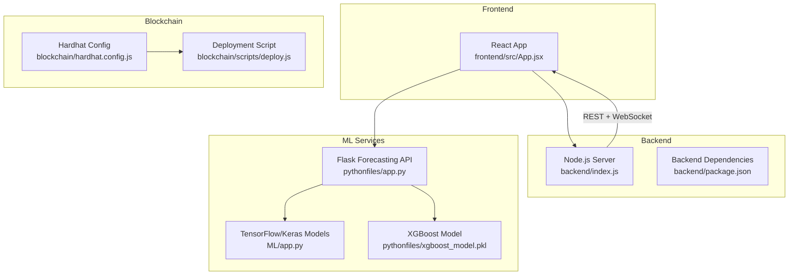
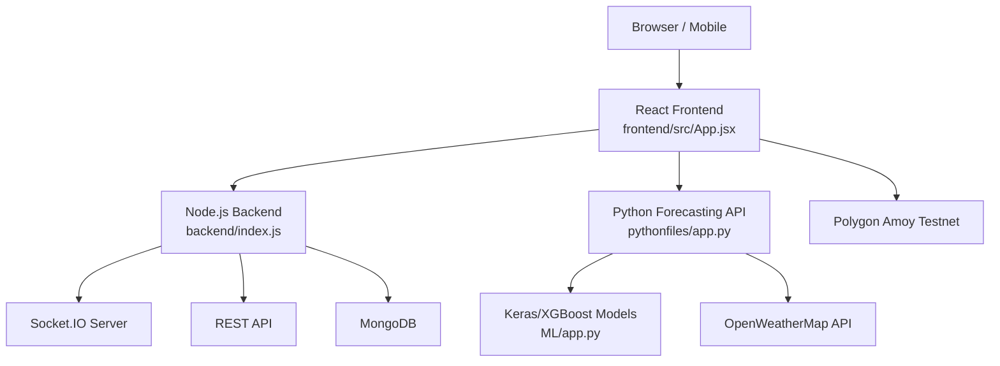
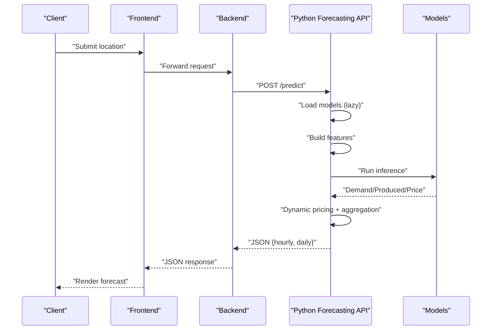
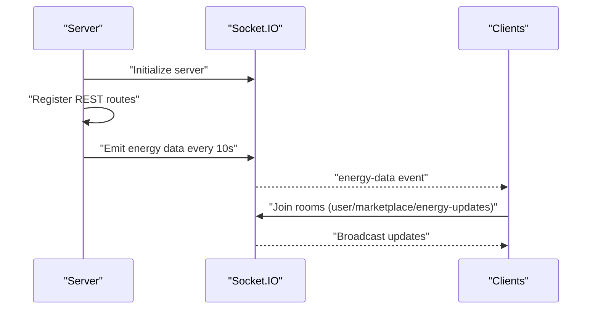
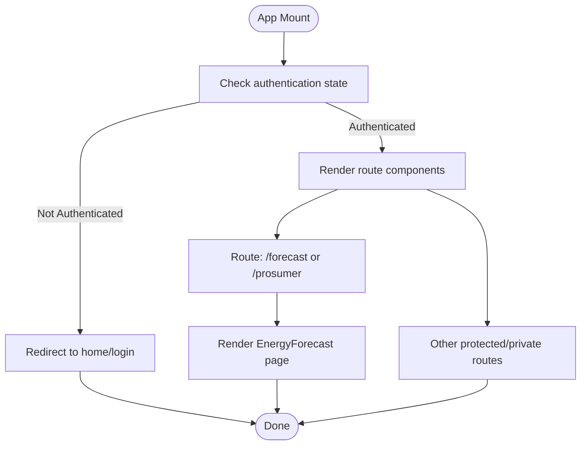
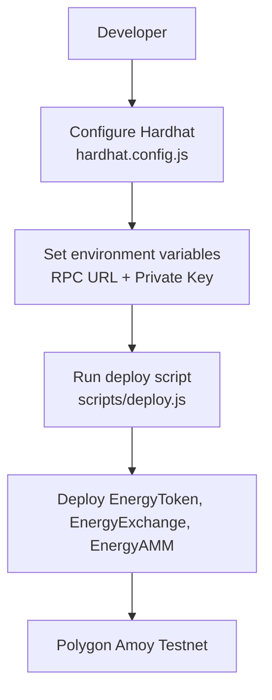
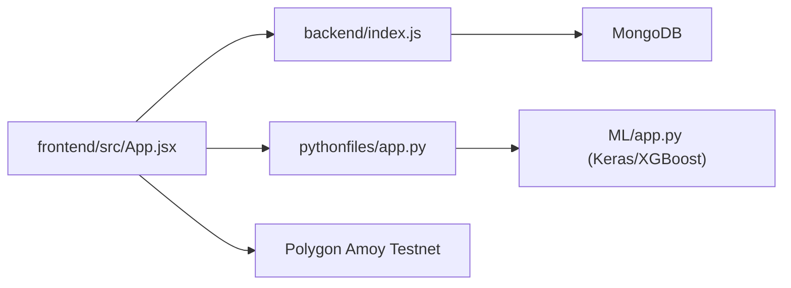

# Model Deployment and Operational Management

<cite>
**Referenced Files in This Document**
- [ML/app.py](file://ML/app.py)
- [ML/model_shapes.txt](file://ML/model_shapes.txt)
- [ML/requirements.txt](file://ML/requirements.txt)
- [pythonfiles/app.py](file://pythonfiles/app.py)
- [pythonfiles/requirements.txt](file://pythonfiles/requirements.txt)
- [backend/index.js](file://backend/index.js)
- [backend/package.json](file://backend/package.json)
- [frontend/src/App.jsx](file://frontend/src/App.jsx)
- [README.md](file://README.md)
- [blockchain/hardhat.config.js](file://blockchain/hardhat.config.js)
- [blockchain/scripts/deploy.js](file://blockchain/scripts/deploy.js)
</cite>

## Table of Contents
1. [Introduction](#introduction)
2. [Project Structure](#project-structure)
3. [Core Components](#core-components)
4. [Architecture Overview](#architecture-overview)
5. [Detailed Component Analysis](#detailed-component-analysis)
6. [Dependency Analysis](#dependency-analysis)
7. [Performance Considerations](#performance-considerations)
8. [Troubleshooting Guide](#troubleshooting-guide)
9. [Conclusion](#conclusion)
10. [Appendices](#appendices)

## Introduction
This document provides comprehensive guidance for deploying and operating the EcoGrid platform’s model-serving infrastructure. It explains the deployment architecture, containerization, cloud deployment options, load balancing, auto-scaling, resource allocation, monitoring and logging, model update and retraining procedures, rollback mechanisms, A/B testing, CI/CD automation, capacity planning, cost optimization, performance tuning, troubleshooting, and disaster recovery.

## Project Structure
The platform comprises:
- A React frontend that consumes APIs from a Node.js backend and a Python forecasting service.
- A Node.js backend exposing REST and WebSocket endpoints and integrating with MongoDB.
- A Python forecasting microservice using TensorFlow/Keras and XGBoost.
- A Solidity-based blockchain layer for energy tokenization and trading.

**Diagram sources**
- [frontend/src/App.jsx](file://frontend/src/App.jsx#L1-L79)
- [backend/index.js](file://backend/index.js#L1-L97)
- [backend/package.json](file://backend/package.json#L1-L29)
- [pythonfiles/app.py](file://pythonfiles/app.py#L1-L15)
- [ML/app.py](file://ML/app.py#L1-L251)
- [blockchain/hardhat.config.js](file://blockchain/hardhat.config.js#L1-L12)
- [blockchain/scripts/deploy.js](file://blockchain/scripts/deploy.js#L1-L29)

**Section sources**
- [README.md](file://README.md#L1-L267)
- [frontend/src/App.jsx](file://frontend/src/App.jsx#L1-L79)
- [backend/index.js](file://backend/index.js#L1-L97)
- [pythonfiles/app.py](file://pythonfiles/app.py#L1-L15)
- [ML/app.py](file://ML/app.py#L1-L251)
- [blockchain/hardhat.config.js](file://blockchain/hardhat.config.js#L1-L12)
- [blockchain/scripts/deploy.js](file://blockchain/scripts/deploy.js#L1-L29)

## Core Components
- Node.js backend: Express server with Socket.IO for real-time energy updates, REST routes for authentication and marketplace, and database connectivity.
- Python forecasting service: Flask API that loads Keras/XGBoost models, fetches weather data, builds features, runs inference, and aggregates predictions.
- Frontend: React SPA routing to unified energy forecasting pages and protected routes.
- Blockchain: Hardhat-configured Solidity contracts for tokenization and trading, deployable on Polygon Amoy testnet.

Key deployment-relevant observations:
- The forecasting service exposes a JSON endpoint for hourly/daily predictions.
- The backend exposes REST and WebSocket endpoints and emits periodic energy updates.
- The frontend consumes backend endpoints and integrates with blockchain via wallet libraries.

**Section sources**
- [backend/index.js](file://backend/index.js#L1-L97)
- [ML/app.py](file://ML/app.py#L195-L247)
- [frontend/src/App.jsx](file://frontend/src/App.jsx#L61-L63)
- [blockchain/hardhat.config.js](file://blockchain/hardhat.config.js#L1-L12)

## Architecture Overview
The runtime architecture connects the frontend to backend and forecasting services, with optional external model hosting and cloud-native deployment.

**Diagram sources**
- [frontend/src/App.jsx](file://frontend/src/App.jsx#L1-L79)
- [backend/index.js](file://backend/index.js#L1-L97)
- [pythonfiles/app.py](file://pythonfiles/app.py#L1-L15)
- [ML/app.py](file://ML/app.py#L1-L251)

## Detailed Component Analysis

### Forecasting API and Model Serving
The forecasting service orchestrates:
- Model loading with lazy initialization.
- Feature engineering from weather and temporal data.
- Inference using Keras and XGBoost models.
- Dynamic pricing computation and aggregation into hourly/daily outputs.

**Diagram sources**
- [ML/app.py](file://ML/app.py#L195-L247)
- [ML/app.py](file://ML/app.py#L131-L184)
- [ML/app.py](file://ML/app.py#L27-L41)

**Section sources**
- [ML/app.py](file://ML/app.py#L1-L251)
- [ML/model_shapes.txt](file://ML/model_shapes.txt#L1-L4)

### Node.js Backend and Real-Time Updates
The backend initializes Socket.IO, registers REST routes, and emits periodic energy updates to clients.

**Diagram sources**
- [backend/index.js](file://backend/index.js#L1-L97)

**Section sources**
- [backend/index.js](file://backend/index.js#L1-L97)

### Frontend Routing and Protected Views
The frontend defines protected routes for authenticated users and routes for unified energy forecasting.

**Diagram sources**
- [frontend/src/App.jsx](file://frontend/src/App.jsx#L38-L76)

**Section sources**
- [frontend/src/App.jsx](file://frontend/src/App.jsx#L1-L79)

### Blockchain Deployment and Integration
Contracts are configured for deployment on Polygon Amoy testnet via Hardhat and deployed using a script that deploys token and exchange contracts.

**Diagram sources**
- [blockchain/hardhat.config.js](file://blockchain/hardhat.config.js#L1-L12)
- [blockchain/scripts/deploy.js](file://blockchain/scripts/deploy.js#L1-L29)

**Section sources**
- [blockchain/hardhat.config.js](file://blockchain/hardhat.config.js#L1-L12)
- [blockchain/scripts/deploy.js](file://blockchain/scripts/deploy.js#L1-L29)

## Dependency Analysis
Runtime dependencies and ports:
- Backend: Express server listens on configurable port; Socket.IO enabled; REST routes registered.
- Python forecasting: Flask app with CORS; serves predictions; depends on TensorFlow/Keras and XGBoost.
- Frontend: React SPA; communicates with backend and blockchain endpoints.

**Diagram sources**
- [frontend/src/App.jsx](file://frontend/src/App.jsx#L1-L79)
- [backend/index.js](file://backend/index.js#L1-L97)
- [pythonfiles/app.py](file://pythonfiles/app.py#L1-L15)
- [ML/app.py](file://ML/app.py#L1-L251)

**Section sources**
- [backend/package.json](file://backend/package.json#L1-L29)
- [pythonfiles/requirements.txt](file://pythonfiles/requirements.txt#L1-L8)
- [ML/requirements.txt](file://ML/requirements.txt#L1-L4)

## Performance Considerations
- Model inference latency:
  - Lazy-loading models reduces startup overhead but may incur first-request latency.
  - Feature engineering and dynamic pricing add CPU work; batch requests can amortize overhead.
- I/O bottlenecks:
  - OpenWeatherMap API calls introduce network latency; consider caching responses and rate limiting.
- Real-time updates:
  - Socket.IO emits periodic updates; tune interval to balance freshness vs. bandwidth.
- Resource allocation:
  - Scale Python forecasting service independently from the backend for predictable ML performance.
- Containerization and orchestration:
  - Use separate containers for backend, forecasting service, and frontend; enable horizontal pod autoscaling for stateless services.

[No sources needed since this section provides general guidance]

## Troubleshooting Guide
Common deployment and runtime issues:
- Missing model files:
  - Symptom: Inference falls back to mock values; check model paths and file presence.
  - Action: Verify model files exist and permissions are correct.
- API key errors:
  - Symptom: 401 or city-not-found responses from weather API.
  - Action: Validate API key and location parameters.
- Port conflicts:
  - Symptom: Cannot start Flask or Node servers on configured ports.
  - Action: Change ports or stop conflicting processes.
- CORS errors:
  - Symptom: Browser blocks cross-origin requests.
  - Action: Configure allowed origins consistently across backend and frontend.
- Socket.IO disconnections:
  - Symptom: Clients lose real-time updates.
  - Action: Check network stability, proxy configurations, and heartbeat settings.
- Blockchain deployment failures:
  - Symptom: Deployment script errors.
  - Action: Confirm RPC URL and private key environment variables.

**Section sources**
- [ML/app.py](file://ML/app.py#L195-L247)
- [ML/app.py](file://ML/app.py#L27-L41)
- [backend/index.js](file://backend/index.js#L18-L24)
- [blockchain/scripts/deploy.js](file://blockchain/scripts/deploy.js#L1-L29)

## Conclusion
The EcoGrid platform combines a React frontend, a Node.js backend with real-time capabilities, and a Python forecasting service powered by Keras/XGBoost. For robust operations, adopt containerization, cloud-native deployment, load balancing, and autoscaling. Implement comprehensive monitoring, structured CI/CD, and A/B testing for model updates. Plan capacity and costs around model inference and real-time traffic, and maintain disaster recovery procedures for models, databases, and blockchain deployments.

[No sources needed since this section summarizes without analyzing specific files]

## Appendices

### Deployment Architecture Options
- Containerization with Docker:
  - Package backend, forecasting service, and frontend into separate images.
  - Use environment files for secrets and endpoints.
- Cloud deployment:
  - Host backend and forecasting service on managed compute with autoscaling.
  - Use CDN for static assets; configure SSL termination at ingress.
- Load balancing:
  - Place a reverse proxy/load balancer in front of backend and forecasting pods.
- Auto-scaling:
  - Scale backend and forecasting services based on CPU/memory and request rates.
- Resource allocation:
  - Assign GPU/CPU resources to forecasting pods; isolate stateful backend with persistent storage.

[No sources needed since this section provides general guidance]

### Monitoring and Logging
- Metrics:
  - Request latency, throughput, error rates for backend and forecasting endpoints.
  - Model inference duration and failure counts.
- Logs:
  - Centralized logs for backend, forecasting service, and gateway.
  - Structured JSON logs for correlation and alerting.
- Health checks:
  - Liveness/readiness probes for Kubernetes deployments.
- Observability:
  - Tracing for end-to-end request flows; dashboards for real-time energy updates.

[No sources needed since this section provides general guidance]

### Model Update, Retraining, Rollback, and A/B Testing
- Retraining:
  - Retrain models offline; validate on held-out datasets; package new artifacts.
- Rollout:
  - Canary releases for new model versions; monitor performance and errors.
- Rollback:
  - Re-deploy previous model image/tag; revert configuration changes.
- A/B testing:
  - Split traffic between model versions; compare accuracy and latency metrics.

[No sources needed since this section provides general guidance]

### CI/CD Pipeline
- Build:
  - Build Docker images for backend, forecasting service, and frontend.
- Test:
  - Run unit/integration tests for backend and forecasting service.
- Deploy:
  - Deploy to staging; promote to production after validation.
- Validate:
  - Smoke tests for endpoints and real-time channels; model accuracy checks.

[No sources needed since this section provides general guidance]

### Capacity Planning and Cost Optimization
- Estimating inference load:
  - Estimate concurrent users and requests per second; size forecasting service accordingly.
- Cost controls:
  - Right-size instances; use preemptible runners for batch jobs.
  - Monitor and optimize model sizes and inference frequency.

[No sources needed since this section provides general guidance]

### Backup and Disaster Recovery
- Model backups:
  - Store model artifacts in versioned storage; automate periodic snapshots.
- Database backups:
  - Schedule regular MongoDB backups; test restore procedures.
- Application availability:
  - Multi-zone deployments; health checks and automatic failover.
- Blockchain:
  - Back up private keys securely; redeploy contracts if needed.

[No sources needed since this section provides general guidance]