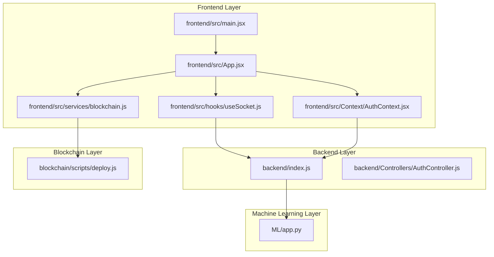
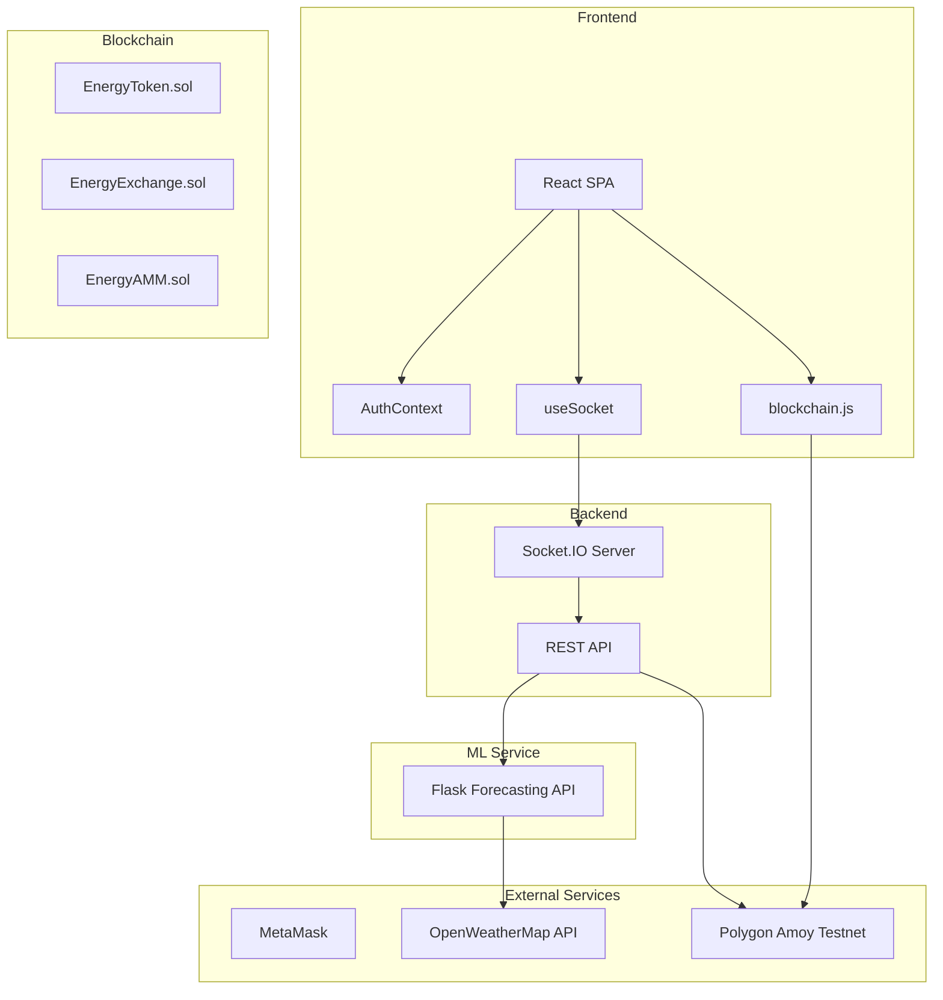
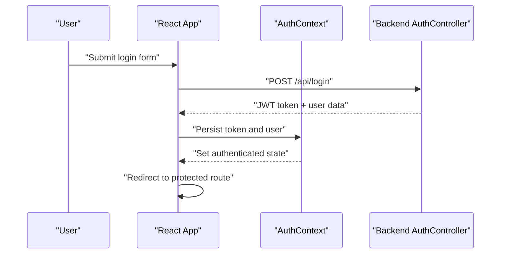
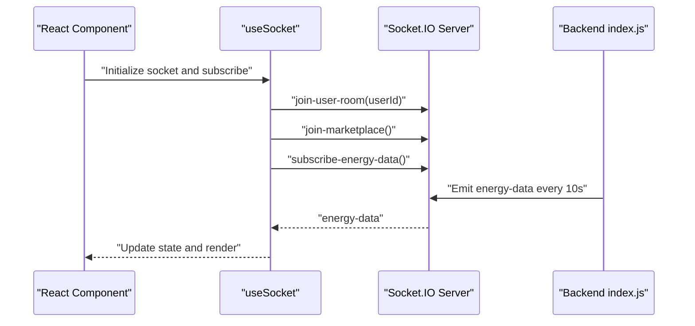
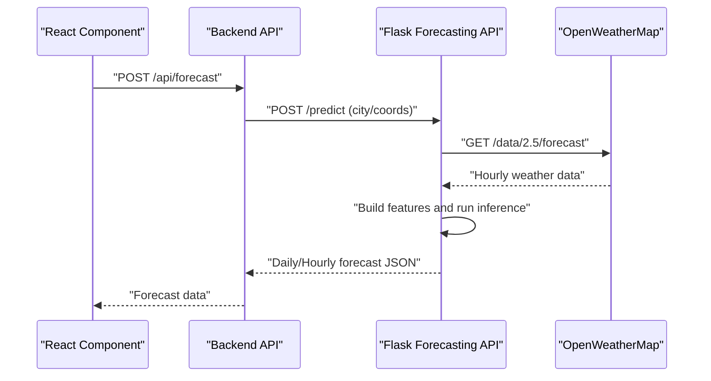
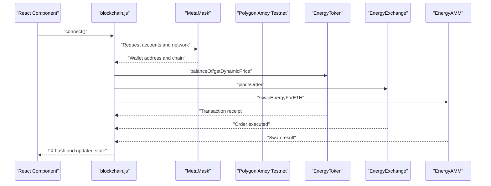
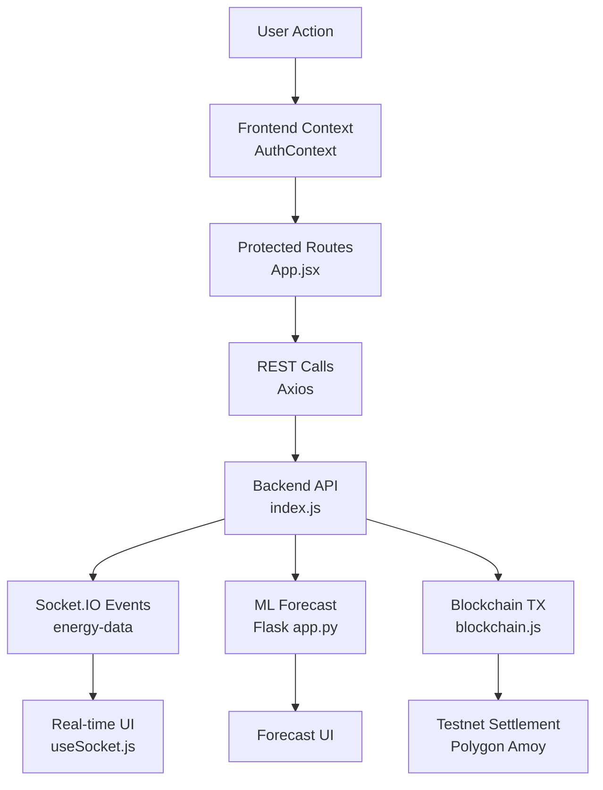
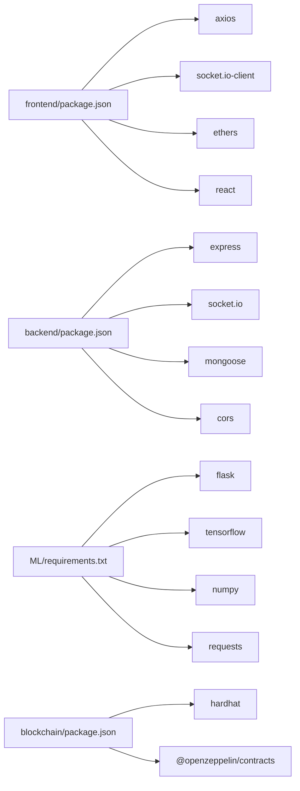

# Architecture Overview

<cite>
**Referenced Files in This Document**
- [README.md](file://README.md)
- [frontend/package.json](file://frontend/package.json)
- [backend/package.json](file://backend/package.json)
- [blockchain/package.json](file://blockchain/package.json)
- [ML/requirements.txt](file://ML/requirements.txt)
- [frontend/src/main.jsx](file://frontend/src/main.jsx)
- [frontend/src/App.jsx](file://frontend/src/App.jsx)
- [frontend/src/Context/AuthContext.jsx](file://frontend/src/Context/AuthContext.jsx)
- [frontend/src/hooks/useSocket.js](file://frontend/src/hooks/useSocket.js)
- [frontend/src/services/blockchain.js](file://frontend/src/services/blockchain.js)
- [frontend/src/api.js](file://frontend/src/api.js)
- [backend/index.js](file://backend/index.js)
- [backend/Controllers/AuthController.js](file://backend/Controllers/AuthController.js)
- [blockchain/scripts/deploy.js](file://blockchain/scripts/deploy.js)
</cite>

## Table of Contents
1. [Introduction](#introduction)
2. [Project Structure](#project-structure)
3. [Core Components](#core-components)
4. [Architecture Overview](#architecture-overview)
5. [Detailed Component Analysis](#detailed-component-analysis)
6. [Dependency Analysis](#dependency-analysis)
7. [Performance Considerations](#performance-considerations)
8. [Troubleshooting Guide](#troubleshooting-guide)
9. [Conclusion](#conclusion)

## Introduction
This document presents the high-level architecture and component interactions for the EcoGrid platform. EcoGrid is a multi-layered system integrating:
- A React-based frontend with context-based state management
- A Node.js backend exposing RESTful APIs and real-time capabilities via Socket.IO
- A machine learning Flask service for energy forecasting
- A blockchain layer with Solidity smart contracts deployed on the Polygon Amoy testnet

The system emphasizes clear separation of concerns across technologies while enabling user authentication, real-time energy data streaming, blockchain-based trading, and machine learning model integration.

## Project Structure
The repository is organized into four primary layers:
- frontend: React SPA with routing, context providers, hooks, and blockchain integration
- backend: Node.js/Express server with REST routes, Socket.IO, and database connectivity
- ML: Flask microservice for energy forecasting
- blockchain: Solidity contracts and deployment scripts

**Diagram sources**
- [frontend/src/main.jsx](file://frontend/src/main.jsx#L1-L15)
- [frontend/src/App.jsx](file://frontend/src/App.jsx#L1-L79)
- [frontend/src/Context/AuthContext.jsx](file://frontend/src/Context/AuthContext.jsx#L1-L70)
- [frontend/src/hooks/useSocket.js](file://frontend/src/hooks/useSocket.js#L1-L142)
- [frontend/src/services/blockchain.js](file://frontend/src/services/blockchain.js#L1-L261)
- [backend/index.js](file://backend/index.js#L1-L97)
- [backend/Controllers/AuthController.js](file://backend/Controllers/AuthController.js#L1-L482)
- [ML/app.py](file://ML/app.py#L1-L251)
- [blockchain/scripts/deploy.js](file://blockchain/scripts/deploy.js#L1-L29)

**Section sources**
- [README.md](file://README.md#L5-L65)
- [frontend/package.json](file://frontend/package.json#L1-L50)
- [backend/package.json](file://backend/package.json#L1-L29)
- [blockchain/package.json](file://blockchain/package.json#L1-L11)
- [ML/requirements.txt](file://ML/requirements.txt#L1-L4)

## Core Components
- Frontend React application
  - Entry point initializes context providers and renders routing
  - Authentication context manages session state and protected routes
  - Socket hook integrates real-time updates
  - Blockchain service connects to MetaMask and interacts with contracts
- Backend Node.js server
  - REST endpoints for authentication and user profiles
  - Socket.IO server for real-time energy data and marketplace updates
- Machine learning Flask service
  - Forecasting API consuming weather data and returning hourly/daily predictions
- Blockchain layer
  - Solidity contracts for tokenization and trading
  - Deployment script for Polygon Amoy testnet

**Section sources**
- [frontend/src/main.jsx](file://frontend/src/main.jsx#L1-L15)
- [frontend/src/App.jsx](file://frontend/src/App.jsx#L1-L79)
- [frontend/src/Context/AuthContext.jsx](file://frontend/src/Context/AuthContext.jsx#L1-L70)
- [frontend/src/hooks/useSocket.js](file://frontend/src/hooks/useSocket.js#L1-L142)
- [frontend/src/services/blockchain.js](file://frontend/src/services/blockchain.js#L1-L261)
- [backend/index.js](file://backend/index.js#L1-L97)
- [backend/Controllers/AuthController.js](file://backend/Controllers/AuthController.js#L1-L482)
- [ML/app.py](file://ML/app.py#L1-L251)
- [blockchain/scripts/deploy.js](file://blockchain/scripts/deploy.js#L1-L29)

## Architecture Overview
The system follows a layered architecture:
- Presentation layer: React SPA with routing and context
- API gateway: Node.js server handling REST and WebSocket connections
- Intelligence layer: Flask service for forecasting
- Consensus and settlement layer: Polygon Amoy testnet with deployed contracts

**Diagram sources**
- [frontend/src/App.jsx](file://frontend/src/App.jsx#L1-L79)
- [frontend/src/Context/AuthContext.jsx](file://frontend/src/Context/AuthContext.jsx#L1-L70)
- [frontend/src/hooks/useSocket.js](file://frontend/src/hooks/useSocket.js#L1-L142)
- [frontend/src/services/blockchain.js](file://frontend/src/services/blockchain.js#L1-L261)
- [backend/index.js](file://backend/index.js#L1-L97)
- [ML/app.py](file://ML/app.py#L1-L251)
- [blockchain/scripts/deploy.js](file://blockchain/scripts/deploy.js#L1-L29)

## Detailed Component Analysis

### Authentication Flow
The frontend authenticates users via JWT and persists tokens in local/session storage. Protected routes enforce authentication using context state.

**Diagram sources**
- [frontend/src/Context/AuthContext.jsx](file://frontend/src/Context/AuthContext.jsx#L1-L70)
- [backend/Controllers/AuthController.js](file://backend/Controllers/AuthController.js#L105-L155)

**Section sources**
- [frontend/src/Context/AuthContext.jsx](file://frontend/src/Context/AuthContext.jsx#L1-L70)
- [backend/Controllers/AuthController.js](file://backend/Controllers/AuthController.js#L105-L155)

### Real-Time Energy Data Streaming
The backend emits simulated energy data periodically to clients subscribed to the energy updates room. The frontend subscribes via Socket.IO and displays live metrics.

**Diagram sources**
- [frontend/src/hooks/useSocket.js](file://frontend/src/hooks/useSocket.js#L1-L142)
- [backend/index.js](file://backend/index.js#L48-L97)

**Section sources**
- [frontend/src/hooks/useSocket.js](file://frontend/src/hooks/useSocket.js#L1-L142)
- [backend/index.js](file://backend/index.js#L48-L97)

### Machine Learning Forecasting Integration
The frontend triggers forecasting requests to the Flask service, which queries OpenWeatherMap, builds features, runs inference using trained Keras models, and returns hourly/daily predictions.

**Diagram sources**
- [backend/index.js](file://backend/index.js#L1-L97)
- [ML/app.py](file://ML/app.py#L195-L247)

**Section sources**
- [backend/index.js](file://backend/index.js#L1-L97)
- [ML/app.py](file://ML/app.py#L1-L251)

### Blockchain Interaction for Decentralized Trading
The frontend connects to MetaMask, switches to Polygon Amoy, and interacts with deployed contracts for token balances, buying/selling energy, placing orders, and AMM swaps.

**Diagram sources**
- [frontend/src/services/blockchain.js](file://frontend/src/services/blockchain.js#L1-L261)
- [blockchain/scripts/deploy.js](file://blockchain/scripts/deploy.js#L1-L29)

**Section sources**
- [frontend/src/services/blockchain.js](file://frontend/src/services/blockchain.js#L1-L261)
- [blockchain/scripts/deploy.js](file://blockchain/scripts/deploy.js#L1-L29)

### Data Flow Across Layers
- Authentication: JWT-based session management with protected routes
- Real-time updates: Socket.IO rooms for user/marketplace/energy streams
- ML integration: Forecasting pipeline with weather API and Keras models
- Blockchain: Wallet-driven contract interactions with testnet deployment

**Diagram sources**
- [frontend/src/App.jsx](file://frontend/src/App.jsx#L1-L79)
- [frontend/src/Context/AuthContext.jsx](file://frontend/src/Context/AuthContext.jsx#L1-L70)
- [frontend/src/hooks/useSocket.js](file://frontend/src/hooks/useSocket.js#L1-L142)
- [backend/index.js](file://backend/index.js#L1-L97)
- [ML/app.py](file://ML/app.py#L1-L251)
- [frontend/src/services/blockchain.js](file://frontend/src/services/blockchain.js#L1-L261)

## Dependency Analysis
Technology stack dependencies across layers:
- Frontend depends on React, Socket.IO client, Axios, and Ethers for blockchain
- Backend depends on Express, Socket.IO, CORS, and Mongoose
- ML service depends on Flask, TensorFlow/Keras, NumPy, and requests
- Blockchain depends on Hardhat, OpenZeppelin, and dotenv

**Diagram sources**
- [frontend/package.json](file://frontend/package.json#L1-L50)
- [backend/package.json](file://backend/package.json#L1-L29)
- [ML/requirements.txt](file://ML/requirements.txt#L1-L4)
- [blockchain/package.json](file://blockchain/package.json#L1-L11)

**Section sources**
- [frontend/package.json](file://frontend/package.json#L1-L50)
- [backend/package.json](file://backend/package.json#L1-L29)
- [ML/requirements.txt](file://ML/requirements.txt#L1-L4)
- [blockchain/package.json](file://blockchain/package.json#L1-L11)

## Performance Considerations
- Socket.IO scaling: Use room-based broadcasting judiciously; consider partitioning rooms by region or user tier
- ML inference latency: Cache frequently requested city forecasts and pre-aggregate daily summaries
- Blockchain gas optimization: Batch operations where feasible and monitor testnet gas prices
- Frontend responsiveness: Debounce real-time updates and avoid unnecessary re-renders in components subscribing to energy data

## Troubleshooting Guide
Common issues and resolutions:
- Authentication errors: Verify JWT secret, token presence, and protected route guards
- Socket.IO disconnections: Confirm CORS configuration and transport settings; check room join events
- ML service failures: Validate OpenWeatherMap API key and model file paths; ensure Flask CORS is enabled
- Blockchain connection problems: Confirm MetaMask installation, correct chain ID, and deployed contract addresses

**Section sources**
- [frontend/src/Context/AuthContext.jsx](file://frontend/src/Context/AuthContext.jsx#L1-L70)
- [frontend/src/hooks/useSocket.js](file://frontend/src/hooks/useSocket.js#L1-L142)
- [ML/app.py](file://ML/app.py#L1-L251)
- [frontend/src/services/blockchain.js](file://frontend/src/services/blockchain.js#L1-L261)

## Conclusion
EcoGrid’s architecture cleanly separates presentation, API, intelligence, and consensus layers while enabling real-time updates, machine learning-driven insights, and decentralized trading. The design supports scalability, modularity, and testnet-based experimentation, with clear integration points for each component.