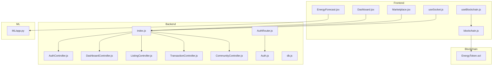
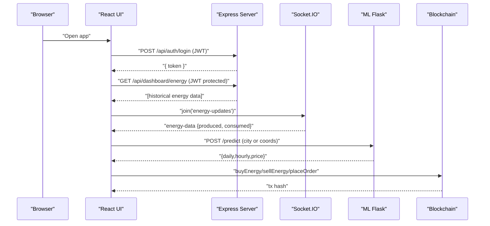
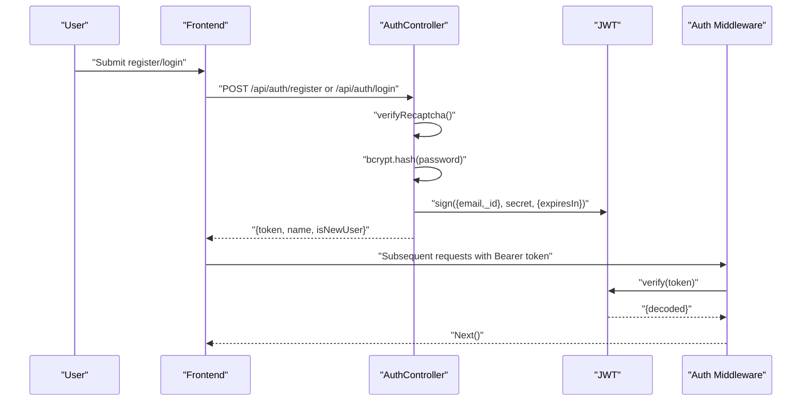
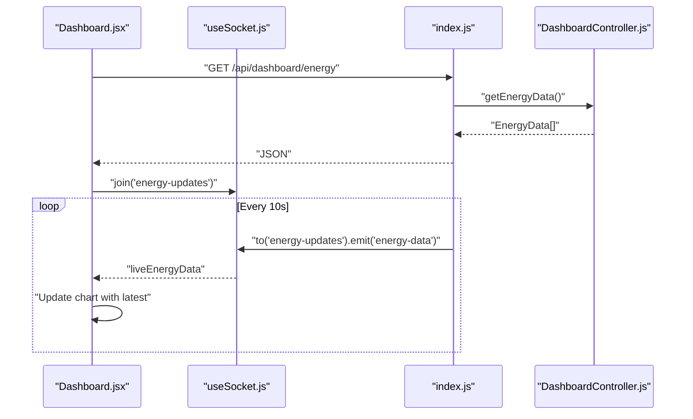
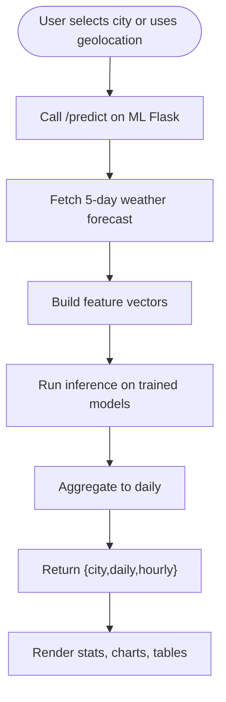
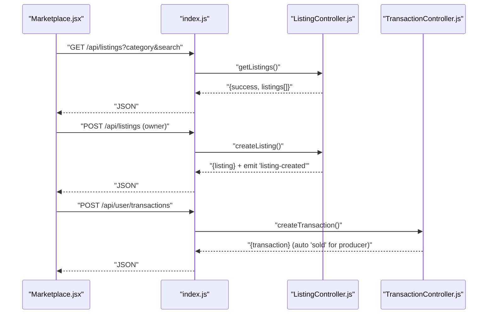
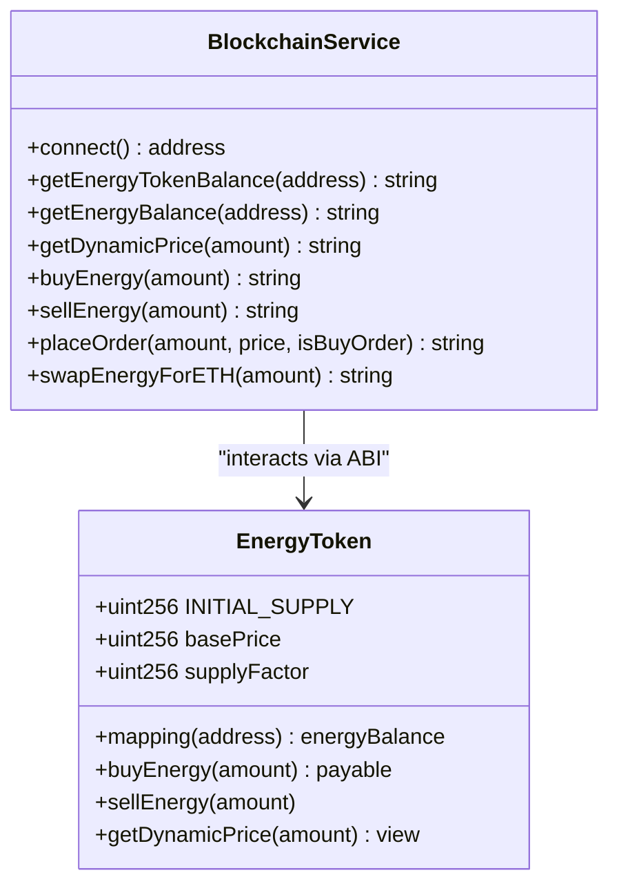
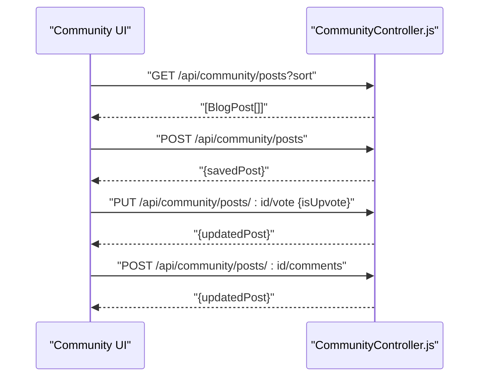
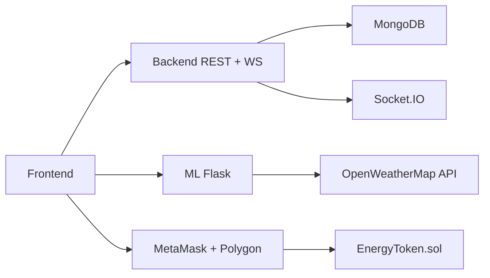

# Core Features

<cite>
**Referenced Files in This Document**
- [backend/index.js](file://backend/index.js)
- [backend/Middlewares/Auth.js](file://backend/Middlewares/Auth.js)
- [backend/Routes/AuthRouter.js](file://backend/Routes/AuthRouter.js)
- [backend/Controllers/AuthController.js](file://backend/Controllers/AuthController.js)
- [backend/Controllers/DashboardController.js](file://backend/Controllers/DashboardController.js)
- [backend/Controllers/ListingController.js](file://backend/Controllers/ListingController.js)
- [backend/Controllers/TransactionController.js](file://backend/Controllers/TransactionController.js)
- [backend/Controllers/CommunityController.js](file://backend/Controllers/CommunityController.js)
- [backend/DB/db.js](file://backend/DB/db.js)
- [backend/Models/EnergyData.js](file://backend/Models/EnergyData.js)
- [backend/Models/Transaction.js](file://backend/Models/Transaction.js)
- [backend/Models/EnergyListing.js](file://backend/Models/EnergyListing.js)
- [backend/Models/BlogPost.js](file://backend/Models/BlogPost.js)
- [backend/Models/Users.js](file://backend/Models/Users.js)
- [backend/Models/UserProfile.js](file://backend/Models/UserProfile.js)
- [backend/Models/googleuser.js](file://backend/Models/googleuser.js)
- [backend/Models/ResetCode.js](file://backend/Models/ResetCode.js)
- [ML/app.py](file://ML/app.py)
- [frontend/src/frontend/Dashboard.jsx](file://frontend/src/frontend/Dashboard.jsx)
- [frontend/src/frontend/EnergyForecast.jsx](file://frontend/src/frontend/EnergyForecast.jsx)
- [frontend/src/frontend/Marketplace.jsx](file://frontend/src/frontend/Marketplace.jsx)
- [frontend/src/hooks/useSocket.js](file://frontend/src/hooks/useSocket.js)
- [frontend/src/hooks/useBlockchain.js](file://frontend/src/hooks/useBlockchain.js)
- [frontend/src/services/blockchain.js](file://frontend/src/services/blockchain.js)
- [blockchain/contracts/EnergyToken.sol](file://blockchain/contracts/EnergyToken.sol)
</cite>

## Table of Contents
1. [Introduction](#introduction)
2. [Project Structure](#project-structure)
3. [Core Components](#core-components)
4. [Architecture Overview](#architecture-overview)
5. [Detailed Component Analysis](#detailed-component-analysis)
6. [Dependency Analysis](#dependency-analysis)
7. [Performance Considerations](#performance-considerations)
8. [Troubleshooting Guide](#troubleshooting-guide)
9. [Conclusion](#conclusion)
10. [Appendices](#appendices)

## Introduction
This document describes the core features of the EcoGrid platform as implemented in the repository. It focuses on:
- Authentication system with JWT-based registration and login, password security, and session management
- Real-time energy dashboard with live monitoring, historical visualization, and analytics
- AI-powered energy forecasting using machine learning for demand prediction and peak alerts
- Peer-to-peer energy marketplace enabling listing management, trading, and transaction logging
- Blockchain integration with an ERC20 token, smart contracts, and Polygon Amoy testnet
- Community features including blog management and user interactions
- User workflows and feature benefits for each core component

## Project Structure
The platform is organized into three main layers:
- Backend (Node.js + Express): Controllers, Models, Routers, Middleware, and Socket.IO real-time engine
- Machine Learning (Python + Flask): Forecasting service for energy demand and pricing
- Frontend (React + Vite): Dashboards, marketplace, blockchain hooks, and community pages
- Blockchain (Solidity): ERC20 token and exchange/AMM contracts

**Diagram sources**
- [backend/index.js](file://backend/index.js#L1-L97)
- [backend/Controllers/AuthController.js](file://backend/Controllers/AuthController.js#L1-L482)
- [backend/Controllers/DashboardController.js](file://backend/Controllers/DashboardController.js#L1-L25)
- [backend/Controllers/ListingController.js](file://backend/Controllers/ListingController.js#L1-L253)
- [backend/Controllers/TransactionController.js](file://backend/Controllers/TransactionController.js#L1-L68)
- [backend/Controllers/CommunityController.js](file://backend/Controllers/CommunityController.js#L1-L107)
- [backend/Middlewares/Auth.js](file://backend/Middlewares/Auth.js#L1-L19)
- [backend/Routes/AuthRouter.js](file://backend/Routes/AuthRouter.js#L1-L15)
- [ML/app.py](file://ML/app.py#L1-L251)
- [frontend/src/frontend/Dashboard.jsx](file://frontend/src/frontend/Dashboard.jsx#L1-L556)
- [frontend/src/frontend/EnergyForecast.jsx](file://frontend/src/frontend/EnergyForecast.jsx#L1-L715)
- [frontend/src/frontend/Marketplace.jsx](file://frontend/src/frontend/Marketplace.jsx#L1-L1188)
- [frontend/src/hooks/useSocket.js](file://frontend/src/hooks/useSocket.js#L1-L142)
- [frontend/src/hooks/useBlockchain.js](file://frontend/src/hooks/useBlockchain.js#L1-L155)
- [frontend/src/services/blockchain.js](file://frontend/src/services/blockchain.js#L1-L261)
- [blockchain/contracts/EnergyToken.sol](file://blockchain/contracts/EnergyToken.sol#L1-L55)

**Section sources**
- [backend/index.js](file://backend/index.js#L1-L97)
- [frontend/src/frontend/Dashboard.jsx](file://frontend/src/frontend/Dashboard.jsx#L1-L556)
- [frontend/src/frontend/EnergyForecast.jsx](file://frontend/src/frontend/EnergyForecast.jsx#L1-L715)
- [frontend/src/frontend/Marketplace.jsx](file://frontend/src/frontend/Marketplace.jsx#L1-L1188)
- [ML/app.py](file://ML/app.py#L1-L251)
- [blockchain/contracts/EnergyToken.sol](file://blockchain/contracts/EnergyToken.sol#L1-L55)

## Core Components
- Authentication and session management with JWT, reCAPTCHA, and Google OAuth
- Real-time dashboard with live energy metrics and historical charts
- AI-powered forecasting with demand prediction and peak alerts
- Marketplace for buying/selling energy with listing lifecycle and analytics
- Blockchain integration with ERC20 token, dynamic pricing, and AMM/Exchange
- Community blog with posts, voting, and comments

**Section sources**
- [backend/Controllers/AuthController.js](file://backend/Controllers/AuthController.js#L1-L482)
- [backend/Middlewares/Auth.js](file://backend/Middlewares/Auth.js#L1-L19)
- [backend/Controllers/DashboardController.js](file://backend/Controllers/DashboardController.js#L1-L25)
- [ML/app.py](file://ML/app.py#L1-L251)
- [backend/Controllers/ListingController.js](file://backend/Controllers/ListingController.js#L1-L253)
- [backend/Controllers/TransactionController.js](file://backend/Controllers/TransactionController.js#L1-L68)
- [frontend/src/services/blockchain.js](file://frontend/src/services/blockchain.js#L1-L261)
- [blockchain/contracts/EnergyToken.sol](file://blockchain/contracts/EnergyToken.sol#L1-L55)
- [backend/Controllers/CommunityController.js](file://backend/Controllers/CommunityController.js#L1-L107)

## Architecture Overview
The backend exposes REST APIs and real-time WebSocket channels. The frontend consumes APIs and sockets for live updates. The ML service provides forecasting. Blockchain interactions are handled via hooks and a service layer.

**Diagram sources**
- [backend/index.js](file://backend/index.js#L1-L97)
- [backend/Controllers/AuthController.js](file://backend/Controllers/AuthController.js#L105-L155)
- [backend/Controllers/DashboardController.js](file://backend/Controllers/DashboardController.js#L4-L15)
- [frontend/src/hooks/useSocket.js](file://frontend/src/hooks/useSocket.js#L1-L142)
- [ML/app.py](file://ML/app.py#L195-L247)
- [frontend/src/services/blockchain.js](file://frontend/src/services/blockchain.js#L164-L224)

## Detailed Component Analysis

### Authentication System
- Registration: Validates reCAPTCHA, hashes passwords, and persists user profiles
- Login: Verifies credentials, checks reCAPTCHA, issues JWT with 24h expiry
- Session management: Middleware validates Authorization header and attaches user
- Password reset: Generates and emails a 6-digit code, verifies, and updates password
- Google OAuth: Securely verifies Google ID tokens and creates synced accounts
- Onboarding: Saves user profile and marks completion

**Diagram sources**
- [backend/Controllers/AuthController.js](file://backend/Controllers/AuthController.js#L11-L47)
- [backend/Controllers/AuthController.js](file://backend/Controllers/AuthController.js#L49-L101)
- [backend/Controllers/AuthController.js](file://backend/Controllers/AuthController.js#L105-L155)
- [backend/Middlewares/Auth.js](file://backend/Middlewares/Auth.js#L3-L18)
- [backend/Routes/AuthRouter.js](file://backend/Routes/AuthRouter.js#L1-L15)

**Section sources**
- [backend/Controllers/AuthController.js](file://backend/Controllers/AuthController.js#L1-L482)
- [backend/Middlewares/Auth.js](file://backend/Middlewares/Auth.js#L1-L19)
- [backend/Routes/AuthRouter.js](file://backend/Routes/AuthRouter.js#L1-L15)

### Real-Time Energy Dashboard
- Live monitoring: Socket.IO emits periodic energy data to clients subscribed to the energy-updates room
- Historical data: Backend serves last N entries for rendering charts
- UI integration: Dashboard fetches historical data and subscribes to live updates

**Diagram sources**
- [backend/index.js](file://backend/index.js#L75-L97)
- [backend/Controllers/DashboardController.js](file://backend/Controllers/DashboardController.js#L4-L15)
- [frontend/src/frontend/Dashboard.jsx](file://frontend/src/frontend/Dashboard.jsx#L80-L125)
- [frontend/src/hooks/useSocket.js](file://frontend/src/hooks/useSocket.js#L12-L88)

**Section sources**
- [backend/index.js](file://backend/index.js#L1-L97)
- [backend/Controllers/DashboardController.js](file://backend/Controllers/DashboardController.js#L1-L25)
- [frontend/src/frontend/Dashboard.jsx](file://frontend/src/frontend/Dashboard.jsx#L1-L556)
- [frontend/src/hooks/useSocket.js](file://frontend/src/hooks/useSocket.js#L1-L142)

### AI-Powered Energy Forecasting
- Live predictions: Calls ML Flask service to compute hourly/daily production, demand, surplus, and price using weather data
- Demand forecasting: UI supports configurable forecast period and toggles hourly view
- Peak alerts: ML service identifies peak demand windows and returns messages

**Diagram sources**
- [ML/app.py](file://ML/app.py#L74-L92)
- [ML/app.py](file://ML/app.py#L224-L238)
- [ML/app.py](file://ML/app.py#L131-L184)
- [ML/app.py](file://ML/app.py#L195-L247)
- [frontend/src/frontend/EnergyForecast.jsx](file://frontend/src/frontend/EnergyForecast.jsx#L102-L128)
- [frontend/src/frontend/EnergyForecast.jsx](file://frontend/src/frontend/EnergyForecast.jsx#L152-L173)

**Section sources**
- [ML/app.py](file://ML/app.py#L1-L251)
- [frontend/src/frontend/EnergyForecast.jsx](file://frontend/src/frontend/EnergyForecast.jsx#L1-L715)

### Peer-to-Peer Energy Marketplace
- Listings: CRUD operations with ownership checks; emits real-time events for marketplace room
- Analytics: Prosumer statistics including total listings, earnings, sales volume, and availability
- Transactions: Logs buyer and seller sides; displays history with status and Polygon tx hashes
- UI: Tabs for marketplace and prosumer dashboard; search/filter by category and title

**Diagram sources**
- [backend/index.js](file://backend/index.js#L48-L73)
- [backend/Controllers/ListingController.js](file://backend/Controllers/ListingController.js#L5-L35)
- [backend/Controllers/ListingController.js](file://backend/Controllers/ListingController.js#L58-L99)
- [backend/Controllers/TransactionController.js](file://backend/Controllers/TransactionController.js#L18-L67)
- [frontend/src/frontend/Marketplace.jsx](file://frontend/src/frontend/Marketplace.jsx#L90-L115)
- [frontend/src/frontend/Marketplace.jsx](file://frontend/src/frontend/Marketplace.jsx#L126-L237)

**Section sources**
- [backend/Controllers/ListingController.js](file://backend/Controllers/ListingController.js#L1-L253)
- [backend/Controllers/TransactionController.js](file://backend/Controllers/TransactionController.js#L1-L68)
- [backend/index.js](file://backend/index.js#L1-L97)
- [frontend/src/frontend/Marketplace.jsx](file://frontend/src/frontend/Marketplace.jsx#L1-L1188)

### Blockchain Integration
- Contracts: ERC20-like EnergyToken with dynamic pricing; Exchange and AMM for orders and swaps
- Frontend hooks: Connect wallet, detect network, read balances, and submit transactions
- Service layer: Initializes contracts, switches to Polygon Amoy, and executes transactions

**Diagram sources**
- [blockchain/contracts/EnergyToken.sol](file://blockchain/contracts/EnergyToken.sol#L1-L55)
- [frontend/src/services/blockchain.js](file://frontend/src/services/blockchain.js#L42-L261)
- [frontend/src/hooks/useBlockchain.js](file://frontend/src/hooks/useBlockchain.js#L1-L155)

**Section sources**
- [blockchain/contracts/EnergyToken.sol](file://blockchain/contracts/EnergyToken.sol#L1-L55)
- [frontend/src/services/blockchain.js](file://frontend/src/services/blockchain.js#L1-L261)
- [frontend/src/hooks/useBlockchain.js](file://frontend/src/hooks/useBlockchain.js#L1-L155)

### Community Features
- Blog posts: Fetch sorted by newest/oldest/popular, create posts, vote posts, add and vote comments
- UI: Lists posts, renders votes, and manages comments per post

**Diagram sources**
- [backend/Controllers/CommunityController.js](file://backend/Controllers/CommunityController.js#L3-L27)
- [backend/Controllers/CommunityController.js](file://backend/Controllers/CommunityController.js#L29-L43)
- [backend/Controllers/CommunityController.js](file://backend/Controllers/CommunityController.js#L45-L59)
- [backend/Controllers/CommunityController.js](file://backend/Controllers/CommunityController.js#L61-L82)
- [backend/Controllers/CommunityController.js](file://backend/Controllers/CommunityController.js#L84-L107)

**Section sources**
- [backend/Controllers/CommunityController.js](file://backend/Controllers/CommunityController.js#L1-L107)

## Dependency Analysis
- Backend depends on MongoDB (via Mongoose) for persistence and Socket.IO for real-time
- Frontend depends on React hooks for blockchain and sockets, and on environment variables for service URLs and contract addresses
- ML service is decoupled and called via HTTP from the frontend
- Blockchain service depends on MetaMask provider and Polygon Amoy configuration

**Diagram sources**
- [backend/index.js](file://backend/index.js#L1-L97)
- [ML/app.py](file://ML/app.py#L1-L251)
- [frontend/src/services/blockchain.js](file://frontend/src/services/blockchain.js#L1-L261)
- [blockchain/contracts/EnergyToken.sol](file://blockchain/contracts/EnergyToken.sol#L1-L55)

**Section sources**
- [backend/index.js](file://backend/index.js#L1-L97)
- [ML/app.py](file://ML/app.py#L1-L251)
- [frontend/src/services/blockchain.js](file://frontend/src/services/blockchain.js#L1-L261)

## Performance Considerations
- Real-time updates: Socket.IO emits every 10 seconds; frontend maintains small buffers for charts
- API pagination: Dashboard endpoints limit returned documents to reduce payload sizes
- ML inference: Feature engineering and model loading are optimized; fallbacks ensure UI remains responsive
- Blockchain calls: Batch UI actions and avoid frequent network switches; cache prices where appropriate

[No sources needed since this section provides general guidance]

## Troubleshooting Guide
- Authentication failures: Verify JWT middleware extracts Bearer token correctly and secret is configured
- Socket disconnections: Confirm origin and credentials in CORS; ensure rooms are joined before emitting
- ML service errors: Check Flask route parameters and OpenWeatherMap API key; handle HTTP errors gracefully
- Blockchain connectivity: Ensure MetaMask is installed, correct chain is selected, and contract addresses are configured
- Marketplace errors: Validate ownership checks and real-time event emissions; confirm Socket.IO rooms

**Section sources**
- [backend/Middlewares/Auth.js](file://backend/Middlewares/Auth.js#L1-L19)
- [backend/index.js](file://backend/index.js#L17-L73)
- [ML/app.py](file://ML/app.py#L205-L216)
- [frontend/src/services/blockchain.js](file://frontend/src/services/blockchain.js#L52-L101)
- [backend/Controllers/ListingController.js](file://backend/Controllers/ListingController.js#L101-L157)

## Conclusion
EcoGrid integrates modern web technologies with real-time data, AI-driven insights, and blockchain-based energy trading. The modular backend, reactive frontend, and ML pipeline deliver a cohesive user experience centered on sustainability and transparency.

[No sources needed since this section summarizes without analyzing specific files]

## Appendices

### User Workflows and Benefits
- Authentication
  - Register and log in with email/password or Google; secure JWT sessions enable seamless access
  - Password reset via email code ensures account recovery
  - Benefit: Strong identity and secure session continuity
- Real-Time Dashboard
  - View live energy production/consumption and historical charts
  - Benefit: Immediate situational awareness and trend analysis
- AI Forecasting
  - Predict production/demand and pricing; review peak alerts
  - Benefit: Informed decisions for buying/selling and energy planning
- Marketplace
  - Browse listings, manage personal inventory, and track transactions
  - Benefit: Direct peer-to-peer trading with transparent history
- Blockchain
  - Buy/sell energy tokens, place orders, and swap for ETH on Polygon Amoy
  - Benefit: Decentralized, auditable, and interoperable energy economy
- Community
  - Share and discover posts, vote, and engage with peers
  - Benefit: Knowledge sharing and community building around sustainability

[No sources needed since this section provides general guidance]