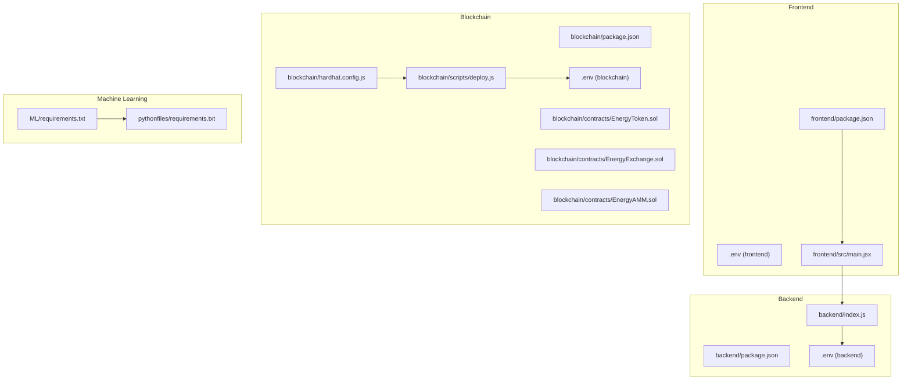
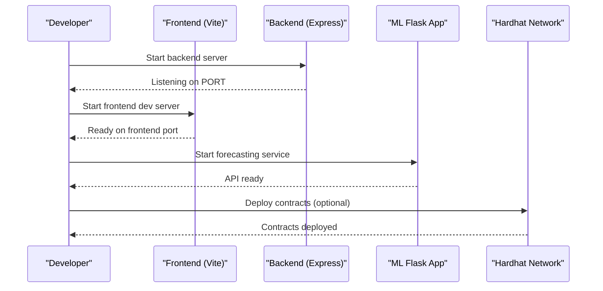
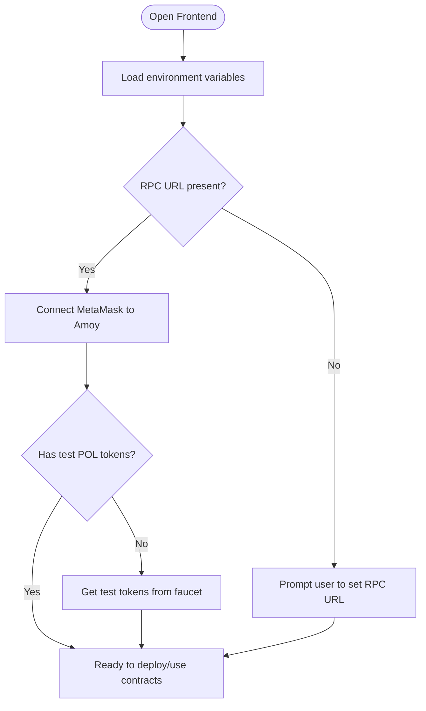

# Getting Started

<cite>
**Referenced Files in This Document**
- [README.md](file://README.md)
- [package.json](file://package.json)
- [backend/package.json](file://backend/package.json)
- [frontend/package.json](file://frontend/package.json)
- [blockchain/package.json](file://blockchain/package.json)
- [ML/requirements.txt](file://ML/requirements.txt)
- [pythonfiles/requirements.txt](file://pythonfiles/requirements.txt)
- [backend/.env](file://backend/.env)
- [frontend/.env](file://frontend/.env)
- [blockchain/.env](file://blockchain/.env)
- [backend/index.js](file://backend/index.js)
- [frontend/src/main.jsx](file://frontend/src/main.jsx)
- [blockchain/hardhat.config.js](file://blockchain/hardhat.config.js)
- [blockchain/scripts/deploy.js](file://blockchain/scripts/deploy.js)
- [blockchain/README.md](file://blockchain/README.md)
- [blockchain/contracts/EnergyToken.sol](file://blockchain/contracts/EnergyToken.sol)
- [blockchain/contracts/EnergyExchange.sol](file://blockchain/contracts/EnergyExchange.sol)
- [blockchain/contracts/EnergyAMM.sol](file://blockchain/contracts/EnergyAMM.sol)
</cite>

## Table of Contents
1. [Introduction](#introduction)
2. [Project Structure](#project-structure)
3. [System Prerequisites](#system-prerequisites)
4. [Installation Instructions](#installation-instructions)
5. [Environment Variable Configuration](#environment-variable-configuration)
6. [Development Server Startup Sequence](#development-server-startup-sequence)
7. [Polygon Testnet and Wallet Setup](#polygon-testnet-and-wallet-setup)
8. [Accessing Application Modules](#accessing-application-modules)
9. [Verification Steps](#verification-steps)
10. [Troubleshooting Guide](#troubleshooting-guide)
11. [Conclusion](#conclusion)

## Introduction
This guide helps you set up and run the complete EcoGrid platform locally. EcoGrid is a sustainable energy management platform featuring:
- A React-based frontend
- A Node.js/Express backend with MongoDB
- Solidity smart contracts deployed on Polygon Amoy testnet
- An integrated machine learning forecasting module

By following this guide, you will install dependencies, configure environment variables, start all services, connect to the Polygon testnet, and verify your local setup.

## Project Structure
The repository is organized into four primary areas:
- frontend: React application with Vite
- backend: Node.js/Express server with MongoDB
- blockchain: Solidity contracts and Hardhat deployment
- ML/pythonfiles: Machine learning forecasting module

**Diagram sources**
- [frontend/package.json](file://frontend/package.json#L1-L50)
- [frontend/.env](file://frontend/.env#L1-L7)
- [frontend/src/main.jsx](file://frontend/src/main.jsx#L1-L15)
- [backend/package.json](file://backend/package.json#L1-L29)
- [backend/.env](file://backend/.env#L1-L13)
- [backend/index.js](file://backend/index.js#L1-L97)
- [blockchain/package.json](file://blockchain/package.json#L1-L11)
- [blockchain/.env](file://blockchain/.env#L1-L2)
- [blockchain/hardhat.config.js](file://blockchain/hardhat.config.js#L1-L12)
- [blockchain/scripts/deploy.js](file://blockchain/scripts/deploy.js#L1-L29)
- [blockchain/contracts/EnergyToken.sol](file://blockchain/contracts/EnergyToken.sol#L1-L55)
- [blockchain/contracts/EnergyExchange.sol](file://blockchain/contracts/EnergyExchange.sol#L1-L45)
- [blockchain/contracts/EnergyAMM.sol](file://blockchain/contracts/EnergyAMM.sol#L1-L24)
- [ML/requirements.txt](file://ML/requirements.txt#L1-L4)
- [pythonfiles/requirements.txt](file://pythonfiles/requirements.txt#L1-L8)

**Section sources**
- [README.md](file://README.md#L5-L65)
- [package.json](file://package.json#L1-L6)

## System Prerequisites
Install the following tools and services before proceeding:
- Node.js (LTS recommended) for frontend and backend
- Python 3.8+ for the machine learning module
- MongoDB (local or cloud instance)
- MetaMask wallet extension for browser
- Polygon Amoy testnet funds for gas fees

Notes:
- The frontend expects a development server on port 5173.
- The backend listens on port 8080 by default.
- The machine learning module runs a Flask server on a separate port (see ML section).

**Section sources**
- [README.md](file://README.md#L159-L182)
- [backend/index.js](file://backend/index.js#L26-L34)
- [frontend/.env](file://frontend/.env#L5-L6)
- [blockchain/README.md](file://blockchain/README.md#L1-L1)

## Installation Instructions

### 1) Install frontend dependencies
- Navigate to the frontend directory and install packages.
- Use the development script to launch the React/Vite server.

**Section sources**
- [frontend/package.json](file://frontend/package.json#L6-L11)
- [README.md](file://README.md#L161-L171)

### 2) Install backend dependencies
- Navigate to the backend directory and install Node.js packages.
- Start the backend server using the provided script.

**Section sources**
- [backend/package.json](file://backend/package.json#L7-L9)
- [README.md](file://README.md#L161-L171)

### 3) Install machine learning dependencies
- Install Python dependencies for both the ML module and the forecasting microservice.

**Section sources**
- [ML/requirements.txt](file://ML/requirements.txt#L1-L4)
- [pythonfiles/requirements.txt](file://pythonfiles/requirements.txt#L1-L8)
- [README.md](file://README.md#L161-L166)

### 4) Install blockchain dependencies
- Navigate to the blockchain directory and install Hardhat and related packages.

**Section sources**
- [blockchain/package.json](file://blockchain/package.json#L1-L11)
- [README.md](file://README.md#L161-L166)

## Environment Variable Configuration

### Backend (.env)
Configure the following variables for the backend:
- PORT: Server port (default 8080)
- MONGO_URI: MongoDB connection string
- JWT_SECRET: Secret key for JWT signing
- EMAIL_SERVICE, EMAIL_USER, EMAIL_PASSWORD: Email provider credentials
- RECAPTCHA_SECRET_KEY: Secret key for reCAPTCHA
- GOOGLE_CLIENT_ID, GOOGLE_CLIENT_SECRET: Google OAuth client credentials

These variables control database connectivity, authentication, email notifications, and third-party integrations.

**Section sources**
- [backend/.env](file://backend/.env#L1-L13)

### Frontend (.env)
Configure the following variables for the frontend:
- VITE_ENERGY_TOKEN_ADDRESS: Address of the EnergyToken contract
- VITE_ENERGY_EXCHANGE_ADDRESS: Address of the EnergyExchange contract
- VITE_ENERGY_AMM_ADDRESS: Address of the EnergyAMM contract
- VITE_GOOGLE_CLIENT_ID: Google OAuth client ID
- REACT_APP_API_URL: Base URL for backend API endpoints
- REACT_APP_RECAPTCHA_SITE_KEY: Site key for reCAPTCHA
- VITE_SOCKET_URL: WebSocket server URL for real-time updates

These variables define blockchain contract addresses, API endpoints, and integration keys.

**Section sources**
- [frontend/.env](file://frontend/.env#L1-L7)

### Blockchain (.env)
Configure the following variables for blockchain deployment:
- PRIVATE_KEY: Private key for the deployer account
- POLYGON_AMOY_URL: RPC endpoint for Polygon Amoy testnet

These variables enable deployment via Hardhat to the Polygon testnet.

**Section sources**
- [blockchain/.env](file://blockchain/.env#L1-L2)

## Development Server Startup Sequence

Start services in the following order to ensure proper connectivity:

1) Start the backend server
- The backend initializes Express, enables CORS for the frontend origin, connects to MongoDB, registers routes, and starts Socket.IO.

2) Start the frontend development server
- The React/Vite server serves the UI on the configured port and proxies API requests to the backend.

3) Launch the machine learning forecasting service
- Run the forecasting Flask app to expose energy demand predictions.

4) Deploy smart contracts (optional for local testing)
- Use Hardhat to deploy contracts to Polygon Amoy testnet if you have test POL tokens.

**Diagram sources**
- [backend/index.js](file://backend/index.js#L14-L46)
- [frontend/src/main.jsx](file://frontend/src/main.jsx#L1-L15)
- [blockchain/hardhat.config.js](file://blockchain/hardhat.config.js#L4-L12)
- [blockchain/scripts/deploy.js](file://blockchain/scripts/deploy.js#L3-L24)

**Section sources**
- [README.md](file://README.md#L168-L182)
- [backend/index.js](file://backend/index.js#L94-L97)

## Polygon Testnet and Wallet Setup

### Connect to Polygon Amoy Testnet
- Add the Polygon Amoy testnet network to MetaMask using the RPC URL from the blockchain environment configuration.
- Import an account with test POL tokens for gas fees.

### Configure Wallet Integration
- The frontend reads the Google OAuth client ID from environment variables to integrate sign-in flows.
- The frontend also loads contract addresses from environment variables to interact with the blockchain.

**Diagram sources**
- [frontend/.env](file://frontend/.env#L1-L7)
- [blockchain/.env](file://blockchain/.env#L1-L2)

**Section sources**
- [blockchain/.env](file://blockchain/.env#L1-L2)
- [frontend/.env](file://frontend/.env#L4-L6)
- [blockchain/README.md](file://blockchain/README.md#L1-L1)

## Accessing Application Modules

Once all services are running, access the application modules via the following URLs:
- Frontend (React): http://localhost:5173
- Backend API: http://localhost:8080/api
- Machine Learning Forecasting API: Typically served by the Flask app in the pythonfiles directory (port depends on the Flask configuration)

Initial user workflows:
- Registration/Login through the frontend
- Navigate to the Dashboard to view energy metrics
- Explore the Marketplace for trading
- Access Forecasting for predictive analytics

Note: The frontend entry point and routing are initialized in the main application component.

**Section sources**
- [frontend/src/main.jsx](file://frontend/src/main.jsx#L1-L15)
- [backend/index.js](file://backend/index.js#L40-L46)
- [README.md](file://README.md#L184-L187)

## Verification Steps

Confirm successful installation by checking:
- Backend server logs show it is listening on the configured port and connected to MongoDB
- Frontend dev server is reachable at the expected port
- Socket.IO connections are established for real-time updates
- Machine learning forecasting endpoints are responding
- Blockchain contracts can be deployed using the configured RPC and private key

If any service fails to start, review the environment variables and ensure ports are free.

**Section sources**
- [backend/index.js](file://backend/index.js#L94-L97)
- [frontend/.env](file://frontend/.env#L5-L6)
- [blockchain/.env](file://blockchain/.env#L1-L2)

## Troubleshooting Guide

Common issues and resolutions:
- Port conflicts: Change PORT in backend or frontend environment variables to avoid conflicts with other applications.
- MongoDB connection failures: Verify MONGO_URI and network connectivity; ensure the database is accessible.
- CORS errors: Confirm the frontend origin matches the backend CORS configuration.
- Socket.IO disconnections: Ensure VITE_SOCKET_URL points to the backend server and the backend is emitting events.
- Missing environment variables: Populate all required .env files for backend, frontend, and blockchain.
- Polygon Amoy deployment failures: Ensure PRIVATE_KEY and POLYGON_AMOY_URL are correct and that the account has sufficient test POL tokens.
- Machine learning module errors: Confirm Python dependencies are installed and the Flask app is running on the expected port.

**Section sources**
- [backend/index.js](file://backend/index.js#L29-L34)
- [frontend/.env](file://frontend/.env#L5-L7)
- [blockchain/.env](file://blockchain/.env#L1-L2)
- [ML/requirements.txt](file://ML/requirements.txt#L1-L4)
- [pythonfiles/requirements.txt](file://pythonfiles/requirements.txt#L1-L8)

## Conclusion
You now have the foundational steps to set up EcoGrid locally, configure all environment variables, start the development servers, and prepare for blockchain interactions on Polygon Amoy. Proceed to register users, explore the dashboard and marketplace, and experiment with the forecasting capabilities.