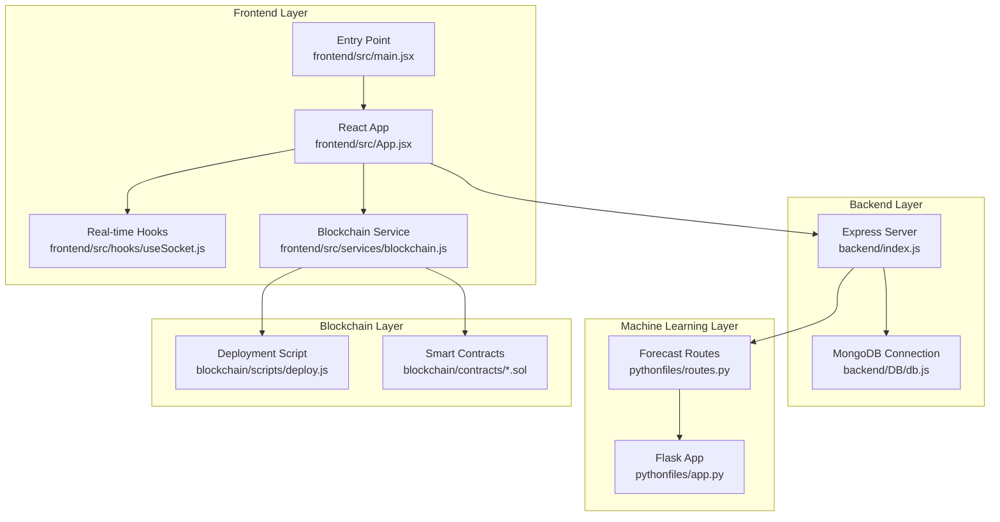
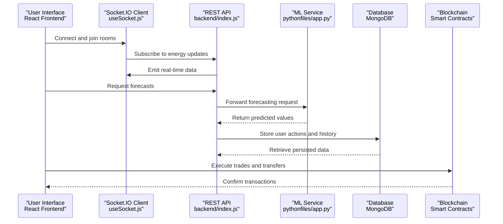

# Project Overview

<cite>
**Referenced Files in This Document**
- [README.md](file://README.md)
- [frontend/package.json](file://frontend/package.json)
- [backend/package.json](file://backend/package.json)
- [blockchain/package.json](file://blockchain/package.json)
- [pythonfiles/requirements.txt](file://pythonfiles/requirements.txt)
- [frontend/src/main.jsx](file://frontend/src/main.jsx)
- [frontend/src/App.jsx](file://frontend/src/App.jsx)
- [backend/index.js](file://backend/index.js)
- [backend/DB/db.js](file://backend/DB/db.js)
- [blockchain/scripts/deploy.js](file://blockchain/scripts/deploy.js)
- [blockchain/contracts/EnergyToken.sol](file://blockchain/contracts/EnergyToken.sol)
- [frontend/src/services/blockchain.js](file://frontend/src/services/blockchain.js)
- [frontend/src/hooks/useSocket.js](file://frontend/src/hooks/useSocket.js)
- [pythonfiles/app.py](file://pythonfiles/app.py)
- [pythonfiles/routes.py](file://pythonfiles/routes.py)
</cite>

## Table of Contents
1. [Introduction](#introduction)
2. [Project Structure](#project-structure)
3. [Core Components](#core-components)
4. [Architecture Overview](#architecture-overview)
5. [Technology Stack](#technology-stack)
6. [Key Features](#key-features)
7. [How It Addresses Sustainable Energy Challenges](#how-it-addresses-sustainable-energy-challenges)
8. [Conclusion](#conclusion)

## Introduction

EcoGrid is a comprehensive sustainable energy management platform designed to revolutionize how communities monitor, predict, and trade renewable energy in real time. The platform integrates cutting-edge technologies to deliver:

- Real-time energy monitoring and visualization
- AI-powered forecasting using machine learning models
- Peer-to-peer (P2P) energy trading facilitated by blockchain technology
- Seamless user experience through a modern, responsive web interface

At its core, EcoGrid enables prosumers (energy producers and consumers) and consumers to participate in a decentralized energy economy while promoting sustainability through intelligent resource allocation and transparent market mechanisms.

## Project Structure

The platform follows a multi-layered architecture organized into four primary domains:

- Frontend: React-based single-page application with real-time communication via Socket.IO
- Backend: Node.js server providing REST APIs, authentication, and WebSocket connections
- Machine Learning: Python Flask service hosting XGBoost models for energy forecasting
- Blockchain: Solidity smart contracts deployed on Polygon Amoy Testnet for tokenized energy trading

**Diagram sources**
- [frontend/src/main.jsx](file://frontend/src/main.jsx#L1-L15)
- [frontend/src/App.jsx](file://frontend/src/App.jsx#L1-L79)
- [frontend/src/hooks/useSocket.js](file://frontend/src/hooks/useSocket.js#L1-L142)
- [frontend/src/services/blockchain.js](file://frontend/src/services/blockchain.js#L1-L261)
- [backend/index.js](file://backend/index.js#L1-L97)
- [backend/DB/db.js](file://backend/DB/db.js#L1-L12)
- [pythonfiles/app.py](file://pythonfiles/app.py#L1-L15)
- [pythonfiles/routes.py](file://pythonfiles/routes.py#L1-L49)
- [blockchain/scripts/deploy.js](file://blockchain/scripts/deploy.js#L1-L29)
- [blockchain/contracts/EnergyToken.sol](file://blockchain/contracts/EnergyToken.sol#L1-L55)

**Section sources**
- [README.md](file://README.md#L5-L65)
- [frontend/src/main.jsx](file://frontend/src/main.jsx#L1-L15)
- [frontend/src/App.jsx](file://frontend/src/App.jsx#L1-L79)
- [backend/index.js](file://backend/index.js#L1-L97)
- [backend/DB/db.js](file://backend/DB/db.js#L1-L12)
- [pythonfiles/app.py](file://pythonfiles/app.py#L1-L15)
- [pythonfiles/routes.py](file://pythonfiles/routes.py#L1-L49)
- [blockchain/scripts/deploy.js](file://blockchain/scripts/deploy.js#L1-L29)
- [blockchain/contracts/EnergyToken.sol](file://blockchain/contracts/EnergyToken.sol#L1-L55)

## Core Components

### Frontend (React)
- Application entry point initializes authentication context and renders routing
- Real-time communication handled via Socket.IO client hooks
- Blockchain integration through ethers.js for wallet connection and contract interactions
- Responsive UI built with Tailwind CSS and animated components using Framer Motion

### Backend (Node.js)
- Express server with CORS configuration for cross-origin communication
- MongoDB connection for persistent user and system data
- Socket.IO integration for real-time energy updates and marketplace notifications
- Modular routing for authentication, listings, dashboards, community, and transactions

### Machine Learning (Python Flask)
- XGBoost-based forecasting models for energy demand, supply, and pricing
- RESTful endpoints for predictive analytics with configurable time horizons
- Support for historical date ranges and batch forecasting requests

### Blockchain (Solidity)
- ERC20-based EnergyToken for tradable energy units
- EnergyExchange for order book-based P2P trading
- EnergyAMM for automated market maker liquidity provision
- Deployment automation via Hardhat scripts targeting Polygon Amoy Testnet

**Section sources**
- [frontend/src/main.jsx](file://frontend/src/main.jsx#L1-L15)
- [frontend/src/App.jsx](file://frontend/src/App.jsx#L1-L79)
- [frontend/src/hooks/useSocket.js](file://frontend/src/hooks/useSocket.js#L1-L142)
- [frontend/src/services/blockchain.js](file://frontend/src/services/blockchain.js#L1-L261)
- [backend/index.js](file://backend/index.js#L1-L97)
- [backend/DB/db.js](file://backend/DB/db.js#L1-L12)
- [pythonfiles/app.py](file://pythonfiles/app.py#L1-L15)
- [pythonfiles/routes.py](file://pythonfiles/routes.py#L1-L49)
- [blockchain/scripts/deploy.js](file://blockchain/scripts/deploy.js#L1-L29)
- [blockchain/contracts/EnergyToken.sol](file://blockchain/contracts/EnergyToken.sol#L1-L55)

## Architecture Overview

EcoGrid employs a distributed, event-driven architecture that connects four distinct layers:

**Diagram sources**
- [frontend/src/hooks/useSocket.js](file://frontend/src/hooks/useSocket.js#L1-L142)
- [backend/index.js](file://backend/index.js#L1-L97)
- [pythonfiles/app.py](file://pythonfiles/app.py#L1-L15)
- [backend/DB/db.js](file://backend/DB/db.js#L1-L12)
- [frontend/src/services/blockchain.js](file://frontend/src/services/blockchain.js#L1-L261)

The architecture ensures:
- Real-time bidirectional communication for live energy monitoring
- Scalable microservice separation between ML and backend concerns
- Immutable, transparent transactions through blockchain
- Persistent state management for user profiles and activity logs

## Technology Stack

EcoGrid leverages a modern, full-stack technology combination optimized for performance, scalability, and developer productivity:

- **Frontend**: React.js with React Router for SPA navigation, Socket.IO Client for real-time updates, and Tailwind CSS for responsive design
- **Backend**: Node.js with Express for REST APIs, Socket.IO for real-time events, and MongoDB for data persistence
- **Machine Learning**: Python Flask serving XGBoost models with pandas/numpy for data processing and scikit-learn for preprocessing
- **Blockchain**: Solidity smart contracts compiled with Hardhat, deployed on Polygon Amoy Testnet using OpenZeppelin libraries
- **Additional Tools**: Ethers.js for wallet integration, dotenv for environment configuration, and various UI libraries for enhanced UX

**Section sources**
- [README.md](file://README.md#L138-L158)
- [frontend/package.json](file://frontend/package.json#L1-L50)
- [backend/package.json](file://backend/package.json#L1-L29)
- [blockchain/package.json](file://blockchain/package.json#L1-L11)
- [pythonfiles/requirements.txt](file://pythonfiles/requirements.txt#L1-L8)

## Key Features

EcoGrid delivers a comprehensive suite of capabilities tailored to sustainable energy management:

- **Authentication System**: Secure user registration, login, and session persistence with JWT tokens
- **Energy Dashboard**: Real-time monitoring of production, consumption, and grid interactions with interactive visualizations
- **AI-Powered Forecasting**: Predictive analytics for energy demand, supply, and pricing using trained XGBoost models
- **P2P Energy Marketplace**: Decentralized trading platform enabling direct energy exchanges with transparent pricing
- **Responsive Design**: Mobile-first interface with smooth animations and intuitive navigation

These features collectively enable users to optimize energy usage, reduce costs, and contribute to a more sustainable energy ecosystem.

**Section sources**
- [README.md](file://README.md#L110-L137)

## How It Addresses Sustainable Energy Challenges

EcoGrid tackles key sustainability challenges through innovative technology integration:

- **Decentralization and Transparency**: Blockchain-based tokenization eliminates intermediaries and ensures transparent, auditable energy transactions
- **Intelligent Resource Allocation**: AI-driven forecasting helps balance supply and demand, reducing waste and optimizing grid stability
- **Peer-to-Peer Empowerment**: P2P trading enables local energy sharing, strengthening community resilience and reducing transmission losses
- **Real-Time Visibility**: Continuous monitoring and alerts help users make informed decisions about consumption and generation
- **Scalable Infrastructure**: Modular architecture supports future expansion to additional markets and regions

By combining real-time monitoring, predictive analytics, and decentralized trading, EcoGrid creates a self-reinforcing loop that encourages sustainable energy practices while maintaining economic incentives for participation.

## Conclusion

EcoGrid represents a paradigm shift toward decentralized, intelligent energy management. Through its integrated architecture spanning frontend, backend, machine learning, and blockchain layers, the platform provides a robust foundation for sustainable energy communities. The combination of real-time monitoring, AI-powered insights, and transparent P2P trading establishes EcoGrid as a comprehensive solution for modern energy challenges, fostering both environmental responsibility and economic opportunity.