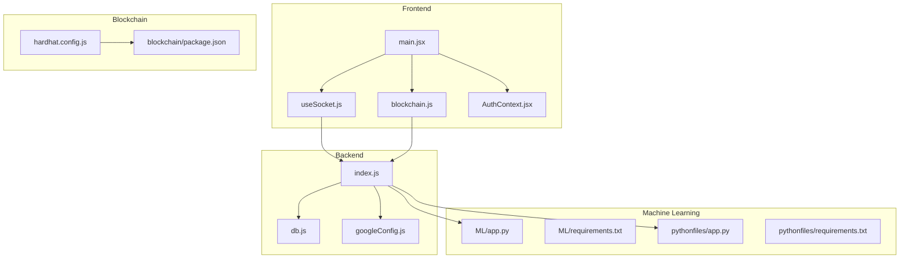
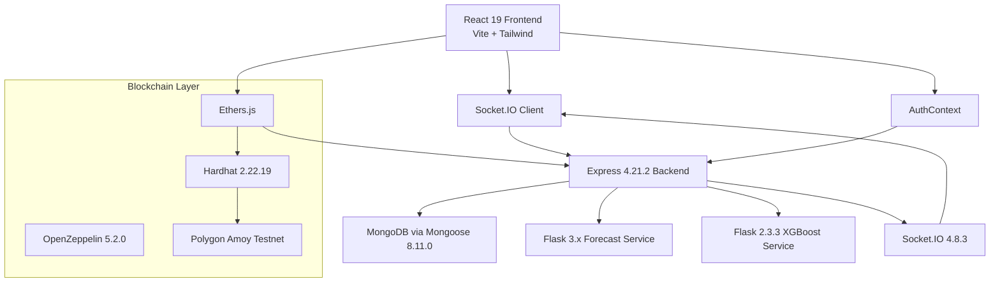
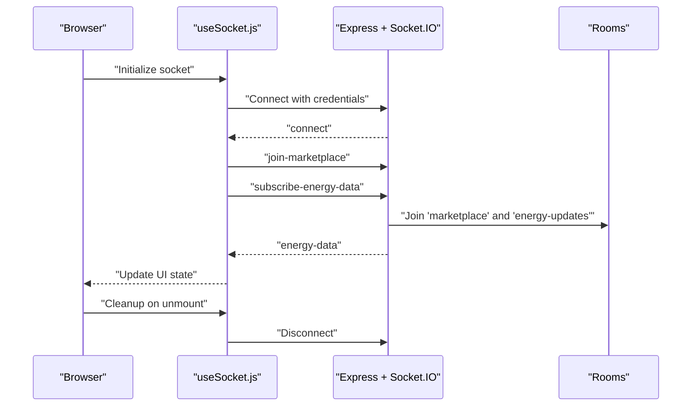
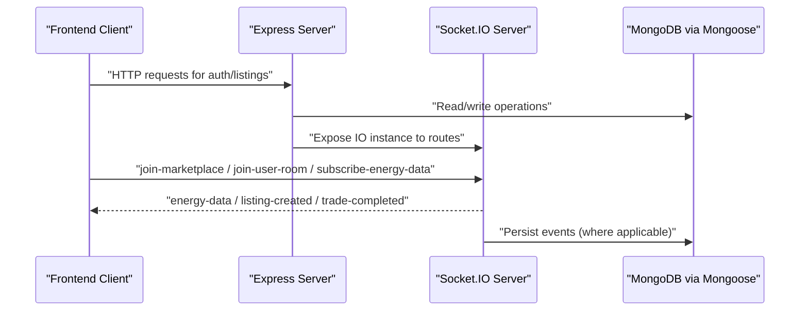
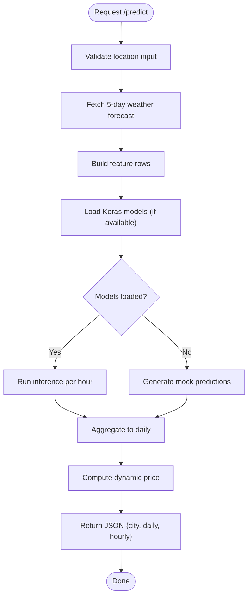
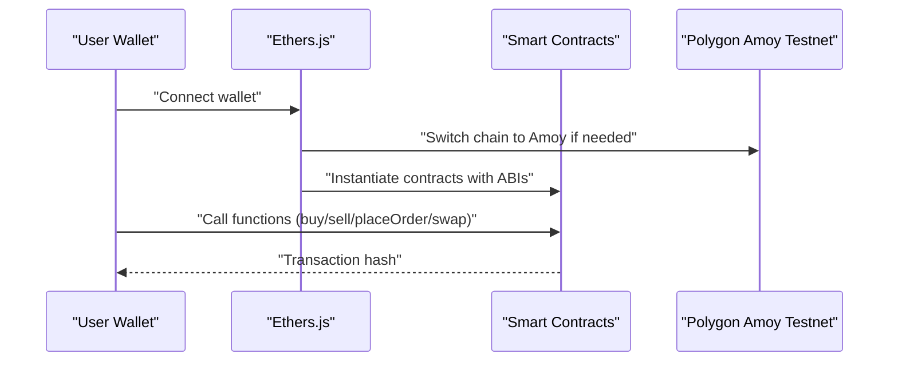
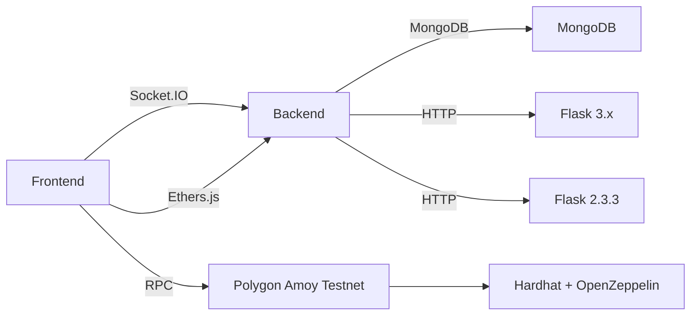

# Technology Stack

<cite>
**Referenced Files in This Document**
- [frontend/package.json](file://frontend/package.json)
- [frontend/vite.config.js](file://frontend/vite.config.js)
- [frontend/src/main.jsx](file://frontend/src/main.jsx)
- [frontend/src/hooks/useSocket.js](file://frontend/src/hooks/useSocket.js)
- [frontend/src/services/blockchain.js](file://frontend/src/services/blockchain.js)
- [frontend/src/Context/AuthContext.jsx](file://frontend/src/Context/AuthContext.jsx)
- [backend/package.json](file://backend/package.json)
- [backend/index.js](file://backend/index.js)
- [backend/DB/db.js](file://backend/DB/db.js)
- [backend/utils/googleConfig.js](file://backend/utils/googleConfig.js)
- [blockchain/package.json](file://blockchain/package.json)
- [blockchain/hardhat.config.js](file://blockchain/hardhat.config.js)
- [ML/app.py](file://ML/app.py)
- [ML/requirements.txt](file://ML/requirements.txt)
- [pythonfiles/app.py](file://pythonfiles/app.py)
- [pythonfiles/requirements.txt](file://pythonfiles/requirements.txt)
</cite>

## Table of Contents
1. [Introduction](#introduction)
2. [Project Structure](#project-structure)
3. [Core Components](#core-components)
4. [Architecture Overview](#architecture-overview)
5. [Detailed Component Analysis](#detailed-component-analysis)
6. [Dependency Analysis](#dependency-analysis)
7. [Performance Considerations](#performance-considerations)
8. [Troubleshooting Guide](#troubleshooting-guide)
9. [Conclusion](#conclusion)

## Introduction
This document presents the complete technology stack for the EcoGrid platform, detailing the frontend, backend, machine learning, and blockchain layers. It explains the frameworks, libraries, and protocols used, along with integration patterns, real-time communication, and cross-layer dependencies. The goal is to provide a clear understanding of how the system components work together to deliver a scalable, secure, and responsive energy trading and monitoring platform.

## Project Structure
The repository is organized into four primary layers:
- Frontend: React 19 with Vite, Tailwind CSS, and modern JS features
- Backend: Node.js with Express 4.21.2, Socket.IO 4.8.3, and Mongoose 8.11.0
- Machine Learning: Python Flask 2.x serving prediction APIs
- Blockchain: Hardhat 2.22.19 with OpenZeppelin 5.2.0 and Ethers.js 6.13.5 on Polygon Amoy testnet

**Diagram sources**
- [frontend/src/main.jsx](file://frontend/src/main.jsx#L1-L15)
- [frontend/src/hooks/useSocket.js](file://frontend/src/hooks/useSocket.js#L1-L142)
- [frontend/src/services/blockchain.js](file://frontend/src/services/blockchain.js#L1-L261)
- [frontend/src/Context/AuthContext.jsx](file://frontend/src/Context/AuthContext.jsx#L1-L70)
- [backend/index.js](file://backend/index.js#L1-L97)
- [backend/DB/db.js](file://backend/DB/db.js#L1-L12)
- [backend/utils/googleConfig.js](file://backend/utils/googleConfig.js#L1-L14)
- [ML/app.py](file://ML/app.py#L1-L251)
- [ML/requirements.txt](file://ML/requirements.txt#L1-L4)
- [pythonfiles/app.py](file://pythonfiles/app.py#L1-L15)
- [pythonfiles/requirements.txt](file://pythonfiles/requirements.txt#L1-L8)
- [blockchain/hardhat.config.js](file://blockchain/hardhat.config.js#L1-L12)
- [blockchain/package.json](file://blockchain/package.json#L1-L11)

**Section sources**
- [frontend/package.json](file://frontend/package.json#L1-L50)
- [frontend/vite.config.js](file://frontend/vite.config.js#L1-L18)
- [backend/package.json](file://backend/package.json#L1-L29)
- [blockchain/package.json](file://blockchain/package.json#L1-L11)
- [ML/requirements.txt](file://ML/requirements.txt#L1-L4)
- [pythonfiles/requirements.txt](file://pythonfiles/requirements.txt#L1-L8)

## Core Components
- Frontend stack
  - React 19.0.0 with React DOM 19.0.0
  - Vite 6.2.0 for dev/build tooling
  - Tailwind CSS v4.2.1 via @tailwindcss/vite
  - Socket.IO client 4.8.1 for real-time updates
  - Ethers.js 6.13.5 for wallet and contract interactions
  - Additional UI and utility libraries for forms, charts, and animations
- Backend stack
  - Express 4.21.2 with HTTP server hosting
  - Socket.IO 4.8.3 for bidirectional real-time events
  - Mongoose 8.11.0 for MongoDB connectivity
  - Middleware for CORS, body parsing, cookie parsing, JWT, and Google OAuth
- Machine Learning stack
  - Flask 3.x (ML/app.py) and Flask 2.3.3 (pythonfiles/app.py)
  - TensorFlow/Keras for model loading and inference
  - Requests for weather API calls
  - NumPy, Pandas, XGBoost for data processing and forecasting
- Blockchain stack
  - Hardhat 2.22.19 with Hardhat Toolbox
  - OpenZeppelin 5.2.0 contracts library
  - Ethers.js 6.13.5 for wallet and contract interactions
  - Polygon Amoy testnet configuration

**Section sources**
- [frontend/package.json](file://frontend/package.json#L12-L48)
- [backend/package.json](file://backend/package.json#L13-L27)
- [blockchain/package.json](file://blockchain/package.json#L2-L9)
- [ML/app.py](file://ML/app.py#L1-L251)
- [ML/requirements.txt](file://ML/requirements.txt#L1-L4)
- [pythonfiles/app.py](file://pythonfiles/app.py#L1-L15)
- [pythonfiles/requirements.txt](file://pythonfiles/requirements.txt#L1-L8)
- [blockchain/hardhat.config.js](file://blockchain/hardhat.config.js#L4-L11)

## Architecture Overview
The EcoGrid platform integrates four layers:
- Frontend: React SPA with real-time updates via Socket.IO and blockchain interactions via Ethers.js
- Backend: Express server with Socket.IO for live energy data and Mongoose for persistent data
- Machine Learning: Separate Flask services for weather-dependent energy forecasting
- Blockchain: Smart contracts deployed on Polygon Amoy testnet, managed via Hardhat

**Diagram sources**
- [frontend/src/main.jsx](file://frontend/src/main.jsx#L1-L15)
- [frontend/src/hooks/useSocket.js](file://frontend/src/hooks/useSocket.js#L1-L142)
- [frontend/src/services/blockchain.js](file://frontend/src/services/blockchain.js#L1-L261)
- [frontend/src/Context/AuthContext.jsx](file://frontend/src/Context/AuthContext.jsx#L1-L70)
- [backend/index.js](file://backend/index.js#L1-L97)
- [backend/DB/db.js](file://backend/DB/db.js#L1-L12)
- [ML/app.py](file://ML/app.py#L1-L251)
- [pythonfiles/app.py](file://pythonfiles/app.py#L1-L15)
- [blockchain/hardhat.config.js](file://blockchain/hardhat.config.js#L1-L12)

## Detailed Component Analysis

### Frontend Stack
- Build and tooling
  - Vite 6.2.0 configured with React plugin and Tailwind CSS integration
  - Path aliases for modular imports
- Runtime dependencies
  - React 19.0.0 and React DOM 19.0.0 for UI
  - Socket.IO client 4.8.1 for real-time updates
  - Ethers.js 6.13.5 for wallet and contract interactions
  - Recharts 2.15.1 for energy dashboards
  - Radix UI, Headless UI, Lucide icons for accessible UI primitives
- Real-time integration
  - useSocket hook manages connection lifecycle, rooms, and event listeners
  - Emits and listens to marketplace, trade, and energy data events
- Authentication
  - AuthProvider wraps the app and handles profile retrieval and token persistence
- Styling
  - Tailwind v4.2.1 with @tailwindcss/vite for utility-first CSS

**Diagram sources**
- [frontend/src/hooks/useSocket.js](file://frontend/src/hooks/useSocket.js#L12-L88)
- [backend/index.js](file://backend/index.js#L48-L89)

**Section sources**
- [frontend/vite.config.js](file://frontend/vite.config.js#L1-L18)
- [frontend/package.json](file://frontend/package.json#L12-L48)
- [frontend/src/hooks/useSocket.js](file://frontend/src/hooks/useSocket.js#L1-L142)
- [frontend/src/Context/AuthContext.jsx](file://frontend/src/Context/AuthContext.jsx#L1-L70)

### Backend Stack
- Server and transport
  - Express 4.21.2 with HTTP server hosting
  - Socket.IO 4.8.3 for real-time bidirectional events
- Persistence
  - Mongoose 8.11.0 connecting to MongoDB via environment-provided URI
- Authentication and integrations
  - JSON Web Token middleware, cookie parser, body parser, CORS
  - Google OAuth client configuration for third-party sign-in
- Real-time energy data
  - Simulated smart meter data emitted every 10 seconds to clients subscribed to the energy updates room
  - Room-based subscriptions for user-specific and marketplace events

**Diagram sources**
- [backend/index.js](file://backend/index.js#L1-L97)
- [backend/DB/db.js](file://backend/DB/db.js#L1-L12)
- [backend/utils/googleConfig.js](file://backend/utils/googleConfig.js#L1-L14)

**Section sources**
- [backend/package.json](file://backend/package.json#L13-L27)
- [backend/index.js](file://backend/index.js#L1-L97)
- [backend/DB/db.js](file://backend/DB/db.js#L1-L12)
- [backend/utils/googleConfig.js](file://backend/utils/googleConfig.js#L1-L14)

### Machine Learning Stack
- Flask 3.x service (ML/app.py)
  - Loads Keras/TensorFlow models (.h5) for demand, price, and produced energy forecasting
  - Fetches 5-day weather forecast from OpenWeatherMap and builds feature vectors
  - Aggregates hourly predictions to daily summaries and computes dynamic pricing
  - Returns structured JSON for consumption by the backend
- Flask 2.3.3 service (pythonfiles/app.py)
  - Registers blueprints and configures CORS
  - Provides a dedicated endpoint for XGBoost-based forecasting pipeline
- Dependencies
  - ML service: Flask 3.x, TensorFlow/Keras, NumPy, Requests
  - Pythonfiles service: Flask 2.3.3, XGBoost 2.0.0, Pandas 2.1.0, NumPy 1.25.2

**Diagram sources**
- [ML/app.py](file://ML/app.py#L195-L247)

**Section sources**
- [ML/app.py](file://ML/app.py#L1-L251)
- [ML/requirements.txt](file://ML/requirements.txt#L1-L4)
- [pythonfiles/app.py](file://pythonfiles/app.py#L1-L15)
- [pythonfiles/requirements.txt](file://pythonfiles/requirements.txt#L1-L8)

### Blockchain Stack
- Development framework
  - Hardhat 2.22.19 with Hardhat Toolbox for testing, compilation, and deployment
  - OpenZeppelin 5.2.0 contracts library for secure, audited implementations
- Network configuration
  - Polygon Amoy testnet RPC URL and private key from environment variables
- Wallet and contract interactions
  - Ethers.js 6.13.5 for provider, signer, and contract instances
  - Automatic chain switching to Polygon Amoy and contract ABI bindings
  - Functions for token balances, dynamic pricing, orders, and AMM swaps

**Diagram sources**
- [frontend/src/services/blockchain.js](file://frontend/src/services/blockchain.js#L52-L130)
- [blockchain/hardhat.config.js](file://blockchain/hardhat.config.js#L4-L11)

**Section sources**
- [blockchain/package.json](file://blockchain/package.json#L1-L11)
- [blockchain/hardhat.config.js](file://blockchain/hardhat.config.js#L1-L12)
- [frontend/src/services/blockchain.js](file://frontend/src/services/blockchain.js#L1-L261)

## Dependency Analysis
- Frontend dependencies
  - React ecosystem (React 19, React Router Dom 7.x), UI libraries (Radix UI, Headless UI, Lucide), and utilities (Axios, Zod, clsx)
  - Real-time and blockchain: Socket.IO client 4.8.1, Ethers.js 6.13.5
  - Build tooling: Vite 6.2.0, Tailwind CSS 4.2.1, PostCSS, autoprefixer
- Backend dependencies
  - Express 4.21.2, Socket.IO 4.8.3, Mongoose 8.11.0
  - Utilities: bcryptjs, jsonwebtoken, cookie-parser, cors, dotenv, nodemailer, google-auth-library
- Machine Learning dependencies
  - Flask 3.x (ML) and Flask 2.3.3 (pythonfiles), TensorFlow/Keras, NumPy, Pandas, XGBoost
- Blockchain dependencies
  - Hardhat 2.22.19, @nomicfoundation/hardhat-toolbox, @openzeppelin/contracts 5.2.0

**Diagram sources**
- [frontend/package.json](file://frontend/package.json#L12-L48)
- [backend/package.json](file://backend/package.json#L13-L27)
- [ML/requirements.txt](file://ML/requirements.txt#L1-L4)
- [pythonfiles/requirements.txt](file://pythonfiles/requirements.txt#L1-L8)
- [blockchain/package.json](file://blockchain/package.json#L1-L11)

**Section sources**
- [frontend/package.json](file://frontend/package.json#L12-L48)
- [backend/package.json](file://backend/package.json#L13-L27)
- [ML/requirements.txt](file://ML/requirements.txt#L1-L4)
- [pythonfiles/requirements.txt](file://pythonfiles/requirements.txt#L1-L8)
- [blockchain/package.json](file://blockchain/package.json#L1-L11)

## Performance Considerations
- Frontend
  - Use Vite’s fast refresh and optimized bundling for development and production builds
  - Minimize re-renders by leveraging React 19 features and memoization where appropriate
  - Defer heavy computations to background threads or Web Workers if needed
- Backend
  - Keep Socket.IO rooms scoped to reduce broadcast overhead
  - Persist only essential data to MongoDB; leverage caching for frequently accessed resources
  - Tune interval emissions for energy data to balance responsiveness and bandwidth
- Machine Learning
  - Preload models once and reuse across requests to avoid repeated disk I/O
  - Batch inference requests when possible and cache recent forecasts
- Blockchain
  - Batch transactions and use estimateGas to optimize fees
  - Poll for chain changes and account changes efficiently to avoid redundant calls

## Troubleshooting Guide
- Socket.IO connection issues
  - Verify CORS configuration in the backend and matching frontend URL
  - Confirm environment variable for socket URL is set correctly
- MongoDB connection failures
  - Ensure MONGO_URI is present and reachable; check network and credentials
- Weather API errors
  - Validate OpenWeatherMap API key and rate limits; handle HTTP 401/404 gracefully
- Blockchain connectivity
  - Confirm Polygon Amoy RPC URL and private key are configured
  - Ensure MetaMask is installed and chain is switched to Amoy before interacting

**Section sources**
- [backend/index.js](file://backend/index.js#L18-L24)
- [frontend/src/hooks/useSocket.js](file://frontend/src/hooks/useSocket.js#L4-L17)
- [backend/DB/db.js](file://backend/DB/db.js#L3-L6)
- [ML/app.py](file://ML/app.py#L205-L215)
- [frontend/src/services/blockchain.js](file://frontend/src/services/blockchain.js#L52-L101)

## Conclusion
EcoGrid leverages a modern, layered architecture combining React 19 with Vite, Express and Socket.IO for real-time backend services, robust machine learning pipelines with Flask and XGBoost/Pandas/NumPy, and a secure blockchain layer powered by Hardhat and OpenZeppelin on Polygon Amoy. The documented integration patterns and dependency configurations enable scalable development, maintainable code, and seamless real-time experiences across the platform.