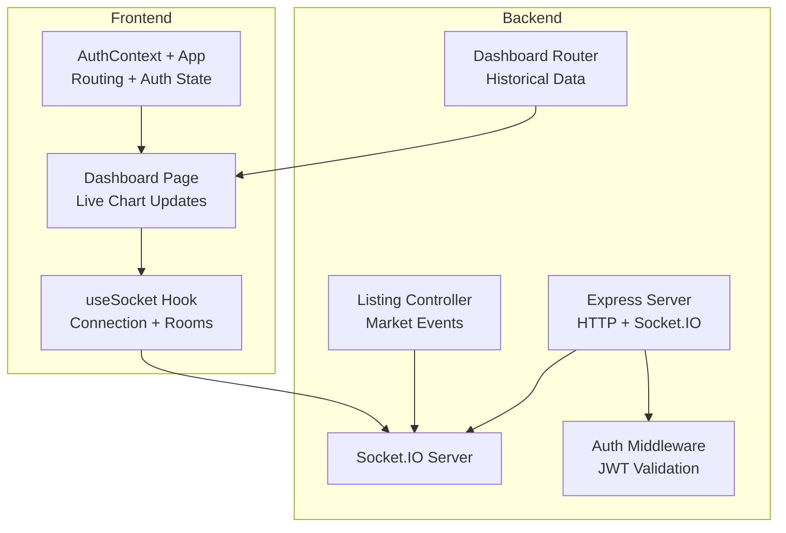
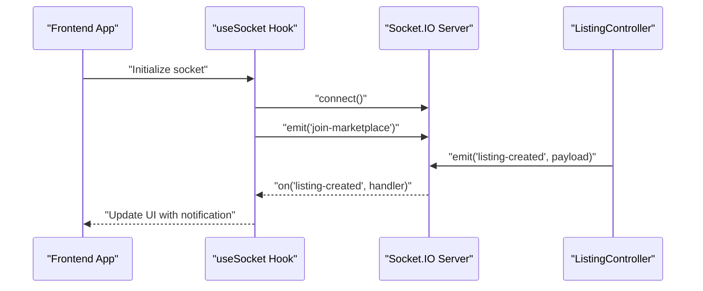
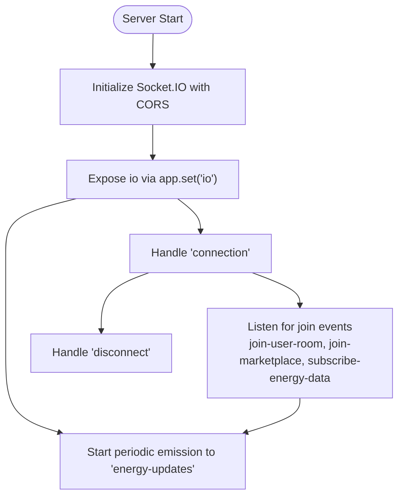
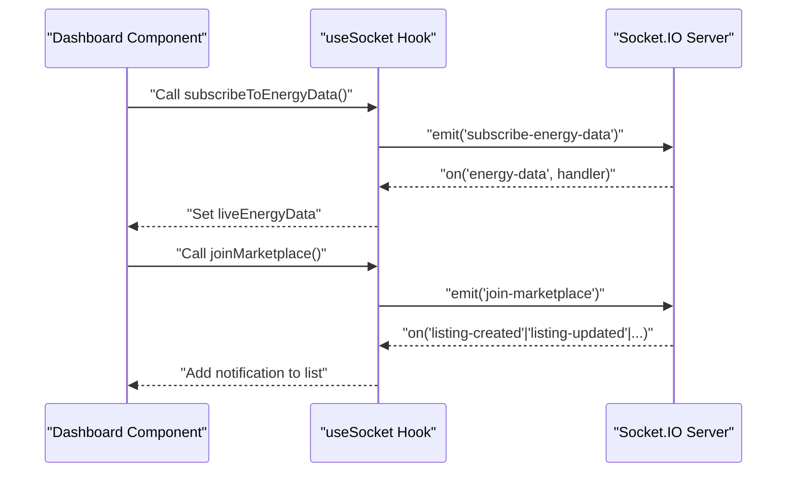
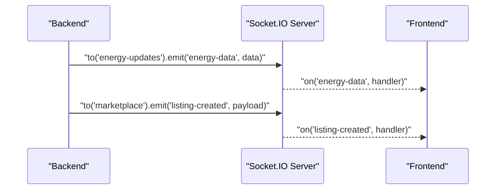
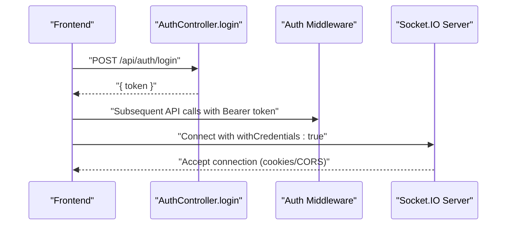
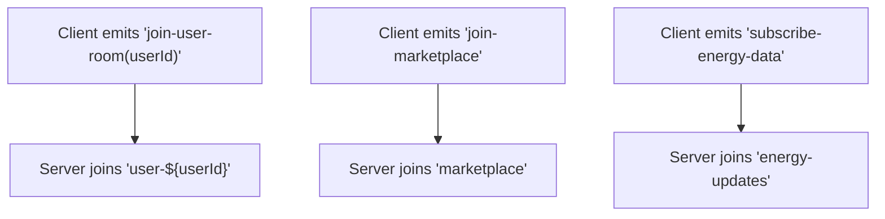
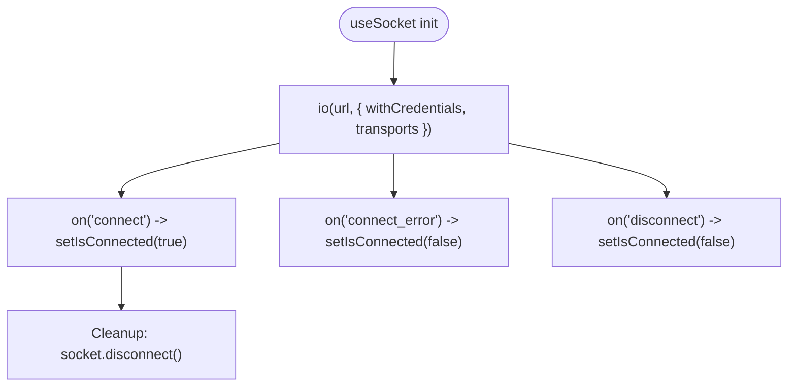
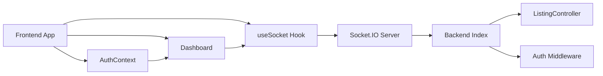

# Real-time Communication

<cite>
**Referenced Files in This Document**
- [index.js](file://backend/index.js)
- [useSocket.js](file://frontend/src/hooks/useSocket.js)
- [Dashboard.jsx](file://frontend/src/frontend/Dashboard.jsx)
- [Auth.js](file://backend/Middlewares/Auth.js)
- [AuthController.js](file://backend/Controllers/AuthController.js)
- [ListingController.js](file://backend/Controllers/ListingController.js)
- [ListingRouter.js](file://backend/Routes/ListingRouter.js)
- [DashboardRouter.js](file://backend/Routes/DashboardRouter.js)
- [Users.js](file://backend/Models/Users.js)
- [App.jsx](file://frontend/src/App.jsx)
- [AuthContext.jsx](file://frontend/src/Context/AuthContext.jsx)
</cite>

## Table of Contents
1. [Introduction](#introduction)
2. [Project Structure](#project-structure)
3. [Core Components](#core-components)
4. [Architecture Overview](#architecture-overview)
5. [Detailed Component Analysis](#detailed-component-analysis)
6. [Dependency Analysis](#dependency-analysis)
7. [Performance Considerations](#performance-considerations)
8. [Troubleshooting Guide](#troubleshooting-guide)
9. [Conclusion](#conclusion)
10. [Appendices](#appendices)

## Introduction
This document explains the real-time communication system built with Socket.IO for live data streaming. It covers server-side configuration, client-side integration, event-driven architecture for energy data, marketplace updates, and user-specific notifications. It also documents authentication integration via JWT, room-based communication patterns, connection management, reconnection handling, error recovery, message protocols, performance optimization, and monitoring strategies.

## Project Structure
The real-time system spans the backend Express server with Socket.IO and the frontend React application with a dedicated socket hook. Authentication is handled via JWT middleware and controller endpoints. Market updates are emitted from listing creation/update/delete handlers.

**Diagram sources**
- [index.js](file://backend/index.js#L18-L24)
- [useSocket.js](file://frontend/src/hooks/useSocket.js#L1-L142)
- [Auth.js](file://backend/Middlewares/Auth.js#L1-L19)
- [ListingController.js](file://backend/Controllers/ListingController.js#L58-L99)
- [Dashboard.jsx](file://frontend/src/frontend/Dashboard.jsx#L25-L125)
- [AuthContext.jsx](file://frontend/src/Context/AuthContext.jsx#L7-L53)

**Section sources**
- [index.js](file://backend/index.js#L1-L97)
- [useSocket.js](file://frontend/src/hooks/useSocket.js#L1-L142)
- [Auth.js](file://backend/Middlewares/Auth.js#L1-L19)
- [ListingController.js](file://backend/Controllers/ListingController.js#L1-L253)
- [Dashboard.jsx](file://frontend/src/frontend/Dashboard.jsx#L1-L267)
- [AuthContext.jsx](file://frontend/src/Context/AuthContext.jsx#L1-L70)

## Core Components
- Backend Socket.IO server with CORS configuration and connection handler.
- Room-based subscriptions for user-specific and marketplace events.
- Periodic emission of simulated energy data to the “energy-updates” room.
- Frontend socket hook managing connection lifecycle, rooms, and event listeners.
- Market events emitted on listing create/update/delete to the “marketplace” room.
- JWT-based authentication middleware and login controller.

Key implementation references:
- Server initialization and connection handler: [index.js](file://backend/index.js#L18-L73)
- Energy data emission loop: [index.js](file://backend/index.js#L75-L89)
- Frontend socket hook: [useSocket.js](file://frontend/src/hooks/useSocket.js#L1-L142)
- Market event emissions: [ListingController.js](file://backend/Controllers/ListingController.js#L81-L85), [ListingController.js](file://backend/Controllers/ListingController.js#L136-L143), [ListingController.js](file://backend/Controllers/ListingController.js#L185-L189)
- JWT auth middleware: [Auth.js](file://backend/Middlewares/Auth.js#L1-L19)
- Login controller (JWT issuance): [AuthController.js](file://backend/Controllers/AuthController.js#L105-L155)

**Section sources**
- [index.js](file://backend/index.js#L18-L89)
- [useSocket.js](file://frontend/src/hooks/useSocket.js#L1-L142)
- [ListingController.js](file://backend/Controllers/ListingController.js#L58-L199)
- [Auth.js](file://backend/Middlewares/Auth.js#L1-L19)
- [AuthController.js](file://backend/Controllers/AuthController.js#L105-L155)

## Architecture Overview
The system uses a publish-subscribe pattern:
- Clients connect to the Socket.IO server and join rooms.
- Backend emits events to specific rooms for targeted delivery.
- Frontend listens for events and updates UI state.

**Diagram sources**
- [useSocket.js](file://frontend/src/hooks/useSocket.js#L97-L102)
- [ListingController.js](file://backend/Controllers/ListingController.js#L81-L85)
- [index.js](file://backend/index.js#L48-L61)

**Section sources**
- [index.js](file://backend/index.js#L48-L89)
- [useSocket.js](file://frontend/src/hooks/useSocket.js#L1-L142)
- [ListingController.js](file://backend/Controllers/ListingController.js#L58-L199)

## Detailed Component Analysis

### Server-Side Socket.IO Configuration
- Initializes HTTP server and Socket.IO with CORS allowing credentials and specific origin.
- Exposes io instance to route handlers via app.set('io').
- Handles connection events and joins rooms for user-specific and marketplace channels.
- Emits periodic energy data to the “energy-updates” room.

**Diagram sources**
- [index.js](file://backend/index.js#L18-L24)
- [index.js](file://backend/index.js#L37-L38)
- [index.js](file://backend/index.js#L48-L73)
- [index.js](file://backend/index.js#L75-L89)

**Section sources**
- [index.js](file://backend/index.js#L18-L97)

### Client-Side Integration Pattern (useSocket Hook)
- Establishes a persistent connection with credentials and fallback to polling if needed.
- Listens for connection/disconnection and errors.
- Subscribes to energy data and marketplace-related notifications.
- Provides helpers to join rooms and emit custom events.

**Diagram sources**
- [useSocket.js](file://frontend/src/hooks/useSocket.js#L104-L109)
- [useSocket.js](file://frontend/src/hooks/useSocket.js#L36-L82)
- [useSocket.js](file://frontend/src/hooks/useSocket.js#L97-L102)
- [Dashboard.jsx](file://frontend/src/frontend/Dashboard.jsx#L80-L125)

**Section sources**
- [useSocket.js](file://frontend/src/hooks/useSocket.js#L1-L142)
- [Dashboard.jsx](file://frontend/src/frontend/Dashboard.jsx#L25-L125)

### Event-Driven Architecture
- Energy data broadcasting:
  - Backend emits to “energy-updates” room every fixed interval.
  - Frontend receives and updates charts.
- Marketplace updates:
  - Backend emits “listing-created”, “listing-updated”, “listing-deleted” to “marketplace” room.
  - Frontend displays notifications and updates lists.
- Price updates:
  - Frontend listens for “price-update” and displays notifications.

**Diagram sources**
- [index.js](file://backend/index.js#L75-L85)
- [ListingController.js](file://backend/Controllers/ListingController.js#L81-L85)
- [useSocket.js](file://frontend/src/hooks/useSocket.js#L36-L82)

**Section sources**
- [index.js](file://backend/index.js#L75-L89)
- [ListingController.js](file://backend/Controllers/ListingController.js#L58-L199)
- [useSocket.js](file://frontend/src/hooks/useSocket.js#L36-L82)

### Authentication Integration with JWT
- JWT middleware validates Authorization header and attaches user to request.
- Login controller generates JWT and returns it to the client.
- Frontend stores token and uses it for protected API requests; Socket.IO uses cookies via withCredentials.

**Diagram sources**
- [Auth.js](file://backend/Middlewares/Auth.js#L1-L19)
- [AuthController.js](file://backend/Controllers/AuthController.js#L105-L155)
- [useSocket.js](file://frontend/src/hooks/useSocket.js#L14-L17)

**Section sources**
- [Auth.js](file://backend/Middlewares/Auth.js#L1-L19)
- [AuthController.js](file://backend/Controllers/AuthController.js#L105-L155)
- [useSocket.js](file://frontend/src/hooks/useSocket.js#L14-L17)

### Room-Based Communication Patterns
- User-specific room:
  - Client emits “join-user-room” with userId.
  - Backend joins socket to “user-${userId}”.
- Marketplace room:
  - Client emits “join-marketplace”.
  - Backend joins socket to “marketplace”.
- Energy updates:
  - Client emits “subscribe-energy-data”.
  - Backend joins socket to “energy-updates”.

**Diagram sources**
- [index.js](file://backend/index.js#L51-L67)
- [useSocket.js](file://frontend/src/hooks/useSocket.js#L90-L109)

**Section sources**
- [index.js](file://backend/index.js#L51-L67)
- [useSocket.js](file://frontend/src/hooks/useSocket.js#L90-L109)

### Message Protocols and Data Serialization
- Transport: WebSocket with polling fallback.
- Encoding: Engine.IO parser and Socket.IO parser handle binary/text frames.
- Payloads:
  - Energy data: JSON object containing timestamp, produced, consumed, gridPrice, solarOutput, windOutput.
  - Marketplace events: Listing objects for created/updated/deleted.
  - Notifications: Lightweight objects with id, type, message, data, timestamp.

References:
- Energy data emission: [index.js](file://backend/index.js#L75-L85)
- Listing events: [ListingController.js](file://backend/Controllers/ListingController.js#L81-L85), [ListingController.js](file://backend/Controllers/ListingController.js#L136-L143), [ListingController.js](file://backend/Controllers/ListingController.js#L185-L189)
- Frontend listeners: [useSocket.js](file://frontend/src/hooks/useSocket.js#L36-L82)

**Section sources**
- [index.js](file://backend/index.js#L75-L85)
- [ListingController.js](file://backend/Controllers/ListingController.js#L58-L199)
- [useSocket.js](file://frontend/src/hooks/useSocket.js#L36-L82)

### Connection Management, Reconnection, and Error Recovery
- Frontend:
  - Connects with credentials and transports array enabling WebSocket and polling.
  - Listens for connect, disconnect, and connect_error to manage UI state.
  - Disconnects on cleanup.
- Backend:
  - Logs connection and disconnection.
  - No explicit reconnection policy configured; clients handle retries via transports.

**Diagram sources**
- [useSocket.js](file://frontend/src/hooks/useSocket.js#L12-L88)

**Section sources**
- [useSocket.js](file://frontend/src/hooks/useSocket.js#L12-L88)
- [index.js](file://backend/index.js#L48-L73)

## Dependency Analysis
- Backend depends on:
  - Express HTTP server and Socket.IO.
  - MongoDB/Mongoose models (via controllers).
  - JWT middleware for protected routes.
- Frontend depends on:
  - socket.io-client.
  - React context for auth state.
  - Dashboard component for real-time chart updates.

**Diagram sources**
- [useSocket.js](file://frontend/src/hooks/useSocket.js#L1-L142)
- [Dashboard.jsx](file://frontend/src/frontend/Dashboard.jsx#L25-L125)
- [AuthContext.jsx](file://frontend/src/Context/AuthContext.jsx#L7-L53)
- [index.js](file://backend/index.js#L18-L24)
- [ListingController.js](file://backend/Controllers/ListingController.js#L58-L99)
- [Auth.js](file://backend/Middlewares/Auth.js#L1-L19)

**Section sources**
- [index.js](file://backend/index.js#L1-L97)
- [useSocket.js](file://frontend/src/hooks/useSocket.js#L1-L142)
- [ListingController.js](file://backend/Controllers/ListingController.js#L1-L253)
- [Auth.js](file://backend/Middlewares/Auth.js#L1-L19)
- [AuthContext.jsx](file://frontend/src/Context/AuthContext.jsx#L1-L70)
- [Dashboard.jsx](file://frontend/src/frontend/Dashboard.jsx#L1-L267)

## Performance Considerations
- Frequency tuning:
  - Adjust emission interval for energy data to balance responsiveness and load.
- Payload minimization:
  - Send only necessary fields in event payloads.
- Room targeting:
  - Use rooms to avoid broadcasting to all clients.
- Client-side throttling:
  - Debounce UI updates when receiving high-frequency events.
- Scalability:
  - Consider horizontal scaling with sticky sessions or a pub/sub bridge if needed.
- Transport selection:
  - Prefer WebSocket; polling is a fallback for constrained networks.

[No sources needed since this section provides general guidance]

## Troubleshooting Guide
- Connection issues:
  - Verify CORS origin and credentials configuration on the server.
  - Ensure frontend connects with withCredentials and transports enabled.
- Missing events:
  - Confirm client emits join events and server joins rooms.
  - Check that io instance is accessible in controllers via app.get('io').
- Authentication:
  - Ensure Authorization header is present for protected routes.
  - Validate JWT secret and expiration.
- Monitoring:
  - Enable debug logs for engine.io and socket.io on the server.
  - Log client connect/disconnect and error events on the frontend.

**Section sources**
- [index.js](file://backend/index.js#L18-L24)
- [useSocket.js](file://frontend/src/hooks/useSocket.js#L14-L17)
- [index.js](file://backend/index.js#L48-L73)
- [Auth.js](file://backend/Middlewares/Auth.js#L1-L19)

## Conclusion
The system implements a clean, event-driven real-time architecture using Socket.IO. Room-based communication enables targeted updates for user-specific and marketplace contexts. JWT-based authentication secures API access, while the frontend socket hook manages connection lifecycle and event handling. With proper tuning and monitoring, the system can scale to support high-frequency updates and concurrent users.

[No sources needed since this section summarizes without analyzing specific files]

## Appendices

### Appendix A: Room and Event Reference
- Rooms:
  - user-${userId}: user-specific notifications.
  - marketplace: marketplace listing updates.
  - energy-updates: live energy data.
- Events:
  - Client to server: join-user-room, join-marketplace, subscribe-energy-data.
  - Server to client: energy-data, listing-created, listing-updated, listing-deleted, price-update.

**Section sources**
- [index.js](file://backend/index.js#L51-L67)
- [useSocket.js](file://frontend/src/hooks/useSocket.js#L90-L109)
- [ListingController.js](file://backend/Controllers/ListingController.js#L81-L85)
- [useSocket.js](file://frontend/src/hooks/useSocket.js#L36-L82)